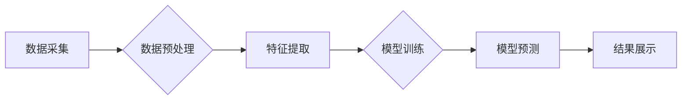

                 

## AI在空间探索和天文研究中的应用

> 关键词：人工智能、机器学习、深度学习、空间探索、天文研究、数据分析、图像识别、预测建模

## 1. 背景介绍

人类对宇宙的探索永无止境，从最初的望远镜观测到如今的探测器漫游，我们不断地向外探索，试图揭开宇宙的奥秘。然而，宇宙的浩瀚无垠，蕴藏着海量的未知信息，传统的观测和分析方法已难以满足我们日益增长的需求。

人工智能（AI）的兴起为空间探索和天文研究带来了前所未有的机遇。AI算法能够高效地处理海量天文数据，识别隐藏的模式，并进行预测建模，从而帮助我们更深入地理解宇宙的演化和结构。

## 2. 核心概念与联系

**2.1  AI在空间探索和天文研究中的应用**

AI技术在空间探索和天文研究中扮演着越来越重要的角色，主要体现在以下几个方面：

* **数据分析和处理:** 天文观测产生海量数据，AI算法能够快速高效地分析和处理这些数据，提取有价值的信息。
* **图像识别和分类:** AI算法能够识别和分类天体图像，例如星系、恒星、行星等，并自动标注其属性。
* **异常检测和预警:** AI算法能够识别异常事件，例如彗星撞击、黑洞活动等，并发出预警信号。
* **预测建模:** AI算法能够建立预测模型，例如行星轨迹预测、星系演化预测等，帮助我们更好地理解宇宙的规律。

**2.2  AI技术架构**

AI技术在空间探索和天文研究中的应用通常采用以下架构：



**数据采集:** 从天文望远镜、探测器等设备获取原始数据。

**数据预处理:** 对原始数据进行清洗、转换、降维等处理，使其适合AI算法的训练和使用。

**特征提取:** 从预处理后的数据中提取有价值的特征，例如颜色、形状、亮度等。

**模型训练:** 使用训练数据训练AI模型，例如深度学习模型、机器学习模型等。

**模型预测:** 将训练好的模型应用于新的数据，进行预测和分析。

**结果展示:** 将预测结果以图表、报告等形式展示出来。

## 3. 核心算法原理 & 具体操作步骤

**3.1  算法原理概述**

在空间探索和天文研究中，常用的AI算法包括：

* **机器学习:** 

    * **监督学习:** 利用标记数据训练模型，例如图像分类、目标检测等。
    * **无监督学习:** 从未标记数据中发现模式，例如聚类分析、降维等。
    * **强化学习:** 通过奖励机制训练模型，例如控制机器人、规划路径等。

* **深度学习:** 利用多层神经网络进行特征提取和学习，例如图像识别、自然语言处理等。

**3.2  算法步骤详解**

以图像分类为例，详细说明机器学习算法的步骤：

1. **数据收集:** 收集大量天文图像，并为每张图像标注其类别。
2. **数据预处理:** 对图像进行裁剪、缩放、增强等处理，使其符合模型的输入要求。
3. **特征提取:** 使用卷积神经网络（CNN）提取图像特征，例如边缘、纹理、形状等。
4. **模型训练:** 使用标记数据训练CNN模型，调整模型参数，使其能够准确地识别图像类别。
5. **模型评估:** 使用测试数据评估模型的性能，例如准确率、召回率等。
6. **模型部署:** 将训练好的模型部署到实际应用场景中，例如自动识别星系类型、行星表面特征等。

**3.3  算法优缺点**

**优点:**

* **自动化:** AI算法能够自动处理海量数据，提高效率。
* **准确性:** AI算法能够识别隐藏的模式，提高分析准确性。
* **可扩展性:** AI算法能够根据需要进行扩展，处理更复杂的数据。

**缺点:**

* **数据依赖:** AI算法需要大量数据进行训练，数据质量直接影响模型性能。
* **解释性:** 一些AI算法的决策过程难以解释，难以理解其背后的逻辑。
* **计算资源:** 训练复杂的AI模型需要大量的计算资源。

**3.4  算法应用领域**

* **星系分类和演化研究:** 使用AI算法识别星系类型，分析星系演化过程。
* **行星探测和研究:** 使用AI算法识别行星表面特征，分析行星大气成分。
* **天体发现和跟踪:** 使用AI算法自动发现新天体，跟踪天体运动轨迹。
* **宇宙背景辐射分析:** 使用AI算法分析宇宙背景辐射，探究宇宙起源和演化。

## 4. 数学模型和公式 & 详细讲解 & 举例说明

**4.1  数学模型构建**

在AI算法的训练过程中，通常会构建数学模型来描述数据之间的关系。例如，在图像分类任务中，可以使用卷积神经网络（CNN）构建一个数学模型，该模型能够将图像特征映射到不同的类别概率。

**4.2  公式推导过程**

CNN模型的训练过程涉及到许多数学公式，例如：

* **激活函数:** 用于引入非线性，例如ReLU函数：

$$f(x) = max(0, x)$$

* **损失函数:** 用于衡量模型预测结果与真实值的差距，例如交叉熵损失函数：

$$L = - \sum_{i=1}^{N} y_i \log(\hat{y}_i)$$

* **梯度下降算法:** 用于更新模型参数，使其朝着最小化损失函数的方向进行调整。

**4.3  案例分析与讲解**

以星系分类为例，可以使用CNN模型进行训练。

1. **数据准备:** 收集大量星系图像，并为每张图像标注其类别。
2. **模型构建:** 使用CNN架构构建一个模型，包含多个卷积层、池化层和全连接层。
3. **模型训练:** 使用训练数据训练模型，调整模型参数，使其能够准确地识别星系类别。
4. **模型评估:** 使用测试数据评估模型的性能，例如准确率、召回率等。

## 5. 项目实践：代码实例和详细解释说明

**5.1  开发环境搭建**

使用Python语言和相关的深度学习框架，例如TensorFlow、PyTorch等，搭建开发环境。

**5.2  源代码详细实现**

```python
import tensorflow as tf

# 定义CNN模型
model = tf.keras.models.Sequential([
    tf.keras.layers.Conv2D(32, (3, 3), activation='relu', input_shape=(64, 64, 3)),
    tf.keras.layers.MaxPooling2D((2, 2)),
    tf.keras.layers.Conv2D(64, (3, 3), activation='relu'),
    tf.keras.layers.MaxPooling2D((2, 2)),
    tf.keras.layers.Flatten(),
    tf.keras.layers.Dense(10, activation='softmax')
])

# 编译模型
model.compile(optimizer='adam',
              loss='sparse_categorical_crossentropy',
              metrics=['accuracy'])

# 训练模型
model.fit(x_train, y_train, epochs=10)

# 评估模型
loss, accuracy = model.evaluate(x_test, y_test)
print('Test loss:', loss)
print('Test accuracy:', accuracy)
```

**5.3  代码解读与分析**

* **模型定义:** 使用TensorFlow的`keras`模块定义了一个CNN模型，包含卷积层、池化层和全连接层。
* **模型编译:** 使用`adam`优化器、`sparse_categorical_crossentropy`损失函数和`accuracy`指标编译模型。
* **模型训练:** 使用训练数据训练模型，设置训练轮数为10。
* **模型评估:** 使用测试数据评估模型的性能，打印测试损失和准确率。

**5.4  运行结果展示**

训练完成后，可以将模型应用于新的星系图像，进行分类预测。

## 6. 实际应用场景

**6.1  空间探测器图像分析:**

AI算法可以帮助分析空间探测器拍摄的图像，识别行星表面特征、天体结构等，为科学研究提供数据支持。

**6.2  天文望远镜数据处理:**

AI算法可以帮助处理天文望远镜收集的海量数据，提取有价值的信息，例如发现新天体、研究星系演化等。

**6.3  宇宙背景辐射分析:**

AI算法可以帮助分析宇宙背景辐射，探究宇宙起源和演化，揭示宇宙的奥秘。

**6.4  未来应用展望**

随着AI技术的不断发展，其在空间探索和天文研究中的应用将更加广泛和深入。例如：

* **自主探测:** AI算法可以帮助开发自主探测器，能够自主规划任务、避障导航、进行科学观测等。
* **虚拟宇宙模拟:** AI算法可以帮助构建虚拟宇宙模拟，模拟宇宙的演化过程，进行科学实验。
* **人类与宇宙的连接:** AI算法可以帮助人类更好地理解宇宙，探索宇宙的奥秘，最终实现人类与宇宙的连接。

## 7. 工具和资源推荐

**7.1  学习资源推荐**

* **在线课程:** Coursera、edX、Udacity等平台提供丰富的AI课程。
* **书籍:** 《深度学习》、《机器学习实战》等书籍。
* **开源项目:** TensorFlow、PyTorch等开源项目。

**7.2  开发工具推荐**

* **Python:** 广泛应用于AI开发的编程语言。
* **TensorFlow:** Google开发的开源深度学习框架。
* **PyTorch:** Facebook开发的开源深度学习框架。

**7.3  相关论文推荐**

* **ImageNet Classification with Deep Convolutional Neural Networks**
* **Attention Is All You Need**
* **Generative Adversarial Networks**

## 8. 总结：未来发展趋势与挑战

**8.1  研究成果总结**

AI技术在空间探索和天文研究领域取得了显著成果，例如：

* **自动识别天体:** AI算法能够自动识别星系、恒星、行星等天体。
* **预测天体运动轨迹:** AI算法能够预测天体运动轨迹，帮助我们更好地理解宇宙的规律。
* **分析宇宙背景辐射:** AI算法能够分析宇宙背景辐射，探究宇宙起源和演化。

**8.2  未来发展趋势**

* **更强大的AI模型:** 未来将开发更强大的AI模型，能够处理更复杂的数据，进行更深入的分析。
* **更广泛的应用场景:** AI技术将应用于更多空间探索和天文研究领域，例如自主探测、虚拟宇宙模拟等。
* **人类与AI的协作:** 人类和AI将更加紧密地协作，共同探索宇宙的奥秘。

**8.3  面临的挑战**

* **数据获取和处理:** 获取高质量的宇宙数据仍然是一个挑战，需要开发更先进的观测设备和数据处理技术。
* **算法解释性和可信度:** 一些AI算法的决策过程难以解释，需要提高算法的解释性和可信度。
* **计算资源需求:** 训练复杂的AI模型需要大量的计算资源，需要开发更高效的计算方法。

**8.4  研究展望**

未来，我们将继续致力于开发更强大的AI技术，将其应用于空间探索和天文研究，为人类探索宇宙提供新的工具和方法。


## 9. 附录：常见问题与解答

**9.1  AI算法是否能够完全取代人类科学家？**

AI算法可以帮助人类科学家进行数据分析、模式识别等工作，但它无法完全取代人类科学家。人类科学家需要具备批判性思维、创造力和想象力，才能提出新的科学问题和解释科学现象。

**9.2  AI算法的训练数据是否会影响其结果？**

是的，AI算法的训练数据会直接影响其结果。如果训练数据不完整、不准确，那么AI算法的预测结果也会受到影响。

**9.3  如何评估AI算法的性能？**

可以使用多种指标来评估AI算法的性能，例如准确率、召回率、F1-score等。

**9.4  AI算法在空间探索和天文研究中的应用有哪些伦理问题？**

AI算法的应用可能会带来一些伦理问题，例如数据隐私、算法偏见等。我们需要认真思考这些问题，制定相应的伦理规范，确保AI技术能够安全、负责任地应用于空间探索和天文研究。


作者：禅与计算机程序设计艺术 / Zen and the Art of Computer Programming 
<end_of_turn>

