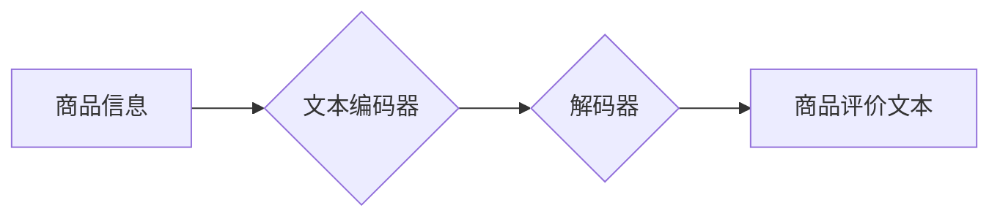

                 

## AI大模型在商品评价生成中的应用

> 关键词：AI大模型、商品评价生成、自然语言生成、深度学习、Transformer模型、BERT、GPT-3、文本生成、情感分析

## 1. 背景介绍

随着电商平台的蓬勃发展，商品评价已成为消费者决策的重要参考因素。高质量的商品评价能够帮助消费者更好地了解商品的优缺点，从而做出更明智的购买决策。同时，商家也通过商品评价来提升品牌形象，提高销售额。然而，人工撰写商品评价耗时费力，且难以保证评价的质量和一致性。因此，如何自动生成高质量的商品评价成为了一个重要的研究课题。

近年来，随着深度学习技术的快速发展，特别是Transformer模型的出现，自然语言生成（NLG）领域取得了长足进步。AI大模型，例如BERT、GPT-3等，凭借其强大的文本理解和生成能力，为商品评价生成提供了新的可能性。

## 2. 核心概念与联系

### 2.1  商品评价生成

商品评价生成是指利用人工智能技术自动生成符合特定商品特征和用户偏好的评价文本。该技术通常结合了自然语言处理（NLP）、深度学习等技术，旨在模拟人类撰写评价的逻辑和风格。

### 2.2  AI大模型

AI大模型是指在海量数据上训练的深度学习模型，具有强大的泛化能力和文本理解能力。常见的AI大模型包括：

* **BERT（Bidirectional Encoder Representations from Transformers）:**  一种基于Transformer架构的预训练语言模型，能够理解上下文信息，并用于各种NLP任务，如文本分类、问答系统等。
* **GPT-3（Generative Pre-trained Transformer 3）:**  一种基于Transformer架构的生成式语言模型，能够生成流畅、连贯的文本，并用于文本摘要、机器翻译、代码生成等任务。

### 2.3  核心架构

AI大模型在商品评价生成中的应用通常遵循以下架构：



* **商品信息:** 包括商品名称、描述、属性等信息。
* **文本编码器:** 将商品信息编码成向量表示，提取商品特征。
* **解码器:** 基于编码后的商品信息，生成评价文本。

## 3. 核心算法原理 & 具体操作步骤

### 3.1  算法原理概述

商品评价生成算法通常基于序列到序列（seq2seq）模型，利用Transformer模型的注意力机制，学习商品信息与评价文本之间的映射关系。

* **序列到序列模型:**  一种用于将一个序列映射到另一个序列的模型，例如将商品信息映射到评价文本。
* **Transformer模型:**  一种基于注意力机制的深度学习模型，能够捕捉文本序列中的长距离依赖关系。
* **注意力机制:**  一种机制，能够让模型关注输入序列中与输出序列相关的重要部分。

### 3.2  算法步骤详解

1. **数据预处理:** 收集商品信息和评价文本数据，进行清洗、分词、标记等预处理操作。
2. **模型训练:** 使用预训练的BERT或GPT-3模型，结合商品信息和评价文本数据进行训练，学习商品信息与评价文本之间的映射关系。
3. **评价文本生成:**  将新的商品信息输入到训练好的模型中，模型根据学习到的映射关系生成相应的评价文本。

### 3.3  算法优缺点

**优点:**

* **生成高质量的评价文本:**  AI大模型能够生成流畅、连贯、符合语义的评价文本。
* **提高效率:**  自动生成评价文本可以节省人工成本和时间。
* **个性化定制:**  可以根据用户偏好和商品特征进行个性化评价生成。

**缺点:**

* **数据依赖:**  模型的性能取决于训练数据的质量和数量。
* **缺乏真实感:**  生成的评价文本可能缺乏真实用户的个性化表达和情感色彩。
* **伦理问题:**  存在潜在的滥用风险，例如生成虚假评价。

### 3.4  算法应用领域

* **电商平台:**  自动生成商品评价，提升用户体验和销售额。
* **营销推广:**  生成产品宣传文案和用户评论，提高产品曝光率和转化率。
* **内容创作:**  生成产品测评文章、博客内容等，丰富内容创作。

## 4. 数学模型和公式 & 详细讲解 & 举例说明

### 4.1  数学模型构建

商品评价生成模型通常基于Transformer架构，其核心是注意力机制。注意力机制可以帮助模型关注输入序列中与输出序列相关的重要部分，从而提高生成文本的质量。

### 4.2  公式推导过程

Transformer模型的注意力机制使用以下公式计算注意力权重：

$$
\text{Attention}(Q, K, V) = \text{softmax}\left(\frac{QK^T}{\sqrt{d_k}}\right)V
$$

其中：

* $Q$：查询矩阵
* $K$：键矩阵
* $V$：值矩阵
* $d_k$：键向量的维度
* $\text{softmax}$：softmax函数，用于归一化注意力权重

### 4.3  案例分析与讲解

假设我们有一个商品信息向量 $Q$，以及一个评价文本词典 $V$。

* $Q$ 包含商品的特征信息，例如商品名称、价格、颜色等。
* $V$ 包含所有可能的评价词，例如“好”、“不好”、“价格合理”等。

通过计算注意力权重，模型可以确定哪些评价词与当前商品信息最相关，并根据这些权重生成评价文本。

## 5. 项目实践：代码实例和详细解释说明

### 5.1  开发环境搭建

* Python 3.6+
* TensorFlow/PyTorch
* CUDA (可选)

### 5.2  源代码详细实现

```python
import tensorflow as tf

# 定义Transformer模型
class Transformer(tf.keras.Model):
    def __init__(self, vocab_size, embedding_dim, num_heads, num_layers):
        super(Transformer, self).__init__()
        self.embedding = tf.keras.layers.Embedding(vocab_size, embedding_dim)
        self.transformer_layers = tf.keras.layers.StackedRNNCells([tf.keras.layers.MultiHeadAttention(num_heads=num_heads) for _ in range(num_layers)])

    def call(self, inputs):
        embedded_inputs = self.embedding(inputs)
        outputs = self.transformer_layers(embedded_inputs)
        return outputs

# 实例化模型
model = Transformer(vocab_size=10000, embedding_dim=128, num_heads=8, num_layers=6)

# 训练模型
model.compile(optimizer='adam', loss='sparse_categorical_crossentropy', metrics=['accuracy'])
model.fit(train_data, train_labels, epochs=10)

# 生成评价文本
generated_text = model.predict(new_product_info)
```

### 5.3  代码解读与分析

* **模型定义:**  定义了一个Transformer模型，包含嵌入层、多头注意力层和堆叠的RNN层。
* **模型实例化:**  实例化模型，设置词汇大小、嵌入维度、注意力头数和层数。
* **模型训练:**  使用Adam优化器、交叉熵损失函数和准确率指标训练模型。
* **文本生成:**  使用训练好的模型预测新的商品信息，生成相应的评价文本。

### 5.4  运行结果展示

运行代码后，模型将生成一段基于输入商品信息的评价文本。

## 6. 实际应用场景

### 6.1  电商平台

* 自动生成商品评价，提升用户体验和销售额。
* 个性化定制评价文本，根据用户偏好和商品特征生成不同的评价。
* 识别和过滤虚假评价，维护平台的评价体系。

### 6.2  营销推广

* 生成产品宣传文案和用户评论，提高产品曝光率和转化率。
* 针对不同目标用户群体，生成个性化的营销文案。
* 分析用户评价数据，了解用户对产品的反馈和需求。

### 6.3  内容创作

* 生成产品测评文章、博客内容等，丰富内容创作。
* 自动生成产品介绍和使用说明书，提高效率。
* 分析产品评价数据，挖掘产品亮点和不足。

### 6.4  未来应用展望

* **更个性化的评价生成:**  根据用户画像、购买历史等信息，生成更个性化的评价文本。
* **多模态评价生成:**  结合图像、视频等多模态数据，生成更丰富的评价文本。
* **跨语言评价生成:**  实现跨语言的评价生成，满足全球用户的需求。

## 7. 工具和资源推荐

### 7.1  学习资源推荐

* **书籍:**
    * 《深度学习》 - Ian Goodfellow
    * 《自然语言处理》 - Dan Jurafsky
* **在线课程:**
    * Coursera: 自然语言处理
    * Udacity: 深度学习
* **博客和网站:**
    * TensorFlow Blog
    * PyTorch Blog
    * Hugging Face

### 7.2  开发工具推荐

* **TensorFlow:**  开源深度学习框架
* **PyTorch:**  开源深度学习框架
* **Hugging Face Transformers:**  预训练Transformer模型库

### 7.3  相关论文推荐

* **BERT: Pre-training of Deep Bidirectional Transformers for Language Understanding**
* **GPT-3: Language Models are Few-Shot Learners**
* **Attention Is All You Need**

## 8. 总结：未来发展趋势与挑战

### 8.1  研究成果总结

AI大模型在商品评价生成领域取得了显著进展，能够生成高质量、个性化的评价文本，并应用于电商平台、营销推广、内容创作等多个领域。

### 8.2  未来发展趋势

* **模型规模和能力提升:**  随着计算资源的不断发展，AI大模型的规模和能力将进一步提升，生成更流畅、更自然的评价文本。
* **多模态评价生成:**  结合图像、视频等多模态数据，生成更丰富的评价文本，提供更全面的用户体验。
* **个性化定制:**  根据用户画像、购买历史等信息，生成更个性化的评价文本，满足不同用户的需求。

### 8.3  面临的挑战

* **数据质量和标注问题:**  模型的性能取决于训练数据的质量和数量，高质量的标注数据是训练AI大模型的关键。
* **伦理问题:**  存在潜在的滥用风险，例如生成虚假评价，需要制定相应的伦理规范和监管机制。
* **可解释性问题:**  AI大模型的决策过程较为复杂，难以解释模型生成的评价文本背后的逻辑，需要提高模型的可解释性。

### 8.4  研究展望

未来，AI大模型在商品评价生成领域将继续发展，并与其他技术融合，例如知识图谱、情感分析等，为用户提供更智能、更个性化的评价体验。


## 9. 附录：常见问题与解答

**1. 如何选择合适的AI大模型？**

选择合适的AI大模型取决于具体的应用场景和需求。例如，对于需要生成长篇、复杂结构的评价文本，可以选择GPT-3等生成式语言模型；对于需要理解上下文信息、进行情感分析的场景，可以选择BERT等预训练语言模型。

**2. 如何解决数据标注问题？**

数据标注是训练AI大模型的关键环节，可以使用人工标注、自动标注、众包等方式进行数据标注。

**3. 如何避免AI大模型生成虚假评价？**

可以采用以下方法避免AI大模型生成虚假评价：

* 使用高质量的训练数据，避免包含虚假信息的训练数据。
* 开发检测虚假评价的算法，对生成的评价文本进行过滤。
* 建立相应的伦理规范和监管机制，规范AI大模型的应用。


作者：禅与计算机程序设计艺术 / Zen and the Art of Computer Programming 
<end_of_turn>

