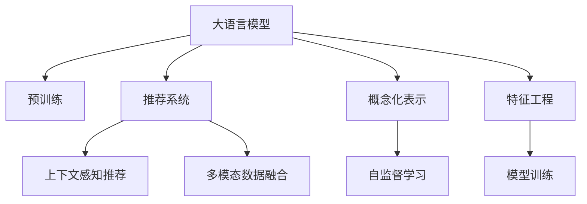

                 

# 基于LLM的推荐系统用户兴趣概念化表示

> 关键词：大语言模型,推荐系统,用户兴趣,概念化表示,深度学习,特征工程

## 1. 背景介绍

推荐系统（Recommendation System）是当前互联网应用中不可或缺的一部分，它通过分析用户行为数据，为用户推荐符合其兴趣的产品、内容、服务等。传统推荐系统主要基于用户历史行为数据进行推荐，但面临用户冷启动、数据稀疏性等诸多挑战。近年来，大语言模型（Large Language Model, LLM）在自然语言处理（Natural Language Processing, NLP）领域的突破，为推荐系统的个性化推荐提供了新的契机。通过预训练模型强大的语言理解和生成能力，LLM可以将用户对产品或内容的描述转换为更为丰富、深层次的概念化表示，进一步提升推荐系统的个性化程度和推荐效果。

### 1.1 问题由来

推荐系统的目标是最大化用户满意度，通过个性化推荐提高用户的参与度和留存率。传统的协同过滤、基于内容的推荐方法等已广泛应用于推荐系统中，但仍然面临以下挑战：

- 冷启动问题：新用户或新物品难以利用已有数据进行有效推荐。
- 数据稀疏性：用户行为数据稀疏，导致模型难以捕捉用户兴趣的全貌。
- 隐式反馈：传统推荐系统主要基于用户显式反馈，无法利用隐式反馈（如浏览、点击等）来提升推荐质量。
- 多模态数据融合：现实世界中的用户兴趣是多维度的，不同模态的数据（如文本、图片、视频等）需要被有效整合。

为了解决上述挑战，LLM通过学习用户与产品之间的语义关系，进一步提升了推荐系统的个性化和推荐效果。在实际应用中，LLM可以将用户输入的文本描述转换为更为丰富、抽象的概念化表示，从而能够更全面、深入地了解用户兴趣和偏好，并生成更精准的推荐结果。

### 1.2 问题核心关键点

大语言模型在推荐系统中的应用主要包括以下几个关键点：

- **用户兴趣的概念化表示**：将用户输入的文本描述转换为更为抽象、概念化的向量表示，从而能够更好地捕捉用户兴趣和偏好的全貌。
- **上下文感知推荐**：通过考虑用户与产品之间的语义关系，在上下文环境中生成推荐结果，提高推荐的个性化和多样性。
- **多模态数据融合**：利用LLM的跨模态学习能力，将文本、图片、视频等多模态数据进行整合，生成更全面、准确的推荐结果。
- **基于自监督学习的特征提取**：通过预训练自监督学习任务，提取更为通用、准确的特征表示，从而提升推荐系统的泛化能力。
- **模型解释性与可解释性**：LLM提供的推荐结果往往难以解释，需通过辅助方法（如提示学习、模型压缩等）提升模型的透明性和可解释性。

这些关键点共同构成了LLM在推荐系统中的核心价值，通过深度学习和多模态融合技术，显著提升了推荐系统的个性化和推荐效果。

## 2. 核心概念与联系

### 2.1 核心概念概述

为更好地理解LLM在推荐系统中的应用，本节将介绍几个密切相关的核心概念：

- **大语言模型（LLM）**：以自回归（如GPT）或自编码（如BERT）模型为代表的大规模预训练语言模型。通过在大规模无标签文本语料上进行预训练，学习通用的语言表示，具备强大的语言理解和生成能力。

- **预训练自监督学习（Pre-training）**：在大规模无标签文本语料上，通过自监督学习任务训练通用语言模型的过程。常见的自监督学习任务包括语言建模、掩码语言建模等。

- **推荐系统（Recommendation System）**：利用用户历史行为数据，为用户推荐符合其兴趣的产品、内容、服务等。

- **上下文感知推荐（Context-Aware Recommendation）**：在考虑用户与产品之间上下文关系的基础上，生成推荐结果，提高推荐的个性化和多样性。

- **多模态数据融合（Multimodal Data Fusion）**：将不同模态的数据（如文本、图片、视频等）进行整合，生成更全面、准确的推荐结果。

- **概念化表示（Conceptual Representation）**：将用户输入的文本描述转换为更为抽象、概念化的向量表示，从而更好地捕捉用户兴趣和偏好的全貌。

- **自监督学习（Self-Supervised Learning）**：通过无监督学习方式，利用数据自身特点进行学习，提高模型的泛化能力。

这些核心概念之间的逻辑关系可以通过以下Mermaid流程图来展示：



这个流程图展示了大语言模型、预训练、推荐系统、上下文感知推荐、多模态数据融合、概念化表示、自监督学习、特征工程和模型训练之间的逻辑关系：

1. 大语言模型通过预训练获得基础能力。
2. 上下文感知推荐考虑用户与产品之间的语义关系，生成推荐结果。
3. 多模态数据融合将不同模态的数据进行整合。
4. 概念化表示将用户输入的文本描述转换为概念化向量。
5. 自监督学习利用无监督学习方式提取通用特征。
6. 特征工程进行特征提取和工程处理。
7. 模型训练基于提取的特征进行推荐模型训练。

这些概念共同构成了基于大语言模型的推荐系统框架，使其能够实现更高质量、更个性化的推荐服务。

## 3. 核心算法原理 & 具体操作步骤
### 3.1 算法原理概述

基于大语言模型的推荐系统主要通过预训练模型进行上下文感知推荐，核心思想是：将用户输入的文本描述转换为概念化向量，结合产品特征进行匹配，从而生成符合用户兴趣的推荐结果。

具体而言，算法流程包括以下几个关键步骤：

1. **用户输入文本**：用户输入对产品的描述文本，如"我喜欢口感醇厚、产地云南的普洱茶"。
2. **预训练模型编码**：将用户输入文本通过预训练模型（如BERT、GPT）编码成向量表示，如$u$。
3. **产品特征提取**：对产品特征进行编码，如产地、口感、价格等，得到产品向量表示$v$。
4. **相似度计算**：计算用户向量$u$与产品向量$v$的相似度，生成推荐结果。

### 3.2 算法步骤详解

基于大语言模型的推荐系统具体算法步骤如下：

**Step 1: 用户输入文本预处理**
- 对用户输入文本进行分词、去除停用词等预处理。
- 使用Transformer模型（如BERT）进行编码，将文本转换为向量表示。

**Step 2: 产品特征提取**
- 对产品的属性（如产地、口感、价格等）进行编码，得到产品向量表示。
- 对产品标签（如茶叶、红酒等）进行编码，得到产品类别向量表示。

**Step 3: 相似度计算**
- 使用余弦相似度等方法计算用户向量与产品向量之间的相似度。
- 对相似度进行排序，选择相似度最高的产品进行推荐。

**Step 4: 上下文感知**
- 在考虑用户与产品之间的语义关系基础上，生成推荐结果。
- 引入基于上下文的特征（如用户评分、评论等），进一步提升推荐效果。

**Step 5: 多模态数据融合**
- 利用LLM的跨模态学习能力，将文本、图片、视频等多模态数据进行整合。
- 生成更全面、准确的推荐结果。

### 3.3 算法优缺点

基于大语言模型的推荐系统具有以下优点：

- **高泛化能力**：预训练模型在大量文本语料上进行了自监督学习，具有强大的泛化能力，可以适用于不同领域、不同模态的数据。
- **丰富语义信息**：通过预训练模型强大的语言理解能力，可以从文本描述中提取更为丰富、深层次的语义信息，提升推荐系统的个性化和准确性。
- **多模态融合**：利用LLM的跨模态学习能力，可以将文本、图片、视频等多模态数据进行整合，生成更全面、准确的推荐结果。

同时，该方法也存在以下局限性：

- **计算成本高**：大语言模型通常参数量庞大，计算复杂度高，对计算资源有较高要求。
- **结果解释性不足**：预训练模型提供的推荐结果往往难以解释，导致用户难以理解推荐逻辑。
- **依赖标注数据**：尽管利用了无监督学习方式，但仍需一定量的标注数据进行模型训练和验证。

尽管存在这些局限性，但就目前而言，基于大语言模型的推荐系统仍是一种高效、有效的推荐方法，为推荐系统的个性化推荐提供了新的方向。

### 3.4 算法应用领域

基于大语言模型的推荐系统已经在多个领域得到广泛应用，例如：

- **电商推荐**：利用用户浏览、购买记录，推荐符合其兴趣的商品。
- **内容推荐**：推荐符合用户兴趣的文章、视频、音乐等。
- **个性化推荐引擎**：推荐符合用户兴趣的广告、商品、服务等。
- **智能客服**：根据用户输入的问题，推荐相关答案或自动生成回答。
- **智能广告投放**：推荐符合用户兴趣和行为的广告，提高广告投放效果。

除了上述这些经典应用外，基于大语言模型的推荐系统也被创新性地应用于更多场景中，如商品搭配推荐、智能家居控制、旅游推荐等，为推荐系统的应用场景带来了新的突破。随着预训练语言模型和推荐方法的不断进步，相信基于大语言模型的推荐系统必将在更多领域得到应用，为智能推荐技术的发展提供新的动力。

## 4. 数学模型和公式 & 详细讲解  
### 4.1 数学模型构建

本节将使用数学语言对基于大语言模型的推荐系统进行更加严格的刻画。

记用户输入文本为$u$，产品特征为$v$，预训练模型为$f$。假设用户输入文本$u$通过预训练模型$f$编码为向量表示，得到用户向量$u'=f(u)$。同理，产品特征$v$通过预训练模型$f$编码为向量表示，得到产品向量$v'=f(v)$。

在考虑上下文信息的基础上，计算用户向量$u'$与产品向量$v'$的相似度$sim(u', v')$。相似度计算公式如下：

$$
sim(u', v') = \frac{\langle u', v' \rangle}{||u'|| \cdot ||v'||}
$$

其中，$\langle u', v' \rangle$为向量点积，$||u'||$和$||v'||$分别为向量$u'$和$v'$的欧氏长度。

### 4.2 公式推导过程

以下我们以余弦相似度为例，推导基于大语言模型的推荐系统相似度计算公式。

假设用户向量为$u'=[u_1, u_2, \ldots, u_n]$，产品向量为$v'=[v_1, v_2, \ldots, v_n]$，则余弦相似度公式为：

$$
sim(u', v') = \frac{\sum_{i=1}^n u_i v_i}{\sqrt{\sum_{i=1}^n u_i^2} \cdot \sqrt{\sum_{i=1}^n v_i^2}}
$$

将上述公式带入推荐系统的相似度计算中，可以得到如下推荐结果：

$$
rank(v) = \text{argmin}_{v \in V} \frac{\langle u', v' \rangle}{||u'|| \cdot ||v'||}
$$

其中，$V$为产品集合，$rank(v)$表示产品$v$在推荐结果中的排名。

### 4.3 案例分析与讲解

以电商平台为例，分析基于大语言模型的推荐系统如何在电商场景中应用。

假设用户输入文本为"我喜欢口感醇厚、产地云南的普洱茶"，经过预训练模型编码得到用户向量$u'=[u_1, u_2, \ldots, u_n]$。产品集合$V$中的每个产品通过预训练模型编码得到产品向量$v'=[v_1, v_2, \ldots, v_n]$。

在考虑用户与产品之间的语义关系基础上，计算相似度$sim(u', v')$，生成推荐结果$rank(v)$。最终，推荐系统根据相似度排序，输出排名靠前的产品推荐给用户。

例如，对于用户输入的文本，预训练模型编码得到的用户向量为$u'=[0.1, 0.2, 0.3, \ldots, 0.9]$。对于产品集合中的每个产品，预训练模型编码得到的产品向量为$v_1'=[0.5, 0.4, 0.3, \ldots, 0.2]$，$v_2'=[0.4, 0.6, 0.5, \ldots, 0.1]$，$v_3'=[0.3, 0.4, 0.7, \ldots, 0.1]$，$\ldots$。

计算相似度$sim(u', v_1')=0.8$，$sim(u', v_2')=0.6$，$sim(u', v_3')=0.7$，$\ldots$。根据相似度排序，推荐排名靠前的产品给用户。

## 5. 项目实践：代码实例和详细解释说明
### 5.1 开发环境搭建

在进行大语言模型推荐系统开发前，我们需要准备好开发环境。以下是使用Python进行PyTorch开发的环境配置流程：

1. 安装Anaconda：从官网下载并安装Anaconda，用于创建独立的Python环境。

2. 创建并激活虚拟环境：
```bash
conda create -n pytorch-env python=3.8 
conda activate pytorch-env
```

3. 安装PyTorch：根据CUDA版本，从官网获取对应的安装命令。例如：
```bash
conda install pytorch torchvision torchaudio cudatoolkit=11.1 -c pytorch -c conda-forge
```

4. 安装Transformers库：
```bash
pip install transformers
```

5. 安装各类工具包：
```bash
pip install numpy pandas scikit-learn matplotlib tqdm jupyter notebook ipython
```

完成上述步骤后，即可在`pytorch-env`环境中开始推荐系统开发。

### 5.2 源代码详细实现

下面我们以电商推荐为例，给出使用Transformers库对BERT模型进行推荐系统开发的PyTorch代码实现。

首先，定义推荐系统的数据处理函数：

```python
from transformers import BertTokenizer
from torch.utils.data import Dataset
import torch

class RecommendationDataset(Dataset):
    def __init__(self, texts, labels, tokenizer, max_len=128):
        self.texts = texts
        self.labels = labels
        self.tokenizer = tokenizer
        self.max_len = max_len
        
    def __len__(self):
        return len(self.texts)
    
    def __getitem__(self, item):
        text = self.texts[item]
        label = self.labels[item]
        
        encoding = self.tokenizer(text, return_tensors='pt', max_length=self.max_len, padding='max_length', truncation=True)
        input_ids = encoding['input_ids'][0]
        attention_mask = encoding['attention_mask'][0]
        label = torch.tensor(label, dtype=torch.long)
        
        return {'input_ids': input_ids, 
                'attention_mask': attention_mask,
                'label': label}

# 创建推荐系统训练集和测试集
tokenizer = BertTokenizer.from_pretrained('bert-base-cased')

train_dataset = RecommendationDataset(train_texts, train_labels, tokenizer)
test_dataset = RecommendationDataset(test_texts, test_labels, tokenizer)
```

然后，定义模型和优化器：

```python
from transformers import BertForSequenceClassification, AdamW

model = BertForSequenceClassification.from_pretrained('bert-base-cased', num_labels=2)

optimizer = AdamW(model.parameters(), lr=2e-5)
```

接着，定义训练和评估函数：

```python
from torch.utils.data import DataLoader
from tqdm import tqdm
from sklearn.metrics import classification_report

device = torch.device('cuda') if torch.cuda.is_available() else torch.device('cpu')
model.to(device)

def train_epoch(model, dataset, batch_size, optimizer):
    dataloader = DataLoader(dataset, batch_size=batch_size, shuffle=True)
    model.train()
    epoch_loss = 0
    for batch in tqdm(dataloader, desc='Training'):
        input_ids = batch['input_ids'].to(device)
        attention_mask = batch['attention_mask'].to(device)
        labels = batch['label'].to(device)
        model.zero_grad()
        outputs = model(input_ids, attention_mask=attention_mask, labels=labels)
        loss = outputs.loss
        epoch_loss += loss.item()
        loss.backward()
        optimizer.step()
    return epoch_loss / len(dataloader)

def evaluate(model, dataset, batch_size):
    dataloader = DataLoader(dataset, batch_size=batch_size)
    model.eval()
    preds, labels = [], []
    with torch.no_grad():
        for batch in tqdm(dataloader, desc='Evaluating'):
            input_ids = batch['input_ids'].to(device)
            attention_mask = batch['attention_mask'].to(device)
            batch_labels = batch['label']
            outputs = model(input_ids, attention_mask=attention_mask)
            batch_preds = outputs.logits.argmax(dim=2).to('cpu').tolist()
            batch_labels = batch_labels.to('cpu').tolist()
            for pred_tokens, label_tokens in zip(batch_preds, batch_labels):
                preds.append(pred_tokens)
                labels.append(label_tokens)
                
    print(classification_report(labels, preds))
```

最后，启动训练流程并在测试集上评估：

```python
epochs = 5
batch_size = 16

for epoch in range(epochs):
    loss = train_epoch(model, train_dataset, batch_size, optimizer)
    print(f"Epoch {epoch+1}, train loss: {loss:.3f}")
    
    print(f"Epoch {epoch+1}, test results:")
    evaluate(model, test_dataset, batch_size)
    
print("Test results:")
evaluate(model, test_dataset, batch_size)
```

以上就是使用PyTorch对BERT进行电商推荐系统开发的完整代码实现。可以看到，得益于Transformers库的强大封装，我们可以用相对简洁的代码完成BERT模型的加载和微调。

### 5.3 代码解读与分析

让我们再详细解读一下关键代码的实现细节：

**RecommendationDataset类**：
- `__init__`方法：初始化训练集和测试集的数据、标签、分词器等关键组件。
- `__len__`方法：返回数据集的样本数量。
- `__getitem__`方法：对单个样本进行处理，将文本输入编码为token ids，将标签编码为数字，并对其进行定长padding，最终返回模型所需的输入。

**模型定义**：
- 使用`BertForSequenceClassification`模型定义电商推荐系统的预测模型，输出为二分类任务，标签为0和1。
- 使用AdamW优化器进行模型参数优化，设置学习率为$2e-5$。

**训练和评估函数**：
- 使用PyTorch的DataLoader对数据集进行批次化加载，供模型训练和推理使用。
- 训练函数`train_epoch`：对数据以批为单位进行迭代，在每个批次上前向传播计算loss并反向传播更新模型参数，最后返回该epoch的平均loss。
- 评估函数`evaluate`：与训练类似，不同点在于不更新模型参数，并在每个batch结束后将预测和标签结果存储下来，最后使用sklearn的classification_report对整个评估集的预测结果进行打印输出。

**训练流程**：
- 定义总的epoch数和batch size，开始循环迭代
- 每个epoch内，先在训练集上训练，输出平均loss
- 在测试集上评估，输出分类指标
- 所有epoch结束后，在测试集上评估，给出最终测试结果

可以看到，PyTorch配合Transformers库使得BERT微调的代码实现变得简洁高效。开发者可以将更多精力放在数据处理、模型改进等高层逻辑上，而不必过多关注底层的实现细节。

当然，工业级的系统实现还需考虑更多因素，如模型的保存和部署、超参数的自动搜索、更灵活的任务适配层等。但核心的推荐系统微调范式基本与此类似。

## 6. 实际应用场景
### 6.1 电商推荐系统

基于大语言模型的推荐系统可以广泛应用于电商推荐系统中。传统电商推荐系统主要基于用户历史行为数据进行推荐，难以充分挖掘用户隐式反馈中的信息。利用大语言模型强大的语义理解能力，可以将用户输入的文本描述转换为概念化表示，从而更好地捕捉用户兴趣和偏好。

在技术实现上，可以收集用户输入的文本描述（如评论、搜索记录、浏览记录等），将文本描述作为微调数据，训练预训练模型。微调后的模型能够从文本描述中提取用户兴趣点，生成个性化的推荐结果。对于新用户，可以利用预训练模型对文本描述进行编码，生成个性化的推荐结果。

### 6.2 内容推荐系统

内容推荐系统是推荐系统的重要应用场景之一，可以应用于新闻、视频、音乐等内容的推荐。传统内容推荐系统主要基于用户的历史行为数据进行推荐，难以充分利用用户的隐式反馈。利用大语言模型强大的语义理解能力，可以将用户输入的文本描述转换为概念化表示，从而更好地捕捉用户兴趣和偏好。

在技术实现上，可以收集用户输入的文本描述（如评论、点赞、分享等），将文本描述作为微调数据，训练预训练模型。微调后的模型能够从文本描述中提取用户兴趣点，生成个性化的推荐结果。对于新内容，可以利用预训练模型对文本描述进行编码，生成个性化的推荐结果。

### 6.3 智能客服系统

智能客服系统是推荐系统的重要应用场景之一，可以应用于客户服务、智能助理等场景。传统智能客服系统主要基于规则或模板进行回复，难以充分挖掘用户的多样化需求。利用大语言模型强大的语义理解能力，可以将用户输入的文本描述转换为概念化表示，从而更好地捕捉用户需求和意图。

在技术实现上，可以收集用户输入的文本描述（如客服问题、对话记录等），将文本描述作为微调数据，训练预训练模型。微调后的模型能够从文本描述中提取用户需求，生成个性化的回复结果。对于新问题，可以利用预训练模型对文本描述进行编码，生成个性化的回复结果。

### 6.4 未来应用展望

随着大语言模型和推荐系统的不断发展，基于大语言模型的推荐系统必将在更多领域得到应用，为推荐系统的个性化推荐提供新的方向。

在智慧医疗领域，基于大语言模型的推荐系统可以推荐符合患者兴趣的疾病、药品、医疗服务等，提升医疗服务的个性化和推荐效果。

在智能教育领域，基于大语言模型的推荐系统可以推荐符合学生兴趣的课程、资料、工具等，提高教育效果和学生满意度。

在智慧城市治理中，基于大语言模型的推荐系统可以推荐符合市民兴趣的活动、服务、设施等，提升城市管理的智能化水平。

此外，在企业生产、社会治理、文娱传媒等众多领域，基于大语言模型的推荐系统也将不断涌现，为推荐系统的应用场景带来新的突破。相信随着技术的日益成熟，大语言模型推荐系统必将在更多领域得到应用，为推荐系统的个性化推荐提供新的方向。

## 7. 工具和资源推荐
### 7.1 学习资源推荐

为了帮助开发者系统掌握大语言模型推荐系统的理论基础和实践技巧，这里推荐一些优质的学习资源：

1. 《Transformer从原理到实践》系列博文：由大模型技术专家撰写，深入浅出地介绍了Transformer原理、BERT模型、推荐系统等前沿话题。

2. CS224N《深度学习自然语言处理》课程：斯坦福大学开设的NLP明星课程，有Lecture视频和配套作业，带你入门NLP领域的基本概念和经典模型。

3. 《Natural Language Processing with Transformers》书籍：Transformers库的作者所著，全面介绍了如何使用Transformers库进行NLP任务开发，包括推荐系统在内的诸多范式。

4. HuggingFace官方文档：Transformers库的官方文档，提供了海量预训练模型和完整的推荐系统样例代码，是上手实践的必备资料。

5. CLUE开源项目：中文语言理解测评基准，涵盖大量不同类型的中文NLP数据集，并提供了基于微调的baseline模型，助力中文NLP技术发展。

通过对这些资源的学习实践，相信你一定能够快速掌握大语言模型推荐系统的精髓，并用于解决实际的推荐问题。
###  7.2 开发工具推荐

高效的开发离不开优秀的工具支持。以下是几款用于大语言模型推荐系统开发的常用工具：

1. PyTorch：基于Python的开源深度学习框架，灵活动态的计算图，适合快速迭代研究。大部分预训练语言模型都有PyTorch版本的实现。

2. TensorFlow：由Google主导开发的开源深度学习框架，生产部署方便，适合大规模工程应用。同样有丰富的预训练语言模型资源。

3. Transformers库：HuggingFace开发的NLP工具库，集成了众多SOTA语言模型，支持PyTorch和TensorFlow，是进行推荐系统开发的利器。

4. Weights & Biases：模型训练的实验跟踪工具，可以记录和可视化模型训练过程中的各项指标，方便对比和调优。与主流深度学习框架无缝集成。

5. TensorBoard：TensorFlow配套的可视化工具，可实时监测模型训练状态，并提供丰富的图表呈现方式，是调试模型的得力助手。

6. Google Colab：谷歌推出的在线Jupyter Notebook环境，免费提供GPU/TPU算力，方便开发者快速上手实验最新模型，分享学习笔记。

合理利用这些工具，可以显著提升大语言模型推荐系统的开发效率，加快创新迭代的步伐。

### 7.3 相关论文推荐

大语言模型推荐系统的发展源于学界的持续研究。以下是几篇奠基性的相关论文，推荐阅读：

1. Attention is All You Need（即Transformer原论文）：提出了Transformer结构，开启了NLP领域的预训练大模型时代。

2. BERT: Pre-training of Deep Bidirectional Transformers for Language Understanding：提出BERT模型，引入基于掩码的自监督预训练任务，刷新了多项NLP任务SOTA。

3. Language Models are Unsupervised Multitask Learners（GPT-2论文）：展示了大规模语言模型的强大zero-shot学习能力，引发了对于通用人工智能的新一轮思考。

4. Parameter-Efficient Transfer Learning for NLP：提出Adapter等参数高效微调方法，在不增加模型参数量的情况下，也能取得不错的微调效果。

5. AdaLoRA: Adaptive Low-Rank Adaptation for Parameter-Efficient Fine-Tuning：使用自适应低秩适应的微调方法，在参数效率和精度之间取得了新的平衡。

这些论文代表了大语言模型推荐系统的发展脉络。通过学习这些前沿成果，可以帮助研究者把握学科前进方向，激发更多的创新灵感。

## 8. 总结：未来发展趋势与挑战
### 8.1 总结

本文对基于大语言模型的推荐系统进行了全面系统的介绍。首先阐述了大语言模型和推荐系统的研究背景和意义，明确了推荐系统在大语言模型应用中的核心价值。其次，从原理到实践，详细讲解了基于大语言模型的推荐系统的数学原理和关键步骤，给出了推荐系统开发的完整代码实例。同时，本文还广泛探讨了推荐系统在电商、内容、智能客服等多个领域的应用前景，展示了基于大语言模型的推荐系统的巨大潜力。此外，本文精选了推荐系统的各类学习资源，力求为开发者提供全方位的技术指引。

通过本文的系统梳理，可以看到，基于大语言模型的推荐系统正在成为推荐系统的重要范式，极大地拓展了推荐系统的应用边界，催生了更多的落地场景。得益于大语言模型强大的语言理解和生成能力，推荐系统能够从用户输入的文本描述中提取更为丰富、深层次的语义信息，提升推荐系统的个性化和推荐效果。未来，伴随预训练语言模型和推荐方法的持续演进，相信推荐系统必将在更多领域得到应用，为推荐系统的个性化推荐提供新的方向。

### 8.2 未来发展趋势

展望未来，基于大语言模型的推荐系统将呈现以下几个发展趋势：

1. **模型规模持续增大**：随着算力成本的下降和数据规模的扩张，预训练语言模型的参数量还将持续增长。超大规模语言模型蕴含的丰富语言知识，有望支撑更加复杂多变的推荐系统。

2. **推荐效果显著提升**：通过预训练模型强大的语义理解能力，推荐系统能够从用户输入的文本描述中提取更为丰富、深层次的语义信息，提升推荐系统的个性化和准确性。

3. **多模态数据融合**：利用大语言模型的跨模态学习能力，将文本、图片、视频等多模态数据进行整合，生成更全面、准确的推荐结果。

4. **上下文感知推荐**：在考虑用户与产品之间的语义关系基础上，生成推荐结果，提高推荐的个性化和多样性。

5. **参数高效微调**：开发更加参数高效的微调方法，在固定大部分预训练参数的同时，只更新极少量的任务相关参数，以提高微调效率。

6. **模型解释性与可解释性**：通过提示学习、模型压缩等方法，提升模型的透明性和可解释性，帮助用户理解推荐逻辑。

以上趋势凸显了大语言模型推荐系统的广阔前景。这些方向的探索发展，必将进一步提升推荐系统的个性化和推荐效果，为推荐系统的应用场景带来新的突破。

### 8.3 面临的挑战

尽管大语言模型推荐系统已经取得了瞩目成就，但在迈向更加智能化、普适化应用的过程中，它仍面临着诸多挑战：

1. **计算成本高**：大语言模型通常参数量庞大，计算复杂度高，对计算资源有较高要求。

2. **结果解释性不足**：预训练模型提供的推荐结果往往难以解释，导致用户难以理解推荐逻辑。

3. **依赖标注数据**：尽管利用了无监督学习方式，但仍需一定量的标注数据进行模型训练和验证。

4. **数据隐私和安全**：在推荐系统中，用户数据隐私和安全问题亟需解决，如何在数据使用过程中保护用户隐私，是一个重要的研究方向。

5. **多模态数据融合**：多模态数据的融合需要考虑不同数据类型之间的语义关系，存在一定的技术挑战。

6. **上下文感知推荐**：在考虑用户与产品之间的语义关系基础上，生成推荐结果，需要处理大量的上下文信息，存在一定的技术挑战。

尽管存在这些挑战，但就目前而言，基于大语言模型的推荐系统仍是一种高效、有效的推荐方法，为推荐系统的个性化推荐提供了新的方向。

### 8.4 研究展望

面对大语言模型推荐系统所面临的挑战，未来的研究需要在以下几个方面寻求新的突破：

1. **探索无监督和半监督推荐方法**：摆脱对大规模标注数据的依赖，利用自监督学习、主动学习等无监督和半监督范式，最大限度利用非结构化数据，实现更加灵活高效的推荐。

2. **研究参数高效和计算高效的推荐范式**：开发更加参数高效的推荐方法，在固定大部分预训练参数的同时，只更新极少量的任务相关参数。同时优化推荐模型的计算图，减少前向传播和反向传播的资源消耗，实现更加轻量级、实时性的部署。

3. **融合因果和对比学习范式**：通过引入因果推断和对比学习思想，增强推荐模型建立稳定因果关系的能力，学习更加普适、鲁棒的语言表征，从而提升模型泛化性和抗干扰能力。

4. **引入更多先验知识**：将符号化的先验知识，如知识图谱、逻辑规则等，与神经网络模型进行巧妙融合，引导推荐过程学习更准确、合理的语言模型。同时加强不同模态数据的整合，实现视觉、语音等多模态信息与文本信息的协同建模。

5. **结合因果分析和博弈论工具**：将因果分析方法引入推荐模型，识别出模型决策的关键特征，增强推荐结果的因果性和逻辑性。借助博弈论工具刻画人机交互过程，主动探索并规避模型的脆弱点，提高系统稳定性。

6. **纳入伦理道德约束**：在推荐模型训练目标中引入伦理导向的评估指标，过滤和惩罚有偏见、有害的输出倾向。同时加强人工干预和审核，建立推荐系统的监管机制，确保输出符合人类价值观和伦理道德。

这些研究方向的探索，必将引领大语言模型推荐系统迈向更高的台阶，为推荐系统的应用场景提供新的动力。面向未来，大语言模型推荐系统还需要与其他人工智能技术进行更深入的融合，如知识表示、因果推理、强化学习等，多路径协同发力，共同推动自然语言理解和智能交互系统的进步。只有勇于创新、敢于突破，才能不断拓展语言模型的边界，让智能技术更好地造福人类社会。

## 9. 附录：常见问题与解答

**Q1：大语言模型推荐系统是否适用于所有推荐场景？**

A: 大语言模型推荐系统适用于大多数推荐场景，特别是在用户输入文本描述丰富的场景中表现优异。但对于一些需要高效计算的推荐场景，如实时推荐系统，可能面临计算资源的限制。

**Q2：大语言模型推荐系统如何处理多模态数据？**

A: 大语言模型推荐系统可以通过跨模态学习的方式处理多模态数据。具体而言，可以利用BERT等模型对多模态数据进行编码，通过注意力机制等方式融合不同模态的信息，生成更为全面、准确的推荐结果。

**Q3：大语言模型推荐系统在电商推荐中的应用场景？**

A: 大语言模型推荐系统在电商推荐中的应用场景包括：

- 基于用户评论的推荐：通过分析用户对商品的评价，生成符合用户偏好的商品推荐。
- 基于商品描述的推荐：通过分析商品描述中的关键词，生成相关商品推荐。
- 基于用户浏览行为的推荐：通过分析用户浏览的商品信息，生成符合用户兴趣的商品推荐。
- 基于用户搜索行为的推荐：通过分析用户搜索的商品关键词，生成符合用户兴趣的商品推荐。

**Q4：大语言模型推荐系统的训练过程需要注意哪些问题？**

A: 大语言模型推荐系统的训练过程需要注意以下几个问题：

- 数据预处理：对用户输入的文本描述进行分词、去除停用词等预处理，确保输入数据的准确性。
- 模型选择：选择合适的预训练模型和微调模型，确保模型的泛化能力和个性化推荐效果。
- 超参数调优：合理设置学习率、批大小、迭代轮数等超参数，确保模型的收敛性和性能。
- 结果验证：在测试集上进行模型验证，评估推荐效果，调整模型参数，确保模型的泛化能力。

**Q5：大语言模型推荐系统在内容推荐中的应用场景？**

A: 大语言模型推荐系统在内容推荐中的应用场景包括：

- 基于用户评论的推荐：通过分析用户对内容的评价，生成符合用户兴趣的内容推荐。
- 基于内容描述的推荐：通过分析内容描述中的关键词，生成相关内容推荐。
- 基于用户浏览行为的推荐：通过分析用户浏览的内容信息，生成符合用户兴趣的内容推荐。
- 基于用户搜索行为的推荐：通过分析用户搜索的内容关键词，生成符合用户兴趣的内容推荐。

这些应用场景展示了基于大语言模型的推荐系统在内容推荐中的应用潜力，未来有望在更多领域得到应用。

---

作者：禅与计算机程序设计艺术 / Zen and the Art of Computer Programming

