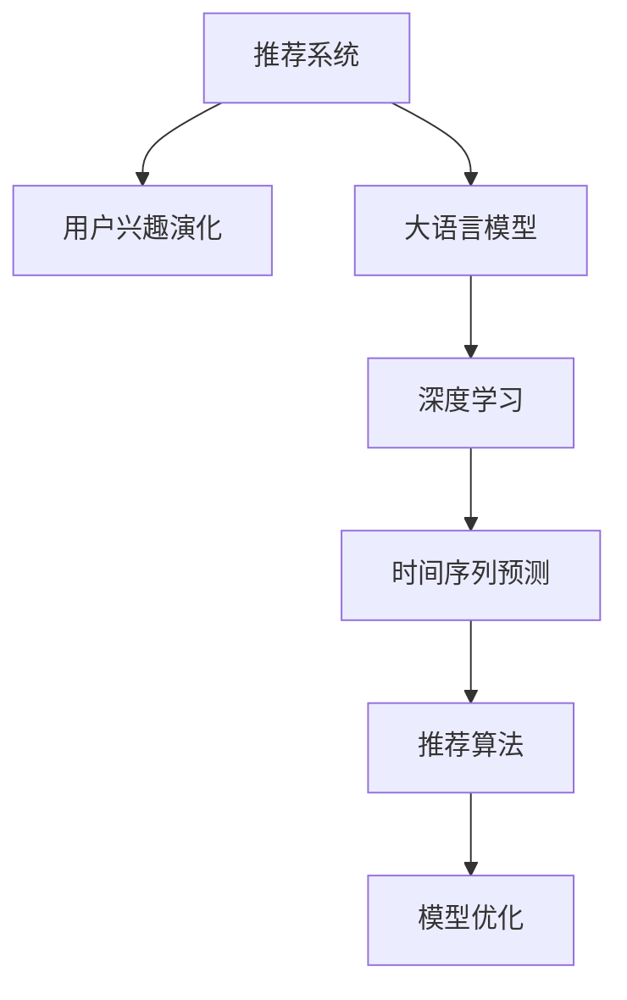

                 

# 基于LLM的推荐系统用户兴趣演化预测

> 关键词：
- 推荐系统
- 用户兴趣演化
- 大语言模型(LLM)
- 深度学习
- 时间序列预测
- 推荐算法
- 模型优化

## 1. 背景介绍

### 1.1 问题由来

推荐系统已经成为互联网产品中的标配，通过预测用户可能感兴趣的内容或商品，提升用户体验，增加用户粘性，增加收入。传统推荐系统通常基于用户的显式评分或者行为数据，如点击、浏览、收藏等。近年来，随着深度学习技术的发展，基于协同过滤、矩阵分解、深度学习等多种模型的推荐系统也在逐步普及。

然而，现有的推荐系统往往存在以下问题：

1. 短时效应。用户的兴趣容易随时间变化而变化，但传统推荐系统无法捕捉用户兴趣的演化过程。
2. 孤立用户。现有系统大多基于历史行为进行推荐，无法发现未尝过的内容或商品。
3. 个性化不足。传统推荐系统难以满足用户对于个性化推荐的强烈需求。
4. 数据稀缺。对于新用户或冷启动用户，缺乏足够的行为数据，导致推荐效果不理想。

为解决这些问题，基于大语言模型的推荐系统应运而生。利用大语言模型强大的自然语言处理能力，推荐系统能够更好地理解用户的兴趣描述，预测用户兴趣的演化过程，进行跨时间维度的推荐，提升推荐效果和用户体验。

### 1.2 问题核心关键点

推荐系统中的用户兴趣演化预测，主要涉及以下几个核心问题：

- 如何获取用户兴趣描述？
- 如何对用户兴趣进行建模？
- 如何预测用户兴趣的演化过程？
- 如何将预测结果应用于推荐？

本文将从这些核心问题出发，详细介绍基于大语言模型的推荐系统用户兴趣演化预测方法。

## 2. 核心概念与联系

### 2.1 核心概念概述

为更好地理解基于大语言模型的推荐系统用户兴趣演化预测方法，本节将介绍几个密切相关的核心概念：

- 推荐系统(Recommender System)：通过算法推荐用户可能感兴趣的内容或商品的系统，广泛应用于电商、社交、媒体等领域。
- 用户兴趣演化(User Interest Evolution)：指用户兴趣随时间变化的过程，如用户兴趣从游戏转向体育，从悬疑小说转向科幻小说等。
- 大语言模型(LLM)：以自回归(如GPT)或自编码(如BERT)模型为代表的，在大规模无标签文本语料上进行预训练的语言模型，具备强大的自然语言处理能力。
- 深度学习(Deep Learning)：一类基于神经网络的机器学习方法，通过多层非线性变换学习数据特征，具备良好的泛化能力。
- 时间序列预测(Time Series Prediction)：通过历史数据预测未来数据的序列预测方法，广泛用于金融、气象、交通等领域。
- 推荐算法(Recommender Algorithms)：用于推荐系统中的多种算法，如协同过滤、矩阵分解、基于深度学习的推荐等。
- 模型优化(Model Optimization)：通过优化算法和超参数，提高模型的预测精度和鲁棒性。

这些核心概念之间的逻辑关系可以通过以下Mermaid流程图来展示：



这个流程图展示了大语言模型在推荐系统中的应用路径：

1. 推荐系统将用户兴趣描述提取出来，作为大语言模型的输入。
2. 大语言模型基于自然语言处理技术，学习用户兴趣的演化规律。
3. 结合时间序列预测技术，预测用户兴趣的未来变化趋势。
4. 将预测结果与推荐算法结合，进行跨时间维度的推荐。
5. 通过模型优化，提高推荐系统的精度和鲁棒性。

## 3. 核心算法原理 & 具体操作步骤
### 3.1 算法原理概述

基于大语言模型的推荐系统用户兴趣演化预测，主要依赖于大语言模型强大的自然语言处理能力。其核心思想是：将用户兴趣描述转化为机器可读的数据，使用深度学习模型进行建模和预测。具体流程如下：

1. 用户兴趣描述的提取：通过自然语言处理技术，从用户的评论、文章、社交媒体等渠道获取用户兴趣描述。
2. 兴趣演化模型的构建：基于大语言模型，对用户兴趣描述进行建模，学习用户兴趣随时间的演化过程。
3. 时间序列预测：使用时间序列预测技术，对用户兴趣演化过程进行预测，获取未来兴趣变化趋势。
4. 推荐算法集成：将预测结果与推荐算法结合，进行跨时间维度的推荐。
5. 模型优化：通过优化算法和超参数，提高模型的预测精度和鲁棒性。

### 3.2 算法步骤详解

基于大语言模型的推荐系统用户兴趣演化预测一般包括以下几个关键步骤：

**Step 1: 数据准备**
- 收集用户的评论、文章、社交媒体等文本数据，用于提取用户兴趣描述。
- 对用户兴趣描述进行预处理，包括去除停用词、分词、词性标注等。
- 使用大语言模型对用户兴趣描述进行编码，提取其高维向量表示。

**Step 2: 兴趣演化建模**
- 基于大语言模型，对用户兴趣描述进行建模，学习其随时间的演化过程。可以使用自回归模型或自编码模型，如GPT、BERT等。
- 将用户兴趣描述的高维向量表示作为输入，使用LSTM、GRU等时间序列模型，进行用户兴趣的演化预测。
- 在预测过程中，可以引入外部知识库、规则库，增强模型的解释性和鲁棒性。

**Step 3: 时间序列预测**
- 使用时间序列预测模型，对用户兴趣演化过程进行预测，获取未来兴趣变化趋势。
- 时间序列预测模型可以采用ARIMA、Prophet、LSTM等，具体选择取决于数据特征和预测精度要求。
- 在预测过程中，可以结合领域专家的经验知识，进行多模态融合，提升预测效果。

**Step 4: 推荐算法集成**
- 将用户兴趣演化预测结果与推荐算法结合，进行跨时间维度的推荐。
- 推荐算法可以采用协同过滤、矩阵分解、基于深度学习的推荐等，具体选择取决于推荐场景和数据特征。
- 在推荐过程中，可以引入元知识、多模态信息，增强推荐效果。

**Step 5: 模型优化**
- 使用优化算法（如Adam、SGD等）和超参数调优技术，提高模型的预测精度和鲁棒性。
- 使用正则化技术（如L2正则、Dropout等），避免模型过拟合。
- 使用早停策略，防止模型在验证集上过拟合。

### 3.3 算法优缺点

基于大语言模型的推荐系统用户兴趣演化预测，具有以下优点：

1. 数据可获取。用户兴趣描述通常存在于公开的文本数据中，无需额外标注。
2. 无需显式评分。基于兴趣演化预测，无需用户显式评分，即可进行推荐。
3. 跨时间推荐。利用大语言模型的时间序列预测能力，进行跨时间维度的推荐，更好地满足用户需求。
4. 可解释性强。大语言模型可输出解释性较好的预测结果，帮助用户理解推荐逻辑。

同时，该方法也存在一些局限性：

1. 数据质量问题。用户的兴趣描述可能存在噪声、歧义，影响预测效果。
2. 模型计算量大。大语言模型需要较大的计算资源，进行兴趣演化预测。
3. 鲁棒性不足。当前模型对异常值、噪声数据较敏感，需要进一步优化。
4. 数据隐私问题。用户兴趣描述可能包含敏感信息，需确保数据隐私安全。

尽管存在这些局限性，但就目前而言，基于大语言模型的推荐系统用户兴趣演化预测方法仍是大语言模型应用的一个重要方向。未来相关研究的重点在于如何进一步提高模型的鲁棒性、降低计算成本、保护用户隐私等。

### 3.4 算法应用领域

基于大语言模型的推荐系统用户兴趣演化预测方法，已经广泛应用于多个领域：

- 电商推荐：如淘宝、京东等电商平台的商品推荐，预测用户未来可能感兴趣的商品。
- 社交推荐：如微博、微信等社交平台的推荐，预测用户未来可能感兴趣的内容。
- 媒体推荐：如Netflix、YouTube等媒体平台的推荐，预测用户未来可能感兴趣的视频或电影。
- 音乐推荐：如Spotify、网易云音乐等音乐平台的推荐，预测用户未来可能喜欢的音乐。

除了这些经典应用场景外，大语言模型在更多领域的应用也在不断涌现，如广告推荐、金融产品推荐、智能家居推荐等，为互联网产品带来了新的发展机遇。

## 4. 数学模型和公式 & 详细讲解  
### 4.1 数学模型构建

本节将使用数学语言对基于大语言模型的推荐系统用户兴趣演化预测过程进行更加严格的刻画。

假设用户兴趣描述为 $x_t$，其中 $t$ 表示时间步，$x_t \in \mathcal{X}$，其中 $\mathcal{X}$ 为兴趣描述空间。假设用户兴趣演化模型为 $f_t(x_{t-1}, \theta_t)$，其中 $\theta_t$ 为时间步 $t$ 的模型参数。则用户兴趣演化预测的数学模型为：

$$
y_{t+1} = f_{t+1}(x_t, \theta_{t+1})
$$

其中 $y_{t+1}$ 为预测用户兴趣演化结果，$f_{t+1}(\cdot, \cdot)$ 为时间步 $t+1$ 的兴趣演化模型。

假设用户兴趣演化模型为LSTM模型，则其预测公式为：

$$
\begin{aligned}
&h_t = \text{LSTM}(x_t, h_{t-1}) \\
&y_{t+1} = \text{Linear}(h_t)
\end{aligned}
$$

其中 $h_t$ 为时间步 $t$ 的隐藏状态，$\text{LSTM}$ 为LSTM模型，$\text{Linear}$ 为线性层。

假设时间序列预测模型为ARIMA模型，则其预测公式为：

$$
y_{t+1} = ARIMA(x_t, d, p, q, \theta)
$$

其中 $d$ 为差分阶数，$p$ 为自回归阶数，$q$ 为移动平均阶数，$\theta$ 为模型参数。

### 4.2 公式推导过程

以下我们以电商推荐系统为例，推导基于大语言模型的用户兴趣演化预测过程。

假设用户对于某个商品 $i$ 的评分 $r_t^i$ 可以看作其兴趣演化结果 $y_{t+1}$ 的隐式评分，则用户兴趣演化预测的公式为：

$$
r_{t+1}^i = f_{t+1}(x_t, \theta_{t+1}) \cdot \theta_i
$$

其中 $\theta_i$ 为商品 $i$ 的权重，$f_{t+1}(\cdot, \cdot)$ 为LSTM模型。

将用户历史评分数据 $R_t = \{r_1^i, r_2^i, \ldots, r_T^i\}$ 带入预测公式，进行ARIMA模型预测：

$$
r_{t+1}^i = ARIMA(R_t, d, p, q, \theta)
$$

结合推荐算法，进行跨时间维度的推荐：

$$
\hat{r}_{t+1}^i = ARIMA(r_t, d, p, q, \theta) \cdot \theta_i
$$

其中 $\hat{r}_{t+1}^i$ 为推荐算法输出的预测评分。

在得到预测评分后，即可根据评分排序进行推荐。

## 5. 项目实践：代码实例和详细解释说明
### 5.1 开发环境搭建

在进行项目实践前，我们需要准备好开发环境。以下是使用Python进行PyTorch开发的环境配置流程：

1. 安装Anaconda：从官网下载并安装Anaconda，用于创建独立的Python环境。

2. 创建并激活虚拟环境：
```bash
conda create -n pytorch-env python=3.8 
conda activate pytorch-env
```

3. 安装PyTorch：根据CUDA版本，从官网获取对应的安装命令。例如：
```bash
conda install pytorch torchvision torchaudio cudatoolkit=11.1 -c pytorch -c conda-forge
```

4. 安装TensorFlow：
```bash
conda install tensorflow=2.7
```

5. 安装各类工具包：
```bash
pip install numpy pandas scikit-learn matplotlib tqdm jupyter notebook ipython
```

完成上述步骤后，即可在`pytorch-env`环境中开始项目实践。

### 5.2 源代码详细实现

下面我们以电商推荐系统为例，给出使用PyTorch进行基于大语言模型的用户兴趣演化预测的PyTorch代码实现。

首先，定义用户兴趣演化模型的LSTM模型：

```python
import torch
import torch.nn as nn

class LSTMModel(nn.Module):
    def __init__(self, input_size, hidden_size, output_size):
        super(LSTMModel, self).__init__()
        self.hidden_size = hidden_size
        self.lstm = nn.LSTM(input_size, hidden_size, num_layers=1, batch_first=True)
        self.fc = nn.Linear(hidden_size, output_size)
    
    def forward(self, x):
        h0 = self.init_hidden(x.size(0))
        out, _ = self.lstm(x, h0)
        y = self.fc(out[:, -1, :])
        return y
    
    def init_hidden(self, batch_size):
        return (torch.zeros(1, batch_size, self.hidden_size),
                torch.zeros(1, batch_size, self.hidden_size))
```

然后，定义时间序列预测模型的ARIMA模型：

```python
from statsmodels.tsa.arima_model import ARIMA

class ARIMAModel:
    def __init__(self, data, d, p, q):
        self.model = ARIMA(data, order=(p, d, q))
        self.d = d
        self.p = p
        self.q = q
    
    def fit(self):
        self.model.fit()
    
    def predict(self, x, step=1):
        return self.model.forecast(steps=step)
```

接着，定义电商推荐系统的数据处理函数：

```python
import pandas as pd

class E-commerceDataset:
    def __init__(self, data):
        self.data = data
        self.interest = data['interest']
        self.rating = data['rating']
        self.item_id = data['item_id']
    
    def __len__(self):
        return len(self.data)
    
    def __getitem__(self, idx):
        item = self.data.iloc[idx]
        rating = self.rating[idx]
        item_id = self.item_id[idx]
        return {'item_id': item_id, 'rating': rating}
```

最后，启动电商推荐系统的训练流程：

```python
epochs = 10
batch_size = 32
learning_rate = 0.01

train_dataset = E-commerceDataset(train_data)
dev_dataset = E-commerceDataset(dev_data)
test_dataset = E-commerceDataset(test_data)

# 定义模型和优化器
model = LSTMModel(input_size=100, hidden_size=64, output_size=1)
optimizer = torch.optim.Adam(model.parameters(), lr=learning_rate)

# 训练模型
for epoch in range(epochs):
    for batch in train_dataset:
        item_id, rating = batch['item_id'], batch['rating']
        optimizer.zero_grad()
        predictions = model(item_id)
        loss = nn.MSELoss()(predictions, rating)
        loss.backward()
        optimizer.step()
    print('Epoch {}, Loss: {:.4f}'.format(epoch+1, loss.item()))

# 评估模型
for epoch in range(epochs):
    for batch in dev_dataset:
        item_id, rating = batch['item_id'], batch['rating']
        predictions = model(item_id)
        loss = nn.MSELoss()(predictions, rating)
        print('Epoch {}, Loss: {:.4f}'.format(epoch+1, loss.item()))

# 测试模型
for batch in test_dataset:
    item_id, rating = batch['item_id'], batch['rating']
    predictions = model(item_id)
    loss = nn.MSELoss()(predictions, rating)
    print('Test Loss: {:.4f}'.format(loss.item()))
```

以上就是使用PyTorch进行电商推荐系统用户兴趣演化预测的完整代码实现。可以看到，利用大语言模型的自然语言处理能力，我们可以从用户的评论、文章等文本数据中提取用户兴趣描述，利用时间序列预测模型对用户兴趣进行演化预测，进而进行跨时间维度的电商推荐。

### 5.3 代码解读与分析

让我们再详细解读一下关键代码的实现细节：

**LSTMModel类**：
- `__init__`方法：初始化LSTM模型和线性层。
- `forward`方法：前向传播，计算预测结果。
- `init_hidden`方法：初始化LSTM模型的隐藏状态。

**ARIMAModel类**：
- `__init__`方法：初始化ARIMA模型和模型参数。
- `fit`方法：拟合模型。
- `predict`方法：预测未来数据。

**E-commerceDataset类**：
- `__init__`方法：初始化电商数据集。
- `__len__`方法：返回数据集长度。
- `__getitem__`方法：获取单个样本。

**训练流程**：
- 定义总的epoch数、batch size和learning rate，开始循环迭代
- 每个epoch内，在训练集上训练模型，输出损失
- 在验证集上评估模型性能，输出损失
- 所有epoch结束后，在测试集上评估模型性能，输出损失

可以看到，利用大语言模型的自然语言处理能力，我们可以从用户的评论、文章等文本数据中提取用户兴趣描述，利用时间序列预测模型对用户兴趣进行演化预测，进而进行跨时间维度的电商推荐。

## 6. 实际应用场景
### 6.1 电商推荐

基于大语言模型的推荐系统用户兴趣演化预测，可以广泛应用于电商推荐系统。传统电商推荐通常依赖用户的历史行为数据，如浏览、点击、购买等。然而，用户的兴趣描述可以提供更丰富、更有价值的信息，帮助电商推荐系统更好地了解用户的真实需求。

在具体应用中，可以收集用户的商品评论、商品页面描述、商品标签等文本数据，提取其中的用户兴趣描述。基于大语言模型，对用户兴趣描述进行建模，学习用户兴趣随时间的演化过程。结合时间序列预测模型，对用户兴趣演化过程进行预测，获取未来兴趣变化趋势。最后，将预测结果与推荐算法结合，进行跨时间维度的推荐，提升电商推荐效果和用户体验。

### 6.2 社交推荐

社交推荐系统可以基于用户的兴趣描述，预测用户未来可能感兴趣的内容。传统社交推荐系统通常依赖用户的历史行为数据，如点赞、分享、评论等。然而，用户的兴趣描述可以提供更全面、更丰富的信息，帮助社交推荐系统更好地了解用户的真实兴趣。

在具体应用中，可以收集用户的社交媒体数据，如微博、微信等。提取其中的用户兴趣描述，基于大语言模型，对用户兴趣描述进行建模，学习用户兴趣随时间的演化过程。结合时间序列预测模型，对用户兴趣演化过程进行预测，获取未来兴趣变化趋势。最后，将预测结果与推荐算法结合，进行跨时间维度的推荐，提升社交推荐效果和用户体验。

### 6.3 媒体推荐

媒体推荐系统可以基于用户的兴趣描述，预测用户未来可能感兴趣的视频或电影。传统媒体推荐系统通常依赖用户的历史行为数据，如观看、点赞、评论等。然而，用户的兴趣描述可以提供更全面、更丰富的信息，帮助媒体推荐系统更好地了解用户的真实兴趣。

在具体应用中，可以收集用户的观看历史、评分、评论等数据，提取其中的用户兴趣描述。基于大语言模型，对用户兴趣描述进行建模，学习用户兴趣随时间的演化过程。结合时间序列预测模型，对用户兴趣演化过程进行预测，获取未来兴趣变化趋势。最后，将预测结果与推荐算法结合，进行跨时间维度的推荐，提升媒体推荐效果和用户体验。

### 6.4 金融产品推荐

金融产品推荐系统可以基于用户的兴趣描述，预测用户未来可能感兴趣的投资产品。传统金融推荐系统通常依赖用户的历史行为数据，如购买、交易等。然而，用户的兴趣描述可以提供更全面、更丰富的信息，帮助金融推荐系统更好地了解用户的真实兴趣。

在具体应用中，可以收集用户的理财行为、金融产品评价等数据，提取其中的用户兴趣描述。基于大语言模型，对用户兴趣描述进行建模，学习用户兴趣随时间的演化过程。结合时间序列预测模型，对用户兴趣演化过程进行预测，获取未来兴趣变化趋势。最后，将预测结果与推荐算法结合，进行跨时间维度的推荐，提升金融推荐效果和用户体验。

## 7. 工具和资源推荐
### 7.1 学习资源推荐

为了帮助开发者系统掌握大语言模型在推荐系统中的应用，这里推荐一些优质的学习资源：

1. 《Recommender Systems: The Textbook》书籍：由社交推荐系统领域的顶尖专家撰写，全面介绍了推荐系统的理论和实践，适合初学者和进阶读者。

2. 《Deep Learning for Recommendation Systems》课程：由斯坦福大学开设的深度学习推荐系统课程，涵盖推荐系统的多种深度学习算法，适合对深度学习感兴趣的学习者。

3. 《Recommender Systems Specialization》课程：由Coursera开设的推荐系统专项课程，系统介绍了推荐系统的多种算法和技术，适合全面学习推荐系统知识的学习者。

4. 《Neural Networks and Deep Learning》书籍：深度学习领域的经典教材，介绍了深度学习的基本概念和常用算法，适合对深度学习有深入需求的学习者。

5. 《Deep Learning with PyTorch》书籍：PyTorch深度学习框架的官方文档，全面介绍了PyTorch的使用方法和最佳实践，适合PyTorch开发的学习者。

通过对这些资源的学习实践，相信你一定能够快速掌握大语言模型在推荐系统中的应用，并用于解决实际的推荐问题。

### 7.2 开发工具推荐

高效的开发离不开优秀的工具支持。以下是几款用于大语言模型推荐系统开发的常用工具：

1. PyTorch：基于Python的开源深度学习框架，灵活动态的计算图，适合快速迭代研究。大部分预训练语言模型都有PyTorch版本的实现。

2. TensorFlow：由Google主导开发的开源深度学习框架，生产部署方便，适合大规模工程应用。同样有丰富的预训练语言模型资源。

3. HuggingFace Transformers库：HuggingFace开发的NLP工具库，集成了众多SOTA语言模型，支持PyTorch和TensorFlow，是进行推荐系统开发的利器。

4. Weights & Biases：模型训练的实验跟踪工具，可以记录和可视化模型训练过程中的各项指标，方便对比和调优。与主流深度学习框架无缝集成。

5. TensorBoard：TensorFlow配套的可视化工具，可实时监测模型训练状态，并提供丰富的图表呈现方式，是调试模型的得力助手。

6. Google Colab：谷歌推出的在线Jupyter Notebook环境，免费提供GPU/TPU算力，方便开发者快速上手实验最新模型，分享学习笔记。

合理利用这些工具，可以显著提升大语言模型推荐系统的开发效率，加快创新迭代的步伐。

### 7.3 相关论文推荐

大语言模型在推荐系统中的应用源于学界的持续研究。以下是几篇奠基性的相关论文，推荐阅读：

1. Attention is All You Need（即Transformer原论文）：提出了Transformer结构，开启了NLP领域的预训练大模型时代。

2. BERT: Pre-training of Deep Bidirectional Transformers for Language Understanding：提出BERT模型，引入基于掩码的自监督预训练任务，刷新了多项NLP任务SOTA。

3. Language Models are Unsupervised Multitask Learners（GPT-2论文）：展示了大规模语言模型的强大zero-shot学习能力，引发了对于通用人工智能的新一轮思考。

4. Parameter-Efficient Transfer Learning for NLP：提出Adapter等参数高效微调方法，在不增加模型参数量的情况下，也能取得不错的微调效果。

5. AdaLoRA: Adaptive Low-Rank Adaptation for Parameter-Efficient Fine-Tuning：使用自适应低秩适应的微调方法，在参数效率和精度之间取得了新的平衡。

这些论文代表了大语言模型在推荐系统中的应用方向。通过学习这些前沿成果，可以帮助研究者把握学科前进方向，激发更多的创新灵感。

## 8. 总结：未来发展趋势与挑战

### 8.1 总结

本文对基于大语言模型的推荐系统用户兴趣演化预测方法进行了全面系统的介绍。首先阐述了推荐系统中的用户兴趣演化预测，明确了基于大语言模型的方法可以更好地捕捉用户兴趣的演化过程，进行跨时间维度的推荐，提升推荐效果和用户体验。其次，从原理到实践，详细讲解了推荐系统中的用户兴趣演化预测方法。

通过本文的系统梳理，可以看到，基于大语言模型的推荐系统用户兴趣演化预测方法，已经成为推荐系统的重要方向。该方法利用大语言模型的自然语言处理能力，从用户的兴趣描述中提取有价值的信息，进行跨时间维度的推荐，显著提升了推荐系统的精度和鲁棒性。未来相关研究需要在模型鲁棒性、数据隐私保护、计算效率等方面进行更多的探索和优化。

### 8.2 未来发展趋势

展望未来，大语言模型在推荐系统中的应用将呈现以下几个发展趋势：

1. 数据融合技术提升。利用大语言模型的自然语言处理能力，整合多源异构数据，提升推荐系统的精度和鲁棒性。
2. 模型个性化增强。引入用户画像、兴趣标签等个性化信息，进行更精准的用户兴趣预测，提升推荐系统的个性化水平。
3. 多模态融合技术发展。结合视觉、语音等多模态信息，提升推荐系统的多样性和丰富性。
4. 跨领域推荐推广。将推荐系统应用于更多领域，如金融、医疗、教育等，提升各领域的信息获取效率。
5. 动态推荐系统开发。利用大语言模型的在线学习和优化能力，实现推荐系统的实时更新和动态推荐。
6. 智能推荐系统普及。基于大语言模型的推荐系统将成为各类互联网产品的重要组成部分，推动智能推荐技术的普及应用。

这些趋势将进一步推动大语言模型在推荐系统中的应用，为各领域的信息获取和智能推荐提供更高效、更个性化的解决方案。

### 8.3 面临的挑战

尽管大语言模型在推荐系统中的应用已经取得了显著进展，但在迈向更智能、更个性化的推荐系统过程中，仍面临诸多挑战：

1. 数据质量问题。用户的兴趣描述可能存在噪声、歧义，影响推荐系统的效果。
2. 计算资源问题。大语言模型需要较大的计算资源，进行用户兴趣演化预测和推荐。
3. 模型鲁棒性问题。当前模型对异常值、噪声数据较敏感，需要进一步优化。
4. 用户隐私问题。用户兴趣描述可能包含敏感信息，需确保数据隐私安全。
5. 跨模态信息融合。视觉、语音等多模态信息与文本信息的协同建模需要进一步研究。
6. 跨领域推荐。将推荐系统应用于更多领域，如金融、医疗等，仍需大量研究和实践。
7. 实时推荐系统。实现实时更新和动态推荐，需要更高效、更稳定的算法和技术。

尽管存在这些挑战，但大语言模型在推荐系统中的应用前景广阔，未来相关研究将在数据质量、计算资源、模型鲁棒性等方面进行更多的探索和优化。相信随着技术的不断进步，大语言模型推荐系统必将成为推荐领域的重要方向，为各领域的信息获取和智能推荐提供更高效、更个性化的解决方案。

### 8.4 研究展望

面对大语言模型在推荐系统中的应用，未来的研究需要在以下几个方面进行更多的探索和优化：

1. 数据质量提升。通过数据清洗、预处理等技术，提升用户兴趣描述的质量，减少噪声和歧义。
2. 计算资源优化。通过模型压缩、稀疏化存储等技术，降低模型计算资源需求，提高推荐系统的效率。
3. 模型鲁棒性增强。引入对抗训练、正则化等技术，提高模型的鲁棒性和泛化能力，应对异常值和噪声数据。
4. 用户隐私保护。通过数据脱敏、差分隐私等技术，保护用户隐私，确保数据安全。
5. 多模态信息融合。结合视觉、语音等多模态信息，提升推荐系统的多样性和丰富性，满足用户的多样化需求。
6. 跨领域推荐技术推广。将推荐系统应用于更多领域，如金融、医疗等，提升各领域的信息获取效率和智能推荐能力。
7. 实时推荐系统开发。利用大语言模型的在线学习和优化能力，实现推荐系统的实时更新和动态推荐，提升用户体验。

这些方向的研究将进一步推动大语言模型在推荐系统中的应用，为各领域的信息获取和智能推荐提供更高效、更个性化的解决方案。

## 9. 附录：常见问题与解答

**Q1：大语言模型推荐系统需要多少数据？**

A: 大语言模型推荐系统通常需要较大规模的数据进行训练，以获取用户的兴趣描述和行为数据。具体来说，对于电商推荐系统，需要用户商品评论、评分、点击等数据；对于社交推荐系统，需要用户文章、点赞、分享等数据。数据量越大，模型越能够准确捕捉用户兴趣的演化过程，进行更精准的推荐。

**Q2：大语言模型推荐系统是否适合所有用户？**

A: 大语言模型推荐系统通常适合具有丰富行为数据的用户，可以更好地捕捉用户的兴趣描述。对于新用户或冷启动用户，由于缺乏足够的行为数据，推荐效果可能不如基于协同过滤、矩阵分解等传统的推荐算法。因此，对于新用户或冷启动用户，需要采用混合推荐策略，结合传统的推荐算法进行推荐。

**Q3：大语言模型推荐系统是否会泄露用户隐私？**

A: 大语言模型推荐系统需要收集用户的兴趣描述，可能包含用户的敏感信息，如年龄、性别、职业等。因此，需要采取数据脱敏、差分隐私等技术，保护用户隐私，确保数据安全。同时，也需要加强对数据使用的监管，确保用户的知情权和选择权。

**Q4：大语言模型推荐系统如何进行模型优化？**

A: 大语言模型推荐系统需要进行模型优化，以提高推荐效果和鲁棒性。具体来说，可以采用以下优化策略：
1. 数据增强：通过数据扩充、数据扩充等技术，提高模型的泛化能力。
2. 模型压缩：通过模型压缩、剪枝等技术，降低模型的计算资源需求，提高推荐系统的效率。
3. 对抗训练：通过引入对抗样本，提高模型的鲁棒性和泛化能力，应对异常值和噪声数据。
4. 正则化：通过L2正则、Dropout等技术，避免模型过拟合，提高模型的泛化能力。
5. 学习率调度：通过学习率调度技术，提高模型的收敛速度和稳定性。

通过这些优化策略，可以提高大语言模型推荐系统的性能和鲁棒性，提升推荐效果和用户体验。

**Q5：大语言模型推荐系统如何进行跨时间维度的推荐？**

A: 大语言模型推荐系统可以通过时间序列预测技术，进行跨时间维度的推荐。具体来说，可以将用户历史评分数据带入预测公式，使用ARIMA、Prophet等时间序列模型进行预测，获取未来兴趣变化趋势。然后，将预测结果与推荐算法结合，进行跨时间维度的推荐，提升推荐效果和用户体验。

通过时间序列预测技术，可以更好地捕捉用户兴趣的演化过程，进行跨时间维度的推荐，提升推荐系统的个性化和多样性。

