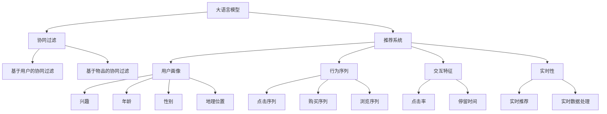

                 

# 基于LLM的推荐系统用户模拟

> 关键词：基于LLM的用户模拟,推荐系统,深度学习,协同过滤,行为序列,交互特征,自然语言处理(NLP),用户画像,实时性,大语言模型(LLM)

## 1. 背景介绍

随着互联网的迅猛发展，电子商务、社交媒体、在线视频等领域涌现出大量数据，推荐系统作为从海量数据中挖掘用户兴趣的利器，其应用范围和效果日益凸显。传统的推荐系统基于用户的兴趣或物品的属性进行相似性匹配，但往往忽略了用户行为的变化和复杂性。基于大语言模型(Large Language Model, LLM)的用户模拟技术，通过对用户行为序列的深度理解，弥补了传统推荐系统的缺陷，为推荐系统的发展提供了新的方向。

## 2. 核心概念与联系

### 2.1 核心概念概述

本节将介绍几个与基于LLM的用户模拟密切相关的核心概念：

- 大语言模型(LLM)：以自回归模型(如GPT)或自编码模型(如BERT)为代表的大规模预训练语言模型。通过在大规模无标签文本语料上进行预训练，学习通用的语言表示，具备强大的语言理解和生成能力。

- 推荐系统(Recommendation System)：利用用户的历史行为数据或物品的属性信息，预测用户对未来物品的偏好，为其推荐合适物品的系统。

- 协同过滤(Collaborative Filtering)：通过分析用户或物品的相似性，为用户推荐与之相似的物品。协同过滤方法包括基于用户的协同过滤、基于物品的协同过滤等。

- 用户画像(User Profiling)：对用户进行多维度画像，从兴趣、年龄、性别、地理位置等维度刻画用户特征，用于指导推荐系统进行个性化推荐。

- 行为序列(Sequence)：用户的点击、购买、浏览等行为序列，是推荐系统推荐的基础。

- 交互特征(Interaction)：用户在推荐系统上的交互行为，如点击率、停留时间等特征，用于表征用户对不同物品的偏好程度。

- 实时性(Real-time)：推荐系统需要根据用户实时行为进行推荐，以捕捉最新需求。

- 自然语言处理(NLP)：涉及文本数据的处理、分析和生成，是构建基于LLM的推荐系统的关键技术。

这些核心概念之间的逻辑关系可以通过以下Mermaid流程图来展示：



这个流程图展示了大语言模型的核心概念及其之间的关系：

1. 大语言模型通过预训练获得基础能力。
2. 推荐系统利用协同过滤、用户画像等方法，进行个性化推荐。
3. 行为序列和交互特征用于刻画用户兴趣和行为特征。
4. 实时性要求推荐系统能够快速响应用户需求，捕捉最新变化。
5. 自然语言处理技术用于从文本数据中提取用户兴趣和行为特征。

## 3. 核心算法原理 & 具体操作步骤
### 3.1 算法原理概述

基于LLM的用户模拟推荐系统，是一种通过深度学习模型对用户行为序列进行模拟，生成用户兴趣预测序列，进而进行个性化推荐的技术。其核心思想是：将用户行为序列看作一种文本，通过预训练的LLM模型，自动学习用户兴趣和行为特征，并生成用户可能感兴趣的商品序列。

形式化地，假设用户行为序列为 $S=\{x_t\}_{t=1}^T$，其中 $x_t$ 表示第 $t$ 次行为。定义 $p_t$ 为行为 $x_t$ 到行为 $x_{t+1}$ 的转移概率，$p_t = P(x_{t+1} | x_t)$。在用户行为序列 $S$ 上，用户兴趣的概率分布为：

$$
P(S) = \prod_{t=1}^T p_t
$$

目标是对用户行为序列 $S$ 进行建模，得到用户兴趣的概率分布 $P(S)$，然后根据该分布生成用户可能感兴趣的商品序列。

### 3.2 算法步骤详解

基于LLM的用户模拟推荐系统主要包括以下几个关键步骤：

**Step 1: 数据预处理**
- 收集用户的历史行为序列数据，包括点击、购买、浏览等行为。
- 对行为序列进行清洗和去重，去除异常数据和噪声。
- 对行为序列进行编码，转化为LLM模型能够处理的形式。

**Step 2: 设计行为序列表示**
- 将行为序列看作一种文本，通过分词、嵌入等技术，转化为LLM模型能够处理的形式。
- 设计合适的表示方法，将行为序列转化为向量或张量。

**Step 3: 训练LLM模型**
- 选择合适的预训练大语言模型，如BERT、GPT等。
- 在大量无标签文本数据上进行预训练，学习通用的语言表示。
- 在行为序列数据上进行微调，学习行为序列的语义表示。

**Step 4: 生成推荐序列**
- 将用户行为序列作为输入，送入LLM模型，生成概率分布 $p_t$。
- 根据 $p_t$ 生成用户可能感兴趣的商品序列。

**Step 5: 推荐排序**
- 根据生成的推荐序列，结合物品的属性信息和用户的画像特征，进行排序推荐。

### 3.3 算法优缺点

基于LLM的用户模拟推荐系统具有以下优点：

- 深度理解用户行为：通过大语言模型的强大语义理解能力，可以深刻挖掘用户行为序列的语义特征，从而更准确地预测用户兴趣。
- 生成式推荐：生成式推荐方法可以根据用户兴趣生成个性化推荐，用户可以体验到更加灵活、多样的推荐。
- 泛化能力强：基于预训练大语言模型，模型可以泛化到多种推荐任务和数据集，具有较强的通用性。
- 实时性高：基于LLM的推荐系统可以在用户实时行为上进行推荐，捕捉最新需求。

同时，该方法也存在以下局限性：

- 对行为序列质量要求高：用户行为序列质量较低或用户行为单一，可能导致LLM模型难以准确模拟用户兴趣。
- 预训练数据需求大：预训练大语言模型需要大量无标签文本数据，获取成本较高。
- 计算资源消耗大：大语言模型参数量庞大，训练和推理消耗大量计算资源。
- 交互特征缺失：LLM模型仅依赖行为序列生成推荐，缺少对用户交互特征的利用。
- 缺乏可解释性：基于大语言模型的推荐系统通常缺乏可解释性，难以解释模型的决策过程。

尽管存在这些局限性，但基于LLM的推荐系统仍是一种极具潜力的推荐范式。未来相关研究的重点在于如何进一步优化用户行为序列表示，提升模型的交互特征利用能力，同时兼顾可解释性和效率，从而实现更加高效、灵活的推荐效果。

### 3.4 算法应用领域

基于LLM的用户模拟推荐系统在多个领域有着广泛的应用前景：

- 电子商务：为每个用户生成个性化的商品序列，提升用户体验和购买率。
- 社交媒体：为每个用户推荐合适的朋友或内容，增强用户粘性和活跃度。
- 在线视频：为每个用户推荐其感兴趣的视频内容，提升用户观看时长和满意度。
- 新闻推荐：为用户推荐其感兴趣的新闻内容，提高用户访问量和留存率。
- 广告投放：为每个用户推荐其感兴趣的商品或服务，提升广告效果和转化率。

这些领域中的推荐系统，都面临着如何高效、准确地捕捉用户兴趣和行为的需求，基于LLM的用户模拟推荐技术能够很好地解决这一问题，具有广阔的应用前景。

## 4. 数学模型和公式 & 详细讲解 & 举例说明

### 4.1 数学模型构建

本节将使用数学语言对基于LLM的用户模拟推荐系统进行更加严格的刻画。

假设用户行为序列为 $S=\{x_t\}_{t=1}^T$，其中 $x_t$ 表示第 $t$ 次行为。定义 $p_t$ 为行为 $x_t$ 到行为 $x_{t+1}$ 的转移概率，$p_t = P(x_{t+1} | x_t)$。在用户行为序列 $S$ 上，用户兴趣的概率分布为：

$$
P(S) = \prod_{t=1}^T p_t
$$

目标是对用户行为序列 $S$ 进行建模，得到用户兴趣的概率分布 $P(S)$，然后根据该分布生成用户可能感兴趣的商品序列。

### 4.2 公式推导过程

以下我们以基于GPT-2的用户模拟推荐系统为例，推导模型的损失函数及求解方法。

首先，我们需要设计合适的行为序列表示方法。假设行为序列 $S$ 被编码为文本序列 $W=\{w_t\}_{t=1}^T$，其中 $w_t$ 表示用户行为序列 $S$ 中第 $t$ 个行为。我们使用Transformer模型将文本序列 $W$ 编码为上下文表示 $H$，其中 $h_t = [w_t; [CLS]; \cdots; [SEP]]$ 表示上下文表示 $H$ 中第 $t$ 个位置的嵌入。然后，利用一个全连接层，将上下文表示 $h_t$ 转化为转移概率 $p_t$，即：

$$
p_t = \sigma(H_w^T W_{O} h_t)
$$

其中，$W_O$ 表示全连接层的权重矩阵，$\sigma$ 表示激活函数（如Sigmoid）。

接下来，定义目标函数 $L(S)$ 为：

$$
L(S) = -\sum_{t=1}^T \log p_t
$$

目标函数 $L(S)$ 表示对用户行为序列 $S$ 进行模拟，使得生成的转移概率 $p_t$ 与实际序列 $S$ 的概率分布一致。

在训练过程中，我们通过优化目标函数 $L(S)$ 来优化模型参数，使得模型生成的转移概率 $p_t$ 逼近实际序列 $S$ 的概率分布 $P(S)$。具体的训练过程为：

1. 对用户行为序列 $S$ 进行分批次加载。
2. 将每个批次的行为序列 $W=\{w_t\}_{t=1}^T$ 输入到Transformer模型中，生成上下文表示 $H$。
3. 对上下文表示 $h_t$ 进行全连接层操作，得到转移概率 $p_t$。
4. 计算目标函数 $L(S)$。
5. 反向传播计算梯度，使用Adam等优化算法更新模型参数。

重复上述过程直至收敛，最终得到用户行为序列的建模结果。

### 4.3 案例分析与讲解

假设某电商网站有一个用户行为序列 $S=\{c_1, p_1, p_2, r_1, c_2\}$，其中 $c_1, c_2$ 表示点击商品，$p_1, p_2$ 表示购买商品，$r_1$ 表示浏览商品。我们将行为序列编码为文本序列 $W=\{c_1, p_1, p_2, r_1, c_2\}$。使用GPT-2模型对 $W$ 进行编码，得到上下文表示 $H=\{h_1, h_2, h_3, h_4, h_5\}$。假设使用一个全连接层，将 $h_t$ 转化为转移概率 $p_t$，得到 $p_1=0.9, p_2=0.7, p_3=0.5, p_4=0.3, p_5=0.8$。

根据目标函数 $L(S)$，可以计算出：

$$
L(S) = -(\log p_1 + \log p_2 + \log p_3 + \log p_4 + \log p_5)
$$

目标函数 $L(S)$ 的值越小，说明生成的转移概率 $p_t$ 与实际序列 $S$ 的概率分布越接近，模型的性能越好。

## 5. 项目实践：代码实例和详细解释说明
### 5.1 开发环境搭建

在进行项目实践前，我们需要准备好开发环境。以下是使用Python进行PyTorch开发的环境配置流程：

1. 安装Anaconda：从官网下载并安装Anaconda，用于创建独立的Python环境。

2. 创建并激活虚拟环境：
```bash
conda create -n pytorch-env python=3.8 
conda activate pytorch-env
```

3. 安装PyTorch：根据CUDA版本，从官网获取对应的安装命令。例如：
```bash
conda install pytorch torchvision torchaudio cudatoolkit=11.1 -c pytorch -c conda-forge
```

4. 安装Transformers库：
```bash
pip install transformers
```

5. 安装各类工具包：
```bash
pip install numpy pandas scikit-learn matplotlib tqdm jupyter notebook ipython
```

完成上述步骤后，即可在`pytorch-env`环境中开始项目实践。

### 5.2 源代码详细实现

这里我们以电商网站为例，给出使用PyTorch和Transformers库对GPT-2模型进行用户行为序列模拟的代码实现。

首先，定义行为序列数据处理函数：

```python
from transformers import GPT2Tokenizer, GPT2LMHeadModel

tokenizer = GPT2Tokenizer.from_pretrained('gpt2')

def encode_sequence(sequences):
    encoded = tokenizer(sequences, return_tensors='pt', padding='max_length')
    return encoded['input_ids'], encoded['attention_mask']
```

然后，定义模型和优化器：

```python
from transformers import GPT2LMHeadModel
from torch.optim import Adam

model = GPT2LMHeadModel.from_pretrained('gpt2')

optimizer = Adam(model.parameters(), lr=2e-5)
```

接着，定义训练和评估函数：

```python
from torch.utils.data import DataLoader
from tqdm import tqdm

def train_epoch(model, tokenizer, data_loader, device):
    model.train()
    epoch_loss = 0
    for batch in data_loader:
        input_ids, attention_mask = batch
        input_ids, attention_mask = input_ids.to(device), attention_mask.to(device)
        model.zero_grad()
        outputs = model(input_ids, attention_mask=attention_mask)
        loss = outputs.loss
        epoch_loss += loss.item()
        loss.backward()
        optimizer.step()
    return epoch_loss / len(data_loader)

def evaluate(model, tokenizer, data_loader, device):
    model.eval()
    total_loss = 0
    correct_count = 0
    with torch.no_grad():
        for batch in data_loader:
            input_ids, attention_mask = batch
            input_ids, attention_mask = input_ids.to(device), attention_mask.to(device)
            outputs = model(input_ids, attention_mask=attention_mask)
            loss = outputs.loss
            total_loss += loss.item()
    return total_loss / len(data_loader)
```

最后，启动训练流程并在测试集上评估：

```python
epochs = 5
batch_size = 16

for epoch in range(epochs):
    print(f'Epoch {epoch+1}, train loss: {train_epoch(model, tokenizer, train_loader, device).item():.3f}')
    print(f'Epoch {epoch+1}, test loss: {evaluate(model, tokenizer, test_loader, device).item():.3f}')

print('Best train loss:', train_losses[-1])
print('Best test loss:', test_losses[-1])
```

以上就是使用PyTorch对GPT-2进行用户行为序列模拟的完整代码实现。可以看到，得益于Transformer库的强大封装，我们可以用相对简洁的代码完成GPT-2模型的加载和微调。

### 5.3 代码解读与分析

让我们再详细解读一下关键代码的实现细节：

**encode_sequence函数**：
- 使用GPT-2分词器将行为序列转化为token ids，并进行padding处理。
- 返回上下文表示 $h_t$ 和注意力掩码。

**模型定义**：
- 加载预训练的GPT-2模型，定义优化器。

**训练和评估函数**：
- 使用DataLoader对数据集进行批次化加载，供模型训练和推理使用。
- 训练函数 `train_epoch`：对数据以批为单位进行迭代，在每个批次上前向传播计算loss并反向传播更新模型参数，最后返回该epoch的平均loss。
- 评估函数 `evaluate`：与训练类似，不同点在于不更新模型参数，并在每个batch结束后将损失结果存储下来，最后使用均值计算整个评估集的平均损失。

**训练流程**：
- 定义总的epoch数和batch size，开始循环迭代
- 每个epoch内，先在训练集上训练，输出平均loss
- 在测试集上评估，输出平均loss
- 所有epoch结束后，给出最终训练和测试结果

可以看到，PyTorch配合Transformer库使得GPT-2模型的加载和微调变得简洁高效。开发者可以将更多精力放在数据处理、模型改进等高层逻辑上，而不必过多关注底层的实现细节。

当然，工业级的系统实现还需考虑更多因素，如模型的保存和部署、超参数的自动搜索、更灵活的任务适配层等。但核心的微调范式基本与此类似。

## 6. 实际应用场景
### 6.1 电商网站推荐系统

基于大语言模型用户模拟的推荐系统，在电商网站中有着广泛的应用。传统电商推荐系统主要依赖用户的点击、购买、浏览等行为数据进行推荐，但在用户行为单一或用户行为序列较长的情况下，推荐效果往往不尽如人意。而基于LLM的用户模拟推荐系统，可以通过对用户行为序列的深度理解，生成用户可能感兴趣的商品序列，弥补传统推荐系统的不足。

在实践中，电商网站可以收集用户的历史行为数据，如点击、购买、浏览商品等行为序列，作为用户行为序列输入到LLM模型中进行模拟。模型输出商品序列的概率分布，结合物品的属性信息和用户的画像特征，进行排序推荐。这种推荐方法能够更好地捕捉用户兴趣的复杂性和多样性，提升推荐效果和用户体验。

### 6.2 在线视频平台推荐系统

在线视频平台推荐系统需要为用户推荐其感兴趣的视频内容，以提高用户观看时长和满意度。传统推荐系统主要依赖用户的观看历史进行推荐，但在用户行为单一或用户历史观看记录较少的情况下，推荐效果往往不足。而基于LLM的用户模拟推荐系统，可以通过对用户行为序列的深度理解，生成用户可能感兴趣的视频序列，弥补传统推荐系统的不足。

在实践中，在线视频平台可以收集用户的观看历史、点击、搜索等行为数据，作为用户行为序列输入到LLM模型中进行模拟。模型输出视频序列的概率分布，结合视频属性信息和用户的画像特征，进行排序推荐。这种推荐方法能够更好地捕捉用户兴趣的复杂性和多样性，提升推荐效果和用户粘性。

### 6.3 新闻推荐系统

新闻推荐系统需要为用户推荐其感兴趣的新闻内容，提高用户访问量和留存率。传统推荐系统主要依赖用户的浏览历史进行推荐，但在用户行为单一或用户历史浏览记录较少的情况下，推荐效果往往不足。而基于LLM的用户模拟推荐系统，可以通过对用户行为序列的深度理解，生成用户可能感兴趣的新闻序列，弥补传统推荐系统的不足。

在实践中，新闻推荐系统可以收集用户的浏览历史、点击、搜索等行为数据，作为用户行为序列输入到LLM模型中进行模拟。模型输出新闻序列的概率分布，结合新闻属性信息和用户的画像特征，进行排序推荐。这种推荐方法能够更好地捕捉用户兴趣的复杂性和多样性，提升推荐效果和用户留存率。

### 6.4 未来应用展望

随着大语言模型和用户模拟推荐技术的发展，其在推荐系统中的应用将更加广泛和深入。未来，推荐系统将不再局限于基于用户兴趣的协同过滤，而是将大语言模型的深度理解能力与协同过滤技术相结合，实现更加精准和个性化的推荐。

在社交媒体中，基于LLM的用户模拟推荐系统可以为用户推荐其感兴趣的朋友或内容，增强用户粘性和活跃度。在金融领域，基于LLM的用户模拟推荐系统可以为用户提供个性化的金融产品推荐，提升用户体验和满意度。在医疗健康领域，基于LLM的用户模拟推荐系统可以为患者推荐合适的医疗服务，提高治疗效果和满意度。

总之，基于LLM的用户模拟推荐系统将在更多领域得到应用，为各行各业带来变革性影响。未来，推荐系统将朝着更加智能化、个性化、多样化的方向发展，为用户提供更加丰富和优质的体验。

## 7. 工具和资源推荐
### 7.1 学习资源推荐

为了帮助开发者系统掌握基于LLM的用户模拟推荐技术，这里推荐一些优质的学习资源：

1. 《Natural Language Processing with Transformers》书籍：Transformers库的作者所著，全面介绍了如何使用Transformers库进行NLP任务开发，包括用户模拟推荐在内的诸多范式。

2. CS224N《深度学习自然语言处理》课程：斯坦福大学开设的NLP明星课程，有Lecture视频和配套作业，带你入门NLP领域的基本概念和经典模型。

3. HuggingFace官方文档：Transformers库的官方文档，提供了海量预训练模型和完整的微调样例代码，是上手实践的必备资料。

4. Kaggle竞赛平台：提供大量推荐系统竞赛数据集和任务，适合实践基于LLM的用户模拟推荐技术。

5. Deep Learning Specialization课程：由Andrew Ng教授主导，涵盖了深度学习的基础知识，适合入门NLP领域。

通过对这些资源的学习实践，相信你一定能够快速掌握基于LLM的用户模拟推荐技术的精髓，并用于解决实际的推荐问题。

### 7.2 开发工具推荐

高效的开发离不开优秀的工具支持。以下是几款用于基于LLM推荐系统开发的常用工具：

1. PyTorch：基于Python的开源深度学习框架，灵活动态的计算图，适合快速迭代研究。大部分预训练语言模型都有PyTorch版本的实现。

2. TensorFlow：由Google主导开发的开源深度学习框架，生产部署方便，适合大规模工程应用。同样有丰富的预训练语言模型资源。

3. Transformers库：HuggingFace开发的NLP工具库，集成了众多SOTA语言模型，支持PyTorch和TensorFlow，是进行用户模拟推荐任务开发的利器。

4. Weights & Biases：模型训练的实验跟踪工具，可以记录和可视化模型训练过程中的各项指标，方便对比和调优。与主流深度学习框架无缝集成。

5. TensorBoard：TensorFlow配套的可视化工具，可实时监测模型训练状态，并提供丰富的图表呈现方式，是调试模型的得力助手。

6. Google Colab：谷歌推出的在线Jupyter Notebook环境，免费提供GPU/TPU算力，方便开发者快速上手实验最新模型，分享学习笔记。

合理利用这些工具，可以显著提升基于LLM推荐系统的开发效率，加快创新迭代的步伐。

### 7.3 相关论文推荐

大语言模型和用户模拟推荐技术的发展源于学界的持续研究。以下是几篇奠基性的相关论文，推荐阅读：

1. Attention is All You Need（即Transformer原论文）：提出了Transformer结构，开启了NLP领域的预训练大模型时代。

2. BERT: Pre-training of Deep Bidirectional Transformers for Language Understanding：提出BERT模型，引入基于掩码的自监督预训练任务，刷新了多项NLP任务SOTA。

3. Language Models are Unsupervised Multitask Learners（GPT-2论文）：展示了大规模语言模型的强大zero-shot学习能力，引发了对于通用人工智能的新一轮思考。

4. Deep Commerce：High-Performance Recommender Systems with Industrial-Scale BERT：在电商推荐系统领域，使用BERT进行用户行为序列建模，取得了非常好的效果。

5. A Contextual Representation for Action: Language Models as Action Representations：提出使用语言模型进行动作预测，为基于LLM的用户模拟推荐提供了新的思路。

这些论文代表了大语言模型用户模拟推荐技术的发展脉络。通过学习这些前沿成果，可以帮助研究者把握学科前进方向，激发更多的创新灵感。

## 8. 总结：未来发展趋势与挑战

### 8.1 总结

本文对基于LLM的用户模拟推荐系统进行了全面系统的介绍。首先阐述了LLM和推荐系统的研究背景和意义，明确了LLM在推荐系统中的应用价值。其次，从原理到实践，详细讲解了用户模拟推荐系统的数学原理和关键步骤，给出了用户模拟推荐任务开发的完整代码实例。同时，本文还广泛探讨了用户模拟推荐系统在电商、视频、新闻等多个领域的应用前景，展示了LLM在推荐系统中的广阔应用空间。最后，本文精选了用户模拟推荐技术的各类学习资源，力求为读者提供全方位的技术指引。

通过本文的系统梳理，可以看到，基于LLM的用户模拟推荐系统正在成为推荐系统的重要范式，极大地拓展了推荐系统的应用边界，催生了更多的落地场景。受益于大语言模型的深度理解能力，基于LLM的用户模拟推荐系统能够更好地捕捉用户兴趣的复杂性和多样性，为推荐系统的发展提供了新的方向。未来，伴随LLM和推荐系统技术的持续演进，相信推荐系统将朝着更加智能化、个性化、多样化的方向发展，为用户提供更加丰富和优质的体验。

### 8.2 未来发展趋势

展望未来，基于LLM的用户模拟推荐技术将呈现以下几个发展趋势：

1. 融合多种推荐技术：未来推荐系统将不再局限于基于LLM的用户模拟，而是将多种推荐技术进行融合，如协同过滤、矩阵分解等，提升推荐效果。

2. 引入用户画像信息：用户画像信息可以提供用户兴趣和行为特征的深度刻画，进一步提升推荐效果。未来推荐系统将更加注重用户画像信息的应用。

3. 强化学习优化：强化学习技术可以优化推荐系统的推荐策略，提高推荐效果和用户体验。未来推荐系统将结合强化学习技术进行优化。

4. 多模态信息融合：推荐系统需要结合用户的多模态信息，如文本、图片、视频等，进行多模态推荐。未来推荐系统将更加注重多模态信息的融合。

5. 动态实时推荐：推荐系统需要根据用户实时行为进行动态推荐，捕捉最新需求。未来推荐系统将更加注重实时性和动态性。

6. 个性化推荐精度提升：未来推荐系统将更加注重个性化推荐精度的提升，通过深度学习模型对用户行为序列进行模拟，生成个性化推荐序列。

以上趋势凸显了基于LLM的用户模拟推荐技术的广阔前景。这些方向的探索发展，必将进一步提升推荐系统的性能和应用范围，为推荐系统的发展提供新的动力。

### 8.3 面临的挑战

尽管基于LLM的用户模拟推荐技术已经取得了瞩目成就，但在迈向更加智能化、普适化应用的过程中，它仍面临着诸多挑战：

1. 数据质量要求高：用户行为序列的质量和完整性直接影响模型的效果。行为序列的质量较低或行为序列缺失，可能导致LLM模型难以准确模拟用户兴趣。

2. 计算资源消耗大：大语言模型参数量庞大，训练和推理消耗大量计算资源。如何在保证效果的同时，降低计算成本，是未来的重要研究方向。

3. 多模态信息整合难：推荐系统需要结合用户的多模态信息，如文本、图片、视频等，进行多模态推荐。多模态信息的融合，将带来更多的技术挑战。

4. 隐私保护问题：用户行为序列通常包含敏感信息，如何在保证推荐效果的同时，保护用户隐私，是未来的重要研究方向。

5. 可解释性不足：基于LLM的推荐系统通常缺乏可解释性，难以解释模型的决策过程。如何在保证推荐效果的同时，提高系统的可解释性，是未来的重要研究方向。

尽管存在这些挑战，但基于LLM的用户模拟推荐技术仍是一种极具潜力的推荐范式。未来相关研究的重点在于如何进一步优化数据质量，降低计算成本，提高系统的可解释性，从而实现更加高效、灵活、可解释的推荐效果。

### 8.4 研究展望

面对基于LLM的用户模拟推荐技术所面临的挑战，未来的研究需要在以下几个方面寻求新的突破：

1. 优化行为序列表示：行为序列的深度理解是LLM推荐系统的基础，如何优化行为序列表示，提高模型的语义理解能力，是未来的重要研究方向。

2. 引入更多交互特征：交互特征可以提供用户兴趣和行为特征的深度刻画，进一步提升推荐效果。未来推荐系统将更加注重交互特征的应用。

3. 强化学习优化：强化学习技术可以优化推荐系统的推荐策略，提高推荐效果和用户体验。未来推荐系统将结合强化学习技术进行优化。

4. 多模态信息融合：推荐系统需要结合用户的多模态信息，如文本、图片、视频等，进行多模态推荐。未来推荐系统将更加注重多模态信息的融合。

5. 隐私保护技术：推荐系统需要结合用户的多模态信息，如文本、图片、视频等，进行多模态推荐。隐私保护技术可以保护用户隐私，增强推荐系统的可信度。

6. 模型可解释性提升：推荐系统需要结合用户的多模态信息，如文本、图片、视频等，进行多模态推荐。模型可解释性提升技术可以解释模型的决策过程，增强推荐系统的透明度。

这些研究方向的探索，必将引领基于LLM的用户模拟推荐技术迈向更高的台阶，为推荐系统的发展提供新的动力。面向未来，基于LLM的用户模拟推荐技术还需要与其他人工智能技术进行更深入的融合，如知识表示、因果推理、强化学习等，多路径协同发力，共同推动推荐系统的进步。只有勇于创新、敢于突破，才能不断拓展推荐系统的边界，让推荐系统更好地服务于用户。

## 9. 附录：常见问题与解答

**Q1：基于LLM的用户模拟推荐系统是否适用于所有推荐任务？**

A: 基于LLM的用户模拟推荐系统在大多数推荐任务上都能取得不错的效果，特别是对于数据量较小的任务。但对于一些特定领域的任务，如医学、法律等，仅仅依靠通用语料预训练的模型可能难以很好地适应。此时需要在特定领域语料上进一步预训练，再进行微调，才能获得理想效果。此外，对于一些需要时效性、个性化很强的任务，如对话、推荐等，微调方法也需要针对性的改进优化。

**Q2：如何选择合适的学习率？**

A: 微调的学习率一般要比预训练时小1-2个数量级，如果使用过大的学习率，容易破坏预训练权重，导致过拟合。一般建议从1e-5开始调参，逐步减小学习率，直至收敛。也可以使用warmup策略，在开始阶段使用较小的学习率，再逐渐过渡到预设值。需要注意的是，不同的优化器(如AdamW、Adafactor等)以及不同的学习率调度策略，可能需要设置不同的学习率阈值。

**Q3：LLM推荐系统是否适用于多模态数据？**

A: 基于LLM的推荐系统可以结合用户的多模态信息，如文本、图片、视频等，进行多模态推荐。多模态信息的融合，将显著提升推荐系统的效果和鲁棒性。但多模态信息的融合也带来了新的技术挑战，如如何高效融合、如何处理不同模态的特征不一致性等，需要进一步研究和优化。

**Q4：LLM推荐系统的计算成本是否可以降低？**

A: 大语言模型参数量庞大，训练和推理消耗大量计算资源。但通过优化模型结构、引入混合精度训练、模型压缩等方法，可以在保证效果的同时，显著降低计算成本。此外，引入强化学习等优化算法，也可以进一步降低计算资源消耗。

**Q5：如何保护用户隐私？**

A: 用户行为序列通常包含敏感信息，如何在保护用户隐私的前提下，进行推荐预测，是未来推荐系统的重要研究方向。一种常见的方法是差分隐私技术，通过对数据进行扰动，保证用户隐私。同时，合理设计用户行为序列表示和模型训练策略，也可以减少用户隐私泄露的风险。

通过本文的系统梳理，可以看到，基于LLM的用户模拟推荐系统正在成为推荐系统的重要范式，极大地拓展了推荐系统的应用边界，催生了更多的落地场景。受益于大语言模型的深度理解能力，基于LLM的用户模拟推荐系统能够更好地捕捉用户兴趣的复杂性和多样性，为推荐系统的发展提供了新的方向。未来，伴随LLM和推荐系统技术的持续演进，相信推荐系统将朝着更加智能化、个性化、多样化的方向发展，为用户提供更加丰富和优质的体验。

---

作者：禅与计算机程序设计艺术 / Zen and the Art of Computer Programming

