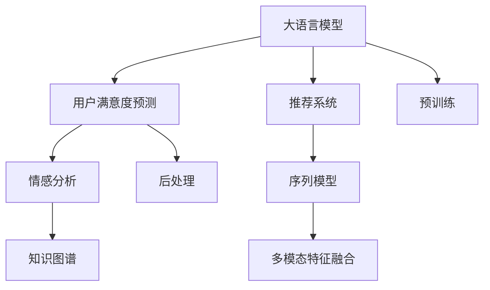

                 

# 基于LLM的推荐系统用户满意度预测

## 1. 背景介绍

### 1.1 问题由来

在推荐系统中，准确性和个性化都是重要的评价指标。然而，除了这两个指标，用户对推荐内容的满意度也是不容忽视的重要维度。用户满意度预测能够帮助推荐系统理解用户的真实需求，调整推荐策略，提升整体的用户体验。近年来，随着大语言模型(Large Language Model, LLM)在自然语言处理(Natural Language Processing, NLP)领域的突破，基于LLM的用户满意度预测成为了研究热点。

### 1.2 问题核心关键点

用户满意度预测的核心在于构建一个能够准确理解用户反馈并预测其满意度的模型。传统的推荐系统多基于用户行为数据，如点击率、浏览时长、评分等，难以捕捉用户的主观情感和真实需求。基于LLM的满意度预测，则可以通过对用户评论、反馈文本的分析，直接预测用户的满意度，进一步提升推荐系统的质量和用户体验。

### 1.3 问题研究意义

研究基于LLM的用户满意度预测，对于提升推荐系统的用户体验和优化推荐策略具有重要意义：

1. 提升用户体验：准确的用户满意度预测能够帮助推荐系统及时调整推荐内容，提供符合用户需求和偏好的产品，提升用户满意度和粘性。
2. 优化推荐策略：通过对用户满意度的预测和分析，推荐系统可以发现现有策略的缺陷，有针对性地改进推荐算法，提升推荐质量。
3. 支持业务决策：用户满意度数据是业务决策的重要参考，通过分析用户满意度，可以帮助业务人员优化产品设计、改进客户服务，从而增加用户转化和业务收益。
4. 增强市场竞争力：在激烈的市场竞争中，准确的用户满意度预测能够帮助企业更好地理解用户需求，提高市场反应速度和用户满意度，提升企业竞争力。

## 2. 核心概念与联系

### 2.1 核心概念概述

为了更好地理解基于LLM的用户满意度预测方法，本节将介绍几个密切相关的核心概念：

- 大语言模型(Large Language Model, LLM)：以自回归(如GPT)或自编码(如BERT)模型为代表的大规模预训练语言模型。通过在大规模无标签文本语料上进行预训练，学习通用的语言表示，具备强大的语言理解和生成能力。

- 推荐系统(Recommendation System)：根据用户历史行为数据和兴趣偏好，推荐用户可能感兴趣的物品，提高用户满意度和转化率。

- 用户满意度预测(User Satisfaction Prediction)：通过分析用户评论、反馈文本等，预测用户对推荐物品的满意程度。

- 情感分析(Sentiment Analysis)：分析文本情感，判断文本中的情感倾向（如正面、中性、负面）。

- 序列模型(Sequence Model)：通过时间序列模型，捕捉时间相关的用户行为特征，预测用户满意度。

- 知识图谱(Knowledge Graph)：将实体、关系、属性等信息结构化存储，用于提升推荐系统中的知识整合能力。

这些核心概念之间的逻辑关系可以通过以下Mermaid流程图来展示：



这个流程图展示了大语言模型在推荐系统中的作用：

1. 大语言模型通过预训练获得基础能力。
2. 用户满意度预测利用预训练语言模型，对用户评论进行情感分析，从而预测用户满意度。
3. 情感分析可以作为推荐系统的输入，帮助推荐更加符合用户情感偏好的物品。
4. 知识图谱提供外部知识，帮助提升推荐系统的信息整合能力。
5. 序列模型捕捉时间序列特征，预测用户随时间的变化趋势。
6. 多模态特征融合将不同模态的数据进行融合，提升用户满意度预测的准确性。

## 3. 核心算法原理 & 具体操作步骤

### 3.1 算法原理概述

基于LLM的用户满意度预测，本质上是将预训练的LLM作为"特征提取器"，利用其对自然语言的理解能力，分析用户反馈文本的情感倾向，从而预测用户的满意度。其核心思想是：通过用户评论、反馈文本等语料，利用预训练语言模型，提取出其中的情感信息，然后结合其他用户行为特征，构建预测模型。

形式化地，假设预训练模型为 $M_{\theta}$，其中 $\theta$ 为预训练得到的模型参数。给定用户反馈的评论文本序列 $S=(s_1, s_2, ..., s_n)$，用户满意度预测任务的目标是找到新的模型参数 $\hat{\theta}$，使得模型能够预测用户对推荐物品的满意度 $y$，即：

$$
\hat{\theta} = \mathop{\arg\min}_{\theta} \mathcal{L}(y, M_{\theta}(S))
$$

其中 $\mathcal{L}$ 为损失函数，用于衡量预测结果与实际标签之间的差异。常见的损失函数包括均方误差损失、交叉熵损失等。

### 3.2 算法步骤详解

基于LLM的用户满意度预测一般包括以下几个关键步骤：

**Step 1: 准备预训练模型和数据集**

1. 选择合适的预训练语言模型 $M_{\theta}$ 作为初始化参数，如 BERT、GPT 等。
2. 准备用户评论数据集 $D=\{(s_i, y_i)\}_{i=1}^N$，其中 $s_i$ 为用户的评论文本序列，$y_i$ 为对应评论的满意度标签。

**Step 2: 添加任务适配层**

1. 根据任务类型，在预训练模型顶层设计合适的输出层和损失函数。
2. 对于二分类任务，通常在顶层添加线性分类器和交叉熵损失函数。
3. 对于多分类任务，使用softmax函数输出概率分布，以多分类交叉熵损失函数。

**Step 3: 设置微调超参数**

1. 选择合适的优化算法及其参数，如 AdamW、SGD 等，设置学习率、批大小、迭代轮数等。
2. 设置正则化技术及强度，包括权重衰减、Dropout、Early Stopping 等。
3. 确定冻结预训练参数的策略，如仅微调顶层，或全部参数都参与微调。

**Step 4: 执行梯度训练**

1. 将训练集数据分批次输入模型，前向传播计算损失函数。
2. 反向传播计算参数梯度，根据设定的优化算法和学习率更新模型参数。
3. 周期性在验证集上评估模型性能，根据性能指标决定是否触发 Early Stopping。
4. 重复上述步骤直到满足预设的迭代轮数或 Early Stopping 条件。

**Step 5: 测试和部署**

1. 在测试集上评估微调后模型 $M_{\hat{\theta}}$ 的性能，对比微调前后的精度提升。
2. 使用微调后的模型对新样本进行推理预测，集成到实际的应用系统中。
3. 持续收集新的数据，定期重新微调模型，以适应数据分布的变化。

以上是基于LLM的用户满意度预测的一般流程。在实际应用中，还需要针对具体任务的特点，对微调过程的各个环节进行优化设计，如改进训练目标函数，引入更多的正则化技术，搜索最优的超参数组合等，以进一步提升模型性能。

### 3.3 算法优缺点

基于LLM的用户满意度预测方法具有以下优点：

1. 简单高效。只需准备少量标注数据，即可对预训练模型进行快速适配，获得较大的性能提升。
2. 通用适用。适用于各种推荐系统中的用户满意度预测任务，设计简单的任务适配层即可实现。
3. 融合情感分析。通过情感分析技术，能够直接从用户评论中捕捉情感信息，预测用户满意度，更符合用户真实需求。
4. 结合多模态数据。可以融合其他用户行为特征，如点击率、浏览时长、评分等，进一步提升预测精度。

同时，该方法也存在一定的局限性：

1. 依赖标注数据。用户满意度的标注成本较高，难以获取高质量标注数据。
2. 泛化能力有限。当评论文本与预训练数据的分布差异较大时，模型泛化能力可能受限。
3. 模型复杂度较高。预训练模型的参数量较大，微调过程可能需要较长时间和计算资源。

尽管存在这些局限性，但就目前而言，基于LLM的用户满意度预测方法仍是大语言模型应用的重要范式之一。未来相关研究的重点在于如何进一步降低标注数据的依赖，提高模型的泛化能力和计算效率，同时兼顾可解释性和伦理安全性等因素。

### 3.4 算法应用领域

基于LLM的用户满意度预测方法，在推荐系统中的应用广泛，具体如下：

1. 电商推荐系统：分析用户对电商商品的评论，预测用户对推荐商品的满意度，调整推荐策略，提升用户购物体验。
2. 视频推荐系统：分析用户对视频内容的评论，预测用户对推荐视频的满意度，优化推荐算法，提高用户观看满意度。
3. 新闻推荐系统：分析用户对新闻文章的评论，预测用户对推荐新闻的满意度，提升新闻推送的个性化和准确性。
4. 娱乐推荐系统：分析用户对娱乐内容的评论，预测用户对推荐内容的满意度，优化推荐内容，提高用户娱乐体验。
5. 社交媒体推荐系统：分析用户对社交媒体内容的评论，预测用户对推荐内容的满意度，优化内容推荐，提升用户社交体验。

除了上述这些经典应用外，基于LLM的用户满意度预测技术还可以用于更多场景中，如金融产品推荐、旅游推荐、知识推荐等，为推荐系统带来新的突破。

## 4. 数学模型和公式 & 详细讲解

### 4.1 数学模型构建

本节将使用数学语言对基于LLM的用户满意度预测过程进行更加严格的刻画。

记预训练语言模型为 $M_{\theta}$，其中 $\theta$ 为预训练得到的模型参数。假设用户满意度预测任务为二分类任务，即预测评论 $s_i$ 的满意度 $y_i$ 为 0（不满意）或 1（满意）。则定义模型 $M_{\theta}$ 在输入 $s_i$ 上的输出为 $\hat{y}_i=M_{\theta}(s_i)$，表示模型预测用户满意度为满意的概率。

假设用户评论数据集 $D=\{(s_i, y_i)\}_{i=1}^N$，则任务的目标是找到最优模型参数 $\hat{\theta}$，使得模型在数据集上的经验风险最小化，即：

$$
\hat{\theta} = \mathop{\arg\min}_{\theta} \mathcal{L}(\theta, D)
$$

其中 $\mathcal{L}$ 为二分类交叉熵损失函数，定义为：

$$
\mathcal{L}(\theta, D) = -\frac{1}{N} \sum_{i=1}^N [y_i\log \hat{y}_i + (1-y_i)\log (1-\hat{y}_i)]
$$

在得到损失函数的梯度后，即可带入参数更新公式，完成模型的迭代优化。重复上述过程直至收敛，最终得到适应用户满意度预测任务的模型参数 $\hat{\theta}$。

### 4.2 公式推导过程

以下我们以二分类任务为例，推导交叉熵损失函数及其梯度的计算公式。

假设模型 $M_{\theta}$ 在输入 $s_i$ 上的输出为 $\hat{y}_i=M_{\theta}(s_i)$，表示模型预测用户满意度为满意的概率。真实标签 $y_i \in \{0,1\}$。则二分类交叉熵损失函数定义为：

$$
\ell(M_{\theta}(s_i),y_i) = -[y_i\log \hat{y}_i + (1-y_i)\log (1-\hat{y}_i)]
$$

将其代入经验风险公式，得：

$$
\mathcal{L}(\theta) = -\frac{1}{N}\sum_{i=1}^N [y_i\log M_{\theta}(s_i)+(1-y_i)\log(1-M_{\theta}(s_i))]
$$

根据链式法则，损失函数对参数 $\theta_k$ 的梯度为：

$$
\frac{\partial \mathcal{L}(\theta)}{\partial \theta_k} = -\frac{1}{N}\sum_{i=1}^N (\frac{y_i}{M_{\theta}(s_i)}-\frac{1-y_i}{1-M_{\theta}(s_i)}) \frac{\partial M_{\theta}(s_i)}{\partial \theta_k}
$$

其中 $\frac{\partial M_{\theta}(s_i)}{\partial \theta_k}$ 可进一步递归展开，利用自动微分技术完成计算。

在得到损失函数的梯度后，即可带入参数更新公式，完成模型的迭代优化。重复上述过程直至收敛，最终得到适应用户满意度预测任务的模型参数 $\hat{\theta}$。

### 4.3 案例分析与讲解

在实际应用中，用户评论数据往往带有大量非结构化信息，需要进行预处理和特征提取。以电商评论为例，常用的预处理步骤包括：

1. 去除评论中的HTML标签和特殊字符。
2. 统一评论中的大小写，转换为小写。
3. 去除停用词和标点符号。
4. 进行词干提取和词形还原。

预处理后的评论文本 $s_i$ 表示为单词序列 $(s_{i,1}, s_{i,2}, ..., s_{i,n})$。然后通过预训练语言模型 $M_{\theta}$，将评论文本序列 $s_i$ 转化为向量表示 $v_i = M_{\theta}(s_i)$。

接下来，可以结合其他用户行为特征，如点击率 $c_i$、浏览时长 $t_i$、评分 $r_i$ 等，构成向量 $\mathbf{x}_i = [v_i, c_i, t_i, r_i]$。最终，利用向量 $\mathbf{x}_i$ 作为输入，训练一个简单的二分类模型，预测用户满意度 $y_i$。

例如，可以使用线性回归模型，构建如下损失函数：

$$
\mathcal{L}(\theta, D) = \frac{1}{N} \sum_{i=1}^N (y_i - \mathbf{w}^T\mathbf{x}_i)^2
$$

其中 $\mathbf{w}$ 为模型参数，$\theta$ 为预训练模型参数。通过最小化损失函数 $\mathcal{L}$，不断更新模型参数，使得预测结果 $y_i$ 与实际标签 $y_i$ 尽可能接近。

## 5. 项目实践：代码实例和详细解释说明

### 5.1 开发环境搭建

在进行用户满意度预测的微调实践前，我们需要准备好开发环境。以下是使用Python进行PyTorch开发的环境配置流程：

1. 安装Anaconda：从官网下载并安装Anaconda，用于创建独立的Python环境。

2. 创建并激活虚拟环境：
```bash
conda create -n pytorch-env python=3.8 
conda activate pytorch-env
```

3. 安装PyTorch：根据CUDA版本，从官网获取对应的安装命令。例如：
```bash
conda install pytorch torchvision torchaudio cudatoolkit=11.1 -c pytorch -c conda-forge
```

4. 安装Transformers库：
```bash
pip install transformers
```

5. 安装各类工具包：
```bash
pip install numpy pandas scikit-learn matplotlib tqdm jupyter notebook ipython
```

完成上述步骤后，即可在`pytorch-env`环境中开始微调实践。

### 5.2 源代码详细实现

下面我们以电商推荐系统的用户满意度预测为例，给出使用Transformers库对BERT模型进行微调的PyTorch代码实现。

首先，定义用户满意度预测任务的数据处理函数：

```python
from transformers import BertTokenizer
from torch.utils.data import Dataset
import torch

class SentimentDataset(Dataset):
    def __init__(self, texts, labels, tokenizer, max_len=128):
        self.texts = texts
        self.labels = labels
        self.tokenizer = tokenizer
        self.max_len = max_len
        
    def __len__(self):
        return len(self.texts)
    
    def __getitem__(self, item):
        text = self.texts[item]
        label = self.labels[item]
        
        encoding = self.tokenizer(text, return_tensors='pt', max_length=self.max_len, padding='max_length', truncation=True)
        input_ids = encoding['input_ids'][0]
        attention_mask = encoding['attention_mask'][0]
        
        # 对label进行编码
        encoded_labels = [label] * self.max_len
        labels = torch.tensor(encoded_labels, dtype=torch.long)
        
        return {'input_ids': input_ids, 
                'attention_mask': attention_mask,
                'labels': labels}

# 准备数据
tokenizer = BertTokenizer.from_pretrained('bert-base-cased')

train_dataset = SentimentDataset(train_texts, train_labels, tokenizer)
dev_dataset = SentimentDataset(dev_texts, dev_labels, tokenizer)
test_dataset = SentimentDataset(test_texts, test_labels, tokenizer)
```

然后，定义模型和优化器：

```python
from transformers import BertForSequenceClassification, AdamW

model = BertForSequenceClassification.from_pretrained('bert-base-cased', num_labels=2)

optimizer = AdamW(model.parameters(), lr=2e-5)
```

接着，定义训练和评估函数：

```python
from torch.utils.data import DataLoader
from tqdm import tqdm
from sklearn.metrics import accuracy_score, precision_score, recall_score, f1_score

device = torch.device('cuda') if torch.cuda.is_available() else torch.device('cpu')
model.to(device)

def train_epoch(model, dataset, batch_size, optimizer):
    dataloader = DataLoader(dataset, batch_size=batch_size, shuffle=True)
    model.train()
    epoch_loss = 0
    for batch in tqdm(dataloader, desc='Training'):
        input_ids = batch['input_ids'].to(device)
        attention_mask = batch['attention_mask'].to(device)
        labels = batch['labels'].to(device)
        model.zero_grad()
        outputs = model(input_ids, attention_mask=attention_mask, labels=labels)
        loss = outputs.loss
        epoch_loss += loss.item()
        loss.backward()
        optimizer.step()
    return epoch_loss / len(dataloader)

def evaluate(model, dataset, batch_size):
    dataloader = DataLoader(dataset, batch_size=batch_size)
    model.eval()
    preds, labels = [], []
    with torch.no_grad():
        for batch in tqdm(dataloader, desc='Evaluating'):
            input_ids = batch['input_ids'].to(device)
            attention_mask = batch['attention_mask'].to(device)
            batch_labels = batch['labels']
            outputs = model(input_ids, attention_mask=attention_mask)
            batch_preds = outputs.logits.argmax(dim=2).to('cpu').tolist()
            batch_labels = batch_labels.to('cpu').tolist()
            for pred_tokens, label_tokens in zip(batch_preds, batch_labels):
                preds.append(pred_tokens[:len(label_tokens)])
                labels.append(label_tokens)
                
    print("Accuracy: {:.3f}".format(accuracy_score(labels, preds)))
    print("Precision: {:.3f}".format(precision_score(labels, preds)))
    print("Recall: {:.3f}".format(recall_score(labels, preds)))
    print("F1 Score: {:.3f}".format(f1_score(labels, preds)))
```

最后，启动训练流程并在测试集上评估：

```python
epochs = 5
batch_size = 16

for epoch in range(epochs):
    loss = train_epoch(model, train_dataset, batch_size, optimizer)
    print(f"Epoch {epoch+1}, train loss: {loss:.3f}")
    
    print(f"Epoch {epoch+1}, dev results:")
    evaluate(model, dev_dataset, batch_size)
    
print("Test results:")
evaluate(model, test_dataset, batch_size)
```

以上就是使用PyTorch对BERT进行用户满意度预测的微调代码实现。可以看到，得益于Transformers库的强大封装，我们可以用相对简洁的代码完成BERT模型的加载和微调。

### 5.3 代码解读与分析

让我们再详细解读一下关键代码的实现细节：

**SentimentDataset类**：
- `__init__`方法：初始化评论文本、标签、分词器等关键组件。
- `__len__`方法：返回数据集的样本数量。
- `__getitem__`方法：对单个样本进行处理，将评论文本输入编码为token ids，将标签编码为数字，并对其进行定长padding，最终返回模型所需的输入。

**模型和优化器**：
- 定义模型为BertForSequenceClassification，设置num_labels=2，表示二分类任务。
- 使用AdamW优化器进行模型训练，设置学习率。

**训练和评估函数**：
- 使用PyTorch的DataLoader对数据集进行批次化加载，供模型训练和推理使用。
- 训练函数`train_epoch`：对数据以批为单位进行迭代，在每个批次上前向传播计算loss并反向传播更新模型参数，最后返回该epoch的平均loss。
- 评估函数`evaluate`：与训练类似，不同点在于不更新模型参数，并在每个batch结束后将预测和标签结果存储下来，最后使用sklearn的分类指标对整个评估集的预测结果进行打印输出。

**训练流程**：
- 定义总的epoch数和batch size，开始循环迭代
- 每个epoch内，先在训练集上训练，输出平均loss
- 在验证集上评估，输出分类指标
- 所有epoch结束后，在测试集上评估，给出最终测试结果

可以看到，PyTorch配合Transformers库使得BERT微调的用户满意度预测代码实现变得简洁高效。开发者可以将更多精力放在数据处理、模型改进等高层逻辑上，而不必过多关注底层的实现细节。

当然，工业级的系统实现还需考虑更多因素，如模型的保存和部署、超参数的自动搜索、更灵活的任务适配层等。但核心的微调范式基本与此类似。

## 6. 实际应用场景

### 6.1 电商推荐系统

基于用户满意度预测的推荐系统可以广泛应用于电商领域。传统电商推荐系统往往只考虑点击率、浏览时长、评分等用户行为数据，难以捕捉用户的主观情感和真实需求。通过用户满意度预测，推荐系统能够更好地理解用户对推荐商品的满意程度，从而调整推荐策略，提升整体的用户体验。

在技术实现上，可以收集用户对电商商品的评论，将评论序列作为用户满意度预测任务的输入，通过微调预训练语言模型，学习用户对商品满意的情感倾向。然后将预测结果作为推荐系统的输入，结合其他用户行为特征，优化推荐算法，提高推荐质量。

### 6.2 视频推荐系统

视频推荐系统同样可以利用用户满意度预测进行优化。用户对视频内容的反馈往往通过评论和评分等形式表达，通过微调语言模型，可以捕捉用户对视频的情感倾向，预测用户满意度。结合视频点击率、观看时长等用户行为数据，优化推荐算法，提高用户观看满意度。

例如，可以在视频平台收集用户对视频的评论，使用预训练语言模型进行微调，得到每个视频的情感倾向。然后，在推荐算法中引入情感倾向作为调节因子，调整推荐策略，推荐用户可能满意的视频内容。

### 6.3 新闻推荐系统

新闻推荐系统通过用户满意度预测，可以更准确地理解用户对新闻文章的兴趣和满意程度。收集用户对新闻文章的评论，使用预训练语言模型进行微调，学习用户对新闻文章的情感倾向。结合用户的浏览时间、点击率等行为数据，优化推荐算法，推荐用户满意的新闻内容。

例如，可以在新闻平台收集用户对新闻文章的评论，使用BERT模型进行微调，得到每篇新闻的情感倾向。然后，在推荐算法中引入情感倾向作为调节因子，调整推荐策略，推荐用户可能满意的新闻内容。

### 6.4 未来应用展望

随着大语言模型和微调方法的不断发展，基于LLM的用户满意度预测技术将在更多领域得到应用，为推荐系统带来新的突破。

在智慧医疗领域，基于用户满意度预测的医疗推荐系统能够更好地理解用户对医疗服务的满意度，帮助医生推荐符合用户需求的治疗方案，提升医疗服务的质量和效率。

在智能教育领域，基于用户满意度预测的教育推荐系统能够更好地理解用户对教育内容的满意度，帮助教育机构推荐符合用户需求的教育资源，提升教育效果和用户体验。

在智慧城市治理中，基于用户满意度预测的城市推荐系统能够更好地理解用户对城市服务的满意度，帮助城市管理者调整服务策略，提升城市管理的智能化水平，构建更安全、高效的未来城市。

此外，在企业生产、社会治理、文娱传媒等众多领域，基于大模型微调的用户满意度预测技术也将不断涌现，为智能推荐系统带来新的突破。相信随着技术的日益成熟，用户满意度预测技术将成为推荐系统的重要支撑，推动人工智能技术在各个领域的应用和落地。

## 7. 工具和资源推荐

### 7.1 学习资源推荐

为了帮助开发者系统掌握基于LLM的用户满意度预测的理论基础和实践技巧，这里推荐一些优质的学习资源：

1. 《Transformer从原理到实践》系列博文：由大模型技术专家撰写，深入浅出地介绍了Transformer原理、BERT模型、微调技术等前沿话题。

2. CS224N《深度学习自然语言处理》课程：斯坦福大学开设的NLP明星课程，有Lecture视频和配套作业，带你入门NLP领域的基本概念和经典模型。

3. 《Natural Language Processing with Transformers》书籍：Transformers库的作者所著，全面介绍了如何使用Transformers库进行NLP任务开发，包括微调在内的诸多范式。

4. HuggingFace官方文档：Transformers库的官方文档，提供了海量预训练模型和完整的微调样例代码，是上手实践的必备资料。

5. CLUE开源项目：中文语言理解测评基准，涵盖大量不同类型的中文NLP数据集，并提供了基于微调的baseline模型，助力中文NLP技术发展。

通过对这些资源的学习实践，相信你一定能够快速掌握基于LLM的用户满意度预测的精髓，并用于解决实际的推荐系统问题。

### 7.2 开发工具推荐

高效的开发离不开优秀的工具支持。以下是几款用于基于LLM的用户满意度预测开发的常用工具：

1. PyTorch：基于Python的开源深度学习框架，灵活动态的计算图，适合快速迭代研究。大部分预训练语言模型都有PyTorch版本的实现。

2. TensorFlow：由Google主导开发的开源深度学习框架，生产部署方便，适合大规模工程应用。同样有丰富的预训练语言模型资源。

3. Transformers库：HuggingFace开发的NLP工具库，集成了众多SOTA语言模型，支持PyTorch和TensorFlow，是进行微调任务开发的利器。

4. Weights & Biases：模型训练的实验跟踪工具，可以记录和可视化模型训练过程中的各项指标，方便对比和调优。与主流深度学习框架无缝集成。

5. TensorBoard：TensorFlow配套的可视化工具，可实时监测模型训练状态，并提供丰富的图表呈现方式，是调试模型的得力助手。

6. Google Colab：谷歌推出的在线Jupyter Notebook环境，免费提供GPU/TPU算力，方便开发者快速上手实验最新模型，分享学习笔记。

合理利用这些工具，可以显著提升基于LLM的用户满意度预测任务的开发效率，加快创新迭代的步伐。

### 7.3 相关论文推荐

大语言模型和用户满意度预测的研究源于学界的持续研究。以下是几篇奠基性的相关论文，推荐阅读：

1. Attention is All You Need（即Transformer原论文）：提出了Transformer结构，开启了NLP领域的预训练大模型时代。

2. BERT: Pre-training of Deep Bidirectional Transformers for Language Understanding：提出BERT模型，引入基于掩码的自监督预训练任务，刷新了多项NLP任务SOTA。

3. Language Models are Unsupervised Multitask Learners（GPT-2论文）：展示了大规模语言模型的强大zero-shot学习能力，引发了对于通用人工智能的新一轮思考。

4. Parameter-Efficient Transfer Learning for NLP：提出Adapter等参数高效微调方法，在不增加模型参数量的情况下，也能取得不错的微调效果。

5. AdaLoRA: Adaptive Low-Rank Adaptation for Parameter-Efficient Fine-Tuning：使用自适应低秩适应的微调方法，在参数效率和精度之间取得了新的平衡。

6. Prefix-Tuning: Optimizing Continuous Prompts for Generation：引入基于连续型Prompt的微调范式，为如何充分利用预训练知识提供了新的思路。

这些论文代表了大语言模型用户满意度预测的研究发展脉络。通过学习这些前沿成果，可以帮助研究者把握学科前进方向，激发更多的创新灵感。

## 8. 总结：未来发展趋势与挑战

### 8.1 总结

本文对基于LLM的用户满意度预测方法进行了全面系统的介绍。首先阐述了大语言模型和用户满意度预测的研究背景和意义，明确了LLM在推荐系统中的作用。其次，从原理到实践，详细讲解了LLM用户满意度预测的数学原理和关键步骤，给出了用户满意度预测任务开发的完整代码实例。同时，本文还广泛探讨了LLM用户满意度预测在推荐系统中的应用前景，展示了LLM预测技术在电商、视频、新闻等多个领域的应用潜力。

通过本文的系统梳理，可以看到，基于LLM的用户满意度预测方法在推荐系统中具有广阔的应用前景，能够显著提升推荐系统的用户体验和推荐质量。未来，伴随LLM模型的不断演进和微调技术的持续创新，基于LLM的用户满意度预测将成为推荐系统的重要支撑，推动人工智能技术在各个领域的应用和落地。

### 8.2 未来发展趋势

展望未来，基于LLM的用户满意度预测技术将呈现以下几个发展趋势：

1. 模型规模持续增大。随着算力成本的下降和数据规模的扩张，LLM模型的参数量还将持续增长。超大模型的语言表示能力将进一步提升，能够捕捉更复杂的用户情感和行为特征，从而提升用户满意度预测的准确性。

2. 用户情感表达的多样化。用户评论和反馈的形式多种多样，如文本、语音、图像等。未来，基于LLM的用户满意度预测技术将能够处理多模态数据，结合多种形式的用户反馈，进行更全面的情感分析和满意度预测。

3. 序列模型的应用。序列模型能够捕捉时间相关的用户行为特征，预测用户随时间的变化趋势。结合用户评论序列和其他行为数据，可以构建更加全面、动态的用户满意度预测模型。

4. 融合知识图谱。知识图谱提供外部知识，帮助提升推荐系统的信息整合能力。通过融合知识图谱信息，能够更全面地理解用户需求和行为，提升用户满意度预测的准确性。

5. 迁移学习和知识蒸馏。通过迁移学习和知识蒸馏技术，能够将预训练语言模型的知识迁移到用户满意度预测任务中，提升模型泛化能力和适应性。

6. 对抗样本和对抗训练。对抗样本能够检测模型在面对恶意数据攻击时的鲁棒性。对抗训练能够增强模型对抗样本的防御能力，提升用户满意度预测模型的稳定性和安全性。

以上趋势凸显了大语言模型用户满意度预测技术的广阔前景。这些方向的探索发展，必将进一步提升推荐系统的性能和用户体验，为人工智能技术的实际应用提供新的突破。

### 8.3 面临的挑战

尽管基于LLM的用户满意度预测技术已经取得了瞩目成就，但在迈向更加智能化、普适化应用的过程中，它仍面临着诸多挑战：

1. 标注成本瓶颈。尽管标注数据需求较预训练模型大大降低，但对于长尾应用场景，仍需要收集足够的高质量标注数据，成本较高。如何进一步降低标注数据的依赖，是一个亟待解决的问题。

2. 泛化能力不足。当用户评论文本与预训练模型的语料分布差异较大时，模型泛化能力可能受限。如何提高模型对不同分布数据的适应能力，是一个值得研究的问题。

3. 模型计算效率低。LLM模型参数量较大，微调过程需要较长时间和计算资源。如何在保证性能的同时，优化模型的计算效率，是一个重要的研究方向。

4. 用户隐私保护。用户评论和反馈数据往往包含敏感信息，如何在保护用户隐私的前提下，进行模型训练和预测，是一个需要严格考虑的问题。

5. 模型鲁棒性不足。预训练语言模型可能学习到有偏见、有害的信息，如何过滤和防范这类信息，确保模型输出的公正性和安全性，是一个重要的研究方向。

6. 模型可解释性差。预训练语言模型通常被视为"黑盒"系统，难以解释其内部工作机制和决策逻辑。如何赋予模型更强的可解释性，增强模型的透明性和可信度，是一个需要不断改进的问题。

正视用户满意度预测面临的这些挑战，积极应对并寻求突破，将是大语言模型用户满意度预测走向成熟的必由之路。相信随着学界和产业界的共同努力，这些挑战终将一一被克服，基于LLM的用户满意度预测技术必将在推荐系统的发展中扮演越来越重要的角色。

### 8.4 研究展望

面对大语言模型用户满意度预测所面临的挑战，未来的研究需要在以下几个方面寻求新的突破：

1. 探索无监督和半监督微调方法。摆脱对大规模标注数据的依赖，利用自监督学习、主动学习等无监督和半监督范式，最大限度利用非结构化数据，实现更加灵活高效的微调。

2. 研究参数高效和计算高效的微调范式。开发更加参数高效的微调方法，在固定大部分预训练参数的同时，只更新极少量的任务相关参数。同时优化微调模型的计算图，减少前向传播和反向传播的资源消耗，实现更加轻量级、实时性的部署。

3. 融合因果和对比学习范式。通过引入因果推断和对比学习思想，增强用户满意度预测模型的稳定因果关系能力，学习更加普适、鲁棒的语言表征，从而提升模型泛化性和抗干扰能力。

4. 引入更多先验知识。将符号化的先验知识，如知识图谱、逻辑规则等，与神经网络模型进行巧妙融合，引导微调过程学习更准确、合理的语言模型。同时加强不同模态数据的整合，实现视觉、语音等多模态信息与文本信息的协同建模。

5. 结合因果分析和博弈论工具。将因果分析方法引入用户满意度预测模型，识别出模型决策的关键特征，增强输出解释的因果性和逻辑性。借助博弈论工具刻画人机交互过程，主动探索并规避模型的脆弱点，提高系统稳定性。

6. 纳入伦理道德约束。在模型训练目标中引入伦理导向的评估指标，过滤和惩罚有偏见、有害的输出倾向。同时加强人工干预和审核，建立模型行为的监管机制，确保输出符合人类价值观和伦理道德。

这些研究方向的探索，必将引领基于LLM的用户满意度预测技术迈向更高的台阶，为构建安全、可靠、可解释、可控的智能系统铺平道路。面向未来，基于LLM的用户满意度预测技术还需要与其他人工智能技术进行更深入的融合，如知识表示、因果推理、强化学习等，多路径协同发力，共同推动自然语言理解和智能交互系统的进步。只有勇于创新、敢于突破，才能不断拓展语言模型的边界，让智能技术更好地造福人类社会。

## 9. 附录：常见问题与解答

**Q1：大语言模型用户满意度预测是否适用于所有推荐系统任务？**

A: 大语言模型用户满意度预测在大多数推荐系统任务上都能取得不错的效果，特别是对于数据量较小的任务。但对于一些特定领域的任务，如医学、法律等，仅仅依靠通用语料预训练的模型可能难以很好地适应。此时需要在特定领域语料上进一步预训练，再进行微调，才能获得理想效果。此外，对于一些需要时效性、个性化很强的任务，如对话、推荐等，微调方法也需要针对性的改进优化。

**Q2：微调过程中如何选择合适的学习率？**

A: 微调的学习率一般要比预训练时小1-2个数量级，如果使用过大的学习率，容易破坏预训练权重，导致过拟合。一般建议从1e-5开始调参，逐步减小学习率，直至收敛。也可以使用warmup策略，在开始阶段使用较小的学习率，再逐渐过渡到预设值。需要注意的是，不同的优化器(如AdamW、Adafactor等)以及不同的学习率调度策略，可能需要设置不同的学习率阈值。

**Q3：采用大模型微调时会面临哪些资源瓶颈？**

A: 目前主流的预训练大模型动辄以亿计的参数规模，对算力、内存、存储都提出了很高的要求。GPU/TPU等高性能设备是必不可少的，但即便如此，超大批次的训练和推理也可能遇到显存不足的问题。因此需要采用一些资源优化技术，如梯度积累、混合精度训练、模型并行等，来突破硬件瓶颈。同时，模型的存储和读取也可能占用大量时间和空间，需要采用模型压缩、稀疏化存储等方法进行优化。

**Q4：如何缓解微调过程中的过拟合问题？**

A: 过拟合是微调面临的主要挑战，尤其是在标注数据不足的情况下。常见的缓解策略包括：
1. 数据增强：通过回译、近义替换等方式扩充训练集
2. 正则化：使用L2正则、Dropout、Early Stopping等避免过拟合
3. 对抗训练：引入对抗样本，提高模型鲁棒性
4. 参数高效微调：只调整少量参数(如Adapter、Prefix等)，减小过拟合风险
5. 多模型集成：训练多个微调模型，取平均输出，抑制过拟合

这些策略往往需要根据具体任务和数据特点进行灵活组合。只有在数据、模型、训练、推理等各环节进行全面优化，才能最大限度地发挥大模型微调的威力。

**Q5：微调模型在落地部署时需要注意哪些问题？**

A: 将微调模型转化为实际应用，还需要考虑以下因素：
1. 模型裁剪：去除不必要的层和参数，减小模型尺寸，加快推理速度
2. 量化加速：将浮点模型转为定点模型，压缩存储空间，提高计算效率
3. 服务化封装：将模型封装为标准化服务接口，便于集成调用
4. 弹性伸缩：根据请求流量动态调整资源配置，平衡服务质量和成本
5. 监控告警：实时采集系统指标，设置异常告警阈值，确保服务稳定性
6. 安全防护：采用访问鉴权、数据脱敏等措施，保障数据和模型安全

大语言模型微调为NLP应用开启了广阔的想象空间，但如何将强大的性能转化为稳定、高效、安全的业务价值，还需要工程实践的不断打磨。唯有从数据、算法、工程、业务等多个维度协同发力，才能真正实现人工智能技术在垂直行业的规模化落地。总之，微调需要开发者根据具体任务，不断迭代和优化模型、数据和算法，方能得到理想的效果。

---

作者：禅与计算机程序设计艺术 / Zen and the Art of Computer Programming

