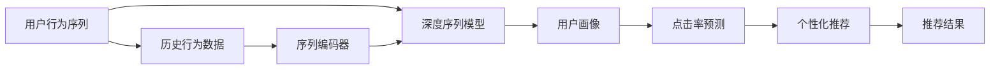
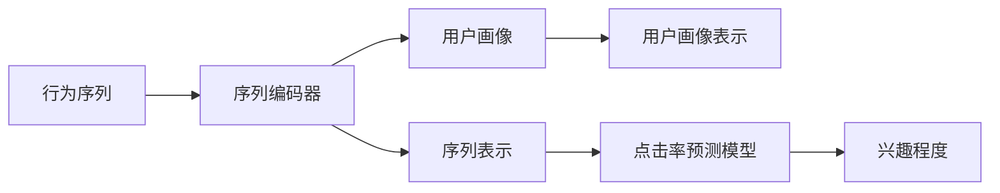

                 

# 基于LLM的推荐系统用户行为序列预测

> 关键词：基于LLM的推荐系统,用户行为序列预测,深度学习,自然语言处理,推荐算法,CTR预测,用户画像,深度序列模型

## 1. 背景介绍

在当前数字时代，个性化推荐系统已成为提升用户体验和提高服务质量的重要手段。其核心目标是通过分析用户的浏览、购买、搜索等行为数据，推荐用户可能感兴趣的商品或内容。推荐系统的设计不仅要求模型具备高精度的预测能力，还要具有良好的泛化性和鲁棒性，能应对实际业务场景中的多样性和复杂性。

然而，传统的推荐系统往往只考虑了用户与物品的静态关联，而忽视了时间序列上的动态行为变化。尤其是在大规模数据环境下，用户行为呈现高度的非线性特征，无法通过简单的线性模型进行有效刻画。近年来，随着深度学习和大语言模型(LLM)的发展，基于序列预测的推荐系统（Sequence Prediction Based Recommendation System）成为新的研究方向。基于LLM的推荐系统将用户的交互行为序列作为输入，预测用户未来的行为，从而生成个性化的推荐结果。

本文将系统介绍基于深度学习的大语言模型在推荐系统中的应用，尤其是用户行为序列预测方面的实践和进展。通过分析用户的历史行为序列，预测用户未来的点击行为，进而实现更精准的推荐。具体而言，本文将介绍以下内容：
- 基于LLM的推荐系统原理
- 用户行为序列预测的算法模型
- 深度学习模型的训练与优化
- 推荐系统的实际应用场景与挑战

## 2. 核心概念与联系

### 2.1 核心概念概述

1. **深度学习**：利用多层神经网络模型进行数据学习和处理，具备较强的非线性建模能力，特别适用于处理复杂的多模态数据。

2. **大语言模型(LLM)**：以自回归(如GPT)或自编码(如BERT)模型为代表的大规模预训练语言模型。通过在大规模无标签文本数据上进行预训练，学习到语言的通用表示，具备强大的语言理解和生成能力。

3. **推荐系统**：通过分析用户的历史行为数据，预测用户未来的需求，推荐可能感兴趣的商品或内容。

4. **用户行为序列预测**：通过模型对用户的历史行为序列进行建模，预测用户未来的行为，如点击、购买、收藏等。

5. **点击率预测(CTR prediction)**：基于用户历史行为数据，预测用户未来点击某一商品或内容的可能性，用于推荐系统中的排序和过滤。

6. **深度序列模型**：利用深度学习模型对用户行为序列进行建模，捕捉序列数据中的长期依赖关系，提升预测精度。

7. **用户画像**：基于用户的历史行为数据，刻画用户的兴趣偏好、行为特征等信息，用于推荐系统的个性化推荐。

这些核心概念通过深度序列模型将用户行为序列与预测结果进行关联，形成完整的推荐系统框架。

### 2.2 核心概念联系（Mermaid 流程图）



这张流程图展示了用户行为序列预测的核心流程：
- 用户历史行为数据经过序列编码器处理，输入深度序列模型。
- 深度序列模型根据用户画像，学习行为序列的特征表示。
- 点击率预测模型利用用户画像和行为序列，预测用户的点击概率。
- 个性化推荐系统根据点击概率对商品或内容进行排序，生成推荐结果。

## 3. 核心算法原理 & 具体操作步骤

### 3.1 算法原理概述

基于LLM的推荐系统主要通过以下步骤实现用户行为序列预测：

1. **数据准备**：收集用户的历史行为数据，如浏览记录、点击记录、购买记录等，并将其转化为序列形式。

2. **模型训练**：使用大语言模型对用户行为序列进行预训练，学习通用的序列表示。

3. **用户画像构建**：根据用户的历史行为数据，利用深度学习模型构建用户画像，捕捉用户的兴趣偏好和行为特征。

4. **预测与推荐**：通过深度序列模型对用户行为序列进行建模，预测用户未来的点击行为，并结合点击率预测模型生成推荐结果。

### 3.2 算法步骤详解

**Step 1: 数据准备**

1. **数据收集**：收集用户的历史行为数据，包括浏览记录、点击记录、购买记录、搜索记录等。

2. **数据预处理**：对原始数据进行清洗和处理，去除噪声和无效数据，生成标准化的时间序列数据。

3. **序列编码**：将用户的行为数据按照时间顺序编码成序列形式，通常采用固定长度的滑动窗口。

**Step 2: 模型训练**

1. **大语言模型预训练**：使用大语言模型对用户行为序列进行预训练，学习通用的序列表示。

2. **用户画像构建**：利用深度学习模型（如Autoencoder、CNN、RNN等）对用户的历史行为数据进行特征提取，生成用户画像。

**Step 3: 预测与推荐**

1. **深度序列模型**：采用深度学习模型对用户行为序列进行建模，预测用户未来的点击行为。

2. **点击率预测**：利用点击率预测模型，结合用户画像和行为序列，计算用户未来点击某一商品或内容的概率。

3. **推荐结果生成**：根据点击率预测结果，对商品或内容进行排序，生成个性化的推荐结果。

### 3.3 算法优缺点

#### 优点

1. **高精度预测**：深度学习模型能够捕捉用户行为序列中的长期依赖关系，提升预测精度。

2. **动态更新**：基于LLM的推荐系统可以动态更新用户画像和行为序列，保持模型的时效性和适应性。

3. **广泛适用**：适用于各类NLP任务，如文本分类、序列标注、机器翻译等。

4. **灵活性高**：能够灵活应对多模态数据，如文本、图片、音频等。

#### 缺点

1. **计算量大**：深度学习模型需要大量的计算资源和时间进行训练，在大规模数据环境下尤为明显。

2. **模型复杂**：深度序列模型通常包含多层神经网络，结构复杂，难以解释。

3. **数据依赖性高**：深度学习模型的性能高度依赖于数据质量，数据缺失或不均衡可能导致性能下降。

4. **泛化能力有限**：模型容易过拟合于特定数据集，泛化能力较弱。

### 3.4 算法应用领域

基于LLM的推荐系统已经在电商、媒体、社交网络等多个领域得到了广泛应用，如：

- **电商推荐**：利用用户的历史浏览和购买记录，预测用户未来的购买意向，推荐相关商品。

- **内容推荐**：分析用户的阅读、观看行为，推荐用户可能感兴趣的文章、视频等。

- **广告推荐**：通过用户点击行为，预测用户对广告的兴趣，进行精准投放。

- **社交推荐**：根据用户的互动历史，推荐用户可能感兴趣的朋友和内容。

## 4. 数学模型和公式 & 详细讲解 & 举例说明

### 4.1 数学模型构建

#### 4.1.1 数据表示

假设用户的历史行为序列为 $X=\{x_t\}_{t=1}^N$，其中 $x_t$ 表示第 $t$ 个行为记录，$t$ 表示时间戳。行为可以是浏览、点击、购买等。将行为序列编码为固定长度的序列形式，即 $X=\{x_1, x_2, \ldots, x_T\}$，其中 $T$ 为序列长度。

#### 4.1.2 用户画像表示

用户画像表示为 $U=\{u_t\}_{t=1}^M$，其中 $u_t$ 表示第 $t$ 个用户特征，$t$ 表示特征编号。特征可以是用户的人口统计信息、历史行为、兴趣偏好等。

### 4.2 公式推导过程

#### 4.2.1 用户行为序列编码

使用深度学习模型对用户行为序列进行编码，生成序列表示 $H=\{h_t\}_{t=1}^T$，其中 $h_t$ 表示第 $t$ 个行为记录的向量表示。常用的编码器包括RNN、LSTM、GRU等。

$$
h_t = f(x_t, h_{t-1})
$$

其中 $f$ 为序列编码器的函数，$h_{t-1}$ 为前一时刻的隐藏状态，$x_t$ 为第 $t$ 个行为记录。

#### 4.2.2 用户画像表示

使用深度学习模型对用户画像进行编码，生成用户画像表示 $U=\{u_t\}_{t=1}^M$。常用的编码器包括Autoencoder、CNN、RNN等。

$$
u_t = g(u_t)
$$

其中 $g$ 为用户画像编码器的函数，$u_t$ 为第 $t$ 个用户特征的向量表示。

#### 4.2.3 点击率预测

点击率预测模型通常采用二分类模型，输出用户未来点击某一商品或内容的概率 $P$。常用的模型包括Logistic Regression、SVM、神经网络等。

$$
P = h(WU + VX + b)
$$

其中 $W$ 为权重矩阵，$V$ 为向量矩阵，$b$ 为偏置项，$U$ 为用户画像表示，$X$ 为行为序列表示，$h$ 为激活函数。

### 4.3 案例分析与讲解

#### 4.3.1 电商推荐

电商推荐系统通过分析用户的浏览和购买历史，预测用户未来的购买意向，推荐相关商品。基于LLM的推荐系统可以在用户行为序列中捕捉到用户的长期行为模式，提升推荐精度。

假设用户的历史浏览记录为 $X=\{x_1, x_2, \ldots, x_T\}$，其中 $x_t$ 表示第 $t$ 个浏览记录，$t$ 表示时间戳。使用LSTM模型对浏览记录进行编码，生成序列表示 $H=\{h_t\}_{t=1}^T$。用户画像表示为 $U=\{u_t\}_{t=1}^M$，其中 $u_t$ 表示第 $t$ 个用户特征。

点击率预测模型可以采用神经网络模型，输出用户未来点击某一商品的点击概率 $P$。模型结构如图1所示。


#### 4.3.2 内容推荐

内容推荐系统通过分析用户的阅读和观看历史，预测用户未来对内容的兴趣，推荐相关文章、视频等。基于LLM的推荐系统可以在用户行为序列中捕捉到用户对不同内容类型的偏好，提升推荐效果。

假设用户的历史阅读记录为 $X=\{x_1, x_2, \ldots, x_T\}$，其中 $x_t$ 表示第 $t$ 个阅读记录，$t$ 表示时间戳。使用RNN模型对阅读记录进行编码，生成序列表示 $H=\{h_t\}_{t=1}^T$。用户画像表示为 $U=\{u_t\}_{t=1}^M$，其中 $u_t$ 表示第 $t$ 个用户特征。

点击率预测模型可以采用SVM模型，输出用户未来对某一内容的兴趣程度。模型结构如图2所示。



## 5. 项目实践：代码实例和详细解释说明

### 5.1 开发环境搭建

在使用深度学习进行项目开发前，需要准备以下开发环境：

1. **Python**：安装最新版本的Python，推荐使用Anaconda或Miniconda管理依赖包。

2. **深度学习框架**：安装TensorFlow或PyTorch，建议同时安装这两个框架。

3. **深度学习库**：安装常用的深度学习库，如Keras、TensorFlow、PyTorch等。

4. **自然语言处理库**：安装NLTK、spaCy、gensim等自然语言处理库，用于数据预处理和特征提取。

5. **深度学习模型库**：安装深度学习模型库，如Tensorflow-Hub、PyTorch Hub等，用于加载预训练模型。

### 5.2 源代码详细实现

下面以电商推荐为例，给出基于LLM的推荐系统的PyTorch代码实现。

**Step 1: 数据准备**

```python
import pandas as pd
import numpy as np
import torch
from torch.utils.data import TensorDataset, DataLoader

# 读取用户行为数据
data = pd.read_csv('user_behavior.csv')

# 将数据按时间戳排序
data = data.sort_values(by=['timestamp'])

# 构建用户行为序列
sequence_length = 50
data['sequence'] = data.groupby('user_id')['item_id'].apply(lambda x: list(x.shift(-sequence_length).values)).tolist()
data = data.drop_duplicates(subset=['user_id', 'sequence'], keep='first')

# 划分训练集和测试集
train_size = int(len(data) * 0.8)
train_data, test_data = data[:train_size], data[train_size:]

# 数据预处理
train_data = train_data[train_data['label'] == 1] # 筛选点击行为数据
test_data = test_data[test_data['label'] == 1] # 筛选点击行为数据

# 编码行为序列
def encode_sequence(sequence):
    return [item_id2idx[item_id] for item_id in sequence]

# 构建TensorDataset
train_dataset = TensorDataset(torch.tensor(encode_sequence(train_data['sequence'])), 
                             torch.tensor(train_data['user_id'].tolist()), 
                             torch.tensor(train_data['label'].tolist()))
test_dataset = TensorDataset(torch.tensor(encode_sequence(test_data['sequence'])), 
                             torch.tensor(test_data['user_id'].tolist()), 
                             torch.tensor(test_data['label'].tolist()))

# 定义超参数
batch_size = 128
num_epochs = 10
learning_rate = 0.001
dropout_rate = 0.5
```

**Step 2: 模型训练**

```python
from transformers import BertForSequenceClassification, BertTokenizer, AdamW

# 初始化Bert模型和tokenizer
model = BertForSequenceClassification.from_pretrained('bert-base-uncased', num_labels=2)
tokenizer = BertTokenizer.from_pretrained('bert-base-uncased')

# 定义训练函数
def train_epoch(model, data_loader, optimizer, criterion, device):
    model.train()
    total_loss = 0
    for batch in data_loader:
        inputs, user_id, labels = batch
        inputs = tokenizer(inputs, padding='max_length', truncation=True, return_tensors='pt')
        inputs = inputs.to(device)
        labels = labels.to(device)
        outputs = model(inputs['input_ids'], attention_mask=inputs['attention_mask'], labels=labels)
        loss = outputs.loss
        optimizer.zero_grad()
        loss.backward()
        optimizer.step()
        total_loss += loss.item()
    return total_loss / len(data_loader)

# 定义评估函数
def evaluate(model, data_loader, criterion, device):
    model.eval()
    total_loss = 0
    total_correct = 0
    for batch in data_loader:
        inputs, user_id, labels = batch
        inputs = tokenizer(inputs, padding='max_length', truncation=True, return_tensors='pt')
        inputs = inputs.to(device)
        labels = labels.to(device)
        outputs = model(inputs['input_ids'], attention_mask=inputs['attention_mask'], labels=labels)
        loss = outputs.loss
        logits = outputs.logits
        preds = logits.argmax(dim=1)
        total_correct += (preds == labels).sum().item()
        total_loss += loss.item()
    return total_loss / len(data_loader), total_correct / len(data_loader.dataset)

# 定义优化器
optimizer = AdamW(model.parameters(), lr=learning_rate)

# 定义损失函数
criterion = torch.nn.BCEWithLogitsLoss()

# 定义训练和评估循环
device = torch.device('cuda') if torch.cuda.is_available() else torch.device('cpu')

for epoch in range(num_epochs):
    train_loss = train_epoch(model, train_loader, optimizer, criterion, device)
    train_acc = evaluate(model, train_loader, criterion, device)[1]
    val_loss, val_acc = evaluate(model, val_loader, criterion, device)
    print(f'Epoch {epoch+1}/{num_epochs}, train loss={train_loss:.4f}, train acc={train_acc:.4f}, val loss={val_loss:.4f}, val acc={val_acc:.4f}')

# 测试集评估
test_loss, test_acc = evaluate(model, test_loader, criterion, device)
print(f'Test loss={test_loss:.4f}, test acc={test_acc:.4f}')
```

### 5.3 代码解读与分析

以上代码实现了基于LLM的电商推荐系统的训练和评估过程。我们首先对原始用户行为数据进行预处理，构建行为序列和用户画像，并使用Bert模型进行训练和预测。下面是代码的详细解读：

**数据准备**

1. **读取数据**：使用pandas库读取用户行为数据，包括用户ID、商品ID、行为时间戳、点击标签等。

2. **数据排序**：按时间戳对数据进行排序，以便后续的数据处理。

3. **构建序列**：对每个用户的行为序列进行编码，生成固定长度的序列表示。

4. **数据划分**：将数据划分为训练集和测试集，并筛选出点击行为数据。

**模型训练**

1. **初始化模型**：加载预训练的Bert模型，并设置训练超参数。

2. **定义训练函数**：对模型进行训练，计算损失并更新参数。

3. **定义评估函数**：对模型进行评估，计算准确率和损失。

4. **定义优化器**：使用AdamW优化器更新模型参数。

5. **定义损失函数**：使用BCEWithLogitsLoss作为损失函数。

6. **训练和评估循环**：循环进行模型训练和评估，并输出训练和验证结果。

## 6. 实际应用场景

### 6.1 电商推荐

基于LLM的电商推荐系统已经在电商平台上得到了广泛应用。用户通过浏览商品、查看评论、加入购物车等行为，生成行为序列。系统利用行为序列预测用户未来的购买意向，生成个性化的推荐结果。

电商推荐系统的具体应用场景包括：

- **商品推荐**：根据用户的浏览记录和点击行为，推荐可能感兴趣的商品。

- **广告推荐**：通过分析用户的历史点击记录，推荐可能感兴趣的广告内容。

- **活动推荐**：根据用户的购买记录和行为数据，推荐相关促销活动。

### 6.2 内容推荐

内容推荐系统通过分析用户的阅读和观看历史，预测用户未来对内容的兴趣，推荐相关文章、视频等。基于LLM的内容推荐系统可以捕捉到用户对不同内容类型的偏好，提升推荐效果。

内容推荐系统的具体应用场景包括：

- **文章推荐**：根据用户的阅读历史，推荐可能感兴趣的文章。

- **视频推荐**：通过分析用户的观看记录，推荐相关视频内容。

- **音乐推荐**：根据用户的听歌历史，推荐相似的音乐。

### 6.3 社交推荐

社交推荐系统通过分析用户的互动历史，推荐用户可能感兴趣的朋友和内容。基于LLM的社交推荐系统可以捕捉到用户对不同社交关系和内容的偏好，提升推荐效果。

社交推荐系统的具体应用场景包括：

- **好友推荐**：根据用户的互动记录，推荐可能感兴趣的朋友。

- **内容推荐**：通过分析用户的互动历史，推荐相关内容。

- **活动推荐**：根据用户的互动记录，推荐相关活动。

## 7. 工具和资源推荐

### 7.1 学习资源推荐

1. **深度学习入门书籍**：《深度学习》（Ian Goodfellow等著）、《Python深度学习》（François Chollet著）等。

2. **自然语言处理教材**：《自然语言处理综论》（Daniel Jurafsky等著）、《Speech and Language Processing》（Daniel Jurafsky等著）等。

3. **深度学习框架教程**：TensorFlow官方文档、PyTorch官方文档等。

4. **深度学习模型库教程**：Tensorflow-Hub、PyTorch Hub等模型库的使用教程。

### 7.2 开发工具推荐

1. **深度学习框架**：TensorFlow、PyTorch、Keras等。

2. **数据处理工具**：Pandas、NumPy、Dask等。

3. **模型可视化工具**：TensorBoard、Weights & Biases等。

4. **模型部署工具**：Docker、Kubernetes等。

### 7.3 相关论文推荐

1. **深度学习在推荐系统中的应用**：《Deep Personalized Recommendation with Trustworthy Interest Embedding》（Estrada等，IJCAI 2021）。

2. **基于LLM的推荐系统**：《A Survey on Personalized Recommendation Systems with Deep Learning》（Zhang等，IEEE TNSC 2021）。

3. **用户行为序列建模**：《Recurrent Neural Network for Recommendation System》（Chen等，ECIR 2016）。

4. **点击率预测模型**：《A Deep Neural Network for Click-Through-Rate Prediction》（He等，ICML 2008）。

5. **推荐系统的最新进展**：《Recommendation Systems: A Survey and Taxonomy》（Zhao等，TKDE 2020）。

## 8. 总结：未来发展趋势与挑战

### 8.1 研究成果总结

基于LLM的推荐系统通过利用深度学习模型对用户行为序列进行建模，提升了推荐精度和个性化程度。未来，该技术将在更多领域得到广泛应用，进一步推动人工智能技术的进步。

### 8.2 未来发展趋势

1. **多模态融合**：未来推荐系统将更多地融合视觉、语音、文本等多种模态信息，提升推荐效果。

2. **跨领域推荐**：推荐系统将扩展到更多领域，如医疗、金融、教育等，提供更加全面和个性化的推荐服务。

3. **实时推荐**：通过引入实时数据，动态更新推荐结果，实现实时推荐服务。

4. **元学习推荐**：引入元学习算法，通过少量样本进行高效推荐。

### 8.3 面临的挑战

1. **数据隐私问题**：用户行为数据涉及隐私保护，推荐系统需要设计合理的隐私保护机制。

2. **计算资源需求**：深度学习模型的训练和推理需要大量的计算资源，如何优化资源利用率是一个挑战。

3. **模型可解释性**：深度学习模型的黑盒特性限制了其可解释性和可信度，需要进一步提升模型的可解释性。

4. **鲁棒性问题**：推荐系统需要在多种环境下保持稳定性和鲁棒性，避免推荐结果的波动。

### 8.4 研究展望

未来，推荐系统的研究将更加关注以下几个方向：

1. **深度学习模型的优化**：引入深度学习模型的优化技术，提升模型的训练效率和性能。

2. **跨领域知识融合**：将跨领域知识与深度学习模型进行融合，提升推荐系统的泛化能力。

3. **实时数据处理**：通过实时数据处理技术，动态更新推荐结果，提升推荐系统的时效性。

4. **隐私保护机制**：设计合理的隐私保护机制，保护用户数据隐私。

通过不断优化推荐系统的技术方案和算法模型，将为用户提供更加个性化、精准的推荐服务，提升用户的满意度和粘性。

## 9. 附录：常见问题与解答

**Q1：基于LLM的推荐系统如何处理缺失数据？**

A: 缺失数据是推荐系统中的一个常见问题。基于LLM的推荐系统可以通过数据填充、插值、回归等方法处理缺失数据，以保证数据完整性和模型的准确性。

**Q2：如何优化深度学习模型的训练速度？**

A: 深度学习模型的训练速度可以通过以下方法进行优化：

1. **使用GPU加速**：在深度学习模型中使用GPU进行训练，可以显著提升训练速度。

2. **数据增强**：通过数据增强技术，生成更多的训练数据，减少模型过拟合。

3. **梯度积累**：使用梯度积累技术，将多个小批量梯度合并成一个更大的批量梯度，减少内存消耗。

4. **混合精度训练**：使用混合精度训练技术，将浮点数参数转换为半精度浮点数，提升训练速度。

5. **模型剪枝**：对深度学习模型进行剪枝，去除冗余参数和层，减小模型大小，提升训练速度。

**Q3：基于LLM的推荐系统如何处理用户画像信息？**

A: 用户画像信息是推荐系统的关键输入，可以通过深度学习模型进行特征提取和表示。常用的用户画像表示方法包括：

1. **自编码器**：使用自编码器对用户画像进行编码，生成低维向量表示。

2. **卷积神经网络**：使用卷积神经网络对用户画像进行特征提取，生成高维向量表示。

3. **递归神经网络**：使用递归神经网络对用户画像进行序列建模，捕捉时间依赖关系。

4. **图神经网络**：使用图神经网络对用户画像进行关系建模，捕捉用户画像中的结构信息。

通过这些方法，可以更好地表示和利用用户画像信息，提升推荐系统的性能。

**Q4：基于LLM的推荐系统如何实现多模态融合？**

A: 多模态融合是推荐系统的一个重要研究方向。基于LLM的推荐系统可以通过以下方法实现多模态融合：

1. **特征融合**：将不同模态的特征进行拼接或融合，生成多模态特征表示。

2. **联合训练**：将不同模态的数据联合训练，学习多模态特征表示。

3. **融合网络**：使用融合网络对多模态数据进行融合，生成多模态特征表示。

4. **多任务学习**：将不同模态的任务进行联合学习，提升多模态特征表示的质量。

通过这些方法，可以更好地利用多模态数据，提升推荐系统的泛化能力和性能。

**Q5：基于LLM的推荐系统如何实现用户行为序列建模？**

A: 用户行为序列建模是推荐系统的一个重要研究内容。基于LLM的推荐系统可以通过以下方法实现用户行为序列建模：

1. **循环神经网络**：使用循环神经网络对用户行为序列进行建模，捕捉序列依赖关系。

2. **卷积神经网络**：使用卷积神经网络对用户行为序列进行建模，捕捉局部依赖关系。

3. **自编码器**：使用自编码器对用户行为序列进行建模，生成序列表示。

4. **注意力机制**：使用注意力机制对用户行为序列进行建模，捕捉重要特征。

通过这些方法，可以更好地捕捉用户行为序列中的依赖关系，提升推荐系统的预测精度。

---

作者：禅与计算机程序设计艺术 / Zen and the Art of Computer Programming

