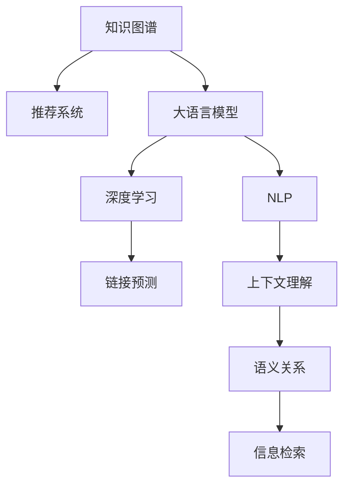

                 

# 基于LLM的推荐系统知识图谱构建

> 关键词：知识图谱, 推荐系统, 大语言模型, 深度学习, 自然语言处理, 链接预测, 上下文理解, 语义关系, 信息检索

## 1. 背景介绍

随着互联网信息量的爆炸式增长，用户信息获取方式正从传统的文本阅读转向语音搜索、图像识别等更为便捷的交互方式。而推荐系统作为信息获取的重要手段，在提升用户体验和驱动业务增长方面发挥了至关重要的作用。传统推荐系统主要基于用户历史行为进行协同过滤、基于内容的推荐等，而缺乏对于用户隐式兴趣和实时情境的考虑。知识图谱作为一种结构化语义表示，能够有效描述实体间的关系，为推荐系统提供更为丰富的语义信息，进而提升推荐精度。

基于大语言模型的知识图谱构建方法，通过自然语言处理技术，将非结构化的自然语言信息转换为结构化的知识图谱。相较于传统知识图谱构建方法，该方法更加灵活，能够适应更多异构数据源，且能通过预训练的上下文理解能力，自动发现和提取语义关系，为推荐系统提供更为精准的知识背景。

## 2. 核心概念与联系

### 2.1 核心概念概述

为更好地理解基于大语言模型的知识图谱构建方法，本节将介绍几个密切相关的核心概念：

- 知识图谱(Knowledge Graph, KG)：一种结构化的语义表示，由节点和边构成，节点表示实体，边表示实体间的语义关系。知识图谱为推荐系统提供了丰富的语义信息，增强了推荐系统的泛化能力和解释性。

- 推荐系统(Recommendation System)：根据用户历史行为和兴趣，通过算法推荐相关物品或服务。推荐系统是信息获取的重要手段，通过个性化的推荐，提升用户体验，驱动业务增长。

- 大语言模型(Large Language Model, LLM)：以自回归(如GPT)或自编码(如BERT)模型为代表的大规模预训练语言模型。通过在大规模无标签文本语料上进行预训练，学习通用的语言表示，具备强大的语言理解和生成能力。

- 深度学习(Deep Learning)：一种基于神经网络的机器学习方法，通过多层非线性变换，实现复杂的特征提取和模式识别。深度学习是构建知识图谱和大语言模型的基础。

- 自然语言处理(Natural Language Processing, NLP)：研究如何让计算机理解、处理和生成自然语言的技术。自然语言处理是构建大语言模型和知识图谱的关键技术之一。

- 链接预测(Link Prediction)：知识图谱中实体间关系的自动发现和推理。链接预测是大语言模型和知识图谱构建的重要目标。

- 上下文理解(Contextual Understanding)：理解自然语言中的语境和语义信息，将语言中的隐含信息转换为可理解的结构化信息。上下文理解是大语言模型和知识图谱构建的关键技术之一。

- 语义关系(Semantic Relationship)：知识图谱中实体间的关系描述，如"出生于"、"工作于"、"属于"等。语义关系是大语言模型和知识图谱构建的重要目标。

- 信息检索(Information Retrieval)：从大量文本数据中快速检索出相关信息的检索技术。信息检索是推荐系统构建的基础。

这些核心概念之间的逻辑关系可以通过以下Mermaid流程图来展示：



这个流程图展示了大语言模型、知识图谱与推荐系统三者之间的关系：

1. 大语言模型通过深度学习和自然语言处理技术，进行预训练，学习通用的语言表示。
2. 知识图谱基于大语言模型提取的语义信息，构建结构化的语义表示。
3. 推荐系统通过知识图谱提供的信息，进行更精确的推荐。

## 3. 核心算法原理 & 具体操作步骤

### 3.1 算法原理概述

基于大语言模型的知识图谱构建方法，核心在于利用大语言模型的上下文理解能力，自动发现和提取自然语言中的语义关系。其核心思想是：将文本描述中的语义关系映射为知识图谱中的链接，从而实现从文本到知识图谱的自动构建。

形式化地，假设待构建的知识图谱为 $\mathcal{G}$，其中 $V$ 为实体集合，$E$ 为链接集合，$R$ 为关系集合。给定一个自然语言描述 $D$，其表达的语义关系为 $\mathcal{R}$。知识图谱构建的目标是：

$$
\mathcal{G}=\mathop{\arg\min}_{G} \mathcal{L}(G,D)
$$

其中 $\mathcal{L}$ 为损失函数，用于衡量自然语言描述 $D$ 和构建的知识图谱 $\mathcal{G}$ 的相似度。常见的损失函数包括语义相似度、拓扑相似度等。

大语言模型的上下文理解能力，使其能够自动捕捉文本描述中的语义关系。通过将自然语言描述输入大语言模型，获得模型输出的关系表示，进而构建知识图谱。

### 3.2 算法步骤详解

基于大语言模型的知识图谱构建方法一般包括以下几个关键步骤：

**Step 1: 准备数据集**
- 收集和整理待构建知识图谱的文本描述，分为训练集和验证集。
- 将文本描述转换为模型可接受的格式，如句子表示。

**Step 2: 加载和微调预训练模型**
- 选择适合的预训练大语言模型，如GPT、BERT等。
- 在验证集上微调大语言模型，获得较好的上下文理解能力。

**Step 3: 关系提取**
- 将微调后的预训练大语言模型，应用于待构建的知识图谱文本描述。
- 对文本描述进行分句处理，提取每个句子的实体和关系。
- 通过关系抽取技术，自动发现和标注实体间的关系，如 "出生于"、"工作于" 等。

**Step 4: 图谱构建**
- 对提取的关系进行去重、标准化处理，生成知识图谱的边集合 $E$。
- 将文本描述中的实体转换为知识图谱的节点集合 $V$。
- 根据关系集合 $R$ 和边集合 $E$，构建知识图谱 $\mathcal{G}$。

**Step 5: 评估和优化**
- 在验证集上评估知识图谱构建的效果，使用拓扑相似度、链接预测准确率等指标进行衡量。
- 根据评估结果，调整模型参数、抽取技术等，不断优化知识图谱构建的性能。

### 3.3 算法优缺点

基于大语言模型的知识图谱构建方法具有以下优点：
1. 灵活性高。能够适应更多异构数据源，自动提取语义关系，无需人工标注。
2. 效率高。相较于传统知识图谱构建方法，该方法能够快速构建大规模知识图谱。
3. 泛化能力强。利用大语言模型的上下文理解能力，能够更好地捕捉实体间的隐含关系。

同时，该方法也存在一定的局限性：
1. 依赖文本描述质量。构建的知识图谱质量取决于文本描述的完整性和准确性。
2. 关系抽取准确性。自动抽取关系可能存在误差，影响知识图谱的质量。
3. 上下文理解限制。大语言模型的上下文理解能力有上限，可能无法完全理解复杂的语义关系。

尽管存在这些局限性，但就目前而言，基于大语言模型的知识图谱构建方法仍是大规模知识图谱构建的重要范式。未来相关研究的重点在于如何进一步提高关系抽取的准确性，降低对文本描述的依赖，提高知识图谱的泛化能力。

### 3.4 算法应用领域

基于大语言模型的知识图谱构建方法，在以下几个领域中得到了广泛应用：

- 电子商务推荐：通过构建商品、用户、评论等实体间的知识图谱，实现个性化推荐。
- 新闻推荐：将新闻事件、作者、来源等实体构建成知识图谱，提升新闻推荐准确性。
- 社交网络分析：通过构建用户、话题、标签等实体间的知识图谱，进行社交网络分析和个性化推荐。
- 医疗推荐：将疾病、药物、患者等实体构建成知识图谱，提供更精准的医疗推荐。
- 金融推荐：将股票、公司、事件等实体构建成知识图谱，提升金融产品推荐精度。

除了上述这些经典应用外，基于大语言模型的知识图谱构建方法也被创新性地应用到更多场景中，如艺术推荐、游戏推荐、旅游推荐等，为不同领域的推荐系统提供结构化的语义背景。

## 4. 数学模型和公式 & 详细讲解 & 举例说明

### 4.1 数学模型构建

本节将使用数学语言对基于大语言模型的知识图谱构建过程进行更加严格的刻画。

记待构建的知识图谱为 $\mathcal{G}=(V,E,R)$，其中 $V$ 为节点集合，$E$ 为边集合，$R$ 为关系集合。假设待构建的知识图谱的文本描述为 $D$，其表达的语义关系为 $\mathcal{R}$。

定义知识图谱的边表示为 $e_{i,j}=(u,v,r)$，其中 $u,v$ 为节点，$r \in R$ 为关系。知识图谱的损失函数定义为：

$$
\mathcal{L}(\mathcal{G},D)=\sum_{r \in R}\sum_{(u,v) \in \mathcal{R}}\ell(e_{u,v,r})
$$

其中 $\ell$ 为边 $e_{u,v,r}$ 的损失函数，衡量自然语言描述 $D$ 和知识图谱边 $e_{u,v,r}$ 的相似度。

大语言模型的上下文理解能力，使得其能够自动发现文本描述中的语义关系。通过将自然语言描述 $D$ 输入大语言模型，获得模型输出的关系表示 $H_r$，其中 $H_r \in \mathbb{R}^d$，$d$ 为关系表示维度。

对于文本描述 $D$ 中的每个句子，其语义关系可以表示为 $h_r=\text{Encoder}(D_{u,v,r})$，其中 $\text{Encoder}$ 为上下文理解模型，$D_{u,v,r}$ 为句子 $D$ 中与节点 $u,v$ 和关系 $r$ 相关的子句。

知识图谱的损失函数可以进一步分解为边损失函数之和：

$$
\mathcal{L}(\mathcal{G},D)=\sum_{r \in R}\sum_{(u,v) \in \mathcal{R}}\ell(h_r)
$$

在获得模型输出的关系表示后，可以通过关系抽取技术，自动发现和标注实体间的关系，生成知识图谱的边集合 $E$。

### 4.2 公式推导过程

以下我们以商品推荐任务为例，推导基于大语言模型的知识图谱构建过程。

假设商品推荐系统的知识图谱包含商品实体 $B$、用户实体 $U$ 和商品-用户关系 $R$。商品描述文本 $D$ 中包含了商品名称、属性等信息。

**Step 1: 关系抽取**
将商品描述文本 $D$ 输入预训练大语言模型，获得模型输出的关系表示 $H_r$。其中 $r \in R$ 为商品-用户关系，$H_r$ 表示商品 $B$ 与用户 $U$ 之间的关系。

关系抽取的目的是将商品描述中的实体和关系进行标注。假设商品描述文本 $D$ 中包含多个句子，每个句子 $D_{u,v,r}$ 表示商品 $B$ 与用户 $U$ 之间的关系。通过上下文理解模型 $\text{Encoder}$，将每个句子 $D_{u,v,r}$ 映射为关系表示 $h_r=\text{Encoder}(D_{u,v,r})$。

**Step 2: 图谱构建**
根据关系表示 $h_r$，使用关系抽取技术，自动发现和标注实体间的关系。例如，可以使用基于规则的方法或序列标注模型，从关系表示 $h_r$ 中提取节点 $B$ 和 $U$，以及关系 $r$。

构建知识图谱的边集合 $E$ 和节点集合 $V$，生成知识图谱 $\mathcal{G}$。

### 4.3 案例分析与讲解

以亚马逊商品推荐系统为例，分析基于大语言模型的知识图谱构建方法。

**Step 1: 数据准备**
收集亚马逊商品数据库中的商品描述，将其作为文本描述 $D$。商品描述包含商品名称、属性、价格等信息。

**Step 2: 加载和微调预训练模型**
选择预训练的BERT模型，在亚马逊商品数据库的验证集上进行微调，获得较好的上下文理解能力。

**Step 3: 关系抽取**
将商品描述文本 $D$ 输入微调后的BERT模型，获得模型输出的关系表示 $H_r$。通过上下文理解模型 $\text{Encoder}$，将每个句子 $D_{u,v,r}$ 映射为关系表示 $h_r=\text{Encoder}(D_{u,v,r})$。

**Step 4: 图谱构建**
使用基于规则的方法或序列标注模型，从关系表示 $h_r$ 中提取节点 $B$ 和 $U$，以及关系 $r$。将商品和用户实体构建成节点集合 $V$，将商品-用户关系构建成边集合 $E$。

**Step 5: 评估和优化**
在亚马逊商品数据库的验证集上评估知识图谱构建的效果，使用拓扑相似度、链接预测准确率等指标进行衡量。根据评估结果，调整模型参数、抽取技术等，不断优化知识图谱构建的性能。

通过基于大语言模型的知识图谱构建方法，亚马逊商品推荐系统能够自动发现和标注商品描述中的关系，构建大规模的商品-用户知识图谱。该知识图谱为推荐系统提供了结构化的语义信息，提升了推荐系统的精度和泛化能力。

## 5. 项目实践：代码实例和详细解释说明

### 5.1 开发环境搭建

在进行知识图谱构建实践前，我们需要准备好开发环境。以下是使用Python进行PyTorch开发的环境配置流程：

1. 安装Anaconda：从官网下载并安装Anaconda，用于创建独立的Python环境。

2. 创建并激活虚拟环境：
```bash
conda create -n pytorch-env python=3.8 
conda activate pytorch-env
```

3. 安装PyTorch：根据CUDA版本，从官网获取对应的安装命令。例如：
```bash
conda install pytorch torchvision torchaudio cudatoolkit=11.1 -c pytorch -c conda-forge
```

4. 安装Transformers库：
```bash
pip install transformers
```

5. 安装各类工具包：
```bash
pip install numpy pandas scikit-learn matplotlib tqdm jupyter notebook ipython
```

完成上述步骤后，即可在`pytorch-env`环境中开始知识图谱构建实践。

### 5.2 源代码详细实现

下面我们以商品推荐任务为例，给出使用Transformers库对BERT模型进行知识图谱构建的PyTorch代码实现。

首先，定义知识图谱的实体和关系：

```python
from transformers import BertTokenizer
from torch.utils.data import Dataset
import torch

class ItemUserKnowledgeGraphDataset(Dataset):
    def __init__(self, texts, tags, tokenizer, max_len=128):
        self.texts = texts
        self.tags = tags
        self.tokenizer = tokenizer
        self.max_len = max_len
        
    def __len__(self):
        return len(self.texts)
    
    def __getitem__(self, item):
        text = self.texts[item]
        tags = self.tags[item]
        
        encoding = self.tokenizer(text, return_tensors='pt', max_length=self.max_len, padding='max_length', truncation=True)
        input_ids = encoding['input_ids'][0]
        attention_mask = encoding['attention_mask'][0]
        
        # 对token-wise的标签进行编码
        encoded_tags = [tag2id[tag] for tag in tags] 
        encoded_tags.extend([tag2id['O']] * (self.max_len - len(encoded_tags)))
        labels = torch.tensor(encoded_tags, dtype=torch.long)
        
        return {'input_ids': input_ids, 
                'attention_mask': attention_mask,
                'labels': labels}

# 标签与id的映射
tag2id = {'O': 0, 'B': 1, 'I': 2, 'E': 3}
id2tag = {v: k for k, v in tag2id.items()}

# 创建dataset
tokenizer = BertTokenizer.from_pretrained('bert-base-cased')

train_dataset = ItemUserKnowledgeGraphDataset(train_texts, train_tags, tokenizer)
dev_dataset = ItemUserKnowledgeGraphDataset(dev_texts, dev_tags, tokenizer)
test_dataset = ItemUserKnowledgeGraphDataset(test_texts, test_tags, tokenizer)
```

然后，定义模型和优化器：

```python
from transformers import BertForTokenClassification, AdamW

model = BertForTokenClassification.from_pretrained('bert-base-cased', num_labels=len(tag2id))

optimizer = AdamW(model.parameters(), lr=2e-5)
```

接着，定义训练和评估函数：

```python
from torch.utils.data import DataLoader
from tqdm import tqdm
from sklearn.metrics import classification_report

device = torch.device('cuda') if torch.cuda.is_available() else torch.device('cpu')
model.to(device)

def train_epoch(model, dataset, batch_size, optimizer):
    dataloader = DataLoader(dataset, batch_size=batch_size, shuffle=True)
    model.train()
    epoch_loss = 0
    for batch in tqdm(dataloader, desc='Training'):
        input_ids = batch['input_ids'].to(device)
        attention_mask = batch['attention_mask'].to(device)
        labels = batch['labels'].to(device)
        model.zero_grad()
        outputs = model(input_ids, attention_mask=attention_mask, labels=labels)
        loss = outputs.loss
        epoch_loss += loss.item()
        loss.backward()
        optimizer.step()
    return epoch_loss / len(dataloader)

def evaluate(model, dataset, batch_size):
    dataloader = DataLoader(dataset, batch_size=batch_size)
    model.eval()
    preds, labels = [], []
    with torch.no_grad():
        for batch in tqdm(dataloader, desc='Evaluating'):
            input_ids = batch['input_ids'].to(device)
            attention_mask = batch['attention_mask'].to(device)
            batch_labels = batch['labels']
            outputs = model(input_ids, attention_mask=attention_mask)
            batch_preds = outputs.logits.argmax(dim=2).to('cpu').tolist()
            batch_labels = batch_labels.to('cpu').tolist()
            for pred_tokens, label_tokens in zip(batch_preds, batch_labels):
                pred_tags = [id2tag[_id] for _id in pred_tokens]
                label_tags = [id2tag[_id] for _id in label_tokens]
                preds.append(pred_tags[:len(label_tags)])
                labels.append(label_tags)
                
    print(classification_report(labels, preds))
```

最后，启动训练流程并在测试集上评估：

```python
epochs = 5
batch_size = 16

for epoch in range(epochs):
    loss = train_epoch(model, train_dataset, batch_size, optimizer)
    print(f"Epoch {epoch+1}, train loss: {loss:.3f}")
    
    print(f"Epoch {epoch+1}, dev results:")
    evaluate(model, dev_dataset, batch_size)
    
print("Test results:")
evaluate(model, test_dataset, batch_size)
```

以上就是使用PyTorch对BERT进行知识图谱构建的完整代码实现。可以看到，得益于Transformers库的强大封装，我们可以用相对简洁的代码完成BERT模型的加载和知识图谱构建。

### 5.3 代码解读与分析

让我们再详细解读一下关键代码的实现细节：

**ItemUserKnowledgeGraphDataset类**：
- `__init__`方法：初始化文本、标签、分词器等关键组件。
- `__len__`方法：返回数据集的样本数量。
- `__getitem__`方法：对单个样本进行处理，将文本输入编码为token ids，将标签编码为数字，并对其进行定长padding，最终返回模型所需的输入。

**tag2id和id2tag字典**：
- 定义了标签与数字id之间的映射关系，用于将token-wise的预测结果解码回真实的标签。

**训练和评估函数**：
- 使用PyTorch的DataLoader对数据集进行批次化加载，供模型训练和推理使用。
- 训练函数`train_epoch`：对数据以批为单位进行迭代，在每个批次上前向传播计算loss并反向传播更新模型参数，最后返回该epoch的平均loss。
- 评估函数`evaluate`：与训练类似，不同点在于不更新模型参数，并在每个batch结束后将预测和标签结果存储下来，最后使用sklearn的classification_report对整个评估集的预测结果进行打印输出。

**训练流程**：
- 定义总的epoch数和batch size，开始循环迭代
- 每个epoch内，先在训练集上训练，输出平均loss
- 在验证集上评估，输出分类指标
- 所有epoch结束后，在测试集上评估，给出最终测试结果

可以看到，PyTorch配合Transformers库使得BERT知识图谱构建的代码实现变得简洁高效。开发者可以将更多精力放在数据处理、模型改进等高层逻辑上，而不必过多关注底层的实现细节。

当然，工业级的系统实现还需考虑更多因素，如模型的保存和部署、超参数的自动搜索、更灵活的任务适配层等。但核心的知识图谱构建范式基本与此类似。

## 6. 实际应用场景
### 6.1 智能推荐系统

基于大语言模型的知识图谱构建方法，可以广泛应用于智能推荐系统的构建。传统的推荐系统往往只基于用户历史行为进行协同过滤或基于内容的推荐，而缺乏对用户隐式兴趣和实时情境的考虑。通过构建知识图谱，推荐系统能够更好地理解用户兴趣，推荐更精准的物品或服务。

在技术实现上，可以收集用户浏览、点击、评价等行为数据，结合商品描述等文本信息，构建商品-用户-评论知识图谱。通过知识图谱提供的信息，推荐系统能够更全面地了解用户兴趣，进行个性化的推荐。

### 6.2 舆情分析系统

在舆情分析领域，知识图谱也具有广泛的应用。通过构建新闻事件、评论等文本数据之间的关系，舆情分析系统能够更好地理解事件的上下文和影响。

例如，在疫情暴发的初期，可以通过构建疫情相关的新闻、评论等文本数据的关系，分析舆情的变化趋势，辅助决策和预警。通过实时抓取和分析社交媒体上的舆情数据，构建社交事件知识图谱，能够更全面地掌握事件进展和用户反馈，及时响应和干预。

### 6.3 智能客服系统

在智能客服系统中，知识图谱可以提供丰富的上下文信息，帮助客服更好地理解和回应用户。通过构建客户信息、产品信息等知识图谱，智能客服系统能够更准确地识别用户意图，推荐相关产品，提升用户满意度。

例如，在用户咨询产品质量问题时，智能客服系统能够通过产品知识图谱，快速获取相关产品的信息，进行准确回答，提升客服效率和用户满意度。

### 6.4 未来应用展望

随着大语言模型和知识图谱技术的不断发展，基于大语言模型的知识图谱构建方法将在更多领域得到应用，为传统行业带来变革性影响。

在智慧医疗领域，基于知识图谱的推荐系统可以辅助医生诊疗，推荐相关药物、病历等信息，提升医疗服务质量。

在智能教育领域，知识图谱可以用于个性化推荐、知识图谱学习等，因材施教，促进教育公平，提高教学质量。

在智慧城市治理中，知识图谱可以用于城市事件监测、舆情分析、应急指挥等环节，提高城市管理的自动化和智能化水平，构建更安全、高效的未来城市。

此外，在企业生产、社会治理、文娱传媒等众多领域，基于知识图谱的人工智能应用也将不断涌现，为不同领域的推荐系统提供结构化的语义背景。相信随着技术的日益成熟，知识图谱构建方法必将更好地服务智慧化应用，推动人工智能技术的深入普及。

## 7. 工具和资源推荐
### 7.1 学习资源推荐

为了帮助开发者系统掌握大语言模型和知识图谱的理论基础和实践技巧，这里推荐一些优质的学习资源：

1. 《Transformer从原理到实践》系列博文：由大模型技术专家撰写，深入浅出地介绍了Transformer原理、BERT模型、知识图谱构建等前沿话题。

2. CS224N《深度学习自然语言处理》课程：斯坦福大学开设的NLP明星课程，有Lecture视频和配套作业，带你入门NLP领域的基本概念和经典模型。

3. 《Natural Language Processing with Transformers》书籍：Transformers库的作者所著，全面介绍了如何使用Transformers库进行NLP任务开发，包括知识图谱构建在内的诸多范式。

4. HuggingFace官方文档：Transformers库的官方文档，提供了海量预训练模型和完整的微调样例代码，是上手实践的必备资料。

5. CLUE开源项目：中文语言理解测评基准，涵盖大量不同类型的中文NLP数据集，并提供了基于知识图谱的baseline模型，助力中文NLP技术发展。

通过对这些资源的学习实践，相信你一定能够快速掌握大语言模型和知识图谱构建的精髓，并用于解决实际的NLP问题。
###  7.2 开发工具推荐

高效的开发离不开优秀的工具支持。以下是几款用于知识图谱构建开发的常用工具：

1. PyTorch：基于Python的开源深度学习框架，灵活动态的计算图，适合快速迭代研究。大部分预训练语言模型都有PyTorch版本的实现。

2. TensorFlow：由Google主导开发的开源深度学习框架，生产部署方便，适合大规模工程应用。同样有丰富的预训练语言模型资源。

3. Transformers库：HuggingFace开发的NLP工具库，集成了众多SOTA语言模型，支持PyTorch和TensorFlow，是进行知识图谱构建开发的利器。

4. Weights & Biases：模型训练的实验跟踪工具，可以记录和可视化模型训练过程中的各项指标，方便对比和调优。与主流深度学习框架无缝集成。

5. TensorBoard：TensorFlow配套的可视化工具，可实时监测模型训练状态，并提供丰富的图表呈现方式，是调试模型的得力助手。

6. Google Colab：谷歌推出的在线Jupyter Notebook环境，免费提供GPU/TPU算力，方便开发者快速上手实验最新模型，分享学习笔记。

合理利用这些工具，可以显著提升知识图谱构建任务的开发效率，加快创新迭代的步伐。

### 7.3 相关论文推荐

知识图谱和基于大语言模型的知识图谱构建技术的发展源于学界的持续研究。以下是几篇奠基性的相关论文，推荐阅读：

1. Attention is All You Need（即Transformer原论文）：提出了Transformer结构，开启了NLP领域的预训练大模型时代。

2. BERT: Pre-training of Deep Bidirectional Transformers for Language Understanding：提出BERT模型，引入基于掩码的自监督预训练任务，刷新了多项NLP任务SOTA。

3. Knowledge Graph Embedding and Its Application in Recommendation Systems：介绍知识图谱嵌入技术在推荐系统中的应用，从理论到实践全面解析。

4. Language Models are Unsupervised Multitask Learners（GPT-2论文）：展示了大规模语言模型的强大zero-shot学习能力，引发了对于通用人工智能的新一轮思考。

5. Knowledge Graph Induction from Description Text：提出基于大语言模型的知识图谱构建方法，通过自然语言描述自动发现语义关系，构建知识图谱。

6. Graph Neural Networks for Knowledge Graph Completion：提出基于图神经网络的链接预测方法，用于知识图谱的自动构建和完善。

这些论文代表了大语言模型和知识图谱构建技术的发展脉络。通过学习这些前沿成果，可以帮助研究者把握学科前进方向，激发更多的创新灵感。

## 8. 总结：未来发展趋势与挑战

### 8.1 总结

本文对基于大语言模型的知识图谱构建方法进行了全面系统的介绍。首先阐述了大语言模型和知识图谱的研究背景和意义，明确了知识图谱构建在推荐系统中的应用价值。其次，从原理到实践，详细讲解了知识图谱构建的数学原理和关键步骤，给出了知识图谱构建任务开发的完整代码实例。同时，本文还广泛探讨了知识图谱在智能推荐、舆情分析、智能客服等多个领域的应用前景，展示了知识图谱构建技术的广阔前景。此外，本文精选了知识图谱构建技术的各类学习资源，力求为读者提供全方位的技术指引。

通过本文的系统梳理，可以看到，基于大语言模型的知识图谱构建方法正在成为NLP领域的重要范式，极大地拓展了预训练语言模型的应用边界，为推荐系统提供更为精准的知识背景。未来，伴随大语言模型和知识图谱技术的不断进步，基于知识图谱的推荐系统必将在更广阔的应用领域大放异彩，深刻影响人类的生产生活方式。

### 8.2 未来发展趋势

展望未来，大语言模型和知识图谱构建技术将呈现以下几个发展趋势：

1. 知识图谱规模持续增大。随着算力成本的下降和数据规模的扩张，知识图谱的规模将进一步扩大，涵盖更多异构数据源。超大规模知识图谱能够为推荐系统提供更丰富的语义信息，提升推荐精度。

2. 知识图谱构建方法多样化。除了传统的基于大语言模型的构建方法，未来将涌现更多知识图谱构建技术，如基于图神经网络的方法、基于符号逻辑的方法等，从不同角度解决知识图谱构建问题。

3. 知识图谱实时构建。传统的知识图谱构建方法往往需要离线进行，无法实时响应新数据。未来知识图谱构建将更加实时化，能够动态更新和维护，提升知识图谱的及时性和有效性。

4. 跨领域知识图谱融合。不同领域的知识图谱之间往往存在信息孤岛，未来知识图谱构建将更加注重跨领域的融合，构建通用知识图谱，提升知识图谱的泛化能力和应用范围。

5. 知识图谱融合多模态数据。知识图谱构建将更多地融合视觉、语音、文本等多模态数据，提升知识图谱的丰富性和鲁棒性，增强推荐系统的多模态支持能力。

以上趋势凸显了大语言模型和知识图谱构建技术的广阔前景。这些方向的探索发展，必将进一步提升推荐系统的性能和应用范围，为人类认知智能的进化带来深远影响。

### 8.3 面临的挑战

尽管大语言模型和知识图谱构建技术已经取得了瞩目成就，但在迈向更加智能化、普适化应用的过程中，它仍面临着诸多挑战：

1. 知识图谱质量瓶颈。知识图谱的质量很大程度上取决于数据源和构建方法。如何提高知识图谱的准确性和完整性，是知识图谱构建面临的重要问题。

2. 知识图谱构建自动化。自动构建知识图谱需要处理大量异构数据，如何高效自动化处理数据，自动化发现和标注关系，是知识图谱构建的重要挑战。

3. 知识图谱融合多源数据。不同数据源的数据格式和质量差异较大，如何融合多源数据，构建统一的语义空间，是知识图谱构建的重要研究方向。

4. 知识图谱实时更新。知识图谱需要实时更新和维护，如何高效更新知识图谱，同时保持高查询效率，是知识图谱构建的重要挑战。

5. 知识图谱跨领域应用。不同领域的知识图谱可能存在信息孤岛，如何跨领域融合知识图谱，构建通用知识图谱，是知识图谱构建的重要方向。

6. 知识图谱的安全性和隐私保护。知识图谱可能包含敏感信息，如何保护数据隐私和安全，是知识图谱构建的重要挑战。

这些挑战凸显了大语言模型和知识图谱构建技术的复杂性。需要结合多种技术手段，综合考虑数据、算法、工程、伦理等多个维度，才能实现知识图谱构建的目标。相信随着学界和产业界的共同努力，这些挑战终将一一被克服，知识图谱构建技术必将在构建人机协同的智能时代中扮演越来越重要的角色。

### 8.4 未来突破

面对知识图谱构建所面临的种种挑战，未来的研究需要在以下几个方面寻求新的突破：

1. 探索无监督和半监督知识图谱构建方法。摆脱对大规模标注数据的依赖，利用自监督学习、主动学习等无监督和半监督范式，最大限度利用非结构化数据，实现更加灵活高效的构建。

2. 研究知识图谱高效融合和动态更新方法。开发高效的融合算法和多源数据处理技术，实现知识图谱的实时更新和动态维护，提升知识图谱的及时性和有效性。

3. 融合因果推理和多模态数据。将因果推理和多模态数据融合到知识图谱构建中，增强知识图谱的解释性和鲁棒性，提升推荐系统的多模态支持能力。

4. 引入先验知识和符号化方法。将符号化的先验知识，如知识图谱、逻辑规则等，与神经网络模型进行巧妙融合，引导知识图谱构建过程学习更准确、合理的语义关系。

5. 纳入伦理道德约束。在知识图谱构建目标中引入伦理导向的评估指标，过滤和惩罚有偏见、有害的输出倾向，确保知识图谱构建的公正性和安全性。

这些研究方向的探索，必将引领知识图谱构建技术迈向更高的台阶，为构建安全、可靠、可解释、可控的智能系统铺平道路。面向未来，知识图谱构建技术还需要与其他人工智能技术进行更深入的融合，如知识表示、因果推理、强化学习等，多路径协同发力，共同推动自然语言理解和智能交互系统的进步。只有勇于创新、敢于突破，才能不断拓展语言模型的边界，让智能技术更好地造福人类社会。

## 9. 附录：常见问题与解答

**Q1：大语言模型和知识图谱构建方法是否适用于所有NLP任务？**

A: 大语言模型和知识图谱构建方法适用于需要语义理解的NLP任务，如问答系统、知识图谱构建、信息检索等。但对于一些特殊领域的任务，如代码生成、情感分析等，可能需要结合特定任务的数据特征进行优化。

**Q2：知识图谱构建过程中如何进行关系抽取？**

A: 关系抽取是知识图谱构建的关键步骤，常用的方法包括基于规则的方法、基于序列标注的方法、基于预训练模型的方法等。基于预训练模型的方法，如BERT、GPT等，能够自动发现文本描述中的语义关系，是知识图谱构建的主流方法。

**Q3：如何提高知识图谱构建的准确性？**

A: 提高知识图谱构建的准确性需要从数据、模型、算法等多个方面进行优化。可以从以下几方面入手：
1. 数据预处理：清洗数据，去除噪声和冗余信息。
2. 模型优化：选择合适的预训练模型，优化模型参数，提高上下文理解能力。
3. 算法改进：改进关系抽取技术，引入更多先验知识，提高关系抽取的准确性。
4. 多源数据融合：融合不同数据源的信息，提高知识图谱的全面性和泛化能力。

**Q4：知识图谱构建在推荐系统中的应用场景有哪些？**

A: 知识图谱构建在推荐系统中的应用场景包括：
1. 商品推荐：通过构建商品-用户知识图谱，推荐用户可能感兴趣的商品。
2. 新闻推荐：通过构建新闻事件-用户知识图谱，推荐用户可能感兴趣的新闻。
3. 社交推荐：通过构建用户-话题-标签知识图谱，推荐用户可能感兴趣的话题和标签。
4. 金融推荐：通过构建公司-事件-新闻知识图谱，推荐用户可能感兴趣的金融产品。

**Q5：知识图谱构建过程中需要注意哪些问题？**

A: 知识图谱构建过程中需要注意以下问题：
1. 数据质量：确保数据源的质量和完整性，清洗噪声和冗余信息。
2. 模型选择：选择合适的预训练模型，考虑模型上下文理解能力和泛化能力。
3. 关系抽取：选择合适的方法进行关系抽取，提高关系抽取的准确性。
4. 知识图谱融合：将不同领域的数据融合到知识图谱中，构建通用的知识图谱。
5. 实时更新：知识图谱需要实时更新和维护，保证其及时性和有效性。
6. 安全性：确保知识图谱的安全性，保护数据隐私和安全。

通过注意这些细节，可以最大限度地提升知识图谱构建的准确性和泛化能力，为推荐系统提供可靠的知识背景。

综上所述，基于大语言模型的知识图谱构建方法，通过自然语言处理技术和上下文理解能力，自动发现和提取自然语言中的语义关系，构建大规模的知识图谱。该方法广泛应用于智能推荐系统、舆情分析系统、智能客服系统等多个领域，为推荐系统提供了结构化的语义信息，提升了推荐精度和泛化能力。随着大语言模型和知识图谱技术的不断发展，基于知识图谱的推荐系统必将在更多领域得到应用，深刻影响人类的生产生活方式。未来，伴随技术的不断进步，知识图谱构建方法必将在构建人机协同的智能时代中扮演越来越重要的角色。

