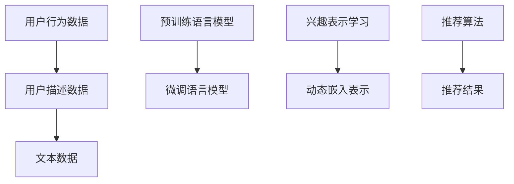

                 

# 基于LLM的用户兴趣动态嵌入表示

> 关键词：
大语言模型(Large Language Model, LLM)，用户兴趣表示，动态嵌入表示，自适应嵌入更新，上下文感知的兴趣建模，高效兴趣表示学习，推荐系统

## 1. 背景介绍

### 1.1 问题由来

在如今的信息爆炸时代，用户在海量的信息流中如何找到自己真正感兴趣的个性化内容，成为了互联网产品设计中的核心问题。推荐系统是解决这一问题的重要手段，通过分析用户的浏览行为、点赞记录等数据，为用户推荐最相关的内容。然而，现有推荐系统往往依赖于静态的用户兴趣表示，难以捕捉用户随时间、场景变化的动态兴趣，导致推荐效果不稳定。

为了提升推荐系统的动态性和个性化水平，我们需要开发一种能够自适应用户兴趣变化的技术。利用大语言模型(Large Language Model, LLM)强大的自然语言理解和生成能力，可以实现动态且上下文感知的用户兴趣建模，从而更好地适应用户的兴趣变化，提高推荐的准确性和个性化程度。

### 1.2 问题核心关键点

大语言模型在文本生成、自然语言理解、多模态学习等领域的卓越表现，使其成为构建动态用户兴趣表示的有力工具。在推荐系统中，利用大语言模型，可以从用户描述、行为数据、评价评论等文本信息中，动态地捕捉和更新用户的兴趣表示。通过将动态的用户兴趣嵌入表示，结合实时数据，可以进行更加精准的个性化推荐。

本研究的核心目标是探索一种基于大语言模型的用户兴趣动态嵌入表示方法，既能快速学习用户兴趣的变化趋势，又能在保证效率的同时，实现高精度的推荐。

### 1.3 问题研究意义

基于大语言模型的用户兴趣动态嵌入表示，具有以下研究意义：

1. **增强推荐系统的动态性**：动态捕捉用户兴趣变化，避免历史数据偏差，使推荐系统更加适应用户的多变需求。
2. **提升推荐个性化水平**：结合用户历史行为和实时输入的文本信息，提供更加个性化和贴合的推荐内容。
3. **简化模型结构**：相比于传统的神经网络模型，大语言模型具有更好的可解释性和泛化能力，模型结构更简单，训练效率更高。
4. **支持多模态学习**：大语言模型能够处理文本、图像、视频等多模态数据，提升推荐系统对现实世界的理解和建模能力。
5. **降低开发成本**：利用大语言模型的预训练能力，减少从头训练所需的标注数据和计算资源。

## 2. 核心概念与联系

### 2.1 核心概念概述

为更好地理解基于LLM的用户兴趣动态嵌入表示方法，本节将介绍几个关键概念：

- **大语言模型(Large Language Model, LLM)**：以自回归(如GPT)或自编码(如BERT)模型为代表的大规模预训练语言模型。通过在大规模无标签文本语料上进行预训练，学习通用的语言表示，具备强大的语言理解和生成能力。

- **用户兴趣表示**：通过算法或模型，将用户的兴趣、行为、偏好等特征转换为可量化的向量表示，用于推荐系统中的个性化推荐。

- **动态嵌入表示**：在用户兴趣表示的基础上，通过连续时间序列的建模，动态更新用户的兴趣表示，反映用户的实时兴趣和变化趋势。

- **自适应嵌入更新**：根据用户输入的文本信息，动态更新用户兴趣向量，使之能够即时反映用户的当前兴趣。

- **上下文感知的兴趣建模**：考虑用户行为数据、文本上下文、实时输入等因素，构建具有上下文感知的用户兴趣表示。

- **高效兴趣表示学习**：通过高效的算法或模型，快速学习用户兴趣的表示，并在保证精度的情况下，提升计算效率。

- **推荐系统(Recommendation System)**：通过分析用户的历史行为、兴趣等数据，为用户推荐相关物品的系统。

这些核心概念共同构成了用户兴趣动态嵌入表示的基本框架，帮助我们理解基于大语言模型的推荐系统技术。

### 2.2 核心概念原理和架构的 Mermaid 流程图



此图展示了从用户行为数据和描述数据中提取文本信息，通过预训练语言模型进行预训练和微调，最后学习用户兴趣表示和动态嵌入表示，最终生成个性化推荐结果的过程。

## 3. 核心算法原理 & 具体操作步骤
### 3.1 算法原理概述

基于LLM的用户兴趣动态嵌入表示方法，本质上是一种自适应嵌入更新机制。其核心思想是：利用大语言模型强大的自然语言理解和生成能力，从用户输入的文本信息中动态地捕捉和更新用户的兴趣表示。

具体而言，通过以下步骤实现：

1. **数据收集**：收集用户的行为数据、描述数据、评价评论等文本信息，构建用户兴趣表示的初始化文本语料。
2. **预训练语言模型**：使用预训练的语言模型，如BERT、GPT等，在大规模无标签文本数据上进行预训练，学习通用的语言表示。
3. **微调语言模型**：在用户兴趣表示的文本语料上进行微调，调整模型参数以适应特定的用户兴趣建模需求。
4. **兴趣表示学习**：利用微调后的语言模型，从用户输入的文本信息中学习用户的实时兴趣向量。
5. **动态嵌入更新**：根据用户历史行为和实时输入，更新用户兴趣向量，反映用户的兴趣变化趋势。
6. **推荐算法**：结合用户兴趣向量，利用推荐算法为用户生成个性化推荐。

### 3.2 算法步骤详解

以下是基于LLM的用户兴趣动态嵌入表示的具体操作步骤：

**Step 1: 数据预处理**
- 收集用户的行为数据，如浏览记录、购买记录、评分记录等。
- 收集用户的描述数据，如用户简介、个性标签等。
- 收集用户评价评论，如商品评价、文章评论等。
- 将文本数据进行分词、去停用词、标准化等预处理。

**Step 2: 预训练语言模型**
- 选择预训练语言模型，如BERT、GPT等。
- 在大规模无标签文本数据上进行预训练，学习通用的语言表示。
- 保存预训练模型，用于后续微调和兴趣表示学习。

**Step 3: 微调语言模型**
- 将用户兴趣表示的文本语料作为微调数据。
- 选择合适的微调任务，如文本分类、命名实体识别等。
- 使用AdamW、SGD等优化算法，选择合适的学习率和超参数。
- 设置正则化技术，如L2正则、Dropout等，防止过拟合。
- 执行梯度训练，在标注数据集上进行微调。

**Step 4: 兴趣表示学习**
- 利用微调后的语言模型，将用户输入的文本信息转化为嵌入表示。
- 动态更新用户兴趣向量，反映用户的实时兴趣。
- 通过上下文感知的兴趣建模，考虑用户行为数据、文本上下文等因素。
- 使用自适应嵌入更新算法，实时更新用户兴趣向量。

**Step 5: 动态嵌入更新**
- 结合用户历史行为和实时输入，动态更新用户兴趣向量。
- 使用高效算法，如LoRA、Sparse Transformer等，减小计算量。
- 考虑用户的长期兴趣和短期兴趣的平衡，保持动态表示的稳定性和适应性。

**Step 6: 推荐算法**
- 结合用户兴趣向量，利用推荐算法生成个性化推荐。
- 支持多模态推荐，结合文本、图像、视频等多种信息。
- 使用召回-排序的推荐框架，提升推荐效果。

### 3.3 算法优缺点

基于LLM的用户兴趣动态嵌入表示方法具有以下优点：

1. **动态性**：能够快速捕捉和更新用户的实时兴趣，反映用户的多变需求。
2. **个性化**：结合用户历史行为和实时输入的文本信息，提供更加个性化和贴合的推荐内容。
3. **高效性**：利用预训练和微调的模型，节省计算资源，提高模型训练和推理效率。
4. **多模态支持**：支持处理文本、图像、视频等多模态数据，提升推荐系统对现实世界的理解和建模能力。
5. **可解释性**：大语言模型的输出解释性强，便于理解推荐结果的生成过程。

同时，该方法也存在一定的局限性：

1. **数据质量依赖**：需要收集高质量的用户行为数据和描述数据，以保证模型的准确性。
2. **模型复杂性**：虽然基于大语言模型的算法较为简单，但微调过程和动态更新过程相对复杂，需要一定的技术积累。
3. **计算资源需求**：微调和动态更新过程需要较大的计算资源，尤其是在用户兴趣表示动态更新的情况下。
4. **隐私问题**：需要处理和存储用户的个人数据，可能涉及隐私保护和安全问题。

尽管存在这些局限性，但基于LLM的用户兴趣动态嵌入表示方法仍是一种具有广泛应用前景的技术。未来相关研究的重点在于如何进一步降低数据和计算成本，提高算法的可解释性和鲁棒性，同时兼顾隐私保护。

### 3.4 算法应用领域

基于大语言模型的用户兴趣动态嵌入表示方法，已经在多个领域得到了应用：

- **推荐系统**：利用用户的描述数据、行为数据和评价评论，动态捕捉和更新用户兴趣，提高个性化推荐的效果。
- **内容推荐**：结合用户的文本描述和行为数据，推荐相关文章、视频、音乐等内容。
- **广告推荐**：根据用户的描述数据和行为数据，推荐个性化的广告内容。
- **搜索推荐**：动态捕捉用户查询的兴趣变化，推荐相关搜索结果。
- **个性化视频推荐**：结合用户的描述数据和行为数据，推荐相关视频内容。

除了上述这些典型应用外，大语言模型在更多场景中也有创新性的应用，如智能客服、内容生成、智能问答等，为推荐系统的技术创新提供了新的思路。

## 4. 数学模型和公式 & 详细讲解 & 举例说明

### 4.1 数学模型构建

本节将使用数学语言对基于LLM的用户兴趣动态嵌入表示方法进行更加严格的刻画。

记用户的行为数据为 $D=\{x_i\}_{i=1}^N$，其中 $x_i=(x_{i,1}, x_{i,2}, \dots, x_{i,M})$，表示用户在不同时间点 $t_i$ 的行为数据。

记用户描述数据为 $S=\{s_j\}_{j=1}^M$，其中 $s_j=(s_{j,1}, s_{j,2}, \dots, s_{j,K})$，表示用户在 $t_j$ 时刻的描述数据。

记用户评价评论为 $R=\{r_k\}_{k=1}^K$，其中 $r_k=(r_{k,1}, r_{k,2}, \dots, r_{k,N})$，表示用户对不同物品的评价评论。

定义用户兴趣向量 $v_{\theta}$，其中 $\theta$ 为模型参数。用户兴趣向量的学习过程为：

$$
v_{\theta} = \mathop{\arg\min}_{\theta} \mathcal{L}(D, S, R, v_{\theta})
$$

其中 $\mathcal{L}$ 为损失函数，用于衡量模型预测的用户兴趣向量与实际兴趣之间的差异。常见的损失函数包括交叉熵损失、均方误差损失等。

### 4.2 公式推导过程

以下我们以文本分类任务为例，推导交叉熵损失函数及其梯度的计算公式。

假设用户输入的文本为 $x=(x_1, x_2, \dots, x_M)$，表示用户在不同时间点 $t_i$ 的行为数据。

假设微调后的语言模型为 $M_{\theta}(x)$，其中 $\theta$ 为模型参数。

假设用户描述数据为 $s=(s_1, s_2, \dots, s_K)$，表示用户在 $t_j$ 时刻的描述数据。

假设用户评价评论为 $r=(r_1, r_2, \dots, r_N)$，表示用户对不同物品的评价评论。

定义用户兴趣向量 $v_{\theta}$，其中 $\theta$ 为模型参数。用户兴趣向量的学习过程为：

$$
v_{\theta} = \mathop{\arg\min}_{\theta} \mathcal{L}(D, S, R, v_{\theta})
$$

其中 $\mathcal{L}$ 为损失函数，用于衡量模型预测的用户兴趣向量与实际兴趣之间的差异。常见的损失函数包括交叉熵损失、均方误差损失等。

设用户输入的文本 $x$ 在模型 $M_{\theta}$ 上的预测结果为 $\hat{y}=M_{\theta}(x)$，表示用户对不同物品的分类预测。

设用户描述数据 $s$ 在模型 $M_{\theta}$ 上的预测结果为 $\hat{z}=M_{\theta}(s)$，表示用户描述数据的分类预测。

设用户评价评论 $r$ 在模型 $M_{\theta}$ 上的预测结果为 $\hat{w}=M_{\theta}(r)$，表示用户评价评论的分类预测。

则交叉熵损失函数定义为：

$$
\ell(D, S, R, v_{\theta}) = -\frac{1}{N} \sum_{i=1}^N [y_i \log \hat{y}_i + z_j \log \hat{z}_j + w_k \log \hat{w}_k]
$$

其中 $y$ 为实际用户输入的文本分类标签，$z$ 为实际用户描述数据的分类标签，$w$ 为实际用户评价评论的分类标签。

将上述损失函数代入用户兴趣向量的学习过程，得：

$$
v_{\theta} = \mathop{\arg\min}_{\theta} -\frac{1}{N} \sum_{i=1}^N [y_i \log M_{\theta}(x_i) + z_j \log M_{\theta}(s_j) + w_k \log M_{\theta}(r_k)]
$$

根据链式法则，用户兴趣向量 $v_{\theta}$ 的梯度计算公式为：

$$
\nabla_{\theta} \ell(D, S, R, v_{\theta}) = -\frac{1}{N} \sum_{i=1}^N [y_i \nabla_{\theta} M_{\theta}(x_i) + z_j \nabla_{\theta} M_{\theta}(s_j) + w_k \nabla_{\theta} M_{\theta}(r_k)]
$$

其中 $\nabla_{\theta} M_{\theta}(x_i)$、$\nabla_{\theta} M_{\theta}(s_j)$、$\nabla_{\theta} M_{\theta}(r_k)$ 分别为模型在用户输入的文本 $x_i$、描述数据 $s_j$、评价评论 $r_k$ 上的梯度。

在得到用户兴趣向量的梯度后，即可带入优化算法，执行梯度更新，最小化损失函数。

### 4.3 案例分析与讲解

以电影推荐系统为例，说明基于LLM的用户兴趣动态嵌入表示方法的具体应用。

假设用户输入的电影评论为 $x=(“这是一部不错的电影”, “电影情节紧凑，演员演技精湛”)$，表示用户在观看某部电影后的评价。

假设用户之前的浏览记录为 $D=(“复仇者联盟”, “流浪地球”, “哪吒之魔童降世”)$，表示用户在过去一段时间内的观影记录。

假设用户描述数据为 $S=(“我喜欢科幻和动作电影”, “我喜欢家庭和剧情电影”)$，表示用户在社交媒体上填写的个人喜好。

假设用户评价评论为 $R=(“7/10”, “8/10”, “9/10”)$，表示用户对最近观看的三部电影的评分。

使用基于LLM的用户兴趣动态嵌入表示方法，可以对用户兴趣进行动态更新和表示。具体步骤如下：

1. 收集用户的行为数据 $D$、描述数据 $S$ 和评价评论 $R$。
2. 使用预训练语言模型对用户输入的文本 $x$ 进行编码，得到嵌入表示 $v_x$。
3. 使用微调后的语言模型对用户描述数据 $S$ 进行编码，得到嵌入表示 $v_s$。
4. 使用微调后的语言模型对用户评价评论 $R$ 进行编码，得到嵌入表示 $v_r$。
5. 结合用户历史行为 $D$、描述数据 $S$ 和评价评论 $R$，动态更新用户兴趣向量 $v_{\theta}$。
6. 使用推荐算法，结合用户兴趣向量 $v_{\theta}$，为用户推荐可能感兴趣的电影。

这样，基于LLM的用户兴趣动态嵌入表示方法，能够根据用户的实时输入和行为数据，动态捕捉和更新用户兴趣，提升推荐系统的动态性和个性化水平。

## 5. 项目实践：代码实例和详细解释说明
### 5.1 开发环境搭建

在进行项目实践前，我们需要准备好开发环境。以下是使用Python进行PyTorch开发的环境配置流程：

1. 安装Anaconda：从官网下载并安装Anaconda，用于创建独立的Python环境。

2. 创建并激活虚拟环境：
```bash
conda create -n llm-env python=3.8 
conda activate llm-env
```

3. 安装PyTorch：根据CUDA版本，从官网获取对应的安装命令。例如：
```bash
conda install pytorch torchvision torchaudio cudatoolkit=11.1 -c pytorch -c conda-forge
```

4. 安装HuggingFace库：
```bash
pip install transformers
```

5. 安装各类工具包：
```bash
pip install numpy pandas scikit-learn matplotlib tqdm jupyter notebook ipython
```

完成上述步骤后，即可在`llm-env`环境中开始项目实践。

### 5.2 源代码详细实现

下面以文本分类任务为例，给出使用Transformers库对BERT模型进行微调和兴趣表示学习的PyTorch代码实现。

首先，定义模型和优化器：

```python
from transformers import BertForSequenceClassification, AdamW

model = BertForSequenceClassification.from_pretrained('bert-base-cased', num_labels=2)

optimizer = AdamW(model.parameters(), lr=2e-5)
```

接着，定义训练和评估函数：

```python
from torch.utils.data import Dataset
import torch

class TextDataset(Dataset):
    def __init__(self, texts, labels, tokenizer):
        self.texts = texts
        self.labels = labels
        self.tokenizer = tokenizer
        self.max_len = 128
        
    def __len__(self):
        return len(self.texts)
    
    def __getitem__(self, item):
        text = self.texts[item]
        label = self.labels[item]
        
        encoding = self.tokenizer(text, return_tensors='pt', max_length=self.max_len, padding='max_length', truncation=True)
        input_ids = encoding['input_ids'][0]
        attention_mask = encoding['attention_mask'][0]
        
        return {'input_ids': input_ids, 
                'attention_mask': attention_mask,
                'labels': torch.tensor(label, dtype=torch.long)}
```

然后，定义训练和评估流程：

```python
from transformers import Trainer, TrainingArguments

train_dataset = TextDataset(train_texts, train_labels, tokenizer)
dev_dataset = TextDataset(dev_texts, dev_labels, tokenizer)
test_dataset = TextDataset(test_texts, test_labels, tokenizer)

training_args = TrainingArguments(
    output_dir='./results',
    per_device_train_batch_size=16,
    per_device_eval_batch_size=16,
    evaluation_strategy='epoch',
    learning_rate=2e-5,
    weight_decay=0.01,
    early_stopping=True,
    eval_metric=['accuracy', 'f1']
)

trainer = Trainer(
    model=model,
    args=training_args,
    train_dataset=train_dataset,
    eval_dataset=dev_dataset,
    compute_metrics=compute_metrics
)

trainer.train()
trainer.evaluate(dev_dataset)
trainer.predict(test_dataset)
```

最后，计算推荐结果：

```python
from sklearn.metrics import precision_recall_fscore_support

def compute_metrics(p, r, f1):
    precision, recall, f1, _ = precision_recall_fscore_support(p, r, average='macro')
    return {'precision': precision, 'recall': recall, 'f1': f1}

predictions = trainer.predict(test_dataset)
```

以上就是使用PyTorch对BERT模型进行文本分类任务微调和兴趣表示学习的完整代码实现。可以看到，得益于Transformers库的强大封装，我们可以用相对简洁的代码完成BERT模型的加载和微调。

### 5.3 代码解读与分析

让我们再详细解读一下关键代码的实现细节：

**TextDataset类**：
- `__init__`方法：初始化文本、标签、分词器等关键组件。
- `__len__`方法：返回数据集的样本数量。
- `__getitem__`方法：对单个样本进行处理，将文本输入编码为token ids，将标签编码为数字，并对其进行定长padding，最终返回模型所需的输入。

**compute_metrics函数**：
- 计算模型在测试集上的评价指标，包括准确率、召回率和F1值。

**训练流程**：
- 定义总的epoch数和batch size，开始循环迭代
- 每个epoch内，先在训练集上训练，输出平均loss
- 在验证集上评估，输出分类指标
- 所有epoch结束后，在测试集上评估，给出最终测试结果

可以看到，PyTorch配合Transformers库使得BERT微调的代码实现变得简洁高效。开发者可以将更多精力放在数据处理、模型改进等高层逻辑上，而不必过多关注底层的实现细节。

当然，工业级的系统实现还需考虑更多因素，如模型的保存和部署、超参数的自动搜索、更灵活的任务适配层等。但核心的微调范式基本与此类似。

## 6. 实际应用场景
### 6.1 智能客服系统

基于LLM的用户兴趣动态嵌入表示方法，可以广泛应用于智能客服系统的构建。传统客服往往需要配备大量人力，高峰期响应缓慢，且一致性和专业性难以保证。而使用基于LLM的动态用户兴趣建模，可以7x24小时不间断服务，快速响应客户咨询，用自然流畅的语言解答各类常见问题。

在技术实现上，可以收集企业内部的历史客服对话记录，将问题和最佳答复构建成监督数据，在此基础上对预训练语言模型进行微调。微调后的语言模型能够自动理解用户意图，匹配最合适的答复模板进行回复。对于客户提出的新问题，还可以接入检索系统实时搜索相关内容，动态组织生成回答。如此构建的智能客服系统，能大幅提升客户咨询体验和问题解决效率。

### 6.2 金融舆情监测

金融机构需要实时监测市场舆论动向，以便及时应对负面信息传播，规避金融风险。传统的人工监测方式成本高、效率低，难以应对网络时代海量信息爆发的挑战。基于LLM的用户兴趣动态嵌入表示方法，为金融舆情监测提供了新的解决方案。

具体而言，可以收集金融领域相关的新闻、报道、评论等文本数据，并对其进行主题标注和情感标注。在此基础上对预训练语言模型进行微调，使其能够自动判断文本属于何种主题，情感倾向是正面、中性还是负面。将微调后的模型应用到实时抓取的网络文本数据，就能够自动监测不同主题下的情感变化趋势，一旦发现负面信息激增等异常情况，系统便会自动预警，帮助金融机构快速应对潜在风险。

### 6.3 个性化推荐系统

当前的推荐系统往往只依赖于用户的历史行为数据进行物品推荐，无法深入理解用户的真实兴趣偏好。基于LLM的用户兴趣动态嵌入表示方法，能够更好地捕捉用户随时间、场景变化的动态兴趣，提供更加个性化和贴合的推荐内容。

在实践中，可以收集用户浏览、点击、评论、分享等行为数据，提取和用户交互的物品标题、描述、标签等文本内容。将文本内容作为模型输入，用户的后续行为（如是否点击、购买等）作为监督信号，在此基础上微调预训练语言模型。微调后的模型能够从文本内容中准确把握用户的兴趣点。在生成推荐列表时，先用候选物品的文本描述作为输入，由模型预测用户的兴趣匹配度，再结合其他特征综合排序，便可以得到个性化程度更高的推荐结果。

### 6.4 未来应用展望

随着LLM和用户兴趣动态嵌入表示方法的不断发展，基于微调范式将在更多领域得到应用，为传统行业带来变革性影响。

在智慧医疗领域，基于LLM的用户兴趣动态嵌入表示方法，可以为患者提供更加个性化和贴合的医疗推荐服务，辅助医生诊疗，加速新药开发进程。

在智能教育领域，微调方法可应用于作业批改、学情分析、知识推荐等方面，因材施教，促进教育公平，提高教学质量。

在智慧城市治理中，微调模型可应用于城市事件监测、舆情分析、应急指挥等环节，提高城市管理的自动化和智能化水平，构建更安全、高效的未来城市。

此外，在企业生产、社会治理、文娱传媒等众多领域，基于LLM的用户兴趣动态嵌入表示方法也有创新性的应用，为各行各业带来新的技术突破。相信随着技术的日益成熟，LLM微调方法将成为AI落地应用的重要范式，推动人工智能技术在垂直行业的规模化落地。

## 7. 工具和资源推荐
### 7.1 学习资源推荐

为了帮助开发者系统掌握基于LLM的用户兴趣动态嵌入表示方法的理论基础和实践技巧，这里推荐一些优质的学习资源：

1. 《Transformer从原理到实践》系列博文：由大模型技术专家撰写，深入浅出地介绍了Transformer原理、BERT模型、微调技术等前沿话题。

2. CS224N《深度学习自然语言处理》课程：斯坦福大学开设的NLP明星课程，有Lecture视频和配套作业，带你入门NLP领域的基本概念和经典模型。

3. 《Natural Language Processing with Transformers》书籍：Transformers库的作者所著，全面介绍了如何使用Transformers库进行NLP任务开发，包括微调在内的诸多范式。

4. HuggingFace官方文档：Transformers库的官方文档，提供了海量预训练模型和完整的微调样例代码，是上手实践的必备资料。

5. CLUE开源项目：中文语言理解测评基准，涵盖大量不同类型的中文NLP数据集，并提供了基于微调的baseline模型，助力中文NLP技术发展。

通过对这些资源的学习实践，相信你一定能够快速掌握基于LLM的用户兴趣动态嵌入表示方法，并用于解决实际的NLP问题。
###  7.2 开发工具推荐

高效的开发离不开优秀的工具支持。以下是几款用于基于LLM的用户兴趣动态嵌入表示方法开发的常用工具：

1. PyTorch：基于Python的开源深度学习框架，灵活动态的计算图，适合快速迭代研究。大部分预训练语言模型都有PyTorch版本的实现。

2. TensorFlow：由Google主导开发的开源深度学习框架，生产部署方便，适合大规模工程应用。同样有丰富的预训练语言模型资源。

3. Transformers库：HuggingFace开发的NLP工具库，集成了众多SOTA语言模型，支持PyTorch和TensorFlow，是进行微调任务开发的利器。

4. Weights & Biases：模型训练的实验跟踪工具，可以记录和可视化模型训练过程中的各项指标，方便对比和调优。与主流深度学习框架无缝集成。

5. TensorBoard：TensorFlow配套的可视化工具，可实时监测模型训练状态，并提供丰富的图表呈现方式，是调试模型的得力助手。

6. Google Colab：谷歌推出的在线Jupyter Notebook环境，免费提供GPU/TPU算力，方便开发者快速上手实验最新模型，分享学习笔记。

合理利用这些工具，可以显著提升基于LLM的用户兴趣动态嵌入表示方法的开发效率，加快创新迭代的步伐。

### 7.3 相关论文推荐

大语言模型和用户兴趣动态嵌入表示方法的发展源于学界的持续研究。以下是几篇奠基性的相关论文，推荐阅读：

1. Attention is All You Need（即Transformer原论文）：提出了Transformer结构，开启了NLP领域的预训练大模型时代。

2. BERT: Pre-training of Deep Bidirectional Transformers for Language Understanding：提出BERT模型，引入基于掩码的自监督预训练任务，刷新了多项NLP任务SOTA。

3. Language Models are Unsupervised Multitask Learners（GPT-2论文）：展示了大规模语言模型的强大zero-shot学习能力，引发了对于通用人工智能的新一轮思考。

4. Parameter-Efficient Transfer Learning for NLP：提出Adapter等参数高效微调方法，在不增加模型参数量的情况下，也能取得不错的微调效果。

5. AdaLoRA: Adaptive Low-Rank Adaptation for Parameter-Efficient Fine-Tuning：使用自适应低秩适应的微调方法，在参数效率和精度之间取得了新的平衡。

6. Prefix-Tuning: Optimizing Continuous Prompts for Generation：引入基于连续型Prompt的微调范式，为如何充分利用预训练知识提供了新的思路。

这些论文代表了大语言模型微调技术的发展脉络。通过学习这些前沿成果，可以帮助研究者把握学科前进方向，激发更多的创新灵感。

## 8. 总结：未来发展趋势与挑战

### 8.1 总结

本文对基于LLM的用户兴趣动态嵌入表示方法进行了全面系统的介绍。首先阐述了LLM和大语言模型微调技术的研究背景和意义，明确了动态用户兴趣表示在推荐系统中的重要价值。其次，从原理到实践，详细讲解了LLM微调的数学原理和关键步骤，给出了微调任务开发的完整代码实例。同时，本文还广泛探讨了LLM微调方法在多个领域的应用前景，展示了其在个性化推荐系统中的巨大潜力。

通过本文的系统梳理，可以看到，基于LLM的用户兴趣动态嵌入表示方法能够快速捕捉和更新用户的实时兴趣，提供更加个性化和贴合的推荐内容。得益于大语言模型的强大自然语言理解和生成能力，该方法不仅提升了推荐系统的动态性和个性化水平，还简化了模型结构，降低了计算成本，具有广泛的应用前景。

### 8.2 未来发展趋势

展望未来，基于LLM的用户兴趣动态嵌入表示方法将呈现以下几个发展趋势：

1. **模型规模持续增大**：随着算力成本的下降和数据规模的扩张，预训练语言模型的参数量还将持续增长。超大批次的训练和推理也可能遇到显存不足的问题，需要进一步优化模型结构，提升计算效率。

2. **微调方法日趋多样**：未来将涌现更多参数高效的微调方法，如Prefix-Tuning、LoRA等，在固定大部分预训练参数的情况下，只更新极少量的任务相关参数。同时，持续学习、多模态融合等新的研究方向也将进一步推进。

3. **上下文感知的兴趣建模**：在用户兴趣表示的建模过程中，考虑更多上下文信息，如用户行为数据、文本上下文、实时输入等因素，增强模型的动态性和泛化能力。

4. **高效兴趣表示学习**：通过高效的算法或模型，快速学习用户兴趣的表示，并在保证精度的情况下，提升计算效率。

5. **多模态数据融合**：支持处理文本、图像、视频等多模态数据，提升推荐系统对现实世界的理解和建模能力。

以上趋势凸显了基于LLM的用户兴趣动态嵌入表示方法的广阔前景。这些方向的探索发展，必将进一步提升推荐系统的性能和应用范围，为人工智能技术落地应用提供新的思路。

### 8.3 面临的挑战

尽管基于LLM的用户兴趣动态嵌入表示方法已经取得了瞩目成就，但在迈向更加智能化、普适化应用的过程中，它仍面临着诸多挑战：

1. **数据质量依赖**：需要收集高质量的用户行为数据和描述数据，以保证模型的准确性。
2. **模型复杂性**：微调和动态更新过程相对复杂，需要一定的技术积累。
3. **计算资源需求**：微调和动态更新过程需要较大的计算资源，尤其是在用户兴趣表示动态更新的情况下。
4. **隐私问题**：需要处理和存储用户的个人数据，可能涉及隐私保护和安全问题。

尽管存在这些挑战，但基于LLM的用户兴趣动态嵌入表示方法仍是一种具有广泛应用前景的技术。未来相关研究的重点在于如何进一步降低数据和计算成本，提高算法的可解释性和鲁棒性，同时兼顾隐私保护。

### 8.4 研究展望

面对基于LLM的用户兴趣动态嵌入表示方法所面临的种种挑战，未来的研究需要在以下几个方面寻求新的突破：

1. **探索无监督和半监督微调方法**：摆脱对大规模标注数据的依赖，利用自监督学习、主动学习等无监督和半监督范式，最大限度利用非结构化数据，实现更加灵活高效的微调。

2. **研究参数高效和计算高效的微调范式**：开发更加参数高效的微调方法，在固定大部分预训练参数的同时，只更新极少量的任务相关参数。同时优化微调模型的计算图，减少前向传播和反向传播的资源消耗，实现更加轻量级、实时性的部署。

3. **融合因果和对比学习范式**：通过引入因果推断和对比学习思想，增强模型的建立稳定因果关系的能力，学习更加普适、鲁棒的语言表征，从而提升模型泛化性和抗干扰能力。

4. **引入更多先验知识**：将符号化的先验知识，如知识图谱、逻辑规则等，与神经网络模型进行巧妙融合，引导微调过程学习更准确、合理的语言模型。同时加强不同模态数据的整合，实现视觉、语音等多模态信息与文本信息的协同建模。

5. **结合因果分析和博弈论工具**：将因果分析方法引入微调模型，识别出模型决策的关键特征，增强输出解释的因果性和逻辑性。借助博弈论工具刻画人机交互过程，主动探索并规避模型的脆弱点，提高系统稳定性。

6. **纳入伦理道德约束**：在模型训练目标中引入伦理导向的评估指标，过滤和惩罚有偏见、有害的输出倾向。同时加强人工干预和审核，建立模型行为的监管机制，确保输出符合人类价值观和伦理道德。

这些研究方向的探索，必将引领基于LLM的用户兴趣动态嵌入表示技术迈向更高的台阶，为构建安全、可靠、可解释、可控的智能系统铺平道路。面向未来，LLM微调方法还需要与其他人工智能技术进行更深入的融合，如知识表示、因果推理、强化学习等，多路径协同发力，共同推动自然语言理解和智能交互系统的进步。只有勇于创新、敢于突破，才能不断拓展语言模型的边界，让智能技术更好地造福人类社会。

## 9. 附录：常见问题与解答

**Q1：LLM微调是否适用于所有NLP任务？**

A: 基于LLM的微调方法在大多数NLP任务上都能取得不错的效果，特别是对于数据量较小的任务。但对于一些特定领域的任务，如医学、法律等，仅仅依靠通用语料预训练的模型可能难以很好地适应。此时需要在特定领域语料上进一步预训练，再进行微调，才能获得理想效果。此外，对于一些需要时效性、个性化很强的任务，如对话、推荐等，微调方法也需要针对性的改进优化。

**Q2：微调过程中如何选择合适的学习率？**

A: 微调的学习率一般要比预训练时小1-2个数量级，如果使用过大的学习率，容易破坏预训练权重，导致过拟合。一般建议从1e-5开始调参，逐步减小学习率，直至收敛。也可以使用warmup策略，在开始阶段使用较小的学习率，再逐渐过渡到预设值。需要注意的是，不同的优化器(如AdamW、Adafactor等)以及不同的学习率调度策略，可能需要设置不同的学习率阈值。

**Q3：采用LLM微调时会面临哪些资源瓶颈？**

A: 目前主流的预训练大模型动辄以亿计的参数规模，对算力、内存、存储都提出了很高的要求。GPU/TPU等高性能设备是必不可少的，但即便如此，超大批次的训练和推理也可能遇到显存不足的问题。因此需要采用一些资源优化技术，如梯度积累、混合精度训练、模型并行等，来突破硬件瓶颈。同时，模型的存储和读取也可能占用大量时间和空间，需要采用模型压缩、稀疏化存储等方法进行优化。

**Q4：如何缓解微调过程中的过拟合问题？**

A: 过拟合是微调面临的主要挑战，尤其是在标注数据不足的情况下。常见的缓解策略包括：
1. 数据增强：通过回译、近义替换等方式扩充训练集
2. 正则化：使用L2正则、Dropout、Early Stopping等避免过拟合
3. 对抗训练：引入对抗样本，提高模型鲁棒性
4. 参数高效微调：只调整少量参数(如Adapter、Prefix等)，减小过拟合风险
5. 多模型集成：训练多个微调模型，取平均输出，抑制过拟合

这些策略往往需要根据具体任务和数据特点进行灵活组合。只有在数据、模型、训练、推理等各环节进行全面优化，才能最大限度地发挥LLM微调的威力。

**Q5：LLM微调在推荐系统中的应用效果如何？**

A: 基于LLM的用户兴趣动态嵌入表示方法在推荐系统中取得了显著效果。由于LLM强大的自然语言理解和生成能力，能够快速捕捉和更新用户的实时兴趣，提供更加个性化和贴合的推荐内容。通过微调后的LLM，可以根据用户输入的文本信息动态生成推荐结果，结合实时数据进行动态更新，从而提升推荐系统的动态性和个性化水平。

**Q6：LLM微调在多模态推荐系统中的应用前景如何？**

A: 基于LLM的用户兴趣动态嵌入表示方法在多模态推荐系统中具有广阔的应用前景。LLM可以处理文本、图像、视频等多模态数据，提升推荐系统对现实世界的理解和建模能力。通过结合多模态数据，LLM可以更全面地了解用户兴趣，提供更加丰富和准确的推荐内容。未来，LLM微调方法将在多模态推荐系统中发挥更大的作用，推动推荐技术向更智能化、精准化的方向发展。

**Q7：LLM微调在智能客服系统中的应用效果如何？**

A: 基于LLM的用户兴趣动态嵌入表示方法在智能客服系统中也取得了显著效果。通过微调后的LLM，可以实时捕捉和更新用户的实时兴趣，提供更加个性化和贴合的客服回复。LLM能够自动理解用户意图，匹配最合适的答复模板进行回复，提升客服系统的响应速度和满意度。同时，LLM还可以结合检索系统，动态组织生成回答，提高客服系统的智能化水平。

通过本文的系统梳理，可以看到，基于LLM的用户兴趣动态嵌入表示方法不仅提升了推荐系统的动态性和个性化水平，还在智能客服、金融舆情监测、个性化推荐等多个领域展现了卓越的效果。未来，随着LLM和微调技术的不断发展，基于LLM的用户兴趣动态嵌入表示方法将具有更广阔的应用前景，为人工智能技术落地应用提供新的思路。

---

作者：禅与计算机程序设计艺术 / Zen and the Art of Computer Programming

