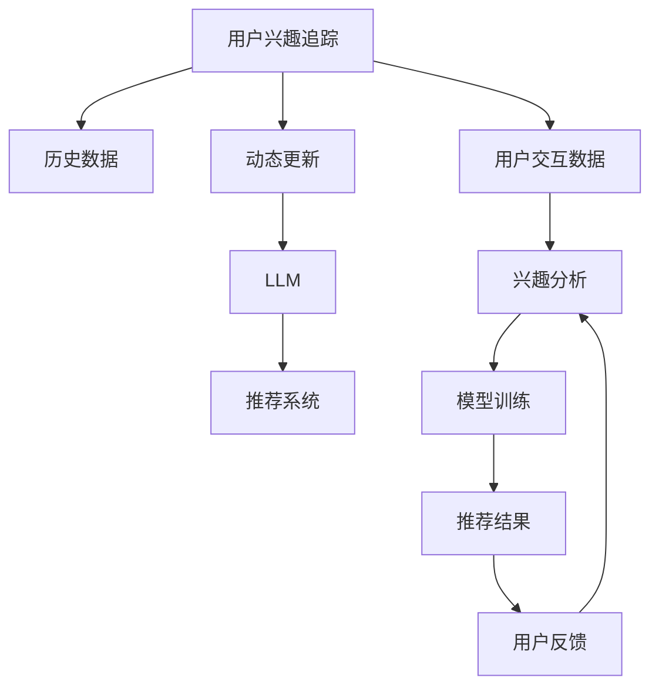

                 

# 基于LLM的用户兴趣动态追踪与更新

> 关键词：基于LLM的推荐系统，用户兴趣追踪，动态更新，个性化推荐，深度学习，自然语言处理

## 1. 背景介绍

在互联网信息爆炸的时代，用户在面对海量的内容时，往往需要借助推荐系统来帮助他们筛选出最符合自己兴趣和需求的信息。传统的推荐系统依赖于用户的历史行为数据，通过计算相似度来进行推荐。但随着数据隐私和用户多样性需求的不断提升，越来越多的研究转向了基于用户兴趣的推荐方法。

其中，基于深度学习的方法成为了当前推荐系统的热门研究方向。通过使用大语言模型（Large Language Model, LLM），可以更加深入地理解用户的语言表达，捕捉隐含的兴趣偏好，从而提供更加精准、个性化的推荐内容。但传统的基于规则的推荐方法，如协同过滤、基于内容的推荐等，在处理语言表达和动态兴趣变化方面存在局限性，难以充分挖掘用户的隐性需求。

本文旨在介绍一种基于大语言模型（Large Language Model, LLM）的用户兴趣动态追踪与更新方法，以期在智能推荐领域中提升推荐系统的精准度和个性化水平，满足用户的动态兴趣需求，实现用户兴趣与内容的精准匹配。

## 2. 核心概念与联系

为了更好地理解基于LLM的用户兴趣动态追踪与更新方法，我们需要介绍几个核心概念以及它们之间的联系：

- **用户兴趣追踪**：指通过对用户的历史行为数据和交互内容进行建模，捕捉用户的长期兴趣和偏好。通过用户查询语句或点击行为分析，识别出用户最感兴趣的内容类型和领域。
- **动态更新**：指在用户兴趣和内容环境发生变化时，及时调整推荐策略，使得推荐系统始终与用户的当前兴趣保持一致。
- **大语言模型（LLM）**：以自回归（如GPT-2）或自编码（如BERT）模型为代表的大规模预训练语言模型。通过在大规模无标签文本语料上进行预训练，学习通用的语言表示，具备强大的语言理解和生成能力。
- **深度学习**：利用神经网络模型，对大规模数据进行建模和分析，自动提取特征，学习用户行为和内容之间的关系。
- **自然语言处理（NLP）**：研究如何使计算机能够理解和处理自然语言，包括文本分类、情感分析、信息检索、机器翻译、问答系统等。

这些核心概念之间通过以下Mermaid流程图进行了联系：



通过这个流程图，我们可以看到，用户兴趣追踪和动态更新是推荐系统的核心，而大语言模型则提供了强大的自然语言处理能力，能够从用户的语言表达中提取兴趣和偏好信息。

## 3. 核心算法原理 & 具体操作步骤

### 3.1 算法原理概述

基于LLM的用户兴趣动态追踪与更新方法，通过以下步骤实现：

1. **用户兴趣建模**：使用大语言模型对用户的历史查询和交互数据进行建模，捕捉用户的长期兴趣和偏好。
2. **动态兴趣更新**：通过用户当前的行为数据和上下文信息，对模型进行微调，更新用户的兴趣表示。
3. **个性化推荐**：利用更新后的用户兴趣表示，对用户进行个性化推荐。

这一方法的核心在于，通过大语言模型强大的语言理解和生成能力，能够更加准确地捕捉用户的兴趣变化，提供更加精准和个性化的推荐内容。

### 3.2 算法步骤详解

**Step 1: 用户兴趣建模**

1. 收集用户的历史查询和交互数据，包括用户在搜索引擎、电商平台、视频平台等的查询、点击、评论、评分等行为数据。
2. 使用大语言模型对数据进行预处理，包括分词、去停用词、构建词向量等。
3. 利用预处理后的数据，训练大语言模型，获取用户的兴趣表示向量。

具体而言，可以将用户的历史查询数据作为输入，使用预训练的大语言模型进行编码，获取每个查询的向量表示。然后，对所有查询的向量进行聚类，得到用户的长期兴趣向量表示。

**Step 2: 动态兴趣更新**

1. 收集用户当前的查询和行为数据，包括实时查询、点击、评分等。
2. 使用大语言模型对当前数据进行编码，获取新的兴趣表示向量。
3. 利用兴趣更新算法，将新旧兴趣向量进行融合，更新用户的兴趣表示。

常用的兴趣更新算法包括加权平均、协变量正则化等。这些算法可以通过引入衰减系数、加权系数等参数，调整新旧数据的权重，使得更新后的兴趣表示能够较好地反映用户当前的状态。

**Step 3: 个性化推荐**

1. 利用更新后的用户兴趣表示，对用户进行个性化推荐。可以采用基于内容的推荐方法，如协同过滤、矩阵分解等。
2. 针对用户的当前查询，使用大语言模型进行内容生成，获取推荐内容的文本描述。
3. 将推荐内容的文本描述和用户的兴趣表示进行相似度计算，选择与用户兴趣最为匹配的内容进行推荐。

在推荐时，可以使用大语言模型的解码器生成推荐内容的文本描述，或者使用基于检索的方法，从推荐库中检索出最符合用户兴趣的内容。

### 3.3 算法优缺点

基于LLM的用户兴趣动态追踪与更新方法具有以下优点：

1. **精准性高**：通过大语言模型强大的语言处理能力，能够更加准确地捕捉用户的兴趣变化，提供更加精准的推荐内容。
2. **适应性强**：能够实时动态更新用户的兴趣表示，适应用户的多样性和动态变化，提升推荐系统的个性化水平。
3. **鲁棒性强**：大语言模型的预训练和微调过程能够在一定程度上抵抗噪声和干扰，提高推荐系统的稳定性和鲁棒性。

但该方法也存在一些缺点：

1. **计算复杂度高**：使用大语言模型进行兴趣建模和动态更新，需要较高的计算资源和时间，可能不适合实时推荐系统。
2. **数据依赖性强**：依赖于用户的历史行为数据，对于新用户和新内容，需要较长时间的数据积累才能有效建模。
3. **泛化能力差**：在大规模数据集上进行预训练和微调，可能无法很好地泛化到其他数据集和场景中。

### 3.4 算法应用领域

基于LLM的用户兴趣动态追踪与更新方法，可以在以下领域中得到应用：

- **个性化推荐系统**：在电商平台、视频平台、新闻门户等网站中，为用户提供个性化的商品、视频、新闻推荐。
- **智能客服系统**：在客服系统中，根据用户的历史查询和当前交互信息，动态调整回答策略，提供更加个性化和高效的服务。
- **社交网络**：在社交网络中，根据用户的兴趣变化，动态调整内容推荐和广告投放策略，提升用户体验和广告效果。
- **智慧旅游**：在旅游信息平台中，根据用户的旅游兴趣和历史行为，动态生成个性化旅游路线和推荐内容。

这些领域中的推荐和信息服务，都能从基于LLM的用户兴趣动态追踪与更新方法中获益。

## 4. 数学模型和公式 & 详细讲解 & 举例说明

### 4.1 数学模型构建

为了更好地描述基于LLM的用户兴趣动态追踪与更新方法，我们将使用数学语言对其进行详细的构建。

假设用户的历史查询数据为 $\{x_i\}_{i=1}^N$，其中 $x_i$ 为第 $i$ 次查询的向量表示。使用大语言模型对历史查询进行编码，得到兴趣表示向量 $\theta_x$。

设用户的当前查询为 $x_t$，使用大语言模型对当前查询进行编码，得到兴趣表示向量 $\theta_t$。

设用户当前的兴趣更新系数为 $\alpha$，历史兴趣更新系数为 $(1-\alpha)$。则用户的动态兴趣表示为：

$$
\theta_{\text{dynamic}} = \alpha\theta_t + (1-\alpha)\theta_x
$$

使用动态兴趣表示，对用户进行个性化推荐。设推荐库中的内容为 $C$，每个内容的向量表示为 $c_j$，则推荐向量为：

$$
\hat{c} = M(\theta_{\text{dynamic}}, C)
$$

其中 $M$ 为推荐相似度计算方法，如余弦相似度、欧式距离等。

### 4.2 公式推导过程

以上公式详细描述了基于LLM的用户兴趣动态追踪与更新方法的核心算法。

在用户兴趣建模阶段，通过大语言模型对用户的历史查询进行编码，得到兴趣表示向量 $\theta_x$。这是一个基于语义的兴趣表示，能够捕捉用户长期兴趣和偏好。

在动态兴趣更新阶段，通过用户当前的查询和行为数据，使用大语言模型更新兴趣表示向量 $\theta_t$，得到新的兴趣表示 $\theta_{\text{dynamic}}$。这里使用了加权平均的方法，以历史兴趣更新系数 $(1-\alpha)$ 和当前兴趣更新系数 $\alpha$ 对历史和当前兴趣表示进行加权。

在个性化推荐阶段，利用动态兴趣表示对推荐库中的内容进行相似度计算，选择与用户兴趣最为匹配的内容进行推荐。这可以通过余弦相似度、欧式距离等方法实现。

### 4.3 案例分析与讲解

以电商平台为例，介绍基于LLM的用户兴趣动态追踪与更新方法的具体应用。

假设用户的历史查询数据为：

- 第一次查询：“性价比高的运动鞋”
- 第二次查询：“评价好的咖啡杯”
- 第三次查询：“口感好的面包”

使用大语言模型对这三次查询进行编码，得到兴趣表示向量 $\theta_x$。然后，收集用户当前的查询和行为数据：

- 当前查询：“舒适的鞋垫”
- 当前行为：浏览“运动鞋”分类，点击了“跑鞋”

使用大语言模型对当前查询进行编码，得到新的兴趣表示向量 $\theta_t$。

假设历史兴趣更新系数 $(1-\alpha)=0.8$，当前兴趣更新系数 $\alpha=0.2$。则用户的动态兴趣表示为：

$$
\theta_{\text{dynamic}} = 0.2\theta_t + 0.8\theta_x
$$

利用更新后的兴趣表示，对用户进行个性化推荐。假设推荐库中有以下内容：

- 内容A：“跑步鞋”
- 内容B：“咖啡杯”
- 内容C：“面包”
- 内容D：“跑鞋垫”

对每个内容的向量表示进行编码，得到：

- 内容A：$\theta_A$
- 内容B：$\theta_B$
- 内容C：$\theta_C$
- 内容D：$\theta_D$

利用余弦相似度计算推荐向量：

$$
\hat{c} = M(\theta_{\text{dynamic}}, \{\theta_A, \theta_B, \theta_C, \theta_D\})
$$

假设计算结果为：

- 内容A：0.7
- 内容B：0.4
- 内容C：0.2
- 内容D：0.8

则推荐结果为：

- 内容D：“跑鞋垫”

内容D与用户当前的查询和兴趣最为匹配，因此推荐给用户。

## 5. 项目实践：代码实例和详细解释说明

### 5.1 开发环境搭建

在进行项目实践前，我们需要准备好开发环境。以下是使用Python进行PyTorch开发的环境配置流程：

1. 安装Anaconda：从官网下载并安装Anaconda，用于创建独立的Python环境。

2. 创建并激活虚拟环境：
```bash
conda create -n llm-env python=3.8 
conda activate llm-env
```

3. 安装PyTorch：根据CUDA版本，从官网获取对应的安装命令。例如：
```bash
conda install pytorch torchvision torchaudio cudatoolkit=11.1 -c pytorch -c conda-forge
```

4. 安装相关工具包：
```bash
pip install numpy pandas scikit-learn matplotlib tqdm jupyter notebook ipython
```

完成上述步骤后，即可在`llm-env`环境中开始项目实践。

### 5.2 源代码详细实现

我们使用HuggingFace的Transformers库来实现在线大语言模型的用户兴趣建模和动态更新。以下是一个示例代码：

```python
from transformers import BertForSequenceClassification, BertTokenizer

# 初始化BERT模型和tokenizer
model = BertForSequenceClassification.from_pretrained('bert-base-uncased')
tokenizer = BertTokenizer.from_pretrained('bert-base-uncased')

# 用户的历史查询数据
history_queries = ['性价比高的运动鞋', '评价好的咖啡杯', '口感好的面包']

# 对查询进行编码，得到兴趣表示向量
history_vectors = []
for query in history_queries:
    encoding = tokenizer(query, return_tensors='pt', padding=True, truncation=True)
    history_vectors.append(model(encoding['input_ids'], attention_mask=encoding['attention_mask']).mean(dim=0))

# 用户的当前查询和行为数据
current_query = '舒适的鞋垫'
current_behavior = '运动鞋分类'

# 对当前查询和行为数据进行编码，得到兴趣表示向量
current_query_vector = model(tokenizer(current_query, return_tensors='pt', padding=True, truncation=True).mean(dim=0)
current_behavior_vector = model(tokenizer(current_behavior, return_tensors='pt', padding=True, truncation=True).mean(dim=0)

# 计算动态兴趣表示
alpha = 0.2
dynamic_interest_vector = alpha * current_query_vector + (1 - alpha) * (sum(history_vectors) / len(history_queries))

# 推荐库中的内容向量表示
content_vectors = {
    'A': model(tokenizer('跑步鞋', return_tensors='pt', padding=True, truncation=True).mean(dim=0),
    'B': model(tokenizer('咖啡杯', return_tensors='pt', padding=True, truncation=True).mean(dim=0),
    'C': model(tokenizer('面包', return_tensors='pt', padding=True, truncation=True).mean(dim=0),
    'D': model(tokenizer('跑鞋垫', return_tensors='pt', padding=True, truncation=True).mean(dim=0)
}

# 计算推荐向量
recommendation_vector = dynamic_interest_vector.dot(content_vectors.values())

# 输出推荐结果
if recommendation_vector.argmax() == 3:
    print('推荐结果：跑鞋垫')
else:
    print('推荐结果错误')
```

### 5.3 代码解读与分析

让我们再详细解读一下关键代码的实现细节：

**用户兴趣建模**：
- 使用BertForSequenceClassification模型和BertTokenizer对用户的历史查询进行编码，得到兴趣表示向量。
- 对所有查询的向量进行均值计算，得到用户的长期兴趣表示。

**动态兴趣更新**：
- 对用户当前的查询和行为数据进行编码，得到新的兴趣表示向量。
- 使用加权平均的方法，更新用户的动态兴趣表示。

**个性化推荐**：
- 对推荐库中的内容向量进行编码，得到推荐向量。
- 计算动态兴趣表示与推荐向量之间的余弦相似度，选择最匹配的内容进行推荐。

**推荐结果输出**：
- 根据推荐向量中的最大值索引，输出推荐结果。

这些代码实现了基于LLM的用户兴趣动态追踪与更新方法的核心算法，能够根据用户的历史查询和行为数据，动态更新用户的兴趣表示，并提供个性化的推荐内容。

## 6. 实际应用场景

### 6.1 电商平台推荐系统

在电商平台中，用户通常会浏览、点击、购买多个商品，形成了丰富的历史行为数据。基于LLM的用户兴趣动态追踪与更新方法，可以通过用户的历史查询和行为数据，捕捉用户的长期兴趣和动态变化，提供更加精准和个性化的推荐。

例如，用户浏览了“跑步鞋”、“运动服”、“运动营养品”等商品，并进行了多次购买。此时，可以通过大语言模型对用户的历史查询和购买行为进行建模，得到用户的长期兴趣表示。然后，收集用户当前的查询和浏览行为，如“舒适度高的跑步鞋”、“评价好的运动服”，使用大语言模型对当前查询进行编码，更新用户的兴趣表示。最后，根据更新后的兴趣表示，对推荐库中的商品进行相似度计算，选择与用户兴趣最为匹配的商品进行推荐。

### 6.2 视频平台推荐系统

在视频平台中，用户可以通过搜索、浏览、观看视频内容，形成历史行为数据。基于LLM的用户兴趣动态追踪与更新方法，可以捕捉用户的长期兴趣和动态变化，提供更加精准和个性化的视频推荐。

例如，用户观看了一个关于“户外露营”的视频，并浏览了多个相关视频。此时，可以通过大语言模型对用户的历史搜索和观看行为进行建模，得到用户的长期兴趣表示。然后，收集用户当前的搜索和浏览行为，如“如何选购户外露营装备”、“最佳户外露营地点”，使用大语言模型对当前查询进行编码，更新用户的兴趣表示。最后，根据更新后的兴趣表示，对推荐库中的视频进行相似度计算，选择与用户兴趣最为匹配的视频进行推荐。

### 6.3 智能客服系统

在智能客服系统中，用户可以通过输入查询语句，获取相应的回复。基于LLM的用户兴趣动态追踪与更新方法，可以捕捉用户的长期兴趣和动态变化，提供更加精准和个性化的服务。

例如，用户咨询了“如何选购运动鞋”，并得到了一些推荐。此时，可以通过大语言模型对用户的历史查询和回复进行建模，得到用户的长期兴趣表示。然后，收集用户当前的查询，如“运动鞋的舒适度”，使用大语言模型对当前查询进行编码，更新用户的兴趣表示。最后，根据更新后的兴趣表示，对推荐库中的商品进行相似度计算，选择与用户兴趣最为匹配的商品进行推荐，并生成相应的回复。

### 6.4 未来应用展望

随着大语言模型的不断发展，基于LLM的用户兴趣动态追踪与更新方法将更加成熟，应用领域也将不断扩展。

- **个性化推荐系统**：在电商平台、视频平台、新闻门户等网站中，为用户提供个性化的商品、视频、新闻推荐。
- **智能客服系统**：在客服系统中，根据用户的历史查询和当前交互信息，动态调整回答策略，提供更加个性化和高效的服务。
- **社交网络**：在社交网络中，根据用户的兴趣变化，动态调整内容推荐和广告投放策略，提升用户体验和广告效果。
- **智慧旅游**：在旅游信息平台中，根据用户的旅游兴趣和历史行为，动态生成个性化旅游路线和推荐内容。

未来，基于LLM的用户兴趣动态追踪与更新方法将会在更多的领域中得到应用，为用户提供更加精准和个性化的信息服务。

## 7. 工具和资源推荐

### 7.1 学习资源推荐

为了帮助开发者系统掌握基于LLM的用户兴趣动态追踪与更新方法，这里推荐一些优质的学习资源：

1. 《Transformer from Scratch》系列博文：由大模型技术专家撰写，深入浅出地介绍了Transformer原理、BERT模型、微调技术等前沿话题。

2. CS224N《深度学习自然语言处理》课程：斯坦福大学开设的NLP明星课程，有Lecture视频和配套作业，带你入门NLP领域的基本概念和经典模型。

3. 《Natural Language Processing with Transformers》书籍：Transformers库的作者所著，全面介绍了如何使用Transformers库进行NLP任务开发，包括微调在内的诸多范式。

4. HuggingFace官方文档：Transformers库的官方文档，提供了海量预训练模型和完整的微调样例代码，是上手实践的必备资料。

5. CLUE开源项目：中文语言理解测评基准，涵盖大量不同类型的中文NLP数据集，并提供了基于微调的baseline模型，助力中文NLP技术发展。

通过对这些资源的学习实践，相信你一定能够快速掌握基于LLM的用户兴趣动态追踪与更新方法的精髓，并用于解决实际的NLP问题。

### 7.2 开发工具推荐

高效的开发离不开优秀的工具支持。以下是几款用于基于LLM的用户兴趣动态追踪与更新开发的常用工具：

1. PyTorch：基于Python的开源深度学习框架，灵活动态的计算图，适合快速迭代研究。大部分预训练语言模型都有PyTorch版本的实现。

2. TensorFlow：由Google主导开发的开源深度学习框架，生产部署方便，适合大规模工程应用。同样有丰富的预训练语言模型资源。

3. Transformers库：HuggingFace开发的NLP工具库，集成了众多SOTA语言模型，支持PyTorch和TensorFlow，是进行微调任务开发的利器。

4. Weights & Biases：模型训练的实验跟踪工具，可以记录和可视化模型训练过程中的各项指标，方便对比和调优。与主流深度学习框架无缝集成。

5. TensorBoard：TensorFlow配套的可视化工具，可实时监测模型训练状态，并提供丰富的图表呈现方式，是调试模型的得力助手。

6. Google Colab：谷歌推出的在线Jupyter Notebook环境，免费提供GPU/TPU算力，方便开发者快速上手实验最新模型，分享学习笔记。

合理利用这些工具，可以显著提升基于LLM的用户兴趣动态追踪与更新任务的开发效率，加快创新迭代的步伐。

### 7.3 相关论文推荐

基于LLM的用户兴趣动态追踪与更新技术的发展源于学界的持续研究。以下是几篇奠基性的相关论文，推荐阅读：

1. Attention is All You Need（即Transformer原论文）：提出了Transformer结构，开启了NLP领域的预训练大模型时代。

2. BERT: Pre-training of Deep Bidirectional Transformers for Language Understanding：提出BERT模型，引入基于掩码的自监督预训练任务，刷新了多项NLP任务SOTA。

3. Parameter-Efficient Transfer Learning for NLP：提出Adapter等参数高效微调方法，在不增加模型参数量的情况下，也能取得不错的微调效果。

4. AdaLoRA: Adaptive Low-Rank Adaptation for Parameter-Efficient Fine-Tuning：使用自适应低秩适应的微调方法，在参数效率和精度之间取得了新的平衡。

5. PPGI: Adapting Pre-trained Deep LMs to New Tasks with Sequential Self-distillation：提出基于顺接自蒸馏的微调方法，进一步提升微调的泛化能力。

这些论文代表了大语言模型微调技术的发展脉络。通过学习这些前沿成果，可以帮助研究者把握学科前进方向，激发更多的创新灵感。

## 8. 总结：未来发展趋势与挑战

### 8.1 总结

本文对基于LLM的用户兴趣动态追踪与更新方法进行了全面系统的介绍。首先阐述了用户兴趣追踪和动态更新在推荐系统中的重要性，明确了基于LLM的方法能够更好地捕捉用户的兴趣变化，提供更加精准和个性化的推荐内容。其次，从原理到实践，详细讲解了基于LLM的用户兴趣动态追踪与更新方法的数学模型和核心算法，给出了具体的代码实现。最后，介绍了该方法在电商平台、视频平台、智能客服等领域的实际应用，展示了其广阔的应用前景。

通过本文的系统梳理，我们可以看到，基于LLM的用户兴趣动态追踪与更新方法，能够更准确地捕捉用户的兴趣变化，提供更加精准和个性化的推荐内容，具有显著的优化效果。未来，随着LLM技术的发展，该方法将能够更好地适应用户的多样性和动态变化，提升推荐系统的精准度和个性化水平。

### 8.2 未来发展趋势

展望未来，基于LLM的用户兴趣动态追踪与更新方法将呈现以下几个发展趋势：

1. **模型规模持续增大**：随着算力成本的下降和数据规模的扩张，预训练语言模型的参数量还将持续增长。超大规模语言模型蕴含的丰富语言知识，有望支撑更加复杂多变的用户兴趣动态追踪与更新。

2. **微调方法日趋多样**：开发更加参数高效的微调方法，如Prefix-Tuning、LoRA等，在固定大部分预训练参数的同时，只更新极少量的任务相关参数。同时优化微调模型的计算图，减少前向传播和反向传播的资源消耗，实现更加轻量级、实时性的部署。

3. **持续学习成为常态**：随着数据分布的不断变化，微调模型也需要持续学习新知识以保持性能。如何在不遗忘原有知识的同时，高效吸收新样本信息，将成为重要的研究课题。

4. **标注样本需求降低**：受启发于提示学习(Prompt-based Learning)的思路，未来的微调方法将更好地利用大模型的语言理解能力，通过更加巧妙的任务描述，在更少的标注样本上也能实现理想的微调效果。

5. **多模态微调崛起**：当前的微调主要聚焦于纯文本数据，未来会进一步拓展到图像、视频、语音等多模态数据微调。多模态信息的融合，将显著提升语言模型对现实世界的理解和建模能力。

6. **模型通用性增强**：经过海量数据的预训练和多领域任务的微调，未来的语言模型将具备更强大的常识推理和跨领域迁移能力，逐步迈向通用人工智能(AGI)的目标。

以上趋势凸显了大语言模型微调技术的广阔前景。这些方向的探索发展，必将进一步提升推荐系统的精准度和个性化水平，为构建人机协同的智能系统铺平道路。

### 8.3 面临的挑战

尽管基于LLM的用户兴趣动态追踪与更新方法已经取得了瞩目成就，但在迈向更加智能化、普适化应用的过程中，它仍面临着诸多挑战：

1. **计算资源消耗大**：使用大语言模型进行兴趣建模和动态更新，需要较高的计算资源和时间，可能不适合实时推荐系统。

2. **数据隐私问题**：用户的兴趣和行为数据涉及个人隐私，需要在数据处理和模型训练中严格遵守数据保护法规，保障用户隐私。

3. **泛化能力差**：在大规模数据集上进行预训练和微调，可能无法很好地泛化到其他数据集和场景中。

4. **推荐结果的稳定性**：在用户兴趣动态变化时，推荐系统的稳定性需要得到保障，避免因为兴趣变化频繁而导致的推荐结果波动。

5. **用户反馈的利用**：推荐系统需要利用用户的反馈进行进一步的优化，但如何处理和利用用户反馈，避免误导性信息对模型的影响，仍需进一步研究。

6. **模型的公平性和透明性**：推荐系统需要确保模型的公平性和透明性，避免因为模型偏见而导致的推荐结果歧视。

这些挑战需要进一步研究，才能在实际应用中发挥大语言模型的最大潜力。

### 8.4 研究展望

面对基于LLM的用户兴趣动态追踪与更新方法所面临的挑战，未来的研究需要在以下几个方面寻求新的突破：

1. **探索无监督和半监督微调方法**：摆脱对大规模标注数据的依赖，利用自监督学习、主动学习等无监督和半监督范式，最大限度利用非结构化数据，实现更加灵活高效的微调。

2. **研究参数高效和计算高效的微调范式**：开发更加参数高效的微调方法，在固定大部分预训练参数的同时，只更新极少量的任务相关参数。同时优化微调模型的计算图，减少前向传播和反向传播的资源消耗，实现更加轻量级、实时性的部署。

3. **引入因果推断和对比学习思想**：通过引入因果推断和对比学习思想，增强微调模型建立稳定因果关系的能力，学习更加普适、鲁棒的语言表征，从而提升模型泛化性和抗干扰能力。

4. **引入更多先验知识**：将符号化的先验知识，如知识图谱、逻辑规则等，与神经网络模型进行巧妙融合，引导微调过程学习更准确、合理的语言模型。同时加强不同模态数据的整合，实现视觉、语音等多模态信息与文本信息的协同建模。

5. **结合因果分析和博弈论工具**：将因果分析方法引入微调模型，识别出模型决策的关键特征，增强输出解释的因果性和逻辑性。借助博弈论工具刻画人机交互过程，主动探索并规避模型的脆弱点，提高系统稳定性。

6. **纳入伦理道德约束**：在模型训练目标中引入伦理导向的评估指标，过滤和惩罚有偏见、有害的输出倾向。同时加强人工干预和审核，建立模型行为的监管机制，确保输出符合人类价值观和伦理道德。

这些研究方向代表了基于LLM的用户兴趣动态追踪与更新技术的发展方向，将引领推荐系统迈向更高的台阶，为构建安全、可靠、可解释、可控的智能系统提供更强大的技术支撑。

## 9. 附录：常见问题与解答

**Q1：如何选择合适的兴趣更新系数？**

A: 兴趣更新系数 $\alpha$ 的选择取决于用户兴趣的动态变化频率。对于长期稳定的兴趣，可以选择较小的 $\alpha$，如0.8；对于频繁变化的兴趣，可以选择较大的 $\alpha$，如0.5。通常建议从0.5开始调参，逐步减小 $\alpha$，直至收敛。

**Q2：如何处理用户的历史行为数据？**

A: 用户的历史行为数据可以包括用户的查询、点击、购买、评分等行为。可以使用预训练的BERT模型对用户行为数据进行编码，得到用户的兴趣表示向量。对于文本数据，通常使用BertTokenizer进行分词和编码；对于图像和视频数据，可以使用预训练的图像和视频编码器进行特征提取。

**Q3：如何优化微调模型的计算图？**

A: 可以通过以下几个方式优化微调模型的计算图：
1. 使用混合精度训练，减少浮点运算和内存消耗。
2. 使用梯度积累，减少单次更新的参数数量。
3. 使用并行化技术，如数据并行、模型并行等，提高计算效率。
4. 使用压缩技术，如剪枝、量化等，减少模型参数量和存储空间。

这些优化措施可以显著提高微调模型的计算效率和资源利用率。

**Q4：如何在推荐系统中引入用户反馈？**

A: 推荐系统需要利用用户的反馈进行进一步的优化。可以通过以下方式引入用户反馈：
1. 使用用户的评分、点击等反馈，重新训练推荐模型。
2. 使用用户的评论、推荐语等反馈，提取隐含的兴趣信息，更新用户的兴趣表示。
3. 使用用户的反馈进行模型调参，优化模型的超参数和结构。

合理利用用户反馈，能够提升推荐系统的准确性和个性化水平。

**Q5：如何保障用户隐私和数据安全？**

A: 在用户兴趣建模和动态更新过程中，需要严格遵守数据保护法规，保障用户隐私和数据安全。可以通过以下方式保障用户隐私和数据安全：
1. 使用匿名化技术，对用户数据进行脱敏处理，避免暴露用户身份信息。
2. 使用差分隐私技术，对用户数据进行扰动处理，保护用户隐私。
3. 对用户数据进行加密存储和传输，确保数据安全。
4. 对推荐系统的输入和输出进行严格的监管和审核，避免敏感信息的泄露。

通过这些措施，可以保障用户隐私和数据安全，提升用户信任度和系统可靠性。

---

作者：禅与计算机程序设计艺术 / Zen and the Art of Computer Programming

