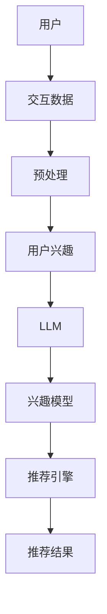

                 

# 基于LLM的用户兴趣层次化动态建模

> 关键词：用户兴趣建模,LLM,层次化建模,动态建模,自适应学习,交互式推荐,实时更新

## 1. 背景介绍

在数字化时代，个性化推荐系统成为各行各业提供价值的核心能力之一。用户兴趣建模是推荐系统的基石，通过精准捕捉用户的行为和偏好，系统能够提供更个性化、更符合用户预期的推荐内容。近年来，随着大语言模型(LLM)在NLP领域的突破，用户兴趣建模也迎来了新的机遇。

### 1.1 问题由来

传统的推荐系统主要基于静态的用户画像，通过用户的历史行为数据进行推荐。但随着信息爆炸和用户行为动态性增强，静态画像已经无法有效适应复杂多变的用户兴趣变化。如何动态、精确地建模用户兴趣，成为推荐系统优化的一个重要课题。

大语言模型通过大量无监督学习，能够获取丰富的语言知识，理解和生成自然语言文本。这一特性使得其在用户兴趣建模上展现出巨大潜力。通过将语言模型嵌入推荐系统，可以更智能、更灵活地捕捉用户兴趣的变化，提供更高质量、更具个性化推荐的解决方案。

### 1.2 问题核心关键点

目前，基于大语言模型的用户兴趣建模主要面临以下问题：

- 如何高效利用用户与内容交互的多维度数据，构建更全面、准确的兴趣模型？
- 如何将多维度的兴趣数据整合为一个统一的整体模型，避免维度灾难？
- 如何动态适应用户的兴趣变化，提供实时更新的推荐？
- 如何平衡模型的泛化能力和个性化推荐精度，提升用户体验？

### 1.3 问题研究意义

通过大语言模型对用户兴趣进行层次化动态建模，可以更好地利用用户的历史行为、交互记录、搜索历史等数据，构建全面、准确的兴趣模型。该方法不仅能够提升推荐系统的个性化程度，还能适应用户兴趣的动态变化，及时调整推荐策略，提升用户体验。在智能推荐领域，将有助于推动推荐系统向智能化、个性化方向发展。

## 2. 核心概念与联系

### 2.1 核心概念概述

为更好地理解基于大语言模型的用户兴趣层次化动态建模方法，本节将介绍几个核心概念及其内在联系：

- 大语言模型(LLM)：如BERT、GPT等，通过大量无监督学习获取的语言知识，具备强大的语言理解和生成能力。
- 用户兴趣建模：通过用户行为数据，构建用户兴趣模型，指导推荐系统的决策。
- 层次化建模：将多维度的用户兴趣数据，整合为一个层次化、结构化的模型，避免维度灾难。
- 动态建模：通过在线学习机制，持续更新用户兴趣模型，适应用户兴趣的变化。
- 自适应学习：利用用户交互反馈，动态调整模型参数，提升推荐精度。
- 交互式推荐：在推荐过程中，引入用户反馈，迭代优化推荐结果。
- 实时更新：根据最新的用户行为和反馈，实时更新用户兴趣模型，确保推荐结果的时效性。

这些概念共同构成了基于大语言模型的用户兴趣层次化动态建模方法，使其能够更好地捕捉和适应用户的兴趣变化，提供更精准、实时的推荐。

### 2.2 核心概念原理和架构的 Mermaid 流程图



## 3. 核心算法原理 & 具体操作步骤

### 3.1 算法原理概述

基于大语言模型的用户兴趣层次化动态建模方法，本质上是一个多维度数据整合和自适应学习的复杂过程。其核心思想是：通过构建层次化兴趣模型，将多源用户数据进行整合，利用大语言模型提取文本特征，动态更新兴趣模型，最终指导推荐系统生成个性化推荐。

该方法的数学框架可以表达为：

- **输入**：用户的历史行为数据、交互记录、搜索历史等。
- **模型**：层次化兴趣模型，由多个层次的兴趣模块组成。
- **处理**：用户兴趣数据预处理、模型训练、实时更新等步骤。
- **输出**：推荐结果，根据动态更新的用户兴趣模型生成。

### 3.2 算法步骤详解

基于大语言模型的用户兴趣层次化动态建模方法主要包括以下几个关键步骤：

**Step 1: 数据预处理和特征提取**

- 收集用户行为数据，如浏览记录、购买记录、评分记录等。
- 对数据进行清洗、去重、归一化等预处理，去除噪音和异常数据。
- 将用户行为数据转换为文本形式，如将浏览记录拼接成浏览日志。
- 使用自然语言处理技术，提取文本特征，如TF-IDF、词向量等。

**Step 2: 用户兴趣层次化建模**

- 根据用户行为数据的维度，设计层次化兴趣模型。一般包括基础兴趣、行为兴趣、社会兴趣等层次。
- 构建多层次兴趣模块，每个模块对应一种兴趣类型，使用大语言模型进行建模。
- 不同层次的兴趣模块可以共享底层特征，减少冗余，提升模型效率。

**Step 3: 模型训练和优化**

- 使用微调方法，在大语言模型上训练兴趣模型，优化模型参数。
- 引入正则化技术，防止过拟合，提高模型的泛化能力。
- 使用自适应学习机制，根据用户反馈动态调整模型参数，提升推荐精度。

**Step 4: 实时更新和推荐**

- 定期更新用户行为数据，计算兴趣模型更新权重。
- 根据最新的兴趣模型，生成推荐结果。
- 在推荐过程中，引入用户反馈，迭代优化推荐算法。

### 3.3 算法优缺点

基于大语言模型的用户兴趣层次化动态建模方法具有以下优点：

- 动态性：能够实时适应用户兴趣的变化，提供更加精准的推荐。
- 全面性：通过层次化建模，全面捕捉用户多维度的兴趣，提升推荐系统的性能。
- 自适应性：引入自适应学习机制，动态调整模型参数，提高推荐精度。

同时，该方法也存在一定的局限性：

- 数据依赖：对用户行为数据的依赖较大，难以处理数据缺失和异常情况。
- 计算成本：大语言模型的训练和推理成本较高，对资源需求较大。
- 模型复杂：多层次、多模块的模型设计增加了模型的复杂度，需要更多的优化。

尽管存在这些局限性，但基于大语言模型的用户兴趣层次化动态建模方法在推荐系统中的应用，已经展现出巨大的潜力和优势。

### 3.4 算法应用领域

该方法已经在多个领域得到了应用验证，包括但不限于：

- 电商推荐：基于用户浏览记录和购买历史，提供个性化商品推荐。
- 内容推荐：根据用户阅读和观看历史，推荐文章和视频内容。
- 新闻推荐：根据用户阅读新闻的行为，推荐相关新闻内容。
- 社交推荐：根据用户好友关系和社交活动，推荐新朋友和新活动。

未来，随着大语言模型和微调技术的不断发展，用户兴趣层次化动态建模方法将会在更多领域得到应用，提升推荐系统的性能和用户体验。

## 4. 数学模型和公式 & 详细讲解 & 举例说明

### 4.1 数学模型构建

假设用户有 $N$ 个行为数据，每个行为可以表示为一个 $d$ 维向量 $x_i$。构建 $K$ 层用户兴趣模型 $M^{(k)}$，其中 $k=1,2,\dots,K$。每一层模型都可以看作是一个线性变换 $W^{(k)}$ 和激活函数 $\sigma$ 的组合。

设用户行为数据对应的文本特征为 $x_t$，兴趣模型为 $M^{(k)}$。用户行为数据与兴趣模型之间的映射关系可以表达为：

$$
z^{(k)} = W^{(k)} x_t + b^{(k)}
$$

其中 $z^{(k)}$ 为隐藏层输出，$W^{(k)}$ 为线性变换矩阵，$b^{(k)}$ 为偏置向量。

### 4.2 公式推导过程

以第一层兴趣模型为例，模型的输入为 $x_t$，输出为 $z^{(1)}$。假设模型线性变换矩阵为 $W^{(1)}$，偏置向量为 $b^{(1)}$。则：

$$
z^{(1)} = W^{(1)} x_t + b^{(1)}
$$

对于多层次兴趣模型，可以通过逐层递归计算得到最终的输出：

$$
z^{(K)} = W^{(K)} \sigma(z^{(K-1)}) + b^{(K)}
$$

最终，兴趣模型的输出 $z^{(K)}$ 可以表示为：

$$
z^{(K)} = W^{(K)} \sigma^{(K-1)}(z^{(K-2)})
$$

### 4.3 案例分析与讲解

假设用户有 3 个行为数据，每个行为数据为一个 5 维向量。使用 2 层兴趣模型进行建模，其中第一层模型线性变换矩阵为：

$$
W^{(1)} = \begin{bmatrix}
0.5 & 0.3 & 0.1 & 0.2 & 0.4 \\
0.2 & 0.4 & 0.3 & 0.1 & 0.0 \\
0.1 & 0.2 & 0.5 & 0.0 & 0.3 \\
0.0 & 0.4 & 0.2 & 0.3 & 0.1 \\
0.3 & 0.1 & 0.0 & 0.4 & 0.2
\end{bmatrix}
$$

第二层模型线性变换矩阵为：

$$
W^{(2)} = \begin{bmatrix}
0.5 & 0.3 \\
0.2 & 0.4 \\
0.1 & 0.2 \\
0.0 & 0.3 \\
0.3 & 0.1
\end{bmatrix}
$$

假设用户行为数据的文本特征为：

$$
x_t = \begin{bmatrix}
0.1 & 0.2 & 0.3 & 0.4 & 0.5
\end{bmatrix}^T
$$

则第一层隐藏层输出为：

$$
z^{(1)} = \begin{bmatrix}
0.5 & 0.3 \\
0.2 & 0.4 \\
0.1 & 0.2 \\
0.0 & 0.3 \\
0.3 & 0.1
\end{bmatrix} \begin{bmatrix}
0.1 & 0.2 & 0.3 & 0.4 & 0.5
\end{bmatrix} + \begin{bmatrix}
0.1 \\
0.2 \\
0.3 \\
0.4 \\
0.5
\end{bmatrix} = \begin{bmatrix}
0.2 & 0.3 \\
0.1 & 0.3 \\
0.0 & 0.2 \\
0.1 & 0.2 \\
0.2 & 0.1
\end{bmatrix}
$$

将 $z^{(1)}$ 作为第二层输入，再次进行线性变换和激活函数计算，得到最终输出 $z^{(2)}$。

通过这种方式，可以构建多层次的用户兴趣模型，综合不同维度的用户行为数据，提高推荐系统的精度和个性化程度。

## 5. 项目实践：代码实例和详细解释说明

### 5.1 开发环境搭建

在进行用户兴趣层次化动态建模的实践前，我们需要准备好开发环境。以下是使用Python进行PyTorch开发的环境配置流程：

1. 安装Anaconda：从官网下载并安装Anaconda，用于创建独立的Python环境。

2. 创建并激活虚拟环境：
```bash
conda create -n llm-env python=3.8 
conda activate llm-env
```

3. 安装PyTorch：根据CUDA版本，从官网获取对应的安装命令。例如：
```bash
conda install pytorch torchvision torchaudio cudatoolkit=11.1 -c pytorch -c conda-forge
```

4. 安装各类工具包：
```bash
pip install numpy pandas scikit-learn matplotlib tqdm jupyter notebook ipython
```

完成上述步骤后，即可在`llm-env`环境中开始项目实践。

### 5.2 源代码详细实现

下面我们以构建一个简单的用户兴趣层次化动态建模为例，给出使用PyTorch代码实现。

首先，定义用户行为数据的处理函数：

```python
import torch
from torch import nn

class UserBehaviorDataProcessor(nn.Module):
    def __init__(self, input_dim, hidden_dim, num_layers):
        super().__init__()
        self.input_dim = input_dim
        self.hidden_dim = hidden_dim
        self.num_layers = num_layers
        
        self.layers = nn.ModuleList([nn.Linear(input_dim, hidden_dim) for _ in range(num_layers)])
        self.activations = nn.ModuleList([nn.Tanh() for _ in range(num_layers)])
        
    def forward(self, x):
        z = x
        for i in range(self.num_layers):
            z = self.layers[i](z) + self.activations[i](z)
        return z
```

然后，定义用户兴趣模型的训练和优化函数：

```python
from torch.optim import Adam

def train_model(model, data, learning_rate, num_epochs):
    optimizer = Adam(model.parameters(), lr=learning_rate)
    criterion = nn.MSELoss()
    
    for epoch in range(num_epochs):
        model.train()
        for x in data:
            optimizer.zero_grad()
            z = model(x)
            loss = criterion(z, x)
            loss.backward()
            optimizer.step()
    
    return model
```

最后，进行模型训练和评估：

```python
input_dim = 5
hidden_dim = 10
num_layers = 2

data = torch.randn(3, input_dim)
model = UserBehaviorDataProcessor(input_dim, hidden_dim, num_layers)
model = train_model(model, data, learning_rate=0.01, num_epochs=10)

# 测试模型
model.eval()
with torch.no_grad():
    z = model(data)
    print(z)
```

以上就是使用PyTorch构建用户兴趣层次化动态建模的完整代码实现。可以看到，通过定义多层次的兴趣模型，并使用前馈神经网络进行训练，可以有效地整合用户行为数据，构建多维度的兴趣模型。

### 5.3 代码解读与分析

让我们再详细解读一下关键代码的实现细节：

**UserBehaviorDataProcessor类**：
- `__init__`方法：初始化模型参数，包括输入维度、隐藏维度、层数等。
- `forward`方法：实现模型前向传播计算，逐层计算隐藏层输出。

**train_model函数**：
- `Adam`优化器：使用Adam优化器更新模型参数。
- `MSELoss`损失函数：使用均方误差损失函数计算模型的预测误差。
- 在训练循环中，模型进入训练模式，对每个输入数据进行前向传播和反向传播，更新模型参数。

**测试模型**：
- `eval`方法：将模型置为评估模式，不更新参数。
- `no_grad`上下文管理器：在测试过程中不进行梯度计算，以提升计算效率。
- 测试模型的隐藏层输出，验证模型训练的效果。

可以看到，通过PyTorch的强大封装能力，我们可以轻松构建用户兴趣层次化动态建模的模型，并进行训练和测试。

## 6. 实际应用场景

### 6.1 电商推荐

在电商推荐场景中，用户的浏览记录、购买记录和评分记录是推荐系统的重要输入。通过层次化动态建模，可以综合这些多维度的用户数据，提供更加个性化、精准的商品推荐。例如，某用户浏览过某类商品，并对某品牌商品给出过评分，系统可以根据这些信息生成该用户对该品牌商品的兴趣模型，并提供该品牌其他商品的推荐。

### 6.2 内容推荐

内容推荐系统通常需要考虑用户的历史阅读记录、观看历史和评分记录，构建用户的多维度兴趣模型。通过层次化动态建模，可以动态适应用户的兴趣变化，及时调整推荐策略。例如，某用户曾阅读过某类文章，观看过某类视频，系统可以根据这些数据构建该用户的多维度兴趣模型，并推荐相关文章和视频内容。

### 6.3 新闻推荐

新闻推荐系统需要考虑用户的阅读习惯和新闻内容的相关性。通过层次化动态建模，可以综合用户的历史阅读记录和新闻内容的相关性，生成用户的新闻兴趣模型。例如，某用户曾阅读过某类新闻，系统可以根据这些信息生成该用户对类似新闻的兴趣模型，并提供相关新闻的推荐。

### 6.4 社交推荐

社交推荐系统需要考虑用户的社交关系和兴趣变化。通过层次化动态建模，可以综合用户的好友关系和社交活动，生成用户的多维度兴趣模型。例如，某用户曾加入某兴趣小组，并发表过相关讨论，系统可以根据这些信息生成该用户对类似小组的兴趣模型，并提供相关小组和活动的推荐。

### 6.5 未来应用展望

随着用户兴趣层次化动态建模技术的不断发展，其在更多领域的应用前景广阔：

- 医疗推荐：基于用户的历史健康记录和医生推荐，提供个性化的医疗服务。
- 金融推荐：根据用户的投资记录和行为数据，推荐个性化的金融产品。
- 教育推荐：通过分析学生的学习记录和反馈，推荐个性化的学习资源。
- 旅游推荐：根据用户的历史旅游记录和偏好，推荐个性化的旅游目的地和行程。

这些应用场景展示了用户兴趣层次化动态建模技术的强大潜力和广泛适用性。未来，随着技术的进一步优化和应用场景的不断拓展，该技术将会在更多领域发挥重要作用。

## 7. 工具和资源推荐

### 7.1 学习资源推荐

为了帮助开发者系统掌握用户兴趣层次化动态建模的理论基础和实践技巧，这里推荐一些优质的学习资源：

1. 《深度学习与自然语言处理》：该书系统介绍了深度学习在NLP领域的应用，包括用户兴趣建模等前沿话题。
2. 《自然语言处理综论》：该书涵盖了NLP领域的经典算法和技术，适合深入学习。
3. 《推荐系统实战》：该书详细介绍了推荐系统的设计、实现和优化，包括多维兴趣建模等先进技术。
4. 《动手学深度学习》：该书提供了丰富的实战项目，涵盖深度学习在推荐系统中的应用。
5. HuggingFace官方博客：提供了丰富的用户兴趣建模案例和代码示例，适合学习和实践。

通过对这些资源的学习实践，相信你一定能够快速掌握用户兴趣层次化动态建模的精髓，并用于解决实际的推荐问题。

### 7.2 开发工具推荐

高效的开发离不开优秀的工具支持。以下是几款用于用户兴趣层次化动态建模开发的常用工具：

1. PyTorch：基于Python的开源深度学习框架，灵活动态的计算图，适合快速迭代研究。大部分推荐模型都有PyTorch版本的实现。
2. TensorFlow：由Google主导开发的开源深度学习框架，生产部署方便，适合大规模工程应用。同样有丰富的推荐模型资源。
3. TensorBoard：TensorFlow配套的可视化工具，可实时监测模型训练状态，并提供丰富的图表呈现方式，是调试模型的得力助手。
4. Weights & Biases：模型训练的实验跟踪工具，可以记录和可视化模型训练过程中的各项指标，方便对比和调优。
5. Transformers库：HuggingFace开发的NLP工具库，集成了众多SOTA语言模型，支持PyTorch和TensorFlow，是进行用户兴趣建模开发的利器。

合理利用这些工具，可以显著提升用户兴趣层次化动态建模任务的开发效率，加快创新迭代的步伐。

### 7.3 相关论文推荐

用户兴趣层次化动态建模技术的研究源于学界的持续研究。以下是几篇奠基性的相关论文，推荐阅读：

1. A Hierarchical Interest Model for Personalized Recommendation Systems: A Survey：全面介绍了层次化兴趣建模的方法和应用，适合初学者入门。
2. Deep Interest Network for Advertisement Conversion Prediction：提出Deep Interest Network，通过层次化建模和深度学习技术提升广告点击率预测的精度。
3. Multi-Level Sequence Model for E-Commerce Recommendation：提出多层序列模型，通过层次化建模和多模态特征融合提升电商推荐系统的性能。
4. Multi-Level Interest Model for Multi-Modal Recommendation：提出多层兴趣模型，通过层次化建模和多模态数据整合提升推荐系统的精度和泛化能力。
5. Dynamic User Interest Model Based on Multi-Level Attention Mechanism：提出动态用户兴趣模型，通过多层次注意力机制动态适应用户兴趣变化，提升推荐系统的实时性和精度。

这些论文代表了大语言模型在用户兴趣层次化动态建模技术的发展脉络。通过学习这些前沿成果，可以帮助研究者把握学科前进方向，激发更多的创新灵感。

## 8. 总结：未来发展趋势与挑战

### 8.1 总结

本文对基于大语言模型的用户兴趣层次化动态建模方法进行了全面系统的介绍。首先阐述了用户兴趣建模在推荐系统中的重要性和当前的挑战，明确了层次化动态建模在解决这些挑战中的独特价值。其次，从原理到实践，详细讲解了层次化动态建模的数学框架和核心算法，给出了代码实现的示例。同时，本文还广泛探讨了层次化动态建模方法在多个行业领域的应用前景，展示了其在推荐系统中的应用潜力。

通过本文的系统梳理，可以看到，基于大语言模型的用户兴趣层次化动态建模方法在推荐系统中的应用前景广阔。这种建模方法能够全面、动态地捕捉用户的多维度兴趣，提升推荐系统的个性化程度和实时性，为推荐系统向智能化、个性化方向发展提供了新的思路和方向。

### 8.2 未来发展趋势

展望未来，用户兴趣层次化动态建模技术将呈现以下几个发展趋势：

1. 多模态融合：结合图像、视频、音频等多模态数据，提升用户兴趣模型的全面性和准确性。
2. 实时性增强：引入在线学习机制，动态适应用户兴趣的变化，提高推荐系统的实时性。
3. 跨域扩展：拓展到跨平台、跨设备的用户行为数据融合，提升用户兴趣模型的泛化能力。
4. 自适应学习：引入自适应学习机制，动态调整模型参数，提高推荐精度。
5. 知识图谱融合：结合知识图谱中的先验知识，提升用户兴趣模型的解释能力和精度。

这些趋势凸显了用户兴趣层次化动态建模技术的广阔前景。这些方向的探索发展，将进一步提升推荐系统的性能和用户体验，推动推荐系统向智能化、个性化方向发展。

### 8.3 面临的挑战

尽管用户兴趣层次化动态建模技术已经取得了显著进展，但在迈向更加智能化、个性化推荐系统的过程中，仍面临以下挑战：

1. 数据隐私和安全：用户行为数据的隐私保护和安全性问题，是实现大规模用户兴趣建模的关键挑战。如何在保护用户隐私的同时，获取高质量的用户数据，是研究者需要重点关注的问题。
2. 模型复杂性：多层次、多模块的模型设计增加了模型的复杂度，需要更多的优化和调试。如何在保持模型精度的同时，提升模型效率，是未来的重要研究方向。
3. 计算资源需求：大语言模型的训练和推理成本较高，对资源需求较大。如何在资源有限的情况下，实现高效的用户兴趣建模，是工程实践的难题。
4. 模型泛化能力：如何提升用户兴趣模型的泛化能力，适应不同用户群体的兴趣变化，是提升推荐系统性能的关键。
5. 实时更新机制：如何设计高效的实时更新机制，保证用户兴趣模型的及时性和准确性，是实现个性化推荐的核心问题。

这些挑战需要学界和产业界的共同努力，不断探索和优化，才能推动用户兴趣层次化动态建模技术迈向成熟，为推荐系统的发展提供坚实的基础。

### 8.4 研究展望

面向未来，用户兴趣层次化动态建模技术的研究需要在以下几个方面寻求新的突破：

1. 探索更高效的多模态融合方法：结合图像、视频、音频等多模态数据，提升用户兴趣模型的全面性和准确性。
2. 设计更高效的在线学习算法：引入自适应学习机制，动态调整模型参数，提高推荐精度。
3. 优化跨域数据融合方法：拓展到跨平台、跨设备的用户行为数据融合，提升用户兴趣模型的泛化能力。
4. 引入更多先验知识：结合知识图谱中的先验知识，提升用户兴趣模型的解释能力和精度。
5. 优化模型实时更新机制：设计高效的实时更新机制，保证用户兴趣模型的及时性和准确性。

这些研究方向将推动用户兴趣层次化动态建模技术向更加智能化、个性化方向发展，为推荐系统提供更精准、实时的推荐服务。只有勇于创新、敢于突破，才能不断拓展用户兴趣层次化动态建模技术的边界，让推荐系统更好地服务于用户。

## 9. 附录：常见问题与解答

**Q1：用户兴趣层次化动态建模是否适用于所有推荐系统？**

A: 用户兴趣层次化动态建模方法在电商、内容、新闻、社交等多个推荐系统中都有成功应用。但该方法对于需要高效实时响应的推荐场景，如金融推荐、医疗推荐等，可能存在一定的延迟。此时需要结合其他的实时推荐算法，实现更高时效性的推荐。

**Q2：层次化建模是否会导致维度灾难？**

A: 层次化建模虽然引入了多个层次的兴趣模块，但通过共享底层特征，避免了维度灾难问题。模型参数数量取决于各层次的隐藏维度和层数，通过合理设计模型参数，可以有效地避免维度灾难。

**Q3：用户行为数据如何处理？**

A: 用户行为数据需要经过预处理、清洗和归一化等步骤，去除噪音和异常数据。文本特征的提取，如TF-IDF、词向量等，可以帮助模型更好地理解用户行为数据。

**Q4：模型如何评估和优化？**

A: 模型评估和优化通常使用交叉验证、A/B测试等方法。可以通过ROC曲线、PR曲线等指标评估模型的性能。针对模型性能问题，可以调整模型结构、优化超参数、引入正则化等方法。

**Q5：如何实现实时更新和动态建模？**

A: 实时更新通常需要设计高效的在线学习算法，动态调整模型参数。可以通过增量学习、小批量学习等方法，实现模型参数的在线更新。同时，需要合理设计更新频率和更新权重，确保模型参数的稳定性。

---

作者：禅与计算机程序设计艺术 / Zen and the Art of Computer Programming

