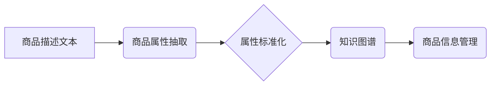

                 

## AI大模型在电商平台商品属性抽取与标准化中的应用

> 关键词：电商平台、商品属性抽取、标准化、自然语言处理、大语言模型、BERT、Transformer、知识图谱

## 1. 背景介绍

随着电商平台的蓬勃发展，商品信息的多样性和复杂性日益增加。商品属性的准确抽取和标准化对于商品搜索、推荐、分类以及用户体验至关重要。传统人工标注和规则匹配方法效率低下，难以应对海量商品数据和不断变化的商品描述语义。

近年来，深度学习技术取得了显著进展，特别是大语言模型（Large Language Model，LLM）的出现，为商品属性抽取与标准化带来了新的机遇。LLM 拥有强大的语义理解和文本生成能力，能够从商品描述中自动识别和提取关键属性，并将其标准化到统一的格式。

## 2. 核心概念与联系

### 2.1  商品属性抽取

商品属性抽取是指从商品描述文本中自动识别和提取商品的特征属性，例如品牌、型号、颜色、尺寸、材质等。

### 2.2  商品属性标准化

商品属性标准化是指将抽取出的属性值转换为统一的格式和标准，以便于数据存储、检索和比较。例如，将不同商品描述中表达的颜色属性统一为标准颜色编码。

### 2.3  大语言模型

大语言模型（LLM）是一种基于深度学习的强大语言模型，通过训练海量文本数据，学习了语言的语法、语义和上下文关系。LLM 能够理解和生成人类语言，并应用于各种自然语言处理任务，例如文本分类、问答、机器翻译等。

### 2.4  知识图谱

知识图谱是一种结构化的知识表示形式，将实体和关系以图的形式表示。知识图谱可以帮助理解商品属性之间的关系，并进行更精准的属性抽取和标准化。

**核心概念与联系流程图**



## 3. 核心算法原理 & 具体操作步骤

### 3.1  算法原理概述

基于大语言模型的商品属性抽取与标准化通常采用以下核心算法：

* **BERT（Bidirectional Encoder Representations from Transformers）**：BERT 是一种基于 Transformer 架构的预训练语言模型，能够捕捉文本中的上下文信息，提高属性识别准确率。
* **Transformer**：Transformer 是一种新型的深度学习架构，能够有效处理长文本序列，并具有强大的语义理解能力。

* **命名实体识别（Named Entity Recognition，NER）**：NER 是一种自然语言处理任务，旨在识别文本中的实体，例如人名、地名、组织名等。在商品属性抽取中，NER 可以用于识别商品名称、品牌、型号等关键实体。

### 3.2  算法步骤详解

1. **数据预处理**: 对商品描述文本进行清洗、分词、标注等预处理操作，以便于模型训练和使用。
2. **模型训练**: 使用 BERT 或 Transformer 等预训练模型，对预处理后的数据进行训练，学习商品属性的特征表示。
3. **属性识别**: 将训练好的模型应用于新的商品描述文本，识别出文本中的属性实体。
4. **属性标准化**: 将识别出的属性值转换为统一的格式和标准，例如将颜色属性转换为标准颜色编码。

### 3.3  算法优缺点

**优点**:

* **高准确率**: 基于大语言模型的算法能够学习复杂的语义关系，提高属性识别准确率。
* **自动化**: 能够自动完成属性抽取和标准化，减少人工成本。
* **可扩展性**: 可以轻松扩展到处理海量商品数据。

**缺点**:

* **训练成本**: 训练大语言模型需要大量的计算资源和时间。
* **数据依赖**: 模型性能受训练数据质量的影响，需要高质量的标注数据进行训练。
* **解释性**: 大语言模型的决策过程较为复杂，难以解释模型的推理逻辑。

### 3.4  算法应用领域

* **电商平台**: 商品搜索、推荐、分类、价格分析等。
* **物流行业**: 物流信息管理、订单匹配、运输路线规划等。
* **制造业**: 产品设计、质量控制、库存管理等。

## 4. 数学模型和公式 & 详细讲解 & 举例说明

### 4.1  数学模型构建

大语言模型的训练通常基于 Transformer 架构，其核心是注意力机制（Attention Mechanism）。注意力机制允许模型关注输入序列中与当前任务相关的部分，提高模型的语义理解能力。

**注意力机制公式**:

$$
Attention(Q, K, V) = \frac{exp(Q \cdot K^T / \sqrt{d_k})}{exp(Q \cdot K^T / \sqrt{d_k})} \cdot V
$$

其中：

* $Q$：查询向量
* $K$：键向量
* $V$：值向量
* $d_k$：键向量的维度

### 4.2  公式推导过程

注意力机制的公式通过计算查询向量与键向量的点积，并使用 softmax 函数归一化，得到每个键向量的权重。然后，将权重与值向量相乘，得到最终的输出。

### 4.3  案例分析与讲解

例如，在商品属性抽取任务中，查询向量可以是当前词的嵌入向量，键向量和值向量可以是所有词的嵌入向量。通过计算注意力机制，模型可以关注与当前词相关的上下文信息，从而更好地识别属性实体。

## 5. 项目实践：代码实例和详细解释说明

### 5.1  开发环境搭建

* Python 3.7+
* TensorFlow 或 PyTorch 深度学习框架
* NLTK 自然语言处理库
* SpaCy 词法分析库

### 5.2  源代码详细实现

```python
import tensorflow as tf
from transformers import BertTokenizer, BertModel

# 加载预训练模型和词典
tokenizer = BertTokenizer.from_pretrained('bert-base-uncased')
model = BertModel.from_pretrained('bert-base-uncased')

# 定义商品属性抽取模型
class AttributeExtractor(tf.keras.Model):
    def __init__(self):
        super(AttributeExtractor, self).__init__()
        self.bert = model
        self.classifier = tf.keras.layers.Dense(num_classes, activation='softmax')

    def call(self, inputs):
        outputs = self.bert(inputs)
        pooled_output = outputs[1][:, 0, :]
        logits = self.classifier(pooled_output)
        return logits

# 实例化模型
model = AttributeExtractor()

# 训练模型
# ...

# 使用模型进行预测
text = "这是一款华为 P50 Pro 手机，颜色为黑色，内存为 8GB。"
inputs = tokenizer(text, return_tensors='tf')
outputs = model(inputs)
predicted_class = tf.argmax(outputs, axis=1).numpy()[0]
```

### 5.3  代码解读与分析

* 代码首先加载预训练的 BERT 模型和词典。
* 然后定义一个属性抽取模型，该模型包含 BERT 模型和一个分类器。
* BERT 模型用于提取文本的语义特征，分类器用于预测属性类别。
* 最后，实例化模型并进行训练。

### 5.4  运行结果展示

模型训练完成后，可以将模型应用于新的商品描述文本，并预测其属性类别。例如，对于文本 "这是一款华为 P50 Pro 手机，颜色为黑色，内存为 8GB。 "，模型可以预测出属性类别为 "品牌: 华为，型号: P50 Pro，颜色: 黑色，内存: 8GB"。

## 6. 实际应用场景

### 6.1  商品搜索

基于大语言模型的商品属性抽取可以提高商品搜索的准确率。例如，用户搜索 "黑色手机"，模型可以识别出 "黑色" 属性，并返回所有颜色为黑色手机的商品。

### 6.2  商品推荐

商品属性抽取可以帮助电商平台根据用户的购买历史和偏好，推荐相关的商品。例如，如果用户购买过黑色华为手机，模型可以推荐其他颜色为黑色的华为手机。

### 6.3  商品分类

商品属性抽取可以帮助电商平台自动对商品进行分类。例如，根据商品的品牌、型号、颜色等属性，将商品分类到不同的类别中。

### 6.4  未来应用展望

* **个性化商品推荐**: 基于用户的个性化需求，提供更精准的商品推荐。
* **智能客服**: 利用大语言模型，构建智能客服系统，自动回答用户关于商品属性的疑问。
* **跨语言商品搜索**: 支持多语言商品搜索，方便全球用户购物。

## 7. 工具和资源推荐

### 7.1  学习资源推荐

* **BERT 官方文档**: https://arxiv.org/abs/1810.04805
* **Transformer 官方文档**: https://arxiv.org/abs/1706.03762
* **HuggingFace Transformers 库**: https://huggingface.co/transformers/

### 7.2  开发工具推荐

* **TensorFlow**: https://www.tensorflow.org/
* **PyTorch**: https://pytorch.org/
* **SpaCy**: https://spacy.io/

### 7.3  相关论文推荐

* **BERT: Pre-training of Deep Bidirectional Transformers for Language Understanding**: https://arxiv.org/abs/1810.04805
* **Attention Is All You Need**: https://arxiv.org/abs/1706.03762
* **XLNet: Generalized Autoregressive Pretraining for Language Understanding**: https://arxiv.org/abs/1906.08237

## 8. 总结：未来发展趋势与挑战

### 8.1  研究成果总结

基于大语言模型的商品属性抽取与标准化技术取得了显著进展，能够有效提高商品信息质量和用户体验。

### 8.2  未来发展趋势

* **模型性能提升**: 探索更强大的模型架构和训练方法，提高模型的准确率和鲁棒性。
* **跨模态理解**: 将文本信息与图像、音频等其他模态信息结合，实现更全面的商品属性理解。
* **个性化定制**: 基于用户的个性化需求，定制商品属性抽取和标准化模型。

### 8.3  面临的挑战

* **数据标注**: 高质量的标注数据是模型训练的关键，但数据标注成本较高。
* **模型解释性**: 大语言模型的决策过程较为复杂，难以解释模型的推理逻辑。
* **可解释性与信任**: 如何提高模型的可解释性和信任度，使其能够被广泛应用于实际场景。

### 8.4  研究展望

未来，我们将继续探索大语言模型在商品属性抽取与标准化领域的应用，并致力于解决上述挑战，推动该技术的发展和应用。

## 9. 附录：常见问题与解答

* **Q1: 如何选择合适的预训练模型？**

A1: 选择预训练模型需要根据具体任务和数据特点进行选择。例如，对于商品描述文本，可以使用 BERT 或 RoBERTa 等预训练模型。

* **Q2: 如何进行数据标注？**

A2: 数据标注可以采用人工标注或自动标注的方法。人工标注需要专业人员进行标注，成本较高；自动标注可以使用规则匹配或机器学习模型进行标注，效率更高。

* **Q3: 如何评估模型性能？**

A3: 模型性能可以评估指标，例如准确率、召回率、F1-score 等。

作者：禅与计算机程序设计艺术 / Zen and the Art of Computer Programming 


<end_of_turn>

