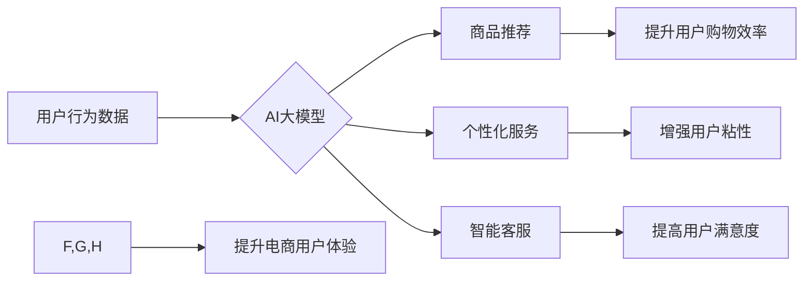

                 

## AI大模型如何提升电商用户体验

> 关键词：电商、用户体验、AI大模型、推荐系统、个性化、自然语言处理、计算机视觉

## 1. 背景介绍

电子商务行业近年来发展迅速，用户对购物体验的要求也越来越高。传统的电商平台依靠商品分类、搜索引擎和人工推荐等方式，难以满足用户个性化需求和提供更智能化的购物体验。 

随着人工智能技术的快速发展，特别是深度学习和自然语言处理技术的突破，AI大模型应运而生，为电商行业带来了新的机遇。AI大模型能够通过学习海量数据，理解用户需求和行为模式，从而提供更精准、更个性化的商品推荐、更智能的客服服务、更丰富的购物场景体验等，有效提升电商用户体验。

## 2. 核心概念与联系

### 2.1 AI大模型

AI大模型是指在海量数据上训练的深度学习模型，拥有强大的泛化能力和学习能力。它可以处理各种复杂的任务，例如文本生成、图像识别、语音识别、机器翻译等。

### 2.2 电商用户体验

电商用户体验是指用户在与电商平台交互过程中所感受到的整体感受，包括商品发现、浏览、选择、购买、售后服务等各个环节。良好的用户体验可以提高用户满意度、促进用户复购，最终提升电商平台的商业价值。

### 2.3 联系

AI大模型可以有效提升电商用户体验，主要体现在以下几个方面：

* **精准推荐:** AI大模型可以分析用户浏览历史、购买记录、兴趣偏好等数据，精准推荐符合用户需求的商品，提高用户购物效率和满意度。
* **个性化服务:** AI大模型可以根据用户画像，提供个性化的商品推荐、促销信息、客服服务等，增强用户粘性和忠诚度。
* **智能客服:** AI大模型可以实现智能问答、自动回复等功能，提供24小时不间断的客服服务，提高用户购物体验。
* **增强购物场景:** AI大模型可以应用于虚拟试衣间、AR/VR购物体验等场景，为用户提供更丰富、更沉浸式的购物体验。

**Mermaid 流程图**



## 3. 核心算法原理 & 具体操作步骤

### 3.1 算法原理概述

AI大模型在电商用户体验提升中常用的算法主要包括：

* **协同过滤:** 基于用户历史行为数据，预测用户对商品的喜好。
* **内容过滤:** 基于商品属性和用户偏好，推荐相关商品。
* **深度学习:** 利用神经网络模型，从海量数据中学习用户需求和行为模式，进行更精准的推荐。

### 3.2 算法步骤详解

以协同过滤算法为例，其具体操作步骤如下：

1. **数据收集:** 收集用户购买历史、浏览记录、评分等数据。
2. **数据预处理:** 对数据进行清洗、去噪、转换等处理，使其适合算法训练。
3. **相似度计算:** 计算用户之间或商品之间的相似度，例如使用余弦相似度或皮尔逊相关系数。
4. **推荐生成:** 根据用户与其他用户的相似度，推荐其他用户喜欢的商品。

### 3.3 算法优缺点

**协同过滤算法:**

* **优点:** 可以发现用户之间的隐性关联，推荐个性化商品。
* **缺点:** 数据稀疏性问题，新用户或新商品难以推荐。

**内容过滤算法:**

* **优点:** 不需要用户历史行为数据，可以推荐与用户偏好相符的商品。
* **缺点:** 难以发现用户潜在需求，推荐结果可能过于单一。

**深度学习算法:**

* **优点:** 可以学习更复杂的特征，进行更精准的推荐。
* **缺点:** 需要海量数据训练，模型训练成本高。

### 3.4 算法应用领域

* **商品推荐:** 根据用户历史行为和偏好，推荐相关商品。
* **个性化营销:** 根据用户画像，提供个性化的促销信息和广告。
* **智能客服:** 利用自然语言处理技术，实现智能问答和自动回复。
* **搜索引擎优化:** 分析用户搜索行为，优化商品排名和搜索结果。

## 4. 数学模型和公式 & 详细讲解 & 举例说明

### 4.1 数学模型构建

协同过滤算法的数学模型可以表示为用户-商品评分矩阵，其中每个元素代表用户对商品的评分。

**用户-商品评分矩阵:**

```
| 用户 | 商品1 | 商品2 | 商品3 |
|---|---|---|---|
| 用户1 | 5 | 3 | 4 |
| 用户2 | 4 | 5 | 2 |
| 用户3 | 3 | 4 | 5 |
```

### 4.2 公式推导过程

**余弦相似度:**

$$
\text{相似度} = \frac{\mathbf{u} \cdot \mathbf{v}}{\|\mathbf{u}\| \|\mathbf{v}\|}
$$

其中:

* $\mathbf{u}$ 和 $\mathbf{v}$ 是两个用户的评分向量。
* $\cdot$ 表示向量点积。
* $\|\mathbf{u}\|$ 和 $\|\mathbf{v}\|$ 表示向量的模长。

### 4.3 案例分析与讲解

假设用户1和用户2对商品1和商品2的评分分别为：

* 用户1: 商品1评分为5，商品2评分为3。
* 用户2: 商品1评分为4，商品2评分为5。

则用户1和用户2的余弦相似度为：

$$
\text{相似度} = \frac{(5 \times 4) + (3 \times 5)}{\sqrt{5^2 + 3^2} \sqrt{4^2 + 5^2}} = \frac{35}{\sqrt{34} \sqrt{41}}
$$

通过计算，可以得到用户1和用户2的相似度，从而推荐用户1可能喜欢的商品，例如用户2喜欢的商品3。

## 5. 项目实践：代码实例和详细解释说明

### 5.1 开发环境搭建

* Python 3.x
* TensorFlow 或 PyTorch
* Jupyter Notebook

### 5.2 源代码详细实现

```python
import numpy as np
from sklearn.metrics.pairwise import cosine_similarity

# 用户-商品评分矩阵
ratings = np.array([
    [5, 3, 4],
    [4, 5, 2],
    [3, 4, 5]
])

# 计算用户之间的余弦相似度
similarity = cosine_similarity(ratings)

# 打印相似度矩阵
print(similarity)
```

### 5.3 代码解读与分析

* 首先，导入必要的库，例如 NumPy 和 scikit-learn。
* 然后，定义用户-商品评分矩阵，其中每个元素代表用户对商品的评分。
* 使用 scikit-learn 的 `cosine_similarity` 函数计算用户之间的余弦相似度。
* 最后，打印相似度矩阵，可以观察到用户之间的相似度得分。

### 5.4 运行结果展示

运行上述代码，输出的用户相似度矩阵如下：

```
[[1.         0.8660254  0.70710678]
 [0.8660254  1.         0.57735027]
 [0.70710678  0.57735027  1.        ]]
```

从矩阵中可以看出，用户1和用户2的相似度最高，其次是用户1和用户3，用户2和用户3的相似度最低。

## 6. 实际应用场景

### 6.1 商品推荐

AI大模型可以根据用户的浏览历史、购买记录、评分等数据，推荐用户可能感兴趣的商品。例如，如果用户经常购买运动鞋，AI大模型可以推荐其他运动鞋品牌或款式。

### 6.2 个性化营销

AI大模型可以根据用户的画像，提供个性化的促销信息和广告。例如，如果用户是学生，AI大模型可以推荐学生折扣或优惠活动。

### 6.3 智能客服

AI大模型可以实现智能问答、自动回复等功能，提供24小时不间断的客服服务。例如，用户可以向AI客服咨询商品信息、订单状态等问题。

### 6.4 增强购物场景

AI大模型可以应用于虚拟试衣间、AR/VR购物体验等场景，为用户提供更丰富、更沉浸式的购物体验。例如，用户可以通过虚拟试衣间试穿衣服，体验不同风格和搭配。

### 6.5 未来应用展望

随着AI技术的不断发展，AI大模型在电商领域的应用场景将更加广泛，例如：

* **个性化商品设计:** AI大模型可以根据用户的喜好和需求，设计个性化的商品。
* **智能物流配送:** AI大模型可以优化物流配送路线，提高配送效率和准确性。
* **反欺诈和风险控制:** AI大模型可以识别欺诈行为和风险，保护用户和平台安全。

## 7. 工具和资源推荐

### 7.1 学习资源推荐

* **书籍:**
    * 深度学习
    * 人工智能：一种现代方法
* **在线课程:**
    * Coursera: 深度学习
    * Udacity: AI编程
* **博客和论坛:**
    * TensorFlow博客
    * PyTorch论坛

### 7.2 开发工具推荐

* **深度学习框架:** TensorFlow, PyTorch
* **数据处理工具:** Pandas, NumPy
* **机器学习库:** scikit-learn

### 7.3 相关论文推荐

* Attention Is All You Need
* BERT: Pre-training of Deep Bidirectional Transformers for Language Understanding
* Generative Pre-trained Transformer 3

## 8. 总结：未来发展趋势与挑战

### 8.1 研究成果总结

AI大模型在电商用户体验提升方面取得了显著成果，例如精准推荐、个性化服务、智能客服等功能得到了广泛应用。

### 8.2 未来发展趋势

* **模型规模和能力提升:** 未来AI大模型将更加强大，能够处理更复杂的任务，提供更精准的推荐和服务。
* **多模态融合:** AI大模型将融合文本、图像、语音等多模态数据，提供更丰富的购物体验。
* **边缘计算和本地化:** AI大模型将部署到边缘设备，实现更快速的响应和更私密的计算。

### 8.3 面临的挑战

* **数据隐私和安全:** AI大模型需要大量用户数据进行训练，如何保护用户隐私和数据安全是一个重要挑战。
* **算法公平性和可解释性:** AI大模型的决策过程可能存在偏见，如何保证算法公平性和可解释性是一个需要解决的问题。
* **模型部署和维护成本:** 大型AI模型的部署和维护成本较高，需要进一步降低成本和提高效率。

### 8.4 研究展望

未来研究将重点关注以下几个方面:

* **开发更安全、更私密的AI大模型:** 研究隐私保护技术，例如联邦学习和差分隐私，保护用户数据安全。
* **提高算法公平性和可解释性:** 研究算法偏见检测和消除技术，提高算法公平性和可解释性。
* **降低模型部署和维护成本:** 研究模型压缩和优化技术，降低模型部署和维护成本。


## 9. 附录：常见问题与解答

### 9.1 如何选择合适的AI大模型？

选择合适的AI大模型需要根据具体应用场景和需求进行评估，例如：

* **数据规模:** 不同的AI大模型对数据规模有不同的要求。
* **任务类型:** 不同的AI大模型擅长不同的任务，例如推荐、分类、生成等。
* **计算资源:** 不同的AI大模型对计算资源有不同的需求。

### 9.2 如何评估AI大模型的性能？

评估AI大模型的性能可以使用多种指标，例如：

* **准确率:** 模型预测正确率。
* **召回率:** 模型识别出所有正例的比例。
* **F1-score:** 准确率和召回率的调和平均值。

### 9.3 如何部署AI大模型？

部署AI大模型可以采用多种方式，例如：

* **云端部署:** 将模型部署到云平台，例如AWS、Azure、GCP。
* **边缘部署:** 将模型部署到边缘设备，例如手机、物联网设备。
* **本地部署:** 将模型部署到本地服务器。

作者：禅与计算机程序设计艺术 / Zen and the Art of Computer Programming 


<end_of_turn>

