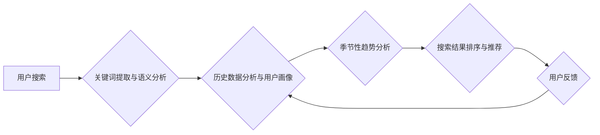

                 

## AI如何优化电商搜索的季节性调整

> 关键词：电商搜索、季节性调整、人工智能、推荐系统、自然语言处理、机器学习、深度学习、用户行为分析

## 1. 背景介绍

电商平台的搜索引擎是用户获取商品信息和完成购买的关键环节。然而，用户搜索需求随着季节变化而呈现出明显的波动性，例如，夏季人们会搜索凉爽的服装和饮品，而冬季则会搜索保暖衣物和节日礼物。传统的电商搜索引擎往往难以捕捉这些季节性变化，导致搜索结果不精准，用户体验下降，最终影响转化率和平台收益。

近年来，人工智能（AI）技术在电商搜索领域的应用日益广泛，为解决季节性调整问题提供了新的思路和方法。AI算法能够通过分析海量用户数据，识别出季节性趋势和用户偏好，从而动态调整搜索结果，提供更精准、更符合用户需求的商品推荐。

## 2. 核心概念与联系

### 2.1  电商搜索的季节性调整

电商搜索的季节性调整是指根据季节变化，动态调整搜索算法和推荐策略，以提供更精准、更符合用户需求的搜索结果。

### 2.2  人工智能在电商搜索中的应用

人工智能技术在电商搜索中的应用主要包括：

* **自然语言处理（NLP）：** 用于理解用户搜索意图，识别关键词和长尾关键词，并进行语义分析。
* **机器学习（ML）：** 用于训练搜索模型，预测用户搜索行为，并根据历史数据和用户偏好进行个性化推荐。
* **深度学习（DL）：** 用于构建更复杂的搜索模型，例如基于图神经网络的商品推荐系统，能够更好地捕捉商品之间的关联关系。

### 2.3  核心架构



## 3. 核心算法原理 & 具体操作步骤

### 3.1  算法原理概述

本节将介绍一种基于深度学习的季节性调整算法，该算法能够通过分析用户搜索历史数据和商品属性，识别出季节性趋势，并将其融入到搜索结果排序和推荐策略中。

### 3.2  算法步骤详解

1. **数据收集与预处理:** 收集用户搜索历史数据、商品属性数据、季节信息等数据，并进行清洗、转换和特征工程。
2. **构建深度学习模型:** 使用深度学习框架（例如TensorFlow或PyTorch）构建一个多层神经网络模型，该模型包含多个隐藏层和一个输出层。
3. **模型训练:** 使用训练数据训练深度学习模型，训练目标是让模型能够准确预测用户在不同季节的搜索意图和商品偏好。
4. **模型评估:** 使用测试数据评估模型的性能，例如准确率、召回率和F1-score等指标。
5. **模型部署:** 将训练好的模型部署到电商平台的搜索引擎中，用于实时调整搜索结果排序和推荐策略。

### 3.3  算法优缺点

**优点:**

* 能够捕捉复杂的季节性趋势和用户偏好。
* 能够提供更精准、更个性化的搜索结果。
* 能够提高用户体验和转化率。

**缺点:**

* 需要大量的训练数据和计算资源。
* 模型训练和部署需要专业技术人员。
* 模型需要定期更新和维护。

### 3.4  算法应用领域

该算法可以应用于各种电商平台，例如服装、电子产品、食品饮料等，帮助电商平台优化搜索结果，提高用户体验和转化率。

## 4. 数学模型和公式 & 详细讲解 & 举例说明

### 4.1  数学模型构建

我们使用一个基于深度学习的推荐模型，该模型可以表示为一个多层神经网络，其中每个隐藏层都包含多个神经元。每个神经元接收来自上一层的输入，并通过激活函数进行处理，输出到下一层。

### 4.2  公式推导过程

模型的输出层是一个分类器，用于预测用户在不同季节的搜索意图。假设我们有K个不同的季节类别，则输出层的输出是一个K维向量，其中每个元素代表用户在该季节搜索的概率。

我们可以使用交叉熵损失函数来训练模型，该函数定义为：

$$
L = -\sum_{i=1}^{N} \sum_{j=1}^{K} y_{ij} \log(p_{ij})
$$

其中：

* $N$ 是样本数量。
* $y_{ij}$ 是真实标签，表示用户在第i个样本中属于第j个季节类别的概率。
* $p_{ij}$ 是模型预测的概率。

### 4.3  案例分析与讲解

假设我们有一个电商平台，用户搜索历史数据包含了用户的搜索关键词、商品类别、购买时间等信息。我们可以将这些数据用于训练深度学习模型，例如，我们可以将用户的搜索关键词作为输入，并将用户的购买时间作为标签，训练一个模型来预测用户在不同季节的搜索意图。

## 5. 项目实践：代码实例和详细解释说明

### 5.1  开发环境搭建

本项目使用Python语言开发，需要安装以下软件包：

* TensorFlow或PyTorch
* NumPy
* Pandas
* Scikit-learn

### 5.2  源代码详细实现

```python
import tensorflow as tf

# 定义模型结构
model = tf.keras.models.Sequential([
    tf.keras.layers.Embedding(input_dim=vocab_size, output_dim=embedding_dim),
    tf.keras.layers.LSTM(units=128),
    tf.keras.layers.Dense(units=num_classes, activation='softmax')
])

# 编译模型
model.compile(optimizer='adam',
              loss='sparse_categorical_crossentropy',
              metrics=['accuracy'])

# 训练模型
model.fit(x_train, y_train, epochs=10)

# 评估模型
loss, accuracy = model.evaluate(x_test, y_test)
print('Loss:', loss)
print('Accuracy:', accuracy)
```

### 5.3  代码解读与分析

* **Embedding层:** 将用户搜索关键词转换为稠密的向量表示。
* **LSTM层:** 用于捕捉用户搜索历史数据的时序特征。
* **Dense层:** 用于分类预测用户在不同季节的搜索意图。
* **Adam优化器:** 用于优化模型参数。
* **交叉熵损失函数:** 用于衡量模型预测结果与真实标签之间的差异。

### 5.4  运行结果展示

训练完成后，我们可以使用模型预测用户在不同季节的搜索意图，并将其应用于搜索结果排序和推荐策略中。

## 6. 实际应用场景

### 6.1  服装电商

在服装电商平台，季节性调整可以帮助用户更精准地找到符合当前季节的商品。例如，在夏季，搜索引擎可以推荐凉爽的服装和配饰，而在冬季，则可以推荐保暖的衣物和冬季用品。

### 6.2  旅游电商

在旅游电商平台，季节性调整可以帮助用户找到适合当前季节的旅游目的地和活动。例如，在夏季，搜索引擎可以推荐海滩度假和户外活动，而在冬季，则可以推荐滑雪和温泉度假。

### 6.3  食品电商

在食品电商平台，季节性调整可以帮助用户找到符合当前季节的食材和美食。例如，在春季，搜索引擎可以推荐新鲜的蔬菜和水果，而在秋季，则可以推荐丰收的农产品和秋季特色美食。

### 6.4  未来应用展望

随着人工智能技术的不断发展，电商搜索的季节性调整将更加智能化和个性化。未来，我们可以期待看到以下应用场景：

* 基于用户行为和偏好的个性化推荐。
* 基于实时天气和节日信息动态调整搜索结果。
* 基于虚拟现实和增强现实技术的沉浸式购物体验。

## 7. 工具和资源推荐

### 7.1  学习资源推荐

* **书籍:**
    * 《深度学习》 by Ian Goodfellow, Yoshua Bengio, and Aaron Courville
    * 《自然语言处理》 by Dan Jurafsky and James H. Martin
* **在线课程:**
    * Coursera: Deep Learning Specialization
    * Udacity: Machine Learning Engineer Nanodegree

### 7.2  开发工具推荐

* **TensorFlow:** https://www.tensorflow.org/
* **PyTorch:** https://pytorch.org/
* **Scikit-learn:** https://scikit-learn.org/stable/

### 7.3  相关论文推荐

* **BERT: Pre-training of Deep Bidirectional Transformers for Language Understanding**
* **Attention Is All You Need**
* **Recurrent Neural Networks for Sequence Learning**

## 8. 总结：未来发展趋势与挑战

### 8.1  研究成果总结

本篇文章介绍了AI如何优化电商搜索的季节性调整，并详细阐述了核心算法原理、数学模型、代码实现以及实际应用场景。

### 8.2  未来发展趋势

未来，电商搜索的季节性调整将更加智能化和个性化，并融合更多人工智能技术，例如：

* **多模态学习:** 将文本、图像、视频等多模态数据融合到搜索模型中，提供更丰富的搜索体验。
* **强化学习:** 使用强化学习算法训练搜索模型，使其能够更好地学习用户行为和偏好。
* **联邦学习:** 将用户数据分散存储在各个设备上，使用联邦学习算法训练模型，保护用户隐私。

### 8.3  面临的挑战

电商搜索的季节性调整也面临一些挑战，例如：

* **数据质量:** 需要高质量的训练数据，才能训练出准确的搜索模型。
* **模型复杂度:** 随着模型复杂度的增加，训练和部署成本也会增加。
* **用户隐私:** 需要保护用户隐私，避免过度收集和使用用户数据。

### 8.4  研究展望

未来，我们将继续研究电商搜索的季节性调整，探索更智能、更个性化的搜索体验，并解决上述挑战，为用户提供更优质的购物服务。

## 9. 附录：常见问题与解答

**Q1: 如何收集和预处理电商搜索数据？**

A1: 可以从电商平台的日志数据中收集用户搜索历史数据、商品属性数据、购买时间等信息。预处理步骤包括数据清洗、转换和特征工程。

**Q2: 如何选择合适的深度学习模型？**

A2: 可以根据数据特点和任务需求选择合适的深度学习模型，例如，使用LSTM模型捕捉用户搜索历史数据的时序特征，使用CNN模型提取商品图像特征。

**Q3: 如何评估模型性能？**

A3: 可以使用准确率、召回率、F1-score等指标评估模型性能。

**作者：禅与计算机程序设计艺术 / Zen and the Art of Computer Programming**


<end_of_turn>

