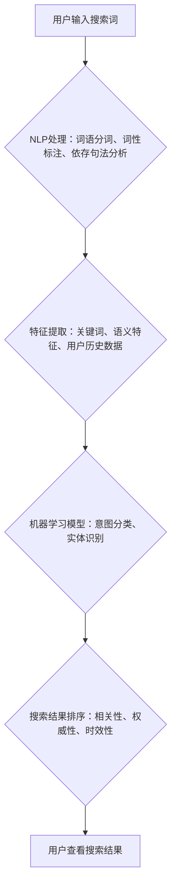

                 

## AI搜索如何理解用户意图，提供更精准服务

> 关键词：AI搜索、用户意图、自然语言处理、机器学习、深度学习、BERT、Transformer、信息检索

## 1. 背景介绍

在信息爆炸的时代，海量数据和信息资源充斥着互联网，用户在搜索引擎中寻找所需信息时，往往面临着信息过载和精准度不足的困境。传统的基于关键词匹配的搜索引擎难以理解用户复杂的搜索意图，往往只能返回与关键词相关的表面信息，无法满足用户对更深入、更精准信息的渴求。

近年来，人工智能（AI）技术的发展为搜索引擎带来了革命性的变革。AI搜索引擎能够通过深度学习和自然语言处理（NLP）技术，更深入地理解用户的搜索意图，并提供更精准、更相关的搜索结果。

## 2. 核心概念与联系

**2.1  用户意图**

用户意图是指用户在进行搜索时，想要获取的具体信息或完成的特定任务。用户意图可以是明确的，也可以是模糊的，甚至包含多个层次的含义。

**2.2  自然语言处理（NLP）**

NLP是人工智能的一个分支，致力于使计算机能够理解、处理和生成人类语言。NLP技术在AI搜索中扮演着至关重要的角色，它可以帮助搜索引擎理解用户的自然语言查询，并将其转换为机器可理解的格式。

**2.3  机器学习（ML）**

机器学习是人工智能的一个重要子领域，它通过算法训练模型，使模型能够从数据中学习并做出预测。在AI搜索中，机器学习算法可以用于训练模型，识别用户意图、理解搜索词语之间的关系，以及预测用户可能感兴趣的搜索结果。

**2.4  深度学习（DL）**

深度学习是机器学习的一个更高级的子领域，它使用多层神经网络来模拟人类大脑的学习过程。深度学习算法在处理复杂文本数据方面表现出色，在AI搜索中被广泛应用于用户意图识别、搜索结果排序等任务。

**2.5  信息检索**

信息检索是指从海量数据中找到满足用户需求的信息的过程。AI搜索引擎将NLP、ML和DL技术与传统的信息检索方法相结合，实现更精准、更智能的信息检索。

**2.6  Mermaid 流程图**



## 3. 核心算法原理 & 具体操作步骤

### 3.1  算法原理概述

AI搜索引擎的核心算法原理是利用深度学习和自然语言处理技术，从用户的搜索词语中提取特征，并将其映射到用户意图的语义空间。通过训练模型，使模型能够学习到用户意图与搜索词语之间的映射关系，从而实现精准的意图识别和搜索结果排序。

### 3.2  算法步骤详解

1. **数据预处理:** 收集用户搜索数据，并进行清洗、格式化和标注，例如词语分词、词性标注、依存句法分析等。
2. **特征提取:** 从预处理后的数据中提取特征，例如关键词、语义特征、用户历史数据等。
3. **模型训练:** 使用深度学习算法，例如BERT、Transformer等，训练模型，学习用户意图与特征之间的映射关系。
4. **意图识别:** 将用户的搜索词语输入到训练好的模型中，模型会输出用户的意图类别。
5. **搜索结果排序:** 根据用户的意图类别，从海量数据中检索出相关结果，并根据相关性、权威性、时效性等因素进行排序。
6. **结果展示:** 将排序后的搜索结果展示给用户。

### 3.3  算法优缺点

**优点:**

* **精准度高:** 深度学习算法能够学习到用户意图的复杂语义关系，提高搜索结果的精准度。
* **适应性强:** 模型可以根据用户的搜索行为进行不断学习和更新，适应用户的个性化需求。
* **功能丰富:** AI搜索引擎可以提供多种功能，例如语音搜索、图像搜索、个性化推荐等。

**缺点:**

* **数据依赖:** 深度学习算法需要大量的训练数据，数据质量直接影响模型的性能。
* **计算资源消耗:** 训练深度学习模型需要大量的计算资源，成本较高。
* **解释性差:** 深度学习模型的决策过程较为复杂，难以解释模型的决策逻辑。

### 3.4  算法应用领域

AI搜索算法广泛应用于各种领域，例如：

* **电商搜索:** 提供更精准的商品推荐，提高用户购物体验。
* **新闻搜索:** 帮助用户快速找到相关新闻信息，了解最新动态。
* **医疗搜索:** 提供专业的医疗信息查询服务，辅助医生诊断和治疗。
* **教育搜索:** 帮助学生查找学习资料，提高学习效率。

## 4. 数学模型和公式 & 详细讲解 & 举例说明

### 4.1  数学模型构建

在AI搜索中，用户意图识别可以看作是一个分类问题，可以使用概率模型来表示用户意图与搜索词语之间的关系。例如，可以使用贝叶斯网络或条件随机场（CRF）模型来构建数学模型。

**贝叶斯网络:**

贝叶斯网络是一种概率图模型，可以表示变量之间的依赖关系。在用户意图识别中，可以将用户搜索词语作为输入变量，用户意图作为输出变量，并根据用户的搜索历史数据、搜索词语的语义特征等信息，构建贝叶斯网络模型。

**条件随机场（CRF）:**

CRF是一种序列标注模型，可以用于识别文本序列中的标签。在用户意图识别中，可以将用户的搜索词语序列作为输入，用户意图序列作为输出，并使用CRF模型学习用户意图与搜索词语之间的关系。

### 4.2  公式推导过程

由于篇幅限制，这里只列举贝叶斯网络中一个简单的公式：

$$P(Y|X) = \frac{P(X|Y)P(Y)}{P(X)}$$

其中：

* $P(Y|X)$ 是给定输入 $X$ 下输出 $Y$ 的概率。
* $P(X|Y)$ 是给定输出 $Y$ 下输入 $X$ 的概率。
* $P(Y)$ 是输出 $Y$ 的先验概率。
* $P(X)$ 是输入 $X$ 的边缘概率。

### 4.3  案例分析与讲解

假设用户搜索了关键词 "购买笔记本电脑"，我们可以使用贝叶斯网络模型来识别用户的意图。

* $X$：用户搜索词语 "购买笔记本电脑"。
* $Y$：用户意图，例如 "购买商品"、"获取信息" 等。

根据用户的搜索历史数据、搜索词语的语义特征等信息，我们可以计算出 $P(X|Y)$、$P(Y)$ 和 $P(X)$ 的值，然后使用公式计算出 $P(Y|X)$，即用户搜索 "购买笔记本电脑" 的意图为 "购买商品" 的概率。

## 5. 项目实践：代码实例和详细解释说明

### 5.1  开发环境搭建

* Python 3.x
* TensorFlow 或 PyTorch 深度学习框架
* NLTK 自然语言处理库
* SpaCy 词法分析库

### 5.2  源代码详细实现

```python
import tensorflow as tf

# 定义模型结构
model = tf.keras.Sequential([
    tf.keras.layers.Embedding(input_dim=vocab_size, output_dim=embedding_dim),
    tf.keras.layers.LSTM(units=128),
    tf.keras.layers.Dense(units=num_classes, activation='softmax')
])

# 编译模型
model.compile(optimizer='adam',
              loss='sparse_categorical_crossentropy',
              metrics=['accuracy'])

# 训练模型
model.fit(x_train, y_train, epochs=10)

# 评估模型
loss, accuracy = model.evaluate(x_test, y_test)
print('Loss:', loss)
print('Accuracy:', accuracy)
```

### 5.3  代码解读与分析

* **Embedding层:** 将词语映射到低维向量空间，捕捉词语之间的语义关系。
* **LSTM层:** 使用长短期记忆网络，学习用户搜索词语序列中的上下文信息。
* **Dense层:** 全连接层，输出用户意图的概率分布。
* **编译模型:** 使用Adam优化器、交叉熵损失函数和准确率作为评估指标。
* **训练模型:** 使用训练数据训练模型，迭代训练 epochs 次。
* **评估模型:** 使用测试数据评估模型的性能，输出损失值和准确率。

### 5.4  运行结果展示

训练完成后，可以将模型应用于新的用户搜索数据，预测用户的意图类别。例如，对于用户搜索 "苹果手机价格"，模型可以预测用户的意图为 "获取商品信息"。

## 6. 实际应用场景

AI搜索引擎已经广泛应用于各种领域，例如：

* **搜索引擎:** Google、百度等搜索引擎已经将AI技术应用于搜索结果排序、用户意图识别等方面，提高搜索结果的精准度和用户体验。
* **电商平台:** 淘宝、京东等电商平台使用AI搜索引擎帮助用户快速找到所需商品，并提供个性化商品推荐。
* **社交媒体:** Facebook、Twitter等社交媒体平台使用AI搜索引擎帮助用户查找相关内容、关注感兴趣的用户。

### 6.4  未来应用展望

随着人工智能技术的不断发展，AI搜索引擎将朝着以下方向发展：

* **更精准的意图识别:** 利用更先进的深度学习算法和语义理解技术，更准确地识别用户的复杂意图。
* **更个性化的搜索体验:** 基于用户的搜索历史、偏好和行为数据，提供更个性化的搜索结果和推荐。
* **多模态搜索:** 支持多种输入方式，例如文本、语音、图像等，实现更全面的信息检索。
* **跨语言搜索:** 支持多种语言的搜索，打破语言障碍，实现全球化的信息共享。

## 7. 工具和资源推荐

### 7.1  学习资源推荐

* **书籍:**
    * 《深度学习》 by Ian Goodfellow, Yoshua Bengio, Aaron Courville
    * 《自然语言处理》 by Dan Jurafsky, James H. Martin
* **在线课程:**
    * Coursera: Natural Language Processing Specialization
    * Udacity: Deep Learning Nanodegree
* **博客和网站:**
    * Google AI Blog
    * OpenAI Blog
    * Towards Data Science

### 7.2  开发工具推荐

* **TensorFlow:** 开源深度学习框架，提供丰富的工具和资源。
* **PyTorch:** 开源深度学习框架，以其灵活性和易用性而闻名。
* **NLTK:** 自然语言处理库，提供各种文本处理工具和算法。
* **SpaCy:** 词法分析库，提供高效的词语分词、命名实体识别等功能。

### 7.3  相关论文推荐

* BERT: Pre-training of Deep Bidirectional Transformers for Language Understanding
* Transformer: Attention Is All You Need
* XLNet: Generalized Autoregressive Pretraining for Language Understanding

## 8. 总结：未来发展趋势与挑战

### 8.1  研究成果总结

AI搜索引擎在用户意图识别、搜索结果排序等方面取得了显著的成果，提高了搜索结果的精准度和用户体验。深度学习算法和自然语言处理技术为AI搜索的发展提供了强大的技术支撑。

### 8.2  未来发展趋势

AI搜索引擎将朝着更精准、更个性化、更智能的方向发展，例如：

* **更深入的语义理解:** 利用更先进的语义理解技术，理解用户的复杂意图和隐含需求。
* **个性化搜索体验:** 基于用户的搜索历史、偏好和行为数据，提供更个性化的搜索结果和推荐。
* **多模态搜索:** 支持多种输入方式，例如文本、语音、图像等，实现更全面的信息检索。
* **跨语言搜索:** 支持多种语言的搜索，打破语言障碍，实现全球化的信息共享。

### 8.3  面临的挑战

AI搜索引擎的发展也面临着一些挑战，例如：

* **数据质量:** 深度学习算法对数据质量要求较高，数据标注和清洗工作量大。
* **模型解释性:** 深度学习模型的决策过程较为复杂，难以解释模型的决策逻辑。
* **公平性与偏见:** AI模型可能存在公平性问题和偏见，需要进行仔细的评估和改进。

### 8.4  研究展望

未来，AI搜索引擎的研究将继续深入，探索更先进的算法、更有效的训练方法和更完善的评估指标，以实现更精准、更智能、更人性化的搜索体验。

## 9. 附录：常见问题与解答

**1. AI搜索引擎与传统搜索引擎有什么区别？**

AI搜索引擎利用深度学习和自然语言处理技术，更深入地理解用户的搜索意图，并提供更精准、更相关的搜索结果。传统搜索引擎主要基于关键词匹配，难以理解用户的复杂意图。

**2. 如何训练一个AI搜索引擎？**

训练一个AI搜索引擎需要大量的用户搜索数据、语义特征和模型参数。可以使用深度学习框架，例如TensorFlow或PyTorch，训练模型，并进行反复迭代和优化。

**3. AI搜索引擎的未来发展趋势是什么？**

AI搜索引擎将朝着更精准、更个性化、更智能的方向发展，例如：更深入的语义理解、个性化搜索体验、多模态搜索和跨语言搜索。

**作者：禅与计算机程序设计艺术 / Zen and the Art of Computer Programming**<end_of_turn>

