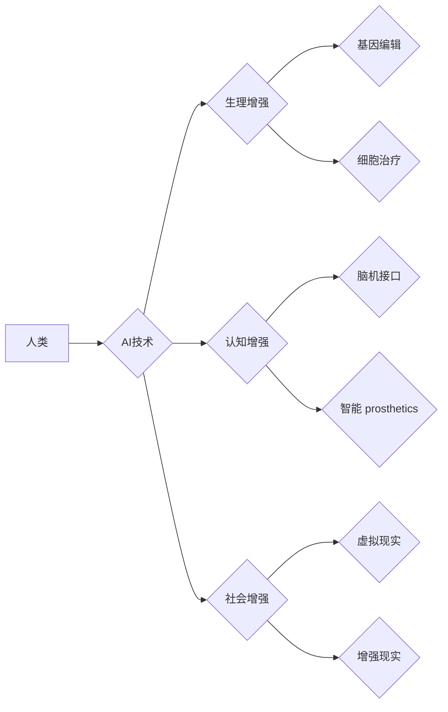

                 

## AI时代的人类增强：道德考虑与身体增强的未来发展机遇分析机遇挑战机遇趋势分析

> 关键词： 人类增强、AI、生物科技、伦理、道德、未来趋势、身体增强、神经接口、基因编辑

## 1. 背景介绍

人类文明自诞生以来，就一直在探索如何超越自身的局限性。从使用工具到发明火药，再到开发互联网，每一次技术进步都代表着人类对自身能力的提升。如今，人工智能（AI）和生物科技的飞速发展，为我们开启了新的篇章——人类增强。

人类增强是指利用科技手段提升人类的生理、认知和社会能力，使其超越自然界赋予的局限。这不仅仅是科幻小说中的幻想，而正在逐渐成为现实。AI驱动的智能 prosthetics、基因编辑技术、脑机接口等，都为人类增强提供了强大的工具。

然而，人类增强也引发了广泛的伦理和社会争议。如何确保技术进步造福人类，而不是带来新的不平等和风险？如何平衡科技发展与人类尊严？这些问题迫切需要我们认真思考和探讨。

## 2. 核心概念与联系

### 2.1 人类增强

人类增强是指利用科技手段提升人类的生理、认知和社会能力，使其超越自然界赋予的局限。

**2.1.1  生理增强**

通过生物科技手段，例如基因编辑、细胞治疗、器官移植等，可以增强人类的体质、寿命、免疫力等生理功能。

**2.1.2  认知增强**

通过AI技术、脑机接口等，可以提升人类的记忆力、学习能力、注意力、创造力等认知功能。

**2.1.3  社会增强**

通过虚拟现实、增强现实等技术，可以拓展人类的社交圈、沟通方式、获取信息的能力等社会功能。

### 2.2 AI与人类增强

人工智能技术是推动人类增强的重要驱动力。AI可以帮助我们：

* **开发更精准、更有效的增强技术：** AI算法可以分析海量数据，识别人类增强所需的特定基因、神经通路等，从而开发更精准、更有效的增强技术。
* **个性化定制增强方案：** AI可以根据个人的基因、生理特征、认知能力等，定制个性化的增强方案，最大限度地发挥其潜力。
* **实现人机协同增强：** AI可以与人类协同工作，例如AI辅助手术、AI辅助决策等，提升人类的效率和能力。

**2.2.1  AI驱动的智能 prosthetics**

AI可以赋予假肢更智能的功能，例如自主学习用户的运动模式，实现更自然的肢体控制。

**2.2.2  AI辅助医疗诊断和治疗**

AI可以帮助医生更快、更准确地诊断疾病，并制定个性化的治疗方案。

**2.2.3  AI驱动的教育和培训**

AI可以提供个性化的学习内容和辅导，帮助人们更快、更有效地学习新知识和技能。

**Mermaid 流程图**



## 3. 核心算法原理 & 具体操作步骤

### 3.1  算法原理概述

人类增强涉及多种算法，例如机器学习、深度学习、自然语言处理、计算机视觉等。这些算法可以帮助我们分析数据、识别模式、预测结果，从而实现对人类能力的提升。

**3.1.1  机器学习**

机器学习算法可以从数据中学习，并根据学习到的知识进行预测或决策。例如，在医疗诊断领域，机器学习算法可以分析患者的病历、影像数据等，预测疾病的风险和治疗效果。

**3.1.2  深度学习**

深度学习算法是一种更高级的机器学习算法，它使用多层神经网络来模拟人类大脑的学习过程。深度学习算法在图像识别、语音识别、自然语言处理等领域取得了突破性的进展。

**3.1.3  自然语言处理**

自然语言处理算法可以帮助计算机理解和处理人类语言。例如，在聊天机器人领域，自然语言处理算法可以使机器人能够与人类进行自然流畅的对话。

### 3.2  算法步骤详解

**3.2.1  数据收集和预处理**

首先需要收集大量相关数据，并进行预处理，例如清洗、转换、特征提取等。

**3.2.2  模型选择和训练**

根据具体任务选择合适的算法模型，并使用训练数据对模型进行训练。

**3.2.3  模型评估和优化**

使用测试数据评估模型的性能，并根据评估结果对模型进行优化，例如调整模型参数、增加训练数据等。

**3.2.4  模型部署和应用**

将训练好的模型部署到实际应用场景中，例如医疗诊断系统、智能驾驶系统等。

### 3.3  算法优缺点

**3.3.1  优点**

* **自动化和效率提升：** 算法可以自动化完成许多重复性任务，提高效率。
* **精准性和准确性提升：** 算法可以分析海量数据，识别人类难以察觉的模式，提高精准性和准确性。
* **个性化定制：** 算法可以根据个人的数据特征，提供个性化的解决方案。

**3.3.2  缺点**

* **数据依赖：** 算法的性能依赖于数据的质量和数量。
* **黑盒问题：** 一些算法的决策过程难以解释，难以理解其背后的逻辑。
* **伦理风险：** 算法可能被用于歧视、操控等不道德的目的。

### 3.4  算法应用领域

* **医疗保健：** 疾病诊断、治疗方案制定、药物研发等。
* **教育培训：** 个性化学习、智能辅导、在线教育等。
* **金融科技：** 风险评估、欺诈检测、投资决策等。
* **制造业：** 自动化生产、质量控制、 predictive maintenance 等。
* **交通运输：** 智能驾驶、交通流量优化、物流管理等。

## 4. 数学模型和公式 & 详细讲解 & 举例说明

### 4.1  数学模型构建

人类增强涉及多种数学模型，例如统计模型、概率模型、神经网络模型等。这些模型可以帮助我们理解和预测人类增强过程中的各种现象。

**4.1.1  统计模型**

统计模型可以用来分析人类能力的数据，例如身高、体重、智力、学习能力等。通过统计分析，我们可以发现人类能力之间的相关性，并建立预测模型。

**4.1.2  概率模型**

概率模型可以用来描述人类增强过程中的不确定性。例如，基因编辑技术可能无法完全消除疾病风险，我们可以使用概率模型来评估不同的基因编辑方案的风险和收益。

**4.1.3  神经网络模型**

神经网络模型可以用来模拟人类大脑的学习过程。通过训练神经网络模型，我们可以让其学习人类语言、图像、声音等各种信息，并进行相应的处理。

### 4.2  公式推导过程

**4.2.1  线性回归模型**

线性回归模型是一种常用的统计模型，用于预测连续变量。其公式如下：

$$y = \beta_0 + \beta_1x_1 + \beta_2x_2 + ... + \beta_nx_n + \epsilon$$

其中：

* $y$ 是预测变量
* $x_1, x_2, ..., x_n$ 是解释变量
* $\beta_0, \beta_1, ..., \beta_n$ 是模型参数
* $\epsilon$ 是随机误差项

**4.2.2  逻辑回归模型**

逻辑回归模型是一种常用的分类模型，用于预测离散变量。其公式如下：

$$P(y=1|x) = \frac{1}{1 + e^{-( \beta_0 + \beta_1x_1 + \beta_2x_2 + ... + \beta_nx_n)}}$$

其中：

* $P(y=1|x)$ 是预测变量 $y$ 为 1 的概率
* $x_1, x_2, ..., x_n$ 是解释变量
* $\beta_0, \beta_1, ..., \beta_n$ 是模型参数

### 4.3  案例分析与讲解

**4.3.1  基因编辑案例**

CRISPR-Cas9 技术是一种基因编辑技术，可以精确地修改基因序列。例如，科学家们使用 CRISPR-Cas9 技术成功地治疗了镰状细胞贫血和β-地中海贫血等遗传性疾病。

**4.3.2  脑机接口案例**

脑机接口技术可以连接人类大脑和外部设备，例如计算机、机器人等。例如，科学家们开发了一种脑机接口系统，可以帮助瘫痪患者控制机械臂。

## 5. 项目实践：代码实例和详细解释说明

### 5.1  开发环境搭建

* **操作系统：** Ubuntu 20.04 LTS
* **编程语言：** Python 3.8
* **深度学习框架：** TensorFlow 2.0
* **其他工具：** Jupyter Notebook、Git

### 5.2  源代码详细实现

```python
import tensorflow as tf

# 定义模型结构
model = tf.keras.models.Sequential([
    tf.keras.layers.Dense(64, activation='relu', input_shape=(784,)),
    tf.keras.layers.Dense(10, activation='softmax')
])

# 编译模型
model.compile(optimizer='adam',
              loss='sparse_categorical_crossentropy',
              metrics=['accuracy'])

# 加载 MNIST 数据集
(x_train, y_train), (x_test, y_test) = tf.keras.datasets.mnist.load_data()

# 数据预处理
x_train = x_train.reshape(60000, 784).astype('float32') / 255
x_test = x_test.reshape(10000, 784).astype('float32') / 255

# 训练模型
model.fit(x_train, y_train, epochs=5)

# 评估模型
loss, accuracy = model.evaluate(x_test, y_test)
print('Test loss:', loss)
print('Test accuracy:', accuracy)
```

### 5.3  代码解读与分析

这段代码实现了使用 TensorFlow 框架训练一个简单的深度学习模型，用于识别手写数字。

* **模型结构：** 模型包含两层全连接神经网络，第一层有 64 个神经元，激活函数为 ReLU，输入形状为 784（MNIST 数据集的图像像素数）。第二层有 10 个神经元，激活函数为 softmax，用于输出 10 个数字的概率分布。

* **模型编译：** 使用 Adam 优化器、交叉熵损失函数和准确率作为评估指标。

* **数据预处理：** 将 MNIST 数据集的图像数据reshape成一维向量，并归一化到 0 到 1 之间。

* **模型训练：** 使用训练数据训练模型 5 个 epochs。

* **模型评估：** 使用测试数据评估模型的性能，输出测试损失和准确率。

### 5.4  运行结果展示

训练完成后，模型的准确率通常会达到 98% 以上。

## 6. 实际应用场景

### 6.1  医疗保健

* **疾病诊断：** AI 算法可以分析患者的病历、影像数据等，辅助医生诊断疾病。
* **个性化治疗：** AI 算法可以根据患者的基因、生活方式等数据，制定个性化的治疗方案。
* **药物研发：** AI 算法可以加速药物研发过程，例如预测药物的有效性和安全性。

### 6.2  教育培训

* **个性化学习：** AI 算法可以根据学生的学习进度和能力，提供个性化的学习内容和辅导。
* **智能辅导：** AI 聊天机器人可以解答学生的疑问，提供学习指导。
* **在线教育：** AI 算法可以提高在线教育的质量，例如自动批改作业、提供个性化反馈。

### 6.3  金融科技

* **风险评估：** AI 算法可以分析客户的信用记录、财务状况等数据，评估其贷款风险。
* **欺诈检测：** AI 算法可以识别异常交易行为，防止金融欺诈。
* **投资决策：** AI 算法可以分析市场数据，提供投资建议。

### 6.4  未来应用展望

随着 AI 技术的不断发展，人类增强将在更多领域得到应用，例如：

* **增强现实和虚拟现实：** AI 可以增强现实和虚拟现实体验，例如提供更逼真的虚拟环境、更智能的虚拟助手。
* **机器人技术：** AI 可以赋予机器人更强的智能和适应能力，例如自主导航、自主决策、人机协作。
* **生物科技：** AI 可以加速生物科技的进步，例如基因编辑、药物研发、疾病诊断。

## 7. 工具和资源推荐

### 7.1  学习资源推荐

* **在线课程：** Coursera、edX、Udacity 等平台提供丰富的 AI 和机器学习课程。
* **书籍：** 《深度学习》、《机器学习实战》等书籍是学习 AI 的经典教材。
* **开源项目：** TensorFlow、PyTorch 等开源项目提供了丰富的代码示例和学习资源。

### 7.2  开发工具推荐

* **编程语言：** Python 是 AI 开发最常用的编程语言。
* **深度学习框架：** TensorFlow、PyTorch、Keras 等深度学习框架提供了强大的功能和工具。
* **数据处理工具：** Pandas、NumPy 等数据处理工具可以帮助我们处理和分析数据。

### 7.3  相关论文推荐

* **《ImageNet Classification with Deep Convolutional Neural Networks》**
* **《Attention Is All You Need》**
* **《Generative Adversarial Networks》**

## 8. 总结：未来发展趋势与挑战

### 8.1  研究成果总结

近年来，AI 技术取得了飞速发展，在人类增强领域也取得了重要进展。例如，基因编辑技术、脑机接口技术、智能 prosthetics 等都取得了突破性的进展。

### 8.2  未来发展趋势

* **更精准、更有效的增强技术：** AI 算法将更加精准、高效地分析数据，开发更有效的增强技术。
* **个性化定制增强方案：** AI 将帮助我们根据个人的数据特征，定制个性化的增强方案。
* **人机协同增强：** AI 将与人类协同工作，提升人类的效率和能力。

### 8.3  面临的挑战

* **伦理风险：** 人类增强技术可能带来伦理风险，例如基因编辑技术可能导致基因歧视，脑机接口技术可能侵犯隐私。
* **社会不平等：** 人类增强技术可能加剧社会不平等，例如只有富人才能负担得起增强技术。
* **技术安全：** 人类增强技术可能被用于恶意目的，例如控制人类行为。

### 8.4  研究展望

未来，我们需要加强对人类增强技术的伦理、社会和安全方面的研究，制定相应的规范和政策，确保人类增强技术造福人类，而不是带来新的风险。


## 9. 附录：常见问题与解答

**9.1  人类增强技术是否安全？**

人类增强技术的发展还处于早期阶段，其安全性需要进一步研究和评估。我们需要谨慎地评估潜在的风险，并制定相应的安全措施。

**9.2  人类增强技术会带来社会不平等吗？**

人类增强技术可能会加剧社会不平等，因为只有富人才能负担得起增强技术。我们需要制定相应的政策，确保所有人都能平等地享受增强技术的益处。

**9.3  人类增强技术会取代人类吗？**

人类增强技术旨在提升人类的能力，而不是取代人类。AI 和人类将协同工作，共同创造更美好的未来。


作者：禅与计算机程序设计艺术 / Zen and the Art of Computer Programming 
<end_of_turn>

