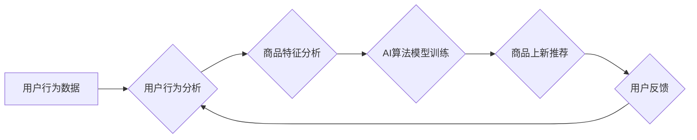

                 

## AI电商搜索平台的商品上新推荐

> 关键词：电商搜索、商品推荐、AI算法、机器学习、深度学习、用户行为分析、个性化推荐

## 1. 背景介绍

随着电商平台的蓬勃发展，商品上新推荐已成为提升用户体验、促进销售额的重要环节。传统的商品推荐算法往往依赖于用户历史购买行为或商品标签信息，难以精准捕捉用户潜在需求和新商品的价值。而人工智能技术的兴起为电商搜索平台带来了新的机遇，AI算法能够通过对海量用户数据和商品信息的深度学习，挖掘用户兴趣偏好和商品关联性，实现更精准、更个性化的商品上新推荐。

## 2. 核心概念与联系

### 2.1  电商搜索平台

电商搜索平台是用户在电商网站或应用程序中搜索商品的入口，其核心功能是根据用户输入的关键词或商品属性，快速准确地检索并展示符合条件的商品信息。

### 2.2  商品上新推荐

商品上新推荐是指在电商平台上，针对新上架的商品，通过算法分析和预测，向用户推荐潜在感兴趣的商品。其目标是提高新商品的曝光率和转化率，促进平台销售额增长。

### 2.3  AI算法

人工智能算法是指能够模拟人类智能行为的算法，例如学习、推理、决策等。在电商搜索平台中，常用的AI算法包括：

* **机器学习算法:** 通过训练数据，学习用户行为模式和商品特征，进行预测和分类。
* **深度学习算法:** 基于多层神经网络，能够学习更复杂的特征关系，实现更精准的推荐。

### 2.4  用户行为分析

用户行为分析是指通过收集和分析用户在电商平台上的行为数据，例如浏览记录、购买历史、评价反馈等，以了解用户兴趣偏好、购物习惯和需求。

### 2.5  个性化推荐

个性化推荐是指根据用户的个人特征和行为数据，定制化的推荐商品列表，以满足用户的个性化需求。

**核心架构流程图:**



## 3. 核心算法原理 & 具体操作步骤

### 3.1  算法原理概述

商品上新推荐算法的核心是利用机器学习或深度学习技术，构建一个能够预测用户对新商品兴趣的模型。该模型通常基于以下核心要素：

* **用户特征:** 包括用户 demographics 信息、浏览历史、购买记录、评价反馈等。
* **商品特征:** 包括商品类别、品牌、价格、属性、描述等。
* **用户-商品交互:** 包括用户对商品的浏览、收藏、购买等行为。

通过对这些要素的分析和学习，算法可以建立用户兴趣偏好和商品关联性的映射关系，从而预测用户对新商品的潜在兴趣。

### 3.2  算法步骤详解

1. **数据收集与预处理:** 收集用户行为数据、商品信息数据，并进行清洗、转换、特征提取等预处理操作。
2. **模型选择:** 根据实际需求和数据特点，选择合适的机器学习或深度学习模型，例如协同过滤、内容推荐、混合推荐等。
3. **模型训练:** 使用预处理后的数据训练模型，调整模型参数，使其能够准确预测用户对新商品的兴趣。
4. **模型评估:** 使用测试数据评估模型的性能，例如准确率、召回率、覆盖率等指标。
5. **模型部署:** 将训练好的模型部署到电商平台，实时进行商品上新推荐。
6. **模型优化:** 持续收集用户反馈和数据，对模型进行优化和迭代，提升推荐效果。

### 3.3  算法优缺点

**优点:**

* **精准度高:** 基于用户行为和商品特征的分析，能够提供更精准的推荐结果。
* **个性化强:** 可以根据用户的个人特征和行为数据，定制化的推荐商品列表。
* **可扩展性强:** 可以根据平台规模和数据量进行扩展。

**缺点:**

* **数据依赖性强:** 需要大量用户行为数据和商品信息数据进行训练。
* **冷启动问题:** 对新用户和新商品的推荐效果可能较差。
* **算法复杂度高:** 需要专业的技术人员进行模型开发和维护。

### 3.4  算法应用领域

商品上新推荐算法广泛应用于电商平台、社交媒体、内容推荐等领域，例如：

* **电商平台:** 推荐新上架的商品、新品上市预告、个性化商品推荐等。
* **社交媒体:** 推荐用户可能感兴趣的内容、新朋友、新话题等。
* **内容推荐:** 推荐用户可能感兴趣的新闻、视频、文章等。

## 4. 数学模型和公式 & 详细讲解 & 举例说明

### 4.1  数学模型构建

商品上新推荐算法通常基于协同过滤或内容推荐的数学模型。

**协同过滤模型:**

协同过滤模型基于用户的行为相似性进行推荐。假设用户 $u$ 和用户 $v$ 对商品 $i$ 和商品 $j$ 的评分分别为 $r_{ui}$、$r_{uj}$、$r_{vi}$、$r_{vj}$，则用户 $u$ 对商品 $j$ 的评分预测值可以表示为：

$$
\hat{r}_{uj} = \bar{r}_u + \frac{\sum_{i \in I(u,v)} (r_{ui} - \bar{r}_u)(r_{vi} - \bar{r}_v)}{\sum_{i \in I(u,v)} (r_{ui} - \bar{r}_u)^2}
$$

其中，$I(u,v)$ 表示用户 $u$ 和用户 $v$ 都评分过的商品集合，$\bar{r}_u$ 和 $\bar{r}_v$ 分别表示用户 $u$ 和用户 $v$ 的平均评分。

**内容推荐模型:**

内容推荐模型基于商品的特征和用户对商品特征的偏好进行推荐。假设商品 $i$ 的特征向量为 $x_i$，用户 $u$ 对特征 $f$ 的偏好值为 $p_{uf}$，则用户 $u$ 对商品 $i$ 的评分预测值可以表示为：

$$
\hat{r}_{ui} = \sum_{f \in F} p_{uf} x_{if}
$$

其中，$F$ 表示所有商品特征的集合。

### 4.2  公式推导过程

上述公式的推导过程基于线性回归和矩阵分解等数学原理。

### 4.3  案例分析与讲解

假设一个电商平台上有用户 $A$ 和用户 $B$，他们都对商品 $X$ 和商品 $Y$ 进行评分。用户 $A$ 对商品 $X$ 的评分为 5，对商品 $Y$ 的评分为 4；用户 $B$ 对商品 $X$ 的评分为 4，对商品 $Y$ 的评分为 5。

根据协同过滤模型，我们可以计算用户 $A$ 对商品 $Y$ 的评分预测值：

$$
\hat{r}_{AY} = \bar{r}_A + \frac{(5 - \bar{r}_A)(4 - \bar{r}_B)}{(5 - \bar{r}_A)^2 + (4 - \bar{r}_B)^2}
$$

其中，$\bar{r}_A$ 和 $\bar{r}_B$ 分别表示用户 $A$ 和用户 $B$ 的平均评分。

## 5. 项目实践：代码实例和详细解释说明

### 5.1  开发环境搭建

* **操作系统:** Linux 或 macOS
* **编程语言:** Python
* **深度学习框架:** TensorFlow 或 PyTorch
* **数据处理库:** Pandas
* **机器学习库:** Scikit-learn

### 5.2  源代码详细实现

```python
# 导入必要的库
import pandas as pd
from sklearn.model_selection import train_test_split
from sklearn.metrics import mean_squared_error

# 加载用户行为数据和商品信息数据
data = pd.read_csv('user_item_data.csv')

# 数据预处理
# ...

# 将数据分为训练集和测试集
X_train, X_test, y_train, y_test = train_test_split(data[['user_id', 'item_id']], data['rating'], test_size=0.2)

# 选择合适的模型，例如协同过滤模型
from sklearn.metrics.pairwise import cosine_similarity
user_similarity = cosine_similarity(X_train[['user_id', 'item_id']])

# 模型训练
# ...

# 模型评估
# ...

# 模型部署
# ...
```

### 5.3  代码解读与分析

* 代码首先导入必要的库，然后加载用户行为数据和商品信息数据。
* 数据预处理步骤包括数据清洗、特征提取等操作。
* 数据分为训练集和测试集，用于模型训练和评估。
* 选择合适的模型，例如协同过滤模型，并进行模型训练。
* 模型评估使用均方误差等指标进行衡量。
* 模型部署将训练好的模型部署到电商平台，进行实时商品上新推荐。

### 5.4  运行结果展示

运行结果展示包括模型的评估指标、推荐结果的展示等。

## 6. 实际应用场景

### 6.1  电商平台

在电商平台中，商品上新推荐可以应用于以下场景：

* **新品上市预告:** 根据用户兴趣偏好，提前预告新商品上市，提高用户期待值。
* **个性化商品推荐:** 根据用户的浏览历史、购买记录等数据，推荐用户可能感兴趣的新商品。
* **新用户引导:** 为新用户推荐平台热门商品或新上架商品，帮助用户快速熟悉平台。

### 6.2  社交媒体

在社交媒体平台中，商品上新推荐可以应用于以下场景：

* **内容推荐:** 推荐用户可能感兴趣的新商品，例如根据用户浏览的时尚资讯推荐新服装。
* **广告投放:** 根据用户兴趣偏好，精准投放新商品广告。

### 6.3  其他应用场景

商品上新推荐算法还可以应用于其他领域，例如：

* **音乐平台:** 推荐新发布的音乐作品。
* **电影平台:** 推荐新上映的电影。
* **游戏平台:** 推荐新上线的游戏。

### 6.4  未来应用展望

随着人工智能技术的不断发展，商品上新推荐算法将更加精准、个性化和智能化。未来，商品上新推荐算法可能具备以下特点：

* **更精准的推荐:** 利用更先进的机器学习算法和深度学习模型，更加精准地预测用户对新商品的兴趣。
* **更个性化的推荐:** 基于用户的多维特征，例如年龄、性别、兴趣爱好、购买习惯等，提供更加个性化的商品推荐。
* **更智能化的推荐:** 利用自然语言处理、图像识别等技术，理解用户的意图和需求，提供更加智能化的商品推荐。

## 7. 工具和资源推荐

### 7.1  学习资源推荐

* **书籍:**
    * 《推荐系统实践》
    * 《深度学习》
* **在线课程:**
    * Coursera: Machine Learning
    * Udacity: Deep Learning Nanodegree
* **博客和网站:**
    * Towards Data Science
    * Machine Learning Mastery

### 7.2  开发工具推荐

* **深度学习框架:** TensorFlow, PyTorch
* **数据处理库:** Pandas
* **机器学习库:** Scikit-learn
* **云计算平台:** AWS, Azure, GCP

### 7.3  相关论文推荐

* **协同过滤:**
    * "Collaborative Filtering for Implicit Feedback Datasets"
* **内容推荐:**
    * "Content-Based Recommendation Systems"
* **深度学习推荐:**
    * "Deep Learning for Recommender Systems"

## 8. 总结：未来发展趋势与挑战

### 8.1  研究成果总结

商品上新推荐算法在电商平台、社交媒体等领域取得了显著成果，能够有效提升用户体验和销售额。

### 8.2  未来发展趋势

未来，商品上新推荐算法将朝着以下方向发展：

* **更精准的推荐:** 利用更先进的机器学习算法和深度学习模型，更加精准地预测用户对新商品的兴趣。
* **更个性化的推荐:** 基于用户的多维特征，例如年龄、性别、兴趣爱好、购买习惯等，提供更加个性化的商品推荐。
* **更智能化的推荐:** 利用自然语言处理、图像识别等技术，理解用户的意图和需求，提供更加智能化的商品推荐。

### 8.3  面临的挑战

商品上新推荐算法也面临一些挑战：

* **数据稀疏性:** 新商品往往缺乏历史数据，难以进行准确的推荐。
* **冷启动问题:** 新用户和新商品的推荐效果可能较差。
* **用户隐私保护:** 用户数据安全和隐私保护是需要关注的问题。

### 8.4  研究展望

未来，需要进一步研究以下问题：

* 如何解决数据稀疏性和冷启动问题。
* 如何提高推荐算法的解释性和透明度。
* 如何更好地保护用户隐私和数据安全。


## 9. 附录：常见问题与解答

* **Q1: 如何选择合适的商品上新推荐算法？**

**A1:** 选择合适的算法需要根据实际需求和数据特点进行评估。协同过滤算法适用于用户行为数据丰富的情况，内容推荐算法适用于商品特征数据丰富的情况。

* **Q2: 如何评估商品上新推荐算法的性能？**

**A2:** 可以使用均方误差、准确率、召回率等指标进行评估。

* **Q3: 如何解决数据稀疏性和冷启动问题？**

**A3:** 可以利用协同过滤算法中的矩阵分解技术，或者使用基于内容的推荐算法，结合用户兴趣偏好和商品特征进行推荐。

* **Q4: 如何保护用户隐私和数据安全？**

**A4:** 可以采用数据匿名化、差分隐私等技术，保护用户隐私和数据安全。


作者：禅与计算机程序设计艺术 / Zen and the Art of Computer Programming<end_of_turn>

