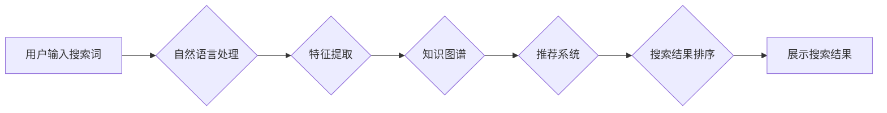

                 

## AI电商搜索平台的融资热潮

> 关键词：电商搜索、人工智能、深度学习、推荐系统、自然语言处理、信息检索、机器学习、商业模式

### 1. 背景介绍

近年来，电商行业蓬勃发展，用户对商品搜索体验的需求日益提高。传统的基于关键词匹配的搜索引擎难以满足用户个性化、多维度的搜索需求。而人工智能（AI）技术的快速发展为电商搜索带来了新的机遇。AI电商搜索平台利用机器学习、深度学习等技术，能够更精准地理解用户意图，提供更个性化、更智能的搜索结果，从而提升用户体验和转化率。

随着AI技术的成熟和应用场景的拓展，AI电商搜索平台已成为投资界的新宠。众多知名投资机构纷纷投入巨资，为AI电商搜索平台的研发和推广提供资金支持。

### 2. 核心概念与联系

#### 2.1  电商搜索平台

电商搜索平台是电商网站的核心功能之一，其主要目的是帮助用户快速找到所需的商品。传统的电商搜索平台主要依靠关键词匹配算法，用户输入的关键词与商品标题、描述等进行匹配，并根据匹配度排序显示结果。

#### 2.2  人工智能（AI）

人工智能是指模拟人类智能行为的计算机系统。AI技术涵盖了机器学习、深度学习、自然语言处理等多个领域。

#### 2.3  深度学习

深度学习是机器学习的一种，它利用多层神经网络来模拟人类大脑的学习过程。深度学习算法能够从海量数据中自动提取特征，并进行复杂的模式识别和预测。

#### 2.4  推荐系统

推荐系统是根据用户的历史行为、偏好等信息，推荐用户可能感兴趣的商品或内容。推荐系统通常利用协同过滤、内容过滤等算法，并结合深度学习技术，实现更精准的推荐。

#### 2.5  自然语言处理（NLP）

自然语言处理是指计算机理解和处理人类语言的技术。NLP技术可以用于分析用户搜索词语的语义，理解用户的真实意图，并提供更相关的搜索结果。

**AI电商搜索平台架构**



### 3. 核心算法原理 & 具体操作步骤

#### 3.1  算法原理概述

AI电商搜索平台的核心算法主要包括：

* **自然语言处理（NLP）算法：** 用于分析用户搜索词语的语义，理解用户的真实意图。
* **特征提取算法：** 用于从商品信息中提取特征，例如商品标题、描述、价格、类别等。
* **推荐系统算法：** 用于根据用户的历史行为、偏好等信息，推荐用户可能感兴趣的商品。
* **搜索结果排序算法：** 用于根据商品的 relevance、popularity、reliability 等因素，对搜索结果进行排序。

#### 3.2  算法步骤详解

1. **用户输入搜索词：** 用户在电商平台的搜索框中输入搜索词语。
2. **自然语言处理（NLP）：** 使用NLP算法对用户输入的搜索词语进行分析，例如词性标注、依存句法分析、语义角色标注等，以理解用户的真实意图。
3. **特征提取：** 从商品信息中提取特征，例如商品标题、描述、价格、类别、品牌、属性等。
4. **知识图谱构建：** 将商品信息、用户行为等数据构建成知识图谱，以便于进行语义推理和知识发现。
5. **推荐系统：** 使用推荐系统算法，根据用户的历史行为、偏好等信息，推荐用户可能感兴趣的商品。
6. **搜索结果排序：** 使用搜索结果排序算法，根据商品的 relevance、popularity、reliability 等因素，对搜索结果进行排序。
7. **展示搜索结果：** 将排序后的搜索结果展示给用户。

#### 3.3  算法优缺点

**优点：**

* **更精准的搜索结果：** AI算法能够更精准地理解用户的搜索意图，提供更相关的搜索结果。
* **更个性化的搜索体验：** 推荐系统能够根据用户的历史行为、偏好等信息，提供更个性化的商品推荐。
* **提升用户转化率：** 更精准的搜索结果和更个性化的推荐，能够提升用户转化率。

**缺点：**

* **算法训练成本高：** AI算法需要大量的训练数据，训练成本较高。
* **算法解释性差：** 一些AI算法的决策过程难以解释，这可能会导致用户对搜索结果的信任度降低。
* **数据隐私问题：** AI电商搜索平台需要收集用户的个人信息，这可能会引发数据隐私问题。

#### 3.4  算法应用领域

AI电商搜索平台的算法应用领域非常广泛，例如：

* **电商搜索：** 帮助用户快速找到所需的商品。
* **商品推荐：** 根据用户的兴趣和偏好，推荐用户可能感兴趣的商品。
* **个性化营销：** 根据用户的行为和特征，进行个性化的营销推广。
* **客户服务：** 利用聊天机器人等技术，提供智能化的客户服务。

### 4. 数学模型和公式 & 详细讲解 & 举例说明

#### 4.1  数学模型构建

AI电商搜索平台的数学模型通常基于信息检索和推荐系统的理论，例如：

* **TF-IDF（Term Frequency-Inverse Document Frequency）：** 用于衡量词语在文档中的重要性。
* **BM25（Best Matching 25）：** 是一种改进的TF-IDF算法，能够更好地处理文档长度和查询词语的权重。
* **协同过滤：** 用于根据用户的历史行为，预测用户可能喜欢的商品。
* **内容过滤：** 用于根据商品的特征，推荐用户可能感兴趣的商品。

#### 4.2  公式推导过程

例如，TF-IDF算法的公式如下：

$$TF-IDF(t, d) = TF(t, d) \times IDF(t)$$

其中：

* $TF(t, d)$ 表示词语 $t$ 在文档 $d$ 中的词频。
* $IDF(t)$ 表示词语 $t$ 在整个语料库中的逆文档频率。

#### 4.3  案例分析与讲解

假设我们有一个电商平台，用户搜索“智能手机”。

* **TF-IDF：** 算法会计算“智能手机”这个词语在商品标题、描述等文本中的词频，以及这个词语在整个平台商品中的逆文档频率。
* **BM25：** 算法会考虑文档长度和查询词语的权重，对“智能手机”这个词语在商品中的匹配度进行更精准的计算。
* **协同过滤：** 算法会分析用户过去购买的智能手机类型，以及其他用户购买的智能手机类型，预测用户可能感兴趣的智能手机型号。
* **内容过滤：** 算法会分析商品的特征，例如品牌、型号、配置等，推荐用户可能感兴趣的智能手机。

### 5. 项目实践：代码实例和详细解释说明

#### 5.1  开发环境搭建

AI电商搜索平台的开发环境通常包括：

* **操作系统：** Linux、Windows、macOS 等。
* **编程语言：** Python、Java、C++ 等。
* **深度学习框架：** TensorFlow、PyTorch、Keras 等。
* **数据库：** MySQL、MongoDB、Elasticsearch 等。

#### 5.2  源代码详细实现

由于篇幅限制，这里只提供一个简单的Python代码示例，用于演示如何使用TF-IDF算法计算商品标题与用户搜索词语的匹配度：

```python
from sklearn.feature_extraction.text import TfidfVectorizer

# 用户搜索词语
query = "智能手机"

# 商品标题列表
product_titles = [
    "小米13 Pro 智能手机",
    "华为P60 Pro 智能手机",
    "苹果iPhone 14 Pro 智能手机",
    "三星Galaxy S23 Ultra 智能手机",
]

# 创建TF-IDF向量化器
vectorizer = TfidfVectorizer()

# 将商品标题转换为TF-IDF向量
product_vectors = vectorizer.fit_transform(product_titles)

# 将用户搜索词语转换为TF-IDF向量
query_vector = vectorizer.transform([query])

# 计算商品标题与用户搜索词语的余弦相似度
cosine_similarities = product_vectors.dot(query_vector.T) / (
    product_vectors.norm(axis=1) * query_vector.norm(axis=1)
)

# 打印商品标题与用户搜索词语的相似度
print(cosine_similarities)
```

#### 5.3  代码解读与分析

* **TfidfVectorizer：** 用于将文本转换为TF-IDF向量。
* **fit_transform：** 将商品标题转换为TF-IDF向量，并学习词典。
* **transform：** 将用户搜索词语转换为TF-IDF向量。
* **dot：** 计算两个向量的点积。
* **norm：** 计算向量的L2范数。
* **cosine_similarities：** 计算商品标题与用户搜索词语的余弦相似度。

#### 5.4  运行结果展示

代码运行后，会输出一个包含商品标题与用户搜索词语余弦相似度的数组。相似度越高，表示商品标题与用户搜索词语越相关。

### 6. 实际应用场景

AI电商搜索平台已在众多电商平台得到广泛应用，例如：

* **淘宝：** 利用AI技术，提供更精准的商品搜索和推荐。
* **京东：** 使用AI算法，提升用户购物体验和转化率。
* **亚马逊：** 采用AI技术，实现个性化商品推荐和智能客服。

#### 6.4  未来应用展望

未来，AI电商搜索平台将朝着以下方向发展：

* **更精准的搜索结果：** 利用更先进的NLP算法和知识图谱技术，更精准地理解用户的搜索意图。
* **更个性化的推荐：** 利用更强大的机器学习算法和用户行为数据，提供更个性化的商品推荐。
* **更智能化的交互：** 利用语音识别、图像识别等技术，实现更智能化的用户交互。
* **更全面的服务：** 提供更全面的服务，例如商品咨询、售后服务等。

### 7. 工具和资源推荐

#### 7.1  学习资源推荐

* **书籍：**
    * 《深度学习》
    * 《机器学习实战》
    * 《自然语言处理入门》
* **在线课程：**
    * Coursera
    * edX
    * Udacity

#### 7.2  开发工具推荐

* **深度学习框架：** TensorFlow、PyTorch、Keras
* **自然语言处理库：** NLTK、spaCy、Gensim
* **数据库：** MySQL、MongoDB、Elasticsearch

#### 7.3  相关论文推荐

* **BERT：** Devlin et al. (2018)
* **GPT-3：** Brown et al. (2020)
* **Transformer：** Vaswani et al. (2017)

### 8. 总结：未来发展趋势与挑战

#### 8.1  研究成果总结

AI电商搜索平台的研究取得了显著成果，例如：

* **搜索结果精度提升：** AI算法能够更精准地理解用户的搜索意图，提升搜索结果的精度。
* **个性化推荐效果提升：** AI算法能够根据用户的历史行为和偏好，提供更个性化的商品推荐。
* **用户体验提升：** AI电商搜索平台能够提供更智能化的交互体验，提升用户购物体验。

#### 8.2  未来发展趋势

未来，AI电商搜索平台将朝着以下方向发展：

* **更精准的搜索结果：** 利用更先进的NLP算法和知识图谱技术，更精准地理解用户的搜索意图。
* **更个性化的推荐：** 利用更强大的机器学习算法和用户行为数据，提供更个性化的商品推荐。
* **更智能化的交互：** 利用语音识别、图像识别等技术，实现更智能化的用户交互。
* **更全面的服务：** 提供更全面的服务，例如商品咨询、售后服务等。

#### 8.3  面临的挑战

AI电商搜索平台的发展也面临着一些挑战：

* **算法训练成本高：** AI算法需要大量的训练数据，训练成本较高。
* **算法解释性差：** 一些AI算法的决策过程难以解释，这可能会导致用户对搜索结果的信任度降低。
* **数据隐私问题：** AI电商搜索平台需要收集用户的个人信息，这可能会引发数据隐私问题。

#### 8.4  研究展望

未来，需要进一步研究以下问题：

* 如何降低AI算法的训练成本？
* 如何提高AI算法的解释性？
* 如何更好地保护用户的个人信息隐私？


### 9. 附录：常见问题与解答

**Q1：AI电商搜索平台与传统电商搜索平台相比有什么优势？**

**A1：** AI电商搜索平台能够更精准地理解用户的搜索意图，提供更相关的搜索结果；能够根据用户的历史行为和偏好，提供更个性化的商品推荐；能够提供更智能化的用户交互体验。

**Q2：AI电商搜索平台的开发成本高吗？**

**A2：** AI电商搜索平台的开发成本确实较高，需要投入大量的资金和人力资源。

**Q3：AI电商搜索平台会取代传统电商搜索平台吗？**

**A3：** AI电商搜索平台将会逐渐取代传统电商搜索平台，但传统电商搜索平台仍然会在一些场景中发挥作用。

**Q4：AI电商搜索平台会侵犯用户的隐私吗？**

**A4：** AI电商搜索平台需要收集用户的个人信息，因此需要采取措施保护用户的隐私。

**Q5：未来AI电商搜索平台的发展趋势是什么？**

**A5：** 未来AI电商搜索平台将朝着更精准、更个性化、更智能化的方向发展。


作者：禅与计算机程序设计艺术 / Zen and the Art of Computer Programming 
<end_of_turn>

