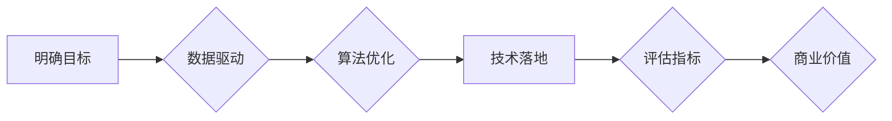

                 

## AI行业的未来：回到商业价值，如何让AI创造长期影响

> 关键词：人工智能、商业价值、可持续发展、算法优化、数据驱动、伦理规范、行业应用、未来趋势

### 1. 背景介绍

人工智能（AI）技术近年来发展迅速，从语音识别、图像识别到自然语言处理，AI已经渗透到我们生活的方方面面。然而，随着AI技术的快速发展，也引发了人们对AI未来发展方向的思考。

当前，许多AI项目缺乏明确的商业价值，过度追求技术突破而忽视实际应用场景，导致AI技术难以真正落地并产生可持续的影响。

为了让AI技术真正造福人类，我们需要回归商业价值，将AI技术与实际问题相结合，创造出具有长期影响力的解决方案。

### 2. 核心概念与联系

**2.1 AI商业价值的本质**

AI商业价值的核心在于通过AI技术解决实际问题，创造新的价值，并实现可持续的盈利模式。

**2.2 AI商业价值的实现路径**

实现AI商业价值需要从以下几个方面入手：

* **明确目标：** 首先要明确AI技术的应用场景和目标，明确AI技术可以解决哪些实际问题，并为企业带来哪些价值。
* **数据驱动：** AI技术依赖于海量数据进行训练和学习，因此需要收集、清洗和分析海量数据，为AI模型提供充足的训练素材。
* **算法优化：** 需要不断优化AI算法，提高算法的准确率、效率和鲁棒性，才能更好地解决实际问题。
* **技术落地：** 将AI技术应用到实际场景中，并与现有业务流程和系统进行整合，才能真正实现AI技术的价值。

**2.3 AI商业价值的评估指标**

评估AI商业价值的指标可以包括：

* **成本效益：** AI技术是否能够降低企业运营成本，提高效率和利润率。
* **市场竞争力：** AI技术是否能够帮助企业获得新的市场份额，提升市场竞争力。
* **客户满意度：** AI技术是否能够提升客户体验，增强客户满意度和忠诚度。

**2.4 AI商业价值的未来趋势**

未来，AI商业价值将更加注重可持续发展，强调AI技术的社会责任和伦理规范。

**Mermaid 流程图**



### 3. 核心算法原理 & 具体操作步骤

**3.1 算法原理概述**

深度学习是AI领域最热门的技术之一，其核心原理是利用多层神经网络模拟人类大脑的学习过程。

深度学习算法能够自动从海量数据中学习特征，并进行复杂的模式识别和预测。

**3.2 算法步骤详解**

深度学习算法的具体操作步骤包括：

1. **数据预处理：** 对原始数据进行清洗、转换和格式化，使其适合深度学习模型的训练。
2. **模型构建：** 根据具体的应用场景，选择合适的深度学习模型架构，并设置模型参数。
3. **模型训练：** 利用训练数据，通过反向传播算法，不断调整模型参数，使模型的预测精度不断提高。
4. **模型评估：** 利用测试数据，评估模型的预测精度和泛化能力。
5. **模型部署：** 将训练好的模型部署到实际应用场景中，用于进行预测和决策。

**3.3 算法优缺点**

**优点：**

* 能够自动学习特征，无需人工特征工程。
* 能够处理海量数据，并进行复杂的模式识别。
* 具有较高的预测精度。

**缺点：**

* 训练数据量要求高，需要大量的计算资源。
* 模型训练时间长，容易陷入局部最优解。
* 模型解释性差，难以理解模型的决策过程。

**3.4 算法应用领域**

深度学习算法广泛应用于以下领域：

* **图像识别：** 人脸识别、物体检测、图像分类。
* **自然语言处理：** 语音识别、机器翻译、文本摘要。
* **推荐系统：** 商品推荐、内容推荐、用户画像。
* **医疗诊断：** 疾病诊断、影像分析、药物研发。
* **金融风险控制：** 欺诈检测、信用评估、风险管理。

### 4. 数学模型和公式 & 详细讲解 & 举例说明

**4.1 数学模型构建**

深度学习模型通常采用多层神经网络结构，每个神经元接收多个输入信号，并通过激活函数进行处理，输出一个信号。

神经网络的权重和偏置参数决定了模型的学习能力。

**4.2 公式推导过程**

深度学习模型的训练过程基于梯度下降算法，通过不断调整模型参数，使模型的损失函数最小化。

损失函数通常采用均方误差或交叉熵损失函数。

梯度下降算法通过计算损失函数对模型参数的梯度，并根据梯度方向更新模型参数。

**4.3 案例分析与讲解**

例如，在图像分类任务中，深度学习模型会将图像输入到神经网络中，经过多层神经网络的处理，最终输出每个类别的概率。

模型的训练目标是使模型输出的概率与真实类别相匹配，从而提高模型的分类精度。

**数学公式**

* 损失函数： $$L(w,b) = \frac{1}{N} \sum_{i=1}^{N} (y_i - \hat{y}_i)^2$$

其中：

* $w$ 和 $b$ 是模型的参数。
* $N$ 是训练样本的数量。
* $y_i$ 是真实类别。
* $\hat{y}_i$ 是模型预测的类别。

* 梯度下降算法： $$w = w - \alpha \frac{\partial L(w,b)}{\partial w}$$

其中：

* $\alpha$ 是学习率。

### 5. 项目实践：代码实例和详细解释说明

**5.1 开发环境搭建**

深度学习项目通常需要使用Python语言和相关的深度学习框架，例如TensorFlow、PyTorch等。

需要安装Python环境、深度学习框架和必要的库。

**5.2 源代码详细实现**

以下是一个简单的图像分类示例代码，使用TensorFlow框架实现：

```python
import tensorflow as tf

# 定义模型结构
model = tf.keras.models.Sequential([
  tf.keras.layers.Conv2D(32, (3, 3), activation='relu', input_shape=(28, 28, 1)),
  tf.keras.layers.MaxPooling2D((2, 2)),
  tf.keras.layers.Conv2D(64, (3, 3), activation='relu'),
  tf.keras.layers.MaxPooling2D((2, 2)),
  tf.keras.layers.Flatten(),
  tf.keras.layers.Dense(10, activation='softmax')
])

# 编译模型
model.compile(optimizer='adam',
              loss='sparse_categorical_crossentropy',
              metrics=['accuracy'])

# 训练模型
model.fit(x_train, y_train, epochs=5)

# 评估模型
loss, accuracy = model.evaluate(x_test, y_test)
print('Test loss:', loss)
print('Test accuracy:', accuracy)
```

**5.3 代码解读与分析**

代码首先定义了一个简单的卷积神经网络模型，包含两层卷积层、两层池化层、一层全连接层和一层输出层。

模型使用Adam优化器、交叉熵损失函数和准确率作为评估指标。

代码然后使用训练数据训练模型，并使用测试数据评估模型的性能。

**5.4 运行结果展示**

训练完成后，可以查看模型的训练损失和准确率曲线，以及测试集上的损失和准确率。

### 6. 实际应用场景

**6.1 医疗诊断**

深度学习算法可以用于分析医学影像，辅助医生进行疾病诊断。

例如，可以利用深度学习算法识别肺癌、乳腺癌等疾病。

**6.2 金融风险控制**

深度学习算法可以用于检测金融欺诈、评估信用风险、预测市场波动等。

例如，可以利用深度学习算法识别信用卡欺诈交易、评估贷款申请人的信用风险。

**6.3 自动驾驶**

深度学习算法可以用于感知周围环境、预测车辆运动轨迹、控制车辆行驶等。

例如，可以利用深度学习算法实现自动驾驶汽车的视觉感知和决策能力。

**6.4 未来应用展望**

未来，深度学习算法将应用于更多领域，例如个性化教育、智能客服、智能制造等。

随着技术的不断发展，深度学习算法将发挥越来越重要的作用，推动社会进步。

### 7. 工具和资源推荐

**7.1 学习资源推荐**

* **书籍：**

* 《深度学习》
* 《动手学深度学习》

* **在线课程：**

* Coursera深度学习课程
* Udacity深度学习工程师课程

**7.2 开发工具推荐**

* **TensorFlow：** 开源深度学习框架，支持多种硬件平台。
* **PyTorch：** 开源深度学习框架，以其灵活性和易用性而闻名。
* **Keras：** 高级深度学习API，可以运行在TensorFlow、Theano等框架上。

**7.3 相关论文推荐**

* 《ImageNet Classification with Deep Convolutional Neural Networks》
* 《Attention Is All You Need》
* 《BERT: Pre-training of Deep Bidirectional Transformers for Language Understanding》

### 8. 总结：未来发展趋势与挑战

**8.1 研究成果总结**

近年来，深度学习算法取得了显著的成果，在图像识别、自然语言处理、语音识别等领域取得了突破性进展。

**8.2 未来发展趋势**

未来，深度学习算法将朝着以下方向发展：

* **模型更强大：** 研究更深、更复杂的深度学习模型，提高模型的学习能力和泛化能力。
* **模型更解释性：** 研究更易于解释的深度学习模型，提高模型的可解释性和可信度。
* **模型更高效：** 研究更轻量级、更高效的深度学习模型，降低模型的计算成本和部署成本。
* **模型更安全：** 研究更安全的深度学习模型，防止模型被攻击和利用。

**8.3 面临的挑战**

深度学习算法也面临着一些挑战：

* **数据获取和标注：** 深度学习算法需要大量的训练数据，获取和标注高质量数据是一个难题。
* **模型训练成本：** 训练深度学习模型需要大量的计算资源，成本较高。
* **模型解释性：** 深度学习模型的决策过程难以理解，缺乏可解释性。
* **模型安全性：** 深度学习模型容易受到攻击，需要提高模型的安全性。

**8.4 研究展望**

未来，我们需要继续探索深度学习算法的潜力，解决其面临的挑战，并将其应用于更多领域，造福人类社会。

### 9. 附录：常见问题与解答

**9.1 什么是深度学习？**

深度学习是一种机器学习的子领域，它使用多层神经网络来模拟人类大脑的学习过程。

**9.2 深度学习算法有哪些？**

常见的深度学习算法包括卷积神经网络（CNN）、循环神经网络（RNN）、生成对抗网络（GAN）等。

**9.3 如何训练深度学习模型？**

训练深度学习模型需要使用训练数据，并通过反向传播算法不断调整模型参数，使模型的预测精度不断提高。

**9.4 深度学习算法有哪些应用场景？**

深度学习算法广泛应用于图像识别、自然语言处理、语音识别、推荐系统、医疗诊断、金融风险控制等领域。


作者：禅与计算机程序设计艺术 / Zen and the Art of Computer Programming 
<end_of_turn>

