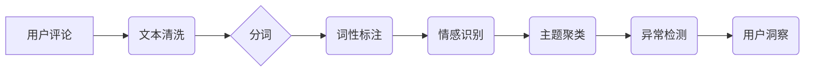

                 

## AI赋能的电商平台用户评论分析

> 关键词：电商平台、用户评论、自然语言处理、情感分析、机器学习、推荐系统、AI赋能

## 1. 背景介绍

在当今数字经济时代，电商平台已成为商品交易的主要渠道之一。用户评论作为电商平台的重要组成部分，对消费者购买决策具有重要影响。用户评论包含了对商品、服务、店铺等方面的真实反馈，蕴含着丰富的商业价值。

传统电商平台的用户评论分析主要依赖人工标注和规则匹配，效率低下，难以处理海量数据。随着人工智能技术的快速发展，特别是自然语言处理（NLP）和机器学习（ML）技术的突破，AI赋能的电商平台用户评论分析成为一种新的趋势。

AI技术能够自动识别用户评论中的情感倾向、主题关键词、潜在问题等信息，为电商平台提供更精准、更全面的用户洞察。

## 2. 核心概念与联系

### 2.1  用户评论分析

用户评论分析是指对用户在电商平台发表的文本评论进行自动处理和分析，以提取其中的有用信息，例如情感倾向、主题关键词、用户需求等。

### 2.2  自然语言处理（NLP）

自然语言处理是人工智能领域的一个重要分支，旨在使计算机能够理解、处理和生成人类语言。NLP技术在用户评论分析中扮演着关键角色，例如文本清洗、分词、词性标注、情感识别等。

### 2.3  机器学习（ML）

机器学习是人工智能领域的一个重要分支，旨在通过算法训练模型，使模型能够从数据中学习规律，并对新数据进行预测或分类。机器学习技术在用户评论分析中应用广泛，例如情感分类、主题聚类、异常检测等。

**核心概念与联系流程图**



## 3. 核心算法原理 & 具体操作步骤

### 3.1  算法原理概述

用户评论分析常用的算法包括：

* **情感分析算法:** 用于识别用户评论的情感倾向，例如正面、负面或中性。常用的算法包括基于规则的方法、机器学习方法和深度学习方法。
* **主题聚类算法:** 用于将用户评论按照主题进行分类，例如商品质量、服务态度、物流速度等。常用的算法包括K-means聚类、层次聚类和LDA主题模型。
* **异常检测算法:** 用于识别异常评论，例如恶意评论、虚假评论和垃圾评论。常用的算法包括基于统计的方法、基于机器学习的方法和基于深度学习的方法。

### 3.2  算法步骤详解

以情感分析算法为例，其具体操作步骤如下：

1. **数据预处理:** 对用户评论进行文本清洗，去除停用词、标点符号等无用信息，并进行分词处理。
2. **特征提取:** 从预处理后的文本中提取情感特征，例如词语、短语、句子结构等。
3. **模型训练:** 使用机器学习算法对情感特征进行训练，建立情感分类模型。
4. **情感预测:** 将新的用户评论输入到训练好的模型中，预测其情感倾向。

### 3.3  算法优缺点

**情感分析算法的优缺点:**

* **优点:** 能够自动识别用户评论的情感倾向，提高分析效率，并提供更精准的分析结果。
* **缺点:** 算法的准确性依赖于训练数据的质量，如果训练数据不充分或存在偏差，则可能会导致分析结果不准确。

### 3.4  算法应用领域

用户评论分析算法广泛应用于以下领域：

* **电商平台:** 分析用户对商品、服务、店铺的评价，改进产品设计、优化服务体验、提升用户满意度。
* **社交媒体:** 分析用户对品牌、事件、话题的评价，了解用户情绪和舆情趋势，进行品牌营销和危机公关。
* **市场调研:** 分析用户对产品、服务、行业趋势的评价，获取市场洞察，指导产品开发和市场策略。

## 4. 数学模型和公式 & 详细讲解 & 举例说明

### 4.1  数学模型构建

情感分析算法通常使用分类模型，例如逻辑回归、支持向量机（SVM）和深度神经网络（DNN）。这些模型将用户评论映射到不同的情感类别，例如正面、负面或中性。

**逻辑回归模型:**

逻辑回归模型是一种线性分类模型，其输出是一个概率值，表示用户评论属于特定情感类别的概率。

**公式:**

$$
P(y=1|x) = \frac{1}{1 + e^{-(w^T x + b)}}
$$

其中：

* $P(y=1|x)$ 是用户评论属于正向情感类别的概率。
* $x$ 是用户评论的特征向量。
* $w$ 是模型参数向量。
* $b$ 是模型偏置项。

### 4.2  公式推导过程

逻辑回归模型的输出概率值通过sigmoid函数进行转换，将线性模型的输出映射到0到1之间的概率区间。

**sigmoid函数:**

$$
sigmoid(z) = \frac{1}{1 + e^{-z}}
$$

其中：

* $z = w^T x + b$

### 4.3  案例分析与讲解

假设我们有一个用户评论数据集，包含用户评论的文本内容和对应的情感标签（正向、负向或中性）。我们可以使用逻辑回归模型对这些数据进行训练，学习用户评论与情感标签之间的关系。

训练完成后，我们可以将新的用户评论输入到模型中，预测其情感标签。例如，如果一个用户评论的特征向量经过模型计算后，输出概率值为0.8，则可以预测该评论属于正向情感类别。

## 5. 项目实践：代码实例和详细解释说明

### 5.1  开发环境搭建

用户评论分析项目可以使用Python语言进行开发。常用的开发环境包括：

* **Python版本:** 3.6或更高版本
* **IDE:** PyCharm、VS Code等
* **库:** NLTK、spaCy、scikit-learn、TensorFlow等

### 5.2  源代码详细实现

以下是一个使用Python和scikit-learn库实现情感分析的简单代码示例：

```python
from sklearn.feature_extraction.text import TfidfVectorizer
from sklearn.linear_model import LogisticRegression
from sklearn.model_selection import train_test_split

# 用户评论数据
data = [
    ("这款手机拍照效果很棒！", "正向"),
    ("服务态度很差，态度很不好！", "负向"),
    ("价格合理，性价比高！", "正向"),
    ("物流速度太慢了！", "负向"),
]

# 数据预处理
texts = [comment[0] for comment in data]
labels = [comment[1] for comment in data]

# 特征提取
vectorizer = TfidfVectorizer()
features = vectorizer.fit_transform(texts)

# 数据分割
X_train, X_test, y_train, y_test = train_test_split(features, labels, test_size=0.2)

# 模型训练
model = LogisticRegression()
model.fit(X_train, y_train)

# 模型评估
accuracy = model.score(X_test, y_test)
print(f"模型准确率: {accuracy}")

# 新评论预测
new_comment = "这款手机性价比很高！"
new_features = vectorizer.transform([new_comment])
prediction = model.predict(new_features)
print(f"新评论情感预测: {prediction[0]}")
```

### 5.3  代码解读与分析

* **数据预处理:** 将用户评论数据转换为适合模型训练的格式。
* **特征提取:** 使用TF-IDF算法提取用户评论中的关键词特征。
* **数据分割:** 将数据分为训练集和测试集，用于模型训练和评估。
* **模型训练:** 使用逻辑回归模型对训练数据进行训练，学习用户评论与情感标签之间的关系。
* **模型评估:** 使用测试数据评估模型的准确率。
* **新评论预测:** 将新的用户评论输入到训练好的模型中，预测其情感标签。

### 5.4  运行结果展示

运行上述代码后，会输出模型的准确率和对新评论的情感预测结果。

## 6. 实际应用场景

### 6.1  电商平台商品评价分析

电商平台可以利用用户评论分析技术，对商品评价进行自动分析，了解用户对商品的满意度、痛点和需求，从而改进产品设计、优化服务体验。

### 6.2  社交媒体舆情监测

社交媒体平台上用户对品牌、事件、话题的评价信息丰富，可以利用用户评论分析技术进行舆情监测，了解用户情绪和舆情趋势，及时应对危机事件。

### 6.3  市场调研与产品开发

企业可以利用用户评论分析技术，对用户对产品、服务、行业趋势的评价进行分析，获取市场洞察，指导产品开发和市场策略。

### 6.4  未来应用展望

随着人工智能技术的不断发展，用户评论分析技术将更加智能化、个性化和精准化。未来，用户评论分析技术将应用于更广泛的领域，例如：

* **个性化推荐:** 根据用户评论分析用户的喜好，提供更精准的商品推荐。
* **智能客服:** 利用用户评论分析用户问题，提供更智能的客服服务。
* **自动生成产品评论:** 根据产品信息和用户评论数据，自动生成产品评论，提高产品曝光率。

## 7. 工具和资源推荐

### 7.1  学习资源推荐

* **书籍:**
    * 《自然语言处理入门》
    * 《深度学习》
* **在线课程:**
    * Coursera: 自然语言处理
    * edX: 深度学习
* **博客和网站:**
    * NLP Progress
    * Towards Data Science

### 7.2  开发工具推荐

* **Python:** 
    * NLTK: 自然语言处理工具包
    * spaCy: 自然语言处理库
    * scikit-learn: 机器学习库
    * TensorFlow: 深度学习框架
* **IDE:** PyCharm、VS Code

### 7.3  相关论文推荐

* **情感分析:**
    * Pang, B., Lee, L., & Vaithyanathan, S. (2002). Thumbs up? Sentiment classification using machine learning techniques. Proceedings of the ACL-02 conference on Empirical methods in natural language processing-Volume 10, 79-86.
* **主题聚类:**
    * Blei, D. M., Ng, A. Y., & Jordan, M. I. (2003). Latent dirichlet allocation. Journal of machine Learning research, 3(Jan), 993-1022.

## 8. 总结：未来发展趋势与挑战

### 8.1  研究成果总结

AI赋能的电商平台用户评论分析技术取得了显著进展，能够自动识别用户评论的情感倾向、主题关键词、潜在问题等信息，为电商平台提供更精准、更全面的用户洞察。

### 8.2  未来发展趋势

* **更精准的分析:** 利用深度学习技术，提高情感分析、主题聚类和异常检测的准确率。
* **更个性化的分析:** 根据用户的购买历史、浏览记录等信息，提供更个性化的用户评论分析结果。
* **更全面的分析:** 将用户评论与其他数据源，例如商品信息、用户画像等进行融合分析，获取更全面的用户洞察。

### 8.3  面临的挑战

* **数据质量:** 用户评论数据往往存在噪声、不完整等问题，需要进行有效的数据清洗和预处理。
* **模型解释性:** 深度学习模型的内部机制复杂，难以解释模型的决策过程，需要研究更可解释的模型。
* **伦理问题:** 用户评论分析技术可能会涉及用户隐私和数据安全问题，需要制定相应的伦理规范和法律法规。

### 8.4  研究展望

未来，用户评论分析技术将继续朝着更智能化、更个性化、更全面的方向发展，为电商平台提供更强大的数据驱动的决策支持。


## 9. 附录：常见问题与解答

### 9.1  常见问题

* **如何处理用户评论中的情感极性？**

可以使用情感词典、机器学习模型等方法识别用户评论中的情感极性。

* **如何进行主题聚类分析？**

可以使用K-means聚类、层次聚类等算法进行主题聚类分析。

* **如何识别异常评论？**

可以使用基于统计的方法、基于机器学习的方法等识别异常评论。

### 9.2  解答

* **情感极性处理:** 可以使用预训练好的情感词典，将评论中的词语映射到情感标签，例如正向、负向或中性。也可以使用机器学习模型，训练一个情感分类器，对评论进行情感极性识别。
* **主题聚类分析:** 选择合适的聚类算法，根据用户评论的语义相似度进行聚类，将评论归类到不同的主题。
* **异常评论识别:** 可以使用统计方法，例如计算评论的词频分布、情感倾向分布等，识别与正常评论差异较大的评论。也可以使用机器学习模型，训练一个异常检测器，识别异常评论。


作者：禅与计算机程序设计艺术 / Zen and the Art of Computer Programming 
<end_of_turn>

