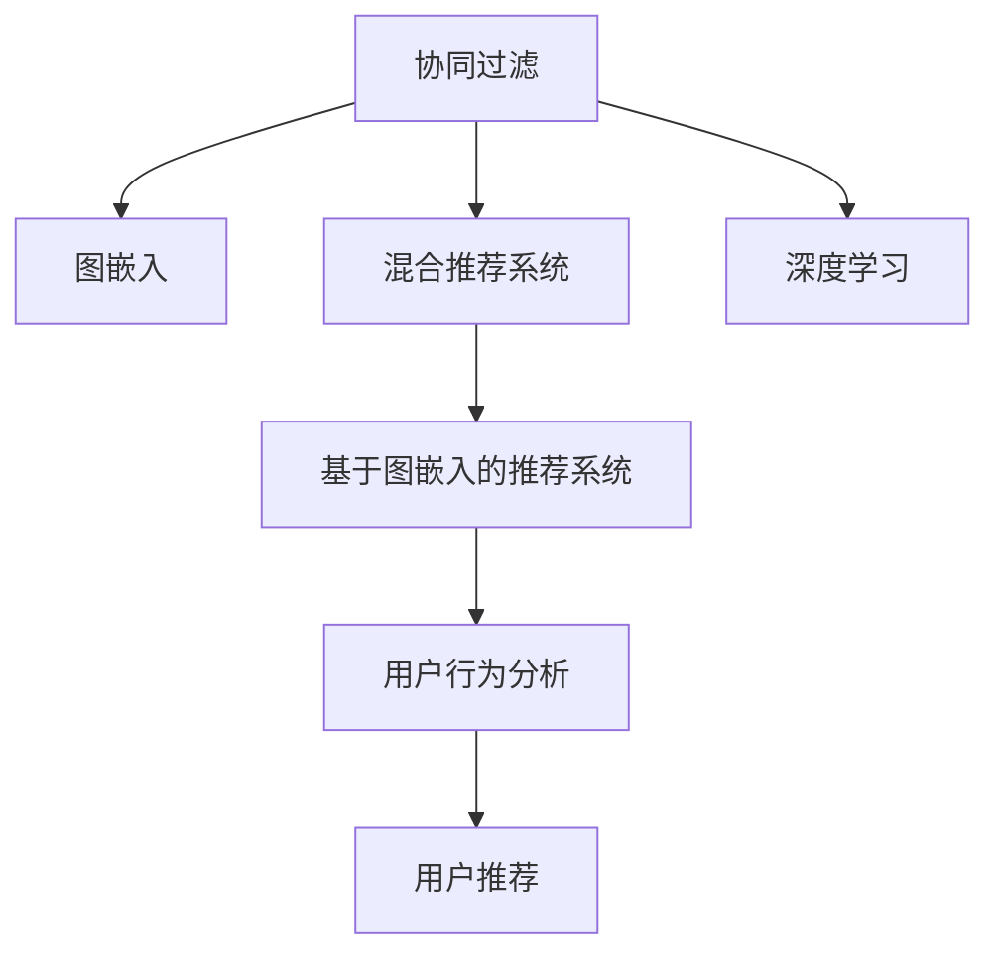

                 

# 基于图嵌入的大规模商品推荐系统

> 关键词：商品推荐系统, 图嵌入, 图神经网络, 深度学习, 协同过滤, 用户行为分析

## 1. 背景介绍

### 1.1 问题由来
随着电子商务的快速发展和用户行为数据的积累，电商平台和零售商越来越多地依赖推荐系统来提高用户满意度、提升销售额和优化库存。传统的协同过滤推荐系统，如基于用户行为的协同过滤(CF)、基于物品相似性的协同过滤(CF)等，在早期应用中取得了不错的效果。但随着数据规模的扩大和用户需求的个性化，传统协同过滤推荐系统面临数据稀疏性、算法复杂度高等问题，逐渐显现出其局限性。

图嵌入（Graph Embedding）技术，作为一种新兴的推荐系统建模方法，近年来在商品推荐领域得到了广泛的应用。其核心思想是将用户、物品等推荐实体之间的关系抽象为图，通过图神经网络（Graph Neural Network, GNN）模型进行建模，融合用户行为数据和图结构信息，构建高精度的推荐模型。基于图嵌入的推荐系统，能够有效处理稀疏用户行为数据、充分利用用户间、物品间的隐性关联，提供更个性化、多样化的商品推荐。

## 2. 核心概念与联系

### 2.1 核心概念概述

为了更好地理解基于图嵌入的推荐系统，本节将介绍几个密切相关的核心概念：

- 协同过滤（Collaborative Filtering, CF）：一种基于用户行为数据的推荐算法，通过分析用户过去的行为数据（如评分、浏览记录等），预测用户对新商品的需求。
- 图嵌入（Graph Embedding）：将复杂网络结构映射为低维向量空间，用于表示节点（如用户、物品）之间的关系特征。
- 图神经网络（Graph Neural Network, GNN）：一种用于处理图结构数据的深度神经网络，通过图卷积操作融合局部和全局信息，学习节点表示。
- 基于图嵌入的推荐系统：将用户、物品等推荐实体及其关系抽象为图，通过图神经网络模型进行建模，构建个性化的推荐系统。
- 混合推荐系统：将多种推荐算法组合使用，以充分发挥各自优势，提升推荐效果。
- 用户行为分析（User Behavior Analysis）：通过数据分析技术，提取用户的行为特征和偏好，用于推荐模型训练。

这些核心概念之间的逻辑关系可以通过以下Mermaid流程图来展示：



这个流程图展示了几类推荐算法之间的关系：

1. 协同过滤算法是推荐系统中最经典的范式，通过用户行为数据进行推荐。
2. 图嵌入技术可以将协同过滤算法处理的结果进行结构化，通过GNN模型进行深度融合。
3. 混合推荐系统是将多种推荐算法组合使用的策略，提升推荐精度。
4. 用户行为分析是对用户数据进行挖掘和分析，提取用户行为特征，用于推荐模型训练。
5. 基于图嵌入的推荐系统是融合用户行为数据和图结构信息，提升推荐效果的重要手段。

这些核心概念共同构成了现代推荐系统的知识框架，使其能够更好地理解和预测用户需求。

## 3. 核心算法原理 & 具体操作步骤
### 3.1 算法原理概述

基于图嵌入的推荐系统，通过图神经网络模型将用户、物品之间的关系图映射为低维向量空间，融合用户行为数据和图结构信息，构建高精度的推荐模型。具体步骤如下：

1. **图构建**：将用户和物品之间的关系抽象为图，每个节点代表一个用户或物品，边表示用户与物品之间的关系（如浏览、购买、评分等）。
2. **特征工程**：提取节点的特征向量（如用户ID、物品ID、用户评分、物品描述等），用于GNN模型的输入。
3. **GNN建模**：通过图卷积神经网络（GCN）等GNN模型，对图结构信息进行建模，学习用户和物品的表示。
4. **融合策略**：将GNN模型得到的节点表示与其他推荐特征（如用户画像、物品属性等）进行融合，构建推荐模型。
5. **推荐算法**：在融合后的推荐模型上进行预测，得到用户对商品的评分或点击概率，从而生成推荐列表。

### 3.2 算法步骤详解

以下以基于GCN的推荐系统为例，介绍详细的算法步骤：

**Step 1: 构建图结构**
- 根据电商平台的实际业务场景，设计用户与物品之间的关系图。用户作为源节点，物品作为目标节点，边表示用户对物品的互动行为。
- 定义节点和边的特征，如用户ID、物品ID、评分、访问次数等。

**Step 2: 特征嵌入**
- 将节点特征进行嵌入，转化为高维特征向量，通常使用独热编码等方式进行处理。
- 对嵌入后的特征进行归一化处理，防止梯度爆炸。

**Step 3: 图卷积神经网络建模**
- 构建GCN模型，设置图卷积层和激活函数，进行局部信息融合。
- 进行多层图卷积操作，提取图结构的全局特征。
- 使用池化层对图卷积结果进行降维处理，提取重要信息。

**Step 4: 特征融合**
- 将GNN模型输出的用户和物品表示与其他特征（如用户画像、物品属性等）进行融合，得到综合推荐特征。
- 通过全连接层或注意力机制对融合特征进行进一步处理，得到推荐得分。

**Step 5: 推荐算法**
- 在推荐得分上使用阈值或排名算法，生成推荐列表。
- 对推荐结果进行反馈学习，更新用户和物品的图表示。

### 3.3 算法优缺点

基于图嵌入的推荐系统具有以下优点：

- **处理稀疏数据**：图嵌入技术能够有效处理用户行为数据的稀疏性，充分利用隐性关联进行推荐。
- **利用全局信息**：GNN模型能够融合局部和全局信息，提高推荐精度。
- **可解释性强**：基于图嵌入的推荐系统能够解释用户推荐结果的生成逻辑，提升系统的可解释性。
- **适应性强**：可以通过调整图结构和节点特征，灵活适应不同的业务场景。

同时，该方法也存在以下局限性：

- **模型复杂度高**：GNN模型结构复杂，需要较大的计算资源和训练时间。
- **数据隐私问题**：图嵌入技术需要处理用户和物品之间的隐性关联，可能涉及用户隐私保护问题。
- **参数调整难度大**：模型中包含大量可调参数，如学习率、图卷积层数、节点特征维数等，参数调优难度大。

尽管存在这些局限性，但基于图嵌入的推荐系统仍是目前推荐领域的前沿技术之一。未来研究的方向包括进一步简化GNN模型结构，优化特征融合方法，提升模型的可解释性和可扩展性。

### 3.4 算法应用领域

基于图嵌入的推荐系统在多个领域得到了广泛应用，包括但不限于：

- 电子商务平台：如淘宝、京东等电商网站，通过推荐系统提高用户满意度、提升销售额和优化库存。
- 视频和音乐平台：如Netflix、Spotify，推荐用户感兴趣的视频和音乐内容。
- 新闻和内容平台：如知乎、Medium，推荐用户感兴趣的新闻和文章。
- 社交网络平台：如Facebook、Twitter，推荐用户感兴趣的内容和好友。
- 智能家居和健康管理：如智能音箱、健康监测设备，推荐用户感兴趣的产品和服务。

除了上述这些经典应用外，图嵌入技术还在金融、教育、旅游等众多领域得到了探索和应用，展现了其广泛的适用性。

## 4. 数学模型和公式 & 详细讲解 & 举例说明

### 4.1 数学模型构建

本节将使用数学语言对基于图嵌入的推荐系统进行更加严格的刻画。

记图结构为 $G=(V,E)$，其中 $V$ 为节点集合，$E$ 为边集合。节点 $v_i$ 的特征表示为 $x_i \in \mathbb{R}^d$，边 $e_{ij}$ 的特征表示为 $a_{ij} \in \mathbb{R}^d$。设节点嵌入矩阵为 $X \in \mathbb{R}^{n \times d}$，其中 $n$ 为节点数。

### 4.2 公式推导过程

假设节点嵌入矩阵 $X$ 初始为随机向量，通过图卷积神经网络（GCN）进行迭代更新，得到节点嵌入矩阵的最终表示 $X^{t+1}=GCN(X^t)$。GCN模型通过图卷积操作对节点嵌入进行局部和全局信息的融合，其更新公式为：

$$
h^{l+1} = \sigma\left(\sum_{j \in \mathcal{N}(i)} \frac{1}{c_{ij}}h^{l}\hat{a}_{ij}\right)
$$

其中，$c_{ij}$ 为归一化因子，确保节点嵌入在每次更新时，只考虑与其直接相连的邻居节点。$\sigma$ 为激活函数，通常使用ReLU。

在实际应用中，GCN模型的输入为节点的嵌入向量，输出为节点的表示，用于推荐模型。设节点 $v_i$ 的表示为 $h_i^{L}$，其中 $L$ 为图卷积层数。将 $h_i^{L}$ 与其他推荐特征 $F_i$ 进行融合，得到最终的推荐得分 $s_i$，其计算公式为：

$$
s_i = W_1 h_i^{L} + W_2 F_i
$$

其中，$W_1$ 和 $W_2$ 为权重矩阵，用于控制不同特征的重要性。

### 4.3 案例分析与讲解

以亚马逊商品推荐系统为例，展示基于图嵌入的推荐系统如何在电商平台上发挥作用。

**Step 1: 图结构构建**
- 将用户和商品之间的关系抽象为图，用户为节点，商品为物品节点。
- 根据用户行为数据（如浏览、购买、评分等）建立边，将用户与商品连接起来。

**Step 2: 特征嵌入**
- 提取用户的特征（如ID、年龄、性别等），将用户嵌入到高维空间。
- 提取商品的特征（如ID、价格、分类等），将商品嵌入到高维空间。
- 对用户和商品的嵌入向量进行归一化处理。

**Step 3: 图卷积神经网络建模**
- 构建GCN模型，设置图卷积层数和激活函数。
- 进行多层图卷积操作，提取用户和商品的表示。
- 使用池化层对图卷积结果进行降维处理，提取重要信息。

**Step 4: 特征融合**
- 将GCN模型输出的用户和商品表示与其他特征（如用户画像、商品属性等）进行融合，得到综合推荐特征。
- 通过全连接层对融合特征进行进一步处理，得到推荐得分。

**Step 5: 推荐算法**
- 在推荐得分上使用阈值或排名算法，生成推荐列表。
- 对推荐结果进行反馈学习，更新用户和商品的图表示。

通过上述步骤，亚马逊商品推荐系统能够在保证用户隐私的同时，提供个性化的商品推荐，提升用户满意度，促进销售额增长。

## 5. 项目实践：代码实例和详细解释说明
### 5.1 开发环境搭建

在进行项目实践前，我们需要准备好开发环境。以下是使用Python进行PyTorch和DGL（Distributed Graph Library）开发的环境配置流程：

1. 安装Anaconda：从官网下载并安装Anaconda，用于创建独立的Python环境。

2. 创建并激活虚拟环境：
```bash
conda create -n graph-env python=3.8 
conda activate graph-env
```

3. 安装PyTorch和DGL：
```bash
pip install torch torchvision torchaudio cudatoolkit=11.1 -c pytorch -c conda-forge
pip install dgl 
```

4. 安装各类工具包：
```bash
pip install numpy pandas scikit-learn matplotlib tqdm jupyter notebook ipython
```

完成上述步骤后，即可在`graph-env`环境中开始项目实践。

### 5.2 源代码详细实现

下面我们以Amazon商品推荐系统为例，给出使用PyTorch和DGL实现基于GCN的推荐系统的代码实现。

首先，定义图结构和节点特征：

```python
import dgl
import torch
import torch.nn as nn
import torch.nn.functional as F

# 构建图结构
graph = dgl.graph(([0, 0, 0, 1, 1, 1, 2, 2, 2, 3, 3, 3], 
                   [1, 2, 3, 0, 1, 2, 0, 1, 2, 0, 1, 2]))

# 定义节点特征
user_feats = torch.randn(4, 64)
item_feats = torch.randn(6, 64)
```

然后，定义GCN模型：

```python
class GNN(nn.Module):
    def __init__(self, in_dim, hidden_dim, out_dim):
        super(GNN, self).__init__()
        self.gcn1 = nn.GCNConv(in_dim, hidden_dim)
        self.gcn2 = nn.GCNConv(hidden_dim, out_dim)
        self.pool = nn.MaxPool(idim=64, kernel_size=4, stride=2)
        
    def forward(self, graph, feats):
        h = self.gcn1(graph, feats)
        h = F.relu(h)
        h = self.gcn2(graph, h)
        h = F.relu(h)
        h = self.pool(graph, h)
        return h
```

接着，定义特征融合层和推荐得分计算：

```python
class FeatureFusion(nn.Module):
    def __init__(self, in_dim, out_dim):
        super(FeatureFusion, self).__init__()
        self.fc = nn.Linear(in_dim, out_dim)
        self.att = nn.Linear(2*out_dim, 1)
        
    def forward(self, h, feats):
        h = self.fc(h)
        feats = feats + h
        score = self.att(feats)
        return score
```

最后，定义推荐算法：

```python
def recommend(graph, feats, num_items):
    gnn = GNN(64, 128, 64)
    fusion = FeatureFusion(128, 32)
    feats = gnn(graph, feats)
    score = fusion(feats, feats)
    scores, inds = score.topk(num_items, largest=True, sorted=True)
    return inds[0].tolist()
```

完整代码示例如下：

```python
import dgl
import torch
import torch.nn as nn
import torch.nn.functional as F

# 构建图结构
graph = dgl.graph(([0, 0, 0, 1, 1, 1, 2, 2, 2, 3, 3, 3], 
                   [1, 2, 3, 0, 1, 2, 0, 1, 2, 0, 1, 2]))

# 定义节点特征
user_feats = torch.randn(4, 64)
item_feats = torch.randn(6, 64)

# 定义GCN模型
class GNN(nn.Module):
    def __init__(self, in_dim, hidden_dim, out_dim):
        super(GNN, self).__init__()
        self.gcn1 = nn.GCNConv(in_dim, hidden_dim)
        self.gcn2 = nn.GCNConv(hidden_dim, out_dim)
        self.pool = nn.MaxPool(idim=64, kernel_size=4, stride=2)
        
    def forward(self, graph, feats):
        h = self.gcn1(graph, feats)
        h = F.relu(h)
        h = self.gcn2(graph, h)
        h = F.relu(h)
        h = self.pool(graph, h)
        return h

# 定义特征融合层
class FeatureFusion(nn.Module):
    def __init__(self, in_dim, out_dim):
        super(FeatureFusion, self).__init__()
        self.fc = nn.Linear(in_dim, out_dim)
        self.att = nn.Linear(2*out_dim, 1)
        
    def forward(self, h, feats):
        h = self.fc(h)
        feats = feats + h
        score = self.att(feats)
        return score

# 定义推荐算法
def recommend(graph, feats, num_items):
    gnn = GNN(64, 128, 64)
    fusion = FeatureFusion(128, 32)
    feats = gnn(graph, feats)
    score = fusion(feats, feats)
    scores, inds = score.topk(num_items, largest=True, sorted=True)
    return inds[0].tolist()

# 测试推荐算法
print(recommend(graph, user_feats, 5))
```

### 5.3 代码解读与分析

让我们再详细解读一下关键代码的实现细节：

**Graph构建**：
- 使用DGL库构建一个简单的用户-商品关系图，每个用户连接3个商品，每个商品连接3个用户。

**GCN模型定义**：
- 定义GCN模型，包含2个GCN层，每个层使用ReLU激活函数，池化层用于降维。
- 在每个GCN层中使用dgl的图卷积操作（`dgl.GCNConv`），将节点嵌入向量与边特征进行卷积操作，得到新的节点表示。

**特征融合层定义**：
- 定义特征融合层，包含一个全连接层和注意力机制，用于融合用户和商品表示。
- 通过线性变换将用户表示和商品表示进行融合，再使用线性变换和Sigmoid函数得到推荐得分。

**推荐算法实现**：
- 定义推荐函数，使用顶k操作获取推荐得分最高的商品，并返回商品ID列表。

这个代码示例展示了基于图嵌入的推荐系统的主要实现流程，包括图构建、GCN模型训练、特征融合和推荐算法。

## 6. 实际应用场景

### 6.1 智能推荐系统

基于图嵌入的推荐系统在智能推荐系统中得到了广泛应用。用户行为数据和物品关系图能够帮助系统更好地理解用户需求，生成更精准的推荐结果。智能推荐系统能够应用于多个场景，如电商网站、视频平台、音乐平台等，为用户提供个性化的推荐服务。

**电子商务平台**：
- 用户通过浏览、购买、评分等行为生成用户行为图，系统根据图结构和用户行为数据，生成商品推荐。
- 通过实时更新图结构和用户行为数据，系统能够快速适应用户需求的变化，提升推荐效果。

**视频平台**：
- 用户观看视频的行为数据构成用户行为图，系统根据图结构和用户行为数据，生成视频推荐。
- 通过分析用户的观看习惯和偏好，系统能够生成个性化视频推荐，提高用户观看体验。

**音乐平台**：
- 用户收听音乐的行为数据构成用户行为图，系统根据图结构和用户行为数据，生成音乐推荐。
- 通过分析用户的听歌习惯和偏好，系统能够生成个性化音乐推荐，提高用户满意度。

### 6.2 医疗推荐系统

医疗推荐系统是图嵌入技术在医疗领域的一个重要应用。通过构建医生-疾病-药物关系图，系统能够帮助医生推荐适合患者的治疗方案。

**医生-疾病关系图**：
- 医生与治疗的疾病构成节点，医生对疾病的治疗效果构成边。
- 根据医生的治疗效果，构建医生-疾病关系图，表示不同医生对不同疾病的治疗效果。

**医生-药物关系图**：
- 医生与使用的药物构成节点，医生对药物的疗效构成边。
- 根据医生的治疗方案，构建医生-药物关系图，表示不同医生对不同药物的使用情况。

**推荐算法**：
- 通过融合医生-疾病图和医生-药物图，系统能够生成个性化治疗方案。
- 根据患者的历史病历数据和当前病情，系统能够推荐最适合的治疗方案。

通过医疗推荐系统，医生能够更好地理解患者的治疗效果，提高诊疗效率和治疗效果。

### 6.3 社交网络推荐

社交网络推荐系统通过构建用户-用户关系图，帮助用户发现潜在的社交关系和兴趣爱好。用户通过互动行为数据构成用户行为图，系统根据图结构和用户行为数据，生成推荐结果。

**用户-用户关系图**：
- 用户与用户之间的互动行为构成节点，用户之间的互动频次构成边。
- 根据用户之间的互动频次，构建用户-用户关系图，表示不同用户之间的互动关系。

**推荐算法**：
- 通过融合用户-用户图和用户行为数据，系统能够生成个性化社交推荐。
- 根据用户的兴趣和行为，系统能够推荐相似的用户和内容，促进社交互动。

通过社交网络推荐系统，用户能够发现潜在的社交关系和兴趣爱好，提高社交互动效率。

## 7. 工具和资源推荐

### 7.1 学习资源推荐

为了帮助开发者系统掌握图嵌入推荐系统的理论基础和实践技巧，这里推荐一些优质的学习资源：

1. 《Graph Neural Networks: A Review of Methods and Applications》：综述了图神经网络的研究进展和应用场景，适合入门学习。
2. 《Graph Representation Learning》课程：斯坦福大学开设的深度学习课程，介绍了图嵌入技术的基本概念和应用实例。
3. 《Graph Neural Networks for Recommendation Systems》书籍：详细介绍了基于图嵌入的推荐系统的理论基础和实践方法，适合深入学习。
4. PyTorch官方文档：PyTorch的深度学习框架，提供了丰富的图嵌入模型和推荐系统实现。
5. DGL官方文档：DGL的分布式图库，提供了完整的图嵌入推荐系统代码实现和应用案例。

通过对这些资源的学习实践，相信你一定能够快速掌握图嵌入推荐系统的精髓，并用于解决实际的推荐问题。

### 7.2 开发工具推荐

高效的开发离不开优秀的工具支持。以下是几款用于图嵌入推荐系统开发的常用工具：

1. PyTorch：基于Python的开源深度学习框架，灵活动态的计算图，适合快速迭代研究。提供了丰富的图嵌入模型和推荐系统实现。
2. TensorFlow：由Google主导开发的开源深度学习框架，生产部署方便，适合大规模工程应用。提供了丰富的图嵌入模型和推荐系统实现。
3. DGL：Distributed Graph Library，是专为分布式图计算设计的深度学习库，提供了丰富的图嵌入模型和推荐系统实现。
4. Weights & Biases：模型训练的实验跟踪工具，可以记录和可视化模型训练过程中的各项指标，方便对比和调优。与主流深度学习框架无缝集成。
5. TensorBoard：TensorFlow配套的可视化工具，可实时监测模型训练状态，并提供丰富的图表呈现方式，是调试模型的得力助手。
6. Amazon SageMaker：AWS提供的机器学习平台，支持图嵌入推荐系统的模型训练和部署。

合理利用这些工具，可以显著提升图嵌入推荐系统的开发效率，加快创新迭代的步伐。

### 7.3 相关论文推荐

图嵌入推荐系统在推荐领域的发展迅速，近年来涌现了大量前沿研究成果。以下是几篇奠基性的相关论文，推荐阅读：

1. Attention-Based Recommender System: Personalized Ranking via RankNet and Pairwise Training（Attention-基于推荐系统）：提出了基于注意力机制的推荐系统，通过注意力机制对用户行为数据进行融合。
2. Collaborative Filtering for Implicit Feedback Datasets（协同过滤）：提出了基于协同过滤的推荐系统，通过用户行为数据进行推荐。
3. Deep Collaborative Filtering using Neural Networks（深度协同过滤）：提出了基于深度神经网络的协同过滤推荐系统，通过神经网络进行推荐。
4. Hierarchical Attention Networks for Dimensionality Reduction in Collaborative Filtering（层次注意力网络）：提出了基于层次注意力网络的协同过滤推荐系统，通过多层注意力机制进行推荐。
5. Contextual Recommendations in the Face of Model Impersonation（上下文推荐）：提出了基于上下文感知的推荐系统，通过上下文信息进行推荐。

这些论文代表了大规模商品推荐系统的研究进展，为基于图嵌入的推荐系统提供了重要的理论基础。

## 8. 总结：未来发展趋势与挑战

### 8.1 总结

本文对基于图嵌入的推荐系统进行了全面系统的介绍。首先阐述了图嵌入技术在推荐系统中的应用背景和意义，明确了图嵌入技术在处理稀疏数据、利用全局信息等方面的独特优势。其次，从原理到实践，详细讲解了图嵌入推荐系统的数学模型和关键步骤，给出了推荐系统开发的完整代码实例。同时，本文还广泛探讨了图嵌入技术在电子商务、医疗、社交网络等诸多领域的应用前景，展示了其广泛的适用性。

通过本文的系统梳理，可以看到，基于图嵌入的推荐系统正在成为推荐系统的重要范式，极大地拓展了推荐模型的应用边界，提高了推荐效果。未来，伴随图嵌入技术的发展和应用，推荐系统必将在更多领域得到应用，为推荐系统的工程实践提供新的技术路径。

### 8.2 未来发展趋势

展望未来，图嵌入推荐系统将呈现以下几个发展趋势：

1. **模型复杂度降低**：随着图嵌入技术的发展，新的模型架构和优化方法将出现，使图嵌入推荐系统的模型复杂度进一步降低，计算效率和可解释性提升。
2. **数据来源多样化**：未来推荐系统将结合更多数据来源，如社交媒体、传感器数据等，构建更全面的推荐模型。
3. **跨领域融合**：推荐系统将与其他人工智能技术，如自然语言处理、计算机视觉等，进行更深入的融合，提升推荐精度和多样性。
4. **实时推荐**：基于图嵌入的推荐系统将支持实时推荐，通过实时更新图结构和用户行为数据，实现个性化推荐。
5. **用户隐私保护**：推荐系统将更加注重用户隐私保护，通过差分隐私等技术，确保数据安全。
6. **多模态融合**：推荐系统将融合多模态数据，如文本、图像、语音等，构建更全面的用户画像。

这些趋势凸显了图嵌入推荐系统的发展前景。这些方向的探索发展，必将进一步提升推荐系统的性能和应用范围，为智能推荐技术带来新的突破。

### 8.3 面临的挑战

尽管图嵌入推荐系统已经取得了显著进展，但在迈向更加智能化、普适化应用的过程中，它仍面临着诸多挑战：

1. **计算资源消耗大**：图嵌入推荐系统需要处理大规模的图结构数据，计算资源消耗较大，需要优化算法和硬件。
2. **数据隐私问题**：图嵌入推荐系统需要处理用户和物品之间的关系数据，可能涉及用户隐私保护问题，需要设计合理的隐私保护机制。
3. **模型可解释性不足**：图嵌入推荐系统中的GNN模型通常缺乏可解释性，难以解释推荐结果的生成逻辑，需要引入可解释性增强方法。
4. **模型参数调优难度大**：图嵌入推荐系统中的模型包含大量可调参数，如GCN层数、节点特征维数等，参数调优难度大。
5. **模型泛化能力弱**：图嵌入推荐系统中的GNN模型可能存在过拟合问题，需要设计合适的正则化技术。
6. **模型鲁棒性不足**：图嵌入推荐系统中的GNN模型在面对异常数据和攻击时，鲁棒性不足，需要引入对抗训练等技术。

尽管存在这些挑战，但图嵌入推荐系统仍是目前推荐领域的前沿技术之一。未来研究的方向包括进一步简化GNN模型结构，优化特征融合方法，提升模型的可解释性和可扩展性。

### 8.4 研究展望

面对图嵌入推荐系统所面临的种种挑战，未来的研究需要在以下几个方面寻求新的突破：

1. **探索新的模型架构**：开发更加高效、可解释性强的图嵌入推荐模型，如层次注意力网络、异构图神经网络等。
2. **优化特征融合方法**：设计更合适的特征融合方法，提升推荐精度和可解释性。
3. **引入对抗训练**：通过对抗训练等技术，提升图嵌入推荐模型的鲁棒性和泛化能力。
4. **优化模型参数调优**：设计高效的模型参数调优方法，减少参数调优的难度和成本。
5. **引入差分隐私**：通过差分隐私等技术，保护用户隐私，确保数据安全。
6. **融合多模态数据**：将文本、图像、语音等多模态数据融合，构建更全面的用户画像。

这些研究方向将引领图嵌入推荐系统的进一步发展，为推荐系统提供更高效、更精准、更安全、更可解释的推荐服务，助力智能推荐技术迈向新的高峰。

## 9. 附录：常见问题与解答

**Q1：图嵌入推荐系统在实际应用中存在哪些问题？**

A: 图嵌入推荐系统在实际应用中存在以下问题：
1. 计算资源消耗大：图嵌入推荐系统需要处理大规模的图结构数据，计算资源消耗较大，需要优化算法和硬件。
2. 数据隐私问题：图嵌入推荐系统需要处理用户和物品之间的关系数据，可能涉及用户隐私保护问题，需要设计合理的隐私保护机制。
3. 模型可解释性不足：图嵌入推荐系统中的GNN模型通常缺乏可解释性，难以解释推荐结果的生成逻辑，需要引入可解释性增强方法。
4. 模型参数调优难度大：图嵌入推荐系统中的模型包含大量可调参数，如GCN层数、节点特征维数等，参数调优难度大。
5. 模型泛化能力弱：图嵌入推荐系统中的GNN模型可能存在过拟合问题，需要设计合适的正则化技术。
6. 模型鲁棒性不足：图嵌入推荐系统中的GNN模型在面对异常数据和攻击时，鲁棒性不足，需要引入对抗训练等技术。

这些问题的存在，需要通过不断的技术改进和实践优化，逐步解决。

**Q2：图嵌入推荐系统的优势和局限性是什么？**

A: 图嵌入推荐系统的优势和局限性如下：
1. 优势：
   - 处理稀疏数据：图嵌入推荐系统能够有效处理用户行为数据的稀疏性，充分利用隐性关联进行推荐。
   - 利用全局信息：GNN模型能够融合局部和全局信息，提高推荐精度。
   - 可解释性强：基于图嵌入的推荐系统能够解释推荐结果的生成逻辑，提升系统的可解释性。
   - 适应性强：可以通过调整图结构和节点特征，灵活适应不同的业务场景。
2. 局限性：
   - 计算资源消耗大：图嵌入推荐系统需要处理大规模的图结构数据，计算资源消耗较大，需要优化算法和硬件。
   - 数据隐私问题：图嵌入推荐系统需要处理用户和物品之间的关系数据，可能涉及用户隐私保护问题，需要设计合理的隐私保护机制。
   - 模型可解释性不足：图嵌入推荐系统中的GNN模型通常缺乏可解释性，难以解释推荐结果的生成逻辑，需要引入可解释性增强方法。
   - 模型参数调优难度大：图嵌入推荐系统中的模型包含大量可调参数，如GCN层数、节点特征维数等，参数调优难度大。
   - 模型泛化能力弱：图嵌入推荐系统中的GNN模型可能存在过拟合问题，需要设计合适的正则化技术。
   - 模型鲁棒性不足：图嵌入推荐系统中的GNN模型在面对异常数据和攻击时，鲁棒性不足，需要引入对抗训练等技术。

这些问题需要通过不断的技术改进和实践优化，逐步解决。

**Q3：图嵌入推荐系统与协同过滤推荐系统有何不同？**

A: 图嵌入推荐系统和协同过滤推荐系统有以下不同点：
1. 数据处理方式：协同过滤推荐系统通过分析用户过去的行为数据（如评分、浏览记录等）进行推荐，而图嵌入推荐系统通过构建用户与物品之间的关系图，进行全局信息的融合。
2. 模型结构：协同过滤推荐系统通常使用矩阵分解、模型训练等方法进行推荐，而图嵌入推荐系统使用图神经网络进行建模。
3. 应用场景：协同过滤推荐系统适用于小规模用户行为数据，而图嵌入推荐系统适用于大规模图结构数据。
4. 可解释性：协同过滤推荐系统通常缺乏可解释性，难以解释推荐结果的生成逻辑，而图嵌入推荐系统中的GNN模型具有一定的可解释性。
5. 处理稀疏数据：协同过滤推荐系统对于数据稀疏性处理效果较好，而图嵌入推荐系统能够更好地处理稀疏数据。

综上所述，图嵌入推荐系统和协同过滤推荐系统各有优劣，应根据具体业务场景和数据特征选择合适的推荐算法。

**Q4：图嵌入推荐系统如何处理数据稀疏性？**

A: 图嵌入推荐系统通过以下方法处理数据稀疏性：
1. 构建用户行为图：将用户与物品之间的关系数据构建成图结构，利用图嵌入技术进行推荐。
2. 图神经网络建模：通过图神经网络模型，融合局部和全局信息，提高推荐精度。
3. 节点特征嵌入：对节点进行高维特征嵌入，充分利用节点的隐性关联信息。
4. 特征融合：将节点嵌入向量与其他推荐特征（如用户画像、物品属性等）进行融合，提升推荐效果。
5. 正则化技术：通过L2正则、Dropout等技术，防止过拟合，提高模型泛化能力。

综上所述，图嵌入推荐系统通过构建图结构、利用图神经网络模型、节点特征嵌入、特征融合和正则化技术，有效处理数据稀疏性，提升推荐效果。

**Q5：图嵌入推荐系统的未来发展方向是什么？**

A: 图嵌入推荐系统的未来发展方向如下：
1. 模型复杂度降低：随着图嵌入技术的发展，新的模型架构和优化方法将出现，使图嵌入推荐系统的模型复杂度进一步降低，计算效率和可解释性提升。
2. 数据来源多样化：未来推荐系统将结合更多数据来源，如社交媒体、传感器数据等，构建更全面的推荐模型。
3. 跨领域融合：推荐系统将与其他人工智能技术，如自然语言处理、计算机视觉等，进行更深入的融合，提升推荐精度和多样性。
4. 实时推荐：基于图嵌入的推荐系统将支持实时推荐，通过实时更新图结构和用户行为数据，实现个性化推荐。
5. 用户隐私保护：推荐系统将更加注重用户隐私保护，通过差分隐私等技术，确保数据安全。
6. 多模态融合：推荐系统将融合多模态数据，如文本、图像、语音等，构建更全面的用户画像。

这些趋势凸显了图嵌入推荐系统的发展前景，为推荐系统的工程实践提供新的技术路径。

---
作者：禅与计算机程序设计艺术 / Zen and the Art of Computer Programming

