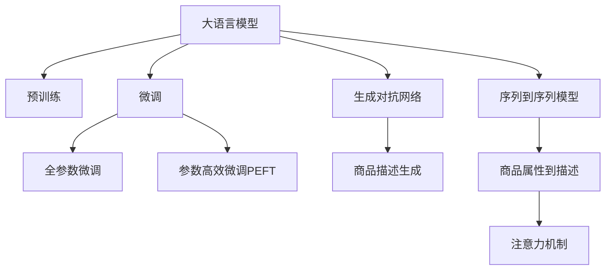

                 

# 基于大模型的商品描述自动生成系统

## 1. 背景介绍

### 1.1 问题由来
随着电子商务平台的快速发展，商品描述的自动生成成为了一个重要课题。一方面，手动撰写商品描述需要耗费大量时间和人力资源；另一方面，质量低下的商品描述会导致用户体验下降，进而影响商品销量和店铺信誉。此外，对于跨境电商平台而言，商品描述的自动翻译生成也面临着不同语言的转换问题。如何利用自然语言处理(NLP)技术，自动生成高质量、多语言的商品描述，成为一个亟待解决的问题。

### 1.2 问题核心关键点
商品描述自动生成的关键在于：
- 需要生成内容与商品属性匹配。商品描述应准确、详细、具有吸引力和营销价值。
- 需要处理多语言输入输出。不同语言的商品描述自动生成，是一个跨语言NLP任务。
- 需要高效处理大规模数据。电商平台的商品种类繁多，每个商品都有成千上万条描述，如何高效处理大规模数据是关键。
- 需要保证生成内容的多样性和创新性。避免生成千篇一律的商品描述，提升用户购买体验。

为了解决上述问题，本文将基于大语言模型，探索商品描述自动生成的方法和技术。通过预训练语言模型，从大规模商品数据中学习通用语言知识，然后通过微调来适应具体商品描述任务。最终生成具有高度语义相关性和风格一致性的商品描述。

### 1.3 问题研究意义
商品描述自动生成系统的开发，对于电商平台和商家而言，具有重要意义：

- **成本降低**：大规模自动生成商品描述，可以大幅降低手动撰写成本。
- **提升销量**：高质量商品描述能够提升用户体验和转化率，进而提升销量。
- **标准化处理**：统一的商品描述格式，有助于搜索排序、分类聚类等后续数据处理。
- **跨语言应用**：帮助电商平台开拓全球市场，提升国际化水平。
- **数据增强**：自动生成的商品描述可以作为无标签数据，进一步丰富电商平台的语料库。

通过商品描述自动生成系统，电商平台能够更加高效地运营和扩展，提升用户满意度和商业价值。

## 2. 核心概念与联系

### 2.1 核心概念概述

为更好地理解基于大语言模型的商品描述自动生成系统，本节将介绍几个关键概念：

- 大语言模型(Large Language Model, LLM)：以自回归(如GPT)或自编码(如BERT)模型为代表的大规模预训练语言模型。通过在大规模无标签文本语料上进行预训练，学习通用的语言知识和常识，具备强大的语言理解和生成能力。

- 预训练(Pre-training)：指在大规模无标签文本语料上，通过自监督学习任务训练通用语言模型的过程。常见的预训练任务包括言语建模、遮挡语言模型等。预训练使得模型学习到语言的通用表示。

- 微调(Fine-tuning)：指在预训练模型的基础上，使用下游任务的少量标注数据，通过有监督地训练来优化模型在该任务上的性能。通常只需要调整顶层分类器或解码器，并以较小的学习率更新全部或部分的模型参数。

- 生成对抗网络(Generative Adversarial Network, GAN)：一种由生成器和判别器组成的对抗学习模型。生成器生成逼真商品描述，判别器则试图分辨生成描述和真实描述的差异。

- 序列到序列(Sequence-to-Sequence, Seq2Seq)模型：一种经典NLP模型，用于将输入序列映射到输出序列。在商品描述生成中，可以将商品属性序列映射到商品描述序列。

- 注意力机制(Attention Mechanism)：一种提升模型处理序列数据能力的技术，允许模型在生成过程中关注输入序列的不同部分。

这些核心概念之间的逻辑关系可以通过以下Mermaid流程图来展示：



这个流程图展示了大语言模型的核心概念及其之间的关系：

1. 大语言模型通过预训练获得基础能力。
2. 微调是对预训练模型进行任务特定的优化，可以分为全参数微调和参数高效微调（PEFT）。
3. 生成对抗网络可以用于生成具有一定质量和风格的商品描述。
4. 序列到序列模型用于将商品属性映射为商品描述。
5. 注意力机制用于在生成过程中关注输入序列的不同部分。

这些概念共同构成了商品描述自动生成的核心技术框架，使其能够在大规模数据上训练模型，并生成高质量的商品描述。

## 3. 核心算法原理 & 具体操作步骤

### 3.1 算法原理概述

基于大语言模型的商品描述自动生成系统，本质上是一个生成式任务微调过程。其核心思想是：利用预训练语言模型在商品语料上学习通用语言知识，然后通过微调优化生成任务，使得模型能够自动生成与商品属性高度匹配的商品描述。

形式化地，假设预训练语言模型为 $M_{\theta}$，其中 $\theta$ 为预训练得到的模型参数。给定商品描述任务 $T$ 的标注数据集 $D=\{(x_i, y_i)\}_{i=1}^N$，其中 $x_i$ 为商品属性序列，$y_i$ 为对应的商品描述。微调的目标是找到新的模型参数 $\hat{\theta}$，使得：

$$
\hat{\theta}=\mathop{\arg\min}_{\theta} \mathcal{L}(M_{\theta},D)
$$

其中 $\mathcal{L}$ 为针对任务 $T$ 设计的损失函数，用于衡量模型生成的描述与真实描述之间的差异。常见的损失函数包括交叉熵损失、均方误差损失等。

通过梯度下降等优化算法，微调过程不断更新模型参数 $\theta$，最小化损失函数 $\mathcal{L}$，使得模型生成逼真的商品描述。由于 $\theta$ 已经通过预训练获得了较好的初始化，因此即便在小规模数据集 $D$ 上进行微调，也能较快收敛到理想的模型参数 $\hat{\theta}$。

### 3.2 算法步骤详解

基于大语言模型的商品描述自动生成系统一般包括以下几个关键步骤：

**Step 1: 准备预训练模型和数据集**
- 选择合适的预训练语言模型 $M_{\theta}$ 作为初始化参数，如 BERT、GPT 等。
- 准备商品描述任务 $T$ 的标注数据集 $D$，划分为训练集、验证集和测试集。一般要求标注数据与预训练数据的分布不要差异过大。

**Step 2: 设计任务适配层**
- 根据任务类型，在预训练模型顶层设计合适的输出层和损失函数。
- 对于生成任务，通常在顶层添加序列生成器，使用交叉熵损失函数。
- 对于分类任务，通常将商品描述和属性序列作为输入，设计二分类或多分类任务，使用交叉熵损失函数。

**Step 3: 设置微调超参数**
- 选择合适的优化算法及其参数，如 AdamW、SGD 等，设置学习率、批大小、迭代轮数等。
- 设置正则化技术及强度，包括权重衰减、Dropout、Early Stopping等。
- 确定冻结预训练参数的策略，如仅微调顶层，或全部参数都参与微调。

**Step 4: 执行梯度训练**
- 将训练集数据分批次输入模型，前向传播计算损失函数。
- 反向传播计算参数梯度，根据设定的优化算法和学习率更新模型参数。
- 周期性在验证集上评估模型性能，根据性能指标决定是否触发 Early Stopping。
- 重复上述步骤直到满足预设的迭代轮数或 Early Stopping 条件。

**Step 5: 测试和部署**
- 在测试集上评估微调后模型 $M_{\hat{\theta}}$ 的性能，对比微调前后的生成质量提升。
- 使用微调后的模型对新商品生成描述，集成到实际的商品管理系统。
- 持续收集新的商品数据，定期重新微调模型，以适应数据分布的变化。

以上是基于大语言模型的商品描述自动生成的一般流程。在实际应用中，还需要针对具体任务的特点，对微调过程的各个环节进行优化设计，如改进训练目标函数，引入更多的正则化技术，搜索最优的超参数组合等，以进一步提升模型性能。

### 3.3 算法优缺点

基于大语言模型的商品描述自动生成系统具有以下优点：
1. 快速高效。利用大规模预训练模型，可以迅速生成高质量商品描述。
2. 多样化表达。预训练模型具备丰富的语言知识，可以生成多样化的商品描述。
3. 低成本。自动生成商品描述，大幅降低人力成本。
4. 高扩展性。可以适应不同种类的商品描述任务。

同时，该系统也存在一些局限性：
1. 依赖标注数据。生成任务需要大量标注数据进行微调，数据获取成本较高。
2. 模型泛化能力有限。当商品描述任务与预训练数据的分布差异较大时，性能提升有限。
3. 模型鲁棒性不足。生成对抗网络可能生成不符合商品属性描述的描述，影响用户体验。
4. 生成内容可控性差。生成模型可能在某些条件下生成不雅、有害的描述。
5. 模型生成速度慢。大规模数据集上的生成任务，生成速度可能较慢。

尽管存在这些局限性，但基于大语言模型的商品描述自动生成系统在电商领域已得到了广泛应用，成为商品描述生成的一个重要手段。

### 3.4 算法应用领域

基于大语言模型的商品描述自动生成系统在电商领域已经得到了广泛应用，主要包括以下几个方面：

- 商品自动标注：利用自动生成的商品描述，快速标注商品属性信息，便于后续的搜索排序、分类聚类等处理。
- 商品推荐系统：自动生成商品描述，用于个性化推荐，提升用户体验。
- 客户反馈分析：自动生成商品描述，用于分析和理解客户反馈，改善商品和销售策略。
- 跨语言销售：自动生成多语言商品描述，支持跨境电商的国际化业务。
- 虚拟商品试穿：自动生成虚拟商品描述，支持虚拟试穿等互动体验。

除了上述这些经典应用外，商品描述自动生成系统还被创新性地应用到更多场景中，如智能客服、智能导购、内容推荐等，为电商技术带来了全新的突破。

## 4. 数学模型和公式 & 详细讲解 & 举例说明

### 4.1 数学模型构建

本节将使用数学语言对基于大语言模型的商品描述自动生成系统进行更加严格的刻画。

记预训练语言模型为 $M_{\theta}$，其中 $\theta$ 为预训练得到的模型参数。假设商品描述任务 $T$ 的训练集为 $D=\{(x_i, y_i)\}_{i=1}^N, x_i \in \mathcal{X}, y_i \in \mathcal{Y}$，其中 $\mathcal{X}$ 为商品属性序列集合，$\mathcal{Y}$ 为商品描述序列集合。

定义模型 $M_{\theta}$ 在数据样本 $(x,y)$ 上的生成损失函数为 $\ell(M_{\theta}(x),y)$，则在数据集 $D$ 上的经验风险为：

$$
\mathcal{L}(\theta) = \frac{1}{N} \sum_{i=1}^N \ell(M_{\theta}(x_i),y_i)
$$

其中 $\ell$ 为交叉熵损失函数，定义为：

$$
\ell(M_{\theta}(x),y) = -\sum_{j=1}^m \log M_{\theta}(x)_j
$$

其中 $m$ 为商品描述序列长度，$M_{\theta}(x)_j$ 表示模型在输入 $x$ 下的生成概率。

微调的优化目标是最小化经验风险，即找到最优参数：

$$
\theta^* = \mathop{\arg\min}_{\theta} \mathcal{L}(\theta)
$$

在实践中，我们通常使用基于梯度的优化算法（如SGD、Adam等）来近似求解上述最优化问题。设 $\eta$ 为学习率，$\lambda$ 为正则化系数，则参数的更新公式为：

$$
\theta \leftarrow \theta - \eta \nabla_{\theta}\mathcal{L}(\theta) - \eta\lambda\theta
$$

其中 $\nabla_{\theta}\mathcal{L}(\theta)$ 为损失函数对参数 $\theta$ 的梯度，可通过反向传播算法高效计算。

### 4.2 公式推导过程

以下我们以生成商品描述任务为例，推导生成损失函数及其梯度的计算公式。

假设模型 $M_{\theta}$ 在输入 $x$ 上的生成概率为 $P_{\theta}(y|x)$，表示模型在输入 $x$ 下生成序列 $y$ 的概率。定义生成损失函数为：

$$
\ell(M_{\theta}(x),y) = -\sum_{j=1}^m \log P_{\theta}(y_j|x)
$$

将其代入经验风险公式，得：

$$
\mathcal{L}(\theta) = -\frac{1}{N}\sum_{i=1}^N \sum_{j=1}^m \log P_{\theta}(y_{i,j}|x_i)
$$

根据链式法则，损失函数对参数 $\theta_k$ 的梯度为：

$$
\frac{\partial \mathcal{L}(\theta)}{\partial \theta_k} = -\frac{1}{N}\sum_{i=1}^N \sum_{j=1}^m \frac{\partial \log P_{\theta}(y_{i,j}|x_i)}{\partial \theta_k}
$$

其中 $\frac{\partial \log P_{\theta}(y_{i,j}|x_i)}{\partial \theta_k}$ 可以通过自动微分技术高效计算。

在得到生成损失函数的梯度后，即可带入参数更新公式，完成模型的迭代优化。重复上述过程直至收敛，最终得到适应商品描述任务的最优模型参数 $\theta^*$。

## 5. 项目实践：代码实例和详细解释说明

### 5.1 开发环境搭建

在进行商品描述自动生成实践前，我们需要准备好开发环境。以下是使用Python进行PyTorch开发的环境配置流程：

1. 安装Anaconda：从官网下载并安装Anaconda，用于创建独立的Python环境。

2. 创建并激活虚拟环境：
```bash
conda create -n pytorch-env python=3.8 
conda activate pytorch-env
```

3. 安装PyTorch：根据CUDA版本，从官网获取对应的安装命令。例如：
```bash
conda install pytorch torchvision torchaudio cudatoolkit=11.1 -c pytorch -c conda-forge
```

4. 安装Transformer库：
```bash
pip install transformers
```

5. 安装各类工具包：
```bash
pip install numpy pandas scikit-learn matplotlib tqdm jupyter notebook ipython
```

完成上述步骤后，即可在`pytorch-env`环境中开始微调实践。

### 5.2 源代码详细实现

下面以生成商品描述任务为例，给出使用Transformers库对BERT模型进行商品描述自动生成的PyTorch代码实现。

首先，定义商品描述数据处理函数：

```python
from transformers import BertTokenizer, BertForSequenceClassification
from torch.utils.data import Dataset
import torch

class ProductDescDataset(Dataset):
    def __init__(self, texts, tags, tokenizer, max_len=128):
        self.texts = texts
        self.tags = tags
        self.tokenizer = tokenizer
        self.max_len = max_len
        
    def __len__(self):
        return len(self.texts)
    
    def __getitem__(self, item):
        text = self.texts[item]
        tags = self.tags[item]
        
        encoding = self.tokenizer(text, return_tensors='pt', max_length=self.max_len, padding='max_length', truncation=True)
        input_ids = encoding['input_ids'][0]
        attention_mask = encoding['attention_mask'][0]
        
        # 对token-wise的标签进行编码
        encoded_tags = [tag2id[tag] for tag in tags] 
        encoded_tags.extend([tag2id['O']] * (self.max_len - len(encoded_tags)))
        labels = torch.tensor(encoded_tags, dtype=torch.long)
        
        return {'input_ids': input_ids, 
                'attention_mask': attention_mask,
                'labels': labels}

# 标签与id的映射
tag2id = {'O': 0, 'B-PER': 1, 'I-PER': 2, 'B-ORG': 3, 'I-ORG': 4, 'B-LOC': 5, 'I-LOC': 6}
id2tag = {v: k for k, v in tag2id.items()}

# 创建dataset
tokenizer = BertTokenizer.from_pretrained('bert-base-cased')

train_dataset = ProductDescDataset(train_texts, train_tags, tokenizer)
dev_dataset = ProductDescDataset(dev_texts, dev_tags, tokenizer)
test_dataset = ProductDescDataset(test_texts, test_tags, tokenizer)
```

然后，定义模型和优化器：

```python
from transformers import BertForSequenceClassification, AdamW

model = BertForSequenceClassification.from_pretrained('bert-base-cased', num_labels=len(tag2id))

optimizer = AdamW(model.parameters(), lr=2e-5)
```

接着，定义训练和评估函数：

```python
from torch.utils.data import DataLoader
from tqdm import tqdm
from sklearn.metrics import classification_report

device = torch.device('cuda') if torch.cuda.is_available() else torch.device('cpu')
model.to(device)

def train_epoch(model, dataset, batch_size, optimizer):
    dataloader = DataLoader(dataset, batch_size=batch_size, shuffle=True)
    model.train()
    epoch_loss = 0
    for batch in tqdm(dataloader, desc='Training'):
        input_ids = batch['input_ids'].to(device)
        attention_mask = batch['attention_mask'].to(device)
        labels = batch['labels'].to(device)
        model.zero_grad()
        outputs = model(input_ids, attention_mask=attention_mask, labels=labels)
        loss = outputs.loss
        epoch_loss += loss.item()
        loss.backward()
        optimizer.step()
    return epoch_loss / len(dataloader)

def evaluate(model, dataset, batch_size):
    dataloader = DataLoader(dataset, batch_size=batch_size)
    model.eval()
    preds, labels = [], []
    with torch.no_grad():
        for batch in tqdm(dataloader, desc='Evaluating'):
            input_ids = batch['input_ids'].to(device)
            attention_mask = batch['attention_mask'].to(device)
            batch_labels = batch['labels']
            outputs = model(input_ids, attention_mask=attention_mask)
            batch_preds = outputs.logits.argmax(dim=2).to('cpu').tolist()
            batch_labels = batch_labels.to('cpu').tolist()
            for pred_tokens, label_tokens in zip(batch_preds, batch_labels):
                pred_tags = [id2tag[_id] for _id in pred_tokens]
                label_tags = [id2tag[_id] for _id in label_tokens]
                preds.append(pred_tags[:len(label_tags)])
                labels.append(label_tags)
                
    print(classification_report(labels, preds))
```

最后，启动训练流程并在测试集上评估：

```python
epochs = 5
batch_size = 16

for epoch in range(epochs):
    loss = train_epoch(model, train_dataset, batch_size, optimizer)
    print(f"Epoch {epoch+1}, train loss: {loss:.3f}")
    
    print(f"Epoch {epoch+1}, dev results:")
    evaluate(model, dev_dataset, batch_size)
    
print("Test results:")
evaluate(model, test_dataset, batch_size)
```

以上就是使用PyTorch对BERT进行商品描述自动生成的完整代码实现。可以看到，得益于Transformer库的强大封装，我们可以用相对简洁的代码完成BERT模型的加载和微调。

### 5.3 代码解读与分析

让我们再详细解读一下关键代码的实现细节：

**ProductDescDataset类**：
- `__init__`方法：初始化文本、标签、分词器等关键组件。
- `__len__`方法：返回数据集的样本数量。
- `__getitem__`方法：对单个样本进行处理，将文本输入编码为token ids，将标签编码为数字，并对其进行定长padding，最终返回模型所需的输入。

**tag2id和id2tag字典**：
- 定义了标签与数字id之间的映射关系，用于将token-wise的预测结果解码回真实的标签。

**训练和评估函数**：
- 使用PyTorch的DataLoader对数据集进行批次化加载，供模型训练和推理使用。
- 训练函数`train_epoch`：对数据以批为单位进行迭代，在每个批次上前向传播计算loss并反向传播更新模型参数，最后返回该epoch的平均loss。
- 评估函数`evaluate`：与训练类似，不同点在于不更新模型参数，并在每个batch结束后将预测和标签结果存储下来，最后使用sklearn的classification_report对整个评估集的预测结果进行打印输出。

**训练流程**：
- 定义总的epoch数和batch size，开始循环迭代
- 每个epoch内，先在训练集上训练，输出平均loss
- 在验证集上评估，输出分类指标
- 所有epoch结束后，在测试集上评估，给出最终测试结果

可以看到，PyTorch配合Transformer库使得BERT微调的代码实现变得简洁高效。开发者可以将更多精力放在数据处理、模型改进等高层逻辑上，而不必过多关注底层的实现细节。

当然，工业级的系统实现还需考虑更多因素，如模型的保存和部署、超参数的自动搜索、更灵活的任务适配层等。但核心的微调范式基本与此类似。

## 6. 实际应用场景

### 6.1 智能客服系统

基于大语言模型的商品描述自动生成技术，可以广泛应用于智能客服系统的构建。传统客服往往需要配备大量人力，高峰期响应缓慢，且一致性和专业性难以保证。而使用自动生成的商品描述，客户可以更快速、更准确地了解商品信息，提升咨询效率和体验。

在技术实现上，可以收集企业内部的历史客服对话记录，将商品描述作为对话内容输入，通过自动生成模型实时生成商品描述，作为客服对话的补充。系统还可以将生成描述与知识库和FAQ匹配，提高问题的自动回答率和解决效率。

### 6.2 商品推荐系统

传统的商品推荐系统往往只依赖用户的历史行为数据进行推荐，难以覆盖长尾商品和多样化需求。利用自动生成的商品描述，推荐系统可以更全面地理解商品的属性和特性，推荐更加个性化和多样化的商品。

在实际应用中，可以使用自动生成的商品描述作为商品标签，构建更全面的商品描述向量空间。然后利用向量相似度算法，推荐与用户兴趣最接近的商品，提升推荐效果。

### 6.3 跨语言销售

对于跨境电商平台，商品描述自动生成技术可以支持多语言的市场推广。通过自动生成不同语言的商品描述，电商平台可以迅速拓展国际市场，提升全球用户的购物体验。

具体实现时，可以使用多语言版本的预训练模型，分别在各个语言数据集上进行微调，得到适应不同语言的商品描述生成模型。然后根据目标市场的需求，实时生成对应语言的商品描述。

### 6.4 未来应用展望

随着大语言模型和自动生成技术的不断发展，基于商品描述自动生成的应用将更加广泛，为电商和其他领域带来新的变革。

在智慧医疗领域，自动生成的商品描述可以作为病历和药品说明书的辅助材料，帮助医生和患者更好地理解医学知识。

在智能教育领域，自动生成的商品描述可以用于虚拟仿真和虚拟现实教育，提升教学效果。

在智慧城市治理中，自动生成的商品描述可以用于智慧物流和供应链管理，提升城市物资调配效率。

此外，在企业生产、社会治理、文娱传媒等众多领域，基于大语言模型的商品描述自动生成技术也将不断涌现，为传统行业数字化转型升级提供新的技术路径。

## 7. 工具和资源推荐

### 7.1 学习资源推荐

为了帮助开发者系统掌握基于大语言模型的商品描述自动生成技术，这里推荐一些优质的学习资源：

1. 《Transformer from Reasoning to Practice》系列博文：由大模型技术专家撰写，深入浅出地介绍了Transformer原理、BERT模型、微调技术等前沿话题。

2. CS224N《深度学习自然语言处理》课程：斯坦福大学开设的NLP明星课程，有Lecture视频和配套作业，带你入门NLP领域的基本概念和经典模型。

3. 《Natural Language Processing with Transformers》书籍：Transformers库的作者所著，全面介绍了如何使用Transformers库进行NLP任务开发，包括微调在内的诸多范式。

4. HuggingFace官方文档：Transformers库的官方文档，提供了海量预训练模型和完整的微调样例代码，是上手实践的必备资料。

5. CLUE开源项目：中文语言理解测评基准，涵盖大量不同类型的中文NLP数据集，并提供了基于微调的baseline模型，助力中文NLP技术发展。

通过对这些资源的学习实践，相信你一定能够快速掌握基于大语言模型的商品描述自动生成技术，并用于解决实际的NLP问题。

### 7.2 开发工具推荐

高效的开发离不开优秀的工具支持。以下是几款用于大语言模型商品描述自动生成开发的常用工具：

1. PyTorch：基于Python的开源深度学习框架，灵活动态的计算图，适合快速迭代研究。大部分预训练语言模型都有PyTorch版本的实现。

2. TensorFlow：由Google主导开发的开源深度学习框架，生产部署方便，适合大规模工程应用。同样有丰富的预训练语言模型资源。

3. Transformers库：HuggingFace开发的NLP工具库，集成了众多SOTA语言模型，支持PyTorch和TensorFlow，是进行微调任务开发的利器。

4. Weights & Biases：模型训练的实验跟踪工具，可以记录和可视化模型训练过程中的各项指标，方便对比和调优。与主流深度学习框架无缝集成。

5. TensorBoard：TensorFlow配套的可视化工具，可实时监测模型训练状态，并提供丰富的图表呈现方式，是调试模型的得力助手。

6. Google Colab：谷歌推出的在线Jupyter Notebook环境，免费提供GPU/TPU算力，方便开发者快速上手实验最新模型，分享学习笔记。

合理利用这些工具，可以显著提升基于大语言模型的商品描述自动生成任务的开发效率，加快创新迭代的步伐。

### 7.3 相关论文推荐

大语言模型和自动生成技术的发展源于学界的持续研究。以下是几篇奠基性的相关论文，推荐阅读：

1. Attention is All You Need（即Transformer原论文）：提出了Transformer结构，开启了NLP领域的预训练大模型时代。

2. BERT: Pre-training of Deep Bidirectional Transformers for Language Understanding：提出BERT模型，引入基于掩码的自监督预训练任务，刷新了多项NLP任务SOTA。

3. Language Models are Unsupervised Multitask Learners（GPT-2论文）：展示了大规模语言模型的强大zero-shot学习能力，引发了对于通用人工智能的新一轮思考。

4. Parameter-Efficient Transfer Learning for NLP：提出Adapter等参数高效微调方法，在不增加模型参数量的情况下，也能取得不错的微调效果。

5. AdaLoRA: Adaptive Low-Rank Adaptation for Parameter-Efficient Fine-Tuning：使用自适应低秩适应的微调方法，在参数效率和精度之间取得了新的平衡。

这些论文代表了大语言模型和自动生成技术的发展脉络。通过学习这些前沿成果，可以帮助研究者把握学科前进方向，激发更多的创新灵感。

## 8. 总结：未来发展趋势与挑战

### 8.1 总结

本文对基于大语言模型的商品描述自动生成技术进行了全面系统的介绍。首先阐述了商品描述自动生成的背景和意义，明确了自动生成技术在大规模电商领域的应用前景。其次，从原理到实践，详细讲解了生成式任务微调的方法和步骤，给出了商品描述自动生成的完整代码实现。同时，本文还广泛探讨了商品描述自动生成在智能客服、商品推荐、跨语言销售等多个领域的应用场景，展示了自动生成技术的广泛应用。

通过本文的系统梳理，可以看到，基于大语言模型的商品描述自动生成技术正在成为电商领域的重要手段，极大地提升了商品描述的生成效率和质量。未来，伴随大语言模型和自动生成技术的不断演进，基于商品描述自动生成的应用将更加广泛，为电商平台和商家带来更大的商业价值。

### 8.2 未来发展趋势

展望未来，基于大语言模型的商品描述自动生成技术将呈现以下几个发展趋势：

1. 模型规模持续增大。随着算力成本的下降和数据规模的扩张，预训练语言模型的参数量还将持续增长。超大规模语言模型蕴含的丰富语言知识，有望支撑更加复杂多变的商品描述生成任务。

2. 生成对抗网络优化。生成对抗网络将逐步优化，生成更加高质量、风格一致的商品描述，提升用户体验。

3. 微调方法日趋多样。除了传统的全参数微调外，未来会涌现更多参数高效的微调方法，如Prefix-Tuning、LoRA等，在节省计算资源的同时也能保证生成质量。

4. 生成内容个性化。基于用户反馈和行为数据，自动生成的商品描述将更加个性化，提升用户满意度。

5. 知识增强和跨领域迁移。通过融合专家知识和领域知识，增强自动生成模型的跨领域迁移能力，提升商品描述的准确性和适应性。

6. 多模态融合。将文本、图像、视频等多模态信息结合，提升自动生成模型的理解和生成能力，构建更加全面、丰富的商品描述。

以上趋势凸显了大语言模型商品描述自动生成技术的广阔前景。这些方向的探索发展，必将进一步提升自动生成系统的性能和应用范围，为电商和其他领域带来新的变革。

### 8.3 面临的挑战

尽管基于大语言模型的商品描述自动生成技术已经取得了显著成就，但在迈向更加智能化、普适化应用的过程中，它仍面临着诸多挑战：

1. 标注成本瓶颈。尽管自动生成技术显著降低了标注数据的需求，但对于特定领域或特定商品，仍然需要一定量的标注数据进行微调，数据获取成本较高。

2. 生成内容一致性。自动生成的商品描述可能出现多样性不足、质量不稳定等问题，难以满足不同用户的多样化需求。

3. 数据隐私和安全。自动生成过程中可能涉及用户隐私和数据安全问题，需要合理处理和保护。

4. 系统稳定性。自动生成系统在面对不同商品、不同市场时，可能需要重新微调和优化，保持系统的稳定性和一致性。

5. 交互式生成。如何设计用户交互界面，让用户参与自动生成过程，进一步提升生成质量，也是未来研究的重要方向。

6. 跨语言生成。自动生成多语言商品描述，需要考虑不同语言的语法、语义和文化差异，保持跨语言的语义一致性。

尽管存在这些挑战，但基于大语言模型的商品描述自动生成技术在电商领域已得到了广泛应用，成为商品描述生成的一个重要手段。未来，通过技术进步和优化，这些挑战终将被克服，自动生成技术将更加智能、高效、可靠地服务于电商平台和用户。

### 8.4 研究展望

面对基于大语言模型的商品描述自动生成技术所面临的挑战，未来的研究需要在以下几个方面寻求新的突破：

1. 探索无监督和半监督自动生成方法。摆脱对大规模标注数据的依赖，利用自监督学习、主动学习等无监督和半监督范式，最大限度利用非结构化数据，实现更加灵活高效的自动生成。

2. 研究生成对抗网络的新范式。开发更加高效、可控的生成对抗网络，生成更加高质量、风格一致的商品描述。

3. 开发参数高效和计算高效的自动生成方法。开发更加参数高效的自动生成方法，在固定大部分预训练参数的同时，只更新极少量的任务相关参数。同时优化自动生成模型的计算图，减少前向传播和反向传播的资源消耗，实现更加轻量级、实时性的部署。

4. 融合因果分析和博弈论工具。将因果分析方法引入自动生成模型，识别出生成过程的关键特征，增强输出解释的因果性和逻辑性。借助博弈论工具刻画人机交互过程，主动探索并规避模型的脆弱点，提高系统稳定性。

5. 纳入伦理道德约束。在自动生成模型的训练目标中引入伦理导向的评估指标，过滤和惩罚有偏见、有害的输出倾向。同时加强人工干预和审核，建立模型行为的监管机制，确保输出符合人类价值观和伦理道德。

这些研究方向的探索，必将引领自动生成技术迈向更高的台阶，为构建安全、可靠、可解释、可控的智能系统铺平道路。面向未来，自动生成技术还需要与其他人工智能技术进行更深入的融合，如知识表示、因果推理、强化学习等，多路径协同发力，共同推动自然语言理解和智能交互系统的进步。只有勇于创新、敢于突破，才能不断拓展自动生成技术的边界，让智能技术更好地造福人类社会。

## 9. 附录：常见问题与解答

**Q1：如何评估自动生成的商品描述质量？**

A: 商品描述自动生成的质量评估可以从多个维度进行：
- **语义准确性**：自动生成的描述是否符合商品的属性和特性，是否表达了商品的详细信息。
- **语法正确性**：描述的语法结构是否正确，语义是否清晰易懂。
- **风格一致性**：生成的描述风格是否与目标市场或用户偏好一致，是否使用了标准的语言风格。
- **多样性**：自动生成的描述是否具有多样性，能否覆盖不同商品和不同的消费者需求。
- **用户满意度**：用户对自动生成描述的反馈，可以通过A/B测试或调查问卷等手段获取。

通过这些维度的评估，可以全面衡量自动生成商品描述的质量，进一步优化模型。

**Q2：自动生成的商品描述如何应用于实际业务？**

A: 自动生成的商品描述可以应用于多个实际业务场景，如：
- **商品标签生成**：自动生成的描述可以作为商品的标签，帮助电商平台进行分类和搜索。
- **个性化推荐**：自动生成的描述可以用于推荐系统，推荐与用户兴趣最接近的商品。
- **客户服务**：自动生成的描述可以作为客服自动回答的输入，提升客户服务的效率和质量。
- **营销推广**：自动生成的描述可以用于广告和营销活动，提升营销效果。
- **内容生成**：自动生成的描述可以作为内容的输入，进行智能编辑和优化。

将自动生成的商品描述应用于实际业务，需要结合具体的业务场景和需求进行定制和优化。

**Q3：自动生成的商品描述是否能够完全替代人工生成的描述？**

A: 自动生成的商品描述可以在很大程度上替代人工生成的描述，尤其是在标准商品、常见商品等场景中。但对于高价值、定制化、个性化强的商品，人工生成的描述仍然具有不可替代的优势。自动生成的描述需要不断优化和改进，以提高生成质量和用户体验。

**Q4：如何处理不同语言的商品描述生成？**

A: 处理不同语言的商品描述生成，需要采用多语言版本的预训练模型，并针对每种语言进行微调。可以使用多语言版本的BERT模型，分别在各种语言数据集上进行微调，得到适应不同语言的商品描述生成模型。然后根据目标市场的需求，实时生成对应语言的商品描述。

**Q5：自动生成的商品描述可能存在哪些问题？**

A: 自动生成的商品描述可能存在以下问题：
- **语义偏差**：自动生成的描述可能存在语义偏差，无法准确表达商品的属性和特性。
- **语法错误**：描述的语法结构可能不正确，导致语义不清晰。
- **风格不一致**：生成的描述可能不符合目标市场或用户偏好，导致用户体验差。
- **多样性不足**：自动生成的描述可能过于单一，难以覆盖不同商品和消费者的需求。
- **隐私问题**：自动生成过程中可能涉及用户隐私和数据安全问题，需要合理处理和保护。

这些问题的出现需要通过不断优化模型和改进生成算法来解决。

---

作者：禅与计算机程序设计艺术 / Zen and the Art of Computer Programming

