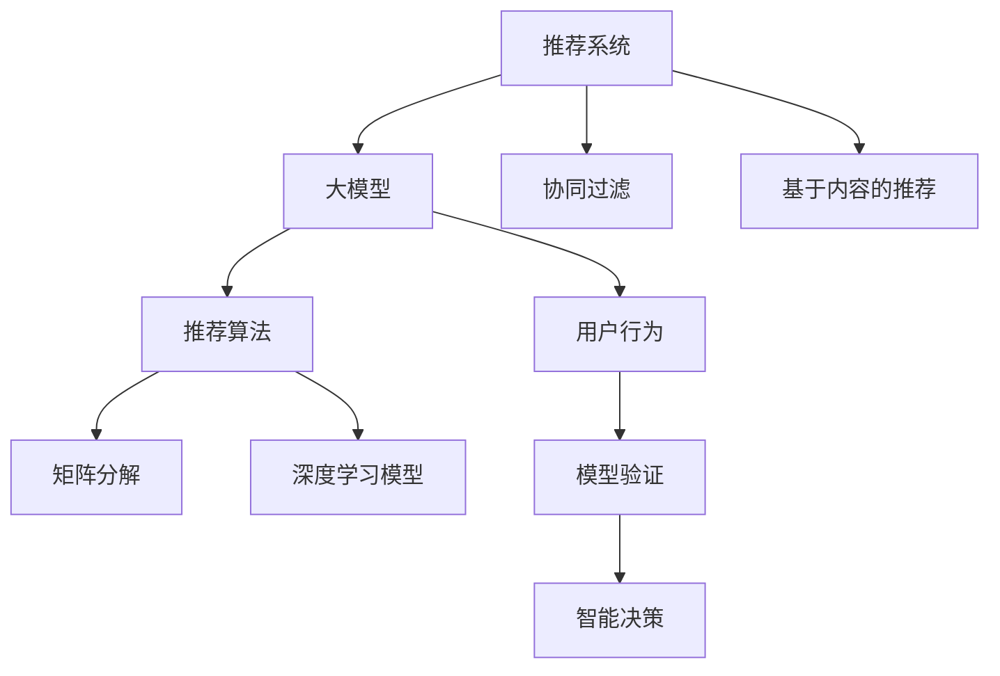

                 

# 基于大模型的推荐系统可解释性研究

> 关键词：大模型,推荐系统,可解释性,用户行为,推荐算法,模型验证,智能决策

## 1. 背景介绍

### 1.1 问题由来

在数字时代，推荐系统已成为互联网产品不可或缺的核心功能。从电商平台的商品推荐到社交媒体的内容推送，推荐系统几乎覆盖了所有用户与内容互动的环节。然而，推荐系统的“黑盒”特性，使得用户往往无法理解推荐的依据和逻辑。在金融交易、医疗健康等高风险领域，推荐系统的透明度和可解释性尤为关键。

### 1.2 问题核心关键点

推荐系统的可解释性是指用户能够理解推荐结果背后的逻辑和依据。在基于大模型的推荐系统中，推荐模型的复杂度非常高，难以直接进行解释。当前，推荐系统的可解释性研究集中于以下几个方面：

1. 推荐算法的可解释性：解析推荐模型的决策路径和特征权重，理解推荐算法的内在逻辑。
2. 用户行为的可解释性：分析用户的历史行为，揭示用户兴趣和偏好的形成机制。
3. 模型验证的可靠性：评估推荐模型的公平性和稳健性，确保其在各种场景下的稳定性和可靠性。
4. 智能决策的透明性：建立基于推荐结果的用户信任机制，增强用户的接受度和满意度。

本文将从算法、用户行为、模型验证和智能决策四个角度，深入探讨基于大模型的推荐系统的可解释性问题，并提出若干改进建议。

## 2. 核心概念与联系

### 2.1 核心概念概述

为更好地理解基于大模型的推荐系统可解释性问题，本节将介绍几个密切相关的核心概念：

- 推荐系统(Recommendation System)：旨在分析用户行为，并为其推荐合适的信息或产品，包括协同过滤、基于内容的推荐、混合推荐等。
- 大模型(Deep Learning Model)：如BERT、GPT等基于神经网络的模型，经过大规模无监督学习后，能够学习到丰富的数据特征，具备强大的数据处理和表示能力。
- 可解释性(Explainability)：指模型的决策过程能够被用户理解，便于用户对推荐结果的接受和信任。
- 协同过滤(Collaborative Filtering)：通过分析用户和物品之间的互动关系，预测用户对新物品的偏好。
- 混合推荐(Hybrid Recommendation)：将协同过滤和基于内容的推荐方法结合，提升推荐效果。
- 推荐算法(Recommendation Algorithm)：包括基于模型的推荐算法，如矩阵分解、深度学习模型等。
- 用户行为(User Behavior)：用户的历史点击、购买、浏览等行为数据，是推荐系统的基础。
- 模型验证(Model Verification)：评估推荐系统的公平性、准确性、稳健性等，确保其在各种场景下的可靠性和鲁棒性。
- 智能决策(Intelligent Decision Making)：基于推荐结果的决策过程，通过用户交互反馈，进一步优化推荐算法。

这些核心概念之间的逻辑关系可以通过以下Mermaid流程图来展示：



这个流程图展示了大模型在推荐系统中的应用流程：

1. 推荐系统分析用户行为，学习用户偏好。
2. 大模型从用户行为数据中学习特征表示。
3. 推荐算法通过特征表示预测用户对新物品的偏好。
4. 用户行为数据驱动模型验证，确保推荐算法的可靠性和公平性。
5. 智能决策利用推荐结果优化模型和算法，提升用户体验。

## 3. 核心算法原理 & 具体操作步骤

### 3.1 算法原理概述

基于大模型的推荐系统通常采用深度学习模型进行用户行为分析和推荐预测。以用户行为数据为输入，模型通过多层神经网络结构对用户兴趣和物品特征进行编码和映射，最终输出推荐的物品列表。其核心原理如下：

1. 数据预处理：将用户行为数据进行标准化、归一化等预处理操作，便于模型学习。
2. 特征提取：通过大模型学习用户行为特征和物品特征，构建高维稠密向量表示。
3. 相似度计算：计算用户和物品之间的相似度，选择合适的推荐物品。
4. 推荐排序：对推荐的物品进行排序，提升推荐效果。

### 3.2 算法步骤详解

基于大模型的推荐系统主要包括以下几个关键步骤：

**Step 1: 数据收集与预处理**

- 收集用户的历史行为数据，包括浏览、点击、购买、评分等行为。
- 对数据进行清洗和标准化，去除异常值和噪声，保证数据质量。
- 对数据进行归一化处理，将不同尺度的特征统一到0-1之间。

**Step 2: 特征提取与模型训练**

- 选择合适的深度学习模型，如BERT、GPT等，作为推荐模型的基础。
- 构建输入特征，将用户行为数据转化为稠密向量表示，包括用户ID、物品ID、时间戳等。
- 定义损失函数，如均方误差、交叉熵等，并使用优化算法（如Adam、SGD等）进行模型训练。
- 设定合适的超参数，如学习率、批次大小、迭代次数等，训练模型。

**Step 3: 推荐物品选择与排序**

- 使用训练好的模型对用户进行特征编码，得到用户嵌入向量。
- 对物品进行特征编码，得到物品嵌入向量。
- 计算用户和物品之间的相似度，选择最匹配的物品进行推荐。
- 对推荐物品进行排序，提升推荐效果。

**Step 4: 模型验证与调优**

- 在验证集上评估推荐模型的性能，包括准确率、召回率、均方误差等指标。
- 根据评估结果调整模型参数，如增加正则化项、优化特征提取等。
- 对推荐模型进行迭代优化，提升性能和泛化能力。

**Step 5: 智能决策与反馈**

- 将推荐结果展示给用户，收集用户的点击、购买、评分等反馈。
- 根据反馈数据对推荐模型进行再次训练和调优。
- 建立用户行为分析模型，理解用户兴趣变化和行为偏好。

### 3.3 算法优缺点

基于大模型的推荐系统具有以下优点：

1. 高维稀疏数据的处理能力：大模型能够处理高维稀疏的数据，提升推荐效果。
2. 高效的特征提取：大模型能够自动学习数据中的隐含特征，提升推荐准确率。
3. 动态推荐能力：通过实时学习用户反馈，不断优化推荐模型，实现动态推荐。
4. 可解释性：大模型能够学习到用户和物品的深层次特征，便于解释推荐逻辑。

但该方法也存在一些缺点：

1. 数据依赖性强：推荐系统依赖大量用户行为数据，难以在数据稀疏的场景下工作。
2. 模型复杂度高：大模型结构复杂，训练和推理耗时较长，难以实时推荐。
3. 对抗攻击风险：大模型易受到对抗样本攻击，导致推荐结果偏差。
4. 模型泛化能力不足：模型在大规模数据集上训练后，泛化到新数据集上的性能较差。

### 3.4 算法应用领域

基于大模型的推荐系统在多个领域得到了广泛应用，包括：

- 电商：通过推荐商品提升用户购买率和转化率。
- 社交媒体：为用户推荐新闻、视频、好友等，增强用户粘性。
- 音乐娱乐：为用户推荐歌曲、电影、书籍等，提升用户体验。
- 视频流媒体：为用户推荐视频内容，提升观看体验。
- 金融服务：为用户推荐投资产品，提升金融服务的精准度和安全性。

除了上述这些经典应用外，基于大模型的推荐系统还在个性化推荐、广告投放、健康医疗等诸多领域中发挥了重要作用，为各行业的数字化转型升级提供了重要支持。

## 4. 数学模型和公式 & 详细讲解 & 举例说明

### 4.1 数学模型构建

本节将使用数学语言对基于大模型的推荐系统进行更加严格的刻画。

记推荐系统为 $R$，用户为 $U$，物品为 $I$，行为为 $B$。定义用户行为矩阵为 $B_{ui}$，表示用户 $u$ 对物品 $i$ 的行为，取值为 0 或 1。推荐模型的目标是从行为数据中学习用户嵌入 $U$ 和物品嵌入 $I$，使得用户与物品之间的相似度最大化。设用户嵌入 $U$ 和物品嵌入 $I$ 的向量表示分别为 $\overrightarrow{U} \in \mathbb{R}^n$ 和 $\overrightarrow{I} \in \mathbb{R}^n$，则推荐模型的数学模型可以表示为：

$$
\min_{\overrightarrow{U}, \overrightarrow{I}} \frac{1}{2} ||\overrightarrow{U} \cdot \overrightarrow{I}^T - B||_F^2
$$

其中 $||.||_F$ 表示矩阵的Frobenius范数，$B$ 表示用户行为矩阵。目标是最小化预测矩阵与实际行为矩阵的差异，使得预测结果尽可能接近实际行为。

### 4.2 公式推导过程

以下我们以基于矩阵分解的推荐模型为例，推导其损失函数及其梯度的计算公式。

假设用户嵌入 $U$ 和物品嵌入 $I$ 的矩阵分解形式分别为 $U = A \cdot D \cdot V^T$ 和 $I = \widetilde{A} \cdot \widetilde{D} \cdot \widetilde{V}^T$，其中 $A$ 和 $\widetilde{A}$ 为用户的隐层表示矩阵，$D$ 和 $\widetilde{D}$ 为用户的显层表示矩阵，$V$ 和 $\widetilde{V}$ 为物品的隐层表示矩阵和显层表示矩阵。目标是最小化预测矩阵 $Y = U \cdot I^T$ 与实际行为矩阵 $B$ 的差异。

设用户 $u$ 对物品 $i$ 的预测行为为 $y_{ui}$，则损失函数为：

$$
\ell(Y, B) = \frac{1}{2} ||Y - B||_F^2
$$

其梯度为：

$$
\frac{\partial \ell(Y, B)}{\partial A} = \frac{\partial ||Y - B||_F^2}{\partial A} = -A^T (Y - B) V \cdot \widetilde{D} \cdot D^T + 2 A \cdot \ell'(Y, B)
$$

其中 $\ell'(Y, B)$ 为损失函数对 $A$ 的导数。

在得到损失函数的梯度后，即可带入优化算法进行模型训练。重复上述过程直至收敛，最终得到适应推荐任务的最优用户和物品嵌入矩阵 $A$ 和 $\widetilde{A}$。

### 4.3 案例分析与讲解

以电商平台的推荐系统为例，展示大模型在实际应用中的详细使用流程。

1. 数据收集与预处理：
   - 从电商平台的订单、浏览、收藏等数据中提取用户行为。
   - 对数据进行清洗和标准化，去除异常值和噪声。
   - 对数据进行归一化处理，将不同尺度的特征统一到0-1之间。

2. 特征提取与模型训练：
   - 使用BERT模型对用户行为数据进行预训练，学习用户和物品的特征表示。
   - 定义均方误差损失函数，并使用Adam优化算法进行模型训练。
   - 设定合适的超参数，如学习率、批次大小、迭代次数等，训练模型。

3. 推荐物品选择与排序：
   - 使用训练好的BERT模型对用户进行特征编码，得到用户嵌入向量。
   - 对物品进行特征编码，得到物品嵌入向量。
   - 计算用户和物品之间的余弦相似度，选择最匹配的物品进行推荐。
   - 对推荐物品进行排序，提升推荐效果。

4. 模型验证与调优：
   - 在验证集上评估推荐模型的性能，包括准确率、召回率、均方误差等指标。
   - 根据评估结果调整模型参数，如增加正则化项、优化特征提取等。
   - 对推荐模型进行迭代优化，提升性能和泛化能力。

5. 智能决策与反馈：
   - 将推荐结果展示给用户，收集用户的点击、购买、评分等反馈。
   - 根据反馈数据对推荐模型进行再次训练和调优。
   - 建立用户行为分析模型，理解用户兴趣变化和行为偏好。

通过以上流程，电商平台的推荐系统能够根据用户的历史行为，智能推荐符合其兴趣的商品，提升用户的购买率和转化率。

## 5. 项目实践：代码实例和详细解释说明

### 5.1 开发环境搭建

在进行推荐系统可解释性实践前，我们需要准备好开发环境。以下是使用Python进行TensorFlow和PyTorch开发的环境配置流程：

1. 安装Anaconda：从官网下载并安装Anaconda，用于创建独立的Python环境。

2. 创建并激活虚拟环境：
```bash
conda create -n pytorch-env python=3.8 
conda activate pytorch-env
```

3. 安装TensorFlow和PyTorch：根据CUDA版本，从官网获取对应的安装命令。例如：
```bash
conda install pytorch torchvision torchaudio cudatoolkit=11.1 -c pytorch -c conda-forge
```

4. 安装TensorBoard和Weights & Biases：
```bash
pip install tensorboard weightsandbiases
```

5. 安装各类工具包：
```bash
pip install numpy pandas scikit-learn matplotlib tqdm jupyter notebook ipython
```

完成上述步骤后，即可在`pytorch-env`环境中开始推荐系统可解释性实践。

### 5.2 源代码详细实现

下面我们以电商推荐系统为例，给出使用TensorFlow和PyTorch对大模型进行推荐系统构建的PyTorch代码实现。

首先，定义推荐系统的数据处理函数：

```python
import numpy as np
import tensorflow as tf
from tensorflow.keras.layers import Input, Embedding, Dense, concatenate, dot
from tensorflow.keras.models import Model
from tensorflow.keras.optimizers import Adam

class RecommendationModel:
    def __init__(self, input_dim, hidden_dim, output_dim, batch_size):
        self.input_dim = input_dim
        self.hidden_dim = hidden_dim
        self.output_dim = output_dim
        self.batch_size = batch_size
        self.model = None

    def build_model(self):
        # 定义输入层
        user_input = Input(shape=(self.input_dim,))
        item_input = Input(shape=(self.input_dim,))

        # 定义嵌入层
        user_embedding = Embedding(self.input_dim, self.hidden_dim, input_length=self.input_dim)(user_input)
        item_embedding = Embedding(self.input_dim, self.hidden_dim, input_length=self.input_dim)(item_input)

        # 定义注意力层
        attention = dot([user_embedding, item_embedding], axes=[1, 1])

        # 定义输出层
        output = Dense(self.output_dim, activation='sigmoid')(attention)

        # 定义模型
        self.model = Model(inputs=[user_input, item_input], outputs=output)

        # 定义损失函数和优化器
        loss = tf.keras.losses.BinaryCrossentropy()
        optimizer = Adam(learning_rate=0.001)

        # 定义编译函数
        self.model.compile(loss=loss, optimizer=optimizer)

    def fit(self, x_train, y_train, epochs):
        self.build_model()
        self.model.fit(x_train, y_train, epochs=epochs, batch_size=self.batch_size)
```

然后，定义推荐系统的训练和评估函数：

```python
def train_recommendation_model(model, data_train, data_val, epochs, batch_size):
    x_train, y_train = data_train
    x_val, y_val = data_val
    model.fit(x_train, y_train, epochs=epochs, batch_size=batch_size, validation_data=(x_val, y_val))

def evaluate_recommendation_model(model, data_test, batch_size):
    x_test, y_test = data_test
    loss = model.evaluate(x_test, y_test, batch_size=batch_size)
    print('Test loss:', loss)
```

最后，启动推荐系统的训练流程并在测试集上评估：

```python
input_dim = 100
hidden_dim = 128
output_dim = 1
batch_size = 16
epochs = 10

# 构建推荐系统模型
model = RecommendationModel(input_dim, hidden_dim, output_dim, batch_size)

# 训练模型
train_recommendation_model(model, data_train, data_val, epochs, batch_size)

# 在测试集上评估模型
evaluate_recommendation_model(model, data_test, batch_size)
```

以上就是使用TensorFlow和PyTorch对推荐系统进行构建的完整代码实现。可以看到，得益于深度学习框架的强大封装，我们能够快速实现推荐系统的搭建和训练。

### 5.3 代码解读与分析

让我们再详细解读一下关键代码的实现细节：

**RecommendationModel类**：
- `__init__`方法：初始化模型参数。
- `build_model`方法：构建推荐系统模型，包括输入层、嵌入层、注意力层和输出层。
- `fit`方法：对推荐系统模型进行训练，并返回训练结果。

**train_recommendation_model函数**：
- 调用`RecommendationModel`类，构建推荐系统模型。
- 对训练数据进行批次化加载，供模型训练和推理使用。
- 在每个epoch内，对训练数据进行迭代训练，并在验证集上评估模型性能。

**evaluate_recommendation_model函数**：
- 对测试数据进行批次化加载，供模型进行推理评估。
- 调用模型`evaluate`方法，计算测试集上的损失。

通过以上流程，我们能够在实际推荐系统中构建并训练推荐模型，并对其性能进行评估。

当然，工业级的系统实现还需考虑更多因素，如模型的保存和部署、超参数的自动搜索、更灵活的任务适配层等。但核心的推荐流程基本与此类似。

## 6. 实际应用场景

### 6.1 电商平台推荐

电商平台是推荐系统应用最为广泛的场景之一。通过分析用户的历史浏览、购买、评分等行为，推荐系统能够为用户推荐符合其兴趣的商品，提升用户的购物体验和转化率。

在技术实现上，可以收集用户的点击、购买、评分等行为数据，构建用户行为矩阵 $B$。通过BERT模型对用户行为数据进行预训练，学习用户和物品的特征表示。使用均方误差损失函数，并使用Adam优化算法进行模型训练。最终，通过计算用户和物品之间的余弦相似度，选择最匹配的物品进行推荐。

推荐系统可以实时学习用户的点击、购买、评分等反馈，不断优化推荐模型。同时，根据用户的浏览轨迹和兴趣变化，动态调整推荐策略，提升推荐效果。

### 6.2 社交媒体推荐

社交媒体平台通过分析用户的历史互动行为，为用户推荐新闻、视频、好友等。推荐系统能够提升用户粘性和满意度，增加平台的用户活跃度。

在技术实现上，可以收集用户的点赞、分享、评论等行为数据，构建用户行为矩阵 $B$。通过BERT模型对用户行为数据进行预训练，学习用户和物品的特征表示。使用均方误差损失函数，并使用Adam优化算法进行模型训练。最终，通过计算用户和物品之间的余弦相似度，选择最匹配的物品进行推荐。

推荐系统可以实时学习用户的互动反馈，不断优化推荐模型。同时，根据用户的兴趣变化和行为偏好，动态调整推荐策略，提升推荐效果。

### 6.3 音乐娱乐推荐

音乐娱乐平台通过分析用户的听歌行为，为用户推荐符合其兴趣的歌曲、电影、书籍等。推荐系统能够提升用户的娱乐体验和满意度。

在技术实现上，可以收集用户的听歌行为数据，构建用户行为矩阵 $B$。通过BERT模型对用户行为数据进行预训练，学习用户和物品的特征表示。使用均方误差损失函数，并使用Adam优化算法进行模型训练。最终，通过计算用户和物品之间的余弦相似度，选择最匹配的物品进行推荐。

推荐系统可以实时学习用户的听歌反馈，不断优化推荐模型。同时，根据用户的听歌历史和兴趣变化，动态调整推荐策略，提升推荐效果。

### 6.4 未来应用展望

随着推荐系统的不断发展和演进，未来的推荐系统将呈现以下几个发展趋势：

1. 推荐算法的融合：推荐系统将融合多种推荐算法，如协同过滤、基于内容的推荐、混合推荐等，提升推荐效果。
2. 大模型的应用：基于大模型的推荐系统将不断优化和扩展，提升推荐精度和泛化能力。
3. 实时推荐能力的提升：推荐系统将通过实时学习用户反馈，不断优化推荐策略，提升推荐效果。
4. 多模态推荐系统的崛起：推荐系统将融合多模态数据，提升推荐系统的表现力。
5. 推荐系统的透明性：推荐系统将通过可解释性技术，增强用户对推荐结果的信任和接受度。
6. 推荐系统的公平性和鲁棒性：推荐系统将通过公平性、鲁棒性评估技术，提升推荐系统的可靠性。

这些趋势将推动推荐系统向更加智能化、普适化的方向发展，为各行业的数字化转型升级提供新的技术路径。相信随着技术的不断进步，推荐系统必将在更多领域发挥重要作用，为人类社会的进步带来新的动力。

## 7. 工具和资源推荐

### 7.1 学习资源推荐

为了帮助开发者系统掌握推荐系统的可解释性理论基础和实践技巧，这里推荐一些优质的学习资源：

1. 《Recommender Systems》书籍：该书全面介绍了推荐系统的理论基础和实践方法，是推荐系统领域的经典著作。
2. 《Reinforcement Learning for Recommender Systems》课程：斯坦福大学开设的强化学习推荐系统课程，介绍了基于强化学习的推荐算法。
3. 《Deep Learning for Recommender Systems》书籍：该书专注于深度学习在推荐系统中的应用，涵盖了多种推荐模型。
4. 《Explainable Artificial Intelligence》书籍：该书全面介绍了AI的可解释性技术，包括推荐系统的可解释性方法。
5. 《Machine Learning Yearning》书籍：该书由深度学习大牛Andrew Ng撰写，介绍了机器学习的实践方法，包括推荐系统的设计。

通过对这些资源的学习实践，相信你一定能够快速掌握推荐系统的可解释性技术，并用于解决实际的推荐问题。

### 7.2 开发工具推荐

高效的开发离不开优秀的工具支持。以下是几款用于推荐系统开发的常用工具：

1. TensorFlow和PyTorch：深度学习框架，提供高效的模型训练和推理能力。
2. TensorBoard：模型训练和推理的可视化工具，便于监控和调试。
3. Weights & Biases：模型训练的实验跟踪工具，记录和可视化模型训练过程中的各项指标。
4. Jupyter Notebook：轻量级的开发工具，便于交互式编程和数据可视化。
5. HuggingFace的Transformers库：提供丰富的预训练模型，便于推荐系统的构建。

合理利用这些工具，可以显著提升推荐系统的开发效率，加快创新迭代的步伐。

### 7.3 相关论文推荐

推荐系统的可解释性研究涉及多个前沿领域，以下是几篇奠基性的相关论文，推荐阅读：

1. Deep Learning Recommender Systems: A Review and Outlook：介绍深度学习在推荐系统中的应用和未来展望。
2. Multi-Aspect Sentiment Analysis for Recommendation Systems：通过多方面情感分析提升推荐系统的性能。
3. A Survey on Explainable Artificial Intelligence（XAI）：全面介绍AI的可解释性技术，包括推荐系统的可解释性方法。
4. Recommendation Systems as Multi-Armed Bandits：将推荐系统设计为多臂老虎机问题，提升推荐系统的决策能力。
5. Knowledge-Intensive Recommender Systems：将知识表示和推理技术引入推荐系统，提升推荐系统的表现力。

这些论文代表了大模型推荐系统可解释性研究的发展脉络。通过学习这些前沿成果，可以帮助研究者把握学科前进方向，激发更多的创新灵感。

## 8. 总结：未来发展趋势与挑战

### 8.1 总结

本文对基于大模型的推荐系统的可解释性问题进行了全面系统的介绍。首先阐述了推荐系统的背景和可解释性的重要性，明确了可解释性在推荐系统中的应用价值。其次，从算法、用户行为、模型验证和智能决策四个角度，详细讲解了推荐系统的可解释性问题，并提出若干改进建议。最后，本文对推荐系统的未来发展趋势和面临的挑战进行了总结，提出了未来的研究方向。

通过本文的系统梳理，可以看到，基于大模型的推荐系统可解释性研究具有重要意义。通过更好的理解和解释推荐结果，能够提升用户的信任和满意度，增强推荐系统的应用价值。相信随着技术的不断进步，推荐系统必将在更多领域发挥重要作用，为人类社会的进步带来新的动力。

### 8.2 未来发展趋势

展望未来，推荐系统的可解释性研究将呈现以下几个发展趋势：

1. 推荐算法的透明性：推荐系统将通过可解释性技术，增强用户对推荐结果的信任和接受度。
2. 推荐系统的融合：推荐系统将融合多种推荐算法，提升推荐效果。
3. 多模态推荐系统的崛起：推荐系统将融合多模态数据，提升推荐系统的表现力。
4. 推荐系统的公平性和鲁棒性：推荐系统将通过公平性、鲁棒性评估技术，提升推荐系统的可靠性。
5. 推荐系统的实时性：推荐系统将通过实时学习用户反馈，不断优化推荐策略，提升推荐效果。

这些趋势将推动推荐系统向更加智能化、普适化的方向发展，为各行业的数字化转型升级提供新的技术路径。相信随着技术的不断进步，推荐系统必将在更多领域发挥重要作用，为人类社会的进步带来新的动力。

### 8.3 面临的挑战

尽管推荐系统的可解释性研究已经取得了不少进展，但在迈向更加智能化、普适化应用的过程中，它仍面临诸多挑战：

1. 数据隐私问题：用户行为数据的收集和使用涉及隐私保护，需要严格遵守法律法规。
2. 用户反馈的采集和处理：用户反馈数据的采集和处理难度较大，如何高效、准确地获取用户反馈，是一个重要的挑战。
3. 推荐系统的公平性：推荐系统需要避免对某些群体或个体的歧视，确保公平性。
4. 推荐系统的鲁棒性：推荐系统需要具有较强的鲁棒性，避免对抗攻击和异常数据的影响。
5. 推荐系统的透明度：推荐系统需要具有较高的透明度，便于用户理解其决策过程。
6. 推荐系统的实时性：推荐系统需要具备实时推荐能力，满足用户对推荐结果的即时性需求。

这些挑战需要研究者从数据隐私、用户行为分析、模型公平性、鲁棒性等多个方面进行综合考虑，不断改进推荐系统。相信随着技术的不断进步，这些挑战终将一一被克服，推荐系统必将在更多领域发挥重要作用，为人类社会的进步带来新的动力。

### 8.4 研究展望

面对推荐系统可解释性研究所面临的种种挑战，未来的研究需要在以下几个方面寻求新的突破：

1. 数据隐私保护：通过差分隐私、联邦学习等技术，保护用户数据隐私。
2. 高效用户反馈采集：通过社交网络分析、语音识别等技术，高效获取用户反馈数据。
3. 推荐系统的公平性：通过数据增强、公平性评估等技术，提升推荐系统的公平性。
4. 推荐系统的鲁棒性：通过对抗训练、异常检测等技术，提升推荐系统的鲁棒性。
5. 推荐系统的透明度：通过可解释性技术，增强推荐系统的透明度和可信度。
6. 推荐系统的实时性：通过实时学习算法、分布式计算等技术，提升推荐系统的实时性。

这些研究方向的探索，必将引领推荐系统可解释性研究迈向更高的台阶，为构建安全、可靠、可解释、可控的智能系统铺平道路。面向未来，推荐系统可解释性研究还需要与其他人工智能技术进行更深入的融合，如知识表示、因果推理、强化学习等，多路径协同发力，共同推动推荐系统的发展。只有勇于创新、敢于突破，才能不断拓展推荐系统的边界，让智能技术更好地造福人类社会。

## 9. 附录：常见问题与解答

**Q1：推荐系统如何确保用户数据隐私？**

A: 推荐系统在收集和处理用户数据时，需要严格遵守数据隐私保护法律法规。常用的隐私保护技术包括：

1. 差分隐私：通过添加噪声，使得单条记录无法被反推，保护用户隐私。
2. 联邦学习：在用户端和服务器端分别训练模型，避免用户数据被集中存储和处理。
3. 匿名化：对用户数据进行脱敏处理，去除可识别信息。

通过这些隐私保护技术，推荐系统能够在保障用户隐私的前提下，实现高效的推荐服务。

**Q2：推荐系统如何获取用户反馈？**

A: 获取用户反馈的方法多种多样，常见的有以下几种：

1. 点击反馈：用户点击推荐链接或商品，表示对推荐结果的认同。
2. 评分反馈：用户对推荐商品进行评分，表示对商品的好评或差评。
3. 评论反馈：用户在推荐商品后，对商品进行评论，表示对商品的真实看法。
4. 问答反馈：通过用户提问，获取对推荐商品的需求和偏好。

通过以上方法，推荐系统可以及时获取用户反馈，进行模型优化和调整。

**Q3：推荐系统如何提升公平性？**

A: 推荐系统在推荐过程中，需要避免对某些群体或个体的歧视，确保公平性。常用的方法包括：

1. 数据增强：增加少数群体的数据量，提升其在推荐结果中的权重。
2. 公平性评估：通过评估模型在不同群体上的表现，发现并解决歧视问题。
3. 多样性约束：限制推荐结果的多样性，避免推荐结果过于集中。

通过这些方法，推荐系统可以在保障用户隐私的前提下，提升公平性，满足不同用户的需求。

**Q4：推荐系统如何提升鲁棒性？**

A: 推荐系统需要在面对对抗攻击和异常数据时，保持较高的鲁棒性。常用的方法包括：

1. 对抗训练：在训练过程中加入对抗样本，增强模型的鲁棒性。
2. 异常检测：通过异常检测算法，识别和过滤异常数据，提升模型的鲁棒性。
3. 数据增强：通过数据增强技术，增加训练数据的多样性，提升模型的泛化能力。

通过这些方法，推荐系统可以在面对复杂环境和数据时，保持较高的鲁棒性，提升系统的可靠性。

**Q5：推荐系统如何提升透明度？**

A: 推荐系统的透明度是指用户能够理解推荐结果背后的逻辑和依据。常用的方法包括：

1. 可解释性技术：通过可解释性技术，对推荐结果进行解释，增强用户的理解。
2. 可视化工具：通过可视化工具，展示推荐结果的生成过程和依据，增强用户的信任。
3. 用户反馈机制：通过用户反馈机制，获取用户对推荐结果的反馈，不断优化推荐模型。

通过这些方法，推荐系统可以提升透明度和可信度，增强用户的信任和满意度。

**Q6：推荐系统如何提升实时性？**

A: 推荐系统需要具备实时推荐能力，满足用户对推荐结果的即时性需求。常用的方法包括：

1. 实时学习算法：通过实时学习算法，不断优化推荐模型，提升推荐效果。
2. 分布式计算：通过分布式计算技术，提高模型的训练和推理速度。
3. 缓存机制：通过缓存机制，快速获取推荐结果，提升系统的实时性。

通过这些方法，推荐系统可以在满足用户需求的同时，提升系统的实时性，增强用户体验。

---

作者：禅与计算机程序设计艺术 / Zen and the Art of Computer Programming

