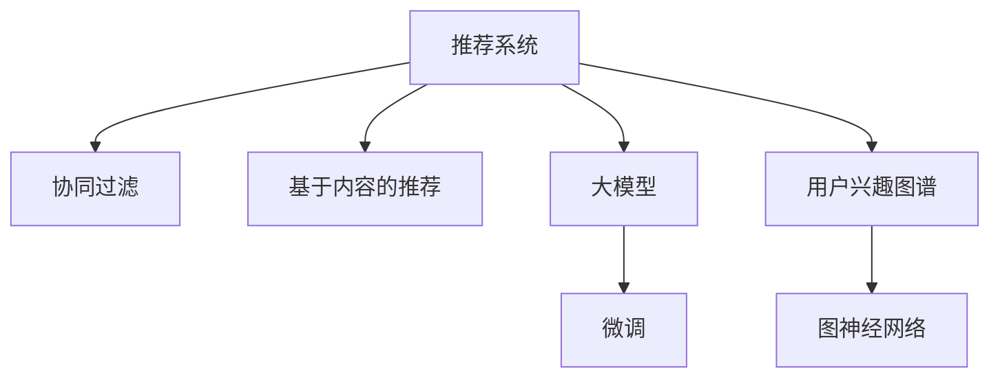

                 

# 基于大模型的推荐系统用户兴趣图谱构建

> 关键词：推荐系统,大模型,用户兴趣,图谱构建,深度学习,自然语言处理

## 1. 背景介绍

### 1.1 问题由来
随着互联网的发展，推荐系统已经成为用户获取信息的重要工具。传统的基于协同过滤的推荐系统，虽然能够为用户推荐感兴趣的物品，但存在着数据稀疏、冷启动问题，难以获取新用户的兴趣信息。推荐系统正逐渐向基于内容的推荐方向发展，旨在通过深入挖掘物品属性，提升推荐效果。

近年来，深度学习和大模型技术的发展为推荐系统带来了新的思路。利用大规模预训练语言模型（如BERT、GPT-2等），可以在海量的文本数据上学习到丰富的语义信息，并通过微调技术将这些知识用于物品和用户的表示学习。同时，大模型在处理长文本、复杂语义等方面具有天然优势，能够更加精准地捕捉用户兴趣和物品属性。

本研究聚焦于基于大模型的推荐系统，通过构建用户兴趣图谱，实现更加个性化、精准的推荐。通过本文的介绍，读者将了解大模型推荐系统的工作原理、关键技术以及实际应用中的优化策略。

## 2. 核心概念与联系

### 2.1 核心概念概述

为更好地理解基于大模型的推荐系统，本节将介绍几个密切相关的核心概念：

- 推荐系统(Recommendation System)：根据用户的历史行为、兴趣、属性等信息，为用户推荐潜在感兴趣物品的系统。推荐系统是电商、视频、音乐等互联网业务的重要支撑。

- 协同过滤(Collaborative Filtering)：通过用户行为数据，发现用户间的相似性，从而为用户推荐物品。经典协同过滤方法包括基于用户的协同过滤和基于物品的协同过滤。

- 基于内容的推荐(Content-Based Recommendation)：通过物品属性信息，进行内容匹配，推荐给具有相似兴趣的用户。经典方法包括基于特征向量的推荐和基于标签的推荐。

- 大模型(Large Model)：以自回归或自编码模型为代表的大规模预训练语言模型。通过在大规模无标签文本语料上进行预训练，学习通用的语言表示，具备强大的语言理解和生成能力。

- 微调(Fine-Tuning)：指在预训练模型的基础上，使用下游任务的少量标注数据，通过有监督地训练来优化模型在特定任务上的性能。通常只需要调整顶层分类器或解码器，并以较小的学习率更新全部或部分的模型参数。

- 用户兴趣图谱(User Interest Graph)：一种基于图结构的用户兴趣表示方法，通过图神经网络将用户与物品进行关联，捕捉用户对物品的兴趣演化路径和关系。

这些核心概念之间的逻辑关系可以通过以下Mermaid流程图来展示：



这个流程图展示了大模型的推荐系统的工作原理：

1. 推荐系统通过协同过滤和基于内容推荐等传统方法，获取用户的历史行为数据。
2. 大模型通过预训练学习通用的语言表示，用于物品和用户表示学习。
3. 在物品和用户表示的基础上，微调模型获取更精准的相似度表示。
4. 通过用户兴趣图谱，捕捉用户与物品之间的复杂关系。

这些概念共同构成了大模型推荐系统的工作框架，使其能够为用户提供更加个性化、精准的推荐。

## 3. 核心算法原理 & 具体操作步骤
### 3.1 算法原理概述

基于大模型的推荐系统，本质上是通过大模型学习物品和用户表示，并在用户兴趣图谱上进行推理，实现个性化推荐。其核心思想是：

1. **预训练**：使用大规模无标签文本数据，对大模型进行预训练，学习通用的语言表示。

2. **微调**：将预训练的模型与用户的历史行为数据进行结合，使用有监督的微调方法，优化模型以更好地匹配用户兴趣。

3. **图谱构建**：通过用户的历史行为数据，构建用户兴趣图谱，捕捉用户与物品之间的复杂关系。

4. **图神经网络**：利用图神经网络，在用户兴趣图谱上进行推理，得到用户对物品的兴趣度排序。

5. **推荐生成**：根据用户兴趣度排序，生成个性化推荐列表，返回给用户。

### 3.2 算法步骤详解

基于大模型的推荐系统一般包括以下几个关键步骤：

**Step 1: 准备预训练模型和数据集**
- 选择合适的预训练语言模型 $M_{\theta}$ 作为初始化参数，如 BERT、GPT 等。
- 准备用户的历史行为数据集 $D=\{(x_i,y_i)\}_{i=1}^N, x_i \in \mathcal{X}, y_i \in \mathcal{Y}$，其中 $x_i$ 为物品ID，$y_i$ 为用户的点击行为。

**Step 2: 添加任务适配层**
- 根据任务类型，在预训练模型顶层设计合适的输出层和损失函数。
- 对于点击行为预测任务，通常在顶层添加线性分类器和交叉熵损失函数。
- 对于评分预测任务，通常使用均方误差损失函数。

**Step 3: 设置微调超参数**
- 选择合适的优化算法及其参数，如 AdamW、SGD 等，设置学习率、批大小、迭代轮数等。
- 设置正则化技术及强度，包括权重衰减、Dropout、Early Stopping等。
- 确定冻结预训练参数的策略，如仅微调顶层，或全部参数都参与微调。

**Step 4: 执行梯度训练**
- 将训练集数据分批次输入模型，前向传播计算损失函数。
- 反向传播计算参数梯度，根据设定的优化算法和学习率更新模型参数。
- 周期性在验证集上评估模型性能，根据性能指标决定是否触发 Early Stopping。
- 重复上述步骤直到满足预设的迭代轮数或 Early Stopping 条件。

**Step 5: 图谱构建与推理**
- 对用户历史行为数据进行图谱构建，形成用户兴趣图谱。
- 利用图神经网络，在图谱上对用户兴趣进行推理，生成用户对物品的兴趣度排序。
- 根据兴趣度排序生成个性化推荐列表。

**Step 6: 测试和部署**
- 在测试集上评估推荐系统的性能，对比微调前后的精度提升。
- 使用推荐系统对新用户进行推荐，集成到实际的应用系统中。

以上是基于大模型的推荐系统的一般流程。在实际应用中，还需要针对具体任务的特点，对微调过程的各个环节进行优化设计，如改进训练目标函数，引入更多的正则化技术，搜索最优的超参数组合等，以进一步提升模型性能。

### 3.3 算法优缺点

基于大模型的推荐系统具有以下优点：
1. 精度高。由于大模型的强大语义理解能力，推荐系统能够精准匹配用户兴趣和物品属性。
2. 泛化能力强。大模型在预训练过程中学习到了丰富的语义信息，在新的用户和物品上也能表现出较好的泛化能力。
3. 动态适应。用户兴趣图谱能够动态捕捉用户兴趣的演化，实时调整推荐策略。
4. 多模态融合。能够结合文本、图像、音频等多模态信息，实现更全面的推荐。

同时，该方法也存在一定的局限性：
1. 对标注数据依赖。微调过程需要用户行为数据作为标注，数据量不足会导致推荐效果不佳。
2. 计算资源消耗大。大模型的训练和推理资源消耗较大，需要高性能硬件支持。
3. 模型的可解释性差。大模型往往被视为黑盒，难以解释其内部工作机制和决策逻辑。
4. 冷启动问题。新用户和新物品缺乏历史行为数据，推荐效果会大打折扣。
5. 用户隐私问题。用户行为数据可能涉及隐私，如何保证数据安全是重要问题。

尽管存在这些局限性，但就目前而言，基于大模型的推荐系统仍然是最主流的推荐技术范式。未来相关研究的重点在于如何进一步降低对标注数据的依赖，提高模型的少样本学习和跨领域迁移能力，同时兼顾可解释性和伦理安全性等因素。

### 3.4 算法应用领域

基于大模型的推荐系统已经在多个领域得到了广泛的应用，例如：

- 电商推荐：为电商平台用户推荐感兴趣的物品。利用用户浏览记录、点击行为等数据，对商品进行推荐。
- 视频推荐：为用户推荐感兴趣的视频内容。分析用户观看历史、点赞、评论等行为数据，推荐相关视频。
- 音乐推荐：为用户推荐感兴趣的音乐。通过分析用户的听歌历史、评分数据，推荐相似歌曲和专辑。
- 新闻推荐：为用户推荐感兴趣的新闻。根据用户的阅读历史、互动行为，推荐相关新闻内容。
- 智能广告推荐：为企业推荐目标客户，提升广告投放效果。通过分析用户的浏览记录、点击行为，推荐合适的广告内容。

除了上述这些经典任务外，大模型推荐系统还被创新性地应用到更多场景中，如个性化学习推荐、智能医疗推荐等，为互联网业务带来了新的增长点。随着大模型和推荐技术的发展，相信推荐系统将在更广阔的应用领域发挥更大的作用。

## 4. 数学模型和公式 & 详细讲解  
### 4.1 数学模型构建

本节将使用数学语言对基于大模型的推荐系统进行更加严格的刻画。

记用户兴趣图谱中的节点为 $U=\{u_1,u_2,\dots,u_n\}$，物品为 $V=\{v_1,v_2,\dots,v_m\}$。用户 $u_i$ 与物品 $v_j$ 之间的关系表示为 $E_{ij}$，用户 $u_i$ 对物品 $v_j$ 的兴趣度表示为 $H_{ij}$。

定义用户 $u_i$ 的兴趣表示向量为 $\textbf{u}_i=[u_{i1},u_{i2},\dots,u_{in}]$，物品 $v_j$ 的兴趣表示向量为 $\textbf{v}_j=[v_{j1},v_{j2},\dots,v_{jm}]$。通过预训练语言模型和微调方法，得到用户和物品的表示向量。

定义用户 $u_i$ 与物品 $v_j$ 的兴趣度为 $H_{ij}=\textbf{u}_i^T\textbf{v}_j$，则推荐系统最终的推荐列表 $R=\{v_{j1},v_{j2},\dots,v_{jm}\}$ 的生成过程为：

$$
\hat{R}=\mathop{\arg\max}_{v \in V} \sum_{i=1}^N \alpha_i \hat{H}_{ij}
$$

其中 $\alpha_i$ 为用户 $u_i$ 的兴趣权重，$\hat{H}_{ij}$ 为经过图神经网络推理后的用户 $u_i$ 对物品 $v_j$ 的兴趣度。

### 4.2 公式推导过程

以下我们以二分类任务为例，推导交叉熵损失函数及其梯度的计算公式。

假设用户 $u_i$ 的兴趣表示向量为 $\textbf{u}_i=[u_{i1},u_{i2},\dots,u_{in}]$，物品 $v_j$ 的兴趣表示向量为 $\textbf{v}_j=[v_{j1},v_{j2},\dots,v_{jm}]$。用户 $u_i$ 与物品 $v_j$ 的兴趣度为 $H_{ij}=\textbf{u}_i^T\textbf{v}_j$。

在用户兴趣图谱上进行节点间的图卷积，得到用户 $u_i$ 对物品 $v_j$ 的兴趣度预测值 $\hat{H}_{ij}$。使用均方误差损失函数，则推荐系统在数据集 $D=\{(x_i,y_i)\}_{i=1}^N, x_i \in \mathcal{X}, y_i \in \mathcal{Y}$ 上的经验风险为：

$$
\mathcal{L}(\theta) = \frac{1}{N}\sum_{i=1}^N [\frac{1}{m}\sum_{j=1}^m (y_{ij} - \hat{H}_{ij})^2]
$$

其中 $y_{ij} \in \{0,1\}$ 表示用户 $u_i$ 是否对物品 $v_j$ 感兴趣。根据梯度下降等优化算法，最小化损失函数 $\mathcal{L}(\theta)$，更新模型参数 $\theta$，使得推荐系统能够更好地匹配用户兴趣。

### 4.3 案例分析与讲解

以电商平台推荐系统为例，展示基于大模型的推荐系统的工作流程。

假设用户 $u_i$ 浏览了10个商品 $v_{j1},v_{j2},\dots,v_{j10}$，点击了其中的5个商品 $v_{j1},v_{j3},v_{j5},v_{j7},v_{j10}$。系统收集这些数据，并使用BERT等大模型进行预训练，得到用户 $u_i$ 和商品 $v_j$ 的表示向量。通过微调方法，学习用户与商品的相似度表示。

构建用户兴趣图谱 $G=(U,V,E)$，将用户 $u_i$ 和物品 $v_j$ 之间的关系表示为 $E_{ij}$。使用图神经网络，在图谱上对用户 $u_i$ 的兴趣进行推理，得到 $u_i$ 对物品 $v_j$ 的兴趣度预测值 $\hat{H}_{ij}$。将预测值与标注值对比，使用均方误差损失函数进行优化，更新模型参数 $\theta$。

最终，推荐系统生成推荐列表 $R=\{v_{j1},v_{j3},v_{j5},v_{j7},v_{j10}\}$，返回给用户 $u_i$。推荐系统通过不断的微调和图谱更新，动态适应用户兴趣的演化，实现更加精准的推荐。

## 5. 项目实践：代码实例和详细解释说明
### 5.1 开发环境搭建

在进行推荐系统实践前，我们需要准备好开发环境。以下是使用Python进行PyTorch开发的环境配置流程：

1. 安装Anaconda：从官网下载并安装Anaconda，用于创建独立的Python环境。

2. 创建并激活虚拟环境：
```bash
conda create -n pytorch-env python=3.8 
conda activate pytorch-env
```

3. 安装PyTorch：根据CUDA版本，从官网获取对应的安装命令。例如：
```bash
conda install pytorch torchvision torchaudio cudatoolkit=11.1 -c pytorch -c conda-forge
```

4. 安装TensorFlow：
```bash
pip install tensorflow==2.8
```

5. 安装各类工具包：
```bash
pip install numpy pandas scikit-learn matplotlib tqdm jupyter notebook ipython
```

完成上述步骤后，即可在`pytorch-env`环境中开始推荐系统实践。

### 5.2 源代码详细实现

这里我们以基于BERT的电商平台推荐系统为例，展示使用PyTorch进行大模型推荐系统开发的完整代码实现。

首先，定义推荐系统的数据处理函数：

```python
from transformers import BertTokenizer
from torch.utils.data import Dataset
import torch

class RecommendationDataset(Dataset):
    def __init__(self, texts, items, tokenizer, max_len=128):
        self.texts = texts
        self.items = items
        self.tokenizer = tokenizer
        self.max_len = max_len
        
    def __len__(self):
        return len(self.texts)
    
    def __getitem__(self, item):
        text = self.texts[item]
        item_id = self.items[item]
        
        encoding = self.tokenizer(text, return_tensors='pt', max_length=self.max_len, padding='max_length', truncation=True)
        input_ids = encoding['input_ids'][0]
        attention_mask = encoding['attention_mask'][0]
        
        # 对物品ID进行编码
        item_ids = [item_id] * self.max_len
        labels = torch.tensor(item_ids, dtype=torch.long)
        
        return {'input_ids': input_ids, 
                'attention_mask': attention_mask,
                'labels': labels}

# 定义物品与ID的映射
item2id = {item: i for i, item in enumerate(items)}
id2item = {i: item for item, i in item2id.items()}

# 创建dataset
tokenizer = BertTokenizer.from_pretrained('bert-base-cased')

train_dataset = RecommendationDataset(train_texts, train_items, tokenizer)
dev_dataset = RecommendationDataset(dev_texts, dev_items, tokenizer)
test_dataset = RecommendationDataset(test_texts, test_items, tokenizer)
```

然后，定义模型和优化器：

```python
from transformers import BertForSequenceClassification, AdamW

model = BertForSequenceClassification.from_pretrained('bert-base-cased', num_labels=len(item2id))

optimizer = AdamW(model.parameters(), lr=2e-5)
```

接着，定义训练和评估函数：

```python
from torch.utils.data import DataLoader
from tqdm import tqdm
from sklearn.metrics import mean_squared_error

device = torch.device('cuda') if torch.cuda.is_available() else torch.device('cpu')
model.to(device)

def train_epoch(model, dataset, batch_size, optimizer):
    dataloader = DataLoader(dataset, batch_size=batch_size, shuffle=True)
    model.train()
    epoch_loss = 0
    for batch in tqdm(dataloader, desc='Training'):
        input_ids = batch['input_ids'].to(device)
        attention_mask = batch['attention_mask'].to(device)
        labels = batch['labels'].to(device)
        model.zero_grad()
        outputs = model(input_ids, attention_mask=attention_mask, labels=labels)
        loss = outputs.loss
        epoch_loss += loss.item()
        loss.backward()
        optimizer.step()
    return epoch_loss / len(dataloader)

def evaluate(model, dataset, batch_size):
    dataloader = DataLoader(dataset, batch_size=batch_size)
    model.eval()
    preds, labels = [], []
    with torch.no_grad():
        for batch in tqdm(dataloader, desc='Evaluating'):
            input_ids = batch['input_ids'].to(device)
            attention_mask = batch['attention_mask'].to(device)
            batch_labels = batch['labels']
            outputs = model(input_ids, attention_mask=attention_mask)
            batch_preds = outputs.logits.argmax(dim=2).to('cpu').tolist()
            batch_labels = batch_labels.to('cpu').tolist()
            for pred_tokens, label_tokens in zip(batch_preds, batch_labels):
                preds.append(pred_tokens[:len(label_tokens)])
                labels.append(label_tokens)
                
    print(mean_squared_error(labels, preds))
```

最后，启动训练流程并在测试集上评估：

```python
epochs = 5
batch_size = 16

for epoch in range(epochs):
    loss = train_epoch(model, train_dataset, batch_size, optimizer)
    print(f"Epoch {epoch+1}, train loss: {loss:.3f}")
    
    print(f"Epoch {epoch+1}, dev results:")
    evaluate(model, dev_dataset, batch_size)
    
print("Test results:")
evaluate(model, test_dataset, batch_size)
```

以上就是使用PyTorch对BERT进行电商平台推荐系统开发的完整代码实现。可以看到，得益于Transformers库的强大封装，我们可以用相对简洁的代码完成BERT模型的加载和微调。

### 5.3 代码解读与分析

让我们再详细解读一下关键代码的实现细节：

**RecommendationDataset类**：
- `__init__`方法：初始化文本、物品ID、分词器等关键组件。
- `__len__`方法：返回数据集的样本数量。
- `__getitem__`方法：对单个样本进行处理，将文本输入编码为token ids，将物品ID编码成数字，并对其进行定长padding，最终返回模型所需的输入。

**item2id和id2item字典**：
- 定义了物品与数字ID之间的映射关系，用于将物品表示向量解码回物品ID。

**训练和评估函数**：
- 使用PyTorch的DataLoader对数据集进行批次化加载，供模型训练和推理使用。
- 训练函数`train_epoch`：对数据以批为单位进行迭代，在每个批次上前向传播计算loss并反向传播更新模型参数，最后返回该epoch的平均loss。
- 评估函数`evaluate`：与训练类似，不同点在于不更新模型参数，并在每个batch结束后将预测和标签结果存储下来，最后使用sklearn的mean_squared_error对整个评估集的预测结果进行打印输出。

**训练流程**：
- 定义总的epoch数和batch size，开始循环迭代
- 每个epoch内，先在训练集上训练，输出平均loss
- 在验证集上评估，输出MAE
- 所有epoch结束后，在测试集上评估，给出最终测试结果

可以看到，PyTorch配合Transformers库使得BERT推荐系统的代码实现变得简洁高效。开发者可以将更多精力放在数据处理、模型改进等高层逻辑上，而不必过多关注底层的实现细节。

当然，工业级的系统实现还需考虑更多因素，如模型的保存和部署、超参数的自动搜索、更灵活的任务适配层等。但核心的推荐系统范式基本与此类似。

## 6. 实际应用场景
### 6.1 电商推荐

基于大模型的推荐系统已经在电商平台得到了广泛的应用。传统推荐系统主要依赖用户的历史行为数据，难以捕捉用户的潜在兴趣。而基于大模型的推荐系统，能够通过预训练模型学习到丰富的语义信息，结合用户行为数据进行微调，实现更加精准的推荐。

在技术实现上，可以收集用户浏览、点击、评分等行为数据，提取和商品标题、描述、标签等文本内容。将文本内容作为模型输入，用户的后续行为（如是否点击、购买等）作为监督信号，在此基础上微调预训练语言模型。微调后的模型能够从文本内容中准确把握用户的兴趣点。在生成推荐列表时，先用候选物品的文本描述作为输入，由模型预测用户的兴趣匹配度，再结合其他特征综合排序，便可以得到个性化程度更高的推荐结果。

### 6.2 视频推荐

视频推荐系统通常需要处理大量时长和复杂语义的数据。利用大模型进行预训练，可以学习到视频内容的语义表示，并通过微调方法匹配用户兴趣。在实际应用中，可以提取视频中的关键帧和文字描述作为输入，训练预训练模型得到视频和用户的表示。通过微调方法，学习用户对视频的兴趣度，最终生成推荐列表。

### 6.3 音乐推荐

音乐推荐系统需要处理长文本和复杂语义的数据。利用大模型进行预训练，可以学习到音乐的语义表示，并通过微调方法匹配用户兴趣。在实际应用中，可以提取歌曲的歌词、歌名、歌手等信息，训练预训练模型得到音乐和用户的表示。通过微调方法，学习用户对歌曲的兴趣度，最终生成推荐列表。

### 6.4 新闻推荐

新闻推荐系统通常需要处理大量长文本和复杂语义的数据。利用大模型进行预训练，可以学习到新闻的语义表示，并通过微调方法匹配用户兴趣。在实际应用中，可以提取新闻的标题、摘要、标签等信息，训练预训练模型得到新闻和用户的表示。通过微调方法，学习用户对新闻的兴趣度，最终生成推荐列表。

### 6.5 智能广告推荐

智能广告推荐系统需要处理大量不同类型的数据，如图像、视频、文本等。利用大模型进行预训练，可以学习到这些数据的语义表示，并通过微调方法匹配用户兴趣。在实际应用中，可以提取广告的图像、视频、文本等信息，训练预训练模型得到广告和用户的表示。通过微调方法，学习用户对广告的兴趣度，最终生成推荐列表。

除了上述这些经典任务外，大模型推荐系统还被创新性地应用到更多场景中，如个性化学习推荐、智能医疗推荐等，为互联网业务带来了新的增长点。随着大模型和推荐技术的发展，相信推荐系统将在更广阔的应用领域发挥更大的作用。

## 7. 工具和资源推荐
### 7.1 学习资源推荐

为了帮助开发者系统掌握大模型推荐系统的工作原理和实践技巧，这里推荐一些优质的学习资源：

1. 《深度学习与推荐系统》系列博文：由大模型技术专家撰写，深入浅出地介绍了推荐系统的基本概念、经典模型以及大模型推荐方法。

2. 《推荐系统实战》书籍：介绍推荐系统从理论到实践的完整流程，包括协同过滤、基于内容的推荐、深度学习等方法。

3. 《Deep Learning for Recommender Systems》书籍：介绍深度学习在推荐系统中的应用，包含矩阵分解、神经网络等经典方法。

4. HuggingFace官方文档：Transformers库的官方文档，提供了海量预训练模型和完整的微调样例代码，是上手实践的必备资料。

5. Kaggle推荐系统竞赛：参加推荐系统相关的Kaggle竞赛，积累实际经验，了解行业前沿。

通过对这些资源的学习实践，相信你一定能够快速掌握大模型推荐系统的工作原理，并用于解决实际的推荐问题。
###  7.2 开发工具推荐

高效的开发离不开优秀的工具支持。以下是几款用于大模型推荐系统开发的常用工具：

1. PyTorch：基于Python的开源深度学习框架，灵活动态的计算图，适合快速迭代研究。大部分预训练语言模型都有PyTorch版本的实现。

2. TensorFlow：由Google主导开发的开源深度学习框架，生产部署方便，适合大规模工程应用。同样有丰富的预训练语言模型资源。

3. Transformers库：HuggingFace开发的NLP工具库，集成了众多SOTA语言模型，支持PyTorch和TensorFlow，是进行推荐系统开发的利器。

4. Weights & Biases：模型训练的实验跟踪工具，可以记录和可视化模型训练过程中的各项指标，方便对比和调优。与主流深度学习框架无缝集成。

5. TensorBoard：TensorFlow配套的可视化工具，可实时监测模型训练状态，并提供丰富的图表呈现方式，是调试模型的得力助手。

6. Jupyter Notebook：交互式的编程环境，便于数据探索、模型调试和结果展示。

合理利用这些工具，可以显著提升大模型推荐系统的开发效率，加快创新迭代的步伐。

### 7.3 相关论文推荐

大模型推荐系统的发展源于学界的持续研究。以下是几篇奠基性的相关论文，推荐阅读：

1. Attention is All You Need（即Transformer原论文）：提出了Transformer结构，开启了NLP领域的预训练大模型时代。

2. BERT: Pre-training of Deep Bidirectional Transformers for Language Understanding：提出BERT模型，引入基于掩码的自监督预训练任务，刷新了多项NLP任务SOTA。

3. Matrix Factorization Techniques for Recommender Systems：介绍矩阵分解方法在推荐系统中的应用，经典论文。

4. Collaborative Filtering for Implicit Feedback Datasets：介绍协同过滤方法在推荐系统中的应用，经典论文。

5. Contextualized Representations for Sentiment Analysis：介绍BERT模型在情感分析任务中的应用，经典论文。

这些论文代表了大模型推荐系统的发展脉络。通过学习这些前沿成果，可以帮助研究者把握学科前进方向，激发更多的创新灵感。

## 8. 总结：未来发展趋势与挑战

### 8.1 总结

本文对基于大模型的推荐系统进行了全面系统的介绍。首先阐述了大模型和推荐系统的工作原理和核心概念，明确了推荐系统在大规模语料预训练基础上的新发展方向。其次，从原理到实践，详细讲解了推荐系统的数学模型、算法步骤和关键实现，给出了推荐系统开发的完整代码实例。同时，本文还广泛探讨了推荐系统在电商、视频、音乐等领域的实际应用，展示了大模型推荐系统的广泛应用前景。

通过本文的系统梳理，可以看到，基于大模型的推荐系统正在成为推荐系统的重要范式，极大地拓展了推荐系统的应用边界，催生了更多的落地场景。得益于大模型的强大语义理解能力，推荐系统能够精准匹配用户兴趣和物品属性，提供更加个性化、精准的推荐。未来，伴随大模型和推荐技术的不断演进，相信推荐系统将在更广阔的应用领域发挥更大的作用。

### 8.2 未来发展趋势

展望未来，大模型推荐系统将呈现以下几个发展趋势：

1. 模型规模持续增大。随着算力成本的下降和数据规模的扩张，大模型的参数量还将持续增长。超大规模语言模型蕴含的丰富语义信息，有望支撑更加复杂多变的推荐任务。

2. 推荐策略多样化。除了传统的协同过滤和基于内容的推荐，未来将涌现更多推荐策略，如基于图神经网络的推荐、多任务学习推荐等，提升推荐系统的灵活性和个性化能力。

3. 动态兴趣图谱构建。用户兴趣和行为是动态变化的，推荐系统需要能够实时捕捉这些变化，动态构建用户兴趣图谱，动态调整推荐策略。

4. 多模态推荐。推荐系统将结合图像、视频、音频等多模态信息，实现更加全面、准确的推荐。

5. 推荐策略透明化。推荐系统需要提供透明的推荐逻辑和解释机制，增强用户的信任和满意度。

6. 个性化推荐公平性。推荐系统需要考虑用户兴趣的多样性和公平性，避免对某些用户或物品的偏见。

以上趋势凸显了大模型推荐系统的广阔前景。这些方向的探索发展，必将进一步提升推荐系统的性能和应用范围，为互联网业务带来新的增长点。

### 8.3 面临的挑战

尽管大模型推荐系统已经取得了瞩目成就，但在迈向更加智能化、普适化应用的过程中，它仍面临着诸多挑战：

1. 数据隐私问题。用户行为数据涉及隐私，如何保护数据安全是重要问题。推荐系统需要采用隐私保护技术，如差分隐私、联邦学习等，确保用户数据的安全。

2. 冷启动问题。新用户和新物品缺乏历史行为数据，推荐效果会大打折扣。推荐系统需要结合用户画像、实时查询等手段，提升冷启动效果。

3. 模型复杂度问题。大模型参数量较大，训练和推理资源消耗大。推荐系统需要优化模型结构，降低计算资源消耗。

4. 数据稀疏性问题。用户行为数据往往存在大量缺失，如何处理数据稀疏性是推荐系统的重要问题。推荐系统需要结合数据增强、缺失值填补等技术，提升数据利用率。

5. 系统稳定性问题。推荐系统需要保证系统稳定运行，避免因网络波动、系统故障等原因导致推荐失败。推荐系统需要采用容错设计、限流控制等手段，保障系统稳定性。

尽管存在这些挑战，但就目前而言，基于大模型的推荐系统仍然是最主流的推荐技术范式。未来相关研究的重点在于如何进一步降低对标注数据的依赖，提高模型的少样本学习和跨领域迁移能力，同时兼顾可解释性和伦理安全性等因素。

### 8.4 研究展望

面对大模型推荐系统所面临的种种挑战，未来的研究需要在以下几个方面寻求新的突破：

1. 探索无监督和半监督推荐方法。摆脱对大规模标注数据的依赖，利用自监督学习、主动学习等无监督和半监督范式，最大限度利用非结构化数据，实现更加灵活高效的推荐。

2. 研究参数高效和计算高效的推荐策略。开发更加参数高效的推荐方法，在固定大部分预训练参数的同时，只更新极少量的任务相关参数。同时优化推荐模型的计算图，减少前向传播和反向传播的资源消耗，实现更加轻量级、实时性的部署。

3. 引入更多先验知识。将符号化的先验知识，如知识图谱、逻辑规则等，与神经网络模型进行巧妙融合，引导推荐过程学习更准确、合理的推荐策略。

4. 结合因果分析和博弈论工具。将因果分析方法引入推荐系统，识别出推荐过程中的关键因素，增强推荐逻辑的因果性和逻辑性。借助博弈论工具刻画用户和推荐系统之间的互动，主动探索并规避推荐系统的脆弱点，提高系统稳定性。

5. 纳入伦理道德约束。在推荐目标中引入伦理导向的评估指标，过滤和惩罚有偏见、有害的推荐结果。同时加强人工干预和审核，建立推荐系统的监管机制，确保推荐行为符合人类价值观和伦理道德。

这些研究方向的探索，必将引领大模型推荐系统迈向更高的台阶，为构建安全、可靠、可解释、可控的智能推荐系统铺平道路。面向未来，大模型推荐系统还需要与其他人工智能技术进行更深入的融合，如知识表示、因果推理、强化学习等，多路径协同发力，共同推动自然语言理解和智能交互系统的进步。只有勇于创新、敢于突破，才能不断拓展推荐系统的边界，让智能技术更好地服务于人类社会。

## 9. 附录：常见问题与解答

**Q1：大模型推荐系统是否适用于所有推荐场景？**

A: 大模型推荐系统在大多数推荐场景上都能取得不错的效果，特别是对于数据量较小的任务。但对于一些特定领域的任务，如医学、法律等，仅仅依靠通用语料预训练的模型可能难以很好地适应。此时需要在特定领域语料上进一步预训练，再进行微调，才能获得理想效果。此外，对于一些需要时效性、个性化很强的任务，如对话、推荐等，推荐系统也需要针对性的改进优化。

**Q2：如何选择合适的大模型？**

A: 选择合适的大模型需要考虑以下因素：
1. 任务类型：不同任务需要使用不同类型的大模型，如文本匹配任务需要使用BERT等模型，图像推荐任务需要使用VGG等模型。
2. 数据规模：数据规模较大的任务需要使用参数量更大的模型，以保证模型的泛化能力。
3. 硬件资源：模型参数量较大的大模型需要更多的硬件资源，如GPU、TPU等。

**Q3：如何优化推荐系统的训练过程？**

A: 推荐系统的训练过程可以通过以下方式优化：
1. 数据增强：通过回译、近义替换等方式扩充训练集。
2. 正则化：使用L2正则、Dropout、Early Stopping等避免过拟合。
3. 学习率调度：使用warmup策略，在开始阶段使用较小的学习率，再逐渐过渡到预设值。
4. 模型裁剪：去除不必要的层和参数，减小模型尺寸，加快推理速度。
5. 量化加速：将浮点模型转为定点模型，压缩存储空间，提高计算效率。

这些优化措施可以帮助推荐系统提高训练效率，提升模型性能。

**Q4：推荐系统在实际应用中需要注意哪些问题？**

A: 推荐系统在实际应用中需要注意以下问题：
1. 数据隐私问题：用户行为数据涉及隐私，推荐系统需要采用隐私保护技术，如差分隐私、联邦学习等。
2. 冷启动问题：新用户和新物品缺乏历史行为数据，推荐系统需要结合用户画像、实时查询等手段，提升冷启动效果。
3. 系统稳定性问题：推荐系统需要保证系统稳定运行，避免因网络波动、系统故障等原因导致推荐失败。
4. 模型复杂度问题：大模型参数量较大，推荐系统需要优化模型结构，降低计算资源消耗。
5. 数据稀疏性问题：用户行为数据往往存在大量缺失，推荐系统需要结合数据增强、缺失值填补等技术，提升数据利用率。

合理解决这些问题，可以帮助推荐系统在实际应用中发挥更大的作用。

**Q5：推荐系统如何进行动态调整？**

A: 推荐系统可以通过以下方式进行动态调整：
1. 实时数据采集：实时采集用户行为数据，动态更新用户兴趣图谱。
2. 动态兴趣计算：结合实时数据，动态计算用户对物品的兴趣度，实时调整推荐策略。
3. 动态模型更新：定期重新微调预训练模型，保证模型的实时性。

这些动态调整措施可以帮助推荐系统更好地适应用户兴趣的变化，提升推荐效果。

---

作者：禅与计算机程序设计艺术 / Zen and the Art of Computer Programming

