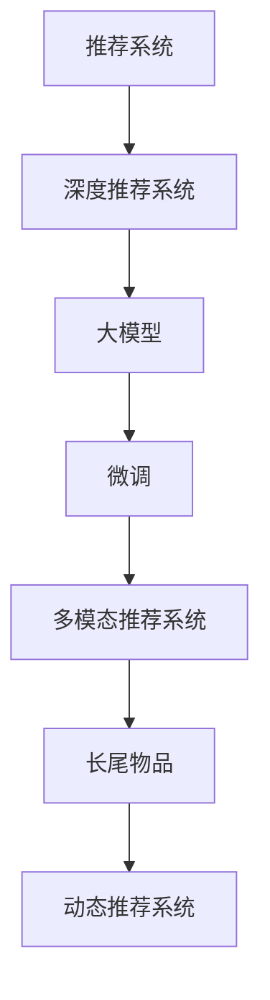

                 

# 基于大模型的推荐系统用户兴趣探索

> 关键词：推荐系统，用户兴趣探索，大模型，个性化推荐，深度学习，自然语言处理

## 1. 背景介绍

### 1.1 问题由来
随着互联网技术的不断进步，推荐系统已经成为提升用户体验、优化商业模式的重要工具。传统的协同过滤和内容推荐方法，如基于用户的协同过滤、基于内容的推荐，虽然取得了一定的成效，但依然存在诸多局限性。

- 协同过滤方法的冷启动问题。当新用户或新物品刚加入系统时，由于缺乏历史行为数据，无法进行推荐。
- 基于内容的推荐无法处理多模态数据。内容推荐依赖于静态特征，难以融合文本、图像、音频等多种模态的信息。
- 用户兴趣演进无法被及时捕捉。随着时间推移，用户兴趣会发生变化，传统的推荐方法无法适应动态变化的用户需求。
- 推荐效果受到数据稀疏性的影响。特别是对于长尾物品，推荐系统容易受到数据稀疏性的限制，导致推荐效果不佳。

近年来，随着深度学习技术和大模型的不断进步，推荐系统也开始借助大模型的力量，从用户行为和文本数据中提取更深层次的兴趣特征，进行更加精准的个性化推荐。特别是基于大模型的推荐系统，能够捕捉多模态信息，处理长尾物品，适应动态变化的兴趣演进，解决了传统推荐方法的诸多局限。

### 1.2 问题核心关键点
基于大模型的推荐系统主要通过预训练大模型和微调方法，在用户历史行为和文本数据中提取兴趣特征，生成个性化推荐结果。核心关键点包括：

- 大模型的预训练：通过在大量数据上进行自监督学习，学习通用语言知识，为后续的推荐任务提供知识基础。
- 微调方法的引入：通过微调大模型，利用少量标注数据优化模型在推荐任务上的性能。
- 多模态信息的融合：通过融合文本、图像、音频等多种信息，增强推荐系统的效果。
- 长尾物品的处理：通过处理长尾物品，扩大推荐系统的覆盖范围。
- 动态兴趣的追踪：通过跟踪用户的兴趣演进，提高推荐的动态适应性。

本文将系统介绍基于大模型的推荐系统，阐述其核心算法原理和操作步骤，并结合实际应用场景和代码实例进行详细讲解。

## 2. 核心概念与联系

### 2.1 核心概念概述

为更好地理解基于大模型的推荐系统，本节将介绍几个密切相关的核心概念：

- 推荐系统(Recommendation System)：通过用户行为、商品特征等数据，预测用户对商品可能产生的兴趣，并进行推荐。经典推荐方法包括协同过滤、内容推荐、混合推荐等。
- 深度推荐系统(Deep Recommendation System)：使用深度学习技术，特别是深度神经网络，进行推荐任务。深度推荐系统在大规模数据和复杂模型结构中表现出色，广泛应用于电商、音乐、视频等领域。
- 大模型(Large Model)：指通过在大量数据上进行自监督学习，学习通用语言或视觉知识的模型，如BERT、GPT、ResNet等。大模型参数量庞大，但可以高效地提取复杂特征，具有很强的泛化能力。
- 微调(Fine-tuning)：在大模型预训练的基础上，通过下游推荐任务的少量标注数据，优化模型在该任务上的性能。微调可以显著提升模型效果，同时减少计算和标注成本。
- 多模态推荐系统(Multimodal Recommendation System)：通过融合文本、图像、音频等多种信息，增强推荐效果。多模态推荐系统可以更好地理解用户需求，提供更加多样化的推荐内容。
- 长尾物品(Long-tail Item)：指在推荐系统中，数量较少但多样性极高的物品，如小众商品、个性化内容等。长尾物品的处理可以扩大推荐系统的覆盖范围。
- 动态推荐系统(Dynamic Recommendation System)：通过跟踪用户兴趣的变化，进行实时推荐。动态推荐系统可以更好地适应用户的兴趣演进，提升推荐效果。

这些核心概念之间的逻辑关系可以通过以下Mermaid流程图来展示：



这个流程图展示了大模型的推荐系统从设计到实现的全过程，突出了大模型、微调、多模态、长尾、动态等关键环节的相互作用。

## 3. 核心算法原理 & 具体操作步骤
### 3.1 算法原理概述

基于大模型的推荐系统，本质上是将大模型作为通用的特征提取器，通过微调方法，学习用户行为和文本数据中的复杂兴趣特征，从而生成个性化的推荐结果。

形式化地，假设大模型为 $M_{\theta}$，其中 $\theta$ 为预训练得到的模型参数。给定推荐任务 $T$ 的训练集 $D=\{(x_i, y_i)\}_{i=1}^N$，推荐任务的目标是最大化用户对推荐结果的满意度，即最大化目标函数：

$$
\max_{\theta} \mathbb{E}_{(x,y)\sim D} \left[ R(x, y; M_{\theta}) \right]
$$

其中 $R(x, y; M_{\theta})$ 为推荐系统对用户 $x$ 推荐物品 $y$ 的满意度函数，可以是点击率、购买率、满意度评分等。

基于大模型的推荐系统，主要包含以下几个步骤：

1. 在大规模数据上预训练大模型 $M_{\theta}$，学习通用的语言或视觉知识。
2. 在推荐任务上微调 $M_{\theta}$，通过少量的标注数据，优化模型在该任务上的性能。
3. 在微调后的模型上，利用用户的历史行为和文本数据，提取兴趣特征。
4. 根据兴趣特征，生成个性化推荐结果。

### 3.2 算法步骤详解

基于大模型的推荐系统通常包括以下几个关键步骤：

**Step 1: 准备预训练模型和数据集**
- 选择合适的预训练模型 $M_{\theta}$，如BERT、GPT等。
- 准备推荐任务的训练集 $D$，包括用户行为数据、物品特征数据和文本数据等。
- 将数据集划分为训练集、验证集和测试集，一般要求数据分布的一致性。

**Step 2: 设计推荐目标函数**
- 根据推荐任务，选择适合的目标函数 $R(x, y; M_{\theta})$。
- 对于点击率预测任务，可以使用二分类交叉熵损失函数。
- 对于评分预测任务，可以使用均方误差损失函数。
- 对于多目标推荐，可以设计联合目标函数。

**Step 3: 添加推荐任务适配层**
- 在预训练模型的顶部设计推荐任务的适配层，如全连接层、MLP等。
- 适配层输入为用户行为和物品特征的特征向量，输出为推荐结果。
- 适配层的参数可以通过微调进行优化，以适应特定的推荐任务。

**Step 4: 设置微调超参数**
- 选择合适的优化算法及其参数，如AdamW、SGD等，设置学习率、批大小、迭代轮数等。
- 设置正则化技术及强度，包括权重衰减、Dropout、Early Stopping等。
- 确定冻结预训练参数的策略，如仅微调适配层的参数。

**Step 5: 执行梯度训练**
- 将训练集数据分批次输入模型，前向传播计算推荐目标函数。
- 反向传播计算参数梯度，根据设定的优化算法和学习率更新模型参数。
- 周期性在验证集上评估模型性能，根据性能指标决定是否触发 Early Stopping。
- 重复上述步骤直到满足预设的迭代轮数或 Early Stopping 条件。

**Step 6: 测试和部署**
- 在测试集上评估微调后模型 $M_{\hat{\theta}}$ 的性能，对比微调前后的精度提升。
- 使用微调后的模型对新物品进行推荐，集成到实际的应用系统中。
- 持续收集新数据，定期重新微调模型，以适应数据分布的变化。

### 3.3 算法优缺点

基于大模型的推荐系统具有以下优点：
1. 高度灵活性。大模型具有很强的泛化能力，可以根据任务需求进行微调，适应多种推荐场景。
2. 高精度。利用深度学习技术，可以学习到用户行为和文本数据中的复杂特征，提升推荐效果。
3. 多模态融合。通过融合文本、图像、音频等多种信息，提供更加多样化的推荐内容。
4. 长尾覆盖。利用长尾物品的处理技术，扩大推荐系统的覆盖范围。
5. 动态适应。通过跟踪用户兴趣的演进，进行实时推荐，提高推荐系统的动态适应性。

同时，该方法也存在一定的局限性：
1. 计算成本高。大模型的参数量庞大，微调过程需要大量的计算资源。
2. 数据需求大。需要大量的标注数据进行微调，标注成本较高。
3. 模型复杂性。大模型结构复杂，训练过程容易过拟合，需要精细调参。
4. 结果可解释性不足。大模型的黑盒特性，使得推荐结果缺乏可解释性。
5. 存在冷启动问题。新用户或新物品缺乏历史数据，无法进行推荐。

尽管存在这些局限性，但就目前而言，基于大模型的推荐系统仍然是推荐领域的主流范式。未来相关研究的重点在于如何进一步降低计算成本，提高模型的可解释性，解决冷启动问题等，以进一步提升推荐系统的效果和用户体验。

### 3.4 算法应用领域

基于大模型的推荐系统已经在电商、音乐、视频、阅读等多个领域得到了广泛应用，成为推荐系统的主要技术手段。

- 电商推荐：通过用户行为和商品特征进行推荐，提升用户体验和销售额。
- 音乐推荐：根据用户听歌记录和歌词分析，推荐个性化的音乐。
- 视频推荐：通过视频标签和用户行为，推荐相关视频内容。
- 阅读推荐：利用用户阅读记录和文本情感分析，推荐适合的文章和书籍。
- 个性化推荐：通过融合多模态信息，提供更加个性化的推荐结果。

除了这些经典应用外，基于大模型的推荐系统也被创新性地应用到更多场景中，如实时推荐、个性化广告、内容生成等，为推荐系统带来了新的突破。随着大模型和推荐技术的不断进步，相信推荐系统必将在更多领域得到应用，为用户提供更加精准、个性化的推荐服务。

## 4. 数学模型和公式 & 详细讲解
### 4.1 数学模型构建

本节将使用数学语言对基于大模型的推荐系统进行更加严格的刻画。

记大模型为 $M_{\theta}$，其中 $\theta$ 为预训练得到的模型参数。假设推荐任务 $T$ 的目标函数为 $R(x, y; M_{\theta})$，训练集为 $D=\{(x_i, y_i)\}_{i=1}^N$，其中 $x_i$ 为第 $i$ 个用户的历史行为和文本数据，$y_i$ 为第 $i$ 个用户对第 $j$ 个物品的满意度评分。

定义推荐任务的目标函数为：

$$
\max_{\theta} \mathbb{E}_{(x,y)\sim D} \left[ R(x, y; M_{\theta}) \right]
$$

在实践中，我们通常使用基于梯度的优化算法（如SGD、Adam等）来近似求解上述最优化问题。设 $\eta$ 为学习率，$\lambda$ 为正则化系数，则参数的更新公式为：

$$
\theta \leftarrow \theta - \eta \nabla_{\theta}\mathcal{L}(\theta) - \eta\lambda\theta
$$

其中 $\nabla_{\theta}\mathcal{L}(\theta)$ 为损失函数对参数 $\theta$ 的梯度，可通过反向传播算法高效计算。

### 4.2 公式推导过程

以下我们以评分预测任务为例，推导均方误差损失函数及其梯度的计算公式。

假设模型 $M_{\theta}$ 在输入 $x$ 上的输出为 $\hat{y}=M_{\theta}(x) \in [0,1]$，表示用户对物品 $y$ 的评分。真实评分 $y \in [0,1]$。则均方误差损失函数定义为：

$$
\ell(M_{\theta}(x),y) = \frac{1}{N} \sum_{i=1}^N (y_i - \hat{y}_i)^2
$$

将其代入目标函数公式，得：

$$
\max_{\theta} \mathbb{E}_{(x,y)\sim D} \left[ (y_i - \hat{y}_i)^2 \right]
$$

根据链式法则，目标函数对参数 $\theta_k$ 的梯度为：

$$
\frac{\partial \mathcal{L}(\theta)}{\partial \theta_k} = -2 \mathbb{E}_{(x,y)\sim D} \left[ (y_i - \hat{y}_i) \frac{\partial \hat{y}_i}{\partial \theta_k} \right]
$$

其中 $\frac{\partial \hat{y}_i}{\partial \theta_k}$ 可进一步递归展开，利用自动微分技术完成计算。

在得到目标函数的梯度后，即可带入参数更新公式，完成模型的迭代优化。重复上述过程直至收敛，最终得到适应推荐任务的最优模型参数 $\theta^*$。

## 5. 项目实践：代码实例和详细解释说明
### 5.1 开发环境搭建

在进行推荐系统开发前，我们需要准备好开发环境。以下是使用Python进行PyTorch开发的环境配置流程：

1. 安装Anaconda：从官网下载并安装Anaconda，用于创建独立的Python环境。

2. 创建并激活虚拟环境：
```bash
conda create -n recommendation-env python=3.8 
conda activate recommendation-env
```

3. 安装PyTorch：根据CUDA版本，从官网获取对应的安装命令。例如：
```bash
conda install pytorch torchvision torchaudio cudatoolkit=11.1 -c pytorch -c conda-forge
```

4. 安装Transformers库：
```bash
pip install transformers
```

5. 安装各类工具包：
```bash
pip install numpy pandas scikit-learn matplotlib tqdm jupyter notebook ipython
```

完成上述步骤后，即可在`recommendation-env`环境中开始推荐系统开发。

### 5.2 源代码详细实现

下面我们以音乐推荐为例，给出使用Transformers库对BERT模型进行推荐系统微调的PyTorch代码实现。

首先，定义音乐推荐任务的数据处理函数：

```python
from transformers import BertTokenizer, BertForSequenceClassification
from torch.utils.data import Dataset
import torch

class MusicRecommendationDataset(Dataset):
    def __init__(self, texts, labels, tokenizer, max_len=128):
        self.texts = texts
        self.labels = labels
        self.tokenizer = tokenizer
        self.max_len = max_len
        
    def __len__(self):
        return len(self.texts)
    
    def __getitem__(self, item):
        text = self.texts[item]
        label = self.labels[item]
        
        encoding = self.tokenizer(text, return_tensors='pt', max_length=self.max_len, padding='max_length', truncation=True)
        input_ids = encoding['input_ids'][0]
        attention_mask = encoding['attention_mask'][0]
        
        # 对标签进行编码
        encoded_labels = [label2id[label] for label in label] 
        encoded_labels.extend([label2id['negative']] * (self.max_len - len(encoded_labels)))
        labels = torch.tensor(encoded_labels, dtype=torch.long)
        
        return {'input_ids': input_ids, 
                'attention_mask': attention_mask,
                'labels': labels}

# 标签与id的映射
label2id = {'positive': 1, 'negative': 0}
id2label = {v: k for k, v in label2id.items()}

# 创建dataset
tokenizer = BertTokenizer.from_pretrained('bert-base-cased')

train_dataset = MusicRecommendationDataset(train_texts, train_labels, tokenizer)
dev_dataset = MusicRecommendationDataset(dev_texts, dev_labels, tokenizer)
test_dataset = MusicRecommendationDataset(test_texts, test_labels, tokenizer)
```

然后，定义模型和优化器：

```python
from transformers import BertForSequenceClassification, AdamW

model = BertForSequenceClassification.from_pretrained('bert-base-cased', num_labels=len(label2id))

optimizer = AdamW(model.parameters(), lr=2e-5)
```

接着，定义训练和评估函数：

```python
from torch.utils.data import DataLoader
from tqdm import tqdm
from sklearn.metrics import accuracy_score

device = torch.device('cuda') if torch.cuda.is_available() else torch.device('cpu')
model.to(device)

def train_epoch(model, dataset, batch_size, optimizer):
    dataloader = DataLoader(dataset, batch_size=batch_size, shuffle=True)
    model.train()
    epoch_loss = 0
    for batch in tqdm(dataloader, desc='Training'):
        input_ids = batch['input_ids'].to(device)
        attention_mask = batch['attention_mask'].to(device)
        labels = batch['labels'].to(device)
        model.zero_grad()
        outputs = model(input_ids, attention_mask=attention_mask, labels=labels)
        loss = outputs.loss
        epoch_loss += loss.item()
        loss.backward()
        optimizer.step()
    return epoch_loss / len(dataloader)

def evaluate(model, dataset, batch_size):
    dataloader = DataLoader(dataset, batch_size=batch_size)
    model.eval()
    preds, labels = [], []
    with torch.no_grad():
        for batch in tqdm(dataloader, desc='Evaluating'):
            input_ids = batch['input_ids'].to(device)
            attention_mask = batch['attention_mask'].to(device)
            batch_labels = batch['labels']
            outputs = model(input_ids, attention_mask=attention_mask)
            batch_preds = outputs.logits.argmax(dim=2).to('cpu').tolist()
            batch_labels = batch_labels.to('cpu').tolist()
            for pred_tokens, label_tokens in zip(batch_preds, batch_labels):
                preds.append(pred_tokens[:len(label_tokens)])
                labels.append(label_tokens)
                
    return accuracy_score(labels, preds)
```

最后，启动训练流程并在测试集上评估：

```python
epochs = 5
batch_size = 16

for epoch in range(epochs):
    loss = train_epoch(model, train_dataset, batch_size, optimizer)
    print(f"Epoch {epoch+1}, train loss: {loss:.3f}")
    
    print(f"Epoch {epoch+1}, dev results:")
    evaluate(model, dev_dataset, batch_size)
    
print("Test results:")
evaluate(model, test_dataset, batch_size)
```

以上就是使用PyTorch对BERT进行音乐推荐任务微调的完整代码实现。可以看到，得益于Transformers库的强大封装，我们可以用相对简洁的代码完成BERT模型的加载和微调。

### 5.3 代码解读与分析

让我们再详细解读一下关键代码的实现细节：

**MusicRecommendationDataset类**：
- `__init__`方法：初始化文本、标签、分词器等关键组件。
- `__len__`方法：返回数据集的样本数量。
- `__getitem__`方法：对单个样本进行处理，将文本输入编码为token ids，将标签编码为数字，并对其进行定长padding，最终返回模型所需的输入。

**label2id和id2label字典**：
- 定义了标签与数字id之间的映射关系，用于将标签解码回真实标签。

**训练和评估函数**：
- 使用PyTorch的DataLoader对数据集进行批次化加载，供模型训练和推理使用。
- 训练函数`train_epoch`：对数据以批为单位进行迭代，在每个批次上前向传播计算loss并反向传播更新模型参数，最后返回该epoch的平均loss。
- 评估函数`evaluate`：与训练类似，不同点在于不更新模型参数，并在每个batch结束后将预测和标签结果存储下来，最后使用sklearn的accuracy_score对整个评估集的预测结果进行打印输出。

**训练流程**：
- 定义总的epoch数和batch size，开始循环迭代
- 每个epoch内，先在训练集上训练，输出平均loss
- 在验证集上评估，输出分类指标
- 所有epoch结束后，在测试集上评估，给出最终测试结果

可以看到，PyTorch配合Transformers库使得BERT微调的代码实现变得简洁高效。开发者可以将更多精力放在数据处理、模型改进等高层逻辑上，而不必过多关注底层的实现细节。

当然，工业级的系统实现还需考虑更多因素，如模型的保存和部署、超参数的自动搜索、更灵活的任务适配层等。但核心的微调范式基本与此类似。

## 6. 实际应用场景
### 6.1 音乐推荐系统

音乐推荐系统通过分析用户听歌历史和文本数据，预测用户对新歌曲的兴趣，生成个性化音乐推荐列表。采用大模型微调的方法，可以更好地理解用户的音乐品味，推荐更加多样化和个性化的音乐。

在技术实现上，可以收集用户听歌记录和歌词分析，构建音乐-标签映射。在此基础上对预训练语言模型进行微调，使其学习到用户对音乐的兴趣特征。将微调后的模型应用到用户输入的文本描述，如歌词、评论等，自动生成推荐列表。对于新歌曲，可以实时抓取网络音乐库，提取歌曲的特征，输入到微调模型中进行评分预测，生成推荐结果。

### 6.2 电影推荐系统

电影推荐系统通过分析用户观影历史和文本数据，预测用户对电影的兴趣，生成个性化电影推荐列表。采用大模型微调的方法，可以更好地理解用户的观影品味，推荐更加多样化和个性化的电影。

在技术实现上，可以收集用户观影记录和影评分析，构建电影-标签映射。在此基础上对预训练语言模型进行微调，使其学习到用户对电影的兴趣特征。将微调后的模型应用到用户输入的文本描述，如电影评论、影评等，自动生成推荐列表。对于新电影，可以实时抓取网络电影库，提取电影特征，输入到微调模型中进行评分预测，生成推荐结果。

### 6.3 游戏推荐系统

游戏推荐系统通过分析用户游戏历史和文本数据，预测用户对新游戏的兴趣，生成个性化游戏推荐列表。采用大模型微调的方法，可以更好地理解用户的游戏品味，推荐更加多样化和个性化的游戏。

在技术实现上，可以收集用户游戏记录和游戏评论，构建游戏-标签映射。在此基础上对预训练语言模型进行微调，使其学习到用户对游戏的兴趣特征。将微调后的模型应用到用户输入的文本描述，如游戏评论、评价等，自动生成推荐列表。对于新游戏，可以实时抓取网络游戏库，提取游戏特征，输入到微调模型中进行评分预测，生成推荐结果。

### 6.4 未来应用展望

随着大模型和微调方法的不断发展，基于大模型的推荐系统必将在更多领域得到应用，为推荐系统带来新的突破。

在智慧医疗领域，基于大模型的推荐系统可以推荐个性化诊疗方案，提升医疗服务的智能化水平。

在智能教育领域，基于大模型的推荐系统可以推荐个性化学习内容和推荐路径，因材施教，促进教育公平，提高教学质量。

在智慧城市治理中，基于大模型的推荐系统可以推荐个性化旅游路径和景点，提升城市旅游的智能化水平。

此外，在企业生产、社会治理、文娱传媒等众多领域，基于大模型的推荐系统也将不断涌现，为推荐系统带来新的活力和创新。相信随着技术的日益成熟，基于大模型的推荐系统必将成为推荐领域的主流范式，推动推荐系统向更加智能化、个性化、实时化的方向发展。

## 7. 工具和资源推荐
### 7.1 学习资源推荐

为了帮助开发者系统掌握大模型微调的理论基础和实践技巧，这里推荐一些优质的学习资源：

1. 《深度推荐系统：原理与实现》书籍：系统介绍了深度推荐系统的前沿技术和经典模型，包括基于大模型的推荐系统。

2. CS223《推荐系统》课程：斯坦福大学开设的推荐系统经典课程，有Lecture视频和配套作业，带你入门推荐系统的核心概念和算法。

3. 《推荐系统实战》书籍：深入浅出地介绍了推荐系统的理论基础和工程实现，包括基于大模型的推荐系统。

4. Kaggle推荐系统竞赛：参加Kaggle的推荐系统竞赛，可以积累实战经验，锻炼工程能力。

5. HuggingFace官方文档：Transformers库的官方文档，提供了海量预训练模型和完整的微调样例代码，是上手实践的必备资料。

通过对这些资源的学习实践，相信你一定能够快速掌握大模型微调的精髓，并用于解决实际的推荐问题。
### 7.2 开发工具推荐

高效的开发离不开优秀的工具支持。以下是几款用于大模型微调开发的常用工具：

1. PyTorch：基于Python的开源深度学习框架，灵活动态的计算图，适合快速迭代研究。大部分预训练语言模型都有PyTorch版本的实现。

2. TensorFlow：由Google主导开发的开源深度学习框架，生产部署方便，适合大规模工程应用。同样有丰富的预训练语言模型资源。

3. Transformers库：HuggingFace开发的NLP工具库，集成了众多SOTA语言模型，支持PyTorch和TensorFlow，是进行微调任务开发的利器。

4. Weights & Biases：模型训练的实验跟踪工具，可以记录和可视化模型训练过程中的各项指标，方便对比和调优。与主流深度学习框架无缝集成。

5. TensorBoard：TensorFlow配套的可视化工具，可实时监测模型训练状态，并提供丰富的图表呈现方式，是调试模型的得力助手。

6. Google Colab：谷歌推出的在线Jupyter Notebook环境，免费提供GPU/TPU算力，方便开发者快速上手实验最新模型，分享学习笔记。

合理利用这些工具，可以显著提升大模型微调的开发效率，加快创新迭代的步伐。

### 7.3 相关论文推荐

大模型和微调技术的发展源于学界的持续研究。以下是几篇奠基性的相关论文，推荐阅读：

1. Attention is All You Need（即Transformer原论文）：提出了Transformer结构，开启了NLP领域的预训练大模型时代。

2. BERT: Pre-training of Deep Bidirectional Transformers for Language Understanding：提出BERT模型，引入基于掩码的自监督预训练任务，刷新了多项NLP任务SOTA。

3. Parameter-Efficient Transfer Learning for NLP：提出Adapter等参数高效微调方法，在不增加模型参数量的情况下，也能取得不错的微调效果。

4. Parameter-Efficient Multi-task Learning：提出多任务学习的参数高效方法，进一步提升了微调的效果。

5. Dive into Dive into Deep Learning：斯坦福大学深度学习课程，系统讲解了深度学习的基本概念和经典模型，包括推荐系统的深度学习技术。

6. Neural Recommendation Models：深入介绍了推荐系统的深度学习模型，包括基于大模型的推荐系统。

这些论文代表了大模型微调技术的发展脉络。通过学习这些前沿成果，可以帮助研究者把握学科前进方向，激发更多的创新灵感。

## 8. 总结：未来发展趋势与挑战
### 8.1 总结

本文对基于大模型的推荐系统进行了全面系统的介绍。首先阐述了推荐系统的核心算法原理和操作步骤，详细讲解了微调方法在音乐推荐、电影推荐、游戏推荐等场景中的应用。其次，从原理到实践，详细介绍了基于大模型的推荐系统从数据预处理、模型微调、特征提取、推荐生成等环节的具体实现过程。最后，结合实际应用场景，探讨了基于大模型的推荐系统在智慧医疗、智能教育、智慧城市等领域的未来发展趋势和面临的挑战。

通过本文的系统梳理，可以看到，基于大模型的推荐系统已经在音乐、电影、游戏等多个领域取得了显著效果，具有高度的灵活性和应用潜力。随着深度学习技术和大模型的不断发展，未来基于大模型的推荐系统必将进一步提升推荐效果，拓展推荐场景，成为推荐系统的主流范式。

### 8.2 未来发展趋势

展望未来，基于大模型的推荐系统将呈现以下几个发展趋势：

1. 推荐系统的深度化。深度学习和大模型将进一步提升推荐系统的性能，特别是对于长尾物品的处理能力将得到显著增强。
2. 多模态融合的广泛应用。音乐、电影、游戏等领域的多模态融合推荐将更加广泛，为用户提供更加多样化的推荐内容。
3. 跨领域迁移能力的提升。大模型微调技术的不断进步，将使得推荐系统具有更强的跨领域迁移能力，提升模型的通用性和泛化能力。
4. 个性化推荐系统的普及。基于大模型的推荐系统将进一步普及，提升用户推荐系统的智能化和个性化水平。
5. 实时推荐系统的发展。随着推荐算法的优化和计算能力的提升，实时推荐系统将逐渐成为主流，提升推荐系统的时效性。
6. 动态推荐系统的应用。基于大模型的推荐系统将进一步提升对用户兴趣演进的跟踪能力，进行实时推荐。

以上趋势凸显了大模型微调技术的广阔前景。这些方向的探索发展，必将进一步提升推荐系统的性能和应用范围，为推荐系统带来新的突破。

### 8.3 面临的挑战

尽管基于大模型的推荐系统已经取得了瞩目成就，但在迈向更加智能化、普适化应用的过程中，它仍面临着诸多挑战：

1. 计算成本高昂。大模型的参数量庞大，微调过程需要大量的计算资源。
2. 数据需求大。需要大量的标注数据进行微调，标注成本较高。
3. 模型复杂性高。大模型结构复杂，训练过程容易过拟合，需要精细调参。
4. 结果可解释性不足。大模型的黑盒特性，使得推荐结果缺乏可解释性。
5. 存在冷启动问题。新用户或新物品缺乏历史数据，无法进行推荐。

尽管存在这些局限性，但就目前而言，基于大模型的推荐系统仍然是推荐领域的主流范式。未来相关研究的重点在于如何进一步降低计算成本，提高模型的可解释性，解决冷启动问题等，以进一步提升推荐系统的效果和用户体验。

### 8.4 研究展望

面对基于大模型的推荐系统所面临的种种挑战，未来的研究需要在以下几个方面寻求新的突破：

1. 探索无监督和半监督微调方法。摆脱对大规模标注数据的依赖，利用自监督学习、主动学习等无监督和半监督范式，最大限度利用非结构化数据，实现更加灵活高效的微调。
2. 研究参数高效和计算高效的微调范式。开发更加参数高效的微调方法，在固定大部分预训练参数的同时，只更新极少量的任务相关参数。同时优化微调模型的计算图，减少前向传播和反向传播的资源消耗，实现更加轻量级、实时性的部署。
3. 融合因果和对比学习范式。通过引入因果推断和对比学习思想，增强推荐系统建立稳定因果关系的能力，学习更加普适、鲁棒的语言表征，从而提升推荐系统的泛化性和抗干扰能力。
4. 引入更多先验知识。将符号化的先验知识，如知识图谱、逻辑规则等，与神经网络模型进行巧妙融合，引导微调过程学习更准确、合理的语言模型。同时加强不同模态数据的整合，实现视觉、语音等多模态信息与文本信息的协同建模。
5. 结合因果分析和博弈论工具。将因果分析方法引入推荐系统，识别出推荐决策的关键特征，增强推荐结果的因果性和逻辑性。借助博弈论工具刻画人机交互过程，主动探索并规避推荐系统的脆弱点，提高系统稳定性。
6. 纳入伦理道德约束。在推荐系统训练目标中引入伦理导向的评估指标，过滤和惩罚有偏见、有害的输出倾向。同时加强人工干预和审核，建立推荐系统的监管机制，确保输出的安全性。

这些研究方向的探索，必将引领基于大模型的推荐系统向更高的台阶，为推荐系统带来新的突破。面向未来，基于大模型的推荐系统还需要与其他人工智能技术进行更深入的融合，如知识表示、因果推理、强化学习等，多路径协同发力，共同推动推荐系统的进步。只有勇于创新、敢于突破，才能不断拓展推荐系统的边界，让推荐系统更好地服务于用户。

## 9. 附录：常见问题与解答

**Q1：大模型推荐系统是否适用于所有推荐场景？**

A: 大模型推荐系统在大多数推荐场景中都能取得不错的效果，特别是对于数据量较小的推荐任务。但对于一些特定领域的推荐任务，如医疗、法律等，仅仅依靠通用语料预训练的模型可能难以很好地适应。此时需要在特定领域语料上进一步预训练，再进行微调，才能获得理想效果。此外，对于一些需要时效性、个性化很强的任务，如实时推荐、个性化广告等，微调方法也需要针对性的改进优化。

**Q2：如何降低大模型推荐系统的计算成本？**

A: 降低计算成本是当前基于大模型推荐系统面临的重要挑战之一。以下是一些可能的解决方案：
1. 优化模型结构。通过剪枝、量化等技术，减少模型的参数量和计算量。
2. 使用分布式训练。通过多机分布式训练，并行化模型参数更新，提升训练效率。
3. 迁移学习。在多个推荐任务间共享预训练模型，减少重复计算。
4. 模型压缩和剪枝。通过剪枝和量化等技术，压缩模型参数，减少内存占用。
5. 数据增强。通过数据增强技术，增加训练集的多样性，提升模型的泛化能力。

这些方法可以结合使用，共同降低基于大模型推荐系统的计算成本。

**Q3：如何提高大模型推荐系统的可解释性？**

A: 大模型推荐系统的黑盒特性，使得推荐结果缺乏可解释性。以下是一些可能的解决方案：
1. 模型可解释性技术。通过引入可解释性技术，如LIME、SHAP等，对推荐过程进行可视化分析，解释模型的决策机制。
2. 数据可视化。通过可视化用户行为数据和文本数据，分析推荐模型的影响因素，解释推荐结果的来源。
3. 用户反馈机制。引入用户反馈机制，收集用户对推荐结果的评价，进行模型优化和调整。
4. 人工干预。通过人工干预和审核，对推荐结果进行审核和修正，提升模型的可信度。

这些方法可以结合使用，共同提升大模型推荐系统的可解释性，增强用户对推荐结果的信任感。

**Q4：如何解决大模型推荐系统的冷启动问题？**

A: 冷启动问题是基于大模型推荐系统面临的重要挑战之一。以下是一些可能的解决方案：
1. 利用多源数据。结合用户行为数据、社交网络数据、兴趣问卷等，补充数据量，提高模型的初始化质量。
2. 引入知识图谱。通过知识图谱，增加推荐系统的背景知识，提升模型的初始化质量。
3. 预训练模型微调。在特定领域语料上进行预训练，提高模型的领域适应能力。
4. 推荐算法优化。通过优化推荐算法，增加推荐的灵活性和多样性，缓解冷启动问题。

这些方法可以结合使用，共同解决大模型推荐系统的冷启动问题，提升模型的初始化质量和推荐效果。

---

作者：禅与计算机程序设计艺术 / Zen and the Art of Computer Programming

