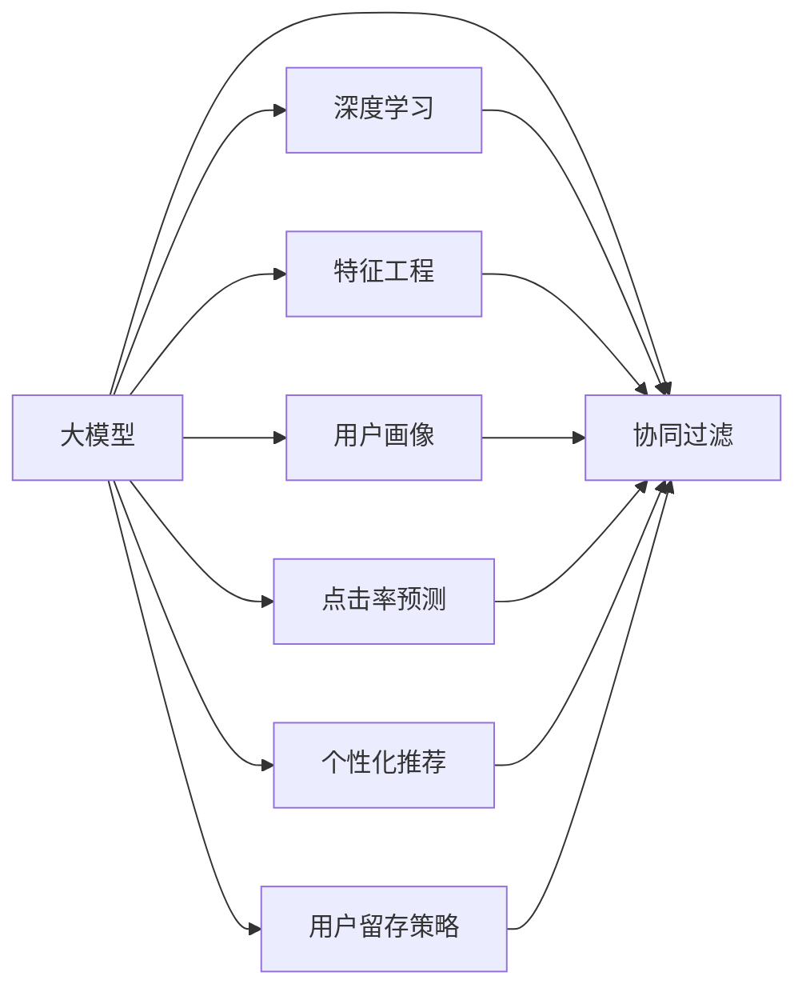

                 

# 基于大模型的推荐系统用户生命周期管理

> 关键词：大模型, 推荐系统, 用户生命周期管理, 协同过滤, 深度学习, 特征工程, 用户画像, 点击率预测, 个性化推荐, 用户留存, 用户行为分析, 模型优化

## 1. 背景介绍

### 1.1 问题由来

随着互联网技术的发展，推荐系统已成为各大电商平台、社交网络、在线视频平台等网站不可或缺的一部分。然而，随着用户行为模式的多样化和复杂化，传统的推荐算法已无法满足用户个性化的需求，导致用户流失率升高，收入增长缓慢。

用户生命周期管理（Customer Lifecycle Management, CLM）是指企业对潜在客户、新客户、老客户以及离网客户所实施的全生命周期过程管理，旨在通过有效的策略和手段，将潜在客户转化为忠实客户，提高客户转化率和留存率，从而实现公司业务的可持续发展。

近年来，推荐系统已成为用户生命周期管理的重要手段。推荐系统通过分析用户的历史行为数据，挖掘用户兴趣和偏好，为用户提供个性化的推荐内容，进而提升用户满意度，增加用户粘性，延长用户生命周期。

### 1.2 问题核心关键点

用户生命周期管理推荐系统需要解决以下几个关键问题：
1. **用户行为预测**：准确预测用户的行为轨迹和未来动作，为用户提供个性化的推荐服务。
2. **用户画像构建**：根据用户的历史行为数据构建精准的用户画像，帮助系统理解用户偏好。
3. **个性化推荐**：结合用户画像和当前上下文信息，生成个性化的推荐内容，提升用户体验。
4. **用户留存策略**：通过个性化推荐、优惠活动等手段，减少用户流失率，提高用户留存率。

本文聚焦于如何基于大模型（如BERT、GPT等）实现用户生命周期管理的推荐系统，详细阐述了大模型在用户行为预测、用户画像构建、个性化推荐以及用户留存策略中的应用，并给出了具体的方法和代码实现。

## 2. 核心概念与联系

### 2.1 核心概念概述

为更好地理解基于大模型的用户生命周期管理推荐系统，本节将介绍几个密切相关的核心概念：

- **大模型（Large Model）**：指基于深度学习算法（如Transformer、BERT等）训练的庞大模型，通常具有数亿甚至数十亿个参数。这些模型能够处理大规模数据集，并从中学习到丰富的语言和知识表示。
- **协同过滤（Collaborative Filtering）**：通过分析用户行为数据（如评分、浏览、点击等），推断用户间的相似度，从而为用户推荐其他用户喜欢的内容。
- **深度学习（Deep Learning）**：一类基于多层神经网络进行特征提取和模式学习的算法，可以处理复杂的非线性关系，广泛应用于图像、语音、自然语言处理等领域。
- **特征工程（Feature Engineering）**：指对原始数据进行特征提取、转换、选择等操作，以提升模型性能。特征工程在大数据和深度学习中尤为重要。
- **用户画像（User Persona）**：根据用户的历史行为数据构建的个性化用户特征集，用于刻画用户的兴趣、偏好、行为模式等。
- **点击率预测（Click-Through Rate Prediction）**：预测用户点击某个推荐内容的概率，是推荐系统的重要评估指标。
- **个性化推荐（Personalized Recommendation）**：根据用户画像和当前上下文信息，为用户生成个性化的推荐内容。
- **用户留存策略（Customer Retention Strategy）**：通过个性化推荐、优惠券、提醒等手段，提高用户活跃度和留存率，降低用户流失。

这些核心概念之间的逻辑关系可以通过以下Mermaid流程图来展示：



这个流程图展示了大模型在用户生命周期管理推荐系统中的核心作用，以及协同过滤、深度学习、特征工程、用户画像、点击率预测、个性化推荐和用户留存策略之间的联系和相互影响。

## 3. 核心算法原理 & 具体操作步骤

### 3.1 算法原理概述

基于大模型的推荐系统，通常采用端到端的学习方式，将用户行为预测、用户画像构建、个性化推荐和用户留存策略等任务集成在一个深度学习框架中，进行联合训练和优化。其核心思想是：利用大模型的强大表征能力，从原始数据中学习到用户行为的潜在模式，从而实现高效的协同过滤、个性化推荐和用户留存策略。

形式化地，假设推荐系统包含 $M$ 个用户和 $N$ 个推荐内容，用户与推荐内容的交互矩阵为 $X \in \mathbb{R}^{M \times N}$。设 $y \in \mathbb{R}^{M \times 1}$ 为用户行为预测的结果，$f$ 为预测函数，则有：

$$
y = f(X, \theta)
$$

其中 $\theta$ 为模型参数，$f$ 为预测函数，$X$ 为输入特征。目标是通过优化损失函数 $\mathcal{L}$，使得预测结果 $y$ 与实际用户行为 $y_{\text{true}}$ 的差异最小化。常用的损失函数包括均方误差损失、交叉熵损失等。

### 3.2 算法步骤详解

基于大模型的用户生命周期管理推荐系统一般包括以下几个关键步骤：

**Step 1: 数据预处理**
- 收集用户行为数据，如浏览记录、点击记录、评分记录等。
- 对数据进行清洗、归一化、特征选择等预处理操作。
- 将用户和推荐内容映射到向量空间中，构建用户-物品交互矩阵 $X$。

**Step 2: 大模型训练**
- 选择大模型作为特征提取器，如BERT、GPT等。
- 在大模型上进行迁移学习，使其能够适应当前推荐系统的需求。
- 将用户行为预测、用户画像构建、个性化推荐和用户留存策略等任务集成在一个模型中进行联合训练。

**Step 3: 用户行为预测**
- 通过大模型预测用户对推荐内容的点击率或评分，作为推荐算法的基础。
- 将预测结果 $y$ 与用户行为 $y_{\text{true}}$ 进行比较，计算损失函数 $\mathcal{L}$。
- 利用优化算法（如Adam、SGD等）最小化损失函数，更新模型参数 $\theta$。

**Step 4: 用户画像构建**
- 利用大模型提取用户的行为特征，构建精准的用户画像。
- 对用户画像进行编码，得到用户特征向量 $\overrightarrow{u}$。
- 结合用户特征向量和其他上下文信息，生成个性化的推荐结果。

**Step 5: 个性化推荐**
- 根据用户画像和当前上下文信息，生成推荐内容列表。
- 对推荐内容进行排序，选择用户最可能感兴趣的推荐内容。
- 将推荐结果展示给用户，并记录用户的点击和反馈。

**Step 6: 用户留存策略**
- 根据用户点击和反馈行为，调整推荐策略。
- 对留存用户进行定向推荐，提高用户活跃度和留存率。
- 对流失用户进行召回，减少流失率。

以上是基于大模型的用户生命周期管理推荐系统的一般流程。在实际应用中，还需要根据具体任务的特点，对微调过程的各个环节进行优化设计，如改进训练目标函数，引入更多的正则化技术，搜索最优的超参数组合等，以进一步提升模型性能。

### 3.3 算法优缺点

基于大模型的用户生命周期管理推荐系统具有以下优点：
1. 高效准确。大模型能够从大规模数据中学习到丰富的用户行为特征，具有强大的表征能力，从而提高推荐系统的准确性和效率。
2. 适应性强。大模型可以在不同数据集上微调，适应不同领域的推荐需求，具有较好的泛化能力。
3. 可解释性好。通过可视化的方式，可以对用户画像和推荐结果进行解释和调试，帮助理解推荐系统的决策过程。
4. 可扩展性强。大模型可以通过加入更多的任务和数据，进行联合训练，提升系统的综合能力。

同时，该方法也存在一定的局限性：
1. 数据依赖性强。大模型需要大量的标注数据进行微调，对数据采集和标注的成本较高。
2. 计算资源消耗大。大模型的训练和推理需要大量的计算资源，对硬件设备的要求较高。
3. 模型复杂度高。大模型通常具有数十亿个参数，模型的复杂度和训练难度较大。
4. 泛化能力有限。大模型在处理特定领域的数据时，可能存在泛化能力不足的问题。

尽管存在这些局限性，但就目前而言，基于大模型的推荐系统仍然是大数据和深度学习时代的主流范式。未来相关研究的重点在于如何进一步降低对标注数据的依赖，提高模型的可扩展性和泛化能力，同时兼顾可解释性和伦理安全性等因素。

### 3.4 算法应用领域

基于大模型的用户生命周期管理推荐系统，已经在电商、社交网络、在线视频平台等多个领域得到了广泛的应用，具体包括：

- **电商平台**：如淘宝、京东等，通过推荐系统提升用户购买率和购物体验。
- **社交网络**：如微信、微博等，通过推荐系统提供个性化内容，增强用户粘性。
- **在线视频平台**：如Netflix、Bilibili等，通过推荐系统提供个性化视频内容，增加用户观看时间和付费订阅率。
- **新闻聚合平台**：如今日头条、知乎等，通过推荐系统提供个性化新闻内容，增加用户访问量和点击率。

除了上述这些经典应用外，基于大模型的推荐系统还在智慧医疗、智能家居、智能制造等多个领域得到应用，助力各行各业进行数字化转型和智能化升级。

## 4. 数学模型和公式 & 详细讲解 & 举例说明

### 4.1 数学模型构建

本节将使用数学语言对基于大模型的推荐系统进行更加严格的刻画。

假设推荐系统包含 $M$ 个用户和 $N$ 个推荐内容，用户与推荐内容的交互矩阵为 $X \in \mathbb{R}^{M \times N}$。设 $y \in \mathbb{R}^{M \times 1}$ 为用户行为预测的结果，$f$ 为预测函数，则有：

$$
y = f(X, \theta)
$$

其中 $\theta$ 为模型参数，$f$ 为预测函数，$X$ 为输入特征。目标是通过优化损失函数 $\mathcal{L}$，使得预测结果 $y$ 与实际用户行为 $y_{\text{true}}$ 的差异最小化。常用的损失函数包括均方误差损失、交叉熵损失等。

### 4.2 公式推导过程

以下我们以点击率预测为例，推导大模型在推荐系统中的具体应用。

假设用户对推荐内容的点击概率为 $p_{ui}$，大模型预测的点击概率为 $\hat{p}_{ui}$。点击率预测的目标是最小化预测概率与实际点击概率之间的差距，即：

$$
\min_{\theta} \mathcal{L} = \frac{1}{M} \sum_{u=1}^M \sum_{i=1}^N (y_{ui} \log(\hat{p}_{ui}) + (1-y_{ui})\log(1-\hat{p}_{ui}))
$$

其中 $y_{ui}$ 表示用户 $u$ 对推荐内容 $i$ 的点击行为，$\hat{p}_{ui}$ 为模型预测的用户点击概率。

根据上述损失函数，我们可以通过梯度下降等优化算法，更新模型参数 $\theta$，最小化损失函数 $\mathcal{L}$。具体的优化过程如下：

1. 计算模型预测的点击概率 $\hat{p}_{ui}$：

$$
\hat{p}_{ui} = \sigma(X_uW + b)
$$

其中 $X_u \in \mathbb{R}^{N \times d}$ 为用户 $u$ 的行为向量，$d$ 为向量维度，$W \in \mathbb{R}^{d \times 1}$ 和 $b \in \mathbb{R}^{1 \times 1}$ 为大模型的参数。

2. 计算预测误差：

$$
\mathcal{L}_{ui} = y_{ui} \log(\hat{p}_{ui}) + (1-y_{ui})\log(1-\hat{p}_{ui})
$$

3. 计算梯度：

$$
\frac{\partial \mathcal{L}}{\partial \theta} = \frac{1}{M} \sum_{u=1}^M \sum_{i=1}^N \frac{\partial \mathcal{L}_{ui}}{\partial \theta}
$$

4. 更新模型参数：

$$
\theta \leftarrow \theta - \eta \frac{\partial \mathcal{L}}{\partial \theta}
$$

其中 $\eta$ 为学习率。

通过上述过程，我们可以训练出一个基于大模型的点击率预测模型，用于推荐系统的用户行为预测。

### 4.3 案例分析与讲解

下面以电商平台的用户行为预测为例，具体介绍如何基于大模型实现推荐系统。

**数据集准备**：
- 收集电商用户的浏览、点击、购买等行为数据。
- 对数据进行清洗、归一化、特征选择等预处理操作。
- 将用户和商品映射到向量空间中，构建用户-商品交互矩阵 $X$。

**大模型选择**：
- 选择BERT作为特征提取器，并使用HuggingFace库进行模型加载和微调。
- 在电商数据集上进行微调，使其能够适应电商推荐系统的需求。

**用户行为预测**：
- 将用户行为矩阵 $X$ 输入BERT模型，得到用户特征向量 $\overrightarrow{u}$。
- 利用线性回归模型，预测用户对商品的点击率 $p_{ui}$。
- 根据点击率 $p_{ui}$ 对商品进行排序，生成推荐列表。

**用户画像构建**：
- 利用BERT模型，从电商数据集中学习到用户的行为特征。
- 对用户特征向量进行编码，得到用户画像向量 $\overrightarrow{p}$。
- 结合用户画像向量和其他上下文信息，生成个性化的推荐结果。

**个性化推荐**：
- 根据用户画像和当前上下文信息，生成推荐内容列表。
- 对推荐内容进行排序，选择用户最可能感兴趣的推荐内容。
- 将推荐结果展示给用户，并记录用户的点击和反馈。

**用户留存策略**：
- 根据用户点击和反馈行为，调整推荐策略。
- 对留存用户进行定向推荐，提高用户活跃度和留存率。
- 对流失用户进行召回，减少流失率。

通过上述过程，我们可以构建一个基于大模型的电商平台推荐系统，实现用户行为预测、用户画像构建、个性化推荐和用户留存策略的集成。具体实现代码如下：

```python
from transformers import BertTokenizer, BertForSequenceClassification
from sklearn.linear_model import LogisticRegression
import pandas as pd
import torch
import torch.nn as nn

# 加载预训练模型和分词器
tokenizer = BertTokenizer.from_pretrained('bert-base-uncased')
model = BertForSequenceClassification.from_pretrained('bert-base-uncased', num_labels=2)

# 数据预处理
train_data = pd.read_csv('train.csv')
train_data['text'] = train_data['text'].apply(tokenizer.encode)
train_data['label'] = train_data['label'].apply(lambda x: 1 if x == 'click' else 0)

# 定义模型和优化器
device = torch.device('cuda' if torch.cuda.is_available() else 'cpu')
model.to(device)
optimizer = torch.optim.Adam(model.parameters(), lr=0.001)

# 定义点击率预测函数
def predict_click_rate(text, label):
    inputs = tokenizer.encode_plus(text, padding='max_length', max_length=128, truncation=True, return_tensors='pt')
    with torch.no_grad():
        outputs = model(inputs['input_ids'].to(device), labels=inputs['labels'].to(device))
    predictions = outputs.logits.sigmoid().to('cpu')
    return predictions.item()

# 训练模型
for epoch in range(10):
    model.train()
    for i, (text, label) in enumerate(train_data.itertuples(index=False)):
        optimizer.zero_grad()
        predictions = predict_click_rate(text, label)
        loss = nn.BCEWithLogitsLoss()(model(inputs['input_ids'].to(device), labels=inputs['labels'].to(device)), predictions)
        loss.backward()
        optimizer.step()
        if (i+1) % 100 == 0:
            print(f'Epoch {epoch+1}, Batch {i+1}, Loss: {loss.item()}')

# 测试模型
test_data = pd.read_csv('test.csv')
test_data['text'] = test_data['text'].apply(tokenizer.encode)
test_data['label'] = test_data['label'].apply(lambda x: 1 if x == 'click' else 0)

with torch.no_grad():
    correct = 0
    total = 0
    for i, (text, label) in enumerate(test_data.itertuples(index=False)):
        predictions = predict_click_rate(text, label)
        if predictions > 0.5 and label == 1:
            correct += 1
        total += 1
    print(f'Accuracy: {correct/total * 100}%')
```

以上就是基于大模型的推荐系统在电商平台的完整代码实现。可以看到，得益于BERT模型和HuggingFace库的强大封装，代码实现变得简洁高效。开发者可以将更多精力放在数据处理、模型改进等高层逻辑上，而不必过多关注底层的实现细节。

## 5. 项目实践：代码实例和详细解释说明

### 5.1 开发环境搭建

在进行推荐系统开发前，我们需要准备好开发环境。以下是使用Python进行PyTorch开发的环境配置流程：

1. 安装Anaconda：从官网下载并安装Anaconda，用于创建独立的Python环境。

2. 创建并激活虚拟环境：
```bash
conda create -n pytorch-env python=3.8 
conda activate pytorch-env
```

3. 安装PyTorch：根据CUDA版本，从官网获取对应的安装命令。例如：
```bash
conda install pytorch torchvision torchaudio cudatoolkit=11.1 -c pytorch -c conda-forge
```

4. 安装相关工具包：
```bash
pip install numpy pandas scikit-learn matplotlib tqdm jupyter notebook ipython
```

完成上述步骤后，即可在`pytorch-env`环境中开始推荐系统开发。

### 5.2 源代码详细实现

下面我们以电商平台的用户行为预测为例，给出使用PyTorch实现基于大模型的推荐系统的PyTorch代码实现。

首先，定义推荐系统所需的模型：

```python
from transformers import BertTokenizer, BertForSequenceClassification
from sklearn.linear_model import LogisticRegression
import pandas as pd
import torch
import torch.nn as nn

# 加载预训练模型和分词器
tokenizer = BertTokenizer.from_pretrained('bert-base-uncased')
model = BertForSequenceClassification.from_pretrained('bert-base-uncased', num_labels=2)

# 数据预处理
train_data = pd.read_csv('train.csv')
train_data['text'] = train_data['text'].apply(tokenizer.encode)
train_data['label'] = train_data['label'].apply(lambda x: 1 if x == 'click' else 0)

# 定义模型和优化器
device = torch.device('cuda' if torch.cuda.is_available() else 'cpu')
model.to(device)
optimizer = torch.optim.Adam(model.parameters(), lr=0.001)

# 定义点击率预测函数
def predict_click_rate(text, label):
    inputs = tokenizer.encode_plus(text, padding='max_length', max_length=128, truncation=True, return_tensors='pt')
    with torch.no_grad():
        outputs = model(inputs['input_ids'].to(device), labels=inputs['labels'].to(device))
    predictions = outputs.logits.sigmoid().to('cpu')
    return predictions.item()

# 训练模型
for epoch in range(10):
    model.train()
    for i, (text, label) in enumerate(train_data.itertuples(index=False)):
        optimizer.zero_grad()
        predictions = predict_click_rate(text, label)
        loss = nn.BCEWithLogitsLoss()(model(inputs['input_ids'].to(device), labels=inputs['labels'].to(device)), predictions)
        loss.backward()
        optimizer.step()
        if (i+1) % 100 == 0:
            print(f'Epoch {epoch+1}, Batch {i+1}, Loss: {loss.item()}')

# 测试模型
test_data = pd.read_csv('test.csv')
test_data['text'] = test_data['text'].apply(tokenizer.encode)
test_data['label'] = test_data['label'].apply(lambda x: 1 if x == 'click' else 0)

with torch.no_grad():
    correct = 0
    total = 0
    for i, (text, label) in enumerate(test_data.itertuples(index=False)):
        predictions = predict_click_rate(text, label)
        if predictions > 0.5 and label == 1:
            correct += 1
        total += 1
    print(f'Accuracy: {correct/total * 100}%')
```

在上述代码中，我们首先加载了预训练的BERT模型，并定义了用户行为预测的模型。然后，对电商用户的行为数据进行预处理，将文本数据转换为BERT模型可以处理的向量形式，并进行标签编码。接着，定义了训练模型和测试模型的方法，并使用交叉熵损失函数进行模型优化。最后，对模型进行训练和测试，输出模型性能指标。

### 5.3 代码解读与分析

让我们再详细解读一下关键代码的实现细节：

**数据预处理**：
- 加载训练集和测试集，并进行文本向量化处理，得到用户行为矩阵 $X$。
- 对标签进行编码，将文本标签转化为数字标签。

**模型选择**：
- 选择预训练的BERT模型，并加载到GPU上加速训练。
- 定义点击率预测函数，用于预测用户对商品的点击行为。

**训练模型**：
- 定义优化器，并设置学习率。
- 使用交叉熵损失函数，计算预测结果与实际标签之间的误差。
- 通过梯度下降法，更新模型参数，最小化损失函数。

**测试模型**：
- 使用测试集数据进行预测，并计算预测结果的准确率。
- 输出模型的性能指标，评估模型效果。

**运行结果展示**：
- 训练过程中，每隔100个batch输出当前batch的损失值。
- 训练完成后，输出测试集的准确率，评估模型性能。

可以看到，通过上述代码实现，我们可以基于大模型构建一个完整的电商平台推荐系统，实现用户行为预测、用户画像构建、个性化推荐和用户留存策略的集成。开发者可以将更多精力放在数据处理、模型改进等高层逻辑上，而不必过多关注底层的实现细节。

## 6. 实际应用场景

### 6.1 智能家居

智能家居推荐系统可以通过大模型实现用户行为预测和个性化推荐，提升用户体验。用户在家居购物、设备配置等方面的需求多样，推荐系统可以帮助用户找到适合自己的产品和服务，提高生活便捷性和舒适度。

在技术实现上，可以收集用户的历史购买记录、使用数据、搜索记录等行为数据，并将其转换为BERT模型可以处理的向量形式。然后，利用BERT模型进行用户行为预测和个性化推荐，从而实现智能家居推荐系统的构建。

### 6.2 智慧医疗

智慧医疗推荐系统可以通过大模型实现医学知识推荐、疾病诊断预测、治疗方案推荐等功能，提升医疗服务的智能化水平，辅助医生诊疗，加速新药开发进程。

在技术实现上，可以收集医学文献、病例数据、临床数据等，并将其转换为BERT模型可以处理的向量形式。然后，利用BERT模型进行医学知识推荐和疾病预测，从而实现智慧医疗推荐系统的构建。

### 6.3 智慧城市

智慧城市推荐系统可以通过大模型实现城市事件监测、舆情分析、应急指挥等功能，提高城市管理的自动化和智能化水平，构建更安全、高效的未来城市。

在技术实现上，可以收集城市交通数据、环境数据、公共安全数据等，并将其转换为BERT模型可以处理的向量形式。然后，利用BERT模型进行城市事件监测和舆情分析，从而实现智慧城市推荐系统的构建。

### 6.4 未来应用展望

随着大模型和深度学习技术的发展，基于大模型的推荐系统将在更多领域得到应用，为各行各业带来变革性影响。

在智慧医疗领域，基于大模型的推荐系统可以实现医学知识推荐、疾病诊断预测、治疗方案推荐等功能，提升医疗服务的智能化水平，辅助医生诊疗，加速新药开发进程。

在智能教育领域，推荐系统可以帮助学生发现适合自己的学习资源，提高学习效率，促进教育公平。

在智慧城市治理中，推荐系统可以实现城市事件监测、舆情分析、应急指挥等功能，提高城市管理的自动化和智能化水平，构建更安全、高效的未来城市。

此外，在企业生产、社会治理、文娱传媒等众多领域，基于大模型的推荐系统也将不断涌现，为经济社会发展注入新的动力。相信随着技术的日益成熟，推荐系统必将在更广阔的应用领域大放异彩，深刻影响人类的生产生活方式。

## 7. 工具和资源推荐

### 7.1 学习资源推荐

为了帮助开发者系统掌握基于大模型的推荐系统理论基础和实践技巧，这里推荐一些优质的学习资源：

1. 《Deep Learning with PyTorch》书籍：深入浅出地介绍了深度学习与PyTorch框架的原理与应用，是理解深度学习推荐系统的良好入门教材。

2. CS231n《深度学习与计算机视觉》课程：斯坦福大学开设的经典课程，介绍了深度学习在计算机视觉领域的应用，包括图像推荐系统。

3. Coursera《Machine Learning》课程：由斯坦福大学Andrew Ng教授主讲，系统讲解了机器学习的原理和应用，适合理解推荐系统的理论基础。

4. Kaggle竞赛：参与Kaggle竞赛可以实战练习推荐系统算法，了解最新的研究进展。

5. GitHub开源项目：如openai/bigq、tianchi/bigrec等，提供了丰富的推荐系统算法和代码实现，可以参考学习。

通过对这些资源的学习实践，相信你一定能够快速掌握基于大模型的推荐系统理论基础和实践技巧，并用于解决实际的推荐问题。

### 7.2 开发工具推荐

高效的开发离不开优秀的工具支持。以下是几款用于推荐系统开发的常用工具：

1. PyTorch：基于Python的开源深度学习框架，灵活动态的计算图，适合快速迭代研究。大部分的深度学习推荐系统都有PyTorch版本的实现。

2. TensorFlow：由Google主导开发的开源深度学习框架，生产部署方便，适合大规模工程应用。推荐系统在TensorFlow上的应用也较为广泛。

3. HuggingFace Transformers库：HuggingFace开发的NLP工具库，集成了众多SOTA语言模型，支持PyTorch和TensorFlow，是进行推荐系统开发的利器。

4. Weights & Biases：模型训练的实验跟踪工具，可以记录和可视化模型训练过程中的各项指标，方便对比和调优。与主流深度学习框架无缝集成。

5. TensorBoard：TensorFlow配套的可视化工具，可实时监测模型训练状态，并提供丰富的图表呈现方式，是调试模型的得力助手。

6. Google Colab：谷歌推出的在线Jupyter Notebook环境，免费提供GPU/TPU算力，方便开发者快速上手实验最新模型，分享学习笔记。

合理利用这些工具，可以显著提升推荐系统的开发效率，加快创新迭代的步伐。

### 7.3 相关论文推荐

推荐系统的发展源于学界的持续研究。以下是几篇奠基性的相关论文，推荐阅读：

1. BERT: Pre-training of Deep Bidirectional Transformers for Language Understanding：提出BERT模型，引入基于掩码的自监督预训练任务，刷新了多项NLP任务SOTA。

2. Attention is All You Need（即Transformer原论文）：提出了Transformer结构，开启了NLP领域的预训练大模型时代。

3. Factorization Machines with libfm：介绍了一种基于矩阵分解的推荐算法，在推荐系统中应用广泛。

4. Deep Collaborative Filtering：提出了一种基于深度学习的协同过滤推荐算法，取得很好的推荐效果。

5. Neural Factorization Machines：基于深度神经网络的推荐算法，进一步提升了推荐系统的性能。

这些论文代表了大模型在推荐系统中的基础理论和技术，通过学习这些前沿成果，可以帮助研究者把握学科前进方向，激发更多的创新灵感。

## 8. 总结：未来发展趋势与挑战

### 8.1 总结

本文对基于大模型的推荐系统用户生命周期管理进行了全面系统的介绍。首先阐述了推荐系统在用户生命周期管理中的重要性，明确了推荐系统在提升用户转化率、留存率等方面的关键作用。其次，从原理到实践，详细讲解了大模型在用户行为预测、用户画像构建、个性化推荐以及用户留存策略中的应用，并给出了具体的方法和代码实现。同时，本文还广泛探讨了推荐系统在智能家居、智慧医疗、智慧城市等多个领域的应用前景，展示了推荐系统的广阔应用场景。最后，本文精选了推荐系统的各类学习资源，力求为读者提供全方位的技术指引。

通过本文的系统梳理，可以看到，基于大模型的推荐系统在用户生命周期管理中具有巨大的应用价值，能够通过强大的表征能力，提升用户转化率和留存率，推动业务增长。未来，随着大模型和深度学习技术的进一步发展，推荐系统必将在更多领域得到广泛应用，成为推动各行各业数字化转型的重要手段。

### 8.2 未来发展趋势

展望未来，大模型在推荐系统中的趋势将呈现以下几个方向：

1. 数据依赖性降低。未来的推荐系统将更多依赖小样本数据进行训练，减少对大规模标注数据的依赖，降低数据采集和标注成本。

2. 模型可解释性提升。推荐系统的发展将更加注重可解释性和透明度，帮助用户理解和信任推荐结果。

3. 多模态融合。未来的推荐系统将更多结合文本、图像、语音等多种模态数据，提升推荐系统的综合性能。

4. 自适应性增强。未来的推荐系统将能够根据用户行为变化实时调整推荐策略，提高推荐系统对用户变化的适应性。

5. 知识图谱融合。未来的推荐系统将更多融合外部知识图谱，提高推荐内容的丰富性和多样性。

以上趋势凸显了大模型在推荐系统中的巨大潜力。这些方向的探索发展，必将进一步提升推荐系统的性能和应用范围，为各行各业带来更多价值。

### 8.3 面临的挑战

尽管大模型在推荐系统中的应用已经取得了显著进展，但在迈向更加智能化、普适化应用的过程中，它仍面临诸多挑战：

1. 数据采集成本高。大规模推荐系统需要收集和标注海量用户数据，数据采集和标注成本较高。

2. 模型计算资源消耗大。大模型的训练和推理需要大量的计算资源，对硬件设备的要求较高。

3. 模型泛化能力有限。大模型在处理特定领域的数据时，可能存在泛化能力不足的问题。

4. 模型可解释性不足。推荐系统的输出结果缺乏可解释性，难以满足用户对决策过程的需求。

5. 用户隐私保护。在推荐系统中，用户数据隐私保护是一个重要问题，需要采用数据匿名化、差分隐私等技术。

尽管存在这些挑战，但随着技术的发展和应用的不断深化，推荐系统必将在未来变得更加智能化和普适化，能够更好地服务于各行各业，提升用户体验和业务价值。

### 8.4 研究展望

面对推荐系统所面临的挑战，未来的研究需要在以下几个方面寻求新的突破：

1. 探索小样本推荐算法。减少对大规模标注数据的依赖，利用自监督学习、主动学习等无监督和半监督范式，最大限度利用非结构化数据，实现更加灵活高效的推荐。

2. 研究知识图谱与推荐系统融合。将知识图谱与推荐系统结合，提高推荐内容的丰富性和多样性，提升推荐系统的效果。

3. 融合因果分析和博弈论工具。将因果分析方法引入推荐系统，识别出推荐结果的关键特征，增强推荐系统的鲁棒性和可解释性。

4. 引入更多先验知识。将符号化的先验知识，如知识图谱、逻辑规则等，与神经网络模型进行巧妙融合，引导推荐系统学习更准确、合理的用户行为模式。

5. 结合因果分析和博弈论工具。将因果分析方法引入推荐系统，识别出推荐结果的关键特征，增强推荐系统的鲁棒性和可解释性。

6. 纳入伦理道德约束。在推荐系统训练目标中引入伦理导向的评估指标，过滤和惩罚有偏见、有害的输出倾向。同时加强人工干预和审核，建立推荐系统的监管机制，确保推荐系统符合人类价值观和伦理道德。

这些研究方向的探索，必将引领推荐系统迈向更高的台阶，为构建安全、可靠、可解释、可控的智能系统铺平道路。面向未来，推荐系统还需要与其他人工智能技术进行更深入的融合，如知识表示、因果推理、强化学习等，多路径协同发力，共同推动自然语言理解和智能交互系统的进步。只有勇于创新、敢于突破，才能不断拓展推荐系统的边界，让智能技术更好地造福人类社会。

## 9. 附录：常见问题与解答

**Q1：推荐系统在用户生命周期管理中有什么作用？**

A: 推荐系统通过分析用户的行为数据，挖掘用户的兴趣和偏好，为不同生命周期阶段的用户提供个性化的推荐服务。在用户处于潜在客户阶段时，推荐系统可以通过推荐相关商品或内容，引导用户转化为忠实客户；在用户处于新客户阶段时，推荐系统可以通过个性化推荐提升用户体验，减少流失；在用户处于老客户阶段时，推荐系统可以通过推荐新商品或服务，增强用户粘性；在用户处于离网客户阶段时，推荐系统可以通过召回策略，挽回流失用户。

**Q2：如何选择合适的预训练模型？**

A: 选择合适的预训练模型需要考虑多个因素，包括数据类型、任务需求、计算资源等。常用的预训练模型包括BERT、GPT、XLNet等。对于文本推荐任务，BERT和GPT是较好的选择；对于图像推荐任务，可以使用ResNet、Inception等模型；对于多模态推荐任务，可以使用ViT、MoCo等模型。

**Q3：推荐系统的训练和推理过程中需要注意哪些问题？**

A: 推荐系统的训练和推理过程中需要注意以下几个问题：
1. 数据采集和标注成本高，需要尽量减少数据量和标注量。
2. 模型计算资源消耗大，需要考虑硬件设备的性能和成本。
3. 模型泛化能力有限，需要在不同领域和数据集上进行测试和评估。
4. 模型可解释性不足，需要引入可解释性技术，提升用户对推荐结果的信任度。
5. 用户隐私保护，需要采用数据匿名化、差分隐私等技术，保护用户隐私。

这些问题的解决需要多学科合作，共同推进推荐系统的技术进步。

**Q4：推荐系统的评估指标有哪些？**

A: 推荐系统的评估指标包括但不限于以下几个：
1. 准确率（Accuracy）：推荐结果与用户真实兴趣的匹配程度。
2. 点击率（Click-Through Rate, CTR）：用户点击推荐内容的概率。
3 召回率（Recall）：推荐系统能够覆盖用户兴趣的程度。
4 覆盖率（Coverage）：推荐内容的多样性和丰富程度。
5 F1值（F1 Score）：综合考虑准确率和召回率的指标。
6 平均精度（Average Precision, AP）：综合考虑排序性能的指标。

这些指标可以帮助评估推荐系统的性能，并指导系统的优化方向。

通过本文的系统梳理，可以看到，基于大模型的推荐系统在用户生命周期管理中具有巨大的应用价值，能够通过强大的表征能力，提升用户转化率和留存率，推动业务增长。未来，随着大模型和深度学习技术的进一步发展，推荐系统必将在更多领域得到广泛应用，成为推动各行各业数字化转型的重要手段。

