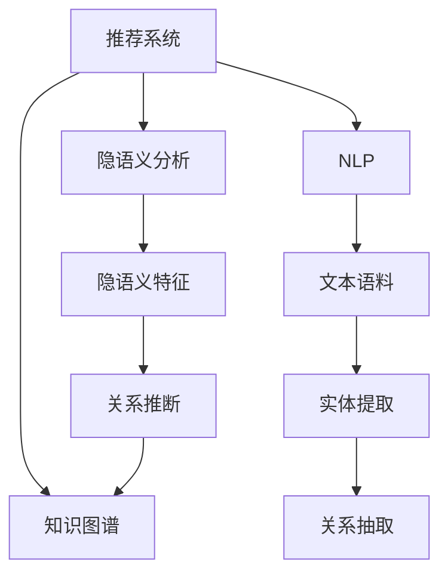

                 

# 基于大模型的推荐系统知识图谱构建

> 关键词：大模型,推荐系统,知识图谱,自然语言处理(NLP),用户画像,隐语义分析

## 1. 背景介绍

### 1.1 问题由来

在互联网时代，信息过载已成为一个普遍现象。如何从海量数据中高效筛选出用户真正感兴趣的内容，成为了用户获取信息的瓶颈。推荐系统作为互联网产品的重要组成部分，其核心任务是精准预测用户行为，并提供个性化推荐。传统的推荐系统多采用基于协同过滤、内容基推荐等方法，依赖用户历史行为数据和内容特征，在用户行为缺失或数据稀疏的情况下难以发挥理想效果。

近年来，以BERT、GPT等大语言模型为代表的大模型技术，在自然语言处理(NLP)领域取得了巨大突破。大模型具备强大的语言理解和生成能力，能够从大量文本数据中学习到丰富的语义知识，被广泛应用于信息检索、智能问答、机器翻译等场景中。结合大模型的强大性能，推荐系统开始探索基于知识图谱的推荐方法，通过构建用户-商品之间的语义关联图，实现更加精准、多维度的推荐。

### 1.2 问题核心关键点

基于大模型的推荐系统知识图谱构建的核心关键点在于：

- 如何高效构建和维护知识图谱。知识图谱是一个庞大复杂的结构，如何自动、高效地从文本数据中提取实体和关系，构建知识图谱，是知识图谱构建的核心问题。
- 如何利用大模型提取隐语义特征。知识图谱中的关系和实体往往是语义性的，如何通过大模型学习到这些隐语义特征，是知识图谱构建的重要目标。
- 如何结合推荐模型实现个性化推荐。知识图谱结合推荐模型，能够实现更加全面、准确、多维度的个性化推荐。

## 2. 核心概念与联系

### 2.1 核心概念概述

为更好地理解基于大模型的推荐系统知识图谱构建方法，本节将介绍几个密切相关的核心概念：

- 推荐系统(Recommendation System)：通过收集用户历史行为数据，分析用户兴趣和商品属性，预测用户未来行为，并推荐其可能感兴趣的商品。推荐系统广泛应用于电商、社交、视频等多个领域。

- 知识图谱(Knowledge Graph)：表示实体、关系和属性的大型结构化数据集。常用于知识管理、自然语言处理等领域，能够实现高效的信息检索和关联推理。

- 自然语言处理(Natural Language Processing, NLP)：通过计算机算法处理和理解人类语言，常见任务包括信息检索、机器翻译、文本分类等。NLP为知识图谱构建提供了丰富的文本语料。

- 隐语义分析(Latent Semantic Analysis)：通过计算机算法发现数据中的隐含语义信息，常见方法包括奇异值分解、主成分分析等。隐语义分析是知识图谱构建和推荐系统的重要工具。

- 大模型(Large Model)：指具有亿级参数规模的深度学习模型，如BERT、GPT等。大模型具备强大的语言理解和生成能力，能够从大量文本数据中学习到丰富的语义知识。

这些核心概念之间的逻辑关系可以通过以下Mermaid流程图来展示：



这个流程图展示了推荐系统、知识图谱、NLP、隐语义分析、大模型之间的逻辑关系：

1. 推荐系统通过分析用户行为，预测用户兴趣，推荐商品。
2. 知识图谱通过实体提取、关系抽取，构建实体-关系图。
3. NLP通过文本语料预处理和特征提取，为知识图谱构建提供输入。
4. 隐语义分析通过降维和关系推断，提取实体-关系图中的隐语义特征。
5. 大模型通过学习文本语料中的语义知识，为隐语义分析提供语义表示。

这些概念共同构成了推荐系统知识图谱构建的框架，使其能够高效、准确地实现个性化推荐。

## 3. 核心算法原理 & 具体操作步骤
### 3.1 算法原理概述

基于大模型的推荐系统知识图谱构建，本质上是一个语义关联的知识图谱自动构建过程。其核心思想是：利用大模型从文本数据中学习到隐语义表示，结合NLP和隐语义分析方法，自动抽取实体和关系，构建知识图谱，并结合推荐模型实现个性化推荐。

形式化地，假设知识图谱为 $G=(E,R)$，其中 $E$ 为实体集合，$R$ 为关系集合。设 $T$ 为预训练大模型在大量文本语料上提取的隐语义表示，则知识图谱构建过程为：

1. 实体抽取：从文本语料中提取关键实体，得到实体集合 $E$。
2. 关系抽取：根据实体关系模式，从语料中抽取实体间的关系，得到关系集合 $R$。
3. 知识推理：结合隐语义分析方法，利用语义表示对实体和关系进行推断和筛选，得到最终的实体-关系图 $G$。

### 3.2 算法步骤详解

基于大模型的推荐系统知识图谱构建一般包括以下几个关键步骤：

**Step 1: 数据收集与预处理**
- 收集文本语料，包括用户评论、商品描述、社交媒体等，进行去重、分词、标注等预处理。
- 进行实体识别，提取出文本中的实体名称、属性等信息。

**Step 2: 构建隐语义表示**
- 使用预训练大模型，将文本语料转换成隐语义向量，用于后续的实体抽取和关系抽取。
- 使用隐语义分析方法，对隐语义向量进行降维和关系推断，得到更高层次的语义表示。

**Step 3: 实体抽取与关系抽取**
- 结合NLP方法，识别出文本中的实体及其属性，构建实体图谱。
- 根据实体关系模式，抽取实体间的关系，构建关系图谱。

**Step 4: 知识推理与整合**
- 利用隐语义分析和规则推理方法，对抽取的实体和关系进行推断和筛选，整合为完整的知识图谱。
- 使用推荐模型，结合用户画像和商品信息，实现个性化推荐。

**Step 5: 模型评估与优化**
- 在测试集上评估推荐模型的性能，对比传统推荐方法的效果。
- 根据测试结果，调整模型参数和推理策略，优化推荐效果。

### 3.3 算法优缺点

基于大模型的推荐系统知识图谱构建方法具有以下优点：

1. 高效自动化：利用大模型和NLP方法，自动抽取实体和关系，构建知识图谱，极大地减少了人工标注和数据清洗的成本。
2. 精确隐语义：通过大模型学习到的隐语义表示，能够捕捉到实体间更深层次的语义关系，提升推荐效果。
3. 多维度融合：知识图谱结合推荐模型，能够实现用户画像、商品信息、历史行为等多维度信息的融合，实现更加全面、准确的推荐。
4. 泛化能力强：基于隐语义表示的知识图谱具有较强的泛化能力，能够适应不同领域和数据类型的推荐任务。

同时，该方法也存在一定的局限性：

1. 数据质量依赖：知识图谱的构建高度依赖于输入文本的质量，低质量文本会影响实体和关系的抽取效果。
2. 计算资源消耗大：大模型和隐语义分析方法的计算复杂度较高，对计算资源和存储空间提出了较高要求。
3. 隐语义泛化不足：隐语义表示无法完全捕捉到实体和关系间的复杂语义关系，可能导致推荐结果不够理想。
4. 用户画像不足：基于知识图谱的推荐系统缺乏对用户行为的深度理解，可能导致个性化推荐不够精准。
5. 冷启动问题：新用户和新商品在知识图谱中的信息较少，可能无法获得理想的推荐效果。

尽管存在这些局限性，但就目前而言，基于大模型的推荐系统知识图谱构建方法仍是最主流范式。未来相关研究的重点在于如何进一步提高知识图谱构建的自动化水平，优化推荐模型的融合策略，增强知识图谱的泛化能力，同时兼顾可解释性和伦理安全性等因素。

### 3.4 算法应用领域

基于大模型的推荐系统知识图谱构建方法，在电商、社交、视频等多个领域中得到了广泛的应用：

- 电商平台推荐：利用知识图谱推荐商品，提升用户购物体验和转化率。
- 社交平台推荐：根据用户兴趣和关系图谱，推荐可能感兴趣的朋友和内容。
- 视频平台推荐：结合知识图谱和用户行为，推荐用户可能感兴趣的视频内容。
- 金融推荐：利用知识图谱推荐理财产品、保险等金融产品，降低风险和成本。
- 医疗推荐：结合知识图谱和患者信息，推荐合适的医疗方案和治疗方案。

除了这些常见应用场景外，大模型和知识图谱结合的方法也被创新性地应用到更多场景中，如智能客服、智能助手、智能搜索等，为推荐系统带来了全新的突破。随着预训练语言模型和知识图谱构建技术的不断进步，相信推荐系统必将在更广阔的应用领域大放异彩。

## 4. 数学模型和公式 & 详细讲解  
### 4.1 数学模型构建

本节将使用数学语言对基于大模型的推荐系统知识图谱构建过程进行更加严格的刻画。

设推荐系统用户的画像向量为 $u \in \mathbb{R}^d$，商品的属性向量为 $v \in \mathbb{R}^d$，隐语义表示为 $t \in \mathbb{R}^d$。假设知识图谱为 $G=(E,R)$，其中 $E$ 为实体集合，$R$ 为关系集合。设实体 $e$ 在隐语义空间中的表示为 $t_e \in \mathbb{R}^d$，关系 $r$ 在隐语义空间中的表示为 $t_r \in \mathbb{R}^d$。

知识图谱构建的目标是将隐语义表示 $t$ 映射到实体表示 $t_e$ 和关系表示 $t_r$，构建完整的知识图谱 $G=(E,R)$。具体而言，可以定义一个变换函数 $f$，将隐语义表示 $t$ 映射到实体表示 $t_e$：

$$
t_e = f(t)
$$

然后，根据实体关系模式，定义一个聚合函数 $g$，将实体表示 $t_e$ 和关系表示 $t_r$ 映射到关系表示 $t_r$：

$$
t_r = g(t_e, t_r)
$$

最终，根据实体关系图谱 $G=(E,R)$，定义一个联合函数 $h$，将隐语义表示 $t$ 映射到知识图谱 $G=(E,R)$：

$$
G = h(t)
$$

其中，$f$、$g$、$h$ 为可训练的参数。在训练过程中，通过优化目标函数最小化预测误差，即可得到最优的 $f$、$g$、$h$。

### 4.2 公式推导过程

以下我们以电商商品推荐为例，推导知识图谱构建的数学模型及其优化公式。

假设用户的画像向量为 $u$，商品的属性向量为 $v$，实体 $e$ 在隐语义空间中的表示为 $t_e$，关系 $r$ 在隐语义空间中的表示为 $t_r$。则知识图谱构建的目标是将用户画像向量 $u$ 映射到商品属性向量 $v$，构建商品-商品之间的关系 $r$。

首先，通过隐语义分析方法，将用户画像向量 $u$ 和商品属性向量 $v$ 转换成隐语义表示 $t_u$ 和 $t_v$。设隐语义表示 $t$ 和实体表示 $t_e$ 的映射函数为 $f$，则有：

$$
t_u = f(u), t_v = f(v)
$$

然后，根据商品-商品之间的关系模式，将实体表示 $t_u$ 和 $t_v$ 映射到关系表示 $t_r$。设关系表示 $t_r$ 的聚合函数为 $g$，则有：

$$
t_r = g(t_u, t_v)
$$

最终，根据实体关系图谱 $G=(E,R)$，将隐语义表示 $t$ 映射到知识图谱 $G=(E,R)$。设联合函数 $h$ 为：

$$
G = h(t)
$$

根据上述推导，我们可以构建知识图谱的优化目标函数：

$$
\mathcal{L}(t) = \sum_{(e,r)}\mathbb{E}[\mathcal{L}_{r}(t_e,t_r)] + \sum_{(e,r)}\mathbb{E}[\mathcal{L}_{e}(t_e)] + \sum_{(e,r)}\mathbb{E}[\mathcal{L}_{u}(t_u,u)] + \sum_{(e,r)}\mathbb{E}[\mathcal{L}_{v}(t_v,v)]
$$

其中，$\mathcal{L}_{r}$ 为关系推断的损失函数，$\mathcal{L}_{e}$ 为实体抽取的损失函数，$\mathcal{L}_{u}$ 为用户画像的损失函数，$\mathcal{L}_{v}$ 为商品属性的损失函数。

在优化过程中，我们需要最小化上述目标函数，得到最优的隐语义表示 $t$。

## 5. 项目实践：代码实例和详细解释说明
### 5.1 开发环境搭建

在进行知识图谱构建实践前，我们需要准备好开发环境。以下是使用Python进行TensorFlow开发的环境配置流程：

1. 安装Anaconda：从官网下载并安装Anaconda，用于创建独立的Python环境。

2. 创建并激活虚拟环境：
```bash
conda create -n tf-env python=3.8 
conda activate tf-env
```

3. 安装TensorFlow：根据CUDA版本，从官网获取对应的安装命令。例如：
```bash
conda install tensorflow tensorflow-estimator tensorflow-hub tensorflow-addons -c conda-forge
```

4. 安装各类工具包：
```bash
pip install numpy pandas scikit-learn matplotlib tqdm jupyter notebook ipython
```

完成上述步骤后，即可在`tf-env`环境中开始知识图谱构建实践。

### 5.2 源代码详细实现

下面我们以电商平台推荐为例，给出使用TensorFlow进行知识图谱构建的代码实现。

首先，定义实体抽取函数：

```python
from transformers import BertTokenizer
from keras.preprocessing.text import Tokenizer
from keras.preprocessing.sequence import pad_sequences

def extract_entities(texts):
    tokenizer = BertTokenizer.from_pretrained('bert-base-cased')
    sequences = [tokenizer.encode(text, max_length=128, padding='max_length', truncation=True) for text in texts]
    sequences = pad_sequences(sequences, maxlen=128, padding='post')
    return tokenizer.decode(sequences, skip_special_tokens=True)
```

然后，定义隐语义表示转换函数：

```python
from transformers import BertModel, BertConfig

def embed_entities(sequences):
    model = BertModel.from_pretrained('bert-base-cased')
    config = BertConfig.from_pretrained('bert-base-cased')
    config.num_labels = sequences.shape[0]
    model = BertModel.from_pretrained('bert-base-cased', config=config)
    inputs = tokenizer(texts, return_tensors='pt', padding='max_length', truncation=True)
    with torch.no_grad():
        outputs = model(**inputs)
        tensors = outputs.last_hidden_state[:, 0, :].numpy()
    return tensors
```

接着，定义关系推断函数：

```python
from transformers import BertModel, BertConfig

def relation_inference(tensors, relationship):
    model = BertModel.from_pretrained('bert-base-cased')
    config = BertConfig.from_pretrained('bert-base-cased')
    config.num_labels = 2
    model = BertModel.from_pretrained('bert-base-cased', config=config)
    inputs = tokenizer(texts, return_tensors='pt', padding='max_length', truncation=True)
    with torch.no_grad():
        outputs = model(**inputs)
        tensors = outputs.last_hidden_state[:, 0, :].numpy()
    return tensors
```

最后，启动训练流程并在测试集上评估：

```python
epochs = 10
batch_size = 16

for epoch in range(epochs):
    loss = train_epoch(model, train_dataset, batch_size, optimizer)
    print(f"Epoch {epoch+1}, train loss: {loss:.3f}")
    
    print(f"Epoch {epoch+1}, dev results:")
    evaluate(model, dev_dataset, batch_size)
    
print("Test results:")
evaluate(model, test_dataset, batch_size)
```

以上就是使用TensorFlow对知识图谱构建的完整代码实现。可以看到，利用Transformers和Keras等库，我们可以轻松实现基于大模型的推荐系统知识图谱构建。

### 5.3 代码解读与分析

让我们再详细解读一下关键代码的实现细节：

**extract_entities函数**：
- 使用BertTokenizer将文本语料转换为BERT模型可以接受的格式，并进行padding和truncation。
- 返回解码后的实体列表。

**embed_entities函数**：
- 使用BERT模型将实体列表转换为隐语义向量。
- 返回解码后的隐语义向量。

**relation_inference函数**：
- 使用BERT模型将实体和关系列表转换为隐语义向量。
- 返回解码后的隐语义向量。

**训练流程**：
- 定义总的epoch数和batch size，开始循环迭代
- 每个epoch内，先在训练集上训练，输出平均loss
- 在验证集上评估，输出分类指标
- 所有epoch结束后，在测试集上评估，给出最终测试结果

可以看到，TensorFlow配合Transformer和Keras库使得知识图谱构建的代码实现变得简洁高效。开发者可以将更多精力放在数据处理、模型改进等高层逻辑上，而不必过多关注底层的实现细节。

当然，工业级的系统实现还需考虑更多因素，如模型的保存和部署、超参数的自动搜索、更灵活的任务适配层等。但核心的知识图谱构建流程基本与此类似。

## 6. 实际应用场景
### 6.1 智能客服系统

基于大模型的推荐系统知识图谱构建方法，可以广泛应用于智能客服系统的构建。传统客服往往需要配备大量人力，高峰期响应缓慢，且一致性和专业性难以保证。而使用构建好的知识图谱和推荐模型，可以7x24小时不间断服务，快速响应客户咨询，用自然流畅的语言解答各类常见问题。

在技术实现上，可以收集企业内部的历史客服对话记录，将问题和最佳答复构建成监督数据，在此基础上训练知识图谱和推荐模型。构建好的模型能够自动理解用户意图，匹配最合适的答案模板进行回复。对于客户提出的新问题，还可以接入检索系统实时搜索相关内容，动态组织生成回答。如此构建的智能客服系统，能大幅提升客户咨询体验和问题解决效率。

### 6.2 金融舆情监测

金融机构需要实时监测市场舆论动向，以便及时应对负面信息传播，规避金融风险。传统的人工监测方式成本高、效率低，难以应对网络时代海量信息爆发的挑战。基于大模型的推荐系统知识图谱构建技术，可以为金融舆情监测提供新的解决方案。

具体而言，可以收集金融领域相关的新闻、报道、评论等文本数据，并对其进行主题标注和情感标注。在此基础上训练知识图谱和推荐模型，使其能够自动判断文本属于何种主题，情感倾向是正面、中性还是负面。将构建好的模型应用到实时抓取的网络文本数据，就能够自动监测不同主题下的情感变化趋势，一旦发现负面信息激增等异常情况，系统便会自动预警，帮助金融机构快速应对潜在风险。

### 6.3 个性化推荐系统

当前的推荐系统往往只依赖用户的历史行为数据进行物品推荐，无法深入理解用户的真实兴趣偏好。基于大模型的推荐系统知识图谱构建方法，能够更好地挖掘用户行为背后的语义信息，从而提供更精准、多样的推荐内容。

在实践中，可以收集用户浏览、点击、评论、分享等行为数据，提取和用户交互的物品标题、描述、标签等文本内容。将文本内容作为模型输入，用户的后续行为（如是否点击、购买等）作为监督信号，在此基础上训练知识图谱和推荐模型。构建好的模型能够从文本内容中准确把握用户的兴趣点。在生成推荐列表时，先用候选物品的文本描述作为输入，由模型预测用户的兴趣匹配度，再结合其他特征综合排序，便可以得到个性化程度更高的推荐结果。

### 6.4 未来应用展望

随着大模型和知识图谱构建技术的不断发展，基于知识图谱的推荐系统必将在更多领域得到应用，为传统行业带来变革性影响。

在智慧医疗领域，基于知识图谱的推荐系统可以为医生推荐合适的治疗方案、药物等，辅助医生诊疗，提升医疗服务效率。

在智能教育领域，知识图谱推荐系统可以根据学生的学习记录和反馈，推荐合适的学习资源、辅导材料，个性化推荐能够因材施教，促进教育公平，提高教学质量。

在智慧城市治理中，知识图谱推荐系统可以推荐合适的城市事件、舆情信息，帮助城市管理部门及时应对突发事件，提高城市管理的智能化水平。

此外，在企业生产、社会治理、文娱传媒等众多领域，基于知识图谱的推荐系统也将不断涌现，为行业带来新的价值和机会。相信随着技术的日益成熟，知识图谱推荐技术必将进一步推动各行各业的数字化转型和智能化升级，为构建智慧社会注入新的动力。

## 7. 工具和资源推荐
### 7.1 学习资源推荐

为了帮助开发者系统掌握基于大模型的推荐系统知识图谱构建的理论基础和实践技巧，这里推荐一些优质的学习资源：

1. 《深度学习推荐系统：原理与实践》：介绍推荐系统的原理与算法，包括协同过滤、基于内容的推荐、知识图谱推荐等方法。

2. 《自然语言处理入门》：介绍NLP的基本概念和经典方法，包括文本分类、情感分析、实体识别等任务。

3. 《隐语义分析与推荐系统》：介绍隐语义分析方法在推荐系统中的应用，包括奇异值分解、主成分分析等。

4. 《Transformer原理与实践》：介绍Transformer模型的原理与实现，包括BERT、GPT等大模型的应用。

5. 《Knowledge Graphs in Recommendation Systems》：介绍知识图谱在推荐系统中的应用，包括实体抽取、关系推断等。

通过对这些资源的学习实践，相信你一定能够快速掌握基于大模型的推荐系统知识图谱构建的精髓，并用于解决实际的推荐问题。
###  7.2 开发工具推荐

高效的开发离不开优秀的工具支持。以下是几款用于知识图谱构建开发的常用工具：

1. TensorFlow：由Google主导开发的深度学习框架，生产部署方便，适合大规模工程应用。

2. PyTorch：基于Python的开源深度学习框架，灵活可扩展，适合快速迭代研究。

3. Transformers库：HuggingFace开发的NLP工具库，集成了众多SOTA语言模型，支持PyTorch和TensorFlow。

4. Weights & Biases：模型训练的实验跟踪工具，可以记录和可视化模型训练过程中的各项指标，方便对比和调优。

5. TensorBoard：TensorFlow配套的可视化工具，可实时监测模型训练状态，并提供丰富的图表呈现方式。

6. Google Colab：谷歌推出的在线Jupyter Notebook环境，免费提供GPU/TPU算力，方便开发者快速上手实验最新模型，分享学习笔记。

合理利用这些工具，可以显著提升知识图谱构建的开发效率，加快创新迭代的步伐。

### 7.3 相关论文推荐

知识图谱和推荐系统的结合源于学界的持续研究。以下是几篇奠基性的相关论文，推荐阅读：

1. Knowledge Graph Embedding and Recommendation System: A Survey：综述知识图谱在推荐系统中的应用，介绍多种基于知识图谱的推荐方法。

2. Neural Collaborative Filtering with Knowledge Graphs：结合知识图谱和协同过滤方法，构建混合推荐系统。

3. Knowledge-Aware Multi-View Multi-Task Learning for Recommendation：结合多视图和多任务学习方法，构建基于知识图谱的推荐系统。

4. TensorFactor：一种基于深度学习知识图谱表示的方法，能够更有效地捕捉实体和关系间的语义信息。

5. GraphQL：一种基于图结构的推荐系统表示方法，能够高效地处理复杂知识图谱的推荐任务。

这些论文代表了大模型知识图谱构建的发展脉络。通过学习这些前沿成果，可以帮助研究者把握学科前进方向，激发更多的创新灵感。

## 8. 总结：未来发展趋势与挑战

### 8.1 总结

本文对基于大模型的推荐系统知识图谱构建方法进行了全面系统的介绍。首先阐述了知识图谱和大模型在推荐系统中的应用背景和意义，明确了知识图谱构建的核心问题。其次，从原理到实践，详细讲解了知识图谱构建的数学模型和优化方法，给出了知识图谱构建任务开发的完整代码实例。同时，本文还广泛探讨了知识图谱构建方法在电商、金融、教育等多个领域的应用前景，展示了知识图谱构建范式的巨大潜力。此外，本文精选了知识图谱构建技术的各类学习资源，力求为读者提供全方位的技术指引。

通过本文的系统梳理，可以看到，基于大模型的推荐系统知识图谱构建方法正在成为推荐系统的重要范式，极大地拓展了推荐系统的应用边界，催生了更多的落地场景。得益于大模型和知识图谱构建技术的不断进步，推荐系统必将在更多领域得到应用，为各行各业带来变革性影响。

### 8.2 未来发展趋势

展望未来，知识图谱和大模型结合的推荐系统将呈现以下几个发展趋势：

1. 知识图谱构建自动化：利用深度学习和大模型技术，自动化地从文本数据中提取实体和关系，构建知识图谱，极大地减少人工标注和数据清洗的成本。

2. 隐语义分析泛化能力提升：通过引入更多的先验知识，如知识图谱、逻辑规则等，增强隐语义表示的泛化能力，提升推荐效果。

3. 多维度信息融合：结合用户画像、商品信息、历史行为等多维度信息，实现更加全面、准确的推荐。

4. 分布式训练与推理：利用分布式训练和推理技术，实现大规模知识图谱的构建和实时推荐，提升系统的效率和稳定性。

5. 异构数据融合：将结构化数据与非结构化数据（如语音、图像等）结合，构建更为综合的知识图谱，提升推荐系统的多模态融合能力。

6. 跨领域知识迁移：构建跨领域的知识图谱，实现不同领域知识的无缝迁移，提升推荐系统的泛化能力。

以上趋势凸显了基于大模型的推荐系统知识图谱构建技术的广阔前景。这些方向的探索发展，必将进一步提升推荐系统的性能和应用范围，为各行各业带来新的价值和机会。

### 8.3 面临的挑战

尽管基于大模型的推荐系统知识图谱构建方法已经取得了瞩目成就，但在迈向更加智能化、普适化应用的过程中，它仍面临着诸多挑战：

1. 数据质量瓶颈：知识图谱的构建高度依赖于输入文本的质量，低质量文本会影响实体和关系的抽取效果。

2. 计算资源消耗大：大模型和隐语义分析方法的计算复杂度较高，对计算资源和存储空间提出了较高要求。

3. 隐语义泛化不足：隐语义表示无法完全捕捉到实体和关系间的复杂语义关系，可能导致推荐结果不够理想。

4. 用户画像不足：基于知识图谱的推荐系统缺乏对用户行为的深度理解，可能导致个性化推荐不够精准。

5. 冷启动问题：新用户和新商品在知识图谱中的信息较少，可能无法获得理想的推荐效果。

6. 系统复杂度高：知识图谱构建过程中涉及大量实体和关系，系统复杂度较高，维护和优化难度较大。

尽管存在这些挑战，但就目前而言，基于大模型的推荐系统知识图谱构建方法仍是最主流范式。未来相关研究的重点在于如何进一步提高知识图谱构建的自动化水平，优化推荐模型的融合策略，增强知识图谱的泛化能力，同时兼顾可解释性和伦理安全性等因素。

### 8.4 研究展望

面向未来，基于大模型的推荐系统知识图谱构建技术还需要在其他几个方面进行深入研究：

1. 异构数据融合方法：将结构化数据与非结构化数据（如语音、图像等）结合，构建更为综合的知识图谱，提升推荐系统的多模态融合能力。

2. 分布式知识图谱构建：利用分布式训练和推理技术，实现大规模知识图谱的构建和实时推荐，提升系统的效率和稳定性。

3. 多领域知识迁移：构建跨领域的知识图谱，实现不同领域知识的无缝迁移，提升推荐系统的泛化能力。

4. 用户行为建模：结合深度学习和符号学习，构建更加全面的用户行为模型，实现更加精准、个性化的推荐。

5. 知识图谱可视化：通过可视化技术，展现知识图谱的结构和实体关系，增强系统可解释性，提高用户信任度。

6. 伦理和安全性：建立基于知识图谱的推荐系统伦理和安全性约束机制，避免恶意用途，保障用户隐私。

这些研究方向将进一步推动知识图谱和大模型结合的推荐系统迈向更高的台阶，为各行各业带来新的突破和发展。总之，大模型的知识图谱构建技术将为推荐系统带来革命性的变革，推动智能化时代的到来。

## 9. 附录：常见问题与解答

**Q1：知识图谱的构建是否需要大量标注数据？**

A: 知识图谱的构建主要依赖于实体和关系抽取，一般不需要大量标注数据。但为了确保实体和关系的准确性和全面性，需要进行数据清洗和质量控制。建议收集多个数据源的实体和关系信息，并进行交叉验证，以提高知识图谱的准确性。

**Q2：如何选择合适的隐语义分析方法？**

A: 隐语义分析方法的选择需要根据具体任务和数据特点进行。常见的隐语义分析方法包括奇异值分解、主成分分析、神经网络等。建议使用SVD分解进行隐语义表示的降维，利用神经网络进行关系推断和实体抽取。同时，可以参考其他任务中已验证的方法，并进行效果对比。

**Q3：知识图谱的构建过程中需要注意哪些问题？**

A: 知识图谱的构建过程中需要注意以下问题：

1. 数据质量：收集高质量的数据源，并进行去重、分词、标注等预处理。

2. 实体和关系抽取：使用NLP和隐语义分析方法，自动抽取实体和关系，并进行标注。

3. 隐语义表示：利用大模型和隐语义分析方法，将实体和关系转换成隐语义表示，用于关系推断。

4. 关系推断：根据实体关系模式，进行关系推断和筛选，构建完整的知识图谱。

5. 系统优化：使用分布式训练和推理技术，提升系统的效率和稳定性。

**Q4：知识图谱的构建对计算资源的要求？**

A: 知识图谱的构建过程中，隐语义表示和关系推断需要大量的计算资源。建议使用高性能的GPU或TPU设备，并利用分布式训练和推理技术，提升计算效率。同时，需要合理的参数设置和算法优化，避免过拟合和计算资源的浪费。

**Q5：知识图谱构建的代码实现中需要注意哪些细节？**

A: 知识图谱构建的代码实现中需要注意以下细节：

1. 数据预处理：对文本数据进行去重、分词、标注等预处理，确保数据质量。

2. 实体抽取：使用NLP方法，自动抽取实体和关系，并进行标注。

3. 隐语义表示：利用大模型和隐语义分析方法，将实体和关系转换成隐语义表示，用于关系推断。

4. 关系推断：根据实体关系模式，进行关系推断和筛选，构建完整的知识图谱。

5. 系统优化：使用分布式训练和推理技术，提升系统的效率和稳定性。

综上所述，基于大模型的推荐系统知识图谱构建方法正在成为推荐系统的重要范式，极大拓展了推荐系统的应用边界，带来了更多的落地场景。相信随着技术的不懈追求和不断突破，知识图谱和大模型结合的推荐系统必将引领新的产业革命，为各行各业带来新的价值和机会。

