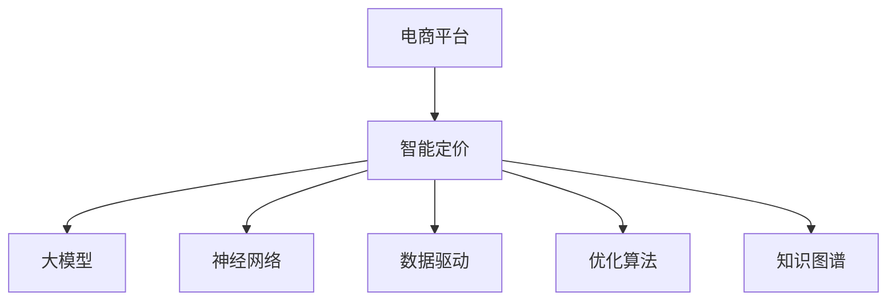

                 

# 基于大模型的电商平台智能定价

> 关键词：电商平台,智能定价,大模型,神经网络,数据驱动,优化算法

## 1. 背景介绍

### 1.1 问题由来

在当今数字化经济时代，电商平台已经成为了主要的销售渠道之一。随着互联网技术的快速发展，电商平台的运营模式、产品类别、营销策略都在不断变化。然而，这些变化给电商平台带来了新的挑战，尤其是定价策略的制定。传统的定价方法大多依赖于经验丰富的销售人员，缺乏数据驱动的决策支持，难以适应市场的快速变化。

大模型的兴起为电商平台的智能定价提供了新的可能。通过使用大规模预训练语言模型，电商平台可以挖掘用户行为数据，分析市场趋势，从而实现更加智能化和精准的定价。例如，通过分析用户的历史购买行为和搜索记录，模型可以预测用户的购买意愿和价格敏感度，帮助商家制定更有效的定价策略。

### 1.2 问题核心关键点

电商平台的智能定价需要解决以下核心问题：

1. **用户行为分析**：如何通过用户的行为数据，挖掘出用户的购买意愿、价格敏感度等关键信息。
2. **市场趋势预测**：如何利用市场数据，预测未来的价格变化趋势，以及竞争对手的定价策略。
3. **定价模型构建**：如何构建一个有效的定价模型，将用户行为和市场趋势映射到最终的定价决策上。
4. **模型优化**：如何通过持续学习，不断优化模型，使其适应市场的动态变化。

### 1.3 问题研究意义

基于大模型的电商平台智能定价，对于提升电商平台的竞争力、提高用户体验、优化销售收益具有重要意义：

1. **提高定价精度**：通过数据驱动的智能定价，可以更准确地把握市场需求，优化产品定价，提高销售收益。
2. **提升用户体验**：智能定价可以确保用户在购物过程中获得更公平、透明的价格，提高购物体验。
3. **优化库存管理**：通过精准的定价模型，可以更好地控制库存水平，减少库存积压和缺货情况。
4. **增强市场竞争力**：智能定价模型能够及时响应市场变化，帮助商家在激烈的市场竞争中保持优势。

## 2. 核心概念与联系

### 2.1 核心概念概述

为更好地理解基于大模型的电商平台智能定价方法，本节将介绍几个密切相关的核心概念：

- **电商平台(E-Commerce Platform)**：一个在线交易平台，包括购物、支付、物流等全流程服务，是智能定价的主要应用场景。
- **智能定价(Intelligent Pricing)**：通过数据分析和机器学习，实现自动化的定价策略，以提高销售收益和用户体验。
- **大模型(Large Model)**：以深度学习模型为代表的大规模预训练模型，如BERT、GPT等，具有强大的语言理解和生成能力。
- **神经网络(Neural Network)**：一种由大量神经元组成的计算模型，能够学习和处理复杂的数据结构。
- **数据驱动(Data-Driven)**：通过收集、分析和利用数据，指导决策过程，使决策更加科学和高效。
- **优化算法(Optimization Algorithm)**：用于求解最优化问题的算法，如梯度下降、遗传算法等，用于模型训练和参数优化。
- **知识图谱(Knowledge Graph)**：一种结构化的知识表示方式，用于存储和管理领域内的知识，辅助模型的决策过程。

这些核心概念之间的逻辑关系可以通过以下Mermaid流程图来展示：



这个流程图展示了大模型在智能定价中的核心作用，通过神经网络模型对数据进行建模和预测，利用数据驱动和优化算法提升模型的性能，结合知识图谱丰富模型的知识背景，实现智能定价。

## 3. 核心算法原理 & 具体操作步骤

### 3.1 算法原理概述

基于大模型的电商平台智能定价，本质上是一个数据驱动的决策优化问题。其核心思想是：通过收集和分析用户行为数据和市场数据，构建一个智能定价模型，使用大模型进行预测和优化，最终得到最佳的定价决策。

形式化地，假设电商平台有$m$种产品，每种产品$n$个特征，记为$\boldsymbol{x} = [x_1, x_2, \ldots, x_n]^T$，对应的理想价格为$p$。电商平台收集到的用户行为数据为$\boldsymbol{d} = [d_1, d_2, \ldots, d_m]^T$，其中$d_i$表示用户对产品$i$的评分或行为。目标是最小化模型预测价格与实际价格之间的差异，即：

$$
\min_{\boldsymbol{p},\boldsymbol{\theta}} \frac{1}{m} \sum_{i=1}^m \left(\hat{p}_i - p_i\right)^2
$$

其中$\hat{p}_i = g(\boldsymbol{x}_i;\boldsymbol{\theta})$表示模型预测的价格，$g$为神经网络模型，$\boldsymbol{\theta}$为模型的参数。

### 3.2 算法步骤详解

基于大模型的电商平台智能定价一般包括以下几个关键步骤：

**Step 1: 数据收集与预处理**
- 收集电商平台的用户行为数据和市场数据，如购买记录、搜索行为、竞争对手定价等。
- 对数据进行清洗、归一化等预处理，去除噪声和异常值。

**Step 2: 数据特征提取**
- 利用神经网络模型对数据进行特征提取，得到用户行为和市场特征的隐含表示。
- 设计合适的输入层和隐藏层结构，使用激活函数进行非线性映射。

**Step 3: 模型训练与优化**
- 使用优化算法（如梯度下降、Adam等）对模型进行训练，最小化预测误差。
- 利用正则化技术（如L2正则、Dropout等）避免过拟合。
- 定期在验证集上评估模型性能，根据性能指标决定是否进行模型调整。

**Step 4: 定价决策**
- 在测试集上对模型进行评估，使用预测结果进行定价决策。
- 根据实际销售情况，调整模型参数，进一步优化定价策略。

**Step 5: 模型部署与监控**
- 将训练好的模型部署到电商平台后台，实时进行定价决策。
- 监控模型性能，定期更新模型参数，适应市场变化。

以上是基于大模型的电商平台智能定价的一般流程。在实际应用中，还需要根据具体业务场景和数据特点，对各个环节进行优化设计，如改进数据特征提取方法，应用更高效的优化算法等。

### 3.3 算法优缺点

基于大模型的电商平台智能定价方法具有以下优点：
1. 数据驱动：模型能够自动从历史数据中学习最优定价策略，适应市场的动态变化。
2. 精度高：利用神经网络进行建模和预测，能够捕捉复杂非线性关系，提高定价精度。
3. 灵活性：可以根据不同产品和市场特点，灵活设计模型的结构和参数，适应多样化需求。
4. 自动化：实现自动化的定价决策，减少人工干预，提升工作效率。

同时，该方法也存在一些局限性：
1. 数据需求高：模型需要大量的用户行为和市场数据，数据获取和处理成本较高。
2. 模型复杂：神经网络模型的复杂度较高，训练和推理效率较低。
3. 可解释性差：模型的预测过程和决策机制较难解释，缺乏透明性。
4. 模型更新频繁：市场变化快，模型需要频繁更新，增加了维护成本。

尽管存在这些局限性，但就目前而言，基于大模型的电商平台智能定价方法仍是最主流的定价策略之一。未来相关研究将聚焦于如何降低对数据的依赖，提高模型的实时性和可解释性，进一步提升定价的效率和效果。

### 3.4 算法应用领域

基于大模型的电商平台智能定价方法已经在多个领域得到了广泛应用，例如：

1. **个性化定价**：根据用户的历史购买记录和行为特征，为不同用户设计个性化的定价策略，提高用户满意度和购买意愿。
2. **动态定价**：根据市场实时变化，动态调整产品价格，如节假日促销、季节性折扣等，最大化销售收益。
3. **价格比较**：通过分析竞争对手的定价策略，为产品定价提供参考，避免价格竞争劣势。
4. **库存管理**：利用智能定价模型，合理控制库存水平，减少库存积压和缺货情况，优化供应链管理。
5. **广告优化**：利用智能定价模型，优化广告投放策略，提高广告的点击率和转化率，降低广告成本。

除了上述这些经典应用外，电商平台智能定价方法还在广告推荐、客户流失预测、客户细分等领域得到创新性的应用，为电商平台带来了更多的价值。

## 4. 数学模型和公式 & 详细讲解 & 举例说明

### 4.1 数学模型构建

本节将使用数学语言对基于大模型的电商平台智能定价过程进行更加严格的刻画。

假设电商平台有$m$种产品，每种产品$n$个特征，记为$\boldsymbol{x} = [x_1, x_2, \ldots, x_n]^T$，对应的理想价格为$p$。电商平台收集到的用户行为数据为$\boldsymbol{d} = [d_1, d_2, \ldots, d_m]^T$，其中$d_i$表示用户对产品$i$的评分或行为。目标是最小化模型预测价格与实际价格之间的差异，即：

$$
\min_{\boldsymbol{p},\boldsymbol{\theta}} \frac{1}{m} \sum_{i=1}^m \left(\hat{p}_i - p_i\right)^2
$$

其中$\hat{p}_i = g(\boldsymbol{x}_i;\boldsymbol{\theta})$表示模型预测的价格，$g$为神经网络模型，$\boldsymbol{\theta}$为模型的参数。

### 4.2 公式推导过程

以下我们以线性回归模型为例，推导智能定价的损失函数及其梯度的计算公式。

假设模型预测价格与实际价格的误差为$\epsilon_i = p_i - \hat{p}_i$，则均方误差损失函数为：

$$
\mathcal{L}(\boldsymbol{\theta}) = \frac{1}{2m} \sum_{i=1}^m \epsilon_i^2
$$

根据梯度下降算法，模型的损失函数对参数$\boldsymbol{\theta}$的梯度为：

$$
\nabla_{\boldsymbol{\theta}} \mathcal{L}(\boldsymbol{\theta}) = -\frac{1}{m} \sum_{i=1}^m \epsilon_i g'(\boldsymbol{x}_i;\boldsymbol{\theta})
$$

其中$g'(\boldsymbol{x}_i;\boldsymbol{\theta})$为模型预测价格对特征的偏导数。

在得到损失函数的梯度后，即可带入梯度下降等优化算法，完成模型的迭代优化。重复上述过程直至收敛，最终得到适应电商平台的智能定价模型。

### 4.3 案例分析与讲解

假设某电商平台销售一款智能手表，收集到以下数据：

| 用户ID | 年龄 | 性别 | 购买金额 | 浏览时长 |
| --- | --- | --- | --- | --- |
| 用户1 | 25 | M | 200 | 10 |
| 用户2 | 35 | F | 400 | 15 |
| 用户3 | 30 | M | 150 | 20 |
| ... | ... | ... | ... | ... |

目标是为每款智能手表设计最优的定价策略。使用线性回归模型对数据进行建模，模型结构如下：

$$
\hat{p} = \boldsymbol{w}^T \boldsymbol{x} + b
$$

其中$\boldsymbol{w} = [w_1, w_2, \ldots, w_n]^T$为模型参数，$b$为截距项。

将数据代入模型，得到预测价格$\hat{p} = \boldsymbol{w}^T \boldsymbol{x} + b$，计算误差$\epsilon_i = p_i - \hat{p}_i$，代入损失函数$\mathcal{L}(\boldsymbol{\theta}) = \frac{1}{2m} \sum_{i=1}^m \epsilon_i^2$。

使用梯度下降算法，对模型参数$\boldsymbol{\theta}$进行优化，最小化损失函数，得到最优的$\boldsymbol{w}$和$b$，从而实现智能定价。

## 5. 项目实践：代码实例和详细解释说明

### 5.1 开发环境搭建

在进行智能定价实践前，我们需要准备好开发环境。以下是使用Python进行TensorFlow开发的环境配置流程：

1. 安装Anaconda：从官网下载并安装Anaconda，用于创建独立的Python环境。

2. 创建并激活虚拟环境：
```bash
conda create -n tf-env python=3.8 
conda activate tf-env
```

3. 安装TensorFlow：根据CUDA版本，从官网获取对应的安装命令。例如：
```bash
conda install tensorflow -c pytorch -c conda-forge
```

4. 安装各类工具包：
```bash
pip install numpy pandas scikit-learn matplotlib tqdm jupyter notebook ipython
```

完成上述步骤后，即可在`tf-env`环境中开始智能定价实践。

### 5.2 源代码详细实现

下面我们以线性回归模型为例，给出使用TensorFlow对电商平台智能定价模型的PyTorch代码实现。

首先，定义智能定价模型的特征输入和输出：

```python
import tensorflow as tf

# 定义特征输入和输出
features = tf.keras.Input(shape=(n,), name='features')
price = tf.keras.layers.Dense(units=1, name='price')(features)

# 构建模型
model = tf.keras.Model(inputs=features, outputs=price)
```

然后，定义模型损失函数和优化器：

```python
# 定义损失函数
loss = tf.keras.losses.MeanSquaredError()

# 定义优化器
optimizer = tf.keras.optimizers.Adam(learning_rate=0.001)
```

接着，定义训练和评估函数：

```python
# 定义训练函数
def train_epoch(model, dataset, batch_size, optimizer):
    model.compile(optimizer=optimizer, loss=loss)
    model.fit(dataset, epochs=10, batch_size=batch_size, validation_split=0.2)
    return model.evaluate(dataset)

# 定义评估函数
def evaluate(model, dataset, batch_size):
    model.evaluate(dataset, batch_size=batch_size)
```

最后，启动训练流程并在测试集上评估：

```python
# 加载训练数据
train_data = ...
test_data = ...

# 定义模型
model = ...

# 训练模型
train_loss, test_loss = train_epoch(model, train_data, batch_size=32, optimizer=optimizer)

# 输出训练结果
print(f'Train loss: {train_loss:.3f}, Test loss: {test_loss:.3f}')

# 评估模型
evaluate(model, test_data, batch_size=32)
```

以上就是使用TensorFlow进行电商平台智能定价的完整代码实现。可以看到，利用TensorFlow的高级API，可以更简洁高效地构建和训练模型。

### 5.3 代码解读与分析

让我们再详细解读一下关键代码的实现细节：

**Input层和Dense层**：
- `features`：表示输入层的特征，即用户行为数据。
- `price`：表示输出层的预测价格。

**损失函数**：
- `loss`：定义均方误差损失函数，用于衡量预测价格与实际价格的差异。

**优化器**：
- `optimizer`：定义Adam优化器，用于更新模型参数。

**训练函数**：
- `train_epoch`：定义训练函数，使用训练数据对模型进行训练，并评估验证集上的性能。
- `model.compile`：将模型与优化器和损失函数进行编译。
- `model.fit`：使用训练数据对模型进行训练，并评估验证集上的性能。

**评估函数**：
- `evaluate`：定义评估函数，使用测试数据对模型进行评估。

**训练流程**：
- 加载训练数据和测试数据。
- 定义模型和优化器。
- 使用训练函数对模型进行训练，并输出训练结果。
- 使用评估函数对模型进行评估，输出评估结果。

可以看到，TensorFlow的高级API使得智能定价模型的构建和训练变得非常简单，开发者可以更多地关注模型的设计思路和优化策略。

当然，工业级的系统实现还需考虑更多因素，如模型的保存和部署、超参数的自动搜索、更灵活的任务适配层等。但核心的智能定价范式基本与此类似。

## 6. 实际应用场景

### 6.1 智能客服定价

智能客服定价是电商平台智能定价的一个重要应用场景。通过分析用户的历史客服记录和行为数据，智能客服定价模型可以为每个客户设计最优的定价策略。例如，针对高频购买客户，可以提供更低的价格优惠；针对新客户，可以设置更高的初始价格，吸引其进行购买。

在技术实现上，可以收集电商平台的客服记录和行为数据，将用户ID和价格作为监督信号，训练智能定价模型。模型可以对每个客户进行个性化定价，从而提高客户满意度和购买意愿。

### 6.2 促销活动定价

电商平台在节假日或特定时期，往往会开展各种促销活动，如限时折扣、满减等。通过智能定价模型，可以自动生成最优的促销方案。例如，可以根据用户的历史购买记录和行为数据，预测出用户的购买意愿和价格敏感度，设计针对性的促销活动。

在技术实现上，可以收集促销活动的历史数据，将促销方案和销售效果作为监督信号，训练智能定价模型。模型可以预测促销活动的效果，并自动生成最优的促销方案，最大化销售收益。

### 6.3 库存管理定价

库存管理是电商平台运营中至关重要的一环。通过智能定价模型，可以优化库存水平，减少库存积压和缺货情况。例如，对于销售情况良好的产品，可以设置更高的价格以吸引更多购买；对于销售情况不佳的产品，可以设置较低的价格以促进销售。

在技术实现上，可以收集电商平台的销售数据和库存数据，将库存水平和销售价格作为监督信号，训练智能定价模型。模型可以预测最优的库存水平和定价策略，优化供应链管理。

### 6.4 未来应用展望

随着智能定价模型和大数据技术的不断发展，基于大模型的电商平台智能定价将在更多领域得到应用，为电商平台带来新的商业价值：

1. **个性化推荐**：通过智能定价模型，可以为每个用户提供个性化的推荐，提高用户满意度和购买意愿。例如，针对不同用户的历史行为和偏好，推荐其可能感兴趣的产品，提升销售转化率。

2. **精准广告投放**：通过智能定价模型，可以为每个广告投放设置最优的定价策略，最大化广告效果。例如，根据用户的行为数据，设计针对性的广告方案，提高广告的点击率和转化率。

3. **风险控制**：通过智能定价模型，可以实时监控市场变化，及时调整定价策略，避免价格波动对销售的影响。例如，在经济下行期，可以采取保护性定价策略，确保销售稳定。

4. **市场竞争分析**：通过智能定价模型，可以分析竞争对手的定价策略，及时调整自身定价策略，保持市场竞争力。例如，根据竞争对手的价格变化，动态调整定价策略，避免价格竞争劣势。

5. **库存优化**：通过智能定价模型，可以优化库存水平，减少库存积压和缺货情况，降低库存成本。例如，根据销售预测和库存水平，设计最优的定价策略，优化供应链管理。

综上所述，基于大模型的电商平台智能定价技术，将极大地提升电商平台的运营效率和盈利能力，成为电商平台竞争力的重要保障。

## 7. 工具和资源推荐

### 7.1 学习资源推荐

为了帮助开发者系统掌握电商平台智能定价的理论基础和实践技巧，这里推荐一些优质的学习资源：

1. **TensorFlow官方文档**：TensorFlow的官方文档，提供了全面的API使用指南和代码示例，是初学者学习的重要资源。
2. **Keras官方文档**：Keras的官方文档，提供了简洁易用的API，适合快速上手构建模型。
3. **深度学习入门：基于TensorFlow的实践**：一本深入浅出的深度学习入门书籍，详细讲解了TensorFlow的使用方法和应用实例。
4. **电商数据分析与智能定价**：一本专注于电商数据分析和智能定价的书籍，提供丰富的案例和实践指导。
5. **NLP与电商**：一本综合了自然语言处理和电商智能定价的书籍，涵盖NLP在电商中的应用和实现。

通过对这些资源的学习实践，相信你一定能够快速掌握电商平台智能定价的精髓，并用于解决实际的业务问题。

### 7.2 开发工具推荐

高效的开发离不开优秀的工具支持。以下是几款用于电商平台智能定价开发的常用工具：

1. **TensorFlow**：由Google主导开发的开源深度学习框架，生产部署方便，适合大规模工程应用。
2. **Keras**：基于TensorFlow的高级API，提供了简洁易用的API，适合快速上手构建模型。
3. **PyTorch**：基于Python的开源深度学习框架，灵活动态的计算图，适合快速迭代研究。
4. **Jupyter Notebook**：一个交互式的笔记本环境，支持代码编写、数据可视化等，方便开发者调试和展示。
5. **Pandas**：Python的数据处理库，提供了高效的数据操作和分析功能，适合处理电商平台的复杂数据。

合理利用这些工具，可以显著提升电商平台智能定价的开发效率，加快创新迭代的步伐。

### 7.3 相关论文推荐

电商平台智能定价研究源于学界的持续研究。以下是几篇奠基性的相关论文，推荐阅读：

1. **Adaptive Market Monitoring via Online Learning**：提出了基于在线学习的市场监控方法，实时更新模型参数，适应市场动态变化。
2. **Deep Learning for Dynamic Pricing in E-Commerce**：利用深度学习模型进行动态定价，提升了电商平台的定价精度和灵活性。
3. **Price Optimization Using Deep Reinforcement Learning**：结合深度强化学习，设计了电商平台的定价优化策略，实现了更高效的定价决策。
4. **A Deep Learning Approach for Dynamic Pricing**：利用深度学习模型进行动态定价，提升了电商平台的定价精度和灵活性。
5. **E-commerce Price Optimization with Deep Learning**：利用深度学习模型进行价格优化，实现了更高效的定价决策。

这些论文代表了大模型在电商平台智能定价领域的发展脉络。通过学习这些前沿成果，可以帮助研究者把握学科前进方向，激发更多的创新灵感。

## 8. 总结：未来发展趋势与挑战

### 8.1 总结

本文对基于大模型的电商平台智能定价方法进行了全面系统的介绍。首先阐述了电商平台智能定价的背景和重要性，明确了智能定价在提高运营效率、优化销售收益方面的独特价值。其次，从原理到实践，详细讲解了智能定价的数学原理和关键步骤，给出了智能定价任务开发的完整代码实例。同时，本文还广泛探讨了智能定价在智能客服、促销活动、库存管理等多个电商场景中的应用前景，展示了智能定价范式的巨大潜力。此外，本文精选了智能定价技术的各类学习资源，力求为读者提供全方位的技术指引。

通过本文的系统梳理，可以看到，基于大模型的电商平台智能定价技术，正在成为电商平台智能化的重要手段，极大地提升了电商平台的运营效率和盈利能力。未来，伴随大模型和智能定价方法的不断演进，相信电商平台智能定价必将在更多的业务场景中发挥重要作用，为电商平台的健康发展提供新的技术保障。

### 8.2 未来发展趋势

展望未来，电商平台智能定价技术将呈现以下几个发展趋势：

1. **模型复杂化**：随着深度学习技术的不断发展，未来的智能定价模型将更加复杂和强大。利用更大规模的预训练模型和大数据，模型将能够更好地捕捉用户行为和市场趋势，实现更精准的定价决策。

2. **实时化**：电商平台面临的市场变化快，未来的智能定价模型将具备实时更新的能力，能够快速响应市场动态变化，调整定价策略。例如，通过在线学习技术，实时更新模型参数，确保定价策略的有效性。

3. **个性化推荐**：通过智能定价模型，可以为每个用户提供个性化的推荐，提高用户满意度和购买意愿。例如，针对不同用户的历史行为和偏好，推荐其可能感兴趣的产品，提升销售转化率。

4. **多模态融合**：未来的智能定价模型将融合多种数据来源，如用户行为数据、市场数据、广告数据等，实现多模态信息的整合。例如，结合用户搜索数据和行为数据，设计更全面的定价策略。

5. **联邦学习**：为了保护用户隐私，未来的智能定价模型将采用联邦学习技术，在本地设备上进行模型训练和更新，确保数据隐私和安全。

6. **跨领域应用**：智能定价技术不仅应用于电商领域，还将拓展到更多行业，如金融、医疗、教育等，为这些行业提供智能化的定价决策支持。

以上趋势凸显了电商平台智能定价技术的广阔前景。这些方向的探索发展，必将进一步提升智能定价模型的性能和应用范围，为电商平台带来更多的价值。

### 8.3 面临的挑战

尽管电商平台智能定价技术已经取得了显著的成果，但在迈向更加智能化、普适化应用的过程中，仍面临诸多挑战：

1. **数据获取成本高**：电商平台的智能定价模型需要大量的用户行为和市场数据，数据获取和处理成本较高。如何降低数据获取成本，优化数据处理流程，是一个重要的研究方向。

2. **模型鲁棒性不足**：电商平台面临的市场变化快，智能定价模型需要具备较强的鲁棒性，能够适应市场的动态变化。如何提高模型的鲁棒性，避免灾难性遗忘，还需要更多的理论和实践的积累。

3. **计算资源消耗大**：智能定价模型复杂度高，计算资源消耗大，如何优化模型结构，提高计算效率，是一个重要的研究方向。

4. **隐私和安全问题**：智能定价模型需要处理大量的用户数据，如何保护用户隐私和数据安全，是一个重要的研究方向。

5. **可解释性差**：智能定价模型的决策过程较难解释，缺乏透明性。如何提高模型的可解释性，增强用户信任，是一个重要的研究方向。

6. **模型更新频繁**：电商平台市场变化快，智能定价模型需要频繁更新，增加了维护成本。如何降低模型更新频率，提高模型稳定性，是一个重要的研究方向。

面对这些挑战，未来的研究需要在以下几个方面寻求新的突破：

1. **数据增强技术**：通过数据增强技术，扩充训练数据集，提高模型的泛化能力，降低数据获取成本。

2. **模型压缩技术**：通过模型压缩技术，优化模型结构，减小计算资源消耗，提高计算效率。

3. **联邦学习**：利用联邦学习技术，在本地设备上进行模型训练和更新，保护用户隐私和数据安全。

4. **可解释性研究**：结合可解释性技术，提高模型的可解释性，增强用户信任。

5. **跨领域融合**：将智能定价技术与其他领域的技术进行融合，如知识图谱、推荐系统等，丰富智能定价模型的知识背景。

这些研究方向的探索，必将引领电商平台智能定价技术迈向更高的台阶，为电商平台的健康发展提供新的技术保障。面向未来，电商平台智能定价技术还需要与其他人工智能技术进行更深入的融合，共同推动电商平台的智能化进程。

### 8.4 研究展望

展望未来，电商平台智能定价技术将继续在多个领域得到应用，为电商平台的健康发展提供新的技术保障。随着技术的不断发展，智能定价模型的复杂度和鲁棒性将不断提升，模型的实时化、个性化和可解释性将得到更好的保障。同时，智能定价技术也将拓展到更多行业，为各行各业提供智能化的定价决策支持。

未来，电商平台智能定价技术的研究方向将更加多样，涉及深度学习、强化学习、联邦学习等多个领域。通过跨领域的协同创新，智能定价技术必将迎来新的突破，为电商平台的健康发展提供新的技术保障。总之，智能定价技术将在更多的业务场景中发挥重要作用，为电商平台的健康发展提供新的技术保障。

## 9. 附录：常见问题与解答

**Q1：电商平台智能定价是否适用于所有电商场景？**

A: 电商平台智能定价方法可以应用于多种电商场景，如B2B电商、B2C电商、C2C电商等。但不同的电商场景在数据获取、模型训练等方面存在差异，需要根据具体情况进行适应性调整。例如，B2B电商需要处理更复杂的订单数据和供应链数据，C2C电商需要考虑更多的价格竞争策略。

**Q2：如何选择合适的模型和算法？**

A: 电商平台的智能定价模型需要根据业务需求和数据特点选择合适的模型和算法。常用的模型包括线性回归模型、决策树模型、深度神经网络模型等。常用的算法包括梯度下降、Adam、Adagrad等。具体选择时，需要考虑模型的复杂度、训练效率、可解释性等因素。

**Q3：电商平台智能定价过程中如何处理异常值？**

A: 电商平台智能定价过程中，数据中可能存在异常值，如负购买金额、异常行为等。处理异常值的方法包括数据清洗、归一化、剔除异常值等。例如，可以将购买金额进行归一化处理，将异常值剔除，避免其对模型训练产生不良影响。

**Q4：电商平台智能定价中如何处理缺失数据？**

A: 电商平台智能定价过程中，数据中可能存在缺失值，如未填写的用户信息、缺失的交易记录等。处理缺失值的方法包括插值法、均值填补法、删除缺失数据等。例如，可以使用均值填补法填充缺失的用户信息，避免其对模型训练产生不良影响。

**Q5：电商平台智能定价中如何保护用户隐私？**

A: 电商平台智能定价过程中，需要处理大量的用户数据，如购买记录、搜索记录等。为了保护用户隐私，可以采用联邦学习技术，在本地设备上进行模型训练和更新，保护用户数据隐私。同时，可以使用数据脱敏技术，对敏感信息进行保护，确保数据安全性。

综上所述，基于大模型的电商平台智能定价技术，正在成为电商平台智能化的重要手段，极大地提升了电商平台的运营效率和盈利能力。未来，伴随大模型和智能定价方法的不断演进，相信电商平台智能定价必将在更多的业务场景中发挥重要作用，为电商平台的健康发展提供新的技术保障。

