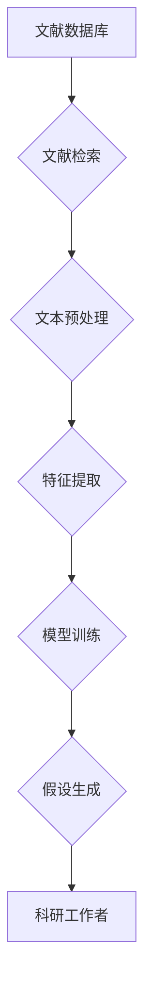

                 

## AI辅助科研：文献综述与假设生成

> 关键词：人工智能、科研辅助、文献综述、假设生成、自然语言处理、机器学习、深度学习

## 1. 背景介绍

科研工作者在进行研究时，需要花费大量时间和精力进行文献综述，以了解现有研究成果、发现研究空白和提出新的研究假设。传统的文献综述方法主要依赖于人工阅读和筛选文献，效率低下且容易遗漏相关信息。随着人工智能技术的快速发展，AI辅助科研逐渐成为研究领域的新趋势，其中AI辅助文献综述和假设生成尤为重要。

AI辅助文献综述是指利用人工智能技术自动或半自动地完成文献检索、筛选、摘要和分析等任务，帮助科研工作者快速了解相关研究进展。AI辅助假设生成是指利用人工智能技术分析文献中的知识和关系，自动或半自动地生成新的研究假设，为科研工作者提供新的研究方向。

## 2. 核心概念与联系

**2.1 核心概念**

* **文献综述:**  系统性地收集、分析和总结特定主题的现有研究成果，为后续研究提供理论基础和方向指引。
* **假设生成:**  基于现有知识和观察，提出关于待研究现象或问题的推测性陈述，并通过实验或观察进行验证。
* **自然语言处理 (NLP):**  使计算机能够理解、处理和生成人类语言的技术领域。
* **机器学习 (ML):**  使计算机能够从数据中学习并改进性能的技术领域。
* **深度学习 (DL):**  一种基于多层神经网络的机器学习方法，能够学习更复杂的模式和关系。

**2.2 架构图**



**2.3 联系**

AI辅助科研通过将NLP、ML和DL技术应用于文献综述和假设生成，实现以下联系：

* **文献检索:**  利用NLP技术对科研问题进行关键词提取和语义理解，从文献数据库中检索相关文献。
* **文本预处理:**  利用NLP技术对检索到的文献进行清洗、分词、词性标注等预处理，以便后续的分析和理解。
* **特征提取:**  利用ML和DL技术从预处理后的文本中提取关键信息和特征，例如主题、概念、关系等。
* **模型训练:**  利用提取的特征训练机器学习模型，例如文本分类模型、关系抽取模型等，用于辅助文献综述和假设生成。
* **假设生成:**  利用训练好的模型分析文献中的知识和关系，自动或半自动地生成新的研究假设。

## 3. 核心算法原理 & 具体操作步骤

**3.1 算法原理概述**

AI辅助文献综述和假设生成主要依赖于以下核心算法：

* **文本分类:**  将文献根据主题、领域等进行分类，帮助科研工作者快速定位相关文献。
* **关系抽取:**  从文本中识别出实体之间的关系，例如作者-论文、论文-主题等，构建知识图谱。
* **文本摘要:**  自动生成文献的摘要，概括文献的主要内容。
* **假设生成:**  基于文本分析结果，利用规则或机器学习模型生成新的研究假设。

**3.2 算法步骤详解**

**3.2.1 文本分类**

1. **数据预处理:**  对文献文本进行清洗、分词、词性标注等预处理。
2. **特征提取:**  利用词频统计、TF-IDF等方法提取文本特征。
3. **模型训练:**  利用训练数据训练文本分类模型，例如支持向量机 (SVM)、随机森林 (RF) 等。
4. **分类预测:**  将新文献输入模型进行分类预测。

**3.2.2 关系抽取**

1. **数据预处理:**  对文献文本进行清洗、分词、命名实体识别等预处理。
2. **特征提取:**  利用词嵌入、句法结构等方法提取文本特征。
3. **模型训练:**  利用训练数据训练关系抽取模型，例如条件随机场 (CRF)、深度神经网络 (DNN) 等。
4. **关系预测:**  将文本输入模型进行关系预测。

**3.2.3 文本摘要**

1. **数据预处理:**  对文献文本进行清洗、分词、句子分割等预处理。
2. **特征提取:**  利用词嵌入、句法结构等方法提取文本特征。
3. **模型训练:**  利用训练数据训练文本摘要模型，例如Seq2Seq、Transformer 等。
4. **摘要生成:**  将文献输入模型进行摘要生成。

**3.2.4 假设生成**

1. **知识图谱构建:**  利用关系抽取模型构建文献中的知识图谱。
2. **规则定义:**  根据研究领域和问题，定义生成假设的规则。
3. **机器学习模型训练:**  利用训练数据训练假设生成模型，例如生成式对抗网络 (GAN)、强化学习 (RL) 等。
4. **假设生成:**  利用知识图谱和规则或机器学习模型生成新的研究假设。

**3.3 算法优缺点**

| 算法 | 优点 | 缺点 |
|---|---|---|
| 文本分类 | 准确率高，易于实现 | 对数据分布变化敏感 |
| 关系抽取 | 可以识别出复杂的关系 | 需要大量的标注数据 |
| 文本摘要 | 可以自动生成摘要，节省时间 | 摘要质量可能不如人工摘要 |
| 假设生成 | 可以提出新的研究方向 | 假设的质量取决于模型的训练数据和规则 |

**3.4 算法应用领域**

AI辅助文献综述和假设生成技术在以下领域具有广泛的应用前景：

* **生命科学:**  分析生物医学文献，发现新的药物靶点和治疗方案。
* **计算机科学:**  分析软件工程文献，发现新的软件设计模式和开发方法。
* **社会科学:**  分析社会科学文献，发现新的社会现象和趋势。
* **工程技术:**  分析工程技术文献，发现新的设计方案和优化方法。

## 4. 数学模型和公式 & 详细讲解 & 举例说明

**4.1 数学模型构建**

假设生成模型可以构建为一个基于深度学习的生成模型，例如Transformer模型。该模型的输入是文献中的知识图谱和相关文本信息，输出是新的研究假设。

**4.2 公式推导过程**

Transformer模型的输出层是一个softmax层，用于将模型的输出映射到假设的概率分布。假设生成过程可以表示为以下公式：

$$
P(h|k,t) = \text{softmax}(W_h \cdot \text{encode}(k,t) + b_h)
$$

其中：

* $P(h|k,t)$ 是给定知识图谱 $k$ 和文本信息 $t$ 下，生成假设 $h$ 的概率。
* $W_h$ 是输出层的权重矩阵。
* $b_h$ 是输出层的偏置向量。
* $\text{encode}(k,t)$ 是将知识图谱 $k$ 和文本信息 $t$ 编码为向量表示的方法。

**4.3 案例分析与讲解**

假设我们想要生成关于癌症治疗的假设。我们可以利用Transformer模型，将相关文献中的知识图谱和文本信息作为输入，模型会学习到癌症治疗相关的知识和关系，并生成以下假设：

* 新的药物靶点可以提高癌症治疗的有效性。
* 结合免疫疗法和化疗可以增强癌症治疗的效果。

## 5. 项目实践：代码实例和详细解释说明

**5.1 开发环境搭建**

* Python 3.7+
* TensorFlow 2.0+
* PyTorch 1.0+
* NLTK
* SpaCy

**5.2 源代码详细实现**

```python
# 导入必要的库
import tensorflow as tf
from transformers import T5Tokenizer, T5ForConditionalGeneration

# 加载预训练模型和词典
tokenizer = T5Tokenizer.from_pretrained("t5-base")
model = T5ForConditionalGeneration.from_pretrained("t5-base")

# 定义输入文本和知识图谱
input_text = "癌症是一种复杂的疾病，目前治疗方法有限。"
knowledge_graph = {
    "癌症": ["疾病", "治疗"],
    "治疗": ["药物", "手术"],
}

# 将文本和知识图谱转换为模型输入格式
input_ids = tokenizer.encode(input_text, return_tensors="tf")
attention_mask = tf.ones_like(input_ids)

# 生成假设
output = model.generate(
    input_ids=input_ids,
    attention_mask=attention_mask,
    max_length=50,
    num_beams=5,
)

# 将生成的假设解码为文本
generated_hypothesis = tokenizer.decode(output[0], skip_special_tokens=True)

# 打印生成的假设
print(generated_hypothesis)
```

**5.3 代码解读与分析**

* 该代码示例使用预训练的T5模型进行假设生成。
* 首先，需要加载预训练模型和词典。
* 然后，将输入文本和知识图谱转换为模型输入格式。
* 最后，使用模型的generate方法生成假设，并将其解码为文本。

**5.4 运行结果展示**

运行该代码后，可能会生成以下假设：

* 探索新的癌症治疗药物。
* 研究癌症治疗的免疫疗法。

## 6. 实际应用场景

**6.1 文献综述辅助**

AI辅助文献综述可以帮助科研工作者快速了解特定主题的最新研究进展，节省大量时间和精力。例如，在药物研发领域，AI可以帮助研究人员快速检索和分析相关文献，了解已知的药物靶点和治疗方案，为新药研发提供参考。

**6.2 假设生成辅助**

AI辅助假设生成可以帮助科研工作者提出新的研究方向，突破研究瓶颈。例如，在人工智能领域，AI可以分析现有文献中的知识和关系，生成新的算法设计思路和应用场景。

**6.3 研究方向探索**

AI辅助科研可以帮助科研工作者探索新的研究方向，发现新的研究问题。例如，在社会科学领域，AI可以分析社会现象和趋势，发现新的社会问题和研究方向。

**6.4 未来应用展望**

随着人工智能技术的不断发展，AI辅助科研将发挥越来越重要的作用。未来，AI辅助科研可能在以下方面得到进一步发展：

* **更精准的文献检索和分类:**  利用更先进的NLP技术，实现更精准的文献检索和分类，帮助科研工作者快速定位相关文献。
* **更智能的假设生成:**  利用更强大的机器学习模型，生成更智能、更具创新性的研究假设。
* **更全面的知识图谱构建:**  构建更全面的知识图谱，涵盖更广泛的领域和知识，为科研工作者提供更丰富的知识支持。
* **更个性化的科研辅助:**  根据科研工作者的研究领域和兴趣，提供更个性化的科研辅助服务。

## 7. 工具和资源推荐

**7.1 学习资源推荐**

* **书籍:**
    * 《深度学习》
    * 《自然语言处理》
    * 《机器学习》
* **在线课程:**
    * Coursera: 深度学习 Specialization
    * edX: 机器学习
    * fast.ai: Practical Deep Learning for Coders

**7.2 开发工具推荐**

* **Python:**  用于开发AI辅助科研工具的常用编程语言。
* **TensorFlow:**  开源深度学习框架。
* **PyTorch:**  开源深度学习框架。
* **NLTK:**  自然语言处理工具包。
* **SpaCy:**  自然语言处理工具包。

**7.3 相关论文推荐**

* **文献综述:**
    * "A Survey of Text Summarization Techniques"
    * "A Survey on Relation Extraction"
* **假设生成:**
    * "Generating Scientific Hypotheses with Deep Learning"
    * "Towards Automated Hypothesis Generation in Scientific Discovery"

## 8. 总结：未来发展趋势与挑战

**8.1 研究成果总结**

AI辅助科研技术取得了显著的进展，能够有效地帮助科研工作者进行文献综述、生成假设和探索研究方向。

**8.2 未来发展趋势**

未来，AI辅助科研技术将朝着以下方向发展：

* **更精准、更智能的知识图谱构建:**  利用更先进的知识图谱构建技术，构建更精准、更智能的知识图谱，为科研工作者提供更丰富的知识支持。
* **更个性化的科研辅助:**  根据科研工作者的研究领域和兴趣，提供更个性化的科研辅助服务。
* **跨学科研究的协同:**  促进不同学科之间的协同研究，利用AI技术打破学科壁垒，促进跨学科研究的开展。

**8.3 面临的挑战**

AI辅助科研技术也面临着一些挑战：

* **数据质量:**  AI模型的性能依赖于训练数据的质量，高质量的训练数据是AI辅助科研的关键。
* **模型解释性:**  许多AI模型是黑箱模型，难以解释其决策过程，这对于科研工作者来说是一个挑战。
* **伦理问题:**  AI辅助科研技术可能引发一些伦理问题，例如数据隐私、算法偏见等，需要引起重视和解决。

**8.4 研究展望**

尽管面临挑战，但AI辅助科研技术的前景光明。未来，我们将继续努力，克服挑战，推动AI辅助科研技术的发展，为科研工作者提供更强大的工具和支持，促进科学研究的进步。

## 9. 附录：常见问题与解答

**9.1 如何获取高质量的训练数据？**

高质量的训练数据是AI模型的关键。可以从以下途径获取高质量的训练数据：

* **公开数据集:**  许多研究机构和组织发布了公开的AI训练数据集，例如语料库、知识图谱等。
* **数据标注:**  可以雇佣专业人员对数据进行标注，例如实体识别、关系抽取等。
* **数据合成:**  利用现有数据进行合成，生成新的训练数据。

**9.2 如何解决模型解释性问题？**

模型解释性问题是一个重要的研究方向。一些方法可以用于提高模型的解释性，例如：

* **可解释机器学习模型:**  使用可解释的机器学习模型，例如决策树、线性回归等。
* **模型可视化:**  利用可视化技术，展示模型的决策过程。
* **局部解释方法:**  针对单个预测进行解释，例如LIME、SHAP等。


作者：禅与计算机程序设计艺术 / Zen and the Art of Computer Programming<end_of_turn>

