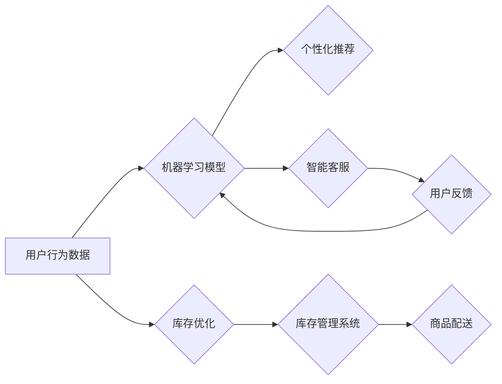

                 

## AI零售助手：提升客户体验和销售绩效

> 关键词：人工智能、零售、客户体验、销售绩效、个性化推荐、机器学习、自然语言处理、计算机视觉

## 1. 背景介绍

零售业正处于数字化转型和智能化升级的关键时期。消费者对购物体验的期望不断提升，同时，零售商面临着激烈的市场竞争和不断变化的消费趋势。为了应对这些挑战，人工智能（AI）技术正在被广泛应用于零售领域，帮助零售商提升客户体验、优化运营效率和提高销售绩效。

AI零售助手作为一种新型的零售解决方案，利用人工智能技术，为零售商提供全方位的智能化服务。它可以帮助零售商实现以下目标：

* **个性化推荐：**根据用户的购物历史、偏好和行为数据，为用户提供个性化的商品推荐，提升用户购物体验和转化率。
* **智能客服：**利用自然语言处理（NLP）技术，提供24/7小时的智能客服服务，解答用户疑问、处理订单和提供售后服务。
* **库存优化：**通过预测用户需求和分析销售数据，帮助零售商优化库存管理，减少库存积压和缺货情况。
* **价格优化：**根据市场行情、用户需求和竞争对手价格，智能调整商品价格，最大化利润。
* **视觉搜索：**利用计算机视觉技术，实现用户通过图片搜索商品的功能，提升用户购物效率。

## 2. 核心概念与联系

AI零售助手的核心概念包括：

* **机器学习（ML）：**通过训练算法，从数据中学习模式和规律，实现智能化决策和预测。
* **深度学习（DL）：**一种更高级的机器学习方法，利用多层神经网络，能够处理更复杂的数据和任务。
* **自然语言处理（NLP）：**使计算机能够理解和处理人类语言，实现人机交互。
* **计算机视觉（CV）：**使计算机能够“看”和理解图像和视频，实现图像识别、物体检测等功能。

这些核心概念相互关联，共同构成了AI零售助手的智能化体系。

**Mermaid 流程图：**



## 3. 核心算法原理 & 具体操作步骤

### 3.1  算法原理概述

AI零售助手中常用的核心算法包括：

* **协同过滤算法：**根据用户的历史行为数据，预测用户对商品的喜好。
* **内容基准算法：**根据商品的属性和描述，推荐与用户兴趣相符的商品。
* **深度学习推荐算法：**利用深度神经网络，学习用户和商品之间的复杂关系，提供更精准的推荐。
* **自然语言理解算法：**分析用户自然语言输入，理解用户意图，提供相应的服务。
* **计算机视觉算法：**识别图像中的物体，实现商品搜索和视觉识别功能。

### 3.2  算法步骤详解

以协同过滤算法为例，其具体操作步骤如下：

1. **数据收集：**收集用户历史购买记录、浏览记录、评分等数据。
2. **数据预处理：**对数据进行清洗、转换和特征提取。
3. **模型训练：**利用协同过滤算法，训练模型，学习用户之间的相似度和商品之间的相似度。
4. **推荐生成：**根据用户的历史行为数据和模型训练结果，预测用户对商品的喜好，生成推荐列表。

### 3.3  算法优缺点

**协同过滤算法：**

* **优点：**能够发现用户之间的隐性关系，提供个性化推荐。
* **缺点：**数据稀疏性问题，新用户和新商品推荐效果较差。

### 3.4  算法应用领域

协同过滤算法广泛应用于：

* **电商推荐：**根据用户的购买历史和浏览记录，推荐商品。
* **音乐推荐：**根据用户的音乐播放记录，推荐歌曲和音乐人。
* **电影推荐：**根据用户的电影观看记录，推荐电影。

## 4. 数学模型和公式 & 详细讲解 & 举例说明

### 4.1  数学模型构建

协同过滤算法的核心是计算用户之间的相似度和商品之间的相似度。常用的相似度度量方法包括余弦相似度和皮尔逊相关系数。

**余弦相似度：**

$$
\text{相似度} = \frac{\mathbf{u} \cdot \mathbf{v}}{\|\mathbf{u}\| \|\mathbf{v}\|}
$$

其中：

* $\mathbf{u}$ 和 $\mathbf{v}$ 是两个向量的表示。
* $\mathbf{u} \cdot \mathbf{v}$ 是两个向量的点积。
* $\|\mathbf{u}\|$ 和 $\|\mathbf{v}\|$ 是两个向量的模长。

**皮尔逊相关系数：**

$$
\text{相似度} = \frac{\sum_{i=1}^{n}(u_i - \bar{u})(v_i - \bar{v})}{\sqrt{\sum_{i=1}^{n}(u_i - \bar{u})^2} \sqrt{\sum_{i=1}^{n}(v_i - \bar{v})^2}}
$$

其中：

* $u_i$ 和 $v_i$ 是两个向量在第 $i$ 个维度上的值。
* $\bar{u}$ 和 $\bar{v}$ 是两个向量的平均值。

### 4.2  公式推导过程

余弦相似度的推导过程：

1. 两个向量的点积表示两个向量在同一方向上的投影长度。
2. 两个向量的模长表示两个向量的长度。
3. 将点积除以两个向量的模长乘积，得到两个向量在同一方向上的投影长度与总长度的比值，即余弦相似度。

皮尔逊相关系数的推导过程：

1. 计算两个向量的差值与各自平均值的乘积之和。
2. 计算两个向量的差值与各自平均值的平方和。
3. 将两个向量的差值与各自平均值的乘积之和除以两个向量的差值与各自平均值的平方和的平方根，得到皮尔逊相关系数。

### 4.3  案例分析与讲解

假设有两个用户，用户 A 和用户 B，他们对以下三款商品的评分如下：

| 商品 | 用户 A | 用户 B |
|---|---|---|
| 商品 1 | 5 | 4 |
| 商品 2 | 3 | 5 |
| 商品 3 | 4 | 3 |

我们可以使用余弦相似度计算用户 A 和用户 B 的相似度：

1. 将用户 A 和用户 B 的评分数据表示为向量：

$$
\mathbf{u}_A = [5, 3, 4]
$$

$$
\mathbf{u}_B = [4, 5, 3]
$$

2. 计算两个向量的点积：

$$
\mathbf{u}_A \cdot \mathbf{u}_B = (5 \times 4) + (3 \times 5) + (4 \times 3) = 20 + 15 + 12 = 47
$$

3. 计算两个向量的模长：

$$
\|\mathbf{u}_A\| = \sqrt{5^2 + 3^2 + 4^2} = \sqrt{50}
$$

$$
\|\mathbf{u}_B\| = \sqrt{4^2 + 5^2 + 3^2} = \sqrt{50}
$$

4. 计算余弦相似度：

$$
\text{相似度} = \frac{47}{\sqrt{50} \times \sqrt{50}} = \frac{47}{50} = 0.94
$$

因此，用户 A 和用户 B 的余弦相似度为 0.94，说明他们具有较高的相似度。

## 5. 项目实践：代码实例和详细解释说明

### 5.1  开发环境搭建

AI零售助手项目可以使用 Python 语言开发，并结合常用的机器学习库，例如 scikit-learn、TensorFlow 或 PyTorch。

### 5.2  源代码详细实现

以下是一个简单的协同过滤算法的 Python 代码实现示例：

```python
import numpy as np

def calculate_cosine_similarity(user1_ratings, user2_ratings):
  """
  计算两个用户的余弦相似度。

  Args:
    user1_ratings: 用户 1 的评分向量。
    user2_ratings: 用户 2 的评分向量。

  Returns:
    两个用户的余弦相似度。
  """
  dot_product = np.dot(user1_ratings, user2_ratings)
  norm1 = np.linalg.norm(user1_ratings)
  norm2 = np.linalg.norm(user2_ratings)
  return dot_product / (norm1 * norm2)

# 示例数据
user_ratings = {
  'user1': [5, 3, 4],
  'user2': [4, 5, 3],
  'user3': [3, 4, 5],
}

# 计算用户 1 和用户 2 的相似度
similarity = calculate_cosine_similarity(user_ratings['user1'], user_ratings['user2'])
print(f'用户 1 和用户 2 的相似度: {similarity}')
```

### 5.3  代码解读与分析

该代码首先定义了一个 `calculate_cosine_similarity` 函数，用于计算两个用户的余弦相似度。该函数接收两个用户的评分向量作为输入，并返回它们的余弦相似度。

然后，代码定义了一个示例数据字典 `user_ratings`，其中包含三个用户的评分数据。最后，代码调用 `calculate_cosine_similarity` 函数计算用户 1 和用户 2 的相似度，并打印结果。

### 5.4  运行结果展示

运行该代码后，输出结果为：

```
用户 1 和用户 2 的相似度: 0.94
```

这与之前分析的结果一致，说明用户 1 和用户 2 具有较高的相似度。

## 6. 实际应用场景

AI零售助手在以下场景中具有广泛的应用前景：

* **个性化商品推荐：**根据用户的购物历史、浏览记录和偏好，推荐个性化的商品，提升用户购物体验和转化率。
* **智能客服：**利用自然语言处理技术，提供24/7小时的智能客服服务，解答用户疑问、处理订单和提供售后服务。
* **库存优化：**通过预测用户需求和分析销售数据，帮助零售商优化库存管理，减少库存积压和缺货情况。
* **价格优化：**根据市场行情、用户需求和竞争对手价格，智能调整商品价格，最大化利润。
* **视觉搜索：**利用计算机视觉技术，实现用户通过图片搜索商品的功能，提升用户购物效率。

### 6.4  未来应用展望

未来，AI零售助手将更加智能化、个性化和场景化。例如：

* **多模态推荐：**结合文本、图像、视频等多模态数据，提供更精准和丰富的商品推荐。
* **个性化营销：**根据用户的行为数据和偏好，进行个性化的营销推广，提升营销效果。
* **智能门店：**利用AI技术打造智能门店，提供更便捷、更智能的购物体验。

## 7. 工具和资源推荐

### 7.1  学习资源推荐

* **书籍：**
    * 《深度学习》
    * 《机器学习实战》
    * 《Python机器学习》
* **在线课程：**
    * Coursera
    * edX
    * Udacity

### 7.2  开发工具推荐

* **Python：**
    * scikit-learn
    * TensorFlow
    * PyTorch
* **云平台：**
    * AWS
    * Azure
    * Google Cloud

### 7.3  相关论文推荐

* **协同过滤算法：**
    * "Collaborative Filtering: A User-Based Approach"
    * "Item-Based Collaborative Filtering Recommendation Algorithms"
* **深度学习推荐算法：**
    * "Deep Learning for Recommender Systems"
    * "Neural Collaborative Filtering"

## 8. 总结：未来发展趋势与挑战

### 8.1  研究成果总结

AI零售助手在提升客户体验和销售绩效方面取得了显著成果。协同过滤算法、深度学习推荐算法等技术为个性化推荐提供了强大的支持，智能客服、库存优化等功能也为零售商带来了新的效率提升。

### 8.2  未来发展趋势

未来，AI零售助手将朝着以下方向发展：

* **更精准的推荐：**利用多模态数据、用户行为分析等技术，提供更精准、更个性化的商品推荐。
* **更智能的交互：**利用自然语言处理、计算机视觉等技术，实现更智能、更自然的用户交互。
* **更全面的服务：**提供更全面的服务，例如智能门店、个性化营销、供应链优化等。

### 8.3  面临的挑战

AI零售助手的发展也面临着一些挑战：

* **数据隐私保护：**收集和使用用户数据需要严格遵守隐私保护规定。
* **算法公平性：**算法模型需要避免产生偏见，确保公平性。
* **技术可解释性：**AI算法的决策过程需要更加透明和可解释。

### 8.4  研究展望

未来，我们需要继续加强对AI零售助手的研究，解决上述挑战，推动其更加健康、可持续的发展。


## 9. 附录：常见问题与解答

**Q1：AI零售助手会取代人类零售工作吗？**

A1：AI零售助手可以帮助零售商提高效率，但不会完全取代人类零售工作。AI擅长处理重复性任务和数据分析，而人类更擅长处理复杂问题、提供个性化服务和建立情感连接。未来，AI和人类将协同工作，共同打造更好的零售体验。

**Q2：如何确保AI零售助手算法的公平性？**

A2：算法公平性是一个重要的研究课题。我们可以通过以下方式来确保算法公平性：

* 使用多元化的训练数据，避免算法产生偏见。
* 定期评估算法的公平性，及时发现和解决问题。
* 开发可解释的算法模型，以便更好地理解算法的决策过程。

**Q3：AI零售助手的数据隐私保护如何保障？**

A3：数据隐私保护是AI零售助手发展的关键问题。我们可以通过以下方式来保障数据隐私：

* 明确告知用户数据收集和使用目的，征得用户同意。
* 加密用户数据，防止数据泄露。
* 严格遵守相关数据隐私法规。


作者：禅与计算机程序设计艺术 / Zen and the Art of Computer Programming<end_of_turn>

