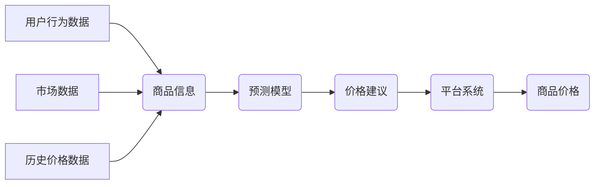

                 

## AI驱动的电商平台智能定价系统设计

> 关键词：电商平台、智能定价、机器学习、预测模型、价格优化、数据分析、深度学习

## 1. 背景介绍

在当今激烈的电商竞争环境中，定价策略对电商平台的成功至关重要。传统的定价方法往往依赖于人工经验和市场调研，缺乏灵活性、精准性和数据驱动性。随着人工智能技术的快速发展，AI驱动的智能定价系统应运而生，为电商平台提供了更智能、高效、精准的定价解决方案。

智能定价系统能够通过分析海量商品数据、市场趋势、用户行为等信息，预测商品的未来需求和价格波动，并根据预设的目标和策略，自动调整商品价格，从而最大化平台的利润和用户满意度。

## 2. 核心概念与联系

### 2.1  核心概念

* **智能定价 (Dynamic Pricing):**  根据实时数据和算法分析，自动调整商品价格的策略。
* **机器学习 (Machine Learning):**  通过算法训练，使系统能够从数据中学习并做出预测或决策。
* **预测模型 (Predictive Model):**  基于历史数据和相关因素，预测未来事件或趋势的数学模型。
* **价格优化 (Price Optimization):**  通过算法和数据分析，找到最优的定价策略，最大化利润或其他目标。

### 2.2  架构



**架构说明:**

1. **数据收集:** 系统从用户行为数据、商品信息、市场数据和历史价格数据等多个来源收集数据。
2. **数据预处理:** 收集到的数据需要进行清洗、转换和特征工程等预处理步骤，以便于模型训练和预测。
3. **模型训练:** 使用机器学习算法，训练预测模型，例如线性回归、决策树、支持向量机等，以预测商品的未来需求和价格波动。
4. **价格建议:** 预测模型根据训练结果，生成商品价格建议。
5. **价格调整:** 平台系统根据价格建议，调整商品价格。
6. **价格反馈:**  调整后的价格会反馈到系统，用于模型更新和优化。

## 3. 核心算法原理 & 具体操作步骤

### 3.1  算法原理概述

智能定价系统通常采用基于机器学习的预测模型，例如回归模型、分类模型和时间序列模型等。这些模型通过分析历史数据和相关因素，预测商品的未来需求和价格波动。

* **回归模型:** 用于预测连续数值，例如商品价格、销量等。
* **分类模型:** 用于预测离散类别，例如商品是否会售罄、用户是否会购买等。
* **时间序列模型:** 用于预测时间序列数据，例如商品价格随时间变化的趋势。

### 3.2  算法步骤详解

1. **数据收集:** 收集商品信息、用户行为数据、市场数据和历史价格数据等。
2. **数据预处理:** 清洗、转换和特征工程，将数据转换为模型可理解的格式。
3. **模型选择:** 根据预测目标和数据特点，选择合适的机器学习模型。
4. **模型训练:** 使用训练数据，训练选择的模型，并评估模型性能。
5. **模型优化:** 通过调整模型参数和特征选择，优化模型性能。
6. **预测:** 使用训练好的模型，预测商品的未来需求和价格波动。
7. **价格建议:** 根据预测结果和平台策略，生成商品价格建议。
8. **价格调整:** 平台系统根据价格建议，调整商品价格。

### 3.3  算法优缺点

**优点:**

* **数据驱动:** 基于海量数据分析，更精准、高效地预测商品需求和价格波动。
* **自动化:** 自动化定价过程，节省人工成本和时间。
* **灵活性:** 可以根据市场变化和平台策略动态调整价格。

**缺点:**

* **数据依赖:** 模型性能依赖于数据质量和数量。
* **算法复杂:** 需要专业的机器学习知识和技术能力。
* **解释性:** 部分机器学习模型的决策过程难以解释，可能导致定价策略难以理解和调整。

### 3.4  算法应用领域

* **电商平台:** 智能定价系统广泛应用于电商平台，帮助平台优化商品价格，提高利润和用户满意度。
* **旅游业:** 用于动态调整机票、酒店和旅游套餐的价格，根据市场需求和竞争情况进行优化。
* **交通运输:** 用于动态调整出租车、共享单车和火车票的价格，根据交通流量和供需关系进行调整。
* **能源行业:** 用于预测能源价格波动，帮助能源公司制定合理的供需策略。

## 4. 数学模型和公式 & 详细讲解 & 举例说明

### 4.1  数学模型构建

智能定价系统通常采用回归模型来预测商品价格。一个简单的线性回归模型可以表示为：

$$
P = a + bQ + cT + dS
$$

其中：

* $P$：预测的商品价格
* $Q$：商品的销量
* $T$：时间因素，例如日期、季节等
* $S$：市场竞争情况，例如同类商品的价格

$a$、$b$、$c$、$d$ 是模型参数，需要通过训练数据进行估计。

### 4.2  公式推导过程

线性回归模型的目标是找到最佳的模型参数，使得预测价格与实际价格之间的误差最小。可以使用最小二乘法来估计模型参数。最小二乘法的原理是：

* 计算预测价格与实际价格之间的平方误差。
* 找到使平方误差最小化的模型参数。

### 4.3  案例分析与讲解

假设我们有一个电商平台，想要预测商品 A 的价格。收集了以下数据：

* 商品 A 的销量 (Q)
* 日期 (T)
* 同类商品的价格 (S)
* 商品 A 的实际价格 (P)

使用线性回归模型训练数据，得到以下模型参数：

* $a = 10$
* $b = 0.5$
* $c = 2$
* $d = -0.1$

现在，如果我们想要预测商品 A 在未来某一天的价格，可以将该天的销量、日期和同类商品的价格代入模型公式中，即可得到预测价格。

## 5. 项目实践：代码实例和详细解释说明

### 5.1  开发环境搭建

* **操作系统:** Linux 或 macOS
* **编程语言:** Python
* **机器学习库:** scikit-learn
* **数据处理库:** pandas
* **可视化库:** matplotlib

### 5.2  源代码详细实现

```python
import pandas as pd
from sklearn.linear_model import LinearRegression

# 加载数据
data = pd.read_csv('product_price_data.csv')

# 特征工程
X = data[['销量', '日期', '竞争价格']]
y = data['实际价格']

# 创建线性回归模型
model = LinearRegression()

# 训练模型
model.fit(X, y)

# 预测价格
new_data = pd.DataFrame({'销量': [100], '日期': [1678886400], '竞争价格': [10]})
predicted_price = model.predict(new_data)

print(f'预测价格: {predicted_price[0]}')
```

### 5.3  代码解读与分析

1. **数据加载:** 使用 pandas 库加载商品价格数据。
2. **特征工程:** 选择销量、日期和竞争价格作为预测模型的输入特征，实际价格作为输出目标。
3. **模型创建:** 使用 scikit-learn 库创建线性回归模型。
4. **模型训练:** 使用训练数据训练模型，学习模型参数。
5. **价格预测:** 使用训练好的模型，预测新数据点的价格。

### 5.4  运行结果展示

运行代码后，会输出预测价格的值。

## 6. 实际应用场景

### 6.1  电商平台

* **商品定价:** 根据商品属性、市场需求、竞争情况等因素，自动调整商品价格，提高利润和销量。
* **促销活动:** 根据用户行为和市场趋势，制定精准的促销策略，例如限时折扣、满减优惠等。
* **库存管理:** 预测商品需求，优化库存水平，避免缺货和积压。

### 6.2  旅游业

* **机票定价:** 根据航班时间、目的地、市场需求等因素，动态调整机票价格，提高收益率。
* **酒店定价:** 根据酒店位置、设施、季节性因素等，动态调整酒店价格，优化入住率。
* **旅游套餐定价:** 根据旅游目的地、行程安排、市场需求等因素，动态调整旅游套餐价格，提高竞争力。

### 6.3  其他行业

* **金融行业:** 预测股票价格、债券价格等，帮助投资者做出更明智的投资决策。
* **医疗行业:** 预测患者需求、医疗资源配置等，提高医疗服务效率。
* **制造业:** 预测产品需求、原材料价格等，优化生产计划和成本控制。

### 6.4  未来应用展望

随着人工智能技术的不断发展，AI驱动的智能定价系统将更加智能、精准和高效。未来，智能定价系统将更加深入地融入到各个行业，为企业和消费者带来更多价值。

## 7. 工具和资源推荐

### 7.1  学习资源推荐

* **书籍:**
    * 《机器学习》 - 周志华
    * 《Python机器学习实战》 - 塞缪尔·阿布拉姆斯
* **在线课程:**
    * Coursera: Machine Learning
    * edX: Artificial Intelligence
* **博客和网站:**
    * Towards Data Science
    * Machine Learning Mastery

### 7.2  开发工具推荐

* **Python:** 
    * scikit-learn: 机器学习库
    * pandas: 数据处理库
    * matplotlib: 可视化库
* **云平台:**
    * AWS: Amazon Web Services
    * Azure: Microsoft Azure
    * GCP: Google Cloud Platform

### 7.3  相关论文推荐

* **《Dynamic Pricing with Machine Learning》**
* **《A Survey of Dynamic Pricing Algorithms》**
* **《Deep Learning for Dynamic Pricing》**

## 8. 总结：未来发展趋势与挑战

### 8.1  研究成果总结

AI驱动的智能定价系统已经取得了显著的成果，在电商平台、旅游业等领域得到了广泛应用。

### 8.2  未来发展趋势

* **更精准的预测:** 利用更先进的机器学习算法和数据分析技术，提高价格预测的准确性。
* **更个性化的定价:** 根据用户的购买历史、偏好和行为等信息，提供个性化的价格建议。
* **更智能的决策:** 将智能定价系统与其他业务系统集成，实现更智能的决策，例如库存管理、促销活动等。

### 8.3  面临的挑战

* **数据质量:** 模型性能依赖于数据质量，需要不断收集和清洗数据，保证数据的准确性和完整性。
* **算法解释性:** 部分机器学习模型的决策过程难以解释，需要开发更可解释的算法，提高定价策略的可理解性和可调整性。
* **伦理问题:** 智能定价系统可能会导致价格歧视等伦理问题，需要制定相应的规范和制度，确保公平公正的定价。

### 8.4  研究展望

未来，AI驱动的智能定价系统将继续朝着更智能、更精准、更个性化的方向发展，为企业和消费者带来更多价值。


## 9. 附录：常见问题与解答

**Q1: 智能定价系统会影响用户体验吗？**

A1:  智能定价系统可以根据用户行为和市场趋势，提供更精准的价格建议，帮助用户找到更优惠的价格，从而提升用户体验。

**Q2: 智能定价系统是否会造成价格波动过大？**

A2:  智能定价系统会根据预设的策略和市场情况，动态调整价格，但不会造成价格波动过大。平台可以设置价格调整的幅度和频率，确保价格变化合理。

**Q3: 如何评估智能定价系统的效果？**

A3:  可以通过分析平台的利润、销量、用户满意度等指标来评估智能定价系统的效果。

**作者：禅与计算机程序设计艺术 / Zen and the Art of Computer Programming**<end_of_turn>

