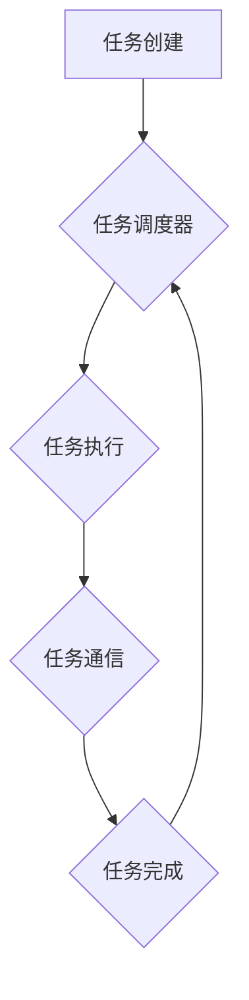

                 

## FreeRTOS任务调度与通信

> 关键词：FreeRTOS, 任务调度, 任务通信, 协作, 互斥, 消息队列, Semaphore, 事件组, 嵌入式系统, real-time

## 1. 背景介绍

在嵌入式系统领域，实时性、资源约束和可靠性是至关重要的。FreeRTOS是一个开源的实时操作系统，专门为微控制器和嵌入式系统设计，以其轻量级、易于使用和高性能而闻名。FreeRTOS的核心功能之一是任务调度，它负责管理多个任务的执行，并确保它们按需按时完成。此外，FreeRTOS还提供了一系列任务通信机制，使任务之间能够安全、高效地交换数据和信息。

本文将深入探讨FreeRTOS的任务调度和通信机制，分析其原理、算法和应用场景，并通过代码实例和案例分析，帮助读者理解FreeRTOS在嵌入式系统中的应用。

## 2. 核心概念与联系

FreeRTOS的任务调度和通信机制基于以下核心概念：

* **任务 (Task):**  FreeRTOS中的任务是独立执行的代码块，每个任务都有自己的栈和优先级。任务可以并发执行，从而提高系统的效率。
* **任务调度器 (Scheduler):**  任务调度器是FreeRTOS的核心组件，负责管理任务的执行顺序和时间分配。它根据任务的优先级和运行时间，选择并调度任务执行。
* **任务通信 (Task Communication):**  任务通信机制允许任务之间安全、高效地交换数据和信息。FreeRTOS提供多种通信机制，包括消息队列、信号量和事件组。

**FreeRTOS 任务调度与通信关系流程图:**



## 3. 核心算法原理 & 具体操作步骤

### 3.1  算法原理概述

FreeRTOS的任务调度器采用优先级调度算法，即任务的优先级越高，调度器越倾向于调度该任务执行。调度器使用一个任务队列来存储所有任务，并根据任务的优先级对队列进行排序。当任务调度器需要选择一个任务执行时，它会从队列头部选择优先级最高的任务。

### 3.2  算法步骤详解

1. **任务创建:**  应用程序创建任务时，需要指定任务的名称、堆栈大小、优先级和任务函数。
2. **任务加入队列:**  FreeRTOS将创建的任务添加到任务队列中，并根据任务的优先级对队列进行排序。
3. **任务调度:**  FreeRTOS的任务调度器在系统空闲时或任务切换时，会从任务队列头部选择一个任务执行。
4. **任务执行:**  调度器将选择的任务切换到CPU，并执行任务函数。
5. **任务完成:**  当任务执行完成时，它会返回到FreeRTOS，并释放CPU资源。

### 3.3  算法优缺点

**优点:**

* **简单易懂:**  优先级调度算法易于理解和实现。
* **实时性:**  优先级调度算法可以保证高优先级的任务得到及时执行，满足实时性要求。

**缺点:**

* **优先级争用:**  如果多个任务具有相同的优先级，调度器可能会陷入死锁或性能下降。
* **任务响应时间不确定:**  任务的响应时间取决于任务队列中的任务数量和优先级。

### 3.4  算法应用领域

优先级调度算法广泛应用于各种嵌入式系统，例如：

* **工业控制系统:**  工业控制系统需要实时响应传感器数据和执行控制指令。
* **医疗设备:**  医疗设备需要保证实时性，以确保患者的安全。
* **汽车电子系统:**  汽车电子系统需要实时处理各种传感器数据和执行控制指令。

## 4. 数学模型和公式 & 详细讲解 & 举例说明

### 4.1  数学模型构建

FreeRTOS的任务调度器可以使用数学模型来描述其行为。假设有N个任务，每个任务都有一个优先级 $p_i$，其中 $1 \leq i \leq N$。任务的执行时间可以表示为 $t_i$。

任务队列可以表示为一个有序列表，其中任务按照优先级排序。

### 4.2  公式推导过程

任务调度器的目标是最大化系统的吞吐量，即在给定的时间内完成尽可能多的任务。

吞吐量可以表示为：

$$
Throughput = \frac{Total \ tasks \ completed}{Total \ time}
$$

为了最大化吞吐量，调度器需要选择优先级最高的任务执行。

### 4.3  案例分析与讲解

假设有三个任务，它们的优先级和执行时间分别为：

* 任务1: $p_1 = 3$, $t_1 = 10$
* 任务2: $p_2 = 2$, $t_2 = 5$
* 任务3: $p_3 = 1$, $t_3 = 15$

根据优先级调度算法，调度器会优先执行任务1，然后执行任务2，最后执行任务3。

在这种情况下，吞吐量为：

$$
Throughput = \frac{3}{10 + 5 + 15} = \frac{3}{30} = 0.1
$$

## 5. 项目实践：代码实例和详细解释说明

### 5.1  开发环境搭建

本示例使用FreeRTOS官方提供的示例代码，并基于STM32F103开发板进行测试。

### 5.2  源代码详细实现

```c
#include "FreeRTOS.h"
#include "task.h"

void vTask1(void *pvParameters) {
  for (;;) {
    printf("Task 1 running\n");
    vTaskDelay(1000 / portTICK_PERIOD_MS);
  }
}

void vTask2(void *pvParameters) {
  for (;;) {
    printf("Task 2 running\n");
    vTaskDelay(500 / portTICK_PERIOD_MS);
  }
}

int main(void) {
  xTaskCreate(vTask1, "Task 1", configMINIMAL_STACK_SIZE, NULL, 1, NULL);
  xTaskCreate(vTask2, "Task 2", configMINIMAL_STACK_SIZE, NULL, 2, NULL);

  vTaskStartScheduler();

  while (1);
}
```

### 5.3  代码解读与分析

* `vTaskCreate()`函数用于创建任务。
* `vTask1()`和`vTask2()`是两个任务函数。
* `configMINIMAL_STACK_SIZE`是FreeRTOS定义的最小任务堆栈大小。
* `1`和`2`分别是任务1和任务2的优先级。
* `vTaskStartScheduler()`启动FreeRTOS任务调度器。

### 5.4  运行结果展示

运行上述代码后，两个任务将并发执行，并打印出各自的运行信息。

## 6. 实际应用场景

FreeRTOS的任务调度和通信机制广泛应用于各种嵌入式系统，例如：

* **工业自动化:**  控制机器人的运动、传感器数据采集和处理。
* **医疗设备:**  实现医疗设备的实时监控和控制，例如心率监测仪、呼吸机等。
* **智能家居:**  控制智能家居设备，例如灯光、空调、窗帘等。

### 6.4  未来应用展望

随着物联网和人工智能技术的快速发展，FreeRTOS在未来将有更广泛的应用场景，例如：

* **边缘计算:**  FreeRTOS可以用于构建边缘计算设备，实现数据处理和决策在边缘端的本地化执行。
* **工业4.0:**  FreeRTOS可以用于构建工业4.0的智能工厂，实现设备互联互通和协同工作。
* **自动驾驶:**  FreeRTOS可以用于构建自动驾驶系统的实时控制和决策模块。

## 7. 工具和资源推荐

### 7.1  学习资源推荐

* **FreeRTOS官方网站:** https://www.freertos.org/
* **FreeRTOS中文文档:** https://www.freertos.org/zh-cn/
* **FreeRTOS学习教程:** https://www.freertos.org/FreeRTOS-Tutorials.html

### 7.2  开发工具推荐

* **Keil MDK:** https://www.keil.com/
* **IAR Embedded Workbench:** https://www.iar.com/
* **STM32CubeIDE:** https://www.st.com/en/development-tools/stm32cubeide.html

### 7.3  相关论文推荐

* **FreeRTOS: A Real-Time Operating System for Microcontrollers**
* **Real-Time Scheduling Algorithms for Embedded Systems**

## 8. 总结：未来发展趋势与挑战

### 8.1  研究成果总结

FreeRTOS是一个成熟且广泛应用的实时操作系统，其任务调度和通信机制已经得到广泛认可。FreeRTOS的开源特性和易于使用性使其成为嵌入式系统开发者的首选。

### 8.2  未来发展趋势

FreeRTOS将在未来继续朝着以下方向发展：

* **更强大的功能:**  FreeRTOS将不断添加新的功能，例如支持更高级的网络协议、安全机制和人工智能算法。
* **更广泛的应用场景:**  FreeRTOS将应用于更多领域，例如边缘计算、工业4.0和自动驾驶。
* **更易于使用的开发工具:**  FreeRTOS的开发工具将更加易于使用，并提供更丰富的功能和支持。

### 8.3  面临的挑战

FreeRTOS也面临一些挑战，例如：

* **资源约束:**  嵌入式系统通常具有有限的资源，例如内存和处理器性能。FreeRTOS需要不断优化其资源使用效率。
* **安全性和可靠性:**  嵌入式系统需要保证安全性和可靠性，FreeRTOS需要不断加强其安全机制和可靠性测试。
* **竞争:**  FreeRTOS面临着来自其他实时操作系统的竞争，需要不断创新和改进以保持其竞争力。

### 8.4  研究展望

未来，FreeRTOS的研究将集中在以下几个方面：

* **资源优化:**  研究更有效的资源管理算法，以提高FreeRTOS在资源受限环境下的性能。
* **安全性和可靠性:**  研究更强大的安全机制和可靠性测试方法，以确保FreeRTOS的安全性。
* **新功能开发:**  开发新的功能，例如支持更高级的网络协议、安全机制和人工智能算法。


## 9. 附录：常见问题与解答

**Q1: FreeRTOS是免费的吗？**

A1:  是的，FreeRTOS是一个开源的实时操作系统，可以免费使用和修改。

**Q2: FreeRTOS支持哪些处理器架构？**

A2:  FreeRTOS支持多种处理器架构，包括ARM、AVR、MIPS等。

**Q3: 如何学习FreeRTOS？**

A3:  FreeRTOS官方网站提供了丰富的学习资源，包括文档、教程和示例代码。


作者：禅与计算机程序设计艺术 / Zen and the Art of Computer Programming 
<end_of_turn>

