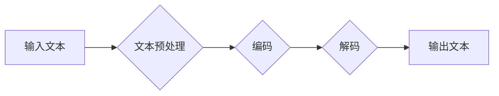

                 

## LLM 遗产：定义未来的计算

> 关键词：大型语言模型 (LLM)、人工智能 (AI)、自然语言处理 (NLP)、深度学习、Transformer、计算遗产、未来计算

### 1. 背景介绍

大型语言模型 (LLM) 正在迅速改变我们与计算交互的方式，它们展现出令人惊叹的能力，从生成逼真的文本和代码到理解和回答复杂的问题。这些模型的出现标志着人工智能 (AI) 领域迈向一个新的里程碑，并为未来的计算方式奠定了基础。

LLM 的发展得益于深度学习技术的进步，特别是 Transformer 架构的提出。Transformer 能够有效地处理序列数据，例如文本，并学习语言的复杂模式和关系。通过训练在海量文本数据上，LLM 能够掌握丰富的语言知识和生成流畅、连贯的文本。

近年来，开源 LLM 的出现，例如 GPT-3、BERT 和 LaMDA，使得这些强大的模型更加易于访问和使用。这促进了 LLM 在各个领域的应用，包括聊天机器人、机器翻译、文本摘要、代码生成等。

### 2. 核心概念与联系

LLM 的核心概念在于利用深度学习算法学习语言的表示和关系。它们通过分析大量的文本数据，学习到单词、短语和句子之间的联系，并能够根据这些知识生成新的文本。

LLM 的工作原理可以概括为以下几个步骤：

1. **文本预处理:** 将输入文本转换为模型可以理解的格式，例如将文本分割成单词或子词，并进行词嵌入。
2. **编码:** 使用 Transformer 等模型将文本序列编码成向量表示，捕捉文本中的语义信息。
3. **解码:** 根据编码后的向量表示，使用解码器生成新的文本序列。

**Mermaid 流程图:**



### 3. 核心算法原理 & 具体操作步骤

#### 3.1  算法原理概述

LLM 的核心算法是基于 Transformer 架构的深度神经网络。Transformer 是一种专门设计用于处理序列数据的网络结构，它利用注意力机制来捕捉文本中的长距离依赖关系。

注意力机制的核心思想是让模型关注输入序列中与当前任务最相关的部分。例如，在机器翻译任务中，模型需要关注源语言中的关键词语才能准确翻译目标语言。

#### 3.2  算法步骤详解

1. **词嵌入:** 将每个单词或子词映射到一个低维向量空间中，每个向量代表单词的语义信息。
2. **多头注意力:** 使用多个注意力头来捕捉不同类型的语义关系。每个注意力头关注不同的方面，并将其结果融合起来。
3. **前馈神经网络:** 对每个词的嵌入向量进行非线性变换，进一步提取语义特征。
4. **位置编码:** 由于 Transformer 不像 RNN 那样具有记忆机制，因此需要添加位置编码来表示每个词在序列中的位置信息。
5. **解码器:** 使用类似编码器的结构，但其输出层是一个概率分布，用于预测下一个词。

#### 3.3  算法优缺点

**优点:**

* 能够捕捉长距离依赖关系，处理长文本序列。
* 并行计算能力强，训练速度快。
* 泛化能力强，在多种 NLP 任务中表现出色。

**缺点:**

* 参数量大，需要大量的计算资源进行训练。
* 训练数据量大，需要海量文本数据进行预训练。
* 对训练数据质量要求高，容易受到噪声数据的影响。

#### 3.4  算法应用领域

LLM 在以下领域具有广泛的应用前景：

* **自然语言理解:** 文本分类、情感分析、问答系统、文本摘要等。
* **自然语言生成:** 机器翻译、文本生成、对话系统、代码生成等。
* **知识图谱构建:** 从文本中提取知识，构建知识图谱。
* **数据分析:** 从文本数据中提取信息，进行数据分析和挖掘。

### 4. 数学模型和公式 & 详细讲解 & 举例说明

#### 4.1  数学模型构建

LLM 的数学模型主要基于概率论和统计学。其目标是学习一个概率分布，该分布能够生成与真实文本相似的序列。

#### 4.2  公式推导过程

LLM 的训练过程本质上是一个最大化似然估计的过程。假设训练数据为一个文本序列 $T = (w_1, w_2, ..., w_n)$，其中 $w_i$ 表示第 $i$ 个单词。LLM 的目标是学习一个参数 $\theta$，使得模型生成该文本序列的概率最大化：

$$
P(T|\theta) = \prod_{i=1}^{n} P(w_i | w_{1:i-1}, \theta)
$$

其中，$P(w_i | w_{1:i-1}, \theta)$ 表示给定前 $i-1$ 个单词的条件下，第 $i$ 个单词出现的概率。

#### 4.3  案例分析与讲解

例如，在机器翻译任务中，LLM 需要学习一个从源语言文本到目标语言文本的映射关系。

假设源语言文本为 "Hello, world!"，目标语言为 "你好，世界！"。LLM 需要学习一个参数 $\theta$，使得模型能够将 "Hello, world!" 翻译成 "你好，世界！" 的概率最大化。

通过训练大量的翻译对，LLM 可以学习到源语言和目标语言之间的语义关系，并生成准确的翻译结果。

### 5. 项目实践：代码实例和详细解释说明

#### 5.1  开发环境搭建

LLM 的开发环境通常需要包含以下软件：

* Python 编程语言
* 深度学习框架，例如 TensorFlow 或 PyTorch
* 自然语言处理库，例如 NLTK 或 SpaCy

#### 5.2  源代码详细实现

由于 LLM 的代码实现较为复杂，这里只提供一个简单的示例代码，展示如何使用预训练的 LLM 进行文本生成。

```python
from transformers import pipeline

# 使用预训练的 GPT-2 模型进行文本生成
generator = pipeline("text-generation", model="gpt2")

# 输入文本提示
prompt = "The quick brown fox jumps over the"

# 生成文本
output = generator(prompt, max_length=50, num_return_sequences=3)

# 打印生成结果
for text in output:
    print(text["generated_text"])
```

#### 5.3  代码解读与分析

* `pipeline("text-generation", model="gpt2")`：使用 Hugging Face Transformers 库加载预训练的 GPT-2 模型，并将其用于文本生成任务。
* `prompt`：输入文本提示，用于引导模型生成文本。
* `max_length`：生成的文本最大长度。
* `num_return_sequences`：生成多个文本序列。

#### 5.4  运行结果展示

运行上述代码后，将输出三个不同的文本序列，这些序列都基于输入提示 "The quick brown fox jumps over the" 进行生成。

### 6. 实际应用场景

LLM 在各个领域都有着广泛的应用场景：

#### 6.1  聊天机器人

LLM 可以用于构建更智能、更自然的人机交互系统。例如，可以训练一个 LLM 来理解用户的自然语言输入，并生成相应的回复，从而实现更逼真的聊天体验。

#### 6.2  机器翻译

LLM 可以用于实现更高质量的机器翻译。通过训练大量的翻译对，LLM 可以学习到不同语言之间的语义关系，并生成更准确、更流畅的翻译结果。

#### 6.3  文本摘要

LLM 可以用于自动生成文本摘要。通过分析文本内容，LLM 可以提取关键信息，并生成简洁、准确的摘要。

#### 6.4  未来应用展望

随着 LLM 技术的不断发展，其应用场景将更加广泛。例如，LLM 可以用于：

* **个性化教育:** 根据学生的学习进度和需求，提供个性化的学习内容和辅导。
* **医疗诊断:** 分析患者的病历和症状，辅助医生进行诊断。
* **法律服务:** 分析法律文件，提供法律建议。
* **科学研究:** 自动生成研究论文，加速科学发现。

### 7. 工具和资源推荐

#### 7.1  学习资源推荐

* **Hugging Face Transformers:** https://huggingface.co/docs/transformers/index
* **OpenAI GPT-3 API:** https://openai.com/api/
* **Stanford NLP Group:** https://nlp.stanford.edu/

#### 7.2  开发工具推荐

* **TensorFlow:** https://www.tensorflow.org/
* **PyTorch:** https://pytorch.org/
* **Jupyter Notebook:** https://jupyter.org/

#### 7.3  相关论文推荐

* **Attention Is All You Need:** https://arxiv.org/abs/1706.03762
* **BERT: Pre-training of Deep Bidirectional Transformers for Language Understanding:** https://arxiv.org/abs/1810.04805
* **GPT-3: Language Models are Few-Shot Learners:** https://arxiv.org/abs/2005.14165

### 8. 总结：未来发展趋势与挑战

#### 8.1  研究成果总结

LLM 的发展取得了令人瞩目的成就，展现出强大的语言理解和生成能力。它们在各个领域都有着广泛的应用前景，并正在改变我们与计算交互的方式。

#### 8.2  未来发展趋势

LLM 的未来发展趋势包括：

* **模型规模的进一步扩大:** 更大的模型能够学习更复杂的语言模式，并生成更高质量的文本。
* **多模态学习:** 将文本与其他模态数据，例如图像和音频，进行融合学习，从而实现更全面的理解和生成。
* **可解释性增强:** 提高 LLM 的可解释性，使得模型的决策过程更加透明。
* **伦理和安全问题:** 关注 LLM 的伦理和安全问题，例如防止模型被用于生成虚假信息或进行恶意攻击。

#### 8.3  面临的挑战

LLM 的发展也面临着一些挑战：

* **计算资源需求:** 训练大型 LLM 需要大量的计算资源，这对于资源有限的机构和个人来说是一个障碍。
* **数据质量问题:** LLM 的性能依赖于训练数据的质量，而现有的文本数据中存在着大量的噪声和偏见。
* **可解释性和信任问题:** LLM 的决策过程往往是黑盒式的，这使得人们难以理解模型的决策逻辑，从而降低了对模型的信任。

#### 8.4  研究展望

未来，LLM 研究将继续朝着更强大、更智能、更安全的方向发展。

### 9. 附录：常见问题与解答

**Q1: LLM 和 RNN 的区别是什么？**

**A1:** LLM 基于 Transformer 架构，能够捕捉长距离依赖关系，而 RNN 则受限于其记忆机制，难以处理长文本序列。

**Q2: 如何训练一个 LLM？**

**A2:** 训练 LLM 需要大量的文本数据和强大的计算资源。通常使用自监督学习方法，例如语言建模，来训练 LLM。

**Q3: LLM 的应用场景有哪些？**

**A3:** LLM 的应用场景非常广泛，包括聊天机器人、机器翻译、文本摘要、代码生成等。

**作者：禅与计算机程序设计艺术 / Zen and the Art of Computer Programming**<end_of_turn>

