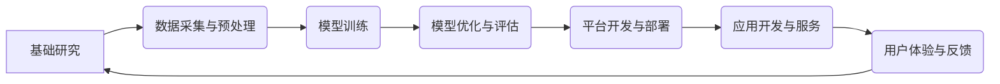

                 

## LLM产业链:AI价值重塑的未来愿景

> 关键词：LLM, 大语言模型, 产业链, AI价值,  深度学习, 自然语言处理

### 1. 背景介绍

近年来，人工智能（AI）技术取得了飞速发展，特别是深度学习领域取得的突破性进展，为大型语言模型（LLM）的诞生和发展提供了强有力的技术支撑。LLM 作为一种强大的AI技术，能够理解和生成人类语言，展现出惊人的应用潜力，正在深刻地改变着我们与信息交互的方式，并对各个行业产生深远影响。

LLM 的发展并非孤立的，它与众多技术和产业相互关联，形成了一个庞大的产业链。从基础研究到应用开发，从数据采集到模型训练，从硬件设施到软件平台，每一个环节都扮演着重要的角色，共同推动着 LLM 的发展和应用。

### 2. 核心概念与联系

**2.1 核心概念**

* **大型语言模型 (LLM):** 指的是参数量巨大、训练数据海量的人工智能模型，能够理解和生成人类语言，具备强大的文本处理能力，例如文本生成、翻译、摘要、问答等。
* **深度学习:** 一种机器学习的子领域，利用多层神经网络模拟人类大脑的学习过程，能够从海量数据中学习复杂的模式和关系。
* **自然语言处理 (NLP):**  计算机科学的一个分支，致力于使计算机能够理解、处理和生成人类语言。

**2.2 产业链架构**



**2.3 产业链关系**

LLM 产业链是一个复杂的生态系统，各个环节相互依存、相互促进。

* **基础研究:** 为 LLM 的发展提供理论基础和技术支撑，例如新的深度学习算法、模型架构、训练方法等。
* **数据采集与预处理:**  LLM 的训练需要海量高质量的数据，数据采集和预处理环节负责收集、清洗、格式化和标记数据，为模型训练提供数据支持。
* **模型训练:** 利用深度学习算法和海量数据，训练 LLM 模型，使其具备理解和生成人类语言的能力。
* **模型优化与评估:** 对训练好的模型进行优化，提高其性能和效率，并通过各种评估指标对模型效果进行评估。
* **平台开发与部署:**  为 LLM 模型提供运行环境和服务接口，方便开发者调用和应用。
* **应用开发与服务:**  利用 LLM 模型开发各种应用，例如聊天机器人、文本生成工具、翻译软件等，为用户提供服务。
* **用户体验与反馈:** 用户使用 LLM 应用的体验和反馈，将反哺到整个产业链，推动模型的改进和迭代。

### 3. 核心算法原理 & 具体操作步骤

**3.1 算法原理概述**

LLM 的核心算法是基于 Transformer 架构的深度神经网络。Transformer 模型利用自注意力机制，能够捕捉文本序列中长距离依赖关系，从而实现更准确的语言理解和生成。

**3.2 算法步骤详解**

1. **词嵌入:** 将文本中的每个词转换为向量表示，捕捉词语的语义信息。
2. **多头自注意力:** 利用多个注意力头，从文本序列中捕捉不同层面的语义关系。
3. **前馈神经网络:** 对自注意力输出进行进一步处理，提取更深层的语义特征。
4. **位置编码:**  由于 Transformer 模型没有循环结构，无法捕捉词语在序列中的位置信息，需要添加位置编码来弥补这一缺陷。
5. **解码器:**  利用编码器输出的特征，生成目标文本序列。

**3.3 算法优缺点**

* **优点:** 
    * 能够捕捉长距离依赖关系，提高文本理解和生成能力。
    * 并行训练效率高，能够训练参数量巨大的模型。
* **缺点:** 
    * 计算量大，训练成本高。
    * 对训练数据质量要求高，容易受到训练数据偏差的影响。

**3.4 算法应用领域**

* **自然语言理解:** 文本分类、情感分析、问答系统等。
* **自然语言生成:** 文本摘要、机器翻译、对话系统等。
* **代码生成:** 自动生成代码、代码补全等。

### 4. 数学模型和公式 & 详细讲解 & 举例说明

**4.1 数学模型构建**

LLM 的数学模型主要基于 Transformer 架构，其核心是自注意力机制和多层感知机。

**4.2 公式推导过程**

* **自注意力机制:**  

$$
Attention(Q, K, V) = \frac{exp(Q \cdot K^T / \sqrt{d_k})}{exp(Q \cdot K^T / \sqrt{d_k})} \cdot V
$$

其中，Q、K、V 分别代表查询矩阵、键矩阵和值矩阵，$d_k$ 代表键向量的维度。

* **多层感知机:**

$$
MLP(x) = \sigma(W_1 x + b_1)
$$

$$
MLP(x) = W_2 \sigma(W_1 x + b_1) + b_2
$$

其中，$W_1$、$W_2$ 代表权重矩阵，$b_1$、$b_2$ 代表偏置项，$\sigma$ 代表激活函数。

**4.3 案例分析与讲解**

假设我们有一个句子 "The cat sat on the mat"，将其转换为词向量表示，然后利用自注意力机制计算每个词与其他词之间的注意力权重。

例如，"cat" 与 "sat" 之间的注意力权重较高，因为它们在语义上相关。

### 5. 项目实践：代码实例和详细解释说明

**5.1 开发环境搭建**

* Python 3.7+
* PyTorch 或 TensorFlow
* CUDA 和 cuDNN (可选，用于 GPU 训练)

**5.2 源代码详细实现**

```python
import torch
import torch.nn as nn

class Transformer(nn.Module):
    def __init__(self, vocab_size, embedding_dim, num_heads, num_layers):
        super(Transformer, self).__init__()
        self.embedding = nn.Embedding(vocab_size, embedding_dim)
        self.transformer_layers = nn.ModuleList([
            nn.TransformerEncoderLayer(embedding_dim, num_heads)
            for _ in range(num_layers)
        ])
        self.linear = nn.Linear(embedding_dim, vocab_size)

    def forward(self, x):
        x = self.embedding(x)
        for layer in self.transformer_layers:
            x = layer(x)
        x = self.linear(x)
        return x
```

**5.3 代码解读与分析**

* `__init__` 方法初始化模型参数，包括词嵌入层、Transformer 层和输出层。
* `forward` 方法定义模型的正向传播过程，将输入序列转换为输出序列。

**5.4 运行结果展示**

训练好的 LLM 模型可以用于各种自然语言处理任务，例如文本生成、机器翻译等。

### 6. 实际应用场景

**6.1 聊天机器人**

LLM 可以用于构建更智能、更自然的聊天机器人，能够理解用户的意图，并提供更准确、更相关的回复。

**6.2 文本生成**

LLM 可以用于生成各种类型的文本，例如新闻文章、小说、诗歌等，可以帮助作家克服创作瓶颈，提高写作效率。

**6.3 机器翻译**

LLM 可以用于实现更准确、更流畅的机器翻译，可以帮助人们跨越语言障碍，更好地沟通交流。

**6.4 未来应用展望**

LLM 的应用场景还在不断扩展，未来将应用于更多领域，例如教育、医疗、法律等。

### 7. 工具和资源推荐

**7.1 学习资源推荐**

* **书籍:**
    * 《深度学习》
    * 《自然语言处理》
* **在线课程:**
    * Coursera: 自然语言处理
    * Udacity: 深度学习

**7.2 开发工具推荐**

* **框架:**
    * PyTorch
    * TensorFlow
* **库:**
    * Hugging Face Transformers
    * Gensim

**7.3 相关论文推荐**

* 《Attention Is All You Need》
* 《BERT: Pre-training of Deep Bidirectional Transformers for Language Understanding》

### 8. 总结：未来发展趋势与挑战

**8.1 研究成果总结**

近年来，LLM 技术取得了显著进展，模型规模不断扩大，性能不断提升，应用场景也越来越广泛。

**8.2 未来发展趋势**

* **模型规模进一步扩大:** 随着计算能力的提升，LLM 模型规模将继续扩大，模型能力将进一步提升。
* **多模态学习:** LLM 将与其他模态数据（例如图像、音频）融合，实现多模态理解和生成。
* **可解释性增强:** 研究如何提高 LLM 的可解释性，使其决策过程更加透明。

**8.3 面临的挑战**

* **数据安全和隐私:** LLM 的训练需要海量数据，如何保证数据安全和隐私是一个重要挑战。
* **模型偏见:** LLM 模型容易受到训练数据偏见的影响，如何 mitigating 模型偏见是一个重要的研究方向。
* **伦理问题:** LLM 的应用可能带来一些伦理问题，例如信息操纵、深度伪造等，需要引起重视。

**8.4 研究展望**

未来，LLM 技术将继续发展，为人类社会带来更多价值。我们需要加强基础研究，探索新的算法和模型架构，同时也要关注伦理问题，确保 LLM 技术的健康发展。

### 9. 附录：常见问题与解答

* **Q: LLM 模型的训练需要多长时间？**

A: LLM 模型的训练时间取决于模型规模、训练数据量和硬件配置等因素，通常需要数天到数周甚至更长时间。

* **Q: 如何评估 LLM 模型的性能？**

A: LLM 模型的性能可以通过各种评估指标来衡量，例如困惑度、BLEU 分数、ROUGE 分数等。

* **Q: 如何使用 LLM 模型进行文本生成？**

A: 可以使用预训练好的 LLM 模型，并根据具体任务进行微调，然后利用模型的解码器生成目标文本序列。


作者：禅与计算机程序设计艺术 / Zen and the Art of Computer Programming 
<end_of_turn>

