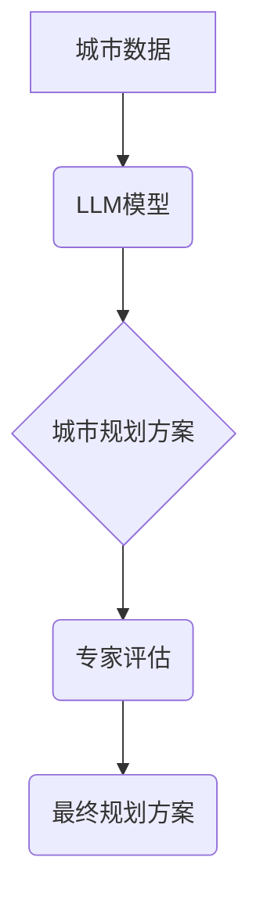

                 

## LLM在城市规划中的应用：AI城市设计师

> 关键词：大型语言模型 (LLM)、城市规划、人工智能、可持续发展、智能城市、数据驱动决策、城市模拟、空间优化

## 1. 背景介绍

城市化进程的加速和人口增长的压力使得城市规划面临着前所未有的挑战。传统城市规划方法往往依赖于经验和专家判断，难以应对复杂多变的城市发展需求。近年来，人工智能（AI）技术，特别是大型语言模型（LLM）的快速发展，为城市规划领域带来了新的机遇。LLM 凭借其强大的文本处理能力和模式识别能力，能够有效地分析海量城市数据，识别城市发展趋势，并提供数据驱动的规划建议。

城市规划是一个多学科交叉的领域，涉及到建筑、交通、环境、社会等多个方面。传统的城市规划方法通常是逐个环节进行规划，缺乏整体性和协同性。而LLM能够将不同领域的知识和数据整合在一起，提供更全面的城市规划方案。

## 2. 核心概念与联系

**2.1 核心概念**

* **大型语言模型 (LLM):** 是一种基于深度学习的强大人工智能模型，能够理解和生成人类语言。LLM 通过训练海量文本数据，学习语言的语法、语义和上下文关系，从而具备强大的文本处理能力，例如文本生成、翻译、摘要、问答等。

* **城市规划:** 城市规划是指对城市空间布局、功能分区、交通网络、公共设施等进行合理规划和设计，以满足城市人口的居住、工作、生活等需求，并促进城市的可持续发展。

* **人工智能 (AI):** 人工智能是指模拟人类智能行为的计算机系统。AI技术包括机器学习、深度学习、自然语言处理等，能够帮助人类解决复杂问题，提高工作效率。

**2.2 架构关系**



**2.3 联系分析**

LLM 可以通过分析城市数据，例如人口分布、交通流量、土地利用等，识别城市发展趋势和潜在问题。然后，LLM 可以根据这些趋势和问题，生成多方案的城市规划建议，并提供相应的分析和评估。专家可以根据 LLM 的建议进行评估和修改，最终形成最终的城市规划方案。

## 3. 核心算法原理 & 具体操作步骤

**3.1 算法原理概述**

LLM 在城市规划中的应用主要基于以下核心算法：

* **自然语言处理 (NLP):** 用于处理城市规划相关的文本数据，例如规划文件、新闻报道、公众意见等。NLP 算法可以提取关键信息、识别主题和趋势，并进行文本分类和聚类等操作。
* **机器学习 (ML):** 用于分析城市数据，识别城市发展模式和潜在问题。ML 算法可以进行回归分析、分类预测、聚类分析等，并根据历史数据预测未来的城市发展趋势。
* **深度学习 (DL):** 用于构建更复杂的城市模型，模拟城市系统之间的相互作用。DL 算法可以学习城市数据中的非线性关系，并生成更精准的规划建议。

**3.2 算法步骤详解**

1. **数据收集和预处理:** 收集城市规划相关的各种数据，例如人口数据、交通数据、土地利用数据、环境数据等。对数据进行清洗、转换和格式化，使其能够被 LLM 模型处理。
2. **模型训练:** 使用 LLM 模型训练，训练数据包括城市规划相关的文本数据和城市数据。训练过程可以根据不同的任务进行调整，例如文本分类、趋势预测、方案生成等。
3. **模型评估:** 使用测试数据评估模型的性能，例如准确率、召回率、F1-score 等。根据评估结果，对模型进行调整和优化。
4. **方案生成:** 将城市规划问题输入到训练好的 LLM 模型中，模型会根据其学习到的知识和经验，生成多方案的城市规划建议。
5. **方案评估和选择:** 专家根据 LLM 生成的方案进行评估和选择，最终确定最佳的城市规划方案。

**3.3 算法优缺点**

* **优点:**
    * 能够处理海量城市数据，识别城市发展趋势和潜在问题。
    * 能够生成多方案的城市规划建议，提供数据驱动的决策支持。
    * 能够提高城市规划的效率和准确性。
* **缺点:**
    * 依赖于高质量的训练数据，数据质量直接影响模型性能。
    * 难以完全模拟城市系统的复杂性，生成的方案可能存在局限性。
    * 需要专家进行方案评估和选择，确保方案的合理性和可行性。

**3.4 算法应用领域**

* **城市空间规划:** 优化城市布局，规划公共空间、居住区、商业区等。
* **交通规划:** 建立高效的交通网络，缓解交通拥堵问题。
* **环境规划:** 规划绿色空间、减排措施，促进城市可持续发展。
* **公共设施规划:** 规划学校、医院、图书馆等公共设施，满足城市居民需求。

## 4. 数学模型和公式 & 详细讲解 & 举例说明

**4.1 数学模型构建**

城市规划问题可以抽象为一个优化问题，目标是找到最优的城市布局方案，以最大化城市效益，例如经济效益、社会效益、环境效益等。

一个简单的数学模型可以表示为：

$$
\text{目标函数} = f(\text{城市布局})
$$

其中，$f(\text{城市布局})$ 是城市效益的函数，$\text{城市布局}$ 是城市空间布局的变量。

**4.2 公式推导过程**

具体的目标函数和城市布局变量需要根据实际的城市规划问题进行定义。例如，如果目标是最大化城市经济效益，则目标函数可以定义为城市GDP的总和。

城市布局变量可以包括：

* **土地利用类型:**  例如住宅区、商业区、工业区等。
* **交通网络结构:**  例如道路、地铁、公交线路等。
* **公共设施分布:**  例如学校、医院、公园等。

**4.3 案例分析与讲解**

假设我们要规划一个新的城市社区，目标是最大化居民生活满意度。我们可以构建一个数学模型，将居民生活满意度定义为以下公式：

$$
\text{生活满意度} = w_1 \times \text{交通便利性} + w_2 \times \text{环境质量} + w_3 \times \text{公共服务水平}
$$

其中，$w_1$, $w_2$, $w_3$ 是三个权重系数，分别代表交通便利性、环境质量和公共服务水平的重要性。

我们可以通过收集居民的意见和数据，对三个因素进行量化，并根据居民的偏好设置权重系数。然后，我们可以使用优化算法，例如遗传算法或模拟退火算法，找到最优的城市布局方案，以最大化居民生活满意度。

## 5. 项目实践：代码实例和详细解释说明

**5.1 开发环境搭建**

* **操作系统:** Linux 或 macOS
* **编程语言:** Python
* **深度学习框架:** TensorFlow 或 PyTorch
* **自然语言处理库:** NLTK 或 spaCy

**5.2 源代码详细实现**

以下是一个简单的代码示例，演示如何使用 LLM 生成城市规划建议：

```python
from transformers import pipeline

# 加载预训练的 LLM 模型
generator = pipeline("text-generation", model="gpt2")

# 输入城市规划问题
prompt = "如何规划一个更加宜居的城市社区?"

# 生成城市规划建议
response = generator(prompt, max_length=100, num_return_sequences=3)

# 打印生成建议
for i in range(len(response)):
    print(f"建议 {i+1}: {response[i]['generated_text']}")
```

**5.3 代码解读与分析**

* 该代码使用 Hugging Face 的 Transformers 库加载预训练的 GPT-2 模型，用于文本生成。
* `pipeline("text-generation", model="gpt2")` 创建一个文本生成管道，使用 GPT-2 模型。
* `prompt` 参数输入城市规划问题。
* `max_length` 参数控制生成的文本长度。
* `num_return_sequences` 参数控制生成多个建议的数量。
* 代码会输出三个不同的城市规划建议。

**5.4 运行结果展示**

运行该代码后，会输出三个不同的城市规划建议，例如：

* 建设更多绿色空间，提高空气质量。
* 完善公共交通系统，减少交通拥堵。
* 规划更多社区服务设施，方便居民生活。

## 6. 实际应用场景

**6.1 城市空间规划**

LLM 可以帮助城市规划师分析人口分布、土地利用等数据，识别城市发展趋势，并生成多方案的城市空间布局方案。例如，LLM 可以帮助规划师确定最佳的住宅区、商业区、工业区位置，并规划相应的交通网络和公共设施。

**6.2 交通规划**

LLM 可以分析交通流量数据，识别交通拥堵点，并生成优化交通网络的方案。例如，LLM 可以帮助规划师确定最佳的道路拓宽方案、公交线路规划方案，以及智能交通信号灯控制方案。

**6.3 环境规划**

LLM 可以分析环境数据，识别环境污染源，并生成减排措施方案。例如，LLM 可以帮助规划师制定城市绿化方案、垃圾处理方案，以及节能减排政策。

**6.4 未来应用展望**

随着 LLM 技术的不断发展，其在城市规划领域的应用将更加广泛和深入。例如，LLM 可以用于：

* **城市模拟:** 建立更加复杂的城市模型，模拟城市系统的演化过程，并预测未来的城市发展趋势。
* **个性化规划:** 根据居民的个性化需求，生成个性化的城市规划方案。
* **公众参与:** 利用 LLM 的文本生成能力，帮助规划师与公众进行更有效的沟通，收集公众意见，并纳入城市规划决策。

## 7. 工具和资源推荐

**7.1 学习资源推荐**

* **书籍:**
    * 《深度学习》 by Ian Goodfellow, Yoshua Bengio, and Aaron Courville
    * 《自然语言处理》 by Dan Jurafsky and James H. Martin
* **在线课程:**
    * Coursera: Deep Learning Specialization
    * edX: Artificial Intelligence
* **博客和网站:**
    * Towards Data Science
    * Machine Learning Mastery

**7.2 开发工具推荐**

* **编程语言:** Python
* **深度学习框架:** TensorFlow, PyTorch
* **自然语言处理库:** NLTK, spaCy
* **数据可视化工具:** Matplotlib, Seaborn

**7.3 相关论文推荐**

* **Generative Pre-trained Transformer 2 (GPT-2):** https://arxiv.org/abs/1905.03153
* **BERT: Pre-training of Deep Bidirectional Transformers for Language Understanding:** https://arxiv.org/abs/1810.04805
* **Attention Is All You Need:** https://arxiv.org/abs/1706.03762

## 8. 总结：未来发展趋势与挑战

**8.1 研究成果总结**

LLM 在城市规划领域的应用取得了初步的成果，能够有效地分析城市数据，识别城市发展趋势，并生成数据驱动的规划建议。

**8.2 未来发展趋势**

* **模型规模和能力提升:** 未来 LLM 模型的规模和能力将进一步提升，能够处理更加复杂的数据，生成更加精准的规划建议。
* **多模态融合:** LLM 将与其他人工智能技术融合，例如计算机视觉、地理信息系统等，实现多模态数据分析和融合，生成更加全面的城市规划方案。
* **个性化和可解释性:** LLM 将更加注重个性化和可解释性，能够根据居民的个性化需求生成个性化的规划方案，并提供清晰的解释，增强公众对规划方案的理解和接受度。

**8.3 面临的挑战**

* **数据质量和可用性:** LLM 的性能依赖于高质量的训练数据，而城市规划数据往往分散、不完整、难以获取。
* **模型解释性和可信度:** LLM 的决策过程往往是复杂的，难以解释，这可能会降低公众对规划方案的信任。
* **伦理和社会影响:** LLM 在城市规划中的应用可能带来伦理和社会问题，例如数据隐私、算法偏见等，需要引起足够的重视和关注。

**8.4 研究展望**

未来研究将重点关注以下几个方面：

* 开发更加高效的数据获取和预处理方法，提高城市规划数据的质量和可用性。
* 研究更加可解释的 LLM 模型，增强公众对规划方案的理解和信任。
* 探索 LLM 在城市规划中的伦理和社会影响，制定相应的规范和政策。


## 9. 附录：常见问题与解答

**9.1  LLM 是否能够完全替代城市规划师？**

LLM 可以帮助城市规划师提高工作效率和决策准确性，但它不能完全替代城市规划师。城市规划是一个复杂的系统工程，需要考虑多方面的因素，例如社会、经济、环境等。城市规划师需要根据实际情况，对 LLM 生成的建议进行评估和修改，并最终做出决策。

**9.2  LLM 在城市规划中的应用有哪些伦理问题？**

LLM 在城市规划中的应用可能带来以下伦理问题：

* **数据隐私:** LLM 需要使用大量城市数据进行训练，这些数据可能包含居民的个人信息，需要确保数据的安全和隐私。
* **算法偏见:** LLM 的训练数据可能存在偏见，导致生成的规划方案也存在偏见，例如歧视特定人群或地区。
* **透明度和可解释性:** LLM 的决策过程往往是复杂的，难以解释，这可能会降低公众对规划方案的信任。

**9.3  如何解决 LLM 在城市规划中的伦理问题？**

* **数据隐私保护:** 采用匿名化技术处理居民个人信息，并制定严格的数据安全和隐私保护政策。
* **算法公平性:** 确保 LLM 的训练数据具有代表性，并定期评估算法的公平性，及时修正算法偏见。
* **透明度和可解释性:** 开发更加可解释的 LLM 模型，并提供清晰的解释，增强公众对规划方案的理解和信任。


作者：禅与计算机程序设计艺术 / Zen and the Art of Computer Programming<end_of_turn>

