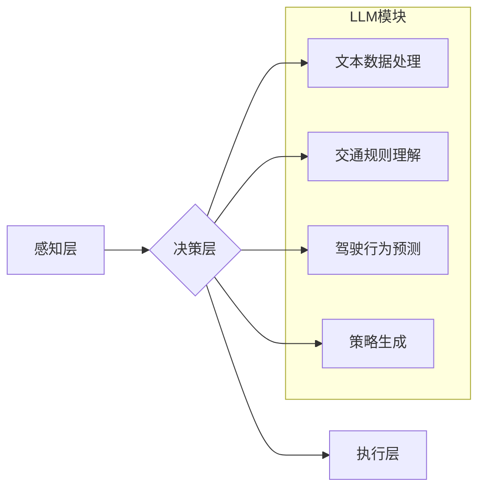

                 

## LLM在自动驾驶决策中的应用：提高行车安全

> 关键词：大型语言模型（LLM）、自动驾驶、决策系统、行车安全、深度学习、自然语言处理

## 1. 背景介绍

自动驾驶技术作为未来交通运输的重要发展方向，其核心在于实现车辆自主感知环境、决策行驶路线和控制车辆动作。传统的自动驾驶决策系统主要依赖于规则引擎和基于模型的预测，但这些方法在面对复杂、多变的交通场景时往往表现不足。近年来，大型语言模型（LLM）的快速发展为自动驾驶决策提供了新的思路和可能性。

LLM 拥有强大的文本理解和生成能力，能够从海量数据中学习交通规则、驾驶习惯和潜在风险，并生成更灵活、更符合人类驾驶逻辑的决策方案。将 LLM 应用于自动驾驶决策，可以有效提升系统的安全性、可靠性和适应性。

## 2. 核心概念与联系

### 2.1  自动驾驶决策系统

自动驾驶决策系统是自动驾驶车辆的核心部件，负责根据感知到的环境信息，制定并执行最优的驾驶策略。传统的决策系统通常采用规则引擎或模型预测的方式，但这些方法存在局限性：

* **规则引擎：** 难以处理复杂、多变的交通场景，规则难以穷尽所有可能的情况。
* **模型预测：** 依赖于大量标注数据，训练成本高，且难以适应新的场景和驾驶习惯。

### 2.2  大型语言模型（LLM）

LLM 是近年来深度学习领域取得的重大突破，其核心是利用 Transformer 架构训练一个强大的文本表示模型。LLM 能够理解和生成人类语言，并具备以下优势：

* **强大的文本理解能力：** 可以从文本中提取关键信息、理解上下文关系和语义含义。
* **灵活的文本生成能力：** 可以根据给定的输入生成流畅、合理的文本，并进行多种语言任务，如翻译、摘要、问答等。
* **可迁移学习能力：** 在一个任务上训练好的 LLM 可以迁移到其他相关任务中，降低训练成本和时间。

### 2.3  LLM在自动驾驶决策中的应用

将 LLM 应用于自动驾驶决策，可以利用其强大的文本理解和生成能力，构建更灵活、更智能的决策系统。

**LLM 可以用于以下方面：**

* **理解交通规则和标志：** 从文本数据中学习交通规则和标志的含义，并将其转化为可执行的决策指令。
* **预测其他驾驶员的行为：** 分析驾驶员的驾驶轨迹、车速和转向等信息，预测其未来的行为，并做出相应的应对措施。
* **生成驾驶策略：** 根据感知到的环境信息和交通规则，生成最优的驾驶策略，包括路线规划、车速控制和转向操作。
* **进行驾驶场景模拟和测试：** 利用 LLM 生成虚拟驾驶场景，并进行模拟测试，提高自动驾驶系统的安全性。

**LLM 与自动驾驶决策系统的融合架构：**



## 3. 核心算法原理 & 具体操作步骤

### 3.1  算法原理概述

LLM 在自动驾驶决策中的应用主要基于 Transformer 架构和强化学习算法。

* **Transformer 架构：** 能够有效捕捉文本序列中的长距离依赖关系，提高文本理解和生成能力。
* **强化学习算法：** 通过奖励机制训练模型，使其在模拟环境中学习最优的驾驶策略。

### 3.2  算法步骤详解

1. **数据收集和预处理：** 收集大量交通场景数据，包括图像、视频、传感器数据和驾驶日志等。对数据进行预处理，例如图像裁剪、数据标注和文本清洗等。
2. **LLM 模型训练：** 利用 Transformer 架构训练 LLM 模型，使其能够理解交通规则、驾驶行为和环境信息。训练数据可以包括交通法规文本、驾驶场景描述、驾驶行为示例等。
3. **强化学习训练：** 将 LLM 模型与强化学习算法结合，在模拟环境中训练自动驾驶决策策略。环境奖励函数根据驾驶行为的安全性、效率和舒适度进行设计。
4. **模型评估和优化：** 在真实世界场景下评估模型性能，并根据评估结果进行模型优化和调整。

### 3.3  算法优缺点

**优点：**

* **更灵活的决策：** LLM 可以学习到更复杂的驾驶规则和驾驶习惯，并生成更灵活、更符合人类驾驶逻辑的决策方案。
* **更好的适应性：** LLM 可以从海量数据中学习，并适应不同的驾驶场景和环境变化。
* **更强的安全性：** 通过强化学习训练，LLM 可以学习到更安全的驾驶策略，降低事故风险。

**缺点：**

* **训练成本高：** LLM 的训练需要大量的计算资源和数据，成本较高。
* **解释性差：** LLM 的决策过程较为复杂，难以解释其决策依据，这可能导致信任问题。
* **数据依赖性强：** LLM 的性能依赖于训练数据的质量和数量，如果训练数据不足或存在偏差，模型性能会受到影响。

### 3.4  算法应用领域

LLM 在自动驾驶决策中的应用不仅限于汽车，还可以应用于其他领域，例如：

* **无人机航行决策：** 利用 LLM 理解空中交通规则和环境信息，制定更安全的无人机航行策略。
* **机器人导航决策：** 利用 LLM 理解环境地图和障碍物信息，规划更有效的机器人导航路径。
* **智能交通管理：** 利用 LLM 分析交通流量数据，预测交通拥堵情况，并优化交通信号灯控制策略。

## 4. 数学模型和公式 & 详细讲解 & 举例说明

### 4.1  数学模型构建

LLM 在自动驾驶决策中的应用可以构建一个基于强化学习的数学模型，其中：

* **状态空间：** 包含车辆的位置、速度、方向、周围环境信息等。
* **动作空间：** 包含车辆的控制动作，例如加速、减速、转向等。
* **奖励函数：** 根据驾驶行为的安全性、效率和舒适度进行设计，鼓励模型学习安全的和有效的驾驶策略。

### 4.2  公式推导过程

强化学习算法的核心是通过最大化奖励函数的期望值来训练模型。

**Bellman 方程：**

$$
V(s) = \max_{\alpha} \sum_{s'} P(s' | s, \alpha) [R(s, \alpha, s') + \gamma V(s')]
$$

其中：

* $V(s)$ 是状态 $s$ 的价值函数。
* $\alpha$ 是动作空间中的一个动作。
* $P(s' | s, \alpha)$ 是从状态 $s$ 执行动作 $\alpha$ 到状态 $s'$ 的转移概率。
* $R(s, \alpha, s')$ 是从状态 $s$ 执行动作 $\alpha$ 到状态 $s'$ 的奖励。
* $\gamma$ 是折扣因子，控制未来奖励的权重。

### 4.3  案例分析与讲解

假设一个自动驾驶车辆处于十字路口，需要决策是否通过。

* **状态空间：** 包含车辆的位置、速度、方向、路口红绿灯状态、周围车辆信息等。
* **动作空间：** 包含通过、等待、转向等动作。
* **奖励函数：** 通过安全、高效、舒适地到达目的地获得奖励，违反交通规则或发生事故扣除奖励。

通过 Bellman 方程和强化学习算法，LLM 可以学习到最优的决策策略，例如在红灯时等待、在绿灯时安全通过、在有其他车辆时减速让行等。

## 5. 项目实践：代码实例和详细解释说明

### 5.1  开发环境搭建

* **操作系统：** Ubuntu 20.04
* **编程语言：** Python 3.8
* **深度学习框架：** PyTorch 1.8
* **其他依赖库：** transformers, numpy, matplotlib等

### 5.2  源代码详细实现

```python
# 导入必要的库
import torch
import torch.nn as nn
from transformers import AutoModelForSequenceClassification, AutoTokenizer

# 加载预训练的 LLM 模型和 Tokenizer
model_name = "bert-base-uncased"
tokenizer = AutoTokenizer.from_pretrained(model_name)
model = AutoModelForSequenceClassification.from_pretrained(model_name)

# 定义一个简单的奖励函数
def reward_function(state, action):
    # 根据状态和动作计算奖励
    # ...

# 定义强化学习算法
class Agent:
    def __init__(self, model, reward_function):
        self.model = model
        self.reward_function = reward_function

    def act(self, state):
        # 将状态转换为文本输入
        text_input = self.tokenizer(state, return_tensors="pt")
        # 使用 LLM 生成动作
        outputs = self.model(**text_input)
        # 选择最优动作
        action = torch.argmax(outputs.logits).item()
        return action

# 创建 Agent 实例
agent = Agent(model, reward_function)

# 在模拟环境中训练
for episode in range(num_episodes):
    # 初始化状态
    state = ...
    # 训练循环
    while True:
        # 选择动作
        action = agent.act(state)
        # 执行动作
        # ...
        # 获取奖励
        reward = self.reward_function(state, action)
        # 更新状态
        state = ...
        # 判断是否结束
        if ...:
            break
```

### 5.3  代码解读与分析

* 代码首先导入必要的库，并加载预训练的 LLM 模型和 Tokenizer。
* 定义一个简单的奖励函数，根据状态和动作计算奖励。
* 定义强化学习算法，包括 Agent 类，用于选择动作和更新状态。
* 在模拟环境中训练，循环执行动作、获取奖励和更新状态，直到达到结束条件。

### 5.4  运行结果展示

训练完成后，可以评估模型性能，例如在真实世界场景下测试车辆的安全性、效率和舒适度。

## 6. 实际应用场景

LLM 在自动驾驶决策中的应用已经开始在一些实际场景中得到探索和应用。例如：

* **特斯拉 Autopilot：** 利用 LLM 辅助理解交通规则和驾驶场景，提高自动驾驶系统的安全性。
* **Waymo One：** 利用 LLM 预测其他驾驶员的行为，并做出相应的应对措施，避免事故发生。
* **Cruise：** 利用 LLM 进行驾驶场景模拟和测试，提高自动驾驶系统的可靠性。

### 6.4  未来应用展望

随着 LLM 技术的不断发展，其在自动驾驶决策中的应用前景更加广阔。未来，LLM 可以应用于更复杂的驾驶场景，例如：

* **复杂路况驾驶：** 在拥堵路段、山路、高速公路等复杂路况下，LLM 可以帮助车辆更安全、更有效地行驶。
* **多模态感知：** 将 LLM 与其他传感器数据融合，例如摄像头、雷达、激光雷达等，实现更全面的环境感知。
* **个性化驾驶体验：** 根据驾驶员的驾驶习惯和偏好，LLM 可以定制个性化的驾驶策略，提供更舒适的驾驶体验。

## 7. 工具和资源推荐

### 7.1  学习资源推荐

* **论文：**
    * "Language Models are Few-Shot Learners" (Brown et al., 2020)
    * "BERT: Pre-training of Deep Bidirectional Transformers for Language Understanding" (Devlin et al., 2018)
* **书籍：**
    * "Deep Learning" (Goodfellow et al., 2016)
    * "Reinforcement Learning: An Introduction" (Sutton & Barto, 2018)
* **在线课程：**
    * Coursera: "Deep Learning Specialization"
    * Udacity: "Deep Learning Nanodegree"

### 7.2  开发工具推荐

* **深度学习框架：** PyTorch, TensorFlow
* **自然语言处理库：** transformers, spaCy, NLTK
* **仿真平台：** CARLA, SUMO

### 7.3  相关论文推荐

* "Towards Safe and Reliable Autonomous Driving with Deep Reinforcement Learning" (Bojarski et al., 2016)
* "End-to-End Learning for Self-Driving Cars" (Bojarski et al., 2017)
* "Learning to Drive in a Simulator" (Schulman et al., 2015)

## 8. 总结：未来发展趋势与挑战

### 8.1  研究成果总结

LLM 在自动驾驶决策中的应用取得了显著进展，能够提高系统的安全性、可靠性和适应性。

### 8.2  未来发展趋势

* **模型规模和能力提升：** 训练更大规模的 LLM 模型，提高其理解和生成文本的能力。
* **多模态感知融合：** 将 LLM 与其他传感器数据融合，实现更全面的环境感知。
* **安全性和可解释性增强：** 研究更安全的训练方法和可解释性分析技术，提高 LLM 在自动驾驶中的应用安全性。
* **个性化驾驶体验：** 根据驾驶员的驾驶习惯和偏好，定制个性化的驾驶策略。

### 8.3  面临的挑战

* **数据标注成本高：** LLM 的训练需要大量的标注数据，标注成本较高。
* **模型解释性差：** LLM 的决策过程较为复杂，难以解释其决策依据，这可能导致信任问题。
* **安全性和可靠性：** LLM 在实际应用中仍存在安全性和可靠性问题，需要进一步研究和改进。

### 8.4  研究展望

未来，LLM 在自动驾驶决策领域的应用将继续深入发展，并与其他人工智能技术融合，例如计算机视觉、传感器融合等，推动自动驾驶技术向更安全、更智能、更可靠的方向发展。

## 9. 附录：常见问题与解答

**Q1：LLM 在自动驾驶决策中的应用有哪些优势？**

**A1：** LLM 在自动驾驶决策中的应用具有以下优势：

* 更灵活的决策：LLM 可以学习到更复杂的驾驶规则和驾驶习惯，并生成更灵活、更符合人类驾驶逻辑的决策方案。
* 更好的适应性：LLM 可以从海量数据中学习，并适应不同的驾驶场景和环境变化。
* 更强的安全性：通过强化学习训练，LLM 可以学习到更安全的驾驶策略，降低事故风险。

**Q2：LLM 在自动驾驶决策中的应用有哪些挑战？**

**A2：** LLM 在自动驾驶决策中的应用面临以下挑战：

* 数据标注成本高：LLM 的训练需要大量的标注数据，标注成本较高。
* 模型解释性差：LLM 的决策过程较为复杂，难以解释其决策依据，这可能导致信任问题。
* 安全性和可靠性：LLM 在实际应用中仍存在安全性和可靠性问题，需要进一步研究和改进。


作者：禅与计算机程序设计艺术 / Zen and the Art of Computer Programming<end_of_turn>

