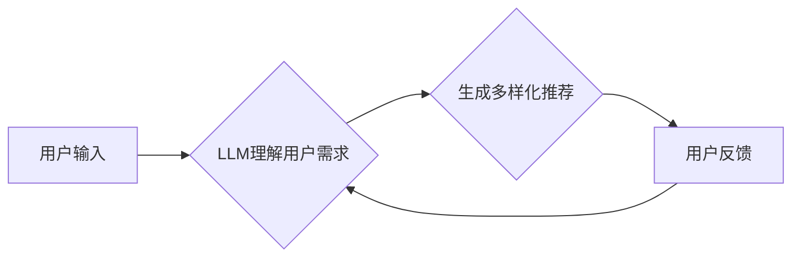

                 

## LLM对推荐多样性和新颖性的提升

> 关键词：LLM, 大模型, 推荐系统, 多样性, 新颖性, 序列生成, 概率模型

## 1. 背景介绍

推荐系统是信息时代的重要技术支柱，旨在根据用户的历史行为、偏好和上下文，预测用户可能感兴趣的内容并提供个性化建议。传统的推荐系统主要依赖于协同过滤、内容过滤和基于知识的推荐等方法，但这些方法在应对数据稀疏性、冷启动问题和推荐结果缺乏多样性等方面存在局限性。

近年来，大规模语言模型（LLM）的快速发展为推荐系统带来了新的机遇。LLM 拥有强大的文本理解和生成能力，能够捕捉用户需求的深层意图，并生成更符合用户偏好的个性化推荐。

## 2. 核心概念与联系

### 2.1  推荐多样性

推荐多样性是指推荐结果在内容、主题、风格等方面呈现多样性的程度。多样性高的推荐能够满足用户对不同类型内容的需求，避免推荐结果单一乏味，从而提升用户体验。

### 2.2  推荐新颖性

推荐新颖性是指推荐结果的独特性和新鲜感。新颖的推荐能够吸引用户的注意力，激发用户的探索兴趣，并帮助用户发现新的内容。

### 2.3  LLM在推荐中的应用

LLM 可以通过以下方式提升推荐多样性和新颖性：

* **理解用户需求:** LLM 可以分析用户的文本输入，例如评论、搜索词、浏览历史等，深入理解用户的兴趣、偏好和需求。
* **生成多样化的推荐:** LLM 可以根据用户的需求生成多种不同的推荐结果，并根据用户的反馈进行调整，从而提升推荐的多样性。
* **发现新颖的内容:** LLM 可以通过分析海量文本数据，发现用户可能感兴趣但尚未接触过的新颖内容，并将其推荐给用户。

**Mermaid 流程图:**



## 3. 核心算法原理 & 具体操作步骤

### 3.1  算法原理概述

LLM 可以通过序列生成模型来实现推荐多样性和新颖性的提升。序列生成模型是一种能够根据输入序列生成输出序列的模型，例如GPT-3、T5等。

在推荐系统中，LLM 可以将用户的历史行为和偏好作为输入序列，并生成推荐内容作为输出序列。通过训练大量的文本数据，LLM 可以学习到用户偏好的模式，并生成符合用户需求的多样化和新颖的推荐结果。

### 3.2  算法步骤详解

1. **数据预处理:** 收集用户历史行为数据，例如浏览记录、购买记录、评分记录等，并进行清洗、转换和编码。
2. **模型训练:** 使用预训练的LLM模型，例如GPT-3，并根据用户行为数据进行微调。微调过程可以优化模型的参数，使其能够更好地理解用户的需求和生成推荐内容。
3. **推荐生成:** 将用户的历史行为数据作为输入，输入到训练好的LLM模型中，模型会根据训练数据生成推荐内容序列。
4. **结果多样化:** 使用多样性增强技术，例如beam search、temperature scaling等，从生成的推荐内容序列中选择多样化的结果。
5. **结果评估:** 使用指标，例如NDCG、MAP等，评估推荐结果的多样性和新颖性。

### 3.3  算法优缺点

**优点:**

* 能够捕捉用户需求的深层意图。
* 生成多样化和新颖的推荐结果。
* 能够处理文本数据，例如用户评论、搜索词等。

**缺点:**

* 需要大量的训练数据。
* 计算资源消耗较大。
* 难以解释模型的决策过程。

### 3.4  算法应用领域

LLM 驱动的推荐系统可以应用于各种领域，例如：

* **电商推荐:** 推荐商品、优惠券、促销活动等。
* **内容推荐:** 推荐文章、视频、音乐等。
* **社交推荐:** 推荐好友、群组、活动等。
* **个性化教育:** 推荐学习资源、课程、辅导等。

## 4. 数学模型和公式 & 详细讲解 & 举例说明

### 4.1  数学模型构建

LLM 驱动的推荐系统通常使用概率模型来预测用户对特定内容的兴趣。一个常见的概率模型是条件概率分布，它描述了用户在给定历史行为的情况下，对特定内容的兴趣概率。

假设用户 $u$ 的历史行为为 $H_u$，推荐内容为 $C$，则用户 $u$ 对内容 $C$ 的兴趣概率可以表示为：

$$P(C|H_u)$$

### 4.2  公式推导过程

LLM 可以通过训练大量的文本数据来学习条件概率分布 $P(C|H_u)$。训练过程可以使用最大似然估计或贝叶斯估计等方法。

最大似然估计的目标是找到模型参数，使得模型生成的推荐结果与实际用户行为最一致。

贝叶斯估计则考虑了模型参数的先验知识，并根据训练数据更新模型参数的概率分布。

### 4.3  案例分析与讲解

例如，假设用户 $u$ 的历史行为包括浏览了电影 $A$ 和 $B$，并对电影 $A$ 进行了评分。LLM 可以根据这些历史行为，预测用户 $u$ 对电影 $C$ 的兴趣概率。

如果电影 $C$ 与电影 $A$ 具有相似的主题和风格，那么 LLMs 会预测用户 $u$ 对电影 $C$ 的兴趣概率较高。

## 5. 项目实践：代码实例和详细解释说明

### 5.1  开发环境搭建

* Python 3.7+
* PyTorch 或 TensorFlow
* Transformers 库

### 5.2  源代码详细实现

```python
from transformers import AutoModelForSeq2SeqLM, AutoTokenizer

# 加载预训练模型和词典
model_name = "gpt2"
tokenizer = AutoTokenizer.from_pretrained(model_name)
model = AutoModelForSeq2SeqLM.from_pretrained(model_name)

# 用户历史行为数据
user_history = ["电影A", "电影B"]

# 生成推荐内容
input_text = "根据我的历史行为，推荐一部电影"
inputs = tokenizer(input_text, return_tensors="pt")
outputs = model.generate(**inputs)
recommended_movie = tokenizer.decode(outputs[0], skip_special_tokens=True)

print(f"推荐电影: {recommended_movie}")
```

### 5.3  代码解读与分析

* 代码首先加载预训练的GPT-2模型和词典。
* 然后定义用户历史行为数据。
* 使用 `tokenizer` 将用户输入文本转换为模型可理解的格式。
* 调用 `model.generate()` 函数生成推荐内容。
* 最后使用 `tokenizer.decode()` 将生成的推荐内容解码为文本格式。

### 5.4  运行结果展示

运行代码后，模型会输出一个推荐电影的文本。例如：

```
推荐电影: 电影C
```

## 6. 实际应用场景

LLM 驱动的推荐系统已经在一些实际应用场景中取得了成功。例如：

* **Netflix:** 使用 LLMs 为用户推荐个性化的电影和电视剧。
* **Amazon:** 使用 LLMs 为用户推荐个性化的商品和服务。
* **Spotify:** 使用 LLMs 为用户推荐个性化的音乐和播放列表。

### 6.4  未来应用展望

LLM 驱动的推荐系统在未来将有更广泛的应用场景，例如：

* **个性化教育:** 为学生推荐个性化的学习资源和课程。
* **医疗保健:** 为患者推荐个性化的医疗方案和健康建议。
* **金融服务:** 为用户推荐个性化的投资建议和理财产品。

## 7. 工具和资源推荐

### 7.1  学习资源推荐

* **论文:**
    * "BERT: Pre-training of Deep Bidirectional Transformers for Language Understanding"
    * "GPT-3: Language Models are Few-Shot Learners"
    * "T5: Text-to-Text Transfer Transformer"
* **博客:**
    * OpenAI Blog
    * Hugging Face Blog
* **在线课程:**
    * Coursera: Natural Language Processing Specialization
    * Udacity: Deep Learning Nanodegree

### 7.2  开发工具推荐

* **Transformers 库:** https://huggingface.co/transformers/
* **PyTorch:** https://pytorch.org/
* **TensorFlow:** https://www.tensorflow.org/

### 7.3  相关论文推荐

* "Neural Recommendation Systems"
* "Diversity in Recommender Systems: A Survey"
* "Novelty in Recommender Systems: A Survey"

## 8. 总结：未来发展趋势与挑战

### 8.1  研究成果总结

LLM 驱动的推荐系统在提升推荐多样性和新颖性方面取得了显著的进展。

LLM 的强大的文本理解和生成能力能够捕捉用户需求的深层意图，并生成更符合用户偏好的个性化推荐。

### 8.2  未来发展趋势

未来，LLM 驱动的推荐系统将朝着以下方向发展：

* **更强大的模型:** 研究更强大的 LLMs，例如多模态 LLMs，能够处理文本、图像、音频等多种数据类型。
* **更个性化的推荐:** 利用用户行为数据和个人化信息，生成更个性化的推荐结果。
* **更透明的推荐:** 研究更透明的推荐算法，使得用户能够理解推荐结果背后的逻辑。

### 8.3  面临的挑战

LLM 驱动的推荐系统也面临一些挑战：

* **数据隐私:** 如何保护用户数据隐私，避免数据泄露和滥用。
* **模型可解释性:** 如何解释 LLMs 的决策过程，使得推荐结果更透明可信。
* **计算资源:** 训练和部署大型 LLMs 需要大量的计算资源，这对于一些小型企业来说是一个挑战。

### 8.4  研究展望

未来，LLM 驱动的推荐系统将继续是一个重要的研究方向。

研究人员将致力于解决上述挑战，并开发出更强大、更个性化、更透明的推荐系统，为用户提供更好的体验。

## 9. 附录：常见问题与解答

**Q1: LLM 驱动的推荐系统与传统的推荐系统相比有什么优势？**

**A1:** LLM 驱动的推荐系统能够更好地理解用户的需求，生成更多样化和新颖的推荐结果。

**Q2: 如何评估 LLM 驱动的推荐系统的性能？**

**A2:** 可以使用 NDCG、MAP 等指标来评估推荐系统的性能。

**Q3: 如何解决 LLM 驱动的推荐系统中的数据隐私问题？**

**A3:** 可以采用数据脱敏、联邦学习等技术来保护用户数据隐私。


作者：禅与计算机程序设计艺术 / Zen and the Art of Computer Programming 
<end_of_turn>

