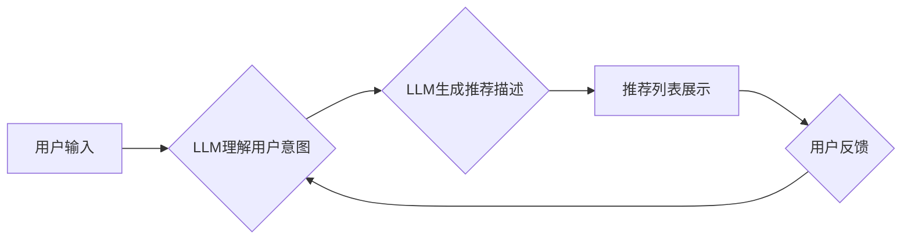

                 

## LLM对推荐系统评估指标的影响

> 关键词：LLM,推荐系统,评估指标,CTR,NDCG,BLEU,ROUGE,个性化推荐

## 1. 背景介绍

推荐系统作为信息过滤和个性化内容展示的重要工具，在电商、社交媒体、视频平台等领域发挥着越来越重要的作用。传统的推荐系统主要依赖于用户历史行为、物品特征等静态数据，通过协同过滤、内容过滤等算法进行推荐。然而，随着大语言模型（LLM）的快速发展，其强大的文本理解和生成能力为推荐系统带来了新的机遇和挑战。

LLM能够理解用户意图、生成个性化推荐描述、甚至进行多轮对话式推荐，从而提升推荐系统的精准度和用户体验。然而，传统的推荐系统评估指标，例如点击率（CTR）、排序指标（NDCG）等，往往难以全面衡量LLM带来的影响。

## 2. 核心概念与联系

### 2.1  推荐系统

推荐系统旨在根据用户的历史行为、偏好和上下文信息，预测用户对特定物品的兴趣，并提供个性化的推荐列表。

### 2.2  大语言模型（LLM）

LLM是一种基于深度学习的强大语言模型，能够理解和生成人类语言。其训练数据通常包含海量的文本信息，使其具备强大的文本理解、生成、翻译、摘要等能力。

### 2.3  LLM对推荐系统的影响

LLM能够通过以下方式影响推荐系统：

* **理解用户意图:** LLM能够分析用户输入的文本信息，更准确地理解用户的需求和偏好。
* **生成个性化推荐描述:** LLM能够根据用户兴趣和物品特征，生成更吸引人的推荐描述，提升用户点击率。
* **进行多轮对话式推荐:** LLM能够与用户进行对话，根据用户的反馈不断调整推荐结果，提供更精准的个性化推荐。

**Mermaid 流程图**



## 3. 核心算法原理 & 具体操作步骤

### 3.1  算法原理概述

LLM在推荐系统中的应用主要基于以下算法原理：

* **文本嵌入:** 将用户和物品的文本信息转换为向量表示，以便进行相似度计算。
* **注意力机制:** 关注用户输入中与推荐相关的重要信息，提高推荐的精准度。
* **生成模型:** 使用LLM生成个性化推荐描述，提升用户体验。

### 3.2  算法步骤详解

1. **数据预处理:** 将用户和物品的文本信息进行清洗、分词、词向量化等预处理操作。
2. **文本嵌入:** 使用预训练的LLM模型，将用户和物品的文本信息转换为向量表示。
3. **相似度计算:** 计算用户向量和物品向量的相似度，筛选出与用户兴趣相符的物品。
4. **排序和推荐:** 根据相似度排序，生成推荐列表。
5. **个性化描述生成:** 使用LLM生成个性化推荐描述，例如“您可能喜欢这款电影，因为它与您之前观看的电影风格相似”。

### 3.3  算法优缺点

**优点:**

* 能够理解用户意图，提供更精准的推荐。
* 能够生成个性化推荐描述，提升用户体验。
* 能够进行多轮对话式推荐，提供更灵活的交互方式。

**缺点:**

* 需要大量的训练数据和计算资源。
* 可能会出现偏差或歧视性推荐。
* 难以评估LLM带来的影响。

### 3.4  算法应用领域

LLM在推荐系统中的应用领域广泛，例如：

* **电商推荐:** 推荐商品、优惠券、促销活动等。
* **内容推荐:** 推荐文章、视频、音乐等。
* **社交媒体推荐:** 推荐好友、群组、话题等。
* **个性化教育:** 推荐学习资源、课程、辅导等。

## 4. 数学模型和公式 & 详细讲解 & 举例说明

### 4.1  数学模型构建

LLM推荐系统的数学模型可以概括为以下公式：

$$
\text{推荐分数} = f(\text{用户向量}, \text{物品向量}, \text{上下文信息})
$$

其中：

* **用户向量:** 表示用户的兴趣和偏好。
* **物品向量:** 表示物品的特征和属性。
* **上下文信息:** 包括用户历史行为、时间、位置等信息。
* **f():**  表示推荐算法，例如基于用户的协同过滤、基于内容的过滤、深度学习模型等。

### 4.2  公式推导过程

推荐分数的计算过程通常涉及以下步骤：

1. **文本嵌入:** 将用户和物品的文本信息转换为向量表示。
2. **相似度计算:** 计算用户向量和物品向量的相似度，例如余弦相似度。
3. **加权平均:** 根据相似度和上下文信息，对物品进行加权平均，得到最终的推荐分数。

### 4.3  案例分析与讲解

例如，假设用户A喜欢观看动作片，而电影B是动作片，则用户A和电影B的向量相似度较高，因此推荐分数较高。

## 5. 项目实践：代码实例和详细解释说明

### 5.1  开发环境搭建

推荐使用Python语言和相关的深度学习框架，例如TensorFlow或PyTorch。

### 5.2  源代码详细实现

```python
# 导入必要的库
import tensorflow as tf

# 定义用户和物品的文本嵌入模型
user_embedding_model = tf.keras.Sequential([
    tf.keras.layers.Embedding(input_dim=vocab_size, output_dim=embedding_dim),
    tf.keras.layers.Flatten()
])

item_embedding_model = tf.keras.Sequential([
    tf.keras.layers.Embedding(input_dim=vocab_size, output_dim=embedding_dim),
    tf.keras.layers.Flatten()
])

# 定义推荐模型
def recommend(user_input, item_list):
    user_embedding = user_embedding_model.predict(user_input)
    item_embeddings = item_embedding_model.predict(item_list)
    similarity_scores = tf.reduce_sum(user_embedding * item_embeddings, axis=1)
    return similarity_scores

# 使用预训练的LLM模型生成推荐描述
def generate_description(item_id):
    # 使用LLM模型生成推荐描述
    return llm_model.generate(item_id)

# 实际应用场景
user_input = ["动作片", "科幻片"]
item_list = ["电影A", "电影B", "电影C"]
similarity_scores = recommend(user_input, item_list)
top_recommendations = tf.argsort(similarity_scores)[-3:][::-1]
recommended_items = [item_list[i] for i in top_recommendations]
descriptions = [generate_description(item_id) for item_id in recommended_items]

print("推荐电影:", recommended_items)
print("推荐描述:", descriptions)
```

### 5.3  代码解读与分析

* 代码首先定义了用户和物品的文本嵌入模型，将文本信息转换为向量表示。
* 然后定义了推荐模型，计算用户向量和物品向量的相似度，得到推荐分数。
* 使用预训练的LLM模型生成个性化推荐描述。
* 最后，在实际应用场景中，根据用户的输入，获取推荐电影和描述。

### 5.4  运行结果展示

运行结果将显示推荐的电影列表和对应的个性化描述。

## 6. 实际应用场景

LLM在推荐系统中的应用场景广泛，例如：

### 6.1  电商推荐

* **商品推荐:** 根据用户的浏览历史、购买记录、购物车内容等信息，推荐相关的商品。
* **优惠券推荐:** 根据用户的消费习惯和偏好，推荐个性化的优惠券。
* **促销活动推荐:** 根据用户的兴趣和节日活动，推荐相关的促销活动。

### 6.2  内容推荐

* **文章推荐:** 根据用户的阅读历史、点赞记录、评论内容等信息，推荐相关的文章。
* **视频推荐:** 根据用户的观看历史、点赞记录、评论内容等信息，推荐相关的视频。
* **音乐推荐:** 根据用户的播放历史、收藏记录、评论内容等信息，推荐相关的音乐。

### 6.3  社交媒体推荐

* **好友推荐:** 根据用户的兴趣爱好、社交关系等信息，推荐潜在的好友。
* **群组推荐:** 根据用户的兴趣爱好、社交关系等信息，推荐相关的群组。
* **话题推荐:** 根据用户的兴趣爱好、社交关系等信息，推荐相关的热门话题。

### 6.4  未来应用展望

LLM在推荐系统领域的应用前景广阔，未来可能会出现以下趋势：

* **更精准的推荐:** LLM能够更好地理解用户的意图和需求，提供更精准的推荐。
* **更个性化的推荐:** LLM能够生成个性化的推荐描述和交互方式，提升用户体验。
* **更智能的推荐:** LLM能够学习用户的行为模式，并根据用户的反馈不断优化推荐结果。

## 7. 工具和资源推荐

### 7.1  学习资源推荐

* **书籍:**
    * Deep Learning by Ian Goodfellow, Yoshua Bengio, and Aaron Courville
    * Natural Language Processing with Python by Steven Bird, Ewan Klein, and Edward Loper
* **在线课程:**
    * Stanford CS224N: Natural Language Processing with Deep Learning
    * Coursera: Deep Learning Specialization

### 7.2  开发工具推荐

* **深度学习框架:** TensorFlow, PyTorch
* **自然语言处理库:** NLTK, spaCy
* **云平台:** AWS, Google Cloud, Azure

### 7.3  相关论文推荐

* **BERT: Pre-training of Deep Bidirectional Transformers for Language Understanding**
* **GPT-3: Language Models are Few-Shot Learners**
* **T5: Text-to-Text Transfer Transformer**

## 8. 总结：未来发展趋势与挑战

### 8.1  研究成果总结

LLM在推荐系统领域取得了显著的成果，能够提升推荐的精准度、个性化程度和智能化水平。

### 8.2  未来发展趋势

LLM在推荐系统领域的未来发展趋势包括：

* **更强大的LLM模型:** 训练更强大的LLM模型，提升推荐的准确性和泛化能力。
* **更有效的训练方法:** 开发更有效的训练方法，降低LLM训练的成本和时间。
* **更个性化的推荐:** 基于用户的多模态信息，例如文本、图像、音频等，提供更个性化的推荐。

### 8.3  面临的挑战

LLM在推荐系统领域也面临一些挑战：

* **数据隐私:** LLM训练需要大量的用户数据，如何保护用户隐私是一个重要问题。
* **模型解释性:** LLM模型的决策过程难以解释，如何提高模型的透明度和可解释性是一个挑战。
* **公平性与偏见:** LLM模型可能会出现公平性问题和偏见，需要进行相应的调优和改进。

### 8.4  研究展望

未来，LLM在推荐系统领域的应用将会更加广泛和深入，需要进一步研究以下问题：

* 如何更好地利用LLM的文本理解和生成能力，提升推荐的精准度和个性化程度。
* 如何解决LLM训练中的数据隐私、模型解释性和公平性问题。
* 如何将LLM与其他推荐算法相结合，构建更强大的推荐系统。

## 9. 附录：常见问题与解答

### 9.1  LLM训练需要多少数据？

LLM训练需要大量的文本数据，通常需要数十亿甚至数千亿个单词。

### 9.2  LLM训练需要多长时间？

LLM训练需要很长的时间，可能需要数周甚至数月。

### 9.3  如何评估LLM在推荐系统中的效果？

评估LLM在推荐系统中的效果需要使用专门的指标，例如CTR、NDCG、BLEU、ROUGE等。


作者：禅与计算机程序设计艺术 / Zen and the Art of Computer Programming 
<end_of_turn>

