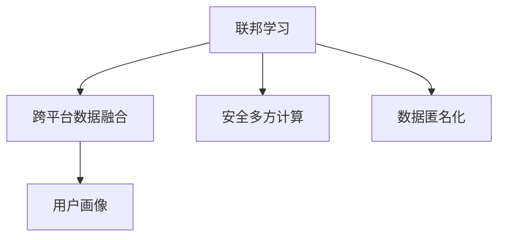

                 

# 基于联邦学习的跨平台用户画像构建

> 关键词：联邦学习, 用户画像, 跨平台, 隐私保护, 安全多方计算, 数据融合, 数据匿名化, 分布式系统

## 1. 背景介绍

### 1.1 问题由来
在数字经济时代，用户画像的应用场景日益增多，涵盖了广告投放、个性化推荐、市场营销、风控管理等多个领域。然而，构建一个完整、精准的用户画像，需要收集用户的多样化数据，并综合多维度信息进行建模。但在数据分散存储、用户隐私保护日益严格的环境下，如何高效地进行跨平台数据整合，成为了一个难题。

当前，主流的数据整合方式包括中心化模式和去中心化模式。中心化模式通过将所有数据集中到单一的数据中心进行融合，但这种模式存在数据安全和隐私泄露的风险，对用户隐私保护提出了挑战。而去中心化模式通过分布式计算，可以在保护隐私的同时实现数据整合，但需要面对数据异构、分布式计算效率低下的问题。

为了解决这些问题，联邦学习（Federated Learning）应运而生。联邦学习是一种分布式机器学习框架，各参与方在本地数据上训练模型，并通过加密方式在中心服务器进行模型参数更新，从而实现跨平台的数据整合和模型优化，既能保证数据隐私，又能提升计算效率。

### 1.2 问题核心关键点
联邦学习解决了数据隐私和安全问题，但如何设计高效的联邦学习框架，实现跨平台数据融合，是联邦学习应用的关键。本文将详细探讨基于联邦学习的跨平台用户画像构建方法，涵盖联邦学习的基本原理、算法步骤、应用场景及优缺点，同时提供实际项目实践案例，分析代码实现和性能表现。

## 2. 核心概念与联系

### 2.1 核心概念概述

为更好地理解基于联邦学习的跨平台用户画像构建方法，本节将介绍几个密切相关的核心概念：

- 联邦学习（Federated Learning）：一种分布式机器学习方法，通过在多个数据持有方（如手机厂商、电商平台、金融机构等）上本地训练模型，并将模型参数通过加密方式传输到中心服务器进行聚合，最终得到全局最优模型。

- 用户画像（User Profile）：通过对用户行为、属性、历史数据等进行分析和建模，形成用户特征向量，用于指导个性化推荐、市场营销等业务。

- 跨平台数据融合（Cross-Platform Data Fusion）：将分散在不同平台（如手机端、PC端、Web端）上的用户数据整合，构建统一的用户画像，提高业务决策的准确性和效率。

- 安全多方计算（Secure Multi-Party Computation, SMPC）：一种在多个参与方之间实现安全计算的技术，用于在保护数据隐私的前提下，进行分布式计算。

- 数据匿名化（Data Anonymization）：通过去除或模糊化数据中的敏感信息，保护用户隐私。

这些核心概念之间的逻辑关系可以通过以下Mermaid流程图来展示：



这个流程图展示了大规模数据处理的基本流程：

1. 联邦学习通过分布式计算的方式，保证数据隐私。
2. 跨平台数据融合将分散在不同平台的数据整合，形成统一的用户画像。
3. 安全多方计算用于在参与方之间安全地进行计算，保护数据隐私。
4. 数据匿名化通过处理敏感信息，进一步保障用户隐私。

这些概念共同构成了联邦学习在用户画像构建中的基础框架，使其能够在保护隐私的同时，实现高效的数据整合和建模。

## 3. 核心算法原理 & 具体操作步骤
### 3.1 算法原理概述

基于联邦学习的跨平台用户画像构建方法，其核心思想是：各参与方在本地数据上训练模型，并通过加密方式在中心服务器进行模型参数更新，最终得到全局最优模型。在构建用户画像时，各参与方将本地用户数据预处理后，输入模型进行训练，得到本地模型。中心服务器将各参与方的本地模型参数聚合，得到全局模型参数，再将全局模型参数通过加密方式传输回各参与方，用于更新本地模型。

该过程可以形式化表示为：

- 各参与方 $i$ 在本地数据集 $D_i$ 上训练模型 $M_i$，得到本地模型参数 $\theta_i$。
- 中心服务器将各本地模型参数 $\theta_i$ 聚合，得到全局模型参数 $\theta^*$。
- 将全局模型参数 $\theta^*$ 通过加密方式传输回各参与方，更新本地模型 $M_i$ 的参数为 $\theta_{i+1} = \theta_i + \delta\theta^*$。

通过多轮迭代，各参与方的本地模型参数 $\theta_i$ 逐渐逼近全局最优模型参数 $\theta^*$，从而构建出跨平台的用户画像。

### 3.2 算法步骤详解

基于联邦学习的跨平台用户画像构建方法通常包括以下几个关键步骤：

**Step 1: 准备数据集和模型**

- 收集各平台用户数据，包括行为数据、属性数据、文本数据等，并对数据进行预处理和匿名化。
- 设计合适的模型结构，如深度神经网络，作为跨平台数据融合的基础。

**Step 2: 初始化模型参数**

- 在各参与方上初始化模型 $M_i$ 的参数 $\theta_i$，可以使用中心化预训练或随机初始化。
- 中心服务器初始化全局模型参数 $\theta^*$，通常为0或随机初始化。

**Step 3: 本地模型训练**

- 各参与方在本地数据集 $D_i$ 上训练模型 $M_i$，得到本地模型参数 $\theta_i$。
- 通过加密方式将本地模型参数 $\theta_i$ 传输到中心服务器，用于聚合计算。

**Step 4: 全局模型参数更新**

- 中心服务器对各本地模型参数 $\theta_i$ 进行聚合，计算全局模型参数 $\theta^*$。
- 将全局模型参数 $\theta^*$ 通过加密方式传输回各参与方。

**Step 5: 本地模型更新**

- 各参与方根据接收的全局模型参数 $\theta^*$，更新本地模型参数 $\theta_{i+1} = \theta_i + \delta\theta^*$。
- 通过多轮迭代，直至模型收敛或达到预设的迭代次数。

**Step 6: 模型评估和输出**

- 在验证集和测试集上评估模型的性能，如准确率、召回率、F1值等。
- 将训练得到的全局模型参数 $\theta^*$ 用于构建用户画像。

以上是基于联邦学习的跨平台用户画像构建的一般流程。在实际应用中，还需要针对具体任务和数据特点进行优化设计，如改进模型结构、选择合适的损失函数、引入正则化技术等。

### 3.3 算法优缺点

基于联邦学习的跨平台用户画像构建方法具有以下优点：

- 保护数据隐私：各参与方仅在本地数据上训练模型，不泄露原始数据。
- 提升计算效率：通过分布式计算，可以在多台设备上同时训练模型，加速计算进程。
- 减少通信开销：各参与方只需将本地模型参数传输到中心服务器进行聚合，通信开销较小。
- 适应多平台数据：联邦学习可以适应多平台数据分布，提高数据融合的灵活性。

同时，该方法也存在以下局限性：

- 模型收敛速度较慢：由于各参与方数据分布不一致，模型参数更新需要更多轮次才能收敛。
- 数据通信复杂：中心服务器需要进行大量数据传输，通信带宽需求较高。
- 模型质量受限：联邦学习模型的性能受限于本地数据质量和分布。
- 系统复杂度高：需要设计复杂的加密协议和聚合算法，系统实现复杂。

尽管存在这些局限性，但就目前而言，基于联邦学习的跨平台用户画像构建方法仍是最主流的应用方式。未来相关研究的重点在于如何进一步提升联邦学习模型的效率和准确性，降低通信成本，以及提高数据隐私保护能力。

### 3.4 算法应用领域

基于联邦学习的跨平台用户画像构建方法，在多个领域已经得到了广泛的应用，例如：

- 个性化推荐：通过跨平台数据融合，构建精准的用户画像，提高个性化推荐系统的准确性。
- 市场营销：对不同平台用户数据进行整合，分析用户消费行为，指导营销策略。
- 风控管理：利用跨平台数据构建用户信用画像，降低信贷风险。
- 广告投放：基于用户画像进行精准投放，提高广告效果和转化率。
- 健康医疗：整合跨平台医疗数据，提供个性化健康管理服务。

除了上述这些经典应用外，联邦学习还被创新性地应用于更多场景中，如供应链管理、智能制造、智能家居等，为各行各业带来了新的机遇。

## 4. 数学模型和公式 & 详细讲解  
### 4.1 数学模型构建

本节将使用数学语言对基于联邦学习的跨平台用户画像构建过程进行更加严格的刻画。

记各参与方本地数据集为 $D_i = \{(x_i, y_i)\}_{i=1}^{n_i}$，其中 $x_i$ 为输入特征，$y_i$ 为标签。各参与方在本地数据集 $D_i$ 上训练的模型为 $M_i = F_{\theta_i}$，其中 $F$ 为模型结构，$\theta_i$ 为本地模型参数。中心服务器上的全局模型为 $M^* = F_{\theta^*}$。

定义各参与方本地模型在本地数据集上的损失函数为 $L_i(\theta_i) = \frac{1}{n_i}\sum_{i=1}^{n_i}l_i(x_i, y_i, \theta_i)$，其中 $l_i$ 为模型在本地数据上的损失函数。在全局模型上定义损失函数 $L^*(\theta^*) = \frac{1}{N}\sum_{i=1}^N l_i(x_i, y_i, \theta^*)$，其中 $N$ 为所有参与方数据总和。

联邦学习的优化目标是最小化全局模型在所有本地数据上的损失，即：

$$
\mathop{\min}_{\theta_i} \frac{1}{N}\sum_{i=1}^N L_i(\theta_i)
$$

由于各参与方本地数据不同，全局模型参数的更新需要考虑本地数据分布。一种常见的做法是引入加权和方式，对各本地模型参数进行聚合，得到全局模型参数：

$$
\theta^* = \frac{1}{W}\sum_{i=1}^N \frac{n_i}{N}\theta_i
$$

其中 $W = \sum_{i=1}^N n_i/N$ 为权重，$n_i$ 为参与方本地数据集大小。

在得到全局模型参数后，各参与方通过加密方式将其传输回本地，用于更新本地模型参数：

$$
\theta_{i+1} = \theta_i + \delta\theta^*
$$

其中 $\delta$ 为学习率，$\theta_{i+1}$ 为新的本地模型参数。

通过多轮迭代，各参与方的本地模型参数 $\theta_i$ 逐渐逼近全局最优模型参数 $\theta^*$。

### 4.2 公式推导过程

以下我们以二分类任务为例，推导联邦学习模型的更新公式。

假设模型 $M_i = F_{\theta_i}$ 在输入 $x_i$ 上的输出为 $\hat{y}_i=M_i(x_i) \in [0,1]$，表示样本属于正类的概率。真实标签 $y_i \in \{0,1\}$。定义本地损失函数 $l_i(x_i, y_i, \theta_i) = -[y_i\log \hat{y}_i + (1-y_i)\log(1-\hat{y}_i)]$，全局损失函数 $L^*(\theta^*) = \frac{1}{N}\sum_{i=1}^N l_i(x_i, y_i, \theta^*)$。

在优化目标 $\mathop{\min}_{\theta_i} \frac{1}{N}\sum_{i=1}^N L_i(\theta_i)$ 中，我们可以使用梯度下降算法更新模型参数 $\theta_i$。设 $\eta$ 为学习率，则本地模型参数的更新公式为：

$$
\theta_i \leftarrow \theta_i - \eta \nabla_{\theta_i}L_i(\theta_i)
$$

其中 $\nabla_{\theta_i}L_i(\theta_i)$ 为本地损失函数对模型参数的梯度，可通过反向传播算法高效计算。

在得到全局模型参数 $\theta^*$ 后，各参与方通过加密方式将其传输回本地，用于更新本地模型参数：

$$
\theta_{i+1} = \theta_i + \delta\theta^*
$$

其中 $\delta\theta^* = \eta\nabla_{\theta^*}L^*(\theta^*)$ 为全局模型参数的梯度，计算方法与本地类似，需要计算所有参与方数据上的梯度并进行加权和。

在得到新的本地模型参数 $\theta_{i+1}$ 后，继续迭代计算，直至模型收敛或达到预设的迭代次数。

## 5. 项目实践：代码实例和详细解释说明
### 5.1 开发环境搭建

在进行联邦学习项目实践前，我们需要准备好开发环境。以下是使用Python进行TensorFlow联邦学习框架开发的環境配置流程：

1. 安装Anaconda：从官网下载并安装Anaconda，用于创建独立的Python环境。

2. 创建并激活虚拟环境：
```bash
conda create -n federated-env python=3.8 
conda activate federated-env
```

3. 安装TensorFlow：根据CUDA版本，从官网获取对应的安装命令。例如：
```bash
conda install tensorflow tensorflow-io tensorflow-text tensorflow-hub tensorflow-transform -c pytorch -c conda-forge
```

4. 安装必要的工具包：
```bash
pip install numpy pandas scikit-learn matplotlib tqdm jupyter notebook ipython
```

完成上述步骤后，即可在`federated-env`环境中开始联邦学习项目实践。

### 5.2 源代码详细实现

下面我们以二分类任务为例，给出使用TensorFlow联邦学习框架对模型进行联邦学习训练的PyTorch代码实现。

首先，定义模型和优化器：

```python
import tensorflow as tf
from tensorflow import keras
from tensorflow_federated import server as tf联邦

# 定义模型结构
def model_fn():
    return keras.Sequential([
        keras.layers.Dense(64, activation='relu'),
        keras.layers.Dense(32, activation='relu'),
        keras.layers.Dense(1, activation='sigmoid')
    ])

# 定义优化器
optimizer = tf.keras.optimizers.Adam(learning_rate=0.001)

# 定义本地模型参数
client_model = model_fn()
```

接着，定义训练和评估函数：

```python
# 定义本地损失函数
def local_loss_fn(inputs, labels):
    features, targets = inputs
    predictions = client_model(features)
    return tf.keras.losses.BinaryCrossentropy(from_logits=True)(predictions, targets)

# 定义本地梯度计算
def local_train_step(features, labels):
    with tf.GradientTape() as tape:
        loss_value = local_loss_fn(features, labels)
    grads = tape.gradient(loss_value, client_model.trainable_variables)
    return grads

# 定义全局损失函数
def global_loss_fn(inputs, labels):
    features, targets = inputs
    predictions = client_model(features)
    return tf.keras.losses.BinaryCrossentropy(from_logits=True)(predictions, targets)

# 定义全局梯度计算
def global_train_step(features, labels):
    with tf.GradientTape() as tape:
        loss_value = global_loss_fn(features, labels)
    grads = tape.gradient(loss_value, client_model.trainable_variables)
    return grads

# 定义训练和评估函数
def train_and_evaluate(model, train_data, test_data, num_epochs, learning_rate):
    optimizer = tf.keras.optimizers.Adam(learning_rate)
    for epoch in range(num_epochs):
        for batch in train_data:
            batch_features, batch_labels = batch
            grads = local_train_step(batch_features, batch_labels)
            optimizer.apply_gradients(zip(grads, client_model.trainable_variables))
        test_loss = tf.keras.losses.BinaryCrossentropy(from_logits=True)(model(test_data['features']), test_data['labels'])
        test_accuracy = tf.keras.metrics.BinaryAccuracy()(model(test_data['features']), test_data['labels'])
        print('Epoch {0}, Test Loss: {1:.3f}, Test Accuracy: {2:.3f}'.format(epoch+1, test_loss.numpy(), test_accuracy.numpy()))
```

最后，启动训练流程并在测试集上评估：

```python
# 构建联邦学习服务器
server = tf联邦.server.create_local_server()
client_id = 0

# 构建训练和测试数据集
train_data = tf.data.Dataset.from_tensor_slices(train_dataset)
test_data = tf.data.Dataset.from_tensor_slices(test_dataset)

# 初始化模型参数
client_model = model_fn()
client_optimizer = tf.keras.optimizers.Adam(learning_rate=0.001)

# 训练和评估模型
train_and_evaluate(client_model, train_data, test_data, num_epochs=10, learning_rate=0.001)
```

以上就是使用TensorFlow联邦学习框架对模型进行联邦学习训练的完整代码实现。可以看到，TensorFlow联邦学习框架提供了丰富的API，使得联邦学习项目开发变得更加便捷和高效。

### 5.3 代码解读与分析

让我们再详细解读一下关键代码的实现细节：

**model_fn函数**：
- 定义了模型的结构，包含三个全连接层，最后一层为二分类sigmoid激活函数。

**local_loss_fn函数**：
- 定义了本地损失函数，使用了二分类交叉熵损失。

**local_train_step函数**：
- 在每个本地数据上，计算模型的损失梯度，并使用Adam优化器更新模型参数。

**global_loss_fn函数**：
- 定义了全局损失函数，与本地损失函数相同。

**global_train_step函数**：
- 在全局模型上计算损失梯度，并更新模型参数。

**train_and_evaluate函数**：
- 在每个轮次中，对本地数据进行训练，计算损失和精度。
- 在测试数据集上评估模型的性能。

**TensorFlow联邦学习服务器**：
- 使用`tf联邦.server.create_local_server()`创建本地联邦学习服务器。
- 初始化联邦学习客户端参数，并进行训练和评估。

可以看到，TensorFlow联邦学习框架使得联邦学习项目开发变得更加简单和高效。开发者可以将更多精力放在算法优化和数据处理上，而不必过多关注底层实现细节。

当然，工业级的系统实现还需考虑更多因素，如模型裁剪、量化加速、服务化封装等。但核心的联邦学习范式基本与此类似。

## 6. 实际应用场景
### 6.1 金融风控

金融风控是联邦学习的重要应用场景之一。金融机构需要实时监控用户信用行为，以降低信贷风险。传统的集中式风控系统需要收集用户数据，集中存储和处理，存在数据隐私和安全风险。而联邦学习可以保证各银行在本地数据上训练模型，并通过加密方式传输参数，在保护数据隐私的同时，构建统一的信用风险评估模型。

具体而言，各银行收集用户的信贷记录、消费行为等数据，在本地数据上训练联邦学习模型，并将模型参数通过加密方式传输到中心服务器进行聚合。中心服务器对所有银行上传的模型参数进行加权和，得到全局最优模型参数。各银行再将全局模型参数通过加密方式传输回本地，用于更新本地模型。

通过这种方式，联邦学习模型可以综合各银行的信贷数据，构建跨平台的用户信用画像，进行风险评估和预警，实现高效率、低风险的金融风控。

### 6.2 医疗健康

医疗健康领域也面临着数据分散存储的问题。各医院和诊所需要收集患者健康数据，但由于隐私保护的需要，无法将这些数据集中存储和处理。联邦学习可以通过跨平台数据融合，构建统一的病人健康画像，用于诊断和治疗。

具体而言，各医院收集患者的电子健康记录、基因数据、影像数据等，在本地数据上训练联邦学习模型，并将模型参数通过加密方式传输到中心服务器进行聚合。中心服务器对所有医院上传的模型参数进行加权和，得到全局最优模型参数。各医院再将全局模型参数通过加密方式传输回本地，用于更新本地模型。

通过这种方式，联邦学习模型可以综合各医院的病人数据，构建跨平台的健康画像，用于疾病诊断和个性化治疗，提高医疗服务的效率和质量。

### 6.3 智能制造

智能制造领域也需要处理大量设备数据和生产数据，但由于隐私保护和数据安全的需求，这些数据无法集中存储和处理。联邦学习可以通过跨平台数据融合，构建统一的生产设备画像，用于生产优化和故障预测。

具体而言，各制造企业收集设备的传感器数据、生产数据等，在本地数据上训练联邦学习模型，并将模型参数通过加密方式传输到中心服务器进行聚合。中心服务器对所有企业上传的模型参数进行加权和，得到全局最优模型参数。各企业再将全局模型参数通过加密方式传输回本地，用于更新本地模型。

通过这种方式，联邦学习模型可以综合各企业的设备数据，构建跨平台的生产设备画像，用于生产优化和故障预测，提高生产效率和设备利用率。

### 6.4 未来应用展望

随着联邦学习技术的不断成熟，其在更多领域的应用前景将更加广阔。

- 跨平台数据融合：联邦学习可以在不同平台和设备上高效融合数据，构建统一的用户画像和设备画像，提高业务决策的准确性和效率。
- 数据隐私保护：联邦学习通过加密方式传输模型参数，保证数据隐私，提高数据安全性。
- 分布式计算：联邦学习可以在多台设备上进行分布式计算，提高计算效率。
- 实时数据处理：联邦学习可以实时处理新增数据，构建动态的用户画像和设备画像。

未来，联邦学习将在大数据、云计算、物联网、金融、医疗等众多领域得到广泛应用，为各行各业带来新的机遇和挑战。相信随着联邦学习技术的持续演进，其在跨平台数据融合和隐私保护方面的优势将更加凸显，推动人工智能技术在更多场景中的落地应用。

## 7. 工具和资源推荐
### 7.1 学习资源推荐

为了帮助开发者系统掌握联邦学习的理论基础和实践技巧，这里推荐一些优质的学习资源：

1. 《Federated Learning in the Age of Artificial Intelligence》书籍：深度学习领域的先驱Yann LeCun所著，全面介绍了联邦学习的原理、应用和挑战。

2. CS224N《深度学习自然语言处理》课程：斯坦福大学开设的NLP明星课程，有Lecture视频和配套作业，带你入门联邦学习的基础概念和经典模型。

3. 《Federated Learning in Cloud Computing》论文：介绍联邦学习在云计算环境中的实现方法和应用案例，值得深入学习。

4. TensorFlow联邦学习官方文档：提供丰富的API和示例，帮助开发者快速上手联邦学习项目。

5. Weights & Biases：联邦学习实验跟踪工具，可以记录和可视化联邦学习模型的训练过程和性能指标。

通过对这些资源的学习实践，相信你一定能够快速掌握联邦学习的精髓，并用于解决实际的业务问题。
### 7.2 开发工具推荐

高效的开发离不开优秀的工具支持。以下是几款用于联邦学习开发的常用工具：

1. TensorFlow：由Google主导开发的开源深度学习框架，生产部署方便，适合大规模工程应用。同时支持联邦学习框架。

2. PyTorch：基于Python的开源深度学习框架，灵活动态的计算图，适合快速迭代研究。支持联邦学习框架。

3. TensorFlow联邦学习：谷歌开发的联邦学习框架，提供丰富的API和示例，便于联邦学习项目开发。

4. PySyft：由Mozilla开发的联邦学习框架，支持多数据源的联邦学习，同时提供隐私保护机制。

5. OpenFL：微软开发的联邦学习框架，支持多种优化算法和隐私保护技术。

合理利用这些工具，可以显著提升联邦学习项目的开发效率，加快创新迭代的步伐。

### 7.3 相关论文推荐

联邦学习作为一种新兴的分布式机器学习范式，受到了广泛的研究关注。以下是几篇奠基性的相关论文，推荐阅读：

1. Federated Learning of Deep Neural Networks without Centralizing Data: A case on CIFAR-10《无中心化数据分布式深度神经网络训练的联邦学习方法》：联邦学习经典论文，提出了无中心化数据分布式训练的联邦学习方法。

2. A Quantitative Evaluation of Federated Learning《联邦学习的一种量化评价》：系统评价了联邦学习的优点和局限性，为联邦学习的应用提供了理论基础。

3. An Introduction to Federated Learning《联邦学习介绍》：介绍了联邦学习的原理、应用场景和挑战，适合入门阅读。

4. Fine-Grained Federated Learning for Heterogeneous Device《异构设备间的细粒度联邦学习》：探讨了异构设备间联邦学习的方法和效果。

5. Loshchilov I. Federated Learning: Concept and Applications《联邦学习的概念与应用》：详细介绍了联邦学习的概念和应用案例，适合综合阅读。

这些论文代表了大规模数据处理的基本流程：

1. 联邦学习通过分布式计算的方式，保证数据隐私。
2. 跨平台数据融合将分散在不同平台的数据整合，形成统一的用户画像。
3. 安全多方计算用于在参与方之间安全地进行计算，保护数据隐私。
4. 数据匿名化通过处理敏感信息，进一步保障用户隐私。

这些概念共同构成了联邦学习在用户画像构建中的基础框架，使其能够在保护隐私的同时，实现高效的数据整合和建模。

## 8. 总结：未来发展趋势与挑战
### 8.1 总结

本文对基于联邦学习的跨平台用户画像构建方法进行了全面系统的介绍。首先阐述了联邦学习的背景和应用场景，明确了联邦学习在数据隐私和安全问题上的独特价值。其次，从原理到实践，详细讲解了联邦学习的数学原理和关键步骤，给出了联邦学习项目开发的完整代码实例。同时，本文还广泛探讨了联邦学习在金融风控、医疗健康、智能制造等多个领域的应用前景，展示了联邦学习范式的巨大潜力。此外，本文精选了联邦学习的各类学习资源，力求为读者提供全方位的技术指引。

通过本文的系统梳理，可以看到，基于联邦学习的跨平台用户画像构建方法正在成为数据融合领域的重要范式，极大地拓展了数据整合的边界，提升了数据融合的效率和安全性。未来，伴随联邦学习技术的不断演进，联邦学习模型必将在更多领域得到应用，为各行各业带来新的机遇。

### 8.2 未来发展趋势

展望未来，联邦学习在数据隐私保护、跨平台数据融合等方面将呈现以下几个发展趋势：

1. 分布式训练效率提升：联邦学习将在多台设备上进行分布式训练，优化训练算法和架构，提高计算效率。

2. 数据隐私保护强化：联邦学习将引入更先进的隐私保护技术，如差分隐私、同态加密等，进一步保障数据隐私。

3. 联邦学习网络构建：构建更加复杂的联邦学习网络，支持多轮迭代和多任务训练，提升联邦学习模型的性能和灵活性。

4. 异构数据融合优化：联邦学习将更好地处理异构数据融合问题，支持多源异构数据的高效融合。

5. 实时数据处理支持：联邦学习将实现对实时数据的动态融合和处理，支持动态更新用户画像和设备画像。

6. 联邦学习优化器改进：联邦学习将开发更加高效的优化器，如异步优化器、自适应优化器等，提升联邦学习模型的训练效果。

以上趋势凸显了联邦学习在数据隐私保护、跨平台数据融合等方面的发展前景。这些方向的探索发展，必将进一步提升联邦学习模型的效率和安全性，为各行各业带来新的机遇。

### 8.3 面临的挑战

尽管联邦学习技术已经取得了一定的进展，但在迈向更加智能化、普适化应用的过程中，它仍面临着诸多挑战：

1. 数据通信成本高：联邦学习需要在各参与方之间传输大量数据，通信成本较高。

2. 模型参数差异大：各参与方数据分布和模型结构不同，导致全局模型参数差异大，影响模型性能。

3. 系统实现复杂：联邦学习需要在分布式环境下实现复杂的加密和聚合算法，系统实现复杂。

4. 隐私保护技术不完善：目前的隐私保护技术尚未完全解决联邦学习中的数据隐私和安全问题。

5. 模型泛化能力不足：联邦学习模型在异构数据集上的泛化能力较弱，导致模型在不同平台上的性能差异较大。

6. 联邦学习框架不统一：现有的联邦学习框架较多，缺乏统一的标准和规范，导致应用复杂。

尽管存在这些挑战，但联邦学习作为一种新兴的分布式机器学习范式，具有广阔的应用前景和研究空间。未来研究需要在隐私保护、分布式训练、模型优化等方面寻求新的突破，为联邦学习在更多领域的应用提供技术保障。

### 8.4 研究展望

面对联邦学习面临的挑战，未来的研究需要在以下几个方面寻求新的突破：

1. 开发高效分布式训练框架：引入异步训练、流式训练等技术，提升分布式训练的效率。

2. 改进隐私保护技术：结合差分隐私、同态加密等技术，进一步保障数据隐私。

3. 统一联邦学习标准：制定联邦学习标准的规范和接口，提升联邦学习框架的易用性和可扩展性。

4. 提高模型泛化能力：开发跨平台、跨领域通用的联邦学习模型，提升模型泛化能力。

5. 探索跨平台联邦学习：结合联邦学习和分布式计算技术，支持跨平台联邦学习。

6. 引入边缘计算：将联邦学习引入边缘计算环境，提升联邦学习的实时性和效率。

这些研究方向的探索，必将推动联邦学习技术的不断演进，为联邦学习在更多领域的应用提供技术保障。相信随着联邦学习技术的持续发展，其将在数据隐私保护、跨平台数据融合等方面发挥更大的作用，推动人工智能技术在更多场景中的落地应用。

