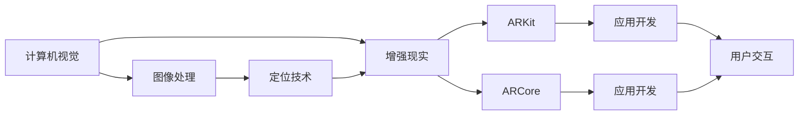

                 

# 增强现实（AR）应用：Apple ARKit 和 Google ARCore

> 关键词：增强现实（AR）, ARKit, ARCore, 虚拟现实（VR）, 混合现实（MR）, 计算机视觉（CV）, 定位技术（SLAM）, 图像处理（Image Processing）, 机器学习（ML）

## 1. 背景介绍

增强现实（AR）技术，作为虚拟现实（VR）与混合现实（MR）技术的重要分支，正逐渐成为现代信息技术发展的新热点。通过将虚拟信息与现实环境无缝结合，AR技术让用户在感知、交互和认知上实现了突破性提升。

Apple的ARKit和Google的ARCore是当前两大主流的AR开发平台，它们各自基于iOS和Android操作系统，提供了完整的AR开发框架和工具，极大便利了AR应用的开发与部署。

本文章将详细介绍Apple ARKit和Google ARCore的原理、架构、应用案例及未来发展趋势。

## 2. 核心概念与联系

### 2.1 核心概念概述

为了更好地理解ARKit和ARCore，我们需要了解一些核心概念：

- **增强现实（AR）**：通过将虚拟信息叠加在现实世界中，提升用户体验和交互性。
- **虚拟现实（VR）**：使用计算机生成虚拟环境，用户通过头显和控制器在虚拟空间中进行交互。
- **混合现实（MR）**：结合AR和VR，将虚拟元素与现实环境、用户互动信息融合。
- **计算机视觉（CV）**：利用摄像头和传感器技术，实现对现实世界的感知和理解。
- **定位技术（SLAM）**：通过传感器实时获取环境信息，实现定位、映射和跟踪。
- **图像处理（Image Processing）**：利用算法增强图像质量和鲁棒性，改善AR渲染效果。
- **机器学习（ML）**：应用深度学习等技术提升AR应用识别精度、智能决策和个性化推荐。

这些概念的联系如下：ARKit和ARCore作为AR开发平台，它们基于计算机视觉和定位技术，通过图像处理和机器学习等技术，实现虚拟信息与现实环境的融合，构建丰富的AR应用场景。

### 2.2 核心概念原理和架构的 Mermaid 流程图



此图展示了ARKit和ARCore的开发流程。

## 3. 核心算法原理 & 具体操作步骤

### 3.1 算法原理概述

ARKit和ARCore的算法原理主要包括：

- **图像识别与跟踪**：使用计算机视觉技术，通过摄像头实时捕捉场景图像，并进行目标识别和追踪。
- **环境映射与定位**：利用SLAM技术，实时构建和更新环境地图，实现对用户位置和方向的准确定位。
- **图像渲染与混合**：将虚拟信息叠加到真实场景中，实现AR效果的渲染和混合。

这些算法的组合，形成了ARKit和ARCore强大的AR体验。

### 3.2 算法步骤详解

以下是基于ARKit和ARCore进行AR应用开发的一般步骤：

1. **设置开发环境**：
   - 安装相应操作系统的开发SDK。
   - 配置开发工具，如Xcode或Android Studio。

2. **创建AR场景**：
   - 定义AR场景中的虚拟对象和环境。
   - 配置虚拟对象的位置、大小和透明度。

3. **获取摄像头数据**：
   - 通过SDK获取摄像头实时图像数据。
   - 利用图像处理技术，增强图像质量，改善检测效果。

4. **实时定位**：
   - 利用SLAM技术，实时检测并跟踪场景中的特征点。
   - 更新环境地图，实现准确的定位和路径跟踪。

5. **渲染与混合**：
   - 根据定位信息，将虚拟对象叠加到真实场景中。
   - 应用图像渲染技术，提升AR效果的真实感和流畅性。

6. **用户交互**：
   - 通过手势、触摸等交互方式，与虚拟对象进行交互。
   - 应用机器学习技术，增强AR应用智能化程度。

### 3.3 算法优缺点

ARKit和ARCore具有以下优点：

- **跨平台支持**：两大平台都支持iOS和Android，方便开发者在不同平台上开发和部署AR应用。
- **工具丰富**：提供了丰富的开发工具和API，简化了AR应用开发流程。
- **性能优化**：通过图像处理和SLAM优化，提升了AR渲染的流畅性和准确性。

同时，它们也存在一些缺点：

- **依赖设备性能**：依赖高质量的摄像头和传感器，对硬件要求较高。
- **技术复杂**：涉及计算机视觉、图像处理、SLAM等技术，技术难度较大。
- **渲染效果依赖算法**：算法的优劣直接影响AR体验，需要不断优化算法模型。

### 3.4 算法应用领域

ARKit和ARCore广泛应用于多个领域，例如：

- **游戏娱乐**：如AR版Pokémon GO、AR建筑等，提供沉浸式游戏体验。
- **教育培训**：如AR化学实验、AR历史场景等，增强教学互动性和趣味性。
- **购物体验**：如AR试衣镜、AR家具布局等，提升消费体验。
- **营销推广**：如AR广告、AR展示等，增强品牌宣传效果。
- **文物考古**：如AR文物修复、AR历史遗址重现等，辅助历史研究。

这些应用场景展示了ARKit和ARCore在现实世界中的广泛应用。

## 4. 数学模型和公式 & 详细讲解 & 举例说明

### 4.1 数学模型构建

以ARKit为例，其核心数学模型包括：

- **环境映射**：使用SLAM技术，构建环境地图，通过数学方法描述环境特征点的位置和关系。
- **物体检测**：通过图像处理技术，识别出场景中的物体并定位，使用几何变换算法描述物体空间位置。
- **虚拟对象渲染**：通过图像渲染技术，将虚拟对象叠加到真实场景中，使用光照、透视等算法提升渲染效果。

### 4.2 公式推导过程

以下是环境映射和物体检测的公式推导：

1. **环境映射**
   - 假设摄像头的位置为 $(x_c, y_c, z_c)$，当前帧的特征点为 $(x_i, y_i, z_i)$。
   - 通过特征点匹配算法，获得特征点在上一帧的位置 $(x_i_{prev}, y_i_{prev}, z_i_{prev})$。
   - 使用位姿图优化算法，估计特征点的位置和方向，获得位姿矩阵 $R$ 和平移向量 $t$。

2. **物体检测**
   - 通过目标检测算法，检测出场景中的物体位置和大小。
   - 使用几何变换算法，将物体坐标系转换到世界坐标系。
   - 使用视角投影算法，计算物体在摄像头上的投影坐标，结合摄像头内参，得到物体在图像平面上的位置。

### 4.3 案例分析与讲解

以ARKit中的实时定位和物体追踪为例，进行详细分析：

1. **实时定位**
   - 通过摄像头获取实时图像数据。
   - 使用特征点检测算法，识别出图像中的特征点。
   - 通过特征点跟踪算法，确定特征点在上一帧的位置。
   - 使用位姿图优化算法，估计当前帧的位姿矩阵和平移向量，实现实时定位。

2. **物体追踪**
   - 检测物体的位置和大小。
   - 通过几何变换算法，将物体坐标系转换到世界坐标系。
   - 使用视觉SLAM算法，实时跟踪物体的位置变化。
   - 应用深度学习技术，提高物体检测的准确性和鲁棒性。

## 5. 项目实践：代码实例和详细解释说明

### 5.1 开发环境搭建

开发AR应用需要安装相应的SDK和开发工具，以iOS和Android为例：

- **iOS**：安装Xcode，并配置ARKit的开发框架。
- **Android**：安装Android Studio，并配置ARCore的开发框架。

### 5.2 源代码详细实现

以下是一个基于ARKit的AR应用开发示例代码：

```swift
import ARKit
import UIKit

class ViewController: UIViewController, ARSCNViewDelegate {
    var sceneView: ARSCNView!
    var anchor: ARAnchor?

    override func viewDidLoad() {
        super.viewDidLoad()
        sceneView = ARSCNView(frame: view)
        sceneView.delegate = self
        sceneView.session.run{ session, error in
            guard error == nil else {
                print("Error running session: \(error!.localizedDescription)")
                return
            }
            // 添加虚拟对象
            let node = SCNNode()
            node.position = SCNVector3(x: 0, y: 0, z: 0)
            sceneView.scene.rootNode.addChildNode(node)
        }
    }

    func scnView(_ view: ARSCNView, didUpdate session: ARSession, at frameTime: CFTimeInterval) {
        guard let node = view.scene.rootNode.firstDescendant(ofType: SCNNode.self) else { return }
        guard let anchor = anchor else { return }
        // 计算节点位置
        let translation = SCNMatrix4x4.lookAt(to: anchor.position, from: node.position)
        node.transform = SCNMatrix4x4(translation) * node.transform
    }
}
```

### 5.3 代码解读与分析

- **ViewController**：AR应用的主视图控制器。
- **sceneView**：AR场景视图，负责展示AR内容。
- **session.run**：启动AR会话，并在会话中设置虚拟对象。
- **SCNNode**：创建虚拟对象节点，并设置位置和变换。
- **scnView(_:didUpdate:at:)**：实时更新虚拟对象位置，实现物体追踪。

### 5.4 运行结果展示

运行上述代码，将展示一个简单的AR应用，用户在屏幕上放置虚拟物体，并在不同的AR环境中追踪物体位置。

## 6. 实际应用场景

### 6.1 游戏娱乐

ARKit和ARCore在游戏娱乐领域有着广泛的应用，如Pokémon GO、AR建筑等。这些应用通过AR技术，提供沉浸式游戏体验，提升用户参与度和趣味性。

### 6.2 教育培训

在教育培训领域，ARKit和ARCore可用于虚拟实验、历史场景重现等应用，增强学生的学习体验。例如，通过AR化学实验，学生可以直观地观察化学变化过程。

### 6.3 购物体验

在购物体验方面，ARKit和ARCore可以提供虚拟试衣镜、家具布局等应用，帮助消费者在购买前体验产品效果，提升购物体验。

### 6.4 营销推广

ARKit和ARCore在营销推广方面也有着重要应用，如AR广告、AR展示等，通过AR技术增强品牌宣传效果。

### 6.5 文物考古

在文物考古领域，ARKit和ARCore可用于文物修复、历史遗址重现等应用，辅助历史研究和文化遗产保护。

## 7. 工具和资源推荐

### 7.1 学习资源推荐

1. **Apple ARKit官方文档**：详细介绍了ARKit的API和开发流程，是开发者学习的重要资源。
2. **Google ARCore官方文档**：详细介绍了ARCore的API和开发流程，提供了丰富的开发示例。
3. **ARKit和ARCore实战教程**：提供了详细的教程和项目案例，适合新手和进阶开发者。
4. **计算机视觉基础课程**：了解计算机视觉和SLAM技术，是开发AR应用的基础。

### 7.2 开发工具推荐

1. **Xcode**：iOS平台的主要开发工具，支持ARKit的开发。
2. **Android Studio**：Android平台的主要开发工具，支持ARCore的开发。
3. **Unity**：支持多种平台，可以方便地集成ARKit和ARCore。
4. **Cocos2d-x**：跨平台的2D游戏引擎，支持ARKit和ARCore的开发。

### 7.3 相关论文推荐

1. **ARKit官方白皮书**：详细介绍了ARKit的技术架构和开发流程。
2. **ARCore官方白皮书**：详细介绍了ARCore的技术架构和开发流程。
3. **AR技术综述论文**：综述了AR技术的最新进展和未来方向，适合深入了解。

## 8. 总结：未来发展趋势与挑战

### 8.1 研究成果总结

ARKit和ARCore作为当前主流的AR开发平台，已经广泛应用于多个领域。基于它们的开发实践，AR技术在用户体验和应用场景上实现了突破性提升。

### 8.2 未来发展趋势

展望未来，ARKit和ARCore将呈现以下发展趋势：

1. **硬件性能提升**：随着AR设备硬件的不断发展，AR应用的渲染效果和用户体验将进一步提升。
2. **跨平台协同**：ARKit和ARCore的跨平台支持，将进一步促进AR应用的普及。
3. **智能交互**：通过机器学习和深度学习技术，AR应用将实现更加智能和个性化的交互体验。
4. **边缘计算**：AR应用将越来越多地依赖边缘计算技术，实现实时渲染和响应。
5. **虚拟世界构建**：基于AR技术构建虚拟世界，实现更为丰富的虚拟体验。

### 8.3 面临的挑战

尽管ARKit和ARCore在AR应用开发中取得了显著成就，但也面临着一些挑战：

1. **硬件成本**：高性能AR设备往往价格较高，限制了AR应用的普及。
2. **技术复杂**：AR应用的开发需要计算机视觉、SLAM等多种技术，技术门槛较高。
3. **渲染效果**：AR渲染效果依赖于硬件和算法，不同设备间的渲染效果可能存在差异。
4. **内容生产**：高质量AR内容的制作需要大量时间和成本，限制了内容的多样性和丰富性。
5. **用户隐私**：AR应用需要获取用户位置和环境信息，可能存在隐私泄露风险。

### 8.4 研究展望

未来ARKit和ARCore的发展需要克服上述挑战，积极寻求新的技术突破和应用创新。例如：

1. **算法优化**：提升AR算法的精度和鲁棒性，实现更高质量的渲染效果。
2. **内容创作**：通过自动化和半自动化的方式，降低AR内容制作成本，促进内容多样性。
3. **隐私保护**：通过技术手段和法规限制，确保AR应用对用户隐私的保护。
4. **边缘计算**：通过边缘计算技术，提升AR应用的实时性和稳定性。
5. **跨领域融合**：将AR技术与物联网、大数据等技术结合，实现更丰富的应用场景。

## 9. 附录：常见问题与解答

**Q1：ARKit和ARCore的性能如何？**

A: ARKit和ARCore在不同设备上的性能表现略有差异，但整体性能均满足AR应用的基本需求。

**Q2：ARKit和ARCore的兼容性如何？**

A: ARKit和ARCore分别支持iOS和Android平台，跨平台兼容性良好。

**Q3：ARKit和ARCore如何处理遮挡和光照？**

A: ARKit和ARCore使用复杂的渲染算法，处理遮挡和光照，确保AR效果的真实性。

**Q4：ARKit和ARCore的开发难度如何？**

A: 开发AR应用需要掌握计算机视觉、SLAM等技术，有一定的技术难度，但丰富的开发资源和API降低了开发门槛。

**Q5：ARKit和ARCore的更新频率如何？**

A: Apple和Google都会定期更新ARKit和ARCore，提供新的功能和API支持。

作者：禅与计算机程序设计艺术 / Zen and the Art of Computer Programming

