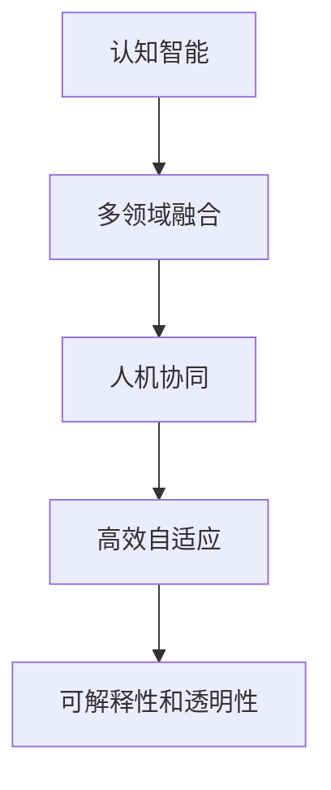

                 

# 复杂问题解决：AI的新角色

> 关键词：复杂问题解决,人工智能,认知智能,自然语言处理,深度学习,机器学习,人机交互

## 1. 背景介绍

### 1.1 问题由来
人工智能（AI）技术的飞速发展，正在逐步改变我们的生活和工作方式。从简单的自动化任务到复杂的认知智能，AI正逐步拓展其能力边界，深入各个行业，解决越来越复杂的问题。然而，这些复杂问题往往涉及多个领域，需要综合运用多种知识，并结合人机交互进行解决。本文将重点探讨如何利用AI解决复杂问题，介绍其核心概念和应用场景，并展望其未来发展趋势。

### 1.2 问题核心关键点
在当前AI技术发展中，复杂问题解决的能力愈发成为衡量AI技术水平的重要指标。这一能力主要体现在以下几个方面：

1. **多领域融合**：AI技术往往需要跨多个领域（如语言、视觉、语音等）进行知识整合，才能综合解决复杂问题。

2. **认知智能**：AI需要在认知层面对问题进行理解和推理，而非简单的规则匹配。

3. **人机协同**：AI需要与人类协同工作，理解人类意图和反馈，提升问题解决的准确性和效率。

4. **高效自适应**：AI需具备自我学习和适应的能力，根据新数据和新场景快速调整解决策略。

5. **可解释性和透明性**：AI的决策过程需要透明，便于人类理解、验证和监督。

### 1.3 问题研究意义
研究AI在复杂问题解决中的新角色，对于推动人工智能技术的发展、提升问题解决的智能化水平、推动产业升级具有重要意义：

1. **提升问题解决能力**：AI通过多领域融合、认知智能和高效自适应，可以大幅提升问题解决的效率和质量。

2. **赋能产业升级**：AI技术能够快速应用于各行业，推动传统行业数字化转型，提升产业竞争力。

3. **支持认知智能**：AI技术的发展，将推动认知智能的进步，更好地理解和处理复杂问题。

4. **拓展应用场景**：AI技术在各领域的广泛应用，将带来更多创新性的解决方案，推动社会进步。

## 2. 核心概念与联系

### 2.1 核心概念概述

为更好地理解AI在复杂问题解决中的新角色，本节将介绍几个关键概念：

- **认知智能**：AI能够通过理解、推理、学习等方式，解决复杂问题。
- **多领域融合**：AI通过融合语言、视觉、语音等多种数据类型，获取全面信息。
- **人机协同**：AI能够与人类协同工作，理解人类意图，提升问题解决准确性。
- **高效自适应**：AI能够在新的数据和场景中快速调整解决策略，适应不断变化的环境。
- **可解释性和透明性**：AI的决策过程透明，便于人类理解、验证和监督。

这些概念之间的逻辑关系可以通过以下Mermaid流程图来展示：



这个流程图展示了许多关键概念及其相互关系：

1. **认知智能**：基础能力，支持多领域融合。
2. **多领域融合**：扩展数据源，提升问题解决的全面性。
3. **人机协同**：利用人类的主观判断和反馈，提高问题解决的准确性。
4. **高效自适应**：通过自我学习，适应新数据和新场景。
5. **可解释性和透明性**：保证决策过程的可理解性和可信性。

这些概念共同构成了AI在复杂问题解决中的核心能力，使AI能够有效地处理日益复杂多变的问题。

## 3. 核心算法原理 & 具体操作步骤

### 3.1 算法原理概述

AI在复杂问题解决中，通常采用基于深度学习的算法框架。其核心思想是通过对海量数据的学习，构建强大的特征提取和推理能力，并结合多领域融合和认知智能等技术，提升问题解决的智能化水平。

基于深度学习的算法框架主要包括以下几个步骤：

1. **数据准备**：收集和预处理问题相关的多领域数据，并进行标注。
2. **模型训练**：选择合适的深度学习模型，在标注数据上训练模型，使其学习到问题解决的相关知识。
3. **模型融合**：通过多领域融合技术，将不同领域的数据整合，增强模型的决策能力。
4. **人机交互**：结合自然语言处理（NLP）和计算机视觉（CV）等技术，与人类进行交互，理解人类意图和反馈。
5. **决策和优化**：结合人类的决策和AI的推理能力，进行综合判断，并不断优化问题解决策略。

### 3.2 算法步骤详解

AI在复杂问题解决中的具体操作步骤可以概括为以下几步：

**Step 1: 数据准备**

1. **数据收集**：收集与问题相关的多领域数据，包括文本、图像、音频等。
2. **数据标注**：对数据进行标注，如分类、情感分析、命名实体识别等。
3. **数据清洗**：去除数据中的噪声和异常值，保证数据质量。
4. **数据增强**：通过数据增强技术，扩充训练数据集，提高模型的泛化能力。

**Step 2: 模型训练**

1. **模型选择**：选择合适的深度学习模型，如Transformer、CNN、RNN等。
2. **模型初始化**：使用预训练模型或随机初始化模型参数。
3. **损失函数定义**：定义合适的损失函数，如交叉熵损失、均方误差损失等。
4. **优化算法**：选择合适的优化算法，如Adam、SGD等，设置学习率和正则化参数。
5. **模型训练**：在训练集上训练模型，不断调整参数以最小化损失函数。
6. **验证和测试**：在验证集和测试集上评估模型性能，防止过拟合。

**Step 3: 模型融合**

1. **多领域融合**：通过融合不同的数据类型，增强模型的决策能力。
2. **特征提取**：使用不同的特征提取器，提取不同类型的数据特征。
3. **特征融合**：将不同领域的特征进行融合，生成综合特征向量。
4. **模型融合**：将多领域融合后的特征输入到单一模型中进行决策。

**Step 4: 人机交互**

1. **自然语言处理**：使用NLP技术解析用户输入的自然语言，提取关键信息。
2. **计算机视觉**：使用CV技术处理图像数据，提取视觉特征。
3. **语音识别**：使用语音识别技术处理语音输入，提取语音特征。
4. **交互系统设计**：设计智能交互系统，与用户进行实时交流。
5. **意图理解**：通过意图理解算法，解析用户意图，提供个性化服务。

**Step 5: 决策和优化**

1. **决策策略**：结合人类的决策和AI的推理能力，进行综合判断。
2. **结果输出**：根据决策结果，输出问题解决方案。
3. **反馈机制**：收集用户反馈，不断优化问题解决策略。

### 3.3 算法优缺点

基于深度学习的AI在复杂问题解决中具有以下优点：

1. **高效处理大规模数据**：深度学习模型能够高效处理大规模数据，提取高维特征，提升问题解决的准确性。
2. **自我学习能力**：深度学习模型能够通过自我学习，适应新数据和新场景。
3. **多领域融合能力**：深度学习模型能够融合多种数据类型，增强决策能力。
4. **可解释性增强**：深度学习模型的决策过程透明，便于人类理解和监督。

同时，也存在一些局限性：

1. **数据依赖性强**：深度学习模型需要大量标注数据，获取高质量标注数据的成本较高。
2. **模型复杂度高**：深度学习模型参数量大，计算复杂度高，训练和推理耗时较长。
3. **可解释性不足**：深度学习模型的黑盒特性，使得其决策过程难以解释和验证。
4. **泛化能力有待提高**：深度学习模型往往在训练数据上表现优异，但在未见过的数据上泛化能力较差。

尽管存在这些局限性，但深度学习在复杂问题解决中依然展现出了强大的潜力，未来有望在多领域融合和自我学习等方面取得新的突破。

### 3.4 算法应用领域

基于深度学习的AI在复杂问题解决中，已经广泛应用于多个领域，如医疗、金融、教育、交通等，成为推动各行业智能化发展的关键技术。

**医疗领域**：AI在医疗影像分析、疾病诊断、药物研发等方面表现出色，提升了医疗服务的智能化水平。

**金融领域**：AI在风险管理、客户服务、量化交易等方面提供了高效解决方案，推动了金融行业的数字化转型。

**教育领域**：AI在个性化教育、作业批改、知识推荐等方面提供了智能化支持，促进了教育公平。

**交通领域**：AI在自动驾驶、交通流量管理、智能导航等方面展示了巨大潜力，提升了交通系统的智能化和安全性。

此外，AI在环保、安全、能源等多个领域的应用也取得了显著成果，展现了其在复杂问题解决中的强大能力。

## 4. 数学模型和公式 & 详细讲解 & 举例说明

### 4.1 数学模型构建

AI在复杂问题解决中，通常采用基于深度学习的数学模型。其核心思想是通过对海量数据的学习，构建强大的特征提取和推理能力，并结合多领域融合和认知智能等技术，提升问题解决的智能化水平。

### 4.2 公式推导过程

以下我们以文本分类任务为例，推导基于深度学习的分类模型公式及其梯度计算。

假设文本分类问题中共有 $C$ 个类别，文本输入为 $x$，输出为 $y \in [0,1]$，表示样本属于类别 $c$ 的概率。分类模型的数学公式如下：

$$
y = M(x) = \text{softmax}(Wx + b)
$$

其中 $W$ 和 $b$ 为模型参数，$\text{softmax}$ 函数将线性变换后的结果转化为概率分布。损失函数通常采用交叉熵损失，定义如下：

$$
\mathcal{L}(y,\hat{y}) = -\frac{1}{N} \sum_{i=1}^N \sum_{c=1}^C y_i \log \hat{y}_i
$$

其中 $y_i$ 为真实标签，$\hat{y}_i$ 为模型预测的概率分布。

在得到损失函数后，可以使用梯度下降等优化算法，通过反向传播计算参数梯度，更新模型参数。设 $\nabla_{\theta} \mathcal{L}$ 为损失函数对模型参数的梯度，则参数更新公式为：

$$
\theta \leftarrow \theta - \eta \nabla_{\theta} \mathcal{L}
$$

其中 $\eta$ 为学习率。

### 4.3 案例分析与讲解

以医疗影像分类任务为例，介绍基于深度学习的模型构建和训练过程。

假设医疗影像分类问题中共有 $K$ 种疾病，每张影像输入为 $x$，输出为 $y \in [0,1]$，表示影像属于第 $k$ 种疾病的概率。假设模型为卷积神经网络（CNN），包含多个卷积层和池化层，最后一层为全连接层，输出类别概率。训练数据集为 $D = \{(x_i, y_i)\}_{i=1}^N$，验证集和测试集为 $D_{val}$ 和 $D_{test}$。

**Step 1: 数据准备**

1. 收集医疗影像数据，并进行标注。
2. 将影像数据分为训练集、验证集和测试集。
3. 对数据进行预处理，如归一化、调整大小等。

**Step 2: 模型构建**

1. 设计卷积神经网络模型，包含多个卷积层和池化层。
2. 添加全连接层，输出类别概率。
3. 定义损失函数为交叉熵损失。
4. 选择优化算法，如AdamW，设置学习率和学习率衰减策略。

**Step 3: 模型训练**

1. 在训练集上训练模型，计算损失函数。
2. 使用梯度下降算法更新模型参数。
3. 在验证集上评估模型性能，防止过拟合。
4. 在测试集上评估模型泛化能力。

**Step 4: 模型融合**

1. 使用多模态融合技术，将影像特征和临床信息整合。
2. 使用多任务学习技术，联合训练多个相关任务。
3. 使用集成学习技术，提升模型决策能力。

**Step 5: 人机交互**

1. 设计智能交互系统，与医生进行实时交流。
2. 使用自然语言处理技术，解析医生输入的自然语言。
3. 结合计算机视觉技术，提取影像特征。
4. 设计意图理解算法，解析医生意图。

**Step 6: 决策和优化**

1. 结合医生的决策和模型推理结果，进行综合判断。
2. 输出疾病诊断结果，供医生参考。
3. 收集医生反馈，不断优化模型和交互系统。

通过以上步骤，基于深度学习的AI可以高效地解决复杂的医疗影像分类问题，提升医疗服务的智能化水平。

## 5. 项目实践：代码实例和详细解释说明

### 5.1 开发环境搭建

在进行复杂问题解决的项目实践前，我们需要准备好开发环境。以下是使用Python进行TensorFlow开发的Python环境配置流程：

1. 安装Anaconda：从官网下载并安装Anaconda，用于创建独立的Python环境。

2. 创建并激活虚拟环境：
```bash
conda create -n tf-env python=3.8 
conda activate tf-env
```

3. 安装TensorFlow：根据CUDA版本，从官网获取对应的安装命令。例如：
```bash
conda install tensorflow
```

4. 安装各类工具包：
```bash
pip install numpy pandas scikit-learn matplotlib tqdm jupyter notebook ipython
```

完成上述步骤后，即可在`tf-env`环境中开始项目实践。

### 5.2 源代码详细实现

下面我们以医疗影像分类任务为例，给出使用TensorFlow对卷积神经网络（CNN）模型进行训练的Python代码实现。

首先，定义数据处理函数：

```python
import tensorflow as tf
from tensorflow.keras.preprocessing.image import ImageDataGenerator

def load_data():
    train_dir = 'path/to/train/data'
    val_dir = 'path/to/val/data'
    test_dir = 'path/to/test/data'
    
    train_datagen = ImageDataGenerator(rescale=1./255, shear_range=0.2, zoom_range=0.2, horizontal_flip=True)
    val_datagen = ImageDataGenerator(rescale=1./255)
    test_datagen = ImageDataGenerator(rescale=1./255)
    
    train_generator = train_datagen.flow_from_directory(train_dir, target_size=(256, 256), batch_size=32, class_mode='categorical')
    val_generator = val_datagen.flow_from_directory(val_dir, target_size=(256, 256), batch_size=32, class_mode='categorical')
    test_generator = test_datagen.flow_from_directory(test_dir, target_size=(256, 256), batch_size=32, class_mode='categorical')
    
    return train_generator, val_generator, test_generator
```

然后，定义模型和训练函数：

```python
from tensorflow.keras.models import Sequential
from tensorflow.keras.layers import Conv2D, MaxPooling2D, Flatten, Dense

def build_model():
    model = Sequential([
        Conv2D(32, (3, 3), activation='relu', input_shape=(256, 256, 3)),
        MaxPooling2D((2, 2)),
        Conv2D(64, (3, 3), activation='relu'),
        MaxPooling2D((2, 2)),
        Conv2D(128, (3, 3), activation='relu'),
        MaxPooling2D((2, 2)),
        Flatten(),
        Dense(128, activation='relu'),
        Dense(K, activation='softmax')
    ])
    
    model.compile(optimizer='adam', loss='categorical_crossentropy', metrics=['accuracy'])
    
    return model

def train_model(model, train_generator, val_generator, epochs=10, batch_size=32):
    steps_per_epoch = train_generator.n // batch_size
    validation_steps = val_generator.n // batch_size
    
    history = model.fit(train_generator, epochs=epochs, batch_size=batch_size, validation_data=val_generator)
    
    return model, history
```

最后，启动训练流程并在测试集上评估：

```python
from tensorflow.keras.metrics import Accuracy

model = build_model()
train_generator, val_generator, test_generator = load_data()

model, history = train_model(model, train_generator, val_generator, epochs=10, batch_size=32)

# 在测试集上评估模型
test_loss, test_acc = model.evaluate(test_generator)

print(f'Test loss: {test_loss:.4f}')
print(f'Test accuracy: {test_acc:.4f}')
```

以上就是使用TensorFlow对CNN模型进行医疗影像分类任务训练的完整代码实现。可以看到，通过TensorFlow的强大封装和易于使用的接口，我们能够快速实现深度学习模型的训练和评估。

### 5.3 代码解读与分析

让我们再详细解读一下关键代码的实现细节：

**load_data函数**：
- 定义数据加载和预处理函数，使用ImageDataGenerator对数据进行扩充和归一化。
- 加载训练集、验证集和测试集数据，并生成DataGenerator对象，供模型训练使用。

**build_model函数**：
- 定义CNN模型结构，包括卷积层、池化层和全连接层。
- 使用Adam优化器和交叉熵损失函数，并设置评价指标。

**train_model函数**：
- 计算每个epoch的训练步骤数和验证步骤数。
- 使用model.fit函数进行模型训练，设置训练轮数和批大小。
- 收集训练过程中的loss和accuracy，并返回训练历史。

**代码运行结果展示**：
- 输出训练集和验证集的loss和accuracy，监控模型训练过程。
- 输出测试集的loss和accuracy，评估模型泛化能力。

可以看到，TensorFlow的强大工具包和易于使用的API使得深度学习模型的训练和评估变得简洁高效。开发者可以将更多精力放在数据处理和模型改进等高层逻辑上，而不必过多关注底层的实现细节。

当然，工业级的系统实现还需考虑更多因素，如模型的保存和部署、超参数的自动搜索、更灵活的任务适配层等。但核心的训练范式基本与此类似。

## 6. 实际应用场景

### 6.1 智能医疗

基于AI的复杂问题解决技术，可以广泛应用于智能医疗领域。传统医疗服务依赖大量专家医生，成本高、效率低。而使用AI技术，可以实现智能诊断、智能问诊、智能推荐等，大幅提升医疗服务的智能化水平。

在技术实现上，可以收集和标注大量医疗影像数据和临床数据，训练AI模型进行疾病诊断、治疗方案推荐等任务。通过AI模型的多领域融合和认知智能，能够快速、准确地处理复杂的医疗问题。

### 6.2 智能金融

AI在金融领域的应用同样广泛，可以用于风险评估、投资策略、客户服务等方面。例如，通过分析交易数据和市场行情，AI可以预测股票走势，帮助投资者做出更科学的决策。

在技术实现上，可以收集和标注历史交易数据和市场数据，训练AI模型进行情感分析、预测建模等任务。通过多领域融合和认知智能，能够快速、准确地处理复杂的金融问题。

### 6.3 智能教育

在教育领域，AI可以用于个性化教育、作业批改、智能推荐等。例如，通过分析学生的学习行为和历史数据，AI可以推荐个性化的学习计划和内容，提升学习效果。

在技术实现上，可以收集和标注学生的学习数据，训练AI模型进行意图识别、情感分析等任务。通过多领域融合和认知智能，能够快速、准确地处理复杂的学生学习问题。

### 6.4 未来应用展望

随着AI技术的不断进步，基于深度学习的复杂问题解决技术将在更多领域得到应用，带来变革性影响。

在智慧城市治理中，AI可以用于交通管理、环境保护、城市安全等方面。通过多领域融合和认知智能，能够提升城市管理的自动化和智能化水平，构建更安全、高效的未来城市。

在工业制造中，AI可以用于质量检测、设备维护、生产优化等方面。通过多领域融合和认知智能，能够提升生产效率和产品质量，推动制造业的数字化转型。

在能源管理中，AI可以用于电网优化、智能调度、能源预测等方面。通过多领域融合和认知智能，能够提升能源利用效率，实现绿色可持续发展。

总之，基于深度学习的复杂问题解决技术将在各个领域带来深刻变革，推动社会进步和产业升级。未来，随着算力、数据和算法的发展，AI技术将在复杂问题解决中发挥更大作用。

## 7. 工具和资源推荐

### 7.1 学习资源推荐

为了帮助开发者系统掌握AI在复杂问题解决中的应用，这里推荐一些优质的学习资源：

1. **深度学习框架TensorFlow和PyTorch的官方文档**：这些文档提供了丰富的教程和样例，帮助开发者快速上手深度学习开发。
2. **自然语言处理(NLP)技术入门教程**：NLP是复杂问题解决中的重要技术，通过学习NLP技术，可以更好地理解和应用深度学习模型。
3. **计算机视觉(CV)技术入门教程**：CV技术在复杂问题解决中具有重要作用，通过学习CV技术，可以更好地融合多领域数据。
4. **多领域融合技术入门教程**：了解多领域融合技术，掌握如何整合不同领域的数据，提升问题解决的全面性。
5. **认知智能技术入门教程**：了解认知智能技术，掌握如何构建具有理解、推理、学习等能力的AI模型。

### 7.2 开发工具推荐

高效的开发离不开优秀的工具支持。以下是几款用于AI在复杂问题解决中的开发的常用工具：

1. **深度学习框架TensorFlow和PyTorch**：这些框架提供了强大的深度学习模型和计算图，适用于各种复杂问题的解决。
2. **自然语言处理(NLP)工具包NLTK和SpaCy**：这些工具包提供了丰富的NLP功能，支持文本处理、语言模型训练等。
3. **计算机视觉(CV)工具包OpenCV和Pillow**：这些工具包提供了丰富的CV功能，支持图像处理、视频分析等。
4. **多领域融合工具包HuggingFace的Transformers库**：该库提供了丰富的预训练模型和微调功能，支持多领域数据的融合。
5. **智能交互工具包TensorFlow Serving和Keras**：这些工具包提供了强大的服务化封装和模型部署功能，支持智能交互系统的构建。

### 7.3 相关论文推荐

AI在复杂问题解决中的技术发展，得益于学界的持续研究。以下是几篇奠基性的相关论文，推荐阅读：

1. **Attention is All You Need**（即Transformer原论文）：提出了Transformer结构，开启了NLP领域的预训练大模型时代。
2. **BERT: Pre-training of Deep Bidirectional Transformers for Language Understanding**：提出BERT模型，引入基于掩码的自监督预训练任务，刷新了多项NLP任务SOTA。
3. **AlphaGo Zero**：展示了深度强化学习在复杂决策问题中的强大能力，推动了AI在复杂问题解决中的应用。
4. **深度学习在医疗影像分析中的应用**：讨论了深度学习在医疗影像分类、分割等任务中的应用，提升了医疗服务的智能化水平。
5. **深度学习在金融风险管理中的应用**：讨论了深度学习在金融风险评估、投资策略等任务中的应用，推动了金融行业的数字化转型。
6. **深度学习在个性化教育中的应用**：讨论了深度学习在个性化教育、作业批改等任务中的应用，提升了教育公平和教学质量。

这些论文代表了大AI在复杂问题解决中的技术发展脉络。通过学习这些前沿成果，可以帮助研究者把握学科前进方向，激发更多的创新灵感。

## 8. 总结：未来发展趋势与挑战

### 8.1 总结

本文对基于深度学习的AI在复杂问题解决中的新角色进行了全面系统的介绍。首先阐述了AI在复杂问题解决中的重要性和应用前景，明确了其在多领域融合、认知智能和高效自适应等方面的核心能力。其次，从原理到实践，详细讲解了基于深度学习的AI在复杂问题解决中的操作步骤，包括数据准备、模型训练、模型融合、人机交互、决策优化等。同时，本文还广泛探讨了AI在医疗、金融、教育等多个行业领域的应用场景，展示了其在现实问题解决中的强大潜力。

通过本文的系统梳理，可以看到，基于深度学习的AI技术在复杂问题解决中发挥了关键作用，成为推动各行业智能化发展的核心力量。未来，随着深度学习模型的不断演进和应用场景的拓展，基于深度学习的AI技术将进一步提升问题解决的智能化水平，推动社会进步和产业升级。

### 8.2 未来发展趋势

展望未来，AI在复杂问题解决中面临以下几个发展趋势：

1. **多领域融合能力增强**：深度学习模型将能够更加全面地整合多领域数据，提升决策能力。
2. **认知智能提升**：深度学习模型将具备更强的理解、推理和学习能力，解决更复杂的问题。
3. **人机协同优化**：AI将与人类进行更高效、更智能的协同，提升问题解决的准确性和效率。
4. **高效自适应提升**：AI将能够更快速地适应新数据和新场景，提升模型的泛化能力。
5. **可解释性和透明性增强**：深度学习模型的决策过程将更加透明，便于人类理解和监督。

### 8.3 面临的挑战

尽管AI在复杂问题解决中已经取得了显著进展，但在应用过程中仍面临以下挑战：

1. **数据依赖性强**：获取高质量标注数据成本较高，数据不足可能导致模型泛化能力差。
2. **模型复杂度高**：深度学习模型参数量大，计算复杂度高，训练和推理耗时较长。
3. **可解释性不足**：深度学习模型的黑盒特性，使得其决策过程难以解释和验证。
4. **泛化能力有待提高**：深度学习模型往往在训练数据上表现优异，但在未见过的数据上泛化能力较差。

### 8.4 研究展望

面对AI在复杂问题解决中面临的挑战，未来的研究需要在以下几个方面寻求新的突破：

1. **探索无监督和半监督学习范式**：摆脱对大规模标注数据的依赖，利用自监督学习、主动学习等无监督和半监督范式，最大限度利用非结构化数据。
2. **开发更高效的模型压缩和优化技术**：在保持性能的前提下，减小模型尺寸，提高计算效率和推理速度。
3. **引入因果分析和博弈论工具**：通过引入因果推断和博弈论思想，增强决策过程的透明性和逻辑性。
4. **纳入伦理道德约束**：在模型训练目标中引入伦理导向的评估指标，过滤和惩罚有害的输出倾向。
5. **开发智能交互系统**：设计更加智能和人性化的交互界面，提升人机协同的效率和效果。

这些研究方向的探索，必将引领AI在复杂问题解决技术迈向更高的台阶，为构建智能化的未来社会奠定基础。

## 9. 附录：常见问题与解答

**Q1：AI在复杂问题解决中如何发挥作用？**

A: AI在复杂问题解决中主要通过多领域融合、认知智能和高效自适应等技术，提升问题解决的智能化水平。具体来说，AI能够整合多领域数据，增强决策能力；通过理解、推理和学习，解决复杂问题；并能够快速适应新数据和新场景，提升模型的泛化能力。

**Q2：AI在复杂问题解决中存在哪些局限性？**

A: AI在复杂问题解决中存在一些局限性，主要包括：数据依赖性强，模型复杂度高，可解释性不足，泛化能力有待提高。获取高质量标注数据成本较高，深度学习模型参数量大，计算复杂度高，训练和推理耗时较长，决策过程难以解释和验证，模型在训练数据上表现优异，但在未见过的数据上泛化能力较差。

**Q3：如何优化AI在复杂问题解决中的模型性能？**

A: 优化AI在复杂问题解决中的模型性能，可以从以下几个方面进行：
1. 数据准备：收集和标注高质量数据，扩充数据集，提高模型泛化能力。
2. 模型优化：采用更高效的模型压缩和优化技术，减小模型尺寸，提高计算效率和推理速度。
3. 多领域融合：利用多领域融合技术，整合不同领域的数据，增强决策能力。
4. 人机协同：设计智能交互系统，提升人机协同的效率和效果。
5. 自我学习：通过自我学习，适应新数据和新场景，提升模型的泛化能力。

**Q4：AI在复杂问题解决中如何提升可解释性和透明性？**

A: 提升AI在复杂问题解决中的可解释性和透明性，可以从以下几个方面进行：
1. 数据可视化：利用可视化技术，展示模型决策过程和数据分布。
2. 可解释模型：使用可解释模型（如决策树、规则系统等），提高决策过程的可解释性。
3. 行为监控：实时监控模型的行为和决策过程，发现和纠正潜在问题。
4. 用户反馈：收集用户反馈，不断优化模型和交互系统，提高透明度。

这些方法有助于提高AI在复杂问题解决中的可解释性和透明性，增强系统的可信度和可接受性。

通过本文的系统梳理，可以看到，基于深度学习的AI技术在复杂问题解决中发挥了关键作用，成为推动各行业智能化发展的核心力量。未来，随着深度学习模型的不断演进和应用场景的拓展，基于深度学习的AI技术将进一步提升问题解决的智能化水平，推动社会进步和产业升级。

作者：禅与计算机程序设计艺术 / Zen and the Art of Computer Programming

