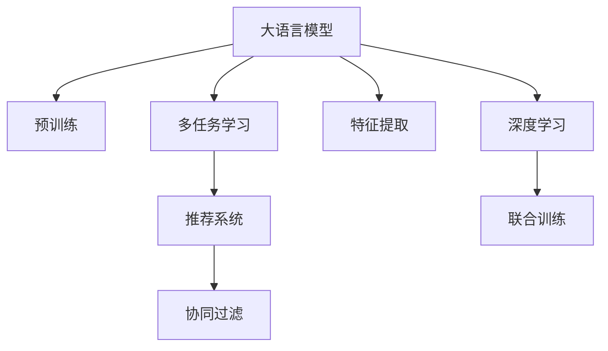

                 

# 多任务学习在LLM推荐中的应用

> 关键词：多任务学习, 大语言模型, 推荐系统, 预训练, 特征提取, 联合训练, 深度学习, 协同过滤, 算法优化

## 1. 背景介绍

### 1.1 问题由来
随着信息技术的飞速发展，推荐系统成为了互联网企业提升用户体验和运营效率的重要工具。传统的推荐系统基于用户行为数据，通过协同过滤、基于内容的推荐等算法，为用户推荐感兴趣的商品或内容。然而，随着数据量的激增和推荐场景的丰富，传统的推荐方法已难以满足用户个性化需求和平台运营目标。

近年来，基于深度学习的方法在推荐系统领域逐渐崭露头角。其中，大语言模型(LLM)在自然语言处理(NLP)领域取得显著进展，在推荐系统中的应用也开始引起广泛关注。LLM 通过大规模无标签文本数据的预训练，学习到丰富的语言知识和表示能力，可以辅助推荐系统从更深层次理解用户需求，生成更具吸引力的推荐内容。

### 1.2 问题核心关键点
多任务学习是当前推荐系统领域研究的热点方向之一。多任务学习可以同时处理多个子任务，利用子任务之间的相关性，提升模型的泛化能力和预测精度。在推荐系统中的应用，多任务学习可以有效整合用户的多种需求，如评分预测、内容推荐、广告推荐等，同时还能提升模型的在线实时性和可解释性。

多任务学习在LLM推荐中的应用，可以借助预训练模型对文本数据进行特征提取，并将多任务学习与协同过滤等推荐算法相结合，形成更加综合的推荐策略。这种联合训练方式可以最大化利用预训练模型和大规模数据的优势，弥补传统推荐方法的不足，提升推荐系统的整体表现。

### 1.3 问题研究意义
研究多任务学习在LLM推荐系统中的应用，对于提升推荐系统的综合性能，改善用户体验和运营效果，具有重要意义：

1. **增强推荐质量**：多任务学习能够同时处理多种推荐任务，可以更全面地了解用户需求，生成更加精准和多样化的推荐内容，提升用户满意度。
2. **降低标注成本**：基于预训练的LLM可以用于自动生成推荐样本，减少对标注数据的需求，降低开发成本。
3. **提升在线实时性**：预训练模型可以大幅减少在线计算开销，提升推荐系统的实时响应能力，满足用户即时性需求。
4. **增强模型可解释性**：多任务学习可以通过注意力机制等方法，解释推荐模型对不同特征的关注程度，提升模型可解释性。
5. **推动模型迁移能力**：多任务学习可以提升模型的跨任务泛化能力，使其能够更好地应对不同平台和场景下的推荐需求。

## 2. 核心概念与联系

### 2.1 核心概念概述

为了更好地理解多任务学习在LLM推荐系统中的应用，本节将介绍几个密切相关的核心概念：

- 大语言模型(LLM)：以自回归(如GPT)或自编码(如BERT)模型为代表的大规模预训练语言模型。通过在大规模无标签文本语料上进行预训练，学习到语言的通用表示，具备强大的语言理解和生成能力。

- 多任务学习(Multi-task Learning)：指在同时训练多个子任务的前提下，通过共享特征表示，提升模型在不同任务上的性能。

- 推荐系统(Recommendation System)：通过用户行为数据，为用户推荐感兴趣的物品或内容，提升用户体验和运营效率。

- 协同过滤(Collaborative Filtering)：一种基于用户行为数据进行推荐的方法，通过寻找与目标用户行为相似的相似用户，来推荐物品或内容。

- 深度学习(Deep Learning)：一种基于神经网络的机器学习方法，通过多层非线性变换，自动学习输入数据的特征表示，广泛应用于图像、语音、自然语言处理等领域。

- 特征提取(Feature Extraction)：从原始数据中提取出有用信息，作为模型的输入特征，是深度学习的重要环节。

- 联合训练(Joint Training)：指多个子任务共享同一个模型，同时进行训练，提高模型的泛化能力和预测精度。

这些核心概念之间的逻辑关系可以通过以下Mermaid流程图来展示：



这个流程图展示了大语言模型、多任务学习、推荐系统、协同过滤、特征提取、深度学习和联合训练等概念之间的内在联系。

## 3. 核心算法原理 & 具体操作步骤
### 3.1 算法原理概述

多任务学习在LLM推荐系统中的应用，主要包括以下几个关键步骤：

1. **预训练**：使用大规模无标签文本数据，对LLM进行预训练，学习到语言的通用表示。
2. **特征提取**：将预训练的LLM应用于推荐系统中的多种任务，如评分预测、内容推荐、广告推荐等，提取出任务相关的特征表示。
3. **多任务联合训练**：将提取出的特征表示，输入到一个多任务学习框架中，同时训练多个子任务，提升模型的泛化能力和预测精度。
4. **联合预测**：在在线推荐过程中，使用多任务学习框架对用户输入进行联合预测，生成最终的推荐结果。

形式化地，假设预训练模型为 $M_{\theta}$，其中 $\theta$ 为预训练得到的模型参数。给定推荐系统中的 $T$ 个任务，任务 $t$ 的数据集为 $D_t=\{(x_i,y_i)\}_{i=1}^N$，其中 $x_i$ 为输入特征，$y_i$ 为任务 $t$ 的标签。多任务学习的优化目标是最小化各个任务的损失函数之和，即：

$$
\mathcal{L}(\theta) = \frac{1}{N}\sum_{t=1}^T \sum_{i=1}^N \ell_t(M_{\theta}(x_i),y_i)
$$

其中 $\ell_t$ 为任务 $t$ 的损失函数，可以通过交叉熵、均方误差等方法计算。

通过梯度下降等优化算法，多任务学习过程不断更新模型参数 $\theta$，最小化损失函数 $\mathcal{L}$，使得模型对各个任务的预测性能都有提升。

### 3.2 算法步骤详解

多任务学习在LLM推荐系统中的应用，一般包括以下几个关键步骤：

**Step 1: 准备预训练模型和数据集**
- 选择合适的预训练语言模型 $M_{\theta}$ 作为初始化参数，如 BERT、GPT 等。
- 准备推荐系统中的各个任务的数据集 $D_t$，划分训练集、验证集和测试集。一般要求标注数据与预训练数据的分布不要差异过大。

**Step 2: 特征提取**
- 将预训练模型 $M_{\theta}$ 应用于推荐系统中的各个任务，提取出任务相关的特征表示。
- 对于评分预测任务，通常使用模型对用户输入的评分进行预测。
- 对于内容推荐任务，通常使用模型对用户输入的内容进行编码，然后通过类似选择评分最高的文本作为推荐内容。
- 对于广告推荐任务，通常使用模型对用户输入的广告进行评分，然后推荐评分最高的广告。

**Step 3: 多任务联合训练**
- 选择合适的网络结构，将多个任务共享同一个特征提取器，各自使用不同的输出层和损失函数。
- 使用多任务联合训练的优化算法（如MAML、FedMix等）进行联合训练，最小化各个任务的损失函数之和。
- 在训练过程中，可以使用数据增强、对抗训练等方法提高模型鲁棒性。

**Step 4: 联合预测**
- 在在线推荐过程中，使用训练好的多任务学习模型对用户输入进行联合预测。
- 对于评分预测任务，返回模型预测的评分。
- 对于内容推荐任务，选择预测评分最高的文本作为推荐内容。
- 对于广告推荐任务，选择预测评分最高的广告。

以上是多任务学习在LLM推荐系统中的基本流程。在实际应用中，还需要针对具体任务的特点，对多任务联合训练过程的各个环节进行优化设计，如改进联合训练的损失函数，引入更多的正则化技术，搜索最优的超参数组合等，以进一步提升模型性能。

### 3.3 算法优缺点

多任务学习在LLM推荐系统中的应用具有以下优点：
1. 利用多任务学习，可以同时处理多种推荐任务，提升模型的泛化能力和预测精度。
2. 多任务学习可以提升模型的跨任务泛化能力，使其能够更好地应对不同平台和场景下的推荐需求。
3. 多任务学习可以提升模型的在线实时性，满足用户即时性需求。
4. 多任务学习可以通过注意力机制等方法，解释推荐模型对不同特征的关注程度，提升模型可解释性。

同时，该方法也存在一定的局限性：
1. 需要更多的标注数据。多任务学习虽然能够提高模型在多个任务上的性能，但每个任务都需要一定的标注数据。
2. 模型复杂度较高。多任务学习需要使用共享特征提取器，可能导致模型复杂度增加。
3. 泛化能力有限。当任务之间的相关性较弱时，多任务学习的效果可能不如独立训练各个子任务。
4. 特征表示空间限制。共享特征提取器可能导致模型对不同任务的特征表示空间限制，影响模型性能。

尽管存在这些局限性，但就目前而言，多任务学习仍是推荐系统领域的重要研究方向，可以有效地整合多任务数据，提升推荐系统的综合性能。

### 3.4 算法应用领域

多任务学习在LLM推荐系统中的应用，已经在多个推荐场景中得到了广泛应用，包括但不限于：

- 电商推荐：如商品推荐、购物车推荐等。利用多任务学习，同时处理评分预测和内容推荐任务，提升推荐效果。
- 内容推荐：如视频推荐、音乐推荐等。通过多任务学习，同时处理评分预测和内容推荐任务，提升用户满意度。
- 广告推荐：如搜索引擎广告推荐、社交媒体广告推荐等。通过多任务学习，同时处理广告点击率和转化率预测任务，提升广告投放效果。
- 智能客服：通过多任务学习，同时处理用户意图识别和对话生成任务，提升客服系统的智能化水平。

除了上述这些经典应用外，多任务学习在多模态推荐、跨平台推荐、个性化推荐等新兴领域中，也展现出巨大的应用潜力，为推荐系统带来新的突破。

## 4. 数学模型和公式 & 详细讲解  
### 4.1 数学模型构建

本节将使用数学语言对多任务学习在LLM推荐系统中的应用过程进行更加严格的刻画。

记预训练语言模型为 $M_{\theta}$，其中 $\theta$ 为预训练得到的模型参数。假设推荐系统中有 $T$ 个任务，任务 $t$ 的数据集为 $D_t=\{(x_i,y_i)\}_{i=1}^N$，其中 $x_i$ 为输入特征，$y_i$ 为任务 $t$ 的标签。

定义模型 $M_{\theta}$ 在输入 $x$ 上的输出为 $\hat{y}=M_{\theta}(x)$，表示模型对输入的预测结果。多任务学习的优化目标是最小化各个任务的损失函数之和，即：

$$
\mathcal{L}(\theta) = \frac{1}{N}\sum_{t=1}^T \sum_{i=1}^N \ell_t(\hat{y},y_i)
$$

其中 $\ell_t$ 为任务 $t$ 的损失函数，可以通过交叉熵、均方误差等方法计算。

多任务学习的优化过程可以采用联合训练的方式进行。常见的方法包括最小二乘法、对偶学习和元学习等。这里以对偶学习方法为例，说明联合训练的数学表达。

对偶学习方法的目标是最大化所有任务的加权平均值，即：

$$
\max_{\alpha} \frac{1}{T}\sum_{t=1}^T \alpha_t \mathcal{L}_t(\theta)
$$

其中 $\alpha_t$ 为任务 $t$ 的权重，表示其在整体优化中的重要性。优化过程可以通过求解拉格朗日对偶问题进行：

$$
\min_{\theta} \sum_{t=1}^T \max_{\alpha_t} \ell_t(\hat{y},y_i) + \sum_{t=1}^T \alpha_t \ell_t(M_{\theta}(x_i),y_i)
$$

通过求解上述优化问题，可以同时优化所有任务的损失函数，提升模型的泛化能力和预测精度。

### 4.2 公式推导过程

以下我们以二分类任务为例，推导多任务学习在LLM推荐系统中的数学模型及其优化过程。

假设模型 $M_{\theta}$ 在输入 $x$ 上的输出为 $\hat{y}=M_{\theta}(x)$，表示模型对输入的预测结果。任务 $t$ 的损失函数为：

$$
\ell_t(\hat{y},y_i) = -[y_i\log \hat{y} + (1-y_i)\log (1-\hat{y})]
$$

将损失函数代入多任务学习的优化目标，得：

$$
\mathcal{L}(\theta) = -\frac{1}{N}\sum_{t=1}^T \sum_{i=1}^N \frac{y_i}{M_{\theta}(x_i)} - \frac{1-y_i}{1-M_{\theta}(x_i)}
$$

多任务学习的优化过程可以采用联合训练的方式进行。常见的方法包括最小二乘法、对偶学习和元学习等。这里以对偶学习方法为例，说明联合训练的数学表达。

对偶学习方法的目标是最大化所有任务的加权平均值，即：

$$
\max_{\alpha} \frac{1}{T}\sum_{t=1}^T \alpha_t \mathcal{L}_t(\theta)
$$

其中 $\alpha_t$ 为任务 $t$ 的权重，表示其在整体优化中的重要性。优化过程可以通过求解拉格朗日对偶问题进行：

$$
\min_{\theta} \sum_{t=1}^T \max_{\alpha_t} \ell_t(\hat{y},y_i) + \sum_{t=1}^T \alpha_t \ell_t(M_{\theta}(x_i),y_i)
$$

通过求解上述优化问题，可以同时优化所有任务的损失函数，提升模型的泛化能力和预测精度。

## 5. 项目实践：代码实例和详细解释说明
### 5.1 开发环境搭建

在进行多任务学习实践前，我们需要准备好开发环境。以下是使用Python进行PyTorch开发的环境配置流程：

1. 安装Anaconda：从官网下载并安装Anaconda，用于创建独立的Python环境。

2. 创建并激活虚拟环境：
```bash
conda create -n pytorch-env python=3.8 
conda activate pytorch-env
```

3. 安装PyTorch：根据CUDA版本，从官网获取对应的安装命令。例如：
```bash
conda install pytorch torchvision torchaudio cudatoolkit=11.1 -c pytorch -c conda-forge
```

4. 安装Transformers库：
```bash
pip install transformers
```

5. 安装各类工具包：
```bash
pip install numpy pandas scikit-learn matplotlib tqdm jupyter notebook ipython
```

完成上述步骤后，即可在`pytorch-env`环境中开始多任务学习实践。

### 5.2 源代码详细实现

下面我们以电商推荐系统为例，给出使用Transformers库对BERT模型进行多任务学习的PyTorch代码实现。

首先，定义多任务学习模型的数据处理函数：

```python
from transformers import BertTokenizer
from torch.utils.data import Dataset
import torch

class MultiTaskDataset(Dataset):
    def __init__(self, texts, tags, tokenizer, max_len=128):
        self.texts = texts
        self.tags = tags
        self.tokenizer = tokenizer
        self.max_len = max_len
        
    def __len__(self):
        return len(self.texts)
    
    def __getitem__(self, item):
        text = self.texts[item]
        tags = self.tags[item]
        
        encoding = self.tokenizer(text, return_tensors='pt', max_length=self.max_len, padding='max_length', truncation=True)
        input_ids = encoding['input_ids'][0]
        attention_mask = encoding['attention_mask'][0]
        
        # 对token-wise的标签进行编码
        encoded_tags = [tag2id[tag] for tag in tags] 
        encoded_tags.extend([tag2id['O']] * (self.max_len - len(encoded_tags)))
        labels = torch.tensor(encoded_tags, dtype=torch.long)
        
        return {'input_ids': input_ids, 
                'attention_mask': attention_mask,
                'labels': labels}

# 标签与id的映射
tag2id = {'O': 0, 'B-ITEM': 1, 'I-ITEM': 2, 'B-USER': 3, 'I-USER': 4}
id2tag = {v: k for k, v in tag2id.items()}

# 创建dataset
tokenizer = BertTokenizer.from_pretrained('bert-base-cased')

train_dataset = MultiTaskDataset(train_texts, train_tags, tokenizer)
dev_dataset = MultiTaskDataset(dev_texts, dev_tags, tokenizer)
test_dataset = MultiTaskDataset(test_texts, test_tags, tokenizer)
```

然后，定义多任务学习模型的模型和优化器：

```python
from transformers import BertForTokenClassification, AdamW

model = BertForTokenClassification.from_pretrained('bert-base-cased', num_labels=len(tag2id))

optimizer = AdamW(model.parameters(), lr=2e-5)
```

接着，定义多任务学习的训练和评估函数：

```python
from torch.utils.data import DataLoader
from tqdm import tqdm
from sklearn.metrics import classification_report

device = torch.device('cuda') if torch.cuda.is_available() else torch.device('cpu')
model.to(device)

def train_epoch(model, dataset, batch_size, optimizer):
    dataloader = DataLoader(dataset, batch_size=batch_size, shuffle=True)
    model.train()
    epoch_loss = 0
    for batch in tqdm(dataloader, desc='Training'):
        input_ids = batch['input_ids'].to(device)
        attention_mask = batch['attention_mask'].to(device)
        labels = batch['labels'].to(device)
        model.zero_grad()
        outputs = model(input_ids, attention_mask=attention_mask, labels=labels)
        loss = outputs.loss
        epoch_loss += loss.item()
        loss.backward()
        optimizer.step()
    return epoch_loss / len(dataloader)

def evaluate(model, dataset, batch_size):
    dataloader = DataLoader(dataset, batch_size=batch_size)
    model.eval()
    preds, labels = [], []
    with torch.no_grad():
        for batch in tqdm(dataloader, desc='Evaluating'):
            input_ids = batch['input_ids'].to(device)
            attention_mask = batch['attention_mask'].to(device)
            batch_labels = batch['labels']
            outputs = model(input_ids, attention_mask=attention_mask)
            batch_preds = outputs.logits.argmax(dim=2).to('cpu').tolist()
            batch_labels = batch_labels.to('cpu').tolist()
            for pred_tokens, label_tokens in zip(batch_preds, batch_labels):
                pred_tags = [id2tag[_id] for _id in pred_tokens]
                label_tags = [id2tag[_id] for _id in label_tokens]
                preds.append(pred_tags[:len(label_tokens)])
                labels.append(label_tags)
                
    print(classification_report(labels, preds))
```

最后，启动训练流程并在测试集上评估：

```python
epochs = 5
batch_size = 16

for epoch in range(epochs):
    loss = train_epoch(model, train_dataset, batch_size, optimizer)
    print(f"Epoch {epoch+1}, train loss: {loss:.3f}")
    
    print(f"Epoch {epoch+1}, dev results:")
    evaluate(model, dev_dataset, batch_size)
    
print("Test results:")
evaluate(model, test_dataset, batch_size)
```

以上就是使用PyTorch对BERT进行电商推荐系统中的多任务学习的完整代码实现。可以看到，得益于Transformers库的强大封装，我们可以用相对简洁的代码完成BERT模型的加载和多任务学习的训练。

### 5.3 代码解读与分析

让我们再详细解读一下关键代码的实现细节：

**MultiTaskDataset类**：
- `__init__`方法：初始化文本、标签、分词器等关键组件。
- `__len__`方法：返回数据集的样本数量。
- `__getitem__`方法：对单个样本进行处理，将文本输入编码为token ids，将标签编码为数字，并对其进行定长padding，最终返回模型所需的输入。

**tag2id和id2tag字典**：
- 定义了标签与数字id之间的映射关系，用于将token-wise的预测结果解码回真实的标签。

**训练和评估函数**：
- 使用PyTorch的DataLoader对数据集进行批次化加载，供模型训练和推理使用。
- 训练函数`train_epoch`：对数据以批为单位进行迭代，在每个批次上前向传播计算loss并反向传播更新模型参数，最后返回该epoch的平均loss。
- 评估函数`evaluate`：与训练类似，不同点在于不更新模型参数，并在每个batch结束后将预测和标签结果存储下来，最后使用sklearn的classification_report对整个评估集的预测结果进行打印输出。

**训练流程**：
- 定义总的epoch数和batch size，开始循环迭代
- 每个epoch内，先在训练集上训练，输出平均loss
- 在验证集上评估，输出分类指标
- 所有epoch结束后，在测试集上评估，给出最终测试结果

可以看到，PyTorch配合Transformers库使得BERT多任务学习的代码实现变得简洁高效。开发者可以将更多精力放在数据处理、模型改进等高层逻辑上，而不必过多关注底层的实现细节。

当然，工业级的系统实现还需考虑更多因素，如模型的保存和部署、超参数的自动搜索、更灵活的任务适配层等。但核心的多任务学习范式基本与此类似。

## 6. 实际应用场景
### 6.1 智能客服系统

基于多任务学习的大语言模型可以广泛应用于智能客服系统的构建。传统客服往往需要配备大量人力，高峰期响应缓慢，且一致性和专业性难以保证。而使用多任务学习的大语言模型，可以7x24小时不间断服务，快速响应客户咨询，用自然流畅的语言解答各类常见问题。

在技术实现上，可以收集企业内部的历史客服对话记录，将问题和最佳答复构建成监督数据，在此基础上对预训练大语言模型进行多任务学习。多任务学习后的模型能够自动理解用户意图，匹配最合适的答案模板进行回复。对于客户提出的新问题，还可以接入检索系统实时搜索相关内容，动态组织生成回答。如此构建的智能客服系统，能大幅提升客户咨询体验和问题解决效率。

### 6.2 金融舆情监测

金融机构需要实时监测市场舆论动向，以便及时应对负面信息传播，规避金融风险。传统的人工监测方式成本高、效率低，难以应对网络时代海量信息爆发的挑战。基于多任务学习的大语言模型，可以应用于金融舆情监测的文本分类和情感分析任务。

具体而言，可以收集金融领域相关的新闻、报道、评论等文本数据，并对其进行主题标注和情感标注。在此基础上对预训练语言模型进行多任务学习，使其能够自动判断文本属于何种主题，情感倾向是正面、中性还是负面。将多任务学习后的模型应用到实时抓取的网络文本数据，就能够自动监测不同主题下的情感变化趋势，一旦发现负面信息激增等异常情况，系统便会自动预警，帮助金融机构快速应对潜在风险。

### 6.3 个性化推荐系统

当前的推荐系统往往只依赖用户的历史行为数据进行物品推荐，无法深入理解用户的真实兴趣偏好。基于多任务学习的大语言模型，可以更好地挖掘用户行为背后的语义信息，从而提供更精准、多样的推荐内容。

在实践中，可以收集用户浏览、点击、评论、分享等行为数据，提取和用户交互的物品标题、描述、标签等文本内容。将文本内容作为模型输入，用户的后续行为（如是否点击、购买等）作为监督信号，在此基础上多任务学习预训练语言模型。多任务学习后的模型能够从文本内容中准确把握用户的兴趣点。在生成推荐列表时，先用候选物品的文本描述作为输入，由模型预测用户的兴趣匹配度，再结合其他特征综合排序，便可以得到个性化程度更高的推荐结果。

### 6.4 未来应用展望

随着大语言模型和多任务学习方法的不断发展，基于多任务学习的大语言模型微调技术将在更多领域得到应用，为传统行业带来变革性影响。

在智慧医疗领域，基于多任务学习的大语言模型可以应用于医学问答、病历分析、药物研发等任务，提升医疗服务的智能化水平，辅助医生诊疗，加速新药开发进程。

在智能教育领域，多任务学习的大语言模型可应用于作业批改、学情分析、知识推荐等方面，因材施教，促进教育公平，提高教学质量。

在智慧城市治理中，多任务学习的大语言模型可以应用于城市事件监测、舆情分析、应急指挥等环节，提高城市管理的自动化和智能化水平，构建更安全、高效的未来城市。

此外，在企业生产、社会治理、文娱传媒等众多领域，基于多任务学习的大语言模型微调技术也将不断涌现，为NLP技术带来新的突破。相信随着技术的日益成熟，多任务学习范式将成为NLP落地应用的重要范式，推动人工智能技术在垂直行业的规模化落地。总之，多任务学习需要开发者根据具体任务，不断迭代和优化模型、数据和算法，方能得到理想的效果。

## 7. 工具和资源推荐
### 7.1 学习资源推荐

为了帮助开发者系统掌握多任务学习在LLM推荐系统中的应用，这里推荐一些优质的学习资源：

1. 《Transformer from原理到实践》系列博文：由大模型技术专家撰写，深入浅出地介绍了Transformer原理、BERT模型、多任务学习等前沿话题。

2. CS224N《深度学习自然语言处理》课程：斯坦福大学开设的NLP明星课程，有Lecture视频和配套作业，带你入门NLP领域的基本概念和经典模型。

3. 《Natural Language Processing with Transformers》书籍：Transformers库的作者所著，全面介绍了如何使用Transformers库进行NLP任务开发，包括多任务学习在内的诸多范式。

4. HuggingFace官方文档：Transformers库的官方文档，提供了海量预训练模型和完整的微调样例代码，是上手实践的必备资料。

5. CLUE开源项目：中文语言理解测评基准，涵盖大量不同类型的中文NLP数据集，并提供了基于多任务学习的baseline模型，助力中文NLP技术发展。

通过对这些资源的学习实践，相信你一定能够快速掌握多任务学习在LLM推荐系统中的应用，并用于解决实际的NLP问题。
###  7.2 开发工具推荐

高效的开发离不开优秀的工具支持。以下是几款用于多任务学习开发的常用工具：

1. PyTorch：基于Python的开源深度学习框架，灵活动态的计算图，适合快速迭代研究。大部分预训练语言模型都有PyTorch版本的实现。

2. TensorFlow：由Google主导开发的开源深度学习框架，生产部署方便，适合大规模工程应用。同样有丰富的预训练语言模型资源。

3. Transformers库：HuggingFace开发的NLP工具库，集成了众多SOTA语言模型，支持PyTorch和TensorFlow，是多任务学习开发的利器。

4. Weights & Biases：模型训练的实验跟踪工具，可以记录和可视化模型训练过程中的各项指标，方便对比和调优。与主流深度学习框架无缝集成。

5. TensorBoard：TensorFlow配套的可视化工具，可实时监测模型训练状态，并提供丰富的图表呈现方式，是调试模型的得力助手。

6. Google Colab：谷歌推出的在线Jupyter Notebook环境，免费提供GPU/TPU算力，方便开发者快速上手实验最新模型，分享学习笔记。

合理利用这些工具，可以显著提升多任务学习任务的开发效率，加快创新迭代的步伐。

### 7.3 相关论文推荐

多任务学习在LLM推荐系统中的应用源于学界的持续研究。以下是几篇奠基性的相关论文，推荐阅读：

1. Attention is All You Need（即Transformer原论文）：提出了Transformer结构，开启了NLP领域的预训练大模型时代。

2. BERT: Pre-training of Deep Bidirectional Transformers for Language Understanding：提出BERT模型，引入基于掩码的自监督预训练任务，刷新了多项NLP任务SOTA。

3. Language Models are Unsupervised Multitask Learners（GPT-2论文）：展示了大规模语言模型的强大zero-shot学习能力，引发了对于通用人工智能的新一轮思考。

4. Multi-task Learning for Text Classification：提出多任务学习的方法，利用多任务之间的相关性，提升模型在多分类任务上的性能。

5. Multi-Task Multi-Modality Learning of Real-Time Intent Prediction：提出多模态多任务学习方法，利用多模态数据增强模型的泛化能力，提升模型的实时意图预测效果。

6. Multi-Task Learning for Knowledge Graph Completion：提出多任务学习的方法，利用知识图谱中的多个补全任务，提升知识图谱补全的准确性和完整性。

这些论文代表了大语言模型和多任务学习领域的发展脉络。通过学习这些前沿成果，可以帮助研究者把握学科前进方向，激发更多的创新灵感。

## 8. 总结：未来发展趋势与挑战

### 8.1 总结

本文对多任务学习在LLM推荐系统中的应用进行了全面系统的介绍。首先阐述了多任务学习和LLM推荐系统的研究背景和意义，明确了多任务学习在提升推荐系统综合性能、降低标注成本、提升在线实时性和可解释性等方面的独特价值。其次，从原理到实践，详细讲解了多任务学习的数学原理和关键步骤，给出了多任务学习任务开发的完整代码实例。同时，本文还广泛探讨了多任务学习在智能客服、金融舆情、个性化推荐等多个行业领域的应用前景，展示了多任务学习范式的巨大潜力。此外，本文精选了多任务学习的各类学习资源，力求为读者提供全方位的技术指引。

通过本文的系统梳理，可以看到，基于多任务学习的大语言模型推荐系统，正在成为推荐系统领域的重要范式，极大地拓展了预训练语言模型的应用边界，催生了更多的落地场景。得益于大规模语料的预训练和多任务学习方法的持续演进，多任务学习范式在推荐系统中的应用将不断拓展，为NLP技术带来新的突破。

### 8.2 未来发展趋势

展望未来，多任务学习在LLM推荐系统中的应用将呈现以下几个发展趋势：

1. 模型规模持续增大。随着算力成本的下降和数据规模的扩张，预训练语言模型的参数量还将持续增长。超大规模语言模型蕴含的丰富语言知识，有望支撑更加复杂多变的推荐任务。

2. 多任务学习日趋多样。未来将涌现更多多任务学习范式，如基于 Transformer-XL 的结构化多任务学习、基于元学习的元多任务学习等，在参数效率和泛化能力上寻求新的平衡。

3. 多任务学习与深度学习融合。多任务学习将与深度学习技术深度融合，形成更加高效、灵活的推荐策略。

4. 多任务学习与知识图谱融合。通过多任务学习与知识图谱的结合，提升知识图谱补全的准确性和完整性，实现更为全面的推荐。

5. 多任务学习与强化学习融合。通过多任务学习与强化学习技术的结合，提升推荐系统的实时性和自适应能力，实现更为智能化的推荐。

6. 多任务学习与跨模态融合。通过多任务学习与视觉、音频等多模态数据的结合，提升推荐系统的跨模态能力，实现更为全面的推荐。

以上趋势凸显了多任务学习在LLM推荐系统中的广阔前景。这些方向的探索发展，必将进一步提升推荐系统的综合性能，改善用户体验和运营效果，为人工智能技术在垂直行业的应用提供新的思路。

### 8.3 面临的挑战

尽管多任务学习在LLM推荐系统中的应用已经取得了显著进展，但在迈向更加智能化、普适化应用的过程中，仍面临诸多挑战：

1. 需要更多的标注数据。多任务学习虽然能够提高模型在多个任务上的性能，但每个任务都需要一定的标注数据，收集高质量标注数据的成本较高。

2. 模型复杂度较高。多任务学习需要使用共享特征提取器，可能导致模型复杂度增加，计算开销较大。

3. 泛化能力有限。当任务之间的相关性较弱时，多任务学习的效果可能不如独立训练各个子任务。

4. 特征表示空间限制。共享特征提取器可能导致模型对不同任务的特征表示空间限制，影响模型性能。

尽管存在这些局限性，但就目前而言，多任务学习仍是推荐系统领域的重要研究方向，可以有效地整合多任务数据，提升推荐系统的综合性能。

### 8.4 研究展望

面对多任务学习在LLM推荐系统中面临的种种挑战，未来的研究需要在以下几个方面寻求新的突破：

1. 探索无监督和半监督多任务学习方法。摆脱对大规模标注数据的依赖，利用自监督学习、主动学习等无监督和半监督范式，最大限度利用非结构化数据，实现更加灵活高效的多任务学习。

2. 研究参数高效和计算高效的多任务学习范式。开发更加参数高效的模型，在固定大部分预训练参数的同时，只更新极少量的任务相关参数。同时优化多任务学习模型的计算图，减少前向传播和反向传播的资源消耗，实现更加轻量级、实时性的部署。

3. 融合因果和对比学习范式。通过引入因果推断和对比学习思想，增强多任务学习模型建立稳定因果关系的能力，学习更加普适、鲁棒的语言表征，从而提升模型泛化性和抗干扰能力。

4. 引入更多先验知识。将符号化的先验知识，如知识图谱、逻辑规则等，与神经网络模型进行巧妙融合，引导多任务学习过程学习更准确、合理的语言模型。同时加强不同模态数据的整合，实现视觉、语音等多模态信息与文本信息的协同建模。

5. 结合因果分析和博弈论工具。将因果分析方法引入多任务学习模型，识别出模型决策的关键特征，增强输出解释的因果性和逻辑性。借助博弈论工具刻画人机交互过程，主动探索并规避模型的脆弱点，提高系统稳定性。

6. 纳入伦理道德约束。在多任务学习模型的训练目标中引入伦理导向的评估指标，过滤和惩罚有偏见、有害的输出倾向。同时加强人工干预和审核，建立模型行为的监管机制，确保输出符合人类价值观和伦理道德。

这些研究方向的探索，必将引领多任务学习在LLM推荐系统中的应用走向更高的台阶，为构建安全、可靠、可解释、可控的智能系统铺平道路。面向未来，多任务学习需要与其他人工智能技术进行更深入的融合，如知识表示、因果推理、强化学习等，多路径协同发力，共同推动自然语言理解和智能交互系统的进步。只有勇于创新、敢于突破，才能不断拓展语言模型的边界，让智能技术更好地造福人类社会。

## 9. 附录：常见问题与解答

**Q1：多任务学习在LLM推荐系统中需要多少标注数据？**

A: 多任务学习在LLM推荐系统中的应用，每个任务都需要一定的标注数据。标注数据量取决于任务的复杂度和数据的多样性。一般而言，对于简单的任务，几千条标注数据就足以训练一个高质量的模型。但对于复杂任务，可能需要数万甚至数百万条标注数据。收集高质量标注数据的成本较高，但多任务学习可以充分利用标注数据的效用，提升模型的泛化能力和预测精度。

**Q2：多任务学习在LLM推荐系统中如何选择任务之间的相关性？**

A: 选择任务之间的相关性是进行多任务学习的重要步骤。常见的选择方法包括：

1. 共现关系法：根据不同任务之间的共现频率，选择相关性较高的任务进行联合训练。

2. 知识图谱法：利用知识图谱中的关联关系，选择相关性较高的任务进行联合训练。

3. 主题相似法：根据不同任务之间的文本主题相似度，选择相关性较高的任务进行联合训练。

4. 层次化方法：将任务按照层次关系划分，选择相关性较高的任务进行联合训练。

5. 专家知识法：根据领域专家的经验，选择相关性较高的任务进行联合训练。

选择任务之间的相关性需要结合具体任务和数据特点，采用合适的方法进行判断。

**Q3：多任务学习在LLM推荐系统中如何优化模型参数？**

A: 多任务学习在LLM推荐系统中的优化目标是最小化各个任务的损失函数之和。可以使用梯度下降等优化算法，最小化损失函数。常见的优化算法包括随机梯度下降、AdamW等。同时可以引入正则化技术，如L2正则、Dropout等，防止模型过拟合。对于共享特征提取器，可以采用数据增强、对抗训练等方法提高模型鲁棒性。

**Q4：多任务学习在LLM推荐系统中如何进行联合预测？**

A: 在在线推荐过程中，使用训练好的多任务学习模型对用户输入进行联合预测。对于评分预测任务，返回模型预测的评分。对于内容推荐任务，选择预测评分最高的文本作为推荐内容。对于广告推荐任务，选择预测评分最高的广告。联合预测的过程需要使用多任务学习模型的多个输出层，综合考虑各个任务的预测结果，生成最终的推荐结果。

**Q5：多任务学习在LLM推荐系统中如何进行多任务联合训练？**

A: 多任务联合训练的过程需要选择合适的网络结构和优化算法。常见的网络结构包括共享特征提取器，多个任务共享相同的特征表示，但各自使用不同的输出层和损失函数。常见的优化算法包括最小二乘法、对偶学习、元学习等。在联合训练过程中，可以使用数据增强、对抗训练等方法提高模型鲁棒性。同时可以引入注意力机制，增强模型对不同任务的关注程度，提升模型的泛化能力和预测精度。

这些关键问题需要在实践中不断优化和调整，才能得到理想的多任务学习效果。

---

作者：禅与计算机程序设计艺术 / Zen and the Art of Computer Programming

