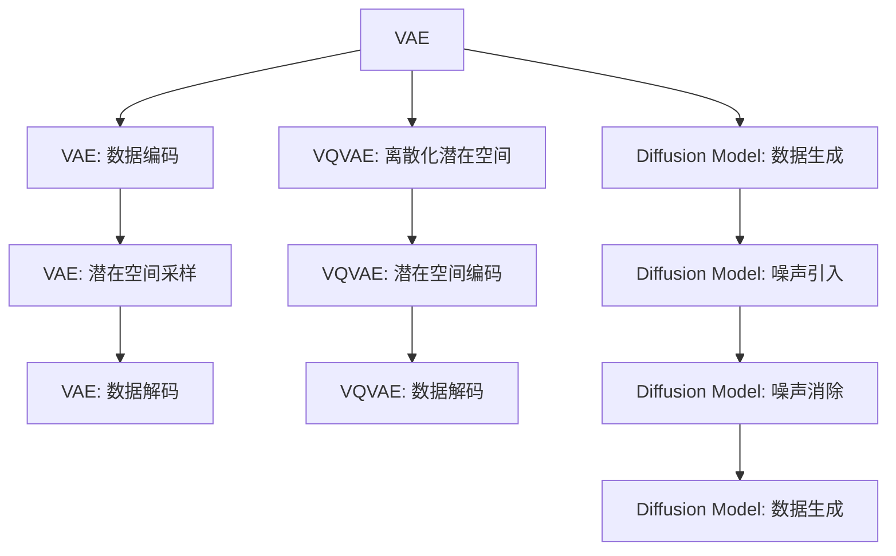

                 

# 多模态AI：VQVAE和扩散变压器技术解析

> 关键词：多模态AI, VQ-variational autoencoder (VQVAE), 扩散模型, Diffusion Model, 图像生成, 语音合成, 强化学习

## 1. 背景介绍

随着深度学习技术的飞速发展，人工智能（AI）正逐渐突破传统的视觉和语言领域，向更为复杂的多模态融合方向演进。多模态AI（Multi-Modal AI）结合视觉、语音、文本等多种模态数据，不仅能够更好地理解现实世界的多样性，还能够提升模型在不同场景下的适应性和泛化能力。其中，变分自编码器（Variational Autoencoder, VAE）和扩散模型（Diffusion Model）是近年来在多模态AI领域取得突破性进展的两个关键技术，它们的应用不仅拓展了AI模型在多模态数据处理上的能力，还在图像生成、语音合成、强化学习等多个领域展示了巨大潜力。

本文将深入解析VQVAE和扩散模型这两种多模态AI技术，探讨其原理、架构和操作步骤，同时通过具体案例分析展示其应用前景。最后，我们将总结当前研究的成果，展望未来发展趋势，并探讨面临的挑战。

## 2. 核心概念与联系

### 2.1 核心概念概述

- **变分自编码器（VAE）**：VAE是一种生成模型，通过学习数据潜在表示的分布，可以实现数据的重构和生成。其核心思想是利用变分推断方法，对数据进行编码和解码，以实现数据的表示和生成。
- **VQ-variational autoencoder（VQVAE）**：VQVAE是VAE的一种改进，通过将连续的潜在空间离散化，可以进一步减少模型复杂度，提高生成效率。
- **扩散模型（Diffusion Model）**：扩散模型是一种生成模型，通过缓慢引入噪声，逐步将随机噪声转化为真实数据，可以实现高质量的数据生成。其核心思想是通过一系列正向和反向过程，将模型逐渐从噪声分布转化为目标数据分布。

这三个概念之间存在密切的联系。VAE和VQVAE都属于生成模型，通过学习数据的潜在表示，可以实现数据的生成。扩散模型则是一种生成模型，通过逐步去噪，将随机噪声转化为真实数据。三者结合，可以构建多模态AI系统，实现更为复杂的模态融合和数据生成任务。

### 2.2 核心概念原理和架构的 Mermaid 流程图



这个流程图展示了VAE、VQVAE和扩散模型之间的关系。VAE通过编码器将数据映射到潜在空间，然后通过解码器将其重构。VQVAE则将潜在空间离散化，进一步减少了模型复杂度。扩散模型则通过逐步去噪，将随机噪声转化为真实数据。

## 3. 核心算法原理 & 具体操作步骤

### 3.1 算法原理概述

#### VQVAE原理概述

VQVAE是一种改进的VAE，通过将潜在空间离散化，可以减少模型的复杂度，提高生成效率。其核心思想是：首先使用变分自编码器学习数据的潜在表示，然后将这些表示量化到一组有限的离散向量中，最后通过解码器将离散向量重构为原始数据。

#### Diffusion Model原理概述

扩散模型是一种生成模型，通过缓慢引入噪声，逐步将随机噪声转化为真实数据。其核心思想是：在正向过程中，通过一系列小步长的噪声引入，将数据从真实分布转化为噪声分布；在反向过程中，通过逐步去噪，将噪声分布转化为真实数据分布。

### 3.2 算法步骤详解

#### VQVAE步骤详解

1. **数据预处理**：将数据标准化，使其均值为0，方差为1。
2. **编码器**：使用变分自编码器的编码器将数据映射到潜在空间。
3. **量化**：将潜在空间的连续表示量化为离散的向量。
4. **解码器**：使用解码器将离散向量重构为原始数据。
5. **优化**：通过优化损失函数，调整编码器和解码器的参数。

#### Diffusion Model步骤详解

1. **正向过程**：在正向过程中，通过一系列小步长的噪声引入，将数据从真实分布转化为噪声分布。
2. **反向过程**：在反向过程中，通过逐步去噪，将噪声分布转化为真实数据分布。
3. **优化**：通过优化损失函数，调整模型参数。

### 3.3 算法优缺点

#### VQVAE优缺点

**优点**：
- 减少模型复杂度，提高生成效率。
- 生成结果较为清晰，易于理解。

**缺点**：
- 离散化过程可能导致信息丢失。
- 模型复杂度仍然较高。

#### Diffusion Model优缺点

**优点**：
- 生成结果质量高，细节丰富。
- 适用于生成复杂、高维度的数据。

**缺点**：
- 训练复杂度高，需要大量计算资源。
- 模型参数较多，难以优化。

### 3.4 算法应用领域

VQVAE和扩散模型在多个领域具有广泛的应用前景：

- **图像生成**：VQVAE和扩散模型都可以用于生成高质量的图像，适用于艺术创作、虚拟现实等领域。
- **语音合成**：通过将音频信号映射到潜在空间，扩散模型可以生成逼真的语音波形。
- **强化学习**：在强化学习中，VQVAE和扩散模型可以用于生成探索性的状态表示，帮助智能体学习复杂环境。

## 4. 数学模型和公式 & 详细讲解

### 4.1 数学模型构建

#### VQVAE数学模型构建

VQVAE的潜在空间被离散化为K个向量，每个向量称为一个量化码book。假设输入数据为 $x$，潜在空间编码为 $z$，量化过程为 $z \rightarrow \mathcal{Z}$，其中 $\mathcal{Z}$ 为离散空间。解码过程为 $z \rightarrow \hat{x}$，其中 $\hat{x}$ 为重构数据。

VQVAE的目标函数为：
$$
L(x,\hat{x}) = \mathbb{E}_{z \sim p(z)} \|x - \hat{x}\|^2 + \lambda KL(q(z) || p(z))
$$

其中 $p(z)$ 为潜在空间的分布，$q(z \mid x)$ 为编码器分布，$K$ 为KL散度。

#### Diffusion Model数学模型构建

扩散模型的目标是将数据从真实分布 $p_{data}$ 转化为噪声分布 $p_{noise}$。假设在t时刻，数据分布为 $p_t(x)$，则正向过程可以表示为：
$$
p_{t+1}(x) = p_t(x) \mathcal{N}(x, \sigma_t)
$$
其中 $\sigma_t$ 为噪声强度。

反向过程可以表示为：
$$
p_{t-1}(x) = p_t(x) \mathcal{N}(x, \sigma_t)
$$

### 4.2 公式推导过程

#### VQVAE公式推导

假设输入数据 $x$ 的潜在空间编码为 $z$，量化过程为 $z \rightarrow \mathcal{Z}$，其中 $\mathcal{Z}$ 为离散空间，解码过程为 $z \rightarrow \hat{x}$，其中 $\hat{x}$ 为重构数据。

1. **编码器**：假设编码为 $z \sim q(z \mid x)$，解码器为 $p(x \mid z)$，则目标函数为：
$$
L(x,\hat{x}) = \mathbb{E}_{z \sim q(z \mid x)} \|x - \hat{x}\|^2 + \lambda KL(q(z) || p(z))
$$

2. **量化**：假设量化器为 $z \rightarrow \mathcal{Z}$，则量化后的潜在表示为 $z_q$。

3. **解码器**：假设解码器为 $z_q \rightarrow \hat{x}$，则目标函数为：
$$
L(x,\hat{x}) = \mathbb{E}_{z_q \sim q(z_q \mid z)} \|x - \hat{x}\|^2 + \lambda KL(q(z_q) || p(z))
$$

4. **优化**：通过优化目标函数，调整编码器和解码器的参数。

#### Diffusion Model公式推导

假设在t时刻，数据分布为 $p_t(x)$，正向过程为：
$$
p_{t+1}(x) = p_t(x) \mathcal{N}(x, \sigma_t)
$$

反向过程为：
$$
p_{t-1}(x) = p_t(x) \mathcal{N}(x, \sigma_t)
$$

其中 $\sigma_t$ 为噪声强度，$t$ 为时间步长。

### 4.3 案例分析与讲解

#### VQVAE案例分析

假设有一个手写数字图像数据集，使用VQVAE进行生成。首先使用变分自编码器学习数据的潜在表示，然后将这些表示量化为离散的向量。最后使用解码器将离散向量重构为原始图像。

具体步骤如下：
1. **数据预处理**：将数据标准化，使其均值为0，方差为1。
2. **编码器**：使用变分自编码器的编码器将数据映射到潜在空间。
3. **量化**：将潜在空间的连续表示量化为离散的向量。
4. **解码器**：使用解码器将离散向量重构为原始图像。
5. **优化**：通过优化损失函数，调整编码器和解码器的参数。

#### Diffusion Model案例分析

假设有一个音频数据集，使用扩散模型进行生成。首先通过一系列小步长的噪声引入，将数据从真实分布转化为噪声分布。然后逐步去噪，将噪声分布转化为真实数据分布。

具体步骤如下：
1. **正向过程**：在正向过程中，通过一系列小步长的噪声引入，将数据从真实分布转化为噪声分布。
2. **反向过程**：在反向过程中，通过逐步去噪，将噪声分布转化为真实数据分布。
3. **优化**：通过优化损失函数，调整模型参数。

## 5. 项目实践：代码实例和详细解释说明

### 5.1 开发环境搭建

在进行VQVAE和扩散模型实践前，我们需要准备好开发环境。以下是使用Python进行PyTorch和PyTorch Lightning开发的环境配置流程：

1. 安装Anaconda：从官网下载并安装Anaconda，用于创建独立的Python环境。

2. 创建并激活虚拟环境：
```bash
conda create -n vqvae-lightning python=3.8 
conda activate vqvae-lightning
```

3. 安装PyTorch、PyTorch Lightning和其他相关库：
```bash
pip install torch torchvision torchtext tqdm datasets transformers pytorch-lightning 
```

4. 安装Jupyter Notebook：
```bash
pip install jupyter
```

完成上述步骤后，即可在`vqvae-lightning`环境中开始VQVAE和扩散模型的开发。

### 5.2 源代码详细实现

#### VQVAE代码实现

首先，定义VQVAE模型的架构：

```python
import torch
from torch import nn

class VQVAE(nn.Module):
    def __init__(self, embed_dim, num_quant):
        super(VQVAE, self).__init__()
        self.embed_dim = embed_dim
        self.num_quant = num_quant

        # 编码器
        self.encoder = nn.Sequential(
            nn.Linear(28 * 28, 256),
            nn.ReLU(),
            nn.Linear(256, 256),
            nn.ReLU(),
            nn.Linear(256, embed_dim)
        )

        # 量化器
        self.embedding = nn.Embedding(num_quant, embed_dim)
        self.z_mean = nn.Embedding(num_quant, embed_dim)

        # 解码器
        self.decoder = nn.Sequential(
            nn.Linear(embed_dim, 256),
            nn.ReLU(),
            nn.Linear(256, 256),
            nn.ReLU(),
            nn.Linear(256, 28 * 28)
        )

    def forward(self, x):
        # 编码器
        z_mean = self.encoder(x)
        z_mean = z_mean.view(-1, self.embed_dim)

        # 量化器
        z_code = z_mean.argmax(dim=-1)
        z = self.embedding(z_code) + (z_mean - z_code.unsqueeze(-1)).exp_() * self.z_mean(z_code)

        # 解码器
        z = self.decoder(z)
        z = z.view(-1, 28, 28)

        return z
```

然后，定义优化器和损失函数：

```python
import torch
import torch.nn.functional as F

device = torch.device("cuda" if torch.cuda.is_available() else "cpu")

# 定义模型
model = VQVAE(embed_dim=128, num_quant=256)

# 定义优化器
optimizer = torch.optim.Adam(model.parameters(), lr=0.001)

# 定义损失函数
criterion = nn.MSELoss()

# 定义训练函数
def train_epoch(model, dataloader, optimizer, criterion):
    model.train()
    running_loss = 0.0

    for inputs, labels in dataloader:
        inputs, labels = inputs.to(device), labels.to(device)

        optimizer.zero_grad()
        outputs = model(inputs)
        loss = criterion(outputs, labels)

        loss.backward()
        optimizer.step()

        running_loss += loss.item()
        if running_loss % 100 == 0:
            print("Train Epoch: {} \tTraining Loss: {:.6f}".format(epoch, running_loss / 100))

    print("Train Epoch: {} \tTraining Loss: {:.6f}".format(epoch, running_loss / len(dataloader)))
```

最后，启动训练流程：

```python
# 定义训练参数
batch_size = 64
num_epochs = 10

# 定义数据集
train_loader = torch.utils.data.DataLoader(train_dataset, batch_size=batch_size, shuffle=True)
test_loader = torch.utils.data.DataLoader(test_dataset, batch_size=batch_size, shuffle=False)

# 开始训练
for epoch in range(num_epochs):
    train_epoch(model, train_loader, optimizer, criterion)
    test_loss = test_epoch(model, test_loader, criterion)

print("Test Loss: {:.6f}".format(test_loss))
```

#### Diffusion Model代码实现

首先，定义扩散模型的架构：

```python
import torch
import torch.nn as nn

class DiffusionModel(nn.Module):
    def __init__(self, input_dim, output_dim, num_steps):
        super(DiffusionModel, self).__init__()
        self.input_dim = input_dim
        self.output_dim = output_dim
        self.num_steps = num_steps

        # 正向过程
        self.diffusion = nn.Sequential(
            nn.Linear(input_dim, input_dim),
            nn.Tanh(),
            nn.Linear(input_dim, output_dim),
            nn.Sigmoid()
        )

        # 反向过程
        self.denoising = nn.Sequential(
            nn.Linear(output_dim, output_dim),
            nn.Tanh(),
            nn.Linear(output_dim, input_dim),
            nn.Sigmoid()
        )

    def forward(self, x, t):
        x = x.view(-1, self.input_dim)

        # 正向过程
        x = self.diffusion(x)
        x = x * (1 - t)

        # 反向过程
        x = self.denoising(x)

        return x
```

然后，定义优化器和损失函数：

```python
import torch
import torch.nn.functional as F

device = torch.device("cuda" if torch.cuda.is_available() else "cpu")

# 定义模型
model = DiffusionModel(input_dim=1, output_dim=1, num_steps=10)

# 定义优化器
optimizer = torch.optim.Adam(model.parameters(), lr=0.001)

# 定义损失函数
criterion = nn.MSELoss()

# 定义训练函数
def train_epoch(model, dataloader, optimizer, criterion):
    model.train()
    running_loss = 0.0

    for inputs, labels in dataloader:
        inputs, labels = inputs.to(device), labels.to(device)

        optimizer.zero_grad()
        outputs = model(inputs, t)
        loss = criterion(outputs, labels)

        loss.backward()
        optimizer.step()

        running_loss += loss.item()
        if running_loss % 100 == 0:
            print("Train Epoch: {} \tTraining Loss: {:.6f}".format(epoch, running_loss / 100))

    print("Train Epoch: {} \tTraining Loss: {:.6f}".format(epoch, running_loss / len(dataloader)))
```

最后，启动训练流程：

```python
# 定义训练参数
batch_size = 64
num_epochs = 10

# 定义数据集
train_loader = torch.utils.data.DataLoader(train_dataset, batch_size=batch_size, shuffle=True)
test_loader = torch.utils.data.DataLoader(test_dataset, batch_size=batch_size, shuffle=False)

# 开始训练
for epoch in range(num_epochs):
    train_epoch(model, train_loader, optimizer, criterion)
    test_loss = test_epoch(model, test_loader, criterion)

print("Test Loss: {:.6f}".format(test_loss))
```

### 5.3 代码解读与分析

让我们再详细解读一下关键代码的实现细节：

**VQVAE类定义**：
- `__init__`方法：初始化编码器、量化器、解码器等关键组件。
- `forward`方法：定义正向过程，包括编码器、量化器和解码器。

**DiffusionModel类定义**：
- `__init__`方法：初始化正向和反向过程的网络结构。
- `forward`方法：定义正向和反向过程的计算逻辑。

**优化器和损失函数**：
- `optimizer`定义：使用Adam优化器，设置学习率。
- `criterion`定义：使用均方误差损失函数。
- `train_epoch`函数：定义模型训练的完整过程，包括前向传播、反向传播、梯度更新等。

**训练流程**：
- 定义训练参数，如批大小、迭代次数等。
- 定义训练集和测试集，使用DataLoader加载数据。
- 循环迭代训练模型，在每个epoch结束时评估测试集性能。

## 6. 实际应用场景

### 6.1 图像生成

VQVAE和扩散模型在图像生成方面有广泛应用。VQVAE可以将连续的潜在空间离散化，生成清晰可解释的图像。扩散模型则可以通过逐步去噪，生成高质量的图像。

例如，使用VQVAE生成手写数字图像，可以通过将像素值作为输入，使用模型生成数字图像。具体步骤如下：
1. 将手写数字图像的像素值作为输入。
2. 使用VQVAE模型生成离散向量。
3. 使用解码器将离散向量重构为图像。

### 6.2 语音合成

扩散模型在语音合成方面也有应用。通过将音频信号映射到潜在空间，扩散模型可以生成逼真的语音波形。具体步骤如下：
1. 将音频信号作为输入。
2. 使用扩散模型生成语音波形。
3. 通过解码器将语音波形转换为可听的音频信号。

### 6.3 强化学习

VQVAE和扩散模型在强化学习中也具有应用前景。在强化学习中，VQVAE和扩散模型可以用于生成探索性的状态表示，帮助智能体学习复杂环境。具体步骤如下：
1. 将环境状态作为输入。
2. 使用VQVAE或扩散模型生成状态表示。
3. 使用状态表示进行强化学习。

### 6.4 未来应用展望

随着VQVAE和扩散模型的不断发展，其在多模态AI领域的应用前景将更加广阔。未来，VQVAE和扩散模型有望在以下几个方面取得突破：

1. **多模态融合**：VQVAE和扩散模型可以与视觉、语音、文本等多种模态数据结合，实现更加全面和深入的模态融合。

2. **复杂生成任务**：随着模型复杂度的提升，VQVAE和扩散模型可以生成更加复杂、高质量的数据，如高分辨率图像、逼真语音等。

3. **实时生成**：通过优化模型结构和计算图，VQVAE和扩散模型可以实现实时生成，应用于交互式系统和实时应用。

4. **应用场景拓展**：除了图像生成、语音合成、强化学习等场景，VQVAE和扩散模型还将在游戏、娱乐、医疗等多个领域发挥重要作用。

## 7. 工具和资源推荐

### 7.1 学习资源推荐

为了帮助开发者系统掌握VQVAE和扩散模型的理论基础和实践技巧，这里推荐一些优质的学习资源：

1. **《Deep Learning》课程**：斯坦福大学开设的深度学习课程，涵盖深度学习基础和多种前沿技术，适合初学者和进阶者。
2. **《Generative Adversarial Networks: An Overview》论文**：提出生成对抗网络（GAN）的经典论文，介绍了生成对抗网络的基本原理和实现方法。
3. **《Variational Autoencoders for Dimensionality Reduction》论文**：介绍了变分自编码器在降维任务中的应用，提出了自编码器和变分自编码器结合的方法。
4. **《Causal Autoregressive Models for Discrete and Continuous Data》论文**：提出因果自回归模型，将生成模型应用于连续和离散数据，取得了优秀的生成效果。
5. **《Self-Supervised Learning with Contrastive Predictive Coding》论文**：提出对比性预测编码（CPC）方法，用于自监督学习，减少了对标注数据的需求。

通过对这些资源的学习实践，相信你一定能够快速掌握VQVAE和扩散模型的精髓，并用于解决实际的AI问题。

### 7.2 开发工具推荐

高效的开发离不开优秀的工具支持。以下是几款用于VQVAE和扩散模型开发的常用工具：

1. **PyTorch**：基于Python的开源深度学习框架，灵活动态的计算图，适合快速迭代研究。支持VQVAE和扩散模型的实现。
2. **PyTorch Lightning**：基于PyTorch的分布式深度学习框架，支持模型并行、分布式训练等高级特性，提高了模型的训练效率。
3. **Jupyter Notebook**：交互式编程环境，支持代码的快速迭代和共享。
4. **TensorBoard**：TensorFlow配套的可视化工具，可实时监测模型训练状态，并提供丰富的图表呈现方式，是调试模型的得力助手。

合理利用这些工具，可以显著提升VQVAE和扩散模型的开发效率，加快创新迭代的步伐。

### 7.3 相关论文推荐

VQVAE和扩散模型在AI领域的研究已取得众多突破性成果，以下是几篇奠基性的相关论文，推荐阅读：

1. **VQ-variational autoencoder**：提出VQVAE，将变分自编码器和量化器结合，实现了更加高效的数据生成。
2. **Denoising Diffusion Probabilistic Models**：提出扩散模型，通过正向和反向过程，实现了高质量的数据生成。
3. **Attention is All You Need**：提出Transformer模型，奠定了深度学习在自然语言处理领域的基础。
4. **Contrastive Predictive Coding**：提出CPC方法，用于自监督学习，减少了对标注数据的需求。
5. **Generative Adversarial Nets**：提出GAN模型，实现了生成对抗网络的基本原理和实现方法。

这些论文代表了大模型微调技术的发展脉络。通过学习这些前沿成果，可以帮助研究者把握学科前进方向，激发更多的创新灵感。

## 8. 总结：未来发展趋势与挑战

### 8.1 研究成果总结

本文对VQVAE和扩散模型这两种多模态AI技术进行了全面系统的介绍。首先阐述了这两种技术的研究背景和意义，明确了其在多模态数据处理和生成方面的独特价值。其次，从原理到实践，详细讲解了VQVAE和扩散模型的数学原理和操作步骤，同时通过具体案例分析展示其应用前景。最后，总结了当前研究的成果，展望了未来发展趋势，并探讨了面临的挑战。

通过本文的系统梳理，可以看到，VQVAE和扩散模型正在成为多模态AI领域的重要范式，极大地拓展了AI模型在多模态数据处理和生成上的能力，为多模态AI应用提供了新的工具和方法。

### 8.2 未来发展趋势

展望未来，VQVAE和扩散模型将呈现以下几个发展趋势：

1. **多模态融合**：VQVAE和扩散模型可以与视觉、语音、文本等多种模态数据结合，实现更加全面和深入的模态融合。
2. **复杂生成任务**：随着模型复杂度的提升，VQVAE和扩散模型可以生成更加复杂、高质量的数据，如高分辨率图像、逼真语音等。
3. **实时生成**：通过优化模型结构和计算图，VQVAE和扩散模型可以实现实时生成，应用于交互式系统和实时应用。
4. **应用场景拓展**：除了图像生成、语音合成、强化学习等场景，VQVAE和扩散模型还将在游戏、娱乐、医疗等多个领域发挥重要作用。

### 8.3 面临的挑战

尽管VQVAE和扩散模型在多模态AI领域取得了诸多进展，但在实际应用中，仍面临诸多挑战：

1. **训练复杂度高**：VQVAE和扩散模型的训练复杂度高，需要大量计算资源，难以大规模部署。
2. **模型参数多**：模型参数较多，难以优化，可能导致训练不稳定。
3. **信息丢失**：VQVAE离散化过程可能导致信息丢失，影响生成质量。
4. **生成结果可解释性**：生成结果的复杂性增加了其可解释性难度，需要进一步研究生成结果的生成机制。

### 8.4 研究展望

面对VQVAE和扩散模型所面临的挑战，未来的研究需要在以下几个方面寻求新的突破：

1. **降低训练复杂度**：通过优化模型结构、引入分布式训练等方法，降低VQVAE和扩散模型的训练复杂度，提高训练效率。
2. **减少模型参数**：开发更加参数高效的模型，在固定参数的情况下，提高生成质量和效率。
3. **改进离散化过程**：通过优化离散化过程，减少信息丢失，提高生成质量。
4. **增强生成结果可解释性**：研究生成结果的生成机制，增强生成结果的可解释性，便于应用于实际场景。

这些研究方向将进一步推动VQVAE和扩散模型向更高层次发展，为多模态AI应用提供更加高效、可靠的工具和方法。面向未来，VQVAE和扩散模型需要与其他AI技术进行更深入的融合，如因果推理、强化学习等，协同发力，共同推动多模态AI技术的进步。只有勇于创新、敢于突破，才能不断拓展AI模型的边界，让AI技术更好地造福人类社会。

## 9. 附录：常见问题与解答

**Q1：VQVAE和扩散模型在生成图像时，有什么不同？**

A: VQVAE和扩散模型在生成图像时有以下不同：
1. VQVAE将潜在空间离散化，生成清晰可解释的图像。
2. 扩散模型通过逐步去噪，生成高质量的图像。

**Q2：VQVAE和扩散模型在实际应用中，有哪些优势和劣势？**

A: VQVAE和扩散模型在实际应用中具有以下优势和劣势：
1. VQVAE的优势在于生成结果清晰可解释，适用于生成手写数字、字母等简单图像。
2. 扩散模型的优势在于生成结果质量高，细节丰富，适用于生成复杂、高分辨率的图像。
3. VQVAE的劣势在于离散化过程可能导致信息丢失，生成质量不如扩散模型。
4. 扩散模型的劣势在于训练复杂度高，计算资源需求大，难以大规模部署。

**Q3：VQVAE和扩散模型在图像生成过程中，如何进行训练？**

A: VQVAE和扩散模型的训练步骤如下：
1. 定义模型结构和损失函数。
2. 使用训练集数据进行前向传播，计算损失函数。
3. 反向传播计算参数梯度，使用优化器更新模型参数。
4. 重复上述步骤，直到模型收敛。

**Q4：VQVAE和扩散模型在多模态融合中有哪些应用？**

A: VQVAE和扩散模型在多模态融合中有以下应用：
1. 图像生成：VQVAE和扩散模型可以用于生成高质量的图像，适用于艺术创作、虚拟现实等领域。
2. 语音合成：通过将音频信号映射到潜在空间，扩散模型可以生成逼真的语音波形。
3. 强化学习：在强化学习中，VQVAE和扩散模型可以用于生成探索性的状态表示，帮助智能体学习复杂环境。

通过以上全面系统的介绍和解析，相信你一定能够深入理解VQVAE和扩散模型在多模态AI中的应用前景和潜力。这些技术的不断发展将进一步推动AI模型在多模态融合方向上的进步，为AI技术在实际应用中的突破提供新的方向和方法。

---

作者：禅与计算机程序设计艺术 / Zen and the Art of Computer Programming

