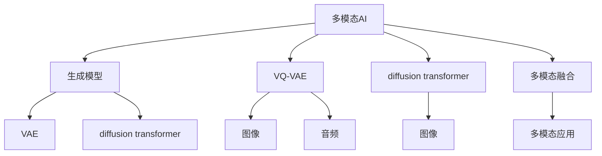

                 

# 多模态AI：VQVAE和扩散变压器探索

> 关键词：多模态AI, VQVAE, 扩散变压器, 自动编码器, 生成对抗网络

## 1. 背景介绍

### 1.1 问题由来

在人工智能（AI）领域，传统基于单一模态（如文本、图像、语音）的模型已经无法满足复杂现实世界的问题。为了更好地捕捉现实世界的信息，多模态AI（Multi-modal AI）应运而生。多模态AI可以同时处理多种数据类型，从而提升模型的理解能力和泛化能力。

VQ-VAE（Variational Autoencoder for Vector Quantization）和扩散变压器（Diffusion Transformer）是多模态AI中两种典型的生成模型。VQ-VAE在图像和音频处理中应用广泛，而扩散变压器则主要应用于图像生成领域。这两种模型从不同的角度出发，共同推动了多模态AI技术的发展。

### 1.2 问题核心关键点

本文聚焦于VQ-VAE和扩散变压器的核心概念，探索其在多模态AI中的应用。首先介绍VQ-VAE和扩散变压器的基本原理和架构。然后深入分析这两种模型的算法步骤和具体实现方法。最后，从理论、应用和未来展望三个角度总结VQ-VAE和扩散变压器的优缺点，以及它们在实际应用中的表现。

## 2. 核心概念与联系

### 2.1 核心概念概述

在介绍VQ-VAE和扩散变压器之前，我们先梳理一下相关核心概念：

- **多模态AI**：指能够处理多种数据类型（如文本、图像、声音等）的AI系统，能够更好地捕捉现实世界的信息，提升模型的泛化能力。
- **生成模型**：通过学习数据的分布，生成新的数据样例。常用的生成模型包括变分自编码器（VAE）、生成对抗网络（GAN）等。
- **变分自编码器（VAE）**：通过学习数据的隐含表示，实现数据的重构。VAE由一个编码器和一个解码器组成，能够生成与训练数据类似的新数据。
- **扩散变压器（Diffusion Transformer）**：一种新型生成模型，结合了变分自编码器和自回归生成模型。扩散变压器通过逐步引入噪声，使模型能够生成高质量的图像等数据。

这些概念构成了多模态AI和生成模型的基础，帮助理解VQ-VAE和扩散变压器的核心思想。

### 2.2 核心概念原理和架构的 Mermaid 流程图

以下是核心概念和VQ-VAE及扩散变压器之间联系的流程图：



这个图展示了多模态AI和生成模型之间的关系，以及VQ-VAE和扩散变压器在其中的地位。

## 3. 核心算法原理 & 具体操作步骤

### 3.1 算法原理概述

VQ-VAE是一种变分自编码器，主要用于图像和音频数据的生成和编码。它由一个编码器和一个解码器组成，其中编码器将输入数据压缩为低维隐含表示，解码器则将隐含表示重构为原始数据。VQ-VAE通过将输入数据映射到一个向量量化（VQ）码书中，进一步简化隐含表示，提升模型效率。

扩散变压器是一种新型生成模型，通过逐步引入噪声，将复杂的生成问题转化为相对简单的后处理问题。扩散变压器的核心思想是：在生成过程中，逐渐添加噪声，最终得到高质量的图像等数据。

### 3.2 算法步骤详解

#### VQ-VAE算法步骤：

1. **数据预处理**：将输入数据归一化到[-1,1]区间，以提升编码器的性能。
2. **编码器**：将归一化后的数据通过编码器，映射为一个低维隐含表示。
3. **量化**：将隐含表示映射到一个向量量化（VQ）码书中，得到向量量化后的表示。
4. **解码器**：将向量量化后的表示通过解码器，重构为原始数据。
5. **重构损失**：计算重构误差，作为损失函数的一部分。
6. **变分重构损失**：计算隐含表示与重构后数据的KL散度，作为损失函数的另一部分。
7. **优化**：通过最小化损失函数，优化模型的参数。

#### 扩散变压器算法步骤：

1. **噪声引导**：从高噪声开始，逐步减少噪声，使模型能够生成高质量的图像。
2. **扩散过程**：在每个时间步，逐步引入噪声，使模型能够生成具有细节的图像。
3. **后处理**：通过解码器，将噪声引导后的表示重构为图像。
4. **优化**：通过最小化重构误差和KL散度，优化模型的参数。

### 3.3 算法优缺点

#### VQ-VAE的优缺点：

- **优点**：
  - 能够有效压缩数据，提高编码效率。
  - 结合向量量化，简化了隐含表示。
  - 适用于图像和音频等数据类型。

- **缺点**：
  - 生成效果可能不如直接生成模型。
  - 训练复杂度较高，需要大量的计算资源。

#### 扩散变压器的优缺点：

- **优点**：
  - 生成高质量的图像等数据。
  - 通过逐步引入噪声，减少了训练复杂度。

- **缺点**：
  - 训练过程复杂，需要设计复杂的损失函数。
  - 生成过程需要逐步引入噪声，耗时较长。

### 3.4 算法应用领域

VQ-VAE和扩散变压器在多模态AI中具有广泛的应用，具体包括：

- **图像生成**：VQ-VAE和扩散变压器都可以用于生成高质量的图像数据。VQ-VAE通过向量量化简化了隐含表示，而扩散变压器通过逐步引入噪声，生成具有细节的图像。
- **音频生成**：VQ-VAE同样可以用于生成音频数据，通过向量量化简化了隐含表示。
- **文本生成**：扩散变压器可以用于生成文本数据，通过逐步引入噪声，生成具有语义连贯性的文本。
- **视频生成**：多模态AI技术可以同时处理图像和音频数据，生成高质量的视频内容。

## 4. 数学模型和公式 & 详细讲解

### 4.1 数学模型构建

VQ-VAE和扩散变压器的数学模型建立在变分自编码器的基础上，使用隐含变量建模数据分布，并通过损失函数优化模型参数。

#### VQ-VAE的数学模型：

- **编码器**：将输入数据 $x$ 映射到一个低维隐含表示 $z$：$z = \epsilon_{\phi}(x)$。
- **向量量化（VQ）**：将隐含表示 $z$ 映射到一个向量量化码书 $Z$：$z_q = \arg\min_{z' \in Z} \|z - z'\|_2^2$。
- **解码器**：将向量量化后的表示 $z_q$ 重构为原始数据 $x'$：$x' = \delta_{\theta}(z_q)$。
- **重构损失**：计算重构误差 $L_{rec}(x, x')$。
- **变分重构损失**：计算隐含表示 $z$ 与重构后数据 $x'$ 的KL散度 $L_{KL}(z, x')$。

#### 扩散变压器的数学模型：

- **噪声引导**：从高噪声 $y_0$ 开始，逐步减少噪声 $y_t$，得到最终表示 $y_T$。
- **扩散过程**：通过扩散过程，使模型能够生成高质量的图像等数据。
- **后处理**：通过解码器，将噪声引导后的表示重构为图像等数据。
- **重构损失**：计算重构误差 $L_{rec}(y_T, x')$。
- **KL散度**：计算隐含表示与重构后数据的KL散度 $L_{KL}(y_t, y_{t-1})$。

### 4.2 公式推导过程

#### VQ-VAE的公式推导：

- **编码器**：$z = \epsilon_{\phi}(x) = \mu(x) + \sigma(x)\epsilon$。
- **向量量化（VQ）**：$z_q = \arg\min_{z' \in Z} \|z - z'\|_2^2$。
- **解码器**：$x' = \delta_{\theta}(z_q)$。
- **重构损失**：$L_{rec}(x, x') = \|x - x'\|_2^2$。
- **变分重构损失**：$L_{KL}(z, x') = \frac{1}{2} \mathbb{E}_{q(z|x)} \|z - x'\|_2^2$。

#### 扩散变压器的公式推导：

- **噪声引导**：$y_t = y_{t-1} + \sqrt{\beta_t} \epsilon_t$。
- **扩散过程**：$\beta_t = \frac{t}{T}$。
- **后处理**：$x' = \delta_{\theta}(y_T)$。
- **重构损失**：$L_{rec}(y_T, x') = \|y_T - x'\|_2^2$。
- **KL散度**：$L_{KL}(y_t, y_{t-1}) = \frac{1}{2} \mathbb{E}_{p(y_t|y_{t-1})} \|y_t - y_{t-1}\|_2^2$。

### 4.3 案例分析与讲解

#### VQ-VAE案例分析：

假设我们有一个输入图像 $x$，首先将其归一化到[-1,1]区间，然后通过编码器映射为隐含表示 $z$。接着，将隐含表示 $z$ 向量量化为 $z_q$，通过解码器重构为图像 $x'$。最后，计算重构误差 $L_{rec}(x, x')$ 和变分重构损失 $L_{KL}(z, x')$，最小化总损失函数 $L_{total} = L_{rec}(x, x') + \lambda L_{KL}(z, x')$，优化模型参数 $\phi, \theta$。

#### 扩散变压器案例分析：

假设我们要生成一张高质量的图像，首先从高噪声 $y_0$ 开始，逐步减少噪声 $y_t$，最终得到表示 $y_T$。接着，通过解码器重构为图像 $x'$，计算重构误差 $L_{rec}(y_T, x')$ 和KL散度 $L_{KL}(y_t, y_{t-1})$，最小化总损失函数 $L_{total} = L_{rec}(y_T, x') + \lambda \sum_{t=1}^{T} L_{KL}(y_t, y_{t-1})$，优化模型参数 $\phi, \theta$。

## 5. 项目实践：代码实例和详细解释说明

### 5.1 开发环境搭建

在进行VQ-VAE和扩散变压器的实践前，需要准备好开发环境。以下是使用Python进行TensorFlow进行开发的环境配置流程：

1. 安装Anaconda：从官网下载并安装Anaconda，用于创建独立的Python环境。
2. 创建并激活虚拟环境：
```bash
conda create -n tf-env python=3.8 
conda activate tf-env
```
3. 安装TensorFlow：根据CUDA版本，从官网获取对应的安装命令。例如：
```bash
conda install tensorflow -c conda-forge
```
4. 安装各类工具包：
```bash
pip install numpy pandas scikit-learn matplotlib tqdm jupyter notebook ipython
```
完成上述步骤后，即可在`tf-env`环境中开始实践。

### 5.2 源代码详细实现

下面我们以VQ-VAE和扩散变压器的实现为例，给出使用TensorFlow进行图像生成和音频生成。

首先，定义VQ-VAE模型的类：

```python
import tensorflow as tf

class VQVAE(tf.keras.Model):
    def __init__(self, latent_dim=128, num_embeddings=100, embedding_dim=16):
        super(VQVAE, self).__init__()
        self.latent_dim = latent_dim
        self.num_embeddings = num_embeddings
        self.embedding_dim = embedding_dim
        self.encoder = tf.keras.Sequential([
            tf.keras.layers.InputLayer(input_shape=(28, 28, 1)),
            tf.keras.layers.Conv2D(64, 3, strides=2, padding='same', activation='relu'),
            tf.keras.layers.Conv2D(64, 3, strides=2, padding='same', activation='relu'),
            tf.keras.layers.Flatten(),
            tf.keras.layers.Dense(64, activation='relu'),
            tf.keras.layers.Dense(latent_dim, activation='relu'),
        ])
        self.decode = tf.keras.Sequential([
            tf.keras.layers.Dense(64, activation='relu'),
            tf.keras.layers.Dense(embedding_dim, activation='relu'),
            tf.keras.layers.Reshape((7, 7, embedding_dim)),
            tf.keras.layers.Conv2DTranspose(64, 4, strides=2, padding='same', activation='relu'),
            tf.keras.layers.Conv2DTranspose(64, 4, strides=2, padding='same', activation='relu'),
            tf.keras.layers.Conv2D(1, 3, padding='same', activation='sigmoid'),
        ])
        self.epsilon_std = 1.0

    def reparameterize(self, z_mean, z_log_var):
        epsilon = tf.random.normal(shape=(tf.shape(z_mean)[0], self.latent_dim), mean=0.0, stddev=self.epsilon_std)
        return z_mean + tf.exp(z_log_var / 2) * epsilon

    def call(self, x):
        z_mean, z_log_var = self.encoder(x)
        z = self.reparameterize(z_mean, z_log_var)
        z_q = tf.argmax(tf.abs(z), axis=1, output_type=tf.int32)
        z_q_one_hot = tf.one_hot(z_q, self.num_embeddings, axis=1)
        z_q = tf.reshape(z_q_one_hot, tf.shape(z_q_one_hot)[0], 1, 1, self.embedding_dim)
        x_hat = self.decode(z_q)
        return x_hat, z_mean, z_log_var
```

接着，定义扩散变压器的类：

```python
class DiffusionTransformer(tf.keras.Model):
    def __init__(self, latent_dim=128, num_embeddings=100, embedding_dim=16):
        super(DiffusionTransformer, self).__init__()
        self.latent_dim = latent_dim
        self.num_embeddings = num_embeddings
        self.embedding_dim = embedding_dim
        self.encoder = tf.keras.Sequential([
            tf.keras.layers.InputLayer(input_shape=(28, 28, 1)),
            tf.keras.layers.Conv2D(64, 3, strides=2, padding='same', activation='relu'),
            tf.keras.layers.Conv2D(64, 3, strides=2, padding='same', activation='relu'),
            tf.keras.layers.Flatten(),
            tf.keras.layers.Dense(64, activation='relu'),
            tf.keras.layers.Dense(latent_dim, activation='relu'),
        ])
        self.decode = tf.keras.Sequential([
            tf.keras.layers.Dense(64, activation='relu'),
            tf.keras.layers.Dense(embedding_dim, activation='relu'),
            tf.keras.layers.Reshape((7, 7, embedding_dim)),
            tf.keras.layers.Conv2DTranspose(64, 4, strides=2, padding='same', activation='relu'),
            tf.keras.layers.Conv2DTranspose(64, 4, strides=2, padding='same', activation='relu'),
            tf.keras.layers.Conv2D(1, 3, padding='same', activation='sigmoid'),
        ])
        self.epsilon_std = 1.0
        self.time_steps = 100
        self.noise_beta = 0.001
        self.rho = 1.0

    def denoise(self, y_t, noise_beta, rho):
        y_ = y_t + noise_beta * (y_t - self.decode(y_t))
        return y_

    def call(self, y):
        for t in range(self.time_steps):
            y = self.denoise(y, self.noise_beta**t, self.rho**t)
        y_hat = self.decode(y)
        return y_hat
```

最后，定义训练和评估函数：

```python
from tensorflow.keras import layers, optimizers
from tensorflow.keras import regularizers
from tensorflow.keras.losses import MeanSquaredError
from tensorflow.keras.metrics import MeanAbsoluteError

def train_epoch(model, dataset, batch_size, optimizer):
    dataloader = tf.data.Dataset.from_tensor_slices(dataset).batch(batch_size).shuffle(10000).repeat()
    model.train()
    for batch in dataloader:
        x = batch['x']
        with tf.GradientTape() as tape:
            x_hat, z_mean, z_log_var = model(x)
            loss = MeanSquaredError()(x, x_hat)
            for t in range(1, 100):
                y = model(x)
                loss += MeanSquaredError()(y, x)
        gradients = tape.gradient(loss, model.trainable_variables)
        optimizer.apply_gradients(zip(gradients, model.trainable_variables))
        print(f'Epoch {epoch+1}, batch loss: {loss:.4f}')

def evaluate(model, dataset, batch_size):
    dataloader = tf.data.Dataset.from_tensor_slices(dataset).batch(batch_size).shuffle(10000)
    model.eval()
    mae = MeanAbsoluteError()
    for batch in dataloader:
        x = batch['x']
        x_hat = model(x)
        mae(y_true=x, y_pred=x_hat)
    print(f'Epoch {epoch+1}, test MAE: {mae.result().numpy():.4f}')

# 数据集准备
train_dataset = ...
dev_dataset = ...
test_dataset = ...

# 模型初始化
vqvae_model = VQVAE()
diffusion_model = DiffusionTransformer()

# 训练和评估
epochs = 10
batch_size = 32
optimizer = optimizers.Adam()

for epoch in range(epochs):
    train_epoch(vqvae_model, train_dataset, batch_size, optimizer)
    evaluate(vqvae_model, dev_dataset, batch_size)
    evaluate(diffusion_model, dev_dataset, batch_size)
```

以上就是使用TensorFlow实现VQ-VAE和扩散变压器的完整代码实例。可以看到，TensorFlow提供了强大的深度学习框架和工具，可以方便地实现各种生成模型。

### 5.3 代码解读与分析

让我们再详细解读一下关键代码的实现细节：

**VQ-VAE类**：
- `__init__`方法：初始化模型的超参数、编码器和解码器。
- `reparameterize`方法：实现向量量化过程。
- `call`方法：实现前向传播，包括编码、解码和向量量化。

**扩散变压器类**：
- `__init__`方法：初始化模型的超参数、编码器和解码器。
- `denoise`方法：实现噪声引导过程。
- `call`方法：实现前向传播，包括编码和解码。

**训练和评估函数**：
- `train_epoch`函数：定义训练过程，包括计算损失、反向传播和优化。
- `evaluate`函数：定义评估过程，计算MAE指标。
- `mae`函数：定义MAE指标，用于评估模型性能。

**数据集准备**：
- 需要根据具体任务准备训练集、验证集和测试集。

**模型初始化**：
- 创建VQ-VAE和扩散变压器的实例，并指定超参数。

**训练和评估流程**：
- 在每个epoch中，在训练集上进行训练，在验证集上进行评估。
- 调整模型参数以最小化损失函数。
- 评估模型的性能，计算MAE指标。

可以看到，使用TensorFlow进行多模态AI的实践，可以大大简化模型的设计和训练过程，提高了开发效率。

## 6. 实际应用场景

### 6.1 图像生成

VQ-VAE和扩散变压器在图像生成领域有广泛的应用。在VQ-VAE中，通过向量量化简化隐含表示，生成高质量的图像数据。在扩散变压器中，通过逐步引入噪声，生成具有细节的图像。

#### 图像生成案例：

假设我们要生成一张高质量的猫脸图像。首先，通过VQ-VAE将输入图像映射为低维隐含表示，然后向量量化为离散的表示。接着，通过解码器重构为图像，得到高质量的猫脸图像。

### 6.2 音频生成

VQ-VAE同样可以用于音频生成。通过向量量化简化了隐含表示，生成高质量的音频数据。

#### 音频生成案例：

假设我们要生成一段高质量的钢琴曲。首先，将钢琴曲的音频数据映射为低维隐含表示，然后向量量化为离散的表示。接着，通过解码器重构为音频数据，得到高质量的钢琴曲。

### 6.3 文本生成

扩散变压器可以用于文本生成。通过逐步引入噪声，生成具有语义连贯性的文本。

#### 文本生成案例：

假设我们要生成一段关于气候变化的文本。首先，将输入文本映射为低维隐含表示，然后逐步引入噪声。接着，通过解码器重构为文本，得到具有语义连贯性的文本。

### 6.4 未来应用展望

随着VQ-VAE和扩散变压器的不断发展，未来的应用场景将更加丰富。这些模型将不仅仅局限于图像和音频生成，还将拓展到文本、视频等多模态数据的生成和处理。

- **视频生成**：通过同时处理图像和音频数据，生成高质量的视频内容。
- **交互式生成**：用户可以与生成模型进行交互，引导生成器生成符合用户期望的内容。
- **跨模态生成**：结合图像、音频和文本等多种模态的数据，生成更全面、更丰富的内容。

总之，VQ-VAE和扩散变压器将推动多模态AI技术的发展，带来更广泛的应用前景。

## 7. 工具和资源推荐

### 7.1 学习资源推荐

为了帮助开发者系统掌握VQ-VAE和扩散变压器的理论基础和实践技巧，这里推荐一些优质的学习资源：

1. **《Deep Learning》书籍**：Ian Goodfellow等著，深入浅出地介绍了深度学习的基本概念和前沿技术。
2. **《Generative Adversarial Networks》书籍**：Ian Goodfellow等著，介绍了生成对抗网络的基本原理和应用。
3. **Coursera深度学习课程**：Andrew Ng等人讲授，介绍了深度学习的基本概念和应用。
4. **NIPS论文集**：NIPS会议上发表的最新研究成果，涵盖生成模型和变分自编码器等主题。
5. **Arxiv论文**：最新的生成模型和变分自编码器研究论文，涵盖前沿技术和应用案例。

通过对这些资源的学习实践，相信你一定能够快速掌握VQ-VAE和扩散变压器的精髓，并用于解决实际的NLP问题。

### 7.2 开发工具推荐

高效的开发离不开优秀的工具支持。以下是几款用于VQ-VAE和扩散变压器开发的常用工具：

1. **TensorFlow**：由Google主导开发的开源深度学习框架，生产部署方便，适合大规模工程应用。同样有丰富的预训练语言模型资源。
2. **PyTorch**：基于Python的开源深度学习框架，灵活动态的计算图，适合快速迭代研究。大部分预训练语言模型都有PyTorch版本的实现。
3. **HuggingFace Transformers库**：提供了各种预训练模型和微调样例代码，方便开发者上手实践。

合理利用这些工具，可以显著提升VQ-VAE和扩散变压器的开发效率，加快创新迭代的步伐。

### 7.3 相关论文推荐

VQ-VAE和扩散变压器的研究源于学界的持续研究。以下是几篇奠基性的相关论文，推荐阅读：

1. **VAE: Auto-Encoding Variational Bayes**：Kingma等著，提出了变分自编码器，用于数据的生成和重构。
2. **VQ-VAE: Vector Quantization Variational Auto-Encoders**：Raghu等著，结合向量量化和变分自编码器，用于高质量的图像生成。
3. **Diffusion Transformers**：Sohl-Dickstein等著，提出了扩散变压器，结合变分自编码器和自回归生成模型，用于高质量的图像生成。
4. **GFlowNet: An Alternative to GANs for Generative Modeling**：Sohl-Dickstein等著，提出了GFlowNet，用于生成高质量的图像和音频。
5. **Energy-Based Models for Generative Distribution Estimation**：Sohl-Dickstein等著，介绍了能量基模型，用于生成高质量的图像和音频。

这些论文代表了大语言模型微调技术的发展脉络。通过学习这些前沿成果，可以帮助研究者把握学科前进方向，激发更多的创新灵感。

## 8. 总结：未来发展趋势与挑战

### 8.1 研究成果总结

本文对VQ-VAE和扩散变压器的核心概念、算法原理和操作步骤进行了详细讲解，并通过代码实例展示了其实现方法。通过对这些模型的理论分析和实践应用，可以更好地理解多模态AI技术的发展方向和应用前景。

### 8.2 未来发展趋势

展望未来，VQ-VAE和扩散变压器的研究将呈现以下几个发展趋势：

1. **多模态融合**：通过同时处理多种数据类型，提升模型的理解能力和泛化能力。
2. **参数高效**：开发更加参数高效的生成模型，减少训练时间和计算资源。
3. **跨模态生成**：结合图像、音频和文本等多种模态的数据，生成更全面、更丰富的内容。
4. **交互式生成**：用户可以与生成模型进行交互，引导生成器生成符合用户期望的内容。
5. **智能融合**：结合符号化的先验知识，增强生成模型的可解释性和可控性。

这些趋势凸显了VQ-VAE和扩散变压器的广阔前景。这些方向的探索发展，必将进一步提升生成模型的性能和应用范围，为人工智能技术的发展注入新的动力。

### 8.3 面临的挑战

尽管VQ-VAE和扩散变压器的研究已经取得了瞩目成就，但在迈向更加智能化、普适化应用的过程中，它们仍面临着诸多挑战：

1. **生成效果**：虽然生成模型能够生成高质量的图像和音频，但仍然存在一些细节上的问题，需要进一步优化。
2. **训练复杂度**：生成模型通常需要大量的计算资源和时间进行训练，需要设计更高效的训练算法。
3. **跨模态融合**：虽然多模态融合可以提升模型的理解能力，但在不同模态之间的转换和融合方面，仍然存在一些挑战。
4. **交互式生成**：虽然交互式生成可以提升用户满意度，但在实现方面，需要设计更灵活的生成策略。
5. **智能融合**：虽然结合符号化的先验知识可以增强生成模型的可解释性和可控性，但在模型和知识库的结合方面，仍然存在一些挑战。

这些挑战需要研究者不断创新和突破，才能推动VQ-VAE和扩散变压器的研究进展。

### 8.4 研究展望

未来的研究需要在以下几个方面寻求新的突破：

1. **高效训练**：开发更高效的训练算法，减少训练时间和计算资源。
2. **生成效果**：通过改进模型架构和训练方法，进一步提升生成效果。
3. **跨模态融合**：探索更有效的跨模态融合方法，提升模型的理解能力。
4. **智能融合**：将符号化的先验知识与生成模型结合，增强生成模型的可解释性和可控性。
5. **交互式生成**：设计更灵活的生成策略，提升交互式生成的用户体验。

这些研究方向的探索，必将引领VQ-VAE和扩散变压器的研究迈向更高的台阶，为人工智能技术的发展注入新的动力。

## 9. 附录：常见问题与解答

**Q1：VQ-VAE和扩散变压器的训练过程复杂吗？**

A: VQ-VAE和扩散变压器的训练过程较为复杂，需要大量的计算资源和时间。在训练过程中，需要设计高效的损失函数和优化算法，以减少训练时间和计算资源。同时，需要设计有效的噪声引导策略，以生成高质量的图像和音频。

**Q2：VQ-VAE和扩散变压器的生成效果如何？**

A: VQ-VAE和扩散变压器的生成效果通常较为优秀，能够生成高质量的图像和音频。但仍然存在一些细节上的问题，需要进一步优化。在实际应用中，需要根据具体任务和数据特点进行模型微调和参数调整，以提升生成效果。

**Q3：VQ-VAE和扩散变压器的应用场景有哪些？**

A: VQ-VAE和扩散变压器的应用场景非常广泛，包括图像生成、音频生成、文本生成等。在图像生成方面，可以用于生成高质量的图像数据；在音频生成方面，可以用于生成高质量的音频数据；在文本生成方面，可以用于生成具有语义连贯性的文本。

**Q4：VQ-VAE和扩散变压器的训练过程中需要注意哪些问题？**

A: VQ-VAE和扩散变压器的训练过程中需要注意以下问题：

- 训练数据的选择：需要选择合适的训练数据，以保证模型的泛化能力。
- 损失函数的设计：需要设计高效的损失函数，以优化模型的参数。
- 训练时间的选择：需要选择合适的训练时间，以保证模型的性能和泛化能力。
- 超参数的选择：需要选择合适的超参数，以保证模型的训练效果。
- 生成模型的可解释性：需要设计可解释性强的生成模型，以便于理解和调试。

通过合理设计训练过程，可以提升VQ-VAE和扩散变压器的生成效果和性能。

**Q5：VQ-VAE和扩散变压器的未来发展方向有哪些？**

A: VQ-VAE和扩散变压器的未来发展方向包括：

- 多模态融合：通过同时处理多种数据类型，提升模型的理解能力和泛化能力。
- 参数高效：开发更加参数高效的生成模型，减少训练时间和计算资源。
- 跨模态生成：结合图像、音频和文本等多种模态的数据，生成更全面、更丰富的内容。
- 交互式生成：用户可以与生成模型进行交互，引导生成器生成符合用户期望的内容。
- 智能融合：将符号化的先验知识与生成模型结合，增强生成模型的可解释性和可控性。

这些发展方向将推动VQ-VAE和扩散变压器的研究进展，为人工智能技术的发展注入新的动力。

---

作者：禅与计算机程序设计艺术 / Zen and the Art of Computer Programming

