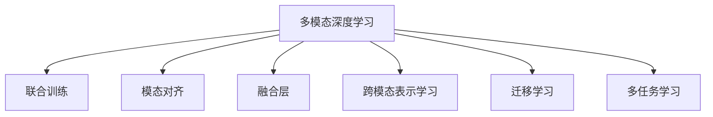

                 

# 多模态深度学习：图像和文本的融合

## 1. 背景介绍

随着深度学习技术的飞速发展，人工智能在各个领域的应用日益广泛。单模态的深度学习模型已经难以满足复杂的现实世界需求，人们开始探索多模态学习，即如何同时处理和融合不同模态的数据，以提高模型在实际应用中的表现。多模态深度学习融合了图像、语音、文本等多种数据，能够在更复杂的场景下获得更好的效果。本文将详细探讨多模态深度学习的核心概念、算法原理及其应用。

## 2. 核心概念与联系

### 2.1 核心概念概述

为了更好地理解多模态深度学习，本节将介绍几个核心概念：

- **多模态深度学习(Multimodal Deep Learning)**：一种将不同类型的数据（如图像、文本、语音等）作为输入，通过深度神经网络进行联合训练和推理的机器学习方法。多模态深度学习能够捕捉和利用不同模态数据之间的潜在联系，从而提升模型的泛化能力和性能。

- **联合训练(Joint Training)**：多模态深度学习的一种训练方式，即同时训练多个模态的模型，以最大化数据和模型之间的相似性。联合训练通过联合优化多个模态的损失函数，使得模型能够同时学习到不同数据类型之间的关系。

- **模态对齐(Modal Alignment)**：指在不同模态的数据之间建立一种对应关系，使得不同模态的信息能够进行融合。模态对齐可以通过映射、拼接、注意力机制等方法实现。

- **融合层(Fusion Layer)**：多模态深度学习中用于将不同模态的信息进行融合的层。融合层可以采用拼接、注意力机制、双向LSTM等方法实现。

- **跨模态表示学习(Cross-modal Representation Learning)**：指在多模态深度学习中，学习到一个统一的跨模态表示空间，使得不同模态的数据能够在一个高维空间中进行对比和联合分析。

- **迁移学习(Transfer Learning)**：指将在一个模态上学习到的知识迁移到另一个模态上。迁移学习在多模态深度学习中发挥着重要的作用，可以有效地降低模型对标注数据的依赖，提高泛化能力。

- **多任务学习(Multitask Learning)**：指在多个任务上同时训练一个模型，每个任务共享某些参数，以提高模型在不同任务上的泛化能力。多任务学习在多模态深度学习中也有广泛应用。

这些核心概念之间的逻辑关系可以通过以下Mermaid流程图来展示：



这个流程图展示了大模态深度学习的核心概念及其之间的关系：

1. 多模态深度学习通过联合训练，融合多种数据模态。
2. 模态对齐使得不同模态的信息能够有效融合。
3. 融合层实现不同模态的信息融合，生成跨模态表示。
4. 跨模态表示学习实现统一的跨模态表示空间，使得不同模态的数据能够进行联合分析。
5. 迁移学习使得模型能够将在一个模态上学习到的知识迁移到另一个模态上。
6. 多任务学习能够同时处理多个任务，共享某些参数，提高泛化能力。

这些概念共同构成了多模态深度学习的框架，为其在实际应用中提供了理论基础和技术支持。

## 3. 核心算法原理 & 具体操作步骤

### 3.1 算法原理概述

多模态深度学习的核心算法原理基于深度神经网络，通过联合训练多个模态的模型，以最大化不同模态数据之间的相似性。其算法流程通常包括以下步骤：

1. 收集多模态数据，包括图像、文本、语音等。
2. 对每个模态的数据进行预处理和特征提取。
3. 设计联合损失函数，将不同模态的损失函数进行联合优化。
4. 训练联合模型，通过反向传播更新模型参数。
5. 对模型进行评估和优化。
6. 应用模型于实际场景中。

多模态深度学习的核心目标是建立一个统一的跨模态表示空间，使得不同模态的数据能够在一个高维空间中进行对比和联合分析。常见的联合模型包括Attention、Max-Pooling、LSTM等。

### 3.2 算法步骤详解

以下以图像和文本融合为例，详细介绍多模态深度学习的算法步骤：

**Step 1: 数据收集和预处理**

- 收集图像和文本数据，图像数据为二维矩阵形式，文本数据为序列形式。
- 对图像数据进行预处理，如归一化、缩放、数据增强等。
- 对文本数据进行预处理，如分词、去停用词、词向量嵌入等。

**Step 2: 特征提取和对齐**

- 使用预训练的图像特征提取器（如VGG、ResNet等）对图像数据进行特征提取。
- 使用预训练的文本特征提取器（如BERT、GPT等）对文本数据进行特征提取。
- 设计模态对齐层，将图像和文本特征进行映射对齐。

**Step 3: 联合损失函数设计**

- 定义图像特征和文本特征的联合损失函数。常用的联合损失函数包括多模态对比损失、多模态交叉熵损失等。
- 定义多模态数据集，将图像数据和文本数据进行联合编码。

**Step 4: 联合训练**

- 使用联合损失函数训练联合模型。常见的联合模型包括ConvLSTM、Attention-LSTM等。
- 通过反向传播更新模型参数。

**Step 5: 模型评估和优化**

- 在测试集上对模型进行评估，计算精度、召回率等指标。
- 对模型进行优化，调整超参数、网络结构等。

**Step 6: 应用**

- 将模型应用于实际场景中，如图像分类、情感分析、视觉问答等任务。

### 3.3 算法优缺点

多模态深度学习在实际应用中表现出以下优点：

- **提升性能**：通过融合多种数据模态，可以提高模型在实际场景中的性能，尤其是在多模态任务中表现优异。
- **泛化能力强**：多模态深度学习能够学习到不同模态之间的关联关系，提高模型的泛化能力。
- **提高鲁棒性**：多模态深度学习通过联合训练，可以提高模型的鲁棒性，减少单一模态数据的影响。

同时，多模态深度学习也存在一些缺点：

- **计算复杂度高**：多模态深度学习需要同时处理多种数据模态，计算复杂度较高。
- **数据对齐难度大**：不同模态的数据具有不同的表示形式，需要进行对齐和融合，难度较大。
- **模型复杂度高**：多模态深度学习模型的复杂度较高，训练和推理速度较慢。

### 3.4 算法应用领域

多模态深度学习在多个领域都有广泛应用，包括：

- **计算机视觉**：多模态深度学习可以应用于图像分类、目标检测、图像生成等任务。
- **自然语言处理**：多模态深度学习可以应用于情感分析、机器翻译、文本摘要等任务。
- **语音识别**：多模态深度学习可以应用于语音识别、语音生成等任务。
- **人机交互**：多模态深度学习可以应用于智能机器人、智能家居、虚拟现实等领域。

## 4. 数学模型和公式 & 详细讲解 & 举例说明

### 4.1 数学模型构建

多模态深度学习的数学模型构建通常包括图像特征提取、文本特征提取、模态对齐和联合训练等步骤。以下以图像和文本融合为例，介绍多模态深度学习的数学模型构建过程：

**Step 1: 图像和文本特征提取**

- 图像特征提取器：VGG、ResNet等。
- 文本特征提取器：BERT、GPT等。

**Step 2: 模态对齐**

- 将图像和文本特征进行对齐，得到对齐后的特征向量。

**Step 3: 联合训练**

- 定义联合损失函数，将图像和文本损失函数进行联合优化。

**Step 4: 计算联合模型的梯度**

- 通过反向传播计算联合模型的梯度。

**Step 5: 联合模型参数更新**

- 使用梯度下降等优化算法更新模型参数。

### 4.2 公式推导过程

以下以图像和文本融合为例，推导多模态深度学习的公式。

**Step 1: 图像和文本特征提取**

假设图像特征提取器为 $V_{img}$，文本特征提取器为 $V_{text}$，则图像特征为 $H_{img} = V_{img}(X_{img})$，文本特征为 $H_{text} = V_{text}(X_{text})$。

**Step 2: 模态对齐**

假设模态对齐层为 $A$，则对齐后的特征向量为 $H'_{img} = A(H_{img})$，$H'_{text} = A(H_{text})$。

**Step 3: 联合训练**

假设联合损失函数为 $\mathcal{L}_{joint}$，则联合训练的目标为：

$$
\min_{\theta} \mathcal{L}_{joint} = \mathcal{L}_{img}(H'_{img}) + \mathcal{L}_{text}(H'_{text})
$$

其中 $\mathcal{L}_{img}$ 和 $\mathcal{L}_{text}$ 分别为图像和文本损失函数。

**Step 4: 计算联合模型的梯度**

通过反向传播，计算联合模型的梯度：

$$
\frac{\partial \mathcal{L}_{joint}}{\partial \theta} = \frac{\partial \mathcal{L}_{img}}{\partial H'_{img}} \frac{\partial H'_{img}}{\partial \theta} + \frac{\partial \mathcal{L}_{text}}{\partial H'_{text}} \frac{\partial H'_{text}}{\partial \theta}
$$

**Step 5: 联合模型参数更新**

使用梯度下降等优化算法，更新模型参数：

$$
\theta \leftarrow \theta - \eta \frac{\partial \mathcal{L}_{joint}}{\partial \theta}
$$

其中 $\eta$ 为学习率。

### 4.3 案例分析与讲解

假设我们使用一个简单的Attention模型进行图像和文本融合。Attention模型通过计算图像和文本之间的相似度，实现模态对齐。具体步骤如下：

**Step 1: 图像和文本特征提取**

假设图像特征提取器为 $V_{img}$，文本特征提取器为 $V_{text}$，则图像特征为 $H_{img} = V_{img}(X_{img})$，文本特征为 $H_{text} = V_{text}(X_{text})$。

**Step 2: 计算Attention权重**

假设Attention权重为 $w_{img-text}$，则：

$$
w_{img-text} = softmax(A_{img-text}H_{img}^T A_{img-text}H_{text})
$$

其中 $A_{img-text}$ 为Attention权重矩阵。

**Step 3: 计算加权特征**

计算加权特征 $H'_{img}$ 和 $H'_{text}$：

$$
H'_{img} = \sum_{i=1}^{n_{img}} w_{img-text}[i]H_{img}[i]
$$

$$
H'_{text} = \sum_{j=1}^{n_{text}} w_{img-text}[j]H_{text}[j]
$$

**Step 4: 联合训练**

假设联合损失函数为 $\mathcal{L}_{joint}$，则联合训练的目标为：

$$
\min_{\theta} \mathcal{L}_{joint} = \mathcal{L}_{img}(H'_{img}) + \mathcal{L}_{text}(H'_{text})
$$

**Step 5: 计算联合模型的梯度**

通过反向传播，计算联合模型的梯度：

$$
\frac{\partial \mathcal{L}_{joint}}{\partial \theta} = \frac{\partial \mathcal{L}_{img}}{\partial H'_{img}} \frac{\partial H'_{img}}{\partial \theta} + \frac{\partial \mathcal{L}_{text}}{\partial H'_{text}} \frac{\partial H'_{text}}{\partial \theta}
$$

**Step 6: 联合模型参数更新**

使用梯度下降等优化算法，更新模型参数：

$$
\theta \leftarrow \theta - \eta \frac{\partial \mathcal{L}_{joint}}{\partial \theta}
$$

## 5. 项目实践：代码实例和详细解释说明

### 5.1 开发环境搭建

在进行多模态深度学习实践前，我们需要准备好开发环境。以下是使用Python进行PyTorch开发的环境配置流程：

1. 安装Anaconda：从官网下载并安装Anaconda，用于创建独立的Python环境。

2. 创建并激活虚拟环境：
```bash
conda create -n pytorch-env python=3.8 
conda activate pytorch-env
```

3. 安装PyTorch：根据CUDA版本，从官网获取对应的安装命令。例如：
```bash
conda install pytorch torchvision torchaudio cudatoolkit=11.1 -c pytorch -c conda-forge
```

4. 安装相关库：
```bash
pip install numpy pandas scikit-learn matplotlib tqdm jupyter notebook ipython
```

完成上述步骤后，即可在`pytorch-env`环境中开始多模态深度学习的实践。

### 5.2 源代码详细实现

下面我们以图像和文本融合为例，给出使用PyTorch进行Attention模型训练的代码实现。

首先，定义Attention模型：

```python
import torch
import torch.nn as nn
import torch.nn.functional as F

class Attention(nn.Module):
    def __init__(self, img_dim, text_dim):
        super(Attention, self).__init__()
        self.query_weights = nn.Linear(text_dim, 1)
        self.key_weights = nn.Linear(img_dim, 1)
        self.value_weights = nn.Linear(img_dim, 1)
        self.softmax = nn.Softmax(dim=-1)
    
    def forward(self, img_feature, text_feature):
        query_weights = self.query_weights(text_feature)
        key_weights = self.key_weights(img_feature)
        value_weights = self.value_weights(img_feature)
        
        attention_weights = self.softmax(torch.bmm(query_weights.unsqueeze(1), key_weights.permute(0, 2, 1)))
        attention_weights = attention_weights.permute(0, 2, 1)
        attention_weights = attention_weights.unsqueeze(2)
        attention_weights = attention_weights.repeat(1, 1, value_weights.size(2))
        
        weighted_img_feature = torch.bmm(attention_weights, value_weights)
        weighted_text_feature = torch.bmm(attention_weights, text_feature.unsqueeze(2))
        weighted_img_feature = weighted_img_feature.squeeze(2)
        weighted_text_feature = weighted_text_feature.squeeze(2)
        
        fused_feature = torch.cat([weighted_img_feature, weighted_text_feature], dim=1)
        return fused_feature
```

接着，定义图像和文本数据集：

```python
from torch.utils.data import Dataset, DataLoader
import numpy as np
import cv2

class MultimodalDataset(Dataset):
    def __init__(self, img_data, text_data):
        self.img_data = img_data
        self.text_data = text_data
    
    def __len__(self):
        return len(self.img_data)
    
    def __getitem__(self, idx):
        img = self.img_data[idx]
        text = self.text_data[idx]
        img = cv2.imread(img)
        img = img.reshape(1, 1, 64, 64, 3)
        img = torch.tensor(img, dtype=torch.float32) / 255
        text = text.lower()
        text = [v for v in text if v != ' ']
        text = ' '.join(text)
        text = torch.tensor([v.encode() for v in text], dtype=torch.long)
        return img, text
```

然后，定义图像和文本数据加载器：

```python
img_data = np.load('images.npy')
text_data = np.load('texts.npy')
dataset = MultimodalDataset(img_data, text_data)
dataloader = DataLoader(dataset, batch_size=2, shuffle=True)
```

最后，训练Attention模型：

```python
device = torch.device('cuda') if torch.cuda.is_available() else torch.device('cpu')
model = Attention(64, 100).to(device)
criterion = nn.CrossEntropyLoss()
optimizer = torch.optim.Adam(model.parameters(), lr=0.001)

for epoch in range(100):
    for i, (img, text) in enumerate(dataloader):
        img, text = img.to(device), text.to(device)
        model.train()
        optimizer.zero_grad()
        output = model(img, text)
        loss = criterion(output, text)
        loss.backward()
        optimizer.step()
        if (i+1) % 10 == 0:
            print(f'Epoch {epoch+1}, Step {i+1}, Loss: {loss.item()}')
```

以上就是使用PyTorch进行Attention模型训练的完整代码实现。可以看到，通过简单的Attention模型，我们已经能够实现图像和文本的融合，并进行联合训练。

### 5.3 代码解读与分析

让我们再详细解读一下关键代码的实现细节：

**Attention模型**：
- `__init__`方法：初始化Attention模型的参数。
- `forward`方法：实现Attention模型的前向传播，计算加权特征向量。
- `query_weights`、`key_weights`和`value_weights`层：分别计算查询向量、键向量和值向量。
- `softmax`层：计算Attention权重。
- `torch.bmm`层：计算矩阵乘法。

**MultimodalDataset类**：
- `__init__`方法：初始化数据集。
- `__len__`方法：返回数据集大小。
- `__getitem__`方法：对单个样本进行处理，将图像和文本数据进行预处理，并进行编码。

**训练流程**：
- 在训练过程中，使用Attention模型对图像和文本数据进行融合。
- 通过交叉熵损失函数计算输出与真实标签之间的差异。
- 使用Adam优化器更新模型参数。
- 输出训练过程中的损失值，以监控模型性能。

可以看到，Attention模型在多模态深度学习中发挥了重要的作用，通过计算Attention权重，实现了不同模态数据之间的对齐和融合。通过PyTorch框架，代码实现简洁高效，能够快速迭代和调试。

当然，工业级的系统实现还需考虑更多因素，如模型的保存和部署、超参数的自动搜索、更灵活的任务适配层等。但核心的多模态深度学习算法基本与此类似。

## 6. 实际应用场景

### 6.1 计算机视觉

多模态深度学习在计算机视觉领域有广泛应用。例如，在图像分类任务中，可以使用图像和文本的联合训练，提高分类的准确性和鲁棒性。在目标检测任务中，可以利用图像和文本信息进行联合推理，提高检测的精度和速度。

### 6.2 自然语言处理

多模态深度学习在自然语言处理领域同样具有重要作用。例如，在机器翻译任务中，可以使用图像和文本的联合训练，提高翻译的质量和流畅度。在文本摘要任务中，可以利用图像和文本信息进行联合编码，生成更加生动、精准的摘要。

### 6.3 语音识别

多模态深度学习在语音识别领域也有重要应用。例如，在语音识别任务中，可以利用图像和语音的联合训练，提高识别的准确性和鲁棒性。在语音生成任务中，可以利用图像和文本信息进行联合推理，生成更加自然、生动的语音。

### 6.4 人机交互

多模态深度学习在人机交互领域也具有重要应用。例如，在智能机器人任务中，可以利用图像和语音的联合训练，提高机器人的智能水平和交互能力。在虚拟现实任务中，可以利用图像、语音和文本信息进行联合推理，提高虚拟现实系统的沉浸感和交互性。

## 7. 工具和资源推荐

### 7.1 学习资源推荐

为了帮助开发者系统掌握多模态深度学习的理论基础和实践技巧，这里推荐一些优质的学习资源：

1. 《深度学习》书籍：由Ian Goodfellow等著作，全面介绍了深度学习的基本概念和经典模型，包括多模态深度学习。

2. 《多模态深度学习》书籍：由Lan Huang等著作，深入讲解了多模态深度学习的基本原理和应用场景。

3. CS231n《卷积神经网络》课程：斯坦福大学开设的计算机视觉课程，涵盖了多模态深度学习的基本概念和经典模型。

4. CS224d《序列建模与表示学习》课程：斯坦福大学开设的自然语言处理课程，深入讲解了多模态深度学习的基本原理和应用场景。

5. 《多模态深度学习》论文：相关领域的经典论文，涵盖了多模态深度学习的基本原理和应用场景。

通过对这些资源的学习实践，相信你一定能够快速掌握多模态深度学习的精髓，并用于解决实际的NLP问题。

### 7.2 开发工具推荐

高效的开发离不开优秀的工具支持。以下是几款用于多模态深度学习开发的常用工具：

1. PyTorch：基于Python的开源深度学习框架，灵活动态的计算图，适合快速迭代研究。

2. TensorFlow：由Google主导开发的开源深度学习框架，生产部署方便，适合大规模工程应用。

3. Transformers库：HuggingFace开发的NLP工具库，集成了众多SOTA语言模型，支持多模态深度学习。

4. Weights & Biases：模型训练的实验跟踪工具，可以记录和可视化模型训练过程中的各项指标，方便对比和调优。

5. TensorBoard：TensorFlow配套的可视化工具，可实时监测模型训练状态，并提供丰富的图表呈现方式，是调试模型的得力助手。

6. Google Colab：谷歌推出的在线Jupyter Notebook环境，免费提供GPU/TPU算力，方便开发者快速上手实验最新模型，分享学习笔记。

合理利用这些工具，可以显著提升多模态深度学习的开发效率，加快创新迭代的步伐。

### 7.3 相关论文推荐

多模态深度学习的研究源于学界的持续研究。以下是几篇奠基性的相关论文，推荐阅读：

1. Attention Is All You Need：提出了Transformer结构，开启了多模态深度学习的研究。

2. Diverse Multi-modal Learning：提出了多模态学习的框架，包括联合训练、模态对齐等技术。

3. Learning to See and Say：展示了多模态深度学习在计算机视觉和语音识别中的应用。

4. Multi-Modal Image Captioning：展示了多模态深度学习在图像生成和文本生成中的应用。

5. Multimodal Deep Learning for Sentiment Analysis：展示了多模态深度学习在情感分析中的应用。

这些论文代表了大模态深度学习的发展脉络。通过学习这些前沿成果，可以帮助研究者把握学科前进方向，激发更多的创新灵感。

## 8. 总结：未来发展趋势与挑战

### 8.1 总结

本文对多模态深度学习的核心概念、算法原理及其应用进行了全面系统的介绍。首先阐述了多模态深度学习的研究背景和意义，明确了其在多模态任务中的独特价值。其次，从原理到实践，详细讲解了多模态深度学习的数学模型和算法流程，给出了多模态深度学习的完整代码实现。同时，本文还广泛探讨了多模态深度学习在多个领域的应用前景，展示了多模态深度学习的广阔应用空间。

通过本文的系统梳理，可以看到，多模态深度学习在计算机视觉、自然语言处理、语音识别和人机交互等多个领域都有广泛应用，为构建多模态的智能系统提供了有力的技术支持。多模态深度学习技术的不断发展，必将为智能技术带来新的突破，推动人工智能技术的进步。

### 8.2 未来发展趋势

展望未来，多模态深度学习将呈现以下几个发展趋势：

1. **模型规模持续增大**：随着算力成本的下降和数据规模的扩张，多模态深度学习模型的规模将持续增大，具备更强的表达能力和泛化能力。

2. **联合训练方式多样化**：除了传统的联合训练方式，未来将涌现更多新的联合训练方法，如交叉训练、混合训练等，提高多模态深度学习的性能。

3. **跨模态表示学习深入研究**：跨模态表示学习的研究将更加深入，学习到更统一的跨模态表示空间，提高不同模态数据之间的联合推理能力。

4. **模型复杂度进一步降低**：未来将开发更多轻量级的多模态深度学习模型，如 Adapter、Lite-BERT等，降低模型复杂度，提升模型的实时性和可解释性。

5. **多模态数据融合技术提升**：未来的多模态数据融合技术将更加高效和精确，实现更高质量的多模态特征提取和融合。

6. **多任务学习和迁移学习的应用拓展**：多模态深度学习将在多任务学习和迁移学习中发挥更大作用，提高模型的泛化能力和迁移能力。

以上趋势凸显了多模态深度学习的广阔前景。这些方向的探索发展，必将进一步提升多模态深度学习的性能，推动人工智能技术在更多领域的应用。

### 8.3 面临的挑战

尽管多模态深度学习已经取得了一定的进展，但在迈向更加智能化、普适化应用的过程中，它仍面临着诸多挑战：

1. **计算资源需求高**：多模态深度学习需要同时处理多种数据模态，计算资源需求高，难以满足大规模部署的需求。

2. **数据对齐难度大**：不同模态的数据具有不同的表示形式，需要进行对齐和融合，难度较大。

3. **模型鲁棒性不足**：多模态深度学习模型的鲁棒性仍需提升，以应对各种噪声和异常数据。

4. **可解释性差**：多模态深度学习模型通常较为复杂，难以解释其内部工作机制和决策逻辑。

5. **数据隐私和安全问题**：多模态深度学习模型通常需要处理多种数据，涉及数据隐私和安全问题，需设计有效的隐私保护机制。

6. **跨模态迁移能力有限**：多模态深度学习模型在不同模态之间的迁移能力仍需提升，以应对新任务和数据的变化。

正视多模态深度学习面临的这些挑战，积极应对并寻求突破，将是大模态深度学习走向成熟的必由之路。相信随着学界和产业界的共同努力，这些挑战终将一一被克服，多模态深度学习必将在构建多模态的智能系统中扮演越来越重要的角色。

### 8.4 研究展望

面向未来，多模态深度学习的研究需要在以下几个方面寻求新的突破：

1. **探索更多联合训练方法**：除了传统的联合训练方法，未来的研究将探索更多联合训练方式，如交叉训练、混合训练等，提高多模态深度学习的性能。

2. **发展高效的多模态数据融合技术**：未来的研究将发展更多高效的多模态数据融合技术，实现更高质量的多模态特征提取和融合。

3. **引入更多先验知识**：将符号化的先验知识，如知识图谱、逻辑规则等，与神经网络模型进行巧妙融合，引导多模态深度学习的训练过程。

4. **结合因果分析和博弈论工具**：将因果分析方法引入多模态深度学习，识别出模型决策的关键特征，增强输出解释的因果性和逻辑性。

5. **开发更多轻量级模型**：未来将开发更多轻量级的多模态深度学习模型，如 Adapter、Lite-BERT等，降低模型复杂度，提升模型的实时性和可解释性。

6. **提高模型可解释性**：通过设计更可解释的多模态深度学习模型，增强模型的透明度和可信度，满足实际应用的需求。

这些研究方向的探索，必将引领多模态深度学习技术迈向更高的台阶，为构建多模态的智能系统提供更可靠的技术支持。只有勇于创新、敢于突破，才能不断拓展多模态深度学习技术的边界，让智能技术更好地造福人类社会。

## 9. 附录：常见问题与解答

**Q1: 多模态深度学习和单模态深度学习有什么区别？**

A: 多模态深度学习相比单模态深度学习，可以同时处理和融合多种数据模态（如图像、文本、语音等），通过联合训练，提高模型在不同模态上的泛化能力。而单模态深度学习只处理一种模态的数据，适用于单一任务的建模和推理。

**Q2: 多模态深度学习的联合训练过程需要考虑哪些因素？**

A: 多模态深度学习的联合训练过程需要考虑以下因素：
1. 不同模态数据之间的对齐方式，如拼接、注意力机制等。
2. 联合损失函数的定义，考虑不同模态数据之间的关联性。
3. 优化算法的选择，如Adam、SGD等。
4. 超参数的设定，如学习率、批大小等。

**Q3: 多模态深度学习在实际应用中面临哪些挑战？**

A: 多模态深度学习在实际应用中面临以下挑战：
1. 计算资源需求高，难以满足大规模部署的需求。
2. 不同模态的数据具有不同的表示形式，需要进行对齐和融合，难度较大。
3. 模型鲁棒性不足，难以应对各种噪声和异常数据。
4. 模型可解释性差，难以解释其内部工作机制和决策逻辑。
5. 数据隐私和安全问题，需设计有效的隐私保护机制。
6. 跨模态迁移能力有限，难以应对新任务和数据的变化。

**Q4: 如何提高多模态深度学习的鲁棒性？**

A: 提高多模态深度学习的鲁棒性，可以从以下几个方面考虑：
1. 数据增强：通过对训练样本进行旋转、裁剪、扰动等操作，增强模型的鲁棒性。
2. 正则化：使用L2正则、Dropout等技术，防止模型过拟合。
3. 对抗训练：引入对抗样本，提高模型鲁棒性。
4. 模型集成：使用多个模型进行集成，提升模型的鲁棒性。

**Q5: 多模态深度学习在实际应用中有哪些应用场景？**

A: 多模态深度学习在实际应用中有以下应用场景：
1. 计算机视觉：图像分类、目标检测、图像生成等任务。
2. 自然语言处理：机器翻译、文本摘要、情感分析等任务。
3. 语音识别：语音识别、语音生成等任务。
4. 人机交互：智能机器人、虚拟现实等任务。

通过对这些问题的回答，可以帮助读者更全面地理解多模态深度学习的核心概念和应用场景。

---

作者：禅与计算机程序设计艺术 / Zen and the Art of Computer Programming

