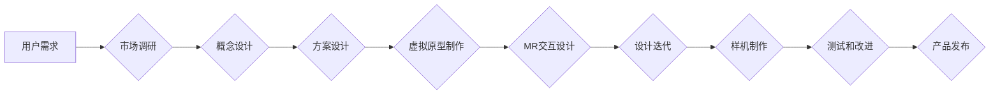

                 

## MR在工业设计中的应用：虚实结合的创新

> 关键词：增强现实 (AR)、混合现实 (MR)、工业设计、虚拟原型、协作设计、用户体验、3D建模、交互设计

## 1. 背景介绍

工业设计作为产品开发的重要环节，一直致力于创造出既美观又功能强大的产品。传统的工业设计流程通常依赖于二维图纸和物理模型，这导致设计迭代周期长、成本高、沟通效率低。随着增强现实 (AR) 和混合现实 (MR) 技术的快速发展，MR在工业设计领域展现出巨大的潜力，为设计流程带来了革命性的变革。

MR技术融合了虚拟现实 (VR) 和增强现实 (AR) 的优势，能够将虚拟物体叠加到现实世界中，创造出一种沉浸式的交互体验。在工业设计领域，MR可以帮助设计师：

* **创建逼真的虚拟原型：**设计师可以利用MR技术构建三维虚拟模型，并将其置于现实环境中进行观察和交互，从而更直观地了解产品的形态、尺寸和功能。
* **加速设计迭代：**MR技术可以简化设计修改过程，设计师可以实时修改虚拟模型，并观察其在现实环境中的效果，从而缩短设计迭代周期。
* **提升设计协作：**MR技术可以实现多位设计师在同一个虚拟环境中协同设计，共享设计成果，并进行实时沟通，从而提高设计协作效率。
* **增强用户体验：**MR技术可以帮助设计师更好地理解用户的需求，并设计出更符合用户体验的产品。

## 2. 核心概念与联系

### 2.1 增强现实 (AR)

AR技术是指在现实世界中叠加虚拟信息，增强用户对现实世界的感知。AR系统通常通过摄像头、传感器和计算机视觉算法捕捉现实环境信息，并根据用户的位置和动作，将虚拟物体叠加到现实场景中。

### 2.2 混合现实 (MR)

MR技术是AR和VR技术的融合，它将虚拟物体与现实世界融合，创造出一种沉浸式的交互体验。MR系统通常利用头戴设备、手部追踪器和其他传感器，捕捉用户的位置、动作和周围环境信息，并根据这些信息，将虚拟物体与现实世界实时交互。

### 2.3 工业设计

工业设计是指以用户需求为中心，通过设计和创新，创造出美观、功能强大、易于生产和使用的产品。工业设计流程通常包括市场调研、概念设计、方案设计、样机制作、测试和改进等阶段。

### 2.4 MR在工业设计中的应用

MR技术可以将虚拟原型、设计工具和协作平台集成到工业设计流程中，从而提升设计效率、降低成本、增强用户体验。

**Mermaid 流程图**



## 3. 核心算法原理 & 具体操作步骤

### 3.1 算法原理概述

MR在工业设计中的应用主要依赖于以下核心算法：

* **计算机视觉算法：**用于捕捉现实环境信息，识别物体、跟踪用户动作等。
* **三维建模算法：**用于创建虚拟模型，并将其与现实环境进行融合。
* **渲染算法：**用于将虚拟模型渲染到现实场景中，并实现逼真的视觉效果。
* **交互算法：**用于处理用户与虚拟模型的交互，例如手势识别、语音控制等。

### 3.2 算法步骤详解

1. **环境捕捉：**利用摄像头、传感器等设备捕捉现实环境信息，并将其转换为三维点云数据。
2. **物体识别：**利用计算机视觉算法识别现实环境中的物体，并将其标记。
3. **虚拟模型创建：**利用三维建模软件创建虚拟模型，并将其与现实环境中的物体进行关联。
4. **虚拟模型渲染：**利用渲染算法将虚拟模型渲染到现实场景中，并实现逼真的视觉效果。
5. **交互处理：**利用交互算法处理用户与虚拟模型的交互，例如手势识别、语音控制等。

### 3.3 算法优缺点

**优点：**

* 能够创造出逼真的虚拟体验，增强用户感知。
* 可以加速设计迭代，降低设计成本。
* 可以提升设计协作效率，促进团队合作。

**缺点：**

* MR技术目前仍处于发展阶段，成本较高。
* 需要专业的硬件设备和软件支持。
* 虚拟模型的渲染效果仍存在一定的局限性。

### 3.4 算法应用领域

MR技术在工业设计领域有着广泛的应用，例如：

* **产品设计：**设计师可以使用MR技术创建虚拟原型，并将其置于现实环境中进行观察和交互，从而更直观地了解产品的形态、尺寸和功能。
* **模具设计：**MR技术可以帮助设计师虚拟化模具设计，并进行模拟测试，从而提高模具设计效率和精度。
* **装配设计：**MR技术可以帮助设计师虚拟化产品装配过程，并进行模拟测试，从而提高装配效率和准确性。
* **用户体验设计：**MR技术可以帮助设计师更好地理解用户的需求，并设计出更符合用户体验的产品。

## 4. 数学模型和公式 & 详细讲解 & 举例说明

### 4.1 数学模型构建

MR技术涉及到多个数学模型，例如：

* **三维空间坐标系：**用于描述虚拟物体的位置和姿态。
* **投影变换：**用于将三维虚拟物体投影到二维显示屏上。
* **光线追踪：**用于模拟光线在虚拟场景中的传播，实现逼真的光影效果。
* **深度感知：**用于估计虚拟物体与现实场景之间的距离。

### 4.2 公式推导过程

以下是一个简单的投影变换公式推导过程：

假设一个三维空间点 $P(x, y, z)$，需要将其投影到二维平面 $xy$ 上。投影变换矩阵为：

$$
\mathbf{P} = \begin{bmatrix}
1 & 0 & 0 & 0 \\
0 & 1 & 0 & 0 \\
0 & 0 & 0 & 1
\end{bmatrix}
$$

则投影后的二维坐标为：

$$
\mathbf{P'} = \mathbf{P} \cdot \begin{bmatrix}
x \\
y \\
z \\
1
\end{bmatrix} = \begin{bmatrix}
x \\
y \\
1
\end{bmatrix}
$$

### 4.3 案例分析与讲解

例如，在MR设计中，设计师需要将虚拟汽车模型置于现实车库中进行展示。需要利用投影变换将虚拟汽车模型的三维坐标转换为二维坐标，并将其渲染到车库的显示屏上。

## 5. 项目实践：代码实例和详细解释说明

### 5.1 开发环境搭建

MR项目开发环境通常包括：

* **硬件设备：**例如MR头戴设备、手部追踪器等。
* **软件平台：**例如Unity、Unreal Engine等。
* **开发工具：**例如C#、C++等编程语言。

### 5.2 源代码详细实现

以下是一个简单的MR虚拟原型代码示例，使用Unity引擎实现：

```csharp
using UnityEngine;
using UnityEngine.XR;

public class VirtualPrototype : MonoBehaviour
{
    public GameObject virtualModel; // 虚拟模型物体

    void Start()
    {
        // 获取输入设备
        InputDevice device = InputDevices.GetDeviceAtXRNode(XRNode.CenterEye);

        // 订阅设备事件
        device.features.SetFeatureValue(CommonUsages.primary2DAxis, new Vector2(0, 0));
        device.features.SetFeatureValue(CommonUsages.primaryButton, false);
    }

    void Update()
    {
        // 获取设备输入
        InputDevice device = InputDevices.GetDeviceAtXRNode(XRNode.CenterEye);
        device.features.GetFeatureValue(CommonUsages.primary2DAxis, out Vector2 axis);

        // 移动虚拟模型
        transform.position += axis * Time.deltaTime * 5;
    }
}
```

### 5.3 代码解读与分析

* 该代码定义了一个名为`VirtualPrototype`的脚本，用于控制虚拟模型的移动。
* `virtualModel`变量存储虚拟模型物体引用。
* `Start()`方法获取输入设备并订阅设备事件。
* `Update()`方法获取设备输入，并根据输入值移动虚拟模型。

### 5.4 运行结果展示

运行该代码后，用户可以通过手势控制虚拟模型的移动。

## 6. 实际应用场景

### 6.1 汽车设计

汽车设计师可以使用MR技术创建虚拟汽车模型，并将其置于现实环境中进行观察和交互，从而更直观地了解产品的形态、尺寸和功能。

### 6.2 家具设计

家具设计师可以使用MR技术创建虚拟家具模型，并将其置于现实家居环境中进行展示，从而更直观地了解产品的尺寸、风格和功能。

### 6.3 建筑设计

建筑设计师可以使用MR技术创建虚拟建筑模型，并将其置于现实环境中进行展示，从而更直观地了解建筑的规模、结构和功能。

### 6.4 未来应用展望

MR技术在工业设计领域的应用前景广阔，未来可能在以下方面得到进一步发展：

* **更逼真的虚拟体验：**随着硬件设备和软件技术的进步，MR虚拟体验将更加逼真，能够更准确地模拟现实世界。
* **更强大的交互功能：**MR交互功能将更加丰富，用户能够更自然地与虚拟模型进行交互，例如手势识别、语音控制等。
* **更广泛的应用场景：**MR技术将应用于更多工业设计领域，例如服装设计、珠宝设计等。

## 7. 工具和资源推荐

### 7.1 学习资源推荐

* **书籍：**
    * 《增强现实：技术、应用和未来》
    * 《混合现实：从概念到实践》
* **在线课程：**
    * Coursera: Augmented Reality and Virtual Reality
    * Udemy: Introduction to Augmented Reality

### 7.2 开发工具推荐

* **Unity:** 跨平台游戏引擎，支持MR开发。
* **Unreal Engine:** 高端游戏引擎，支持MR开发。
* **Magic Leap:** MR头戴设备和开发平台。
* **Microsoft HoloLens:** MR头戴设备和开发平台。

### 7.3 相关论文推荐

* **A Survey of Augmented Reality (AR) and Mixed Reality (MR) Technologies**
* **The Future of Mixed Reality: Applications and Challenges**

## 8. 总结：未来发展趋势与挑战

### 8.1 研究成果总结

MR技术在工业设计领域取得了显著的成果，能够提升设计效率、降低成本、增强用户体验。

### 8.2 未来发展趋势

MR技术将朝着以下方向发展：

* **更逼真的虚拟体验：**随着硬件设备和软件技术的进步，MR虚拟体验将更加逼真，能够更准确地模拟现实世界。
* **更强大的交互功能：**MR交互功能将更加丰富，用户能够更自然地与虚拟模型进行交互，例如手势识别、语音控制等。
* **更广泛的应用场景：**MR技术将应用于更多工业设计领域，例如服装设计、珠宝设计等。

### 8.3 面临的挑战

MR技术还面临着一些挑战：

* **成本高昂：**MR硬件设备和软件平台成本较高，限制了其普及应用。
* **技术复杂：**MR技术开发难度较大，需要专业的技术人员和开发经验。
* **内容匮乏：**目前MR应用场景和内容相对匮乏，需要更多开发者和创作者参与。

### 8.4 研究展望

未来，MR技术将继续发展，并与其他新兴技术融合，例如人工智能、云计算等，为工业设计领域带来更多创新和变革。

## 9. 附录：常见问题与解答

### 9.1 MR与AR的区别是什么？

AR技术是在现实世界中叠加虚拟信息，而MR技术则将虚拟物体与现实世界融合，创造出一种沉浸式的交互体验。

### 9.2 MR技术有哪些应用场景？

MR技术在工业设计、教育培训、医疗保健、娱乐等领域都有广泛的应用场景。

### 9.3 如何学习MR技术？

可以通过阅读相关书籍、参加在线课程、学习开发工具等方式学习MR技术。

### 9.4 MR技术的未来发展趋势是什么？

MR技术将朝着更逼真的虚拟体验、更强大的交互功能、更广泛的应用场景的方向发展。


作者：禅与计算机程序设计艺术 / Zen and the Art of Computer Programming 
<end_of_turn>

