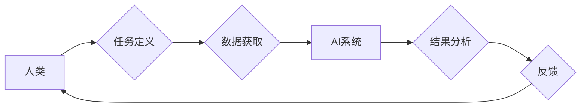

                 

## 人类-AI协作：增强人类潜能与AI能力的融合发展前景

> 关键词：人工智能、协作、人类潜能、AI能力、融合发展、未来趋势

### 1. 背景介绍

人工智能（AI）技术近年来发展迅速，已渗透到各个领域，深刻地改变着人类的生活方式和工作模式。从自动驾驶、语音识别到医疗诊断、金融分析，AI的应用场景日益广泛，其强大的计算能力和数据处理能力为人类社会带来了前所未有的机遇。然而，AI技术也面临着一些挑战，例如数据偏差、算法透明度、伦理道德等问题。

人类-AI协作，即人类与人工智能系统共同完成任务，已成为解决这些挑战和充分发挥AI潜力的重要方向。这种协作模式强调人类和AI的互补性，将人类的创造力、决策能力和情感智能与AI的计算能力、数据分析能力和自动化能力相结合，从而实现1+1>2的效果。

### 2. 核心概念与联系

**2.1 核心概念**

* **人类潜能:** 指人类的认知能力、创造力、情感智能、解决问题的能力等方面的潜力。
* **AI能力:** 指人工智能系统在计算、数据分析、模式识别、决策等方面的能力。
* **协作:** 指人类和AI系统在共同目标下，相互配合、分工合作，共同完成任务的过程。

**2.2 协作模式**

人类-AI协作模式可以分为以下几种：

* **监督式协作:** 人类提供指导和监督，AI系统根据人类的指示执行任务。
* **自主式协作:** AI系统能够自主学习和决策，人类提供反馈和调整。
* **混合式协作:** 结合监督式和自主式协作，根据任务的不同灵活切换协作模式。

**2.3 架构图**



### 3. 核心算法原理 & 具体操作步骤

**3.1 算法原理概述**

人类-AI协作的核心算法原理是基于机器学习、深度学习和自然语言处理等人工智能技术，通过训练模型，使AI系统能够理解人类的指令、需求和意图，并提供相应的帮助和支持。

**3.2 算法步骤详解**

1. **数据收集和预处理:** 收集人类和AI系统交互的数据，并进行清洗、转换和格式化处理。
2. **模型训练:** 使用机器学习算法训练AI模型，使模型能够识别人类的意图和需求，并生成相应的响应。
3. **模型评估和优化:** 对训练好的模型进行评估，并根据评估结果进行调整和优化，提高模型的准确性和效率。
4. **系统部署和运行:** 将训练好的模型部署到实际应用场景中，并与人类系统进行交互。
5. **持续学习和改进:** 收集用户反馈和交互数据，不断更新和改进AI模型，使其能够更好地适应人类的需求。

**3.3 算法优缺点**

* **优点:**
    * 能够提高人类的工作效率和生产力。
    * 能够帮助人类解决复杂问题，并做出更明智的决策。
    * 能够提供个性化和定制化的服务。
* **缺点:**
    * 需要大量的训练数据和计算资源。
    * 模型的准确性和可靠性需要不断提高。
    * 存在伦理道德和安全风险。

**3.4 算法应用领域**

* **医疗保健:** 辅助医生诊断疾病、制定治疗方案、提供个性化医疗服务。
* **教育:** 提供个性化学习辅导、自动批改作业、辅助教师教学。
* **金融:** 识别欺诈交易、评估风险、提供理财建议。
* **制造业:** 自动化生产流程、优化生产效率、预测设备故障。

### 4. 数学模型和公式 & 详细讲解 & 举例说明

**4.1 数学模型构建**

人类-AI协作可以抽象为一个博弈模型，其中人类和AI系统是参与者，任务完成是目标，奖励机制是激励机制。

**4.2 公式推导过程**

假设人类和AI系统分别采取策略 $h$ 和 $a$，任务完成的概率为 $P(h,a)$，奖励函数为 $R(h,a)$。则人类-AI协作的期望奖励可以表示为：

$$
E[R] = \sum_{h} \sum_{a} P(h,a) R(h,a)
$$

**4.3 案例分析与讲解**

例如，在自动驾驶场景中，人类驾驶员和AI系统共同控制车辆行驶。人类驾驶员负责制定全局路线和应对突发情况，AI系统负责控制车辆的加速、减速、转向等细节。

在该场景下，任务完成的概率 $P(h,a)$ 可以根据人类驾驶员的决策和AI系统的控制效果来评估。奖励函数 $R(h,a)$ 可以根据车辆行驶的安全性和效率来定义。

通过优化期望奖励 $E[R]$，可以找到人类和AI系统协作的最佳策略组合，从而实现安全、高效的自动驾驶。

### 5. 项目实践：代码实例和详细解释说明

**5.1 开发环境搭建**

* 操作系统: Ubuntu 20.04
* Python 版本: 3.8
* 必要的库: TensorFlow, PyTorch, NLTK

**5.2 源代码详细实现**

```python
# 人类-AI协作聊天机器人示例代码

import nltk
from nltk.chat.util import Chat, reflections

pairs = [
    [
        r"我的名字是什么？",
        ["你的名字是什么？",]
    ],
    [
        r"你好",
        ["你好！", "嗨！", "元気？"]
    ],
    [
        r"再见",
        ["再见！", "下次见！", "拜拜！"]
    ],
]

chatbot = Chat(pairs, reflections)
print("聊天机器人启动成功！")

while True:
    user_input = input("你:")
    response = chatbot.respond(user_input)
    print("机器人:", response)
```

**5.3 代码解读与分析**

该代码实现了一个简单的聊天机器人，它使用NLTK库中的`Chat`类来处理用户输入和生成响应。

* `pairs`列表定义了聊天机器人的知识库，包含了一些常见问答对。
* `reflections`字典定义了聊天机器人的反射规则，例如将“你”替换为“我”。
* `chatbot.respond(user_input)`方法根据用户输入，从知识库中查找匹配的响应，并返回给用户。

**5.4 运行结果展示**

```
聊天机器人启动成功！
你: 你好
机器人: 嗨！
你: 我的名字是什么？
机器人: 你的名字是什么？
你: 我叫禅
机器人: 禅，你好！
你: 再见
机器人: 下次见！
```

### 6. 实际应用场景

**6.1 医疗保健**

* **辅助诊断:** AI系统可以分析患者的病历、影像数据和基因信息，辅助医生进行诊断。
* **个性化治疗:** AI系统可以根据患者的个体特征，制定个性化的治疗方案。
* **远程医疗:** AI系统可以帮助医生远程诊断和治疗患者，提高医疗服务的覆盖范围。

**6.2 教育**

* **个性化学习:** AI系统可以根据学生的学习进度和能力，提供个性化的学习辅导。
* **自动批改作业:** AI系统可以自动批改学生的作业，节省教师的时间和精力。
* **智能教学助手:** AI系统可以作为教师的助手，提供教学资源、解答学生疑问等。

**6.3 金融**

* **欺诈检测:** AI系统可以分析交易数据，识别异常交易，防止欺诈行为。
* **风险评估:** AI系统可以评估投资风险，帮助投资者做出更明智的决策。
* **个性化理财:** AI系统可以根据用户的财务状况和风险偏好，提供个性化的理财建议。

**6.4 未来应用展望**

随着人工智能技术的不断发展，人类-AI协作将在更多领域得到应用，例如：

* **科学研究:** AI系统可以辅助科学家进行数据分析、模型构建和实验设计。
* **艺术创作:** AI系统可以与人类艺术家合作，创作新的艺术作品。
* **社会治理:** AI系统可以帮助政府部门进行决策分析、资源分配和公共服务管理。

### 7. 工具和资源推荐

**7.1 学习资源推荐**

* **在线课程:** Coursera, edX, Udacity
* **书籍:**
    * 《深度学习》
    * 《人工智能：一种现代方法》
    * 《机器学习实战》
* **开源项目:** TensorFlow, PyTorch, OpenAI

**7.2 开发工具推荐**

* **编程语言:** Python, Java, C++
* **机器学习框架:** TensorFlow, PyTorch, scikit-learn
* **数据处理工具:** Pandas, NumPy

**7.3 相关论文推荐**

* **《Attention Is All You Need》**
* **《BERT: Pre-training of Deep Bidirectional Transformers for Language Understanding》**
* **《Generative Pre-trained Transformer 3》**

### 8. 总结：未来发展趋势与挑战

**8.1 研究成果总结**

人类-AI协作领域取得了显著的进展，例如在医疗诊断、教育辅导、金融风险评估等领域取得了成功应用。

**8.2 未来发展趋势**

* **更智能的AI系统:** AI系统将更加智能、灵活和自主，能够更好地理解和响应人类的需求。
* **更广泛的应用场景:** 人类-AI协作将应用于更多领域，例如科学研究、艺术创作、社会治理等。
* **更人性化的交互方式:** 人类-AI交互方式将更加自然、直观和人性化。

**8.3 面临的挑战**

* **算法透明度和可解释性:** AI系统的决策过程往往难以理解，这可能会导致信任问题和伦理风险。
* **数据安全和隐私保护:** 人类-AI协作需要大量的数据，如何确保数据的安全和隐私保护是一个重要挑战。
* **社会影响和伦理问题:** 人类-AI协作可能会对就业市场、社会结构和伦理道德产生深远影响，需要进行深入的思考和讨论。

**8.4 研究展望**

未来研究将重点关注以下几个方面:

* **开发更透明、可解释的AI算法。**
* **建立更完善的数据安全和隐私保护机制。**
* **探讨人类-AI协作的社会影响和伦理问题，并制定相应的政策和规范。**


### 9. 附录：常见问题与解答

**9.1 如何提高AI系统的准确性？**

* 使用更丰富、更准确的数据进行训练。
* 优化算法模型，提高模型的学习能力。
* 使用更先进的机器学习技术，例如深度学习。

**9.2 如何解决AI系统的数据偏差问题？**

* 使用更多元化的数据进行训练，减少数据偏差。
* 开发算法来识别和纠正数据偏差。
* 持续收集和更新数据，保持数据的最新性和准确性。

**9.3 人类-AI协作会取代人类工作吗？**

人类-AI协作旨在增强人类的能力，而不是取代人类工作。AI系统可以帮助人类完成重复性、繁琐性工作，释放人类的创造力和决策能力。


作者：禅与计算机程序设计艺术 / Zen and the Art of Computer Programming 
<end_of_turn>

