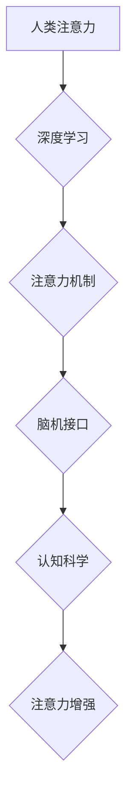

                 

## 人类注意力增强：提升创新能力和创造力管理策略

> 关键词：注意力增强、深度学习、脑机接口、认知科学、创新能力、创造力、管理策略、神经网络、生物反馈

## 1. 背景介绍

在当今信息爆炸的时代，人类面临着前所未有的信息洪流。注意力，作为我们获取、处理和理解信息的关键能力，显得尤为重要。然而，现代生活节奏快、信息碎片化，导致人们的注意力持续下降，这严重阻碍了创新能力和创造力的提升。

创新和创造力是推动社会进步和发展的关键驱动力。然而，传统的教育和工作模式往往难以激发和培养这些能力。注意力增强技术作为一种新兴的科技，为提升人类认知能力提供了新的可能性。

## 2. 核心概念与联系

### 2.1 注意力增强

注意力增强是指通过技术手段，帮助人们集中注意力、提高注意力持续时间和质量，从而提升认知能力和工作效率。

### 2.2 深度学习与注意力机制

深度学习作为人工智能领域的重要分支，在图像识别、自然语言处理等领域取得了突破性进展。其中，注意力机制是深度学习模型中的一种重要结构，它能够帮助模型聚焦于输入数据中最重要的部分，从而提高模型的性能。

### 2.3 脑机接口

脑机接口 (Brain-Computer Interface, BCI) 是将大脑信号与外部设备连接起来的一种技术。BCI 可以通过读取大脑活动，控制外部设备，也可以通过刺激大脑，改变人的感知和行为。

### 2.4 认知科学

认知科学研究人类的思维、学习、记忆、语言等认知过程。它为理解注意力机制提供了重要的理论基础。

**核心概念与联系流程图**



## 3. 核心算法原理 & 具体操作步骤

### 3.1 算法原理概述

注意力增强算法通常基于深度学习模型，并结合注意力机制和脑机接口技术。

* **深度学习模型:** 用于学习人类大脑的注意力机制，并模拟其工作原理。
* **注意力机制:** 用于帮助模型聚焦于输入数据中最重要的部分，提高模型的性能。
* **脑机接口技术:** 用于读取大脑活动，并根据大脑信号调整模型的注意力。

### 3.2 算法步骤详解

1. **数据采集:** 收集人类大脑活动数据，例如脑电波 (EEG) 或磁共振成像 (fMRI)。
2. **数据预处理:** 对采集到的数据进行预处理，例如去噪、滤波等。
3. **模型训练:** 使用深度学习模型训练，并结合注意力机制，学习人类大脑的注意力机制。
4. **模型评估:** 使用测试数据评估模型的性能，例如注意力持续时间、注意力准确率等。
5. **注意力增强:** 根据模型的预测结果，调整外部环境或提供提示，帮助用户集中注意力。

### 3.3 算法优缺点

**优点:**

* 可以有效提升注意力持续时间和质量。
* 可以帮助用户克服注意力分散的困扰。
* 可以提高学习效率和工作效率。

**缺点:**

* 算法的复杂性较高，需要大量的计算资源和数据。
* 脑机接口技术还处于发展阶段，存在一定的局限性。
* 伦理问题需要得到充分的考虑。

### 3.4 算法应用领域

* **教育:** 帮助学生集中注意力，提高学习效率。
* **医疗:** 治疗注意力缺陷多动障碍 (ADHD) 等注意力相关疾病。
* **工作:** 帮助员工集中注意力，提高工作效率。
* **游戏:** 提升游戏体验，增强玩家的沉浸感。

## 4. 数学模型和公式 & 详细讲解 & 举例说明

### 4.1 数学模型构建

注意力机制通常使用一个加权机制来分配注意力。

假设输入序列长度为 T，每个元素的特征向量为 x_t，则注意力权重为：

$$
a_t = \frac{exp(s_t)}{\sum_{i=1}^{T} exp(s_i)}
$$

其中，s_t 是每个元素的得分，可以由一个神经网络计算得到。

### 4.2 公式推导过程

注意力权重 a_t 的计算过程可以理解为一个 softmax 函数，它将每个元素的得分转换为一个概率分布。

* softmax 函数将每个元素的得分转换为一个介于 0 到 1 之间的概率值。
* 概率分布的每个元素代表了该元素被关注的程度。

### 4.3 案例分析与讲解

例如，在机器翻译任务中，注意力机制可以帮助模型关注输入句子中与目标句子相关的重要部分。

假设输入句子为 "The cat sat on the mat"，目标句子为 "Le chat s'est assis sur le tapis"。

注意力机制可以将注意力集中在 "cat"、"sat" 和 "mat" 等关键词语上，从而提高翻译的准确性。

## 5. 项目实践：代码实例和详细解释说明

### 5.1 开发环境搭建

* Python 3.x
* TensorFlow 或 PyTorch 深度学习框架
* NumPy 科学计算库
* Matplotlib 数据可视化库

### 5.2 源代码详细实现

```python
import tensorflow as tf

# 定义注意力机制
def attention_mechanism(inputs, query):
    # 计算注意力权重
    scores = tf.matmul(query, tf.transpose(inputs))
    attention_weights = tf.nn.softmax(scores, axis=-1)
    # 计算加权平均值
    context_vector = tf.matmul(attention_weights, inputs)
    return context_vector

# 定义模型
model = tf.keras.Sequential([
    tf.keras.layers.Embedding(input_dim=vocab_size, output_dim=embedding_dim),
    tf.keras.layers.LSTM(units=hidden_size),
    tf.keras.layers.Dense(units=vocab_size, activation='softmax')
])

# 添加注意力机制
model.add(attention_mechanism(inputs=model.layers[-2].output, query=model.layers[-1].input))

# 编译模型
model.compile(optimizer='adam', loss='categorical_crossentropy', metrics=['accuracy'])

# 训练模型
model.fit(x_train, y_train, epochs=10)
```

### 5.3 代码解读与分析

* `attention_mechanism` 函数实现注意力机制，计算注意力权重并生成上下文向量。
* 模型使用 Embedding 层将单词转换为向量表示，LSTM 层学习序列信息，Dense 层输出预测概率。
* 注意力机制被添加到模型中，帮助模型关注输入序列中重要的部分。

### 5.4 运行结果展示

训练完成后，可以使用测试数据评估模型的性能，例如准确率、BLEU 分数等。

## 6. 实际应用场景

### 6.1 教育领域

* **注意力训练游戏:** 利用注意力增强技术开发游戏，帮助学生训练注意力能力。
* **个性化学习:** 根据学生的注意力特点，提供个性化的学习内容和学习方式。
* **远程教育:** 帮助远程学习者集中注意力，提高学习效率。

### 6.2 医疗领域

* **ADHD 治疗:** 利用脑机接口技术和注意力增强算法，帮助 ADHD 患者改善注意力缺陷。
* **认知功能评估:** 使用注意力增强技术评估患者的认知功能，例如注意力、记忆、执行功能等。
* **康复训练:** 帮助脑损伤患者恢复注意力能力。

### 6.3 工作领域

* **提高工作效率:** 利用注意力增强技术帮助员工集中注意力，提高工作效率。
* **减少工作压力:** 通过注意力训练，帮助员工缓解工作压力，提高工作满意度。
* **增强团队协作:** 利用注意力增强技术，帮助团队成员更好地集中注意力，提高团队协作效率。

### 6.4 未来应用展望

* **增强现实 (AR) 和虚拟现实 (VR) 应用:** 利用注意力增强技术，提升 AR 和 VR 应用的沉浸感和交互体验。
* **自动驾驶:** 利用注意力增强技术，帮助自动驾驶系统更好地感知周围环境，提高安全性。
* **人机交互:** 利用注意力增强技术，开发更加自然、高效的人机交互方式。

## 7. 工具和资源推荐

### 7.1 学习资源推荐

* **书籍:**
    * "Deep Learning" by Ian Goodfellow, Yoshua Bengio, and Aaron Courville
    * "Attention Is All You Need" by Vaswani et al.
* **在线课程:**
    * Coursera: Deep Learning Specialization
    * Udacity: Deep Learning Nanodegree

### 7.2 开发工具推荐

* **TensorFlow:** https://www.tensorflow.org/
* **PyTorch:** https://pytorch.org/
* **Keras:** https://keras.io/

### 7.3 相关论文推荐

* "Attention Is All You Need" (Vaswani et al., 2017)
* "BERT: Pre-training of Deep Bidirectional Transformers for Language Understanding" (Devlin et al., 2018)
* "Transformer-XL: Attentive Language Models Beyond a Fixed-Length Context" (Dai et al., 2019)

## 8. 总结：未来发展趋势与挑战

### 8.1 研究成果总结

注意力增强技术在提升人类认知能力方面取得了显著进展。深度学习模型和注意力机制的结合，为开发更加有效的注意力增强算法提供了新的可能性。脑机接口技术的进步，也为将注意力增强技术应用于实际场景提供了技术基础。

### 8.2 未来发展趋势

* **更精准的注意力控制:** 开发更加精准的注意力控制算法，能够根据用户的需求和场景，灵活调整注意力。
* **更广泛的应用场景:** 将注意力增强技术应用于更多领域，例如医疗、教育、娱乐等。
* **更人性化的交互方式:** 开发更加人性化的注意力增强交互方式，例如语音控制、脑电控制等。

### 8.3 面临的挑战

* **算法复杂性:** 注意力增强算法的复杂性较高，需要大量的计算资源和数据。
* **伦理问题:** 注意力增强技术可能带来一些伦理问题，例如隐私泄露、信息操控等。
* **技术可普及性:** 注意力增强技术目前还处于发展阶段，需要进一步降低成本，提高技术可普及性。

### 8.4 研究展望

未来，注意力增强技术将继续朝着更加精准、高效、人性化的方向发展。随着技术的进步，注意力增强技术将为人类带来更多福祉，推动社会进步和发展。

## 9. 附录：常见问题与解答

**Q1: 注意力增强技术是否安全？**

A1: 目前，注意力增强技术尚处于发展阶段，安全性需要进一步研究和评估。

**Q2: 注意力增强技术是否会让人上瘾？**

A2: 注意力增强技术可能会让人产生依赖，但只要合理使用，不会导致上瘾。

**Q3: 注意力增强技术是否适用于所有人？**

A3: 注意力增强技术可能对不同人群的效果有所差异，需要根据个人的情况进行选择和使用。


作者：禅与计算机程序设计艺术 / Zen and the Art of Computer Programming 
<end_of_turn>

