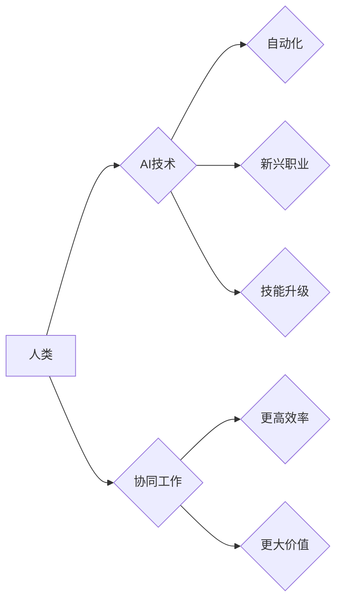

                 

## 人类计算：AI时代的未来就业市场与技能要求

> 关键词：人工智能、未来就业、技能需求、人类计算、自动化、机器学习、数据分析、编程、软技能

## 1. 背景介绍

人工智能（AI）正以惊人的速度发展，其影响力正在深刻地改变着我们的世界。从自动驾驶汽车到个性化医疗，AI技术正在各个领域展现出巨大的潜力。然而，这种快速发展也引发了人们对未来就业市场和技能需求的担忧。

传统的工作模式正在被自动化所取代，许多重复性、规则性工作将由机器完成。这使得许多人担心自己会被AI所取代，失去工作机会。然而，AI的发展也创造了新的工作机会，需要具备新技能的人才来应对新的挑战。

## 2. 核心概念与联系

**2.1 人类计算**

人类计算是指人类利用其认知能力、创造力、判断力和解决问题的能力来完成计算任务。它强调人类在AI时代仍然不可替代的价值，因为人类拥有独特的思维方式和情感智能，能够进行复杂判断、理解上下文和进行创新。

**2.2 AI时代就业市场变化**

AI技术的发展将导致就业市场发生深刻变化：

* **自动化取代:** 许多重复性、规则性工作将被自动化完成，例如数据录入、客服服务等。
* **新兴职业:** AI技术的发展将催生新的职业，例如AI工程师、数据科学家、机器学习专家等。
* **技能升级:** 现有的工作岗位将对员工提出更高的技能要求，例如数据分析、编程、沟通能力等。

**2.3 人类与AI协同工作**

未来，人类和AI将更加紧密地协同工作。人类将发挥其创造力、判断力和解决问题的能力，而AI将提供数据分析、自动化处理等方面的支持。这种协同模式将提高工作效率，创造更大的价值。

**Mermaid 流程图**



## 3. 核心算法原理 & 具体操作步骤

**3.1 算法原理概述**

机器学习算法是AI的核心技术之一，它通过训练数据来学习模式和规律，从而实现预测、分类、聚类等功能。常见的机器学习算法包括：

* **监督学习:** 利用标记数据训练模型，例如分类、回归等。
* **无监督学习:** 利用未标记数据发现模式和结构，例如聚类、降维等。
* **强化学习:** 通过试错学习，实现目标最大化，例如游戏AI、机器人控制等。

**3.2 算法步骤详解**

以监督学习为例，其基本步骤如下：

1. **数据收集和预处理:** 收集相关数据，并进行清洗、转换、特征工程等预处理工作。
2. **模型选择:** 根据任务需求选择合适的机器学习模型，例如线性回归、逻辑回归、决策树等。
3. **模型训练:** 利用训练数据训练模型，调整模型参数，使其能够准确地预测或分类。
4. **模型评估:** 利用测试数据评估模型的性能，例如准确率、召回率、F1-score等。
5. **模型部署:** 将训练好的模型部署到实际应用场景中，用于预测或分类新的数据。

**3.3 算法优缺点**

**优点:**

* 自动化学习：无需人工编程，模型可以自动学习数据中的规律。
* 高精度：在特定领域，机器学习模型可以达到甚至超过人类的预测精度。
* 可扩展性强：可以处理海量数据，并随着数据量的增加不断提高精度。

**缺点:**

* 数据依赖性强：模型的性能取决于训练数据的质量和数量。
* 黑盒效应：一些复杂的机器学习模型难以解释其决策过程，导致缺乏可解释性。
* 容易过拟合：模型过拟合训练数据，导致在实际应用中性能下降。

**3.4 算法应用领域**

机器学习算法广泛应用于各个领域，例如：

* **图像识别:** 人脸识别、物体检测、图像分类等。
* **自然语言处理:** 文本分类、情感分析、机器翻译等。
* **推荐系统:** 商品推荐、内容推荐、个性化服务等。
* **金融领域:** 欺诈检测、风险评估、投资预测等。
* **医疗领域:** 疾病诊断、药物研发、个性化医疗等。

## 4. 数学模型和公式 & 详细讲解 & 举例说明

**4.1 数学模型构建**

机器学习算法通常基于数学模型，例如线性回归模型、逻辑回归模型、决策树模型等。这些模型通过数学公式来描述数据之间的关系，并利用训练数据来估计模型参数。

**4.2 公式推导过程**

以线性回归模型为例，其目标是找到一条直线，使得该直线与训练数据点的距离最小。

线性回归模型的数学公式如下：

$$y = w_0 + w_1x_1 + w_2x_2 + ... + w_nx_n$$

其中：

* $y$ 是预测值
* $w_0, w_1, w_2, ..., w_n$ 是模型参数
* $x_1, x_2, ..., x_n$ 是输入特征

模型参数的估计可以通过最小二乘法来实现。最小二乘法试图找到一条直线，使得所有数据点到直线的距离的平方和最小。

**4.3 案例分析与讲解**

假设我们想要预测房价，输入特征包括房屋面积、房间数量、地理位置等。我们可以使用线性回归模型来建立房价预测模型。

通过训练数据，我们可以估计模型参数 $w_0, w_1, w_2, ..., w_n$。然后，我们可以使用这个模型来预测新的房屋价格。

## 5. 项目实践：代码实例和详细解释说明

**5.1 开发环境搭建**

可以使用Python语言和相关的机器学习库，例如Scikit-learn，来实现机器学习项目。

**5.2 源代码详细实现**

```python
from sklearn.linear_model import LinearRegression
from sklearn.model_selection import train_test_split
import pandas as pd

# 加载数据
data = pd.read_csv('house_price.csv')

# 分割数据
X = data[['area', 'rooms']]
y = data['price']
X_train, X_test, y_train, y_test = train_test_split(X, y, test_size=0.2, random_state=42)

# 创建线性回归模型
model = LinearRegression()

# 训练模型
model.fit(X_train, y_train)

# 预测测试数据
y_pred = model.predict(X_test)

# 评估模型性能
from sklearn.metrics import mean_squared_error
mse = mean_squared_error(y_test, y_pred)
print('Mean Squared Error:', mse)
```

**5.3 代码解读与分析**

这段代码首先加载了房价数据，然后将数据分割为训练集和测试集。接着，创建了一个线性回归模型，并使用训练数据训练模型。最后，使用测试数据预测房价，并计算模型的均方误差来评估模型性能。

**5.4 运行结果展示**

运行代码后，会输出模型的均方误差值。这个值越小，表示模型的预测精度越高。

## 6. 实际应用场景

**6.1 医疗诊断**

AI可以帮助医生分析患者的病历、影像数据等，提高诊断的准确性和效率。例如，AI可以帮助医生识别癌症、心血管疾病等。

**6.2 金融风险评估**

AI可以分析客户的财务数据、交易记录等，评估客户的信用风险和投资风险。

**6.3 个性化教育**

AI可以根据学生的学习进度和能力，提供个性化的学习内容和辅导。

**6.4 自动驾驶**

AI可以帮助汽车感知周围环境、做出驾驶决策，实现自动驾驶。

**6.5 未来应用展望**

AI技术的发展将继续推动各个领域的创新，例如：

* **更智能的机器人:** AI将赋予机器人更强的感知能力、决策能力和交互能力。
* **更精准的医疗:** AI将帮助医生进行更精准的诊断、治疗和预防。
* **更个性化的服务:** AI将提供更个性化的产品、服务和体验。

## 7. 工具和资源推荐

**7.1 学习资源推荐**

* **在线课程:** Coursera、edX、Udacity等平台提供丰富的AI课程。
* **书籍:** 《深度学习》、《机器学习实战》等书籍是学习AI的基础教材。
* **开源项目:** TensorFlow、PyTorch等开源项目可以帮助你实践AI技术。

**7.2 开发工具推荐**

* **Python:** Python是AI开发最常用的编程语言。
* **Scikit-learn:** Scikit-learn是Python最常用的机器学习库。
* **TensorFlow:** TensorFlow是Google开发的开源深度学习框架。
* **PyTorch:** PyTorch是Facebook开发的开源深度学习框架。

**7.3 相关论文推荐**

* **《ImageNet Classification with Deep Convolutional Neural Networks》**
* **《Attention Is All You Need》**
* **《BERT: Pre-training of Deep Bidirectional Transformers for Language Understanding》**

## 8. 总结：未来发展趋势与挑战

**8.1 研究成果总结**

近年来，AI技术取得了长足的进步，在各个领域都展现出巨大的潜力。

**8.2 未来发展趋势**

* **更强大的计算能力:** 随着硬件技术的进步，AI模型将变得更加强大，能够处理更复杂的任务。
* **更广泛的应用场景:** AI技术将应用于更多领域，例如教育、医疗、金融等。
* **更注重可解释性:** 人们将更加关注AI模型的透明度和可解释性。

**8.3 面临的挑战**

* **数据安全和隐私:** AI模型的训练需要大量数据，如何保证数据的安全和隐私是一个重要的挑战。
* **算法偏见:** AI模型可能存在算法偏见，导致不公平的结果。
* **伦理问题:** AI技术的应用引发了一些伦理问题，例如人工智能的责任和义务。

**8.4 研究展望**

未来，AI研究将继续探索更强大的算法、更广泛的应用场景和更完善的伦理规范。


## 9. 附录：常见问题与解答

**9.1 如何学习AI技术？**

学习AI技术需要掌握一定的数学基础、编程能力和机器学习知识。可以参考上述学习资源推荐。

**9.2 AI技术会取代所有工作吗？**

AI技术会改变一些工作模式，但不会完全取代所有工作。AI将创造新的工作机会，需要具备新技能的人才来应对新的挑战。

**9.3 如何应对AI带来的挑战？**

我们需要积极学习新技能，适应不断变化的就业市场。同时，也要关注AI技术的伦理问题，确保其安全、公平、可持续地发展。


作者：禅与计算机程序设计艺术 / Zen and the Art of Computer Programming 
<end_of_turn>

