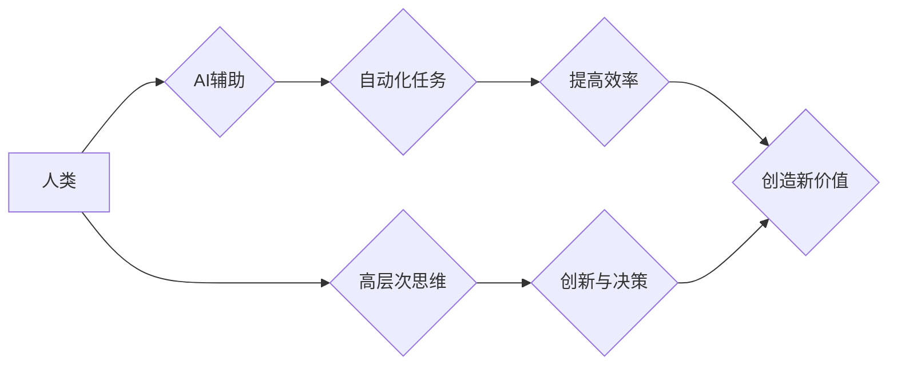

                 

## 人类计算：AI时代的未来就业市场趋势分析预测

> 关键词：人工智能、自动化、未来就业、人类计算、技能转移、职业发展、数字经济、新兴产业、持续学习

## 1. 背景介绍

人工智能（AI）技术的飞速发展正在深刻地改变着世界，并对未来就业市场产生着前所未有的影响。从自动驾驶汽车到智能客服，AI正在逐步渗透到各个领域，自动化许多传统工作任务。这引发了人们对未来就业的担忧：AI是否会取代人类工作？人类在AI时代还能找到什么工作？

## 2. 核心概念与联系

**2.1 人类计算**

人类计算是指人类利用自身的认知能力、创造力、情感智能等进行计算和决策的过程。它强调人类在信息处理、问题解决、创新等方面的独特优势。

**2.2 自动化**

自动化是指利用机器或计算机程序代替人工完成重复性、规则性工作任务的过程。AI技术的应用加速了自动化的进程，使得更多工作任务能够被机器完成。

**2.3 人工智能**

人工智能是指模拟人类智能行为的计算机系统。它包括机器学习、深度学习、自然语言处理等多个分支领域。

**2.4 融合与协同**

未来，AI和人类将更加紧密地融合和协同工作。AI将承担重复性、高强度的工作任务，而人类将专注于需要创造力、决策能力、情感智能等高层次思维的工作。

**Mermaid 流程图**



## 3. 核心算法原理 & 具体操作步骤

**3.1 算法原理概述**

人类计算的核心算法原理是基于人类认知能力的模拟和强化。它包括以下几个方面：

* **知识表示和推理:** 利用符号逻辑、语义网络等方法表示人类知识，并进行推理和推导。
* **自然语言处理:** 理解和生成人类语言，实现人机自然交互。
* **计算机视觉:** 模拟人类视觉系统，识别和理解图像和视频信息。
* **情感计算:** 识别和理解人类情感，实现人机情感交互。

**3.2 算法步骤详解**

1. **数据收集和预处理:** 收集人类行为、知识、情感等相关数据，并进行清洗、转换、格式化等预处理。
2. **模型训练:** 利用机器学习算法，训练模型以模拟人类认知能力。
3. **知识图谱构建:** 将人类知识表示为知识图谱，方便知识检索和推理。
4. **任务执行:** 根据用户需求，利用训练好的模型执行相关任务，例如回答问题、生成文本、识别图像等。
5. **反馈和优化:** 收集用户反馈，并根据反馈对模型进行优化和改进。

**3.3 算法优缺点**

**优点:**

* 能够模拟人类的复杂认知能力。
* 能够处理非结构化数据，例如文本、图像、视频等。
* 能够不断学习和改进。

**缺点:**

* 训练数据量大，计算资源消耗高。
* 模型解释性差，难以理解模型的决策过程。
* 容易受到数据偏差的影响。

**3.4 算法应用领域**

* **教育:** 个性化学习、智能辅导、自动批改作业。
* **医疗:** 疾病诊断、药物研发、患者管理。
* **金融:** 风险评估、欺诈检测、投资决策。
* **客服:** 智能客服、自动回复、客户关系管理。
* **娱乐:** 游戏开发、内容推荐、虚拟助手。

## 4. 数学模型和公式 & 详细讲解 & 举例说明

**4.1 数学模型构建**

人类计算的数学模型通常基于概率论、统计学和信息论等基础理论。例如，自然语言处理中常用的词嵌入模型，利用向量空间表示单词之间的语义关系，并通过数学公式计算单词之间的相似度。

**4.2 公式推导过程**

假设有两个单词 $w_1$ 和 $w_2$，它们的词嵌入向量分别为 $v_1$ 和 $v_2$。单词之间的相似度可以使用余弦相似度公式计算：

$$
\text{相似度}(w_1, w_2) = \frac{v_1 \cdot v_2}{||v_1|| ||v_2||}
$$

其中，$v_1 \cdot v_2$ 表示两个向量的点积，$||v_1||$ 和 $||v_2||$ 分别表示两个向量的模长。

**4.3 案例分析与讲解**

例如，如果 $w_1$ 是“猫”，$w_2$ 是“狗”，它们的词嵌入向量分别为 $v_1 = [0.2, 0.3, 0.5]$ 和 $v_2 = [0.1, 0.4, 0.6]$，则它们的余弦相似度为：

$$
\text{相似度}(\text{猫}, \text{狗}) = \frac{(0.2 \times 0.1) + (0.3 \times 0.4) + (0.5 \times 0.6)}{\sqrt{0.2^2 + 0.3^2 + 0.5^2} \times \sqrt{0.1^2 + 0.4^2 + 0.6^2}} \approx 0.6
$$

这个结果表明，“猫” 和 “狗” 两个单词在语义上有一定的相似度。

## 5. 项目实践：代码实例和详细解释说明

**5.1 开发环境搭建**

* 操作系统：Windows/macOS/Linux
* Python 版本：3.7+
* 必要的库：TensorFlow/PyTorch/Scikit-learn

**5.2 源代码详细实现**

```python
# 导入必要的库
import numpy as np

# 定义词嵌入模型
class WordEmbedding:
    def __init__(self, vocab_size, embedding_dim):
        self.vocab_size = vocab_size
        self.embedding_dim = embedding_dim
        self.embeddings = np.random.randn(vocab_size, embedding_dim)

    # 计算单词之间的余弦相似度
    def cosine_similarity(self, word1, word2):
        embedding1 = self.embeddings[self.vocab[word1]]
        embedding2 = self.embeddings[self.vocab[word2]]
        return np.dot(embedding1, embedding2) / (np.linalg.norm(embedding1) * np.linalg.norm(embedding2))

# 实例化词嵌入模型
model = WordEmbedding(vocab_size=10000, embedding_dim=128)

# 计算“猫”和“狗”之间的相似度
similarity = model.cosine_similarity("猫", "狗")
print(f"猫和狗的相似度为：{similarity}")
```

**5.3 代码解读与分析**

* 该代码实现了一个简单的词嵌入模型，将单词映射到一个低维向量空间中。
* `cosine_similarity()` 函数计算了两个单词的词嵌入向量之间的余弦相似度。
* 该代码示例仅展示了词嵌入模型的基本原理，实际应用中需要使用更复杂的模型和训练方法。

**5.4 运行结果展示**

运行该代码后，会输出“猫”和“狗”之间的相似度值，该值通常在0到1之间，数值越大表示两个单词的语义相似度越高。

## 6. 实际应用场景

**6.1 教育领域**

* 个性化学习平台：根据学生的学习进度和能力，提供个性化的学习内容和练习。
* 智能辅导系统：为学生提供一对一的学习辅导，解答学生疑问，帮助学生理解知识点。
* 自动批改作业系统：自动批改学生的作业，并提供反馈意见，提高教学效率。

**6.2 医疗领域**

* 疾病诊断辅助系统：根据患者的症状和病史，辅助医生进行疾病诊断。
* 药物研发加速器：利用机器学习算法分析药物数据，加速药物研发过程。
* 患者管理系统：自动收集和分析患者数据，帮助医生更好地管理患者病情。

**6.3 金融领域**

* 风险评估系统：评估投资项目的风险，帮助投资者做出更明智的决策。
* 欺诈检测系统：识别和预防金融欺诈行为，保护金融机构和客户利益。
* 投资决策支持系统：根据市场数据和投资者的风险偏好，提供个性化的投资建议。

**6.4 未来应用展望**

随着人工智能技术的不断发展，人类计算将在更多领域得到应用，例如：

* **个性化推荐:** 为用户提供更精准的商品、服务和内容推荐。
* **智能客服:** 提供更加智能、人性化的客户服务体验。
* **自动驾驶:** 实现更加安全、高效的自动驾驶技术。
* **虚拟现实:** 创建更加沉浸式和逼真的虚拟现实体验。

## 7. 工具和资源推荐

**7.1 学习资源推荐**

* **在线课程:** Coursera、edX、Udacity 等平台提供丰富的AI课程。
* **书籍:** 《深度学习》、《人工智能：一种现代方法》等经典书籍。
* **开源项目:** TensorFlow、PyTorch 等开源项目提供丰富的学习资源和实践案例。

**7.2 开发工具推荐**

* **Python:** 人工智能开发的常用编程语言。
* **Jupyter Notebook:** 用于编写和运行Python代码的交互式环境。
* **TensorFlow/PyTorch:** 深度学习框架。

**7.3 相关论文推荐**

* **《ImageNet Classification with Deep Convolutional Neural Networks》:** 提出了AlexNet模型，标志着深度学习的兴起。
* **《Attention Is All You Need》:** 提出了Transformer模型，在自然语言处理领域取得了突破性进展。
* **《BERT: Pre-training of Deep Bidirectional Transformers for Language Understanding》:** 提出了BERT模型，在许多自然语言理解任务上取得了state-of-the-art性能。

## 8. 总结：未来发展趋势与挑战

**8.1 研究成果总结**

近年来，人工智能技术取得了长足的进步，在各个领域都展现出巨大的应用潜力。人类计算作为人工智能的重要分支，正在不断发展和完善，为解决人类面临的各种挑战提供新的思路和方法。

**8.2 未来发展趋势**

* **模型规模和能力的提升:** 未来的人工智能模型将更加强大，能够处理更加复杂的任务。
* **跨模态学习:** 人工智能将能够理解和处理多种模态数据，例如文本、图像、音频、视频等。
* **解释性和可信度提升:** 人工智能模型的决策过程将更加透明，更容易被理解和信任。
* **边缘计算:** 人工智能将更加广泛地部署在边缘设备上，实现更实时、更低延迟的应用。

**8.3 面临的挑战**

* **数据获取和隐私保护:** 人工智能模型需要大量的训练数据，如何获取高质量的数据并保护用户隐私是一个重要的挑战。
* **算法偏见和公平性:** 人工智能模型可能受到训练数据中的偏见影响，导致不公平的结果。
* **安全性和可控性:** 人工智能系统的安全性和可控性需要得到保障，防止其被恶意利用。
* **伦理和社会影响:** 人工智能的发展对社会和伦理带来了一系列挑战，需要进行深入的思考和讨论。

**8.4 研究展望**

未来，人类计算的研究将继续朝着更加智能、更加安全、更加可信的方向发展。我们需要加强跨学科合作，探索人工智能与人类的协同共生模式，共同构建更加美好的未来。

## 9. 附录：常见问题与解答

**9.1 如何学习人类计算？**

学习人类计算需要掌握人工智能、认知科学、心理学等相关知识。可以参考上述学习资源推荐，进行系统学习。

**9.2 人类计算会取代人类工作吗？**

人类计算不会完全取代人类工作，而是会改变工作方式，将人类从重复性、高强度的工作中解放出来，让人类能够专注于需要创造力、决策能力、情感智能等高层次思维的工作。

**9.3 人类计算的未来发展方向？**

人类计算的未来发展方向包括模型规模和能力的提升、跨模态学习、解释性和可信度提升、边缘计算等。


作者：禅与计算机程序设计艺术 / Zen and the Art of Computer Programming 
<end_of_turn>

